# Development Log
A summary of not particularly concise thoughts, notes and rambles along the way of my development journey of setting up my PC.

This is intended to be for ramblings that are not concise as notes to keep as reference points in the `README`, more rather a log of discoveries

## September 2025
#### Shells
1. Started out with ZSH and spent many many many hours twearing with my `zshrc` file. Ultimately got to something vaguely useful, but it still felt...
- "hacky", like a few weird keybindings entered a strange non-insert state that left me confused
- slow to startup (relatively)
- akward syntax highlighting

2. This led me to fish shell, which just WORKS out the box. but after a while i did notice some quirks that are pretty annoying tbh...
- completions lacking, case and point `git stash` only has `--help` as a completion. not a good start given how popular git is...
- `fzf` extension for zsh just... works, its clean easy to read and actually has all the arguments (more of a repetition of the previous point tbh)
- lacks POSIX compatibility. this is REALLY annoying. its not THAT much better, but writing hyprland scripts (in normal sh) i have to remember its slightly different than fish


3. An alternative option is nushell? could be something more modern that supports data types

#### Vi mode
the annoying alt backspace thing in zsh that enters into a strange mode where i can't insert it actually vim mode! (which is actually useful)

Also, pure has a colour change to yellow on the prompt when in vi mode! can use `w`, `b`, (`j` and `k` to select commands), so actually really useful

## October 2025
Hmmm I should really put more notes from 'README.md` in here (or just break it up better) so I have a concise view of sections and not just random meanderings

### Completion
Well, the completion thing is REALLY annoying as sometimes it breaks and I have no idea why. Taking some notes off claude to try and debug it next time it happens

```bash
# Main Neovim log (all Lua errors, warnings)
~/.local/state/nvim/log

# Or programmatically:
:lua vim.print(vim.fn.stdpath('log'))

# View in real-time:
tail -f ~/.local/state/nvim/log
```

Or for verbosity
```vim
:messages           # In-session messages (cleared on restart)
:messages clear     # Clear message history
:set verbose=9      # Enable verbose logging (0-15, higher = more)
:set verbosefile=/tmp/nvim-verbose.log  # Log to file
```


Or more logs
```bash
# In terminal:
tail -f ~/.local/state/nvim/log
Or in Neovim:
:edit ~/.local/state/nvim/log
```

Or
  :Lazy reload nvim-cmp

Or
  4. Try reloading plugins

  :Lazy reload nvim-cmp
  :Lazy reload noice.nvim

  5. Disable noice temporarily

  :lua package.loaded['noice'] = nil
  :lua vim.cmd('messages clear')
  Then test :e <Tab>

  6. Check cmp status

  :lua vim.print(require('cmp').visible())    # Is menu showing?
  :lua vim.print(require('cmp').get_config()) # Config loaded?

  7. Nuclear option - reload everything

  :Lazy reload nvim-cmp
  :source $MYVIMRC

  ---
  Enable Persistent Verbose Logging

  Add this to your init.lua for debugging:

  -- Only enable when debugging:
  -- vim.opt.verbose = 9
  -- vim.opt.verbosefile = vim.fn.stdpath('cache') .. '/nvim-verbose.log'

  Then you can check that log file whenever things break.

  Want me to create a custom debug command that runs all these checks and outputs a report for you?

### Print buffers
So tried a super simple script to print windows and associated buffers as below (can save in scratchpads)
```lua
local wins = vim.api.nvim_list_wins()
local current_buf = vim.api.nvim_get_current_buf()
for winindex, winid in ipairs(wins) do
  print('processing window #' .. winindex .. ', ID: ' .. winid)

  local bufid = vim.api.nvim_win_get_buf(winid)
  print('window buffer id is ' .. bufid)
  local bufname = vim.api.nvim_buf_get_name(bufid)
  print('buffer name is ' .. bufname)
  if current_buf == bufid then
    print 'is active buffer!'
  end
end
```

and then call with `:luafile scratchpads/...`

Well i've moved scratchpads to a commited dir to git now (except for the brave preferences files). And the updated scripts lives in `./scratchpads/print_bufs.lua`

### Previous boot log
One i ALWAYS forget is to view last boot logs, its `journalctl`, NOT `dmesg`.
```bash
sudo journalctl -b -1
```

### Substitute
Well it turns out mini surround replaces the s key, which would be nice to see the menu?
But claude made a good suggestion just using `c` for change. `cl` changes (left) which is the same thing as s...

### Stylua
While i remember, stylua complaining was nothing to do with conform. It was installed by LSP (for some reason I had added it to list of LSP configurations 🤦‍♂️)
So if i see that one again can just remember to do `:LspUninstall stylua`

### Tmux language server
Keep getting bizarre errors from `tmux-language-server` not sure how to fix on `textDocument/didChange` but honestly not worth my time to dive into... maybe in the future (although lets be honest not going to happen...)
```
[ERROR][2025-10-26 14:16:26] ...p/_transport.lua:36	"rpc"	"tmux-language-server"	"stderr"	"Failed to handle user defined notification \"textDocument/didChange\": (DidChangeTextDocumentParams(text_document=VersionedTextDocumentIdentifier(version=61, uri='file:///home/jollof/coding/dev-setup/configs/tmux.conf'), content_changes=[TextDocumentContentChangeEvent_Type1(range=10:0-11:22, text='', range_length=23)]),)\nTraceback (most recent call last):\n  File \"/nix/store/if0pz9air1s957wd6hfn7xq0j8s1y3yj-python3.13-pygls-1.3.1/lib/python3.13/site-packages/pygls/protocol/lsp_meta.py\", line 21, in decorator\n    self._execute_notification(user_func, *args, **kwargs)\n    ~~~~~~~~~~~~~~~~~~~~~~~~~~^^^^^^^^^^^^^^^^^^^^^^^^^^^^\n  File \"/nix/store/if0pz9air1s957wd6hfn7xq0j8s1y3yj-python3.13-pygls-1.3.1/lib/python3.13/site-packages/pygls/protocol/json_rpc.py\", line 153, in _execute_notification\n    handler(*params)\n    ~~~~~~~^^^^^^^^^\n  File \"/nix/store/q9jh1mj100d56v3wv6sq6784prpazm1v-python3.13-tmux-language-server-0.0.11/lib/python3.13/site-packages/tmux_language_server/server.py\", line 60, in did_change\n    diagnostics = get_diagnostics(\n        document.uri,\n    ...<2 lines>...\n        \"tmux\",\n    )\n  File \"/nix/store/hfmqcvar7yb8dyq3d3b4zqv7bk95rvj3-python3.13-lsp-tree-sitter-0.0.18/lib/python3.13/site-packages/lsp_tree_sitter/diagnose.py\", line 63, in get_diagnostics\n    for diagnostic in get_diagnostics_by_finders(\n                      ~~~~~~~~~~~~~~~~~~~~~~~~~~^\n        uri, tree, finders + [cls(filetype) for cls in finder_classes]\n        ^^^^^^^^^^^^^^^^^^^^^^^^^^^^^^^^^^^^^^^^^^^^^^^^^^^^^^^^^^^^^^\n    )\n    ^\n  File \"/nix/store/hfmqcvar7yb8dyq3d3b4zqv7bk95rvj3-python3.13-lsp-tree-sitter-0.0.18/lib/python3.13/site-packages/lsp_tree_sitter/diagnose.py\", line 36, in get_diagnostics_by_finders\n    for diagnostic in finder.get_diagnostics(uri, tree)\n                      ~~~~~~~~~~~~~~~~~~~~~~^^^^^^^^^^^\n  File \"/nix/store/hfmqcvar7yb8dyq3d3b4zqv7bk95rvj3-python3.13-lsp-tree-sitter-0.0.18/lib/python3.13/site-packages/lsp_tree_sitter/finders.py\", line 553, in get_diagnostics\n    trie.from_path(error.json_path).range,\n    ~~~~~~~~~~~~~~^^^^^^^^^^^^^^^^^\n  File \"/nix/store/hfmqcvar7yb8dyq3d3b4zqv7bk95rvj3-python3.13-lsp-tree-sitter-0.0.18/lib/python3.13/site-packages/lsp_tree_sitter/schema.py\", line 65, in from_path\n    return node.from_relative_path(path)\n           ~~~~~~~~~~~~~~~~~~~~~~~^^^^^^\n  File \"/nix/store/hfmqcvar7yb8dyq3d3b4zqv7bk95rvj3-python3.13-lsp-tree-sitter-0.0.18/lib/python3.13/site-packages/lsp_tree_sitter/schema.py\", line 89, in from_relative_path\n    raise TypeError\nTypeError\n"
```

### Lazy dynamic inspection
Yet another fantastically documented feature of `lazy.vim`

To inspect plugins AFTER loading can use this
```lua
pls = require('lazy.core.config')
print(pls.plugins)
```

There is a throwaway [comment here](https://www.lazyvim.org/configuration/plugins#%EF%B8%8F-adding--disabling-plugin-keymaps) on their docs but it doesn't exactly do much explanation... 🤦‍♂️

So with claudes help I also managed to track custom user events to find when nvim DAP is loaded (as its lazy?)
```lua
local user_event_path = vim.fn.getcwd() .. "/user_events.log"
local f = io.open(user_event_path, "a")
vim.api.nvim_create_autocmd("User", {
	callback = function(args)
		if f ~= nil then
			f:write("got a user event!\n" .. vim.inspect(args) .. "\n")
		end
	end,
})
```

And with that, found what i was after when nvim dap is loaded (on pressing f7 to bring up the UI)
```
{
  buf = 3,
  data = "nvim-dap-ui",
  event = "User",
  file = "LazyLoad",
  id = 150,
  match = "LazyLoad"
}
```


### Debugging
Well I'm FINALLY getting around to attempting to configure debugging, given the need is here.

Seems that kickstar has improved the debugging since I last checked. The only thing remaining to install for JS to work is `:Mason install js-debug-adapter`

Had some weird stuff with `127.0.0.1` not working as the js debug adapter was expecting ipv6? but managed to resolve that.

And the args for ts-node (or i guess I *should* use tsx) need configuring. 

But in general these might change, so i wrote a script that can be executed in luapad

```lua
function printer_util(entry)
  local function inner(key, value, indent)
    if type(value) == 'table' then
      print(string.rep('  ', indent) .. tostring(key))
      for k, v in pairs(value) do
        inner(k, v, indent + 1)
      end
    else
      print(string.rep('  ', indent) .. tostring(key) .. ': ' .. tostring(value))
    end
  end
  inner('_', entry, 0)
end

printer_util("hi")
dap = require('dap')
printer_util(dap.configurations)
```

ok and FINALLY, i have per project no env variable...
```lua
... (see above)
printer_util(dap.configurations)

=> "_: hi"
"_"
"  go"
"    1"
"      type: delve"
"      program: ${workspaceFolder}"
"      request: launch"
"      name: Delve: Debug"
"    2"
    ...
....
"  typescript"
"    1"
"      program: ${file}"
"      env"
"        NO_COLOR: 1"
"      sourceMaps: true"
"      cwd: ${workspaceFolder}"
"      skipFiles"
"        1: <node_internals>/**"
"        2: node_modules/**"
"      request: launch"
"      smartStep: true"
"      runtimeExecutable: npx"
"      name: Launch file"
"      runtimeArgs"
"        1: ts-node"
"        2: ${file}" ]
"      type: pwa-node"
"      outputCapture: std"
```

## November 2025
Ok I have some time gonna try and finally figure out how to setup networking properly so mullvad works
Well firstly i found the arch docs for [resolv.conf here](https://man.archlinux.org/man/resolved.conf.5)

Ok the domains = "~." makes a bit more sense now. have asked claude to give some examples.

```mermaid
graph TD
    A["Your Laptop"] --> B["Two Network Connections"]
    B --> C["eth0<br/>(Wired - Office Network)<br/>DNS: 10.0.0.1, 10.0.0.2"]
    B --> D["wlan0<br/>(WiFi - Home)<br/>DNS: 8.8.8.8, 8.8.4.4"]
    
    C --> E["eth0 Config:<br/>Domains=~corp.local"]
    D --> F["wlan0 Config:<br/>Domains=~home.local"]
    
    E --> G["Query: database.corp.local"]
    F --> H["Query: printer.home.local"]
    
    G --> I["✓ Uses Office DNS<br/>10.0.0.1 or 10.0.0.2"]
    H --> J["✓ Uses Home WiFi DNS<br/>8.8.8.8 or 8.8.4.4"]
    
    K["WITHOUT route-only domains ~"] --> L["❌ Both queries might use<br/>same default DNS<br/>and fail!"]
```



Need to figure out this shite
```vim
echo expand("%:p")
```

**Schemas**
ALso JSON schema is fine.... I was being the pleb that it is the schema that defines whether one can haveaa additional properties or not....
So vscode json schema is absolutely fine....

In fact, i actually broken the entire JSON schema validation by me trying to hack together the path for json schema path for SWAYNC.

Well... now its working again and setup basic schema validation for JSON and YAML via schema store plugin (thanks to whoever made that!)


** Lua type checking **


**TODO comments**
Wow.....,  I'm dumb, turns out todo-comments actually says that it matches any text *followed by a colon* in the docs, that's why it wasn't working before...

**Theme**
So have been using using kanagawa up until now but finding it a bit ... lackluster, idk anything specific but just not me.

Plus i overrode the colours for diff view ages ago and it has been messing up my colours schema ever since.

> TODO: still need to get around to making some notes about highlight groups

Ok REALLY liking onedark so far, seems really clear, easy to read and nice to look at

But so far:
- kanagawa: colours nice, but a bit lackluster, diff view not that clear. markdown render doesn't play nice
- lemons: bit too harsh back/yellow combination for me
- nanode: not "clear" enough for me, the contrast between the green and the background and comments (brackets etc)

### Lua
Ok so metatables? another excellently documented feature in Lua... [here](https://www.lua.org/pil/13.html) 😠

So.... its just a really poorly implemented version of classes and methods? this language just keeps on giving doesn't it...
```lua

me={age=31}
solene={age=29}
mt = {
  __add = function(a,b)
    local newAge = a.age + b.age
    return {age=newAge}
  end
}

setmetatable(me, mt)
setmetatable(solene, mt)

print(me + solene)

=> {
  age = 60
}
```

An example of how not to do lua (lol). To be fair it does say in the docs that the metamethod `__index` is only called when a field is absent in the table
```lua
local myObj = {name="jollof", age=31}
mt = {
  __index = function(tbl, key)
    print("you are accesing the key: ", key)
    return tbl[key]
  end
}
setmetatable(myObj, mt)

=> {
  age = 31,
  name = "jollof",
  <metatable> = {
    __index = <function 1>
  }
}
myObj.name

=> "jollof"
myObj.age

=> 31

myObj.ohdear

=> [1] "you are accesing the key: ", [2] "ohdear"
[1] "you are accesing the key: ", [2] "ohdear"
[1] "you are accesing the key: ", [2] "ohdear"
[1] "you are accesing the key: ", [2] "ohdear"
[1] "you are accesing the key: ", [2] "ohdear"
[1] "you are accesing the key: ", [2] "ohdear"
[1] "you are accesing the key: ", [2] "ohdear"
[1] "you are accesing the key: ", [2] "ohdear"
[1] "you are accesing the key: ", [2] "ohdear"
[1] "you are accesing the key: ", [2] "ohdear"
[1] "you are accesing the key: ", [2] "ohdear"
[1] "you are accesing the key: ", [2] "ohdear"
[1] "you are accesing the key: ", [2] "ohdear"
[1] "you are accesing the key: ", [2] "ohdear"
```

> yay infinite loop!

I (think) this explains a bit better
- create a "namespace" with default values, constructor
- constructor to set metatable to new instance of object and then just return the object
- define meteatable index if the requested key does not exist in the (user) object
- if not in user object then query the prototype
- in my testie debug example, i log an error (even if the key exists in prototype!)

```lua
-- create a namespace
Window = {}
-- create the prototype with default values
Window.prototype = {x=0, y=0, width=100, height=100, }
-- create a metatable
Window.mt = {}
-- declare the constructor function
function Window.new (o)
  setmetatable(o, Window.mt)
  return o
end
Window.mt.__index = function (table, key)
  print("oh dear, trying to access ", key)
  return Window.prototype[key]
end


myWindow = Window.new({pls=1})

myWindow.pls

=> 1

myWindow.x

=> [1] "oh dear, trying to access ", [2] "x"
0

myWindow.height

=> [1] "oh dear, trying to access ", [2] "height"
100

myWindow.asdfasdfasdf

=> [1] "oh dear, trying to access ", [2] "asdfasdfasdf"
```

Well after all that there is no actual way to know the variables and methods that a person as defined when providing an object (i.e. nvim extensions) without actually reviewing the `__index` function as its provided as code.

> that is, unless the author has been kind enough to provide a `.lua` file with the `M.<func_here>` stubs file

Fuck, turns out blink snippets just don't need to go into insert mode! just need to use `<tab>` and `<s-tab>`

### Markdown LSP (dive into `icu` not working on NIXOS?)
Ok well `markdown-oxide` is crap (keeps treating # at end of a line as a h1...)

So trying out marksman but its complaining about `icu`? which smells distinctly like a NixOS problem rather than marksman itself.

So I (tried) using `icu` in systemPackages and rebuilding but no luck unfortunately.

Interesting to take a dive into nix build, where we are actually building a nix package ourselves! still not sure what the real life use case of this but oh well (or maybe the situation I'm in now?)

```bash
➜ jollof dev-setup (main) ✗ nix-build '<nixpkgs>' -A icu --no-out-link
/nix/store/girp43cxvqpjq4ad56r8girsq8na5bxh-icu4c-76.1
➜ jollof dev-setup (main) ✗ ls -la /nix/store/girp43cxvqpjq4ad56r8girsq8na5bxh-icu4c-76.1

total 7352
dr-xr-xr-x    4 root root      4096 Jan  1  1970 .
drwxrwxr-t 6893 root nixbld 7507968 Nov  9 16:06 ..
dr-xr-xr-x    2 root root      4096 Jan  1  1970 lib
dr-xr-xr-x    3 root root      4096 Jan  1  1970 share
```

Ok, I'm getting a bit lost here so I will try my best to log all of this down in my findings
When i do `nix-shell` it DOES work but I'm not sure why?. the path isn't actually the same (`icupkg` is one of the packages included when installing `icu`)
```bash
➜ jollof dev-setup (main) ✗ nix-shell -p icu

[nix-shell:~/coding/dev-setup]$ which icupkg
/nix/store/fkg8mlga46zabn5vzwazdwb9ws4z7m5w-icu4c-76.1-dev/bin/icupkg

[nix-shell:~/coding/dev-setup]$
```


I'm coming across `nix eval` again but honestly I can't remember how it works.

Well apparently it defaults to a file? Or it requires an argument to tell it whether its a file or expression typically (the `--expr` or `--file`, see [docs](https://nix.dev/manual/nix/2.18/command-ref/new-cli/nix3-eval))

Nice an easy example to refresh my memory (remember that builins.trace 2nd arg is the return val)
```bash
➜ jollof dev-setup (main) ✗   nix eval --expr 'builtins.trace "hi" 1'
trace: hi
1
➜ jollof dev-setup (main) ✗
```

Ok well I've tried adding an example `./scratchpads/hello.nix` and now going to "instatiate" it? which will add a derivation to the store
```bash
➜ jollof scratchpads (main) ✗ nix-instantiate hello.nix

warning: you did not specify '--add-root'; the result might be removed by the garbage collector
/nix/store/b4xsz860fm5ni2ds5hg0m71vw9jk5mgl-hello-text.drv
➜ jollof scratchpads (main) ✗
```

And now inspect the derivation?
```bash
➜ jollof scratchpads (main) ✗ nix derivation show /nix/store/b4xsz860fm5ni2ds5hg0m71vw9jk5mgl-hello-text.drv

{
  "/nix/store/b4xsz860fm5ni2ds5hg0m71vw9jk5mgl-hello-text.drv": {
    "args": [
      "-c",
      "echo 'Hello world!' > $out"
    ],
    "builder": "/bin/sh",
    "env": {
      "builder": "/bin/sh",
      "name": "hello-text",
      "out": "/nix/store/qn7dpn3an7la7w4br1ahkg06kmkhxi1l-hello-text",
      "system": "x86_64-linux"
    },
    "inputDrvs": {},
    "inputSrcs": [],
    "name": "hello-text",
    "outputs": {
      "out": {
        "path": "/nix/store/qn7dpn3an7la7w4br1ahkg06kmkhxi1l-hello-text"
      }
    },
    "system": "x86_64-linux"
  }
}
```

And now "realising" it (I have 0 idea what im doing....)
```bash
➜ jollof scratchpads (main) ✗ nix-store --realise /nix/store/b4xsz860fm5ni2ds5hg0m71vw9jk5mgl-hello-text.drv

this derivation will be built:
  /nix/store/b4xsz860fm5ni2ds5hg0m71vw9jk5mgl-hello-text.drv
building '/nix/store/b4xsz860fm5ni2ds5hg0m71vw9jk5mgl-hello-text.drv'...
warning: you did not specify '--add-root'; the result might be removed by the garbage collector
/nix/store/qn7dpn3an7la7w4br1ahkg06kmkhxi1l-hello-text
➜ jollof scratchpads (main) ✗ bat /nix/store/qn7dpn3an7la7w4br1ahkg06kmkhxi1l-hello-text

───────┬──────────────────────────────────────────────────────────────────────────────────────────────────────────────────────────────────
       │ File: /nix/store/qn7dpn3an7la7w4br1ahkg06kmkhxi1l-hello-text
───────┼──────────────────────────────────────────────────────────────────────────────────────────────────────────────────────────────────
   1   │ Hello world!
───────┴──────────────────────────────────────────────────────────────────────────────────────────────────────────────────────────────────
➜ jollof scratchpads (main) ✗
```

But.... at least I understand the diagram the guy posted on stackoverflow [derivation workflow](https://i.sstatic.net/NqxsO.png)


Perhaps this is a better example of an actual program (even though all it does is print hello world...), it IS STILL a binary
```bash
➜ jollof scratchpads (main) ✗ nix-instantiate hello-world.nix
warning: you did not specify '--add-root'; the result might be removed by the garbage collector
/nix/store/zjg421rhc7hfahgv3qhc30v25p5q8545-hello-world.drv
➜ jollof scratchpads (main) ✗ nix-store --realise /nix/store/zjg421rhc7hfahgv3qhc30v25p5q8545-hello-world.drv

this derivation will be built:
  /nix/store/zjg421rhc7hfahgv3qhc30v25p5q8545-hello-world.drv
building '/nix/store/zjg421rhc7hfahgv3qhc30v25p5q8545-hello-world.drv'...
warning: you did not specify '--add-root'; the result might be removed by the garbage collector
/nix/store/5nfhr4s73z9krcykw6hzxnf89jwswv0w-hello-world
➜ jollof scratchpads (main) ✗ /nix/store/5nfhr4s73z9krcykw6hzxnf89jwswv0w-hello-world

Hello, World!
➜ jollof scratchpads (main) ✗

Ahhhh, a crucial part of the derivation system is it has the system in there! so A different platform will produce a different derivation!

That's the first detail beside the generic "rEProDUCible" garbage out of google/chatGPT i've seen that helps explain why derivations are needed (over just nix code)


Well the `path-info` seems easy enough to understad...
```bash
➜ jollof scratchpads (main) ✗ nix path-info nixpkgs#icu
/nix/store/girp43cxvqpjq4ad56r8girsq8na5bxh-icu4c-76.1
➜ jollof scratchpads (main) ✗

As i suspected, `-r` for recursive means everything it depends on
```bash
➜ jollof scratchpads (main) ✗ nix path-info -r nixpkgs#icu
/nix/store/16hvpw4b3r05girazh4rnwbw0jgjkb4l-xgcc-14.3.0-libgcc
/nix/store/7r0k7ywzmgkscjxgzmgwsng0545h8id6-libunistring-1.3
/nix/store/2q1vszdygbs1icp1cd18a4d11zcsc97y-libidn2-2.3.8
/nix/store/4j6p91af1bfgnn31agg1c9ijr0kyg6gi-gcc-14.3.0-libgcc
/nix/store/g8zyryr9cr6540xsyg4avqkwgxpnwj2a-glibc-2.40-66
/nix/store/dj06r96j515npcqi9d8af1d1c60bx2vn-gcc-14.3.0-lib
/nix/store/girp43cxvqpjq4ad56r8girsq8na5bxh-icu4c-76.1
```

Also the treeview is pretty cool...
```bash
[nix-shell:~/coding/dev-setup/scratchpads]$ exit
exit
➜ jollof scratchpads (main) ✗ # get the store path for icu
p=$(nix path-info nixpkgs#icu)

➜ jollof scratchpads (main) ✗ echo $p
/nix/store/girp43cxvqpjq4ad56r8girsq8na5bxh-icu4c-76.1
➜ jollof scratchpads (main) ✗ nix-store -q --tree "$p"
/nix/store/girp43cxvqpjq4ad56r8girsq8na5bxh-icu4c-76.1
├───/nix/store/g8zyryr9cr6540xsyg4avqkwgxpnwj2a-glibc-2.40-66
│   ├───/nix/store/16hvpw4b3r05girazh4rnwbw0jgjkb4l-xgcc-14.3.0-libgcc
│   ├───/nix/store/2q1vszdygbs1icp1cd18a4d11zcsc97y-libidn2-2.3.8
│   │   ├───/nix/store/7r0k7ywzmgkscjxgzmgwsng0545h8id6-libunistring-1.3
│   │   │   └───/nix/store/7r0k7ywzmgkscjxgzmgwsng0545h8id6-libunistring-1.3 [...]
│   │   └───/nix/store/2q1vszdygbs1icp1cd18a4d11zcsc97y-libidn2-2.3.8 [...]
│   └───/nix/store/g8zyryr9cr6540xsyg4avqkwgxpnwj2a-glibc-2.40-66 [...]
├───/nix/store/dj06r96j515npcqi9d8af1d1c60bx2vn-gcc-14.3.0-lib
│   ├───/nix/store/4j6p91af1bfgnn31agg1c9ijr0kyg6gi-gcc-14.3.0-libgcc
│   ├───/nix/store/g8zyryr9cr6540xsyg4avqkwgxpnwj2a-glibc-2.40-66 [...]
│   └───/nix/store/dj06r96j515npcqi9d8af1d1c60bx2vn-gcc-14.3.0-lib [...]
└───/nix/store/girp43cxvqpjq4ad56r8girsq8na5bxh-icu4c-76.1 [...]
➜ jollof scratchpads (main) ✗
```

### SSHing clipboard
Ahhh back to this old fun.

So apparently kitty supports OSC52 by default (so no additional configuration needed!). 

So just trying to remind myself about escape codes... `\033` is the octal form of 27 (or escape)  then `[` is to do a CSI.

E.g. for a temrinal bell (number 7) it would be `printf "\a"` (for the control codes, or c0). remember that bell is a "general" code so does not need the `[` for CSI.

ANYWAY

claude gave this example which is to use OSC 52: the standard `\033` for 27 and ESC then `]` (NOT `[` for CSI) to get OSC.

- then `52` (for OSC 52)
- `c` for clipbaord
- then apparently it needs to be encoded?

so...

```bash
echo -ne "\033]52;c;$(echo -n "hello world" | base64)\a"
```

into any modern clipboard that supports OSC 52 (should) send that to clipboard which will work over SSH!


