# Development Log
A summary of not particularly concise thoughts, notes and rambles along the way of my development journey of setting up my PC.

This is intended to be for ramblings that are not concise as notes to keep as reference points in the `README`, more rather a log of discoveries

## September 2025
#### Shells
1. Started out with ZSH and spent many many many hours twearing with my `zshrc` file. Ultimately got to something vaguely useful, but it still felt...
- "hacky", like a few weird keybindings entered a strange non-insert state that left me confused
- slow to startup (relatively)
- akward syntax highlighting

2. This led me to fish shell, which just WORKS out the box. but after a while i did notice some quirks that are pretty annoying tbh...
- completions lacking, case and point `git stash` only has `--help` as a completion. not a good start given how popular git is...
- `fzf` extension for zsh just... works, its clean easy to read and actually has all the arguments (more of a repetition of the previous point tbh)
- lacks POSIX compatibility. this is REALLY annoying. its not THAT much better, but writing hyprland scripts (in normal sh) i have to remember its slightly different than fish


3. An alternative option is nushell? could be something more modern that supports data types

#### Vi mode
the annoying alt backspace thing in zsh that enters into a strange mode where i can't insert it actually vim mode! (which is actually useful)

Also, pure has a colour change to yellow on the prompt when in vi mode! can use `w`, `b`, (`j` and `k` to select commands), so actually really useful

## October 2025
Hmmm I should really put more notes from 'README.md` in here (or just break it up better) so I have a concise view of sections and not just random meanderings

### Completion
Well, the completion thing is REALLY annoying as sometimes it breaks and I have no idea why. Taking some notes off claude to try and debug it next time it happens

```bash
# Main Neovim log (all Lua errors, warnings)
~/.local/state/nvim/log

# Or programmatically:
:lua vim.print(vim.fn.stdpath('log'))

# View in real-time:
tail -f ~/.local/state/nvim/log
```

Or for verbosity
```vim
:messages           # In-session messages (cleared on restart)
:messages clear     # Clear message history
:set verbose=9      # Enable verbose logging (0-15, higher = more)
:set verbosefile=/tmp/nvim-verbose.log  # Log to file
```


Or more logs
```bash
# In terminal:
tail -f ~/.local/state/nvim/log
Or in Neovim:
:edit ~/.local/state/nvim/log
```

Or
  :Lazy reload nvim-cmp

Or
  4. Try reloading plugins

  :Lazy reload nvim-cmp
  :Lazy reload noice.nvim

  5. Disable noice temporarily

  :lua package.loaded['noice'] = nil
  :lua vim.cmd('messages clear')
  Then test :e <Tab>

  6. Check cmp status

  :lua vim.print(require('cmp').visible())    # Is menu showing?
  :lua vim.print(require('cmp').get_config()) # Config loaded?

  7. Nuclear option - reload everything

  :Lazy reload nvim-cmp
  :source $MYVIMRC

  ---
  Enable Persistent Verbose Logging

  Add this to your init.lua for debugging:

  -- Only enable when debugging:
  -- vim.opt.verbose = 9
  -- vim.opt.verbosefile = vim.fn.stdpath('cache') .. '/nvim-verbose.log'

  Then you can check that log file whenever things break.

  Want me to create a custom debug command that runs all these checks and outputs a report for you?

### Print buffers
So tried a super simple script to print windows and associated buffers as below (can save in scratchpads)
```lua
local wins = vim.api.nvim_list_wins()
local current_buf = vim.api.nvim_get_current_buf()
for winindex, winid in ipairs(wins) do
  print('processing window #' .. winindex .. ', ID: ' .. winid)

  local bufid = vim.api.nvim_win_get_buf(winid)
  print('window buffer id is ' .. bufid)
  local bufname = vim.api.nvim_buf_get_name(bufid)
  print('buffer name is ' .. bufname)
  if current_buf == bufid then
    print 'is active buffer!'
  end
end
```

and then call with `:luafile scratchpads/...`

Well i've moved scratchpads to a commited dir to git now (except for the brave preferences files). And the updated scripts lives in `./scratchpads/print_bufs.lua`

### Previous boot log
One i ALWAYS forget is to view last boot logs, its `journalctl`, NOT `dmesg`.
```bash
sudo journalctl -b -1
```

### Substitute
Well it turns out mini surround replaces the s key, which would be nice to see the menu?
But claude made a good suggestion just using `c` for change. `cl` changes (left) which is the same thing as s...

### Stylua
While i remember, stylua complaining was nothing to do with conform. It was installed by LSP (for some reason I had added it to list of LSP configurations 🤦‍♂️)
So if i see that one again can just remember to do `:LspUninstall stylua`

### Tmux language server
Keep getting bizarre errors from `tmux-language-server` not sure how to fix on `textDocument/didChange` but honestly not worth my time to dive into... maybe in the future (although lets be honest not going to happen...)
```
[ERROR][2025-10-26 14:16:26] ...p/_transport.lua:36	"rpc"	"tmux-language-server"	"stderr"	"Failed to handle user defined notification \"textDocument/didChange\": (DidChangeTextDocumentParams(text_document=VersionedTextDocumentIdentifier(version=61, uri='file:///home/jollof/coding/dev-setup/configs/tmux.conf'), content_changes=[TextDocumentContentChangeEvent_Type1(range=10:0-11:22, text='', range_length=23)]),)\nTraceback (most recent call last):\n  File \"/nix/store/if0pz9air1s957wd6hfn7xq0j8s1y3yj-python3.13-pygls-1.3.1/lib/python3.13/site-packages/pygls/protocol/lsp_meta.py\", line 21, in decorator\n    self._execute_notification(user_func, *args, **kwargs)\n    ~~~~~~~~~~~~~~~~~~~~~~~~~~^^^^^^^^^^^^^^^^^^^^^^^^^^^^\n  File \"/nix/store/if0pz9air1s957wd6hfn7xq0j8s1y3yj-python3.13-pygls-1.3.1/lib/python3.13/site-packages/pygls/protocol/json_rpc.py\", line 153, in _execute_notification\n    handler(*params)\n    ~~~~~~~^^^^^^^^^\n  File \"/nix/store/q9jh1mj100d56v3wv6sq6784prpazm1v-python3.13-tmux-language-server-0.0.11/lib/python3.13/site-packages/tmux_language_server/server.py\", line 60, in did_change\n    diagnostics = get_diagnostics(\n        document.uri,\n    ...<2 lines>...\n        \"tmux\",\n    )\n  File \"/nix/store/hfmqcvar7yb8dyq3d3b4zqv7bk95rvj3-python3.13-lsp-tree-sitter-0.0.18/lib/python3.13/site-packages/lsp_tree_sitter/diagnose.py\", line 63, in get_diagnostics\n    for diagnostic in get_diagnostics_by_finders(\n                      ~~~~~~~~~~~~~~~~~~~~~~~~~~^\n        uri, tree, finders + [cls(filetype) for cls in finder_classes]\n        ^^^^^^^^^^^^^^^^^^^^^^^^^^^^^^^^^^^^^^^^^^^^^^^^^^^^^^^^^^^^^^\n    )\n    ^\n  File \"/nix/store/hfmqcvar7yb8dyq3d3b4zqv7bk95rvj3-python3.13-lsp-tree-sitter-0.0.18/lib/python3.13/site-packages/lsp_tree_sitter/diagnose.py\", line 36, in get_diagnostics_by_finders\n    for diagnostic in finder.get_diagnostics(uri, tree)\n                      ~~~~~~~~~~~~~~~~~~~~~~^^^^^^^^^^^\n  File \"/nix/store/hfmqcvar7yb8dyq3d3b4zqv7bk95rvj3-python3.13-lsp-tree-sitter-0.0.18/lib/python3.13/site-packages/lsp_tree_sitter/finders.py\", line 553, in get_diagnostics\n    trie.from_path(error.json_path).range,\n    ~~~~~~~~~~~~~~^^^^^^^^^^^^^^^^^\n  File \"/nix/store/hfmqcvar7yb8dyq3d3b4zqv7bk95rvj3-python3.13-lsp-tree-sitter-0.0.18/lib/python3.13/site-packages/lsp_tree_sitter/schema.py\", line 65, in from_path\n    return node.from_relative_path(path)\n           ~~~~~~~~~~~~~~~~~~~~~~~^^^^^^\n  File \"/nix/store/hfmqcvar7yb8dyq3d3b4zqv7bk95rvj3-python3.13-lsp-tree-sitter-0.0.18/lib/python3.13/site-packages/lsp_tree_sitter/schema.py\", line 89, in from_relative_path\n    raise TypeError\nTypeError\n"
```

### Lazy dynamic inspection
Yet another fantastically documented feature of `lazy.vim`

To inspect plugins AFTER loading can use this
```lua
pls = require('lazy.core.config')
print(pls.plugins)
```

There is a throwaway [comment here](https://www.lazyvim.org/configuration/plugins#%EF%B8%8F-adding--disabling-plugin-keymaps) on their docs but it doesn't exactly do much explanation... 🤦‍♂️

So with claudes help I also managed to track custom user events to find when nvim DAP is loaded (as its lazy?)
```lua
local user_event_path = vim.fn.getcwd() .. "/user_events.log"
local f = io.open(user_event_path, "a")
vim.api.nvim_create_autocmd("User", {
	callback = function(args)
		if f ~= nil then
			f:write("got a user event!\n" .. vim.inspect(args) .. "\n")
		end
	end,
})
```

And with that, found what i was after when nvim dap is loaded (on pressing f7 to bring up the UI)
```
{
  buf = 3,
  data = "nvim-dap-ui",
  event = "User",
  file = "LazyLoad",
  id = 150,
  match = "LazyLoad"
}
```


### Debugging
Well I'm FINALLY getting around to attempting to configure debugging, given the need is here.

Seems that kickstar has improved the debugging since I last checked. The only thing remaining to install for JS to work is `:Mason install js-debug-adapter`

Had some weird stuff with `127.0.0.1` not working as the js debug adapter was expecting ipv6? but managed to resolve that.

And the args for ts-node (or i guess I *should* use tsx) need configuring. 

But in general these might change, so i wrote a script that can be executed in luapad

```lua
function printer_util(entry)
  local function inner(key, value, indent)
    if type(value) == 'table' then
      print(string.rep('  ', indent) .. tostring(key))
      for k, v in pairs(value) do
        inner(k, v, indent + 1)
      end
    else
      print(string.rep('  ', indent) .. tostring(key) .. ': ' .. tostring(value))
    end
  end
  inner('_', entry, 0)
end

printer_util("hi")
dap = require('dap')
printer_util(dap.configurations)
```

ok and FINALLY, i have per project no env variable...
```lua
... (see above)
printer_util(dap.configurations)

=> "_: hi"
"_"
"  go"
"    1"
"      type: delve"
"      program: ${workspaceFolder}"
"      request: launch"
"      name: Delve: Debug"
"    2"
    ...
....
"  typescript"
"    1"
"      program: ${file}"
"      env"
"        NO_COLOR: 1"
"      sourceMaps: true"
"      cwd: ${workspaceFolder}"
"      skipFiles"
"        1: <node_internals>/**"
"        2: node_modules/**"
"      request: launch"
"      smartStep: true"
"      runtimeExecutable: npx"
"      name: Launch file"
"      runtimeArgs"
"        1: ts-node"
"        2: ${file}" ]
"      type: pwa-node"
"      outputCapture: std"
```

## November 2025
Ok I have some time gonna try and finally figure out how to setup networking properly so mullvad works
Well firstly i found the arch docs for [resolv.conf here](https://man.archlinux.org/man/resolved.conf.5)

Ok the domains = "~." makes a bit more sense now. have asked claude to give some examples.

```mermaid
graph TD
    A["Your Laptop"] --> B["Two Network Connections"]
    B --> C["eth0<br/>(Wired - Office Network)<br/>DNS: 10.0.0.1, 10.0.0.2"]
    B --> D["wlan0<br/>(WiFi - Home)<br/>DNS: 8.8.8.8, 8.8.4.4"]
    
    C --> E["eth0 Config:<br/>Domains=~corp.local"]
    D --> F["wlan0 Config:<br/>Domains=~home.local"]
    
    E --> G["Query: database.corp.local"]
    F --> H["Query: printer.home.local"]
    
    G --> I["✓ Uses Office DNS<br/>10.0.0.1 or 10.0.0.2"]
    H --> J["✓ Uses Home WiFi DNS<br/>8.8.8.8 or 8.8.4.4"]
    
    K["WITHOUT route-only domains ~"] --> L["❌ Both queries might use<br/>same default DNS<br/>and fail!"]
```



Need to figure out this shite
```vim
echo expand("%:p")
```

**Schemas**
ALso JSON schema is fine.... I was being the pleb that it is the schema that defines whether one can haveaa additional properties or not....
So vscode json schema is absolutely fine....

In fact, i actually broken the entire JSON schema validation by me trying to hack together the path for json schema path for SWAYNC.

Well... now its working again and setup basic schema validation for JSON and YAML via schema store plugin (thanks to whoever made that!)


** Lua type checking **


**TODO comments**
Wow.....,  I'm dumb, turns out todo-comments actually says that it matches any text *followed by a colon* in the docs, that's why it wasn't working before...

**Theme**
So have been using using kanagawa up until now but finding it a bit ... lackluster, idk anything specific but just not me.

Plus i overrode the colours for diff view ages ago and it has been messing up my colours schema ever since.

> TODO: still need to get around to making some notes about highlight groups

Ok REALLY liking onedark so far, seems really clear, easy to read and nice to look at

But so far:
- kanagawa: colours nice, but a bit lackluster, diff view not that clear. markdown render doesn't play nice
- lemons: bit too harsh back/yellow combination for me
- nanode: not "clear" enough for me, the contrast between the green and the background and comments (brackets etc)

### Lua
Ok so metatables? another excellently documented feature in Lua... [here](https://www.lua.org/pil/13.html) 😠

So.... its just a really poorly implemented version of classes and methods? this language just keeps on giving doesn't it...
```lua

me={age=31}
solene={age=29}
mt = {
  __add = function(a,b)
    local newAge = a.age + b.age
    return {age=newAge}
  end
}

setmetatable(me, mt)
setmetatable(solene, mt)

print(me + solene)

=> {
  age = 60
}
```

An example of how not to do lua (lol). To be fair it does say in the docs that the metamethod `__index` is only called when a field is absent in the table
```lua
local myObj = {name="jollof", age=31}
mt = {
  __index = function(tbl, key)
    print("you are accesing the key: ", key)
    return tbl[key]
  end
}
setmetatable(myObj, mt)

=> {
  age = 31,
  name = "jollof",
  <metatable> = {
    __index = <function 1>
  }
}
myObj.name

=> "jollof"
myObj.age

=> 31

myObj.ohdear

=> [1] "you are accesing the key: ", [2] "ohdear"
[1] "you are accesing the key: ", [2] "ohdear"
[1] "you are accesing the key: ", [2] "ohdear"
[1] "you are accesing the key: ", [2] "ohdear"
[1] "you are accesing the key: ", [2] "ohdear"
[1] "you are accesing the key: ", [2] "ohdear"
[1] "you are accesing the key: ", [2] "ohdear"
[1] "you are accesing the key: ", [2] "ohdear"
[1] "you are accesing the key: ", [2] "ohdear"
[1] "you are accesing the key: ", [2] "ohdear"
[1] "you are accesing the key: ", [2] "ohdear"
[1] "you are accesing the key: ", [2] "ohdear"
[1] "you are accesing the key: ", [2] "ohdear"
[1] "you are accesing the key: ", [2] "ohdear"
```

> yay infinite loop!

I (think) this explains a bit better
- create a "namespace" with default values, constructor
- constructor to set metatable to new instance of object and then just return the object
- define meteatable index if the requested key does not exist in the (user) object
- if not in user object then query the prototype
- in my testie debug example, i log an error (even if the key exists in prototype!)

```lua
-- create a namespace
Window = {}
-- create the prototype with default values
Window.prototype = {x=0, y=0, width=100, height=100, }
-- create a metatable
Window.mt = {}
-- declare the constructor function
function Window.new (o)
  setmetatable(o, Window.mt)
  return o
end
Window.mt.__index = function (table, key)
  print("oh dear, trying to access ", key)
  return Window.prototype[key]
end


myWindow = Window.new({pls=1})

myWindow.pls

=> 1

myWindow.x

=> [1] "oh dear, trying to access ", [2] "x"
0

myWindow.height

=> [1] "oh dear, trying to access ", [2] "height"
100

myWindow.asdfasdfasdf

=> [1] "oh dear, trying to access ", [2] "asdfasdfasdf"
```

Well after all that there is no actual way to know the variables and methods that a person as defined when providing an object (i.e. nvim extensions) without actually reviewing the `__index` function as its provided as code.

> that is, unless the author has been kind enough to provide a `.lua` file with the `M.<func_here>` stubs file

Fuck, turns out blink snippets just don't need to go into insert mode! just need to use `<tab>` and `<s-tab>`

### Markdown LSP (dive into `icu` not working on NIXOS?)
Ok well `markdown-oxide` is crap (keeps treating # at end of a line as a h1...)

So trying out marksman but its complaining about `icu`? which smells distinctly like a NixOS problem rather than marksman itself.

So I (tried) using `icu` in systemPackages and rebuilding but no luck unfortunately.

Interesting to take a dive into nix build, where we are actually building a nix package ourselves! still not sure what the real life use case of this but oh well (or maybe the situation I'm in now?)

```bash
➜ jollof dev-setup (main) ✗ nix-build '<nixpkgs>' -A icu --no-out-link
/nix/store/girp43cxvqpjq4ad56r8girsq8na5bxh-icu4c-76.1
➜ jollof dev-setup (main) ✗ ls -la /nix/store/girp43cxvqpjq4ad56r8girsq8na5bxh-icu4c-76.1

total 7352
dr-xr-xr-x    4 root root      4096 Jan  1  1970 .
drwxrwxr-t 6893 root nixbld 7507968 Nov  9 16:06 ..
dr-xr-xr-x    2 root root      4096 Jan  1  1970 lib
dr-xr-xr-x    3 root root      4096 Jan  1  1970 share
```

Ok, I'm getting a bit lost here so I will try my best to log all of this down in my findings
When i do `nix-shell` it DOES work but I'm not sure why?. the path isn't actually the same (`icupkg` is one of the packages included when installing `icu`)
```bash
➜ jollof dev-setup (main) ✗ nix-shell -p icu

[nix-shell:~/coding/dev-setup]$ which icupkg
/nix/store/fkg8mlga46zabn5vzwazdwb9ws4z7m5w-icu4c-76.1-dev/bin/icupkg

[nix-shell:~/coding/dev-setup]$
```


I'm coming across `nix eval` again but honestly I can't remember how it works.

Well apparently it defaults to a file? Or it requires an argument to tell it whether its a file or expression typically (the `--expr` or `--file`, see [docs](https://nix.dev/manual/nix/2.18/command-ref/new-cli/nix3-eval))

Nice an easy example to refresh my memory (remember that builins.trace 2nd arg is the return val)
```bash
➜ jollof dev-setup (main) ✗   nix eval --expr 'builtins.trace "hi" 1'
trace: hi
1
➜ jollof dev-setup (main) ✗
```

Ok well I've tried adding an example `./scratchpads/hello.nix` and now going to "instatiate" it? which will add a derivation to the store
```bash
➜ jollof scratchpads (main) ✗ nix-instantiate hello.nix

warning: you did not specify '--add-root'; the result might be removed by the garbage collector
/nix/store/b4xsz860fm5ni2ds5hg0m71vw9jk5mgl-hello-text.drv
➜ jollof scratchpads (main) ✗
```

And now inspect the derivation?
```bash
➜ jollof scratchpads (main) ✗ nix derivation show /nix/store/b4xsz860fm5ni2ds5hg0m71vw9jk5mgl-hello-text.drv

{
  "/nix/store/b4xsz860fm5ni2ds5hg0m71vw9jk5mgl-hello-text.drv": {
    "args": [
      "-c",
      "echo 'Hello world!' > $out"
    ],
    "builder": "/bin/sh",
    "env": {
      "builder": "/bin/sh",
      "name": "hello-text",
      "out": "/nix/store/qn7dpn3an7la7w4br1ahkg06kmkhxi1l-hello-text",
      "system": "x86_64-linux"
    },
    "inputDrvs": {},
    "inputSrcs": [],
    "name": "hello-text",
    "outputs": {
      "out": {
        "path": "/nix/store/qn7dpn3an7la7w4br1ahkg06kmkhxi1l-hello-text"
      }
    },
    "system": "x86_64-linux"
  }
}
```

And now "realising" it (I have 0 idea what im doing....)
```bash
➜ jollof scratchpads (main) ✗ nix-store --realise /nix/store/b4xsz860fm5ni2ds5hg0m71vw9jk5mgl-hello-text.drv

this derivation will be built:
  /nix/store/b4xsz860fm5ni2ds5hg0m71vw9jk5mgl-hello-text.drv
building '/nix/store/b4xsz860fm5ni2ds5hg0m71vw9jk5mgl-hello-text.drv'...
warning: you did not specify '--add-root'; the result might be removed by the garbage collector
/nix/store/qn7dpn3an7la7w4br1ahkg06kmkhxi1l-hello-text
➜ jollof scratchpads (main) ✗ bat /nix/store/qn7dpn3an7la7w4br1ahkg06kmkhxi1l-hello-text

───────┬──────────────────────────────────────────────────────────────────────────────────────────────────────────────────────────────────
       │ File: /nix/store/qn7dpn3an7la7w4br1ahkg06kmkhxi1l-hello-text
───────┼──────────────────────────────────────────────────────────────────────────────────────────────────────────────────────────────────
   1   │ Hello world!
───────┴──────────────────────────────────────────────────────────────────────────────────────────────────────────────────────────────────
➜ jollof scratchpads (main) ✗
```

But.... at least I understand the diagram the guy posted on stackoverflow [derivation workflow](https://i.sstatic.net/NqxsO.png)


Perhaps this is a better example of an actual program (even though all it does is print hello world...), it IS STILL a binary
```bash
➜ jollof scratchpads (main) ✗ nix-instantiate hello-world.nix
warning: you did not specify '--add-root'; the result might be removed by the garbage collector
/nix/store/zjg421rhc7hfahgv3qhc30v25p5q8545-hello-world.drv
➜ jollof scratchpads (main) ✗ nix-store --realise /nix/store/zjg421rhc7hfahgv3qhc30v25p5q8545-hello-world.drv

this derivation will be built:
  /nix/store/zjg421rhc7hfahgv3qhc30v25p5q8545-hello-world.drv
building '/nix/store/zjg421rhc7hfahgv3qhc30v25p5q8545-hello-world.drv'...
warning: you did not specify '--add-root'; the result might be removed by the garbage collector
/nix/store/5nfhr4s73z9krcykw6hzxnf89jwswv0w-hello-world
➜ jollof scratchpads (main) ✗ /nix/store/5nfhr4s73z9krcykw6hzxnf89jwswv0w-hello-world

Hello, World!
➜ jollof scratchpads (main) ✗

Ahhhh, a crucial part of the derivation system is it has the system in there! so A different platform will produce a different derivation!

That's the first detail beside the generic "rEProDUCible" garbage out of google/chatGPT i've seen that helps explain why derivations are needed (over just nix code)


Well the `path-info` seems easy enough to understad...
```bash
➜ jollof scratchpads (main) ✗ nix path-info nixpkgs#icu
/nix/store/girp43cxvqpjq4ad56r8girsq8na5bxh-icu4c-76.1
➜ jollof scratchpads (main) ✗

As i suspected, `-r` for recursive means everything it depends on
```bash
➜ jollof scratchpads (main) ✗ nix path-info -r nixpkgs#icu
/nix/store/16hvpw4b3r05girazh4rnwbw0jgjkb4l-xgcc-14.3.0-libgcc
/nix/store/7r0k7ywzmgkscjxgzmgwsng0545h8id6-libunistring-1.3
/nix/store/2q1vszdygbs1icp1cd18a4d11zcsc97y-libidn2-2.3.8
/nix/store/4j6p91af1bfgnn31agg1c9ijr0kyg6gi-gcc-14.3.0-libgcc
/nix/store/g8zyryr9cr6540xsyg4avqkwgxpnwj2a-glibc-2.40-66
/nix/store/dj06r96j515npcqi9d8af1d1c60bx2vn-gcc-14.3.0-lib
/nix/store/girp43cxvqpjq4ad56r8girsq8na5bxh-icu4c-76.1
```

Also the treeview is pretty cool...
```bash
[nix-shell:~/coding/dev-setup/scratchpads]$ exit
exit
➜ jollof scratchpads (main) ✗ # get the store path for icu
p=$(nix path-info nixpkgs#icu)

➜ jollof scratchpads (main) ✗ echo $p
/nix/store/girp43cxvqpjq4ad56r8girsq8na5bxh-icu4c-76.1
➜ jollof scratchpads (main) ✗ nix-store -q --tree "$p"
/nix/store/girp43cxvqpjq4ad56r8girsq8na5bxh-icu4c-76.1
├───/nix/store/g8zyryr9cr6540xsyg4avqkwgxpnwj2a-glibc-2.40-66
│   ├───/nix/store/16hvpw4b3r05girazh4rnwbw0jgjkb4l-xgcc-14.3.0-libgcc
│   ├───/nix/store/2q1vszdygbs1icp1cd18a4d11zcsc97y-libidn2-2.3.8
│   │   ├───/nix/store/7r0k7ywzmgkscjxgzmgwsng0545h8id6-libunistring-1.3
│   │   │   └───/nix/store/7r0k7ywzmgkscjxgzmgwsng0545h8id6-libunistring-1.3 [...]
│   │   └───/nix/store/2q1vszdygbs1icp1cd18a4d11zcsc97y-libidn2-2.3.8 [...]
│   └───/nix/store/g8zyryr9cr6540xsyg4avqkwgxpnwj2a-glibc-2.40-66 [...]
├───/nix/store/dj06r96j515npcqi9d8af1d1c60bx2vn-gcc-14.3.0-lib
│   ├───/nix/store/4j6p91af1bfgnn31agg1c9ijr0kyg6gi-gcc-14.3.0-libgcc
│   ├───/nix/store/g8zyryr9cr6540xsyg4avqkwgxpnwj2a-glibc-2.40-66 [...]
│   └───/nix/store/dj06r96j515npcqi9d8af1d1c60bx2vn-gcc-14.3.0-lib [...]
└───/nix/store/girp43cxvqpjq4ad56r8girsq8na5bxh-icu4c-76.1 [...]
➜ jollof scratchpads (main) ✗
```

### SSHing clipboard
Ahhh back to this old fun.

So apparently kitty supports OSC52 by default (so no additional configuration needed!). 

So just trying to remind myself about escape codes... `\033` is the octal form of 27 (or escape)  then `[` is to do a CSI.

E.g. for a temrinal bell (number 7) it would be `printf "\a"` (for the control codes, or c0). remember that bell is a "general" code so does not need the `[` for CSI.

ANYWAY

claude gave this example which is to use OSC 52: the standard `\033` for 27 and ESC then `]` (NOT `[` for CSI) to get OSC.

- then `52` (for OSC 52)
- `c` for clipbaord
- then apparently it needs to be encoded?

so...

```bash
echo -ne "\033]52;c;$(echo -n "hello world" | base64)\a"
```

into any modern clipboard that supports OSC 52 (should) send that to clipboard which will work over SSH!


## December 2025
Really trying to get my head around vim variables and schenanegins

ok so `g:` is for vim variables?
like
```vim
:echo g:colors_name
```

like when we set variables in nvim setings! like
```lua
vim.g.mapleader = " "
```
The vim equivalent of setting these variables would be
```vim
let g:loaded_netrw = 1
```
Ahhhh set, this is where my confusion comes from between `let` which is for setting options! (see `:h :set`)

Getting confused again.... `:let g:loaded_netw = 1` is setting the value of the **global** variable `loaded_netw`. Likewise 

God... ok
- `g:colors_name` is a global variable
- `let` accesses **variables**
- `g:` and `v:` are types of variables
- `vim.opt` is an **option**
- `set` accesses `options`

Ok, asked gemini to do me a table to help clear this up!

| Feature | **Global Variables (`g:`)** | **Editor Options (`opt`)** |
| :--- | :--- | :--- |
| **Description** | Custom data used by plugins or themes. | Built-in settings hard-coded into the engine. |
| **Analogy** | A sticky note left for a plugin to read. | A physical switch or dial on the machine itself. |
| **Example** | `g:colors_name` (Current theme name) | `number` (Show line numbers in gutter) |

### Command Cheat Sheet (Get & Set)

| Action | **Global Variable** (Example: `colors_name`) | **Editor Option** (Example: `number`) |
| :--- | :--- | :--- |
| **Lua (Set)** | `vim.g.colors_name = "gruvbox"` | `vim.opt.number = true` |
| **Lua (Get)** | `print(vim.g.colors_name)` | `print(vim.opt.number:get())` |
| **Vimscript (Set)** | `let g:colors_name = "gruvbox"` | `set number` |
| **Vimscript (Get)** | `echo g:colors_name` | `set number?` |

And now for buffers etc

| Action | **Global Scope** (Everywhere) | **Buffer Scope** (Current File Only) |
| :--- | :--- | :--- |
| **Concept** | Applies to the entire editor session. | Applies **only** to the currently open file/tab. |
| **Variable Prefix** | `g:` (Vim) / `vim.g` (Lua) | `b:` (Vim) / `vim.b` (Lua) |
| **Option Object** | `vim.opt` | `vim.bo` |
| **Lua Set Variable** | `vim.g.my_var = 1` | `vim.b.my_var = 1` |
| **Lua Set Option** | `vim.opt.scrolloff = 8` | `vim.bo.shiftwidth = 2` |
| **Vim Set Variable** | `let g:my_var = 1` | `let b:my_var = 1` |
| **Vim Set Option** | `set scrolloff=8` | `setlocal shiftwidth=2` |

And globals
### Lua Globals (`_G`) vs. Vim Globals (`vim.g`)

| Feature | **Vim Global (`vim.g`)** | **Lua Global (`_G`)** |
| :--- | :--- | :--- |
| **What it is** | A bridge to the **Vimscript** engine. | The global namespace for the **Lua** language. |
| **Primary Use** | Configuring plugins (e.g., `markdown-preview`). | defining functions callable from Vimscript (`v:lua`). |
| **Visibility** | Seen by `.vim` files and older plugins. | Seen by all `.lua` files and the `v:lua` bridge. |
| **Set Command** | `vim.g.my_var = 1` | `_G.my_func = function() ... end` |
| **Get Command** | `print(vim.g.my_var)` | `_G.my_func()` |
| **Vimscript Access** | `echo g:my_var` | `call v:lua.my_func()` |


Summary of the "Big Three"
- vim.opt: Switches/knobs for the Editor (Line numbers, tabs).
- vim.g: Settings for Plugins (Theme names, enable/disable flags).
- _G: Logic for Functions (Your custom code that needs to run everywhere).

Ok so....
In a lua console
```lua
_G.pls = function()
  print("hello?")
  return "no output :("
end
```

Then can do EITHER `:lua print(pls())` or `:lua print(_G.pls())` as `_G` is the global namespace!

Then, the equivalent in vim is 

> notice that `print()` does not appear, as it goes to message history?
> `vim.notify` WILL print however

This STILL doesn't make sense to me - but I guess that the lua print() is only really for debugging? In general an API show either log to a file or notify?

I found the docs [here](https://neovim.io/doc/user/lua.html#lua-commands) where it says lua `print()` redirects its output to the nvim message area?

Ok well the various types of printing in vim and lua are frying my brain a bit - especially since `print()` in lua claims to print to the message area but... does not? well gemini (tried) to explain
| Method | Command | Behavior | Persistence |
| :--- | :--- | :--- | :--- |
| **Lua Print** | `print("msg")` | Sends to msg-layer | Often overwritten instantly |
| **Vim Cmd** | `vim.cmd('echo "msg"')` | Standard Vim echo | Stays until next keypress |
| **Vim API** | `vim.api.nvim_echo(...)` | Chunked & Highlighted | High (configured via args) |
| **Notify** | `vim.notify("msg")` | General notification | Depends on UI (popup or cmd) |


`vim.notify()` is fairly modern so that does make sense honestly. its the others

Ok NEVER MIND - it was because i was in the lua console - i assume `print()` is found to a different messages area or something

### xdg-open over SSH (socat forwarding)

**The complete flow (step by step)**

1. **Local machine**: systemd starts `open-forward.service` on login
   - Runs: `socat UNIX-LISTEN:/tmp/open-forward.sock,fork EXEC:"xargs xdg-open"`
   - Creates socket at `/tmp/open-forward.sock`, waiting for connections

2. **You SSH to remote**: `ssh user@remote`
   - SSH reads `~/.ssh/config`, sees `RemoteForward /tmp/open-forward-%r.sock /tmp/open-forward.sock`
   - `%r` expands to remote username (e.g., `joel`)
   - SSH creates `/tmp/open-forward-joel.sock` on remote, tunneled back to local socket

3. **On remote**: something calls `xdg-open https://example.com`
   - Shell finds `~/.local/bin/xdg-open` first (due to PATH ordering)
   - Our wrapper script runs instead of system xdg-open

4. **Wrapper script checks**: `[ -S "/tmp/open-forward-$USER.sock" ]`
   - Socket exists? → forward the URL through it
   - No socket? → fallback to system `/run/current-system/sw/bin/xdg-open`

5. **URL flows through tunnel**:
   - `printf '%s' "https://example.com" | socat - UNIX-CONNECT:/tmp/open-forward-joel.sock`
   - Data goes: remote socket → SSH tunnel → local socket

6. **Local socat receives URL**:
   - Pipes it to `xargs xdg-open`
   - Your local browser opens the URL

**SSH config tokens**

When you run `ssh joel@remote-server`:
- `%r` = `joel` (remote username - who you're logging in AS)
- `%u` = your local username (on machine running ssh)
- `%h` = `remote-server` (remote hostname)

Since RemoteForward creates the socket on the REMOTE machine, `%r` matches `$USER` there.

**Concrete example: which socket name is used where?**

Setup:
- Machine A (local laptop): logged in as `joelyboy`
- Machine B (remote server): will SSH in as `test-user`

```
MACHINE A (local)                        MACHINE B (remote)
logged in as: joelyboy                   logging in as: test-user

~/.ssh/config says:
RemoteForward /tmp/open-forward-%r.sock /tmp/open-forward.sock
                      │                         │
                      │                         └── local socket (on A)
                      └── remote socket (on B), %r = test-user

So when you run: ssh test-user@machineB

MACHINE A                                MACHINE B
─────────                                ─────────
systemd runs socat listening on:         SSH creates socket at:
/tmp/open-forward.sock                   /tmp/open-forward-test-user.sock
        ▲                                        │
        │         SSH TUNNEL                     │
        └────────────────────────────────────────┘

On Machine B, xdg-open wrapper checks:
SOCK="/tmp/open-forward-${USER}.sock"
     = /tmp/open-forward-test-user.sock  ← matches!
```

**Why the username matters (multi-user scenario)**

```
Machine B has two users SSHing in simultaneously:

User 1: alice@machineA  →  ssh test-user@machineB
User 2: bob@machineA    →  ssh admin@machineB

Without username suffix (both use /tmp/open-forward.sock):
  - alice connects first, creates socket
  - bob connects, StreamLocalBindUnlink DELETES alice's socket
  - alice's forwarding breaks!

With username suffix:
  - alice → /tmp/open-forward-test-user.sock
  - bob   → /tmp/open-forward-admin.sock
  - both work independently
```

**socat basics**

`socat` creates a bidirectional channel between two "addresses". Syntax: `socat ADDRESS1 ADDRESS2`

Common address types:
- `UNIX-LISTEN:/path` - Create a listening Unix socket at path
- `UNIX-CONNECT:/path` - Connect to existing Unix socket
- `-` - stdin/stdout
- `EXEC:"command"` - Execute command, pipe data to it

**Testing locally (no SSH needed)**

Terminal 1 - start listener:
```sh
socat UNIX-LISTEN:/tmp/test-open.sock,fork EXEC:"xargs xdg-open"
```

Terminal 2 - send URL:
```sh
echo "https://example.com" | socat - UNIX-CONNECT:/tmp/test-open.sock
# Browser should open!
```

**Inspecting sockets**

```sh
ss -xl | grep open-forward  # -x for unix, -l for listening
ls -la /tmp/open-forward.sock  # it's just a file (type 's' for socket)
```

**Architecture diagram**

```
[LOCAL MACHINE]                              [REMOTE MACHINE]

1. systemd starts socat                      3. something calls xdg-open URL
        │                                            │
        ▼                                            ▼
   socat listening on                        4. ~/.local/bin/xdg-open (wrapper)
   /tmp/open-forward.sock                           │
        ▲                                           ▼
        │                                    5. socket exists? yes
        │                                           │
        │         SSH TUNNEL                        ▼
        │    ◄─────────────────────────     6. socat sends URL to socket
        │    RemoteForward                   /tmp/open-forward-$USER.sock
        │
        ▼
7. socat receives URL
        │
        ▼
   EXEC:"xargs xdg-open"
        │
        ▼
8. LOCAL browser opens!
```


### Fixing DNS for work VPN
DNS servers werent being set by the VPN (which they should be) - claudes summary:

#### Problem

VPN connected successfully but all internet connectivity lost:

```bash
nmcli c up work
# Connection successfully activated...
ping google.com  # hangs
ping 8.8.8.8     # works fine
```

**Root cause**: Split responsibility between routing and DNS resolution.

The VPN correctly became the default route for IP traffic:
```
default via 10.200.8.1 dev tun0 proto static metric 50
```

But `resolvectl status` showed tun0 had **no DNS servers**:
```
Link 9 (tun0)
    Current Scopes: LLMNR/IPv4 LLMNR/IPv6
    Protocols: -DefaultRoute        # <-- not handling DNS
    Default Route: no               # <-- DNS queries ignored
```

DNS queries still went to Virgin Media (194.168.4.100) via wlp98s0, but those packets got routed through the VPN tunnel where Virgin's DNS was unreachable.

```
┌─────────────┐      ┌─────────────┐      ┌─────────────┐
│ ping 8.8.8.8│ ──── │   tun0      │ ──── │  ✓ Works    │
│ (direct IP) │      │ (VPN route) │      │             │
└─────────────┘      └─────────────┘      └─────────────┘

┌─────────────┐      ┌─────────────┐      ┌─────────────┐      ┌─────────────┐
│ping google  │ ──── │ DNS query to│ ──── │ routed via  │ ──── │ ✗ Timeout   │
│             │      │ 194.168.4.100│     │ tun0        │      │ unreachable │
└─────────────┘      └─────────────┘      └─────────────┘      └─────────────┘
```

#### Fix

Assign DNS servers to the VPN connection:

```bash
nmcli c modify work ipv4.dns "8.8.8.8 1.1.1.1"
nmcli c down work && nmcli c up work
```

#### Result

```
Link 10 (tun0)
    Current Scopes: DNS LLMNR/IPv4 LLMNR/IPv6
    Protocols: +DefaultRoute        # <-- now handling DNS
    Current DNS Server: 8.8.8.8
    DNS Servers: 8.8.8.8 1.1.1.1
    Default Route: yes              # <-- DNS queries go here

Link 2 (wlp98s0)
    Default Route: no               # <-- demoted, no longer used for DNS
```

Now DNS queries route through tun0 to reachable public DNS servers.

#### Why OpenVPN didn't push DNS

The work OpenVPN server isn't configured to push DNS settings (`push "dhcp-option DNS x.x.x.x"`). Client-side config works around this.


### Nixos @ symbol
Can use the @ symbol to reference object args (kind of like `args: {x: number, y: number}` in js)
```nix

nix-repl> addWithAlias = args@{ x, y, ... }: x + y + args.z

nix-repl> addWithAlias
«lambda @ «string»:1:2»

nix-repl> addWithAlias { x = 5; y = 10; z = 2; }
17

nix-repl>

nix-repl>
```


### Vimscript functions
So weird weird details of how functions work in vim
- `system()` is a FUNCTION
- `:echo` is a COMMAND

and functions CANNOT be called directly from the command line!

Hence why `:system(...)` does not work! need `:echo` or `:call` to invoke it

Even weirder... even inside a vimscript function this still applies? which seems strange to me but oh well... So like doing `:` to invoke a command the same applies in vimscript in will complain if you try and do
```vim
function! OpenMarkdownPreview(url)
  system('echo hi')
end
```
will yield
```
E492: Not an editor command: system('echo hi')
```

as you need echo or call!

### DBus (Interacting with system services)

DBus is a message bus system that allows applications to talk to one another. You can interact with it using `busctl`.

**1. List available services on the user bus**
```bash
busctl --user list | head -n 5
# NAME                                PID PROCESS
# :1.0                               2111 systemd
# :1.1                               2124 .agent-wrapped
# org.freedesktop.Notifications      2345 dunst
```

**2. Introspect a service (see methods/properties)**
```bash
busctl --user introspect org.freedesktop.Notifications /org/freedesktop/Notifications
# NAME                          TYPE      SIGNATURE RESULT/VALUE
# .Notify                       method    susssasa{sv}i u
# .Dnd                          property  b         false
```

**3. Call a method (Send a notification)**
```bash
# Note: Single quotes are CRITICAL for ZSH users (signature AND strings with '!')
busctl --user call org.freedesktop.Notifications /org/freedesktop/Notifications \
  org.freedesktop.Notifications Notify 'susssasa{sv}i' \
  "Gemini-CLI" 0 "dialog-information" "Hello" 'Sent via DBus!' 0 0 5000
# u 1 (returns the notification ID)
```

**4. Get a property**
```bash
busctl --user get-property org.freedesktop.Notifications /org/freedesktop/Notifications \
  org.freedesktop.Notifications Dnd
# b false
```

### DBus Concepts & Troubleshooting

**1. ZSH Issue: Quotes & Expansion**
- **The Signature**: `{sv}` is interpreted as brace expansion. You **must** use single quotes: `'susssasa{sv}i'`.
- **The Message**: `!` inside double quotes triggers history expansion in interactive ZSH. Use single quotes: `'Sent via DBus!'`.

```bash
# BAD (ZSH tries to expand {sv} and !)
busctl ... Notify susssasa{sv}i ... "Hello!"

# GOOD
busctl ... Notify 'susssasa{sv}i' ... 'Hello!'
```

**2. The Hierarchy: Service vs Object vs Interface**
It helps to think of it like an Object-Oriented generic URL:
`Service` -> `Object` -> `Interface` -> `Method`

| Term | Analogy | Example |
| :--- | :--- | :--- |
| **Service** | The **Domain Name** (DNS) | `org.freedesktop.Notifications` |
| **Object Path** | The **File Path** (URL path) | `/org/freedesktop/Notifications` |
| **Interface** | The **Class Type** (Java/C#) | `org.freedesktop.Notifications` |
| **Method** | The **Function** | `Notify(...)` |

**3. "Are you guessing the path?"**
No. While they often match the service name (replacing `.` with `/`), they don't have to. You find them using `tree`:
```bash
busctl --user tree org.freedesktop.Notifications
# └─ /org
#   └─ /org/freedesktop
#     └─ /org/freedesktop/Notifications  <-- The Object Path
```

**4. "Is that a socket path?"**
No. It looks like a file path, but it is a **logical name** used purely within DBus to organize objects inside a service. It does not exist on your hard drive.

Pretty cool i can see the notify method in dbus directly here!
```
➜ jollof dev-setup (main) ✗ busctl --user introspect org.freedesktop.Notifications /org/freedesktop/Notifications | grep -i notify
.Notify                             method    susssasa{sv}i u            -
➜ jollof dev-setup (main) ✗
```

### Systemd Learning
#### 1. Visibility of units
When running `systemctl --user status`, it defaults to showing the **active service tree** (specifically `default.target`).
- **Sockets** often sit quietly in the background waiting for a connection. Unless they are actively processing something or triggered an error, they might not show up in the main status tree.
- To see sockets specifically: `systemctl --user list-sockets` (this shows what ports/files systemd is listening on).
- To see *everything* systemd knows about (loaded units): `systemctl --user list-units`

#### 2. The `@` symbol (Template Units)
The `@` symbol denotes a **Template Unit**.
- **Normal Unit:** `my-service.service` -> One config, one instance.
- **Template Unit:** `my-socket@.service` -> One config, **many** possible instances.

When you have `Accept=yes` in a socket file (`my-socket.socket`), systemd does this magic:
1. It listens on port 8888.
2. Connection comes in from IP `1.2.3.4`.
3. Systemd looks for a service named `my-socket@.service`.
4. It instantiates it as `my-socket@0-127.0.0.1:8888-1.2.3.4:5678.service` (or similar unique ID).
5. It runs that specific instance for that specific connection.

This is how SSH works (`sshd@.service`) handling multiple users at once!

#### 3. What is a "Unit"?
A **Unit** is just the generic object name for "thing systemd manages".
Everything in systemd is a unit. The suffix tells you what *type* of unit it is:
- `.service`: A process/script (The Worker)
- `.socket`: A network port/file (The Phone Line)
- `.timer`: A schedule (The Alarm Clock)
- `.target`: A group of other units (like "Multi-User Mode" or "Graphical Mode")
- `.mount`: A filesystem mount point

They link together via dependencies:
- **Timer** `Wants` -> **Service** (starts it when time is up)
- **Socket** `Activates` -> **Service** (starts it when call comes in)
- **Target** `Wants` -> **Services** (starts bunch of them at boot)

#### Jollof notes
Ok (above is gemini)

So if i enabled the `my-socket.socket` and then I've opened 2 zshs with this
```zsh
➜ jollof dev-setup (main) ✗ nc localhost 8888
Hello from Systemd Socket! Type something and press Enter:
asdf
asdf
```

then I can see below
```
➜ jollof dev-setup (main) ✗ systemctl --user list-sockets
LISTEN                                        UNIT                     ACTIVATES
[::]:8888                                     my-socket.socket         my-socket@2-12289-::1:8888-::1:36326.service
                                                                       my-socket@1-8193-::1:8888-::1:60746.service
/run/user/1000/bus                            dbus.socket              dbus.service
/run/user/1000/gnupg/S.gpg-agent              gpg-agent.socket         gpg-agent.service
/run/user/1000/pipewire-0                     pipewire.socket          pipewire.service
/run/user/1000/pipewire-0-manager             pipewire.socket          pipewire.service
/run/user/1000/pulse/native                   pipewire-pulse.socket    pipewire-pulse.service
/run/user/1000/speech-dispatcher/speechd.sock speech-dispatcher.socket speech-dispatcher.service

7 sockets listed.
Pass --all to see loaded but inactive sockets, too.
➜ jollof dev-setup (main) ✗
```
My socket has 2 connections! It's activated the template and I can see `my-socket@1....` and `my-socket@2`


### Systemd Naming & Implicit Links
- **Implicit by Name (Magic Naming)**: By default, `my-name.socket` activates `my-name.service` (or `my-name@.service` if `Accept=yes`).
- **Explicit Override**: Use `Service=other-service.service` in the `[Socket]` section to break the naming convention and trigger a different unit.

#### Accept=yes vs Accept=no
- **Accept=yes**: Systemd accepts the connection itself and spawns a **new instance** of the template service (`@.service`) for *each* incoming connection. This is how SSH handles multiple simultaneous users.
- **Accept=no (Default)**: Systemd passes the *listening* socket to a single service instance. The service is responsible for calling `accept()` (like a web server or database).

### Systemd Hierarchy: Slices, Scopes, and Services

**The Concept:**
Think of it like a file system for processes.
*   **Cgroups (Control Groups):** The actual directories in the kernel that track processes.
*   **Slices (`.slice`):** The "folders". They organize things hierarchically and control resources (e.g., "System gets 80% CPU, User gets 20%").
*   **Services (`.service`) & Scopes (`.scope`):** The "files". These contain the actual running processes.

**The Tree:**
1.  **Root (`-.slice`)**: The top of the tree.
2.  **`user.slice`**: Holds all user sessions.
3.  **`user-1000.slice`**: Your specific user (UID 1000).
4.  **`user@1000.service`**: The systemd manager instance for *you*.
    *   **`app.slice`**: Applications started by the GUI or systemd (like `firefox`, `my-socket`).
    *   **`session.slice`**: Core session stuff (like `dbus`, `pipewire`).

**Interactive Commands:**

1.  **Visualize the Tree:**
    `systemd-cgls`
    *Shows the entire hierarchy recursively.*

2.  **Monitor Resources (The "Top" for Cgroups):**
    `systemd-cgtop`
    *Shows CPU/Memory usage per Slice/Service.*

3.  **Inspect Your User Tree:**
    `systemctl --user status`
    *Shows what your specific systemd instance is managing right now.*

4.  **Creating a Temporary Scope (Fun Test):**
    Run a command in a specific slice to limit its resources.
    `systemd-run --user --scope -p MemoryMax=10M --unit=my-test bash`
    *(This starts a bash shell that systemd kills if it uses >10MB RAM).*

### Treesitter
Why no matter how many times do i google this i forget it ffs - TOGGLING TREESITTER TREEEEEEE......
```vim
:InspectTree
```

### Qmk compiling
I haven't compiled my QMK keyboard in an age so here's the command again

I think i will keep space as special key on my keychron as right alt is a bit hard to access under right thumb. But I will move keymaps to matching `./modules/nixos-keyd.nix` 

1. To setup
```bash
gh repo clone joeledwardson/qmk_firmware ~/qmk_firmware
cd ~/qmk_firmware
qmk setup
```

2. Finding my keyboard
```bash
➜ joelyboy qmk_firmware (master) ✗ qmk list-keyboards | grep -i q4
keychron/q4/ansi/v1
keychron/q4/ansi/v2
keychron/q4/iso
p3d/q4z
➜ joelyboy qmk_firmware (master) ✗

```

3. compiling: `qmk compile -kb keychron/q4/iso -km joelyboy`

4. unplug keyboard and re-plug in pressing the flash button underneath the space bar

> Will need another keyboard at this stage

5. then `qmk compile -kb keychron/q4/iso -km joelyboy`

## January 2026
Wow new year!
Should review all these notes at some ponit for a bit of reflection on the year.

Feels like problem after problem I'm solving in pursuit of the "perfect system" but it will never be perfect lol

Anyway....

### Revisiting `lsof`
So gemini came up with this, using `lsof` to listen to open files to find processes that are listening and finding ports. Context is i wanted to find the port that `sabnzbd` was listening on!
```bash
➜ jollof dev-setup (main) ✗ sudo lsof -i -P -n -c sabnzbd | grep -i listen
lsof: WARNING: can't stat() fuse.gvfsd-fuse file system /run/user/1002/gvfs
      Output information may be incomplete.
lsof: WARNING: can't stat() fuse.portal file system /run/user/1002/doc
      Output information may be incomplete.
systemd        1            root 729u  IPv4  17381      0t0  TCP 127.0.0.1:631 (LISTEN)
sshd      138238            root   6u  IPv4 246743      0t0  TCP *:22 (LISTEN)
sshd      138238            root   7u  IPv6 246745      0t0  TCP *:22 (LISTEN)
systemd-r 138246 systemd-resolve  12u  IPv4 264651      0t0  TCP *:5355 (LISTEN)
systemd-r 138246 systemd-resolve  14u  IPv6 264659      0t0  TCP *:5355 (LISTEN)
systemd-r 138246 systemd-resolve  23u  IPv4 264667      0t0  TCP 127.0.0.53:53 (LISTEN)
systemd-r 138246 systemd-resolve  25u  IPv4 264669      0t0  TCP 127.0.0.54:53 (LISTEN)
.postgres 138341        postgres   6u  IPv6 270343      0t0  TCP [::1]:5432 (LISTEN)
.postgres 138341        postgres   7u  IPv4 270344      0t0  TCP 127.0.0.1:5432 (LISTEN)
syncthing 138406          jollof  13u  IPv6 270360      0t0  TCP *:22000 (LISTEN)
syncthing 138406          jollof  29u  IPv4 267453      0t0  TCP 127.0.0.1:8384 (LISTEN)
Prowlarr  180815        prowlarr 340u  IPv6 407811      0t0  TCP *:9696 (LISTEN)
Radarr    180819          radarr 359u  IPv6 396267      0t0  TCP *:7878 (LISTEN)
Sonarr    180822          sonarr 366u  IPv6 405579      0t0  TCP *:8989 (LISTEN)
nzbget    180836          nzbget   3u  IPv4 389849      0t0  TCP *:6789 (LISTEN)
python3.1 180925         sabnzbd   7u  IPv4 403487      0t0  TCP 127.0.0.1:8080 (LISTEN)
markdown- 192067          jollof  25u  IPv4 448020      0t0  TCP *:8336 (LISTEN)
➜ jollof dev-setup (main) ✗
```

Can see above its 8080

### NixOS Module System - Auto-injected Args
In `flake.nix` I explicitly create `pkgs-unstable`:
```nix
pkgs-unstable = import nixpkgs-unstable { ... };
commonSpecialArgs = { inherit inputs commonGroups pkgs-unstable; };
```

But in modules like `nixos-base.nix`, I use `{ pkgs, pkgs-unstable, ... }` - where does `pkgs` come from?

`pkgs` is **automatically provided** by `nixpkgs.lib.nixosSystem`. When you call it, NixOS evaluates nixpkgs for your system and injects `pkgs` into all modules.

`specialArgs` is only for **extra** args NixOS doesn't know about (like `pkgs-unstable`).

Other auto-injected module args: `config`, `lib`, `options`, `modulesPath`

Docs: https://nixos.org/manual/nixos/stable/#sec-writing-modules

### Inherit in nixos
Brief refresher on inherit (i always forget)
```nix

nix-repl> let a=10; in {b=a+20;a=a;}
{
  a = 10;
  b = 30;
}

nix-repl> let a=10; in {b=a+20; inherit a;}
{
  a = 10;
  b = 30;
}

nix-repl>
```

### Bash piping args
Well I'm finally getting round to trying to get my head round `-s` and `--` in bash!

So.... `-s` is to take commands from stdinput. so with piping, can see without this it expects a file
```bash
➜ joelyboy ~ bash echo hi
/run/current-system/sw/bin/echo: /run/current-system/sw/bin/echo: cannot execute binary file
➜ joelyboy ~
```
ahhhh, not this didn't work as `-s` expects from STDIN but i passed them as arguments! so it just opens a shell
```bash
➜ joelyboy ~ bash -s echo hi

[joelyboy@desktop-work:~]$ ^C
```

here is a proper working example:
```bash
➜ joelyboy ~ echo 'echo hi' | bash -s
hi
➜ joelyboy ~
```

Now, as we know in bash double quotations "" expand args, so below will try to expand `$1`, and find nothing!
```bash
➜ joelyboy ~ echo "echo Argument is: $1" | bash -s 'apples'
Argument is:
➜ joelyboy ~
```

Whereas this works! as `$1` is NOT expanded before piping
```bash
➜ joelyboy ~ echo 'echo Argument is $1' | bash -s 'apples'
Argument is apples
➜ joelyboy ~
```

So, interestingly then, by default `bash` takes first param as script path to run and then `$2`, `$3` etc as positional args to pass to the script.
I.e. `bash testie.sh 'hiya'` runs `testie.sh` with `$1` as 'hiya'

BUT, if `-s` is passed the first one from stdin is the script and then all args following are positionals to the script taken from stdin

Finally, when we see `--` it just means to not treat `-some_opt` stuff as options. Like this where `-apples` I guess bash thinks is an option (although interesting it didn't complain or throw an error)
```bash
➜ joelyboy ~ echo 'echo Argument is $1' | bash -s -apples
Argument is
➜ joelyboy ~ echo 'echo Argument is $1' | bash -s -- -apples
Argument is -apples
➜ joelyboy ~
```

### lsof & ss deep dive (socket files)

**lsof columns** ([man page](https://man7.org/linux/man-pages/man8/lsof.8.html)):

| Column | Meaning | Example |
|--------|---------|---------|
| COMMAND | Process name (truncated to 9 chars) | `dockerd`, `systemd` |
| PID | Process ID | `1879` |
| USER | Owner | `root` |
| FD | File Descriptor + mode suffix | `594u`, `3u` |
| TYPE | File type | `unix` (socket), `REG` (file), `DIR` |
| DEVICE | Device identifier (kernel address for sockets) | `0xffff8a6a933e3000` |
| SIZE/OFF | Size or offset | `0t0` (0 offset) |
| NODE | Inode number | `13739` |
| NAME | File path + socket info | `/run/docker.sock type=STREAM` |

**FD suffixes** ([docs](https://man7.org/linux/man-pages/man8/lsof.8.html#OUTPUT)):
- `u` = read+write
- `r` = read only
- `w` = write only
- `cwd` = current working dir
- `txt` = program text (code)
- `mem` = memory-mapped file

**COMMAND column**: Yes, `systemd` means the process named "systemd" (PID 1, the init system). It holds the socket FD because systemd created it via socket activation.

---

**ss columns** ([man page](https://man7.org/linux/man-pages/man8/ss.8.html)):

```
u_str LISTEN 0 4096 /run/docker.sock 13739 * 0 users:(("dockerd",pid=1879,fd=3))
```

| Field | Meaning |
|-------|---------|
| `u_str` | Unix stream socket (`u_dgr` = datagram, `u_seq` = seqpacket) |
| `LISTEN` | Socket state |
| `0` | Recv-Q (queued bytes) |
| `4096` | Send-Q (backlog for LISTEN) |
| `/run/docker.sock` | Local address (path) |
| `13739` | Inode |
| `*` | Peer address (none for LISTEN) |
| `0` | Peer port/inode |

**users field**: `users:(("dockerd",pid=1879,fd=3),("systemd",pid=1,fd=595))`
- List of processes with this socket open
- Format: `("command",pid=PID,fd=FD_NUMBER)`
- Multiple entries = multiple processes sharing the socket (socket activation)

**Why 2 entries for docker.sock?**
Systemd creates the socket (socket activation), then passes FDs to dockerd. Both hold references.

Docs:
- lsof: https://man7.org/linux/man-pages/man8/lsof.8.html
- ss: https://man7.org/linux/man-pages/man8/ss.8.html
