# Development Log
A summary of not particularly concise thoughts, notes and rambles along the way of my development journey of setting up my PC.

This is intended to be for ramblings that are not concise as notes to keep as reference points in the `README`, more rather a log of discoveries

## September 2025
#### Shells
1. Started out with ZSH and spent many many many hours twearing with my `zshrc` file. Ultimately got to something vaguely useful, but it still felt...
- "hacky", like a few weird keybindings entered a strange non-insert state that left me confused
- slow to startup (relatively)
- akward syntax highlighting

2. This led me to fish shell, which just WORKS out the box. but after a while i did notice some quirks that are pretty annoying tbh...
- completions lacking, case and point `git stash` only has `--help` as a completion. not a good start given how popular git is...
- `fzf` extension for zsh just... works, its clean easy to read and actually has all the arguments (more of a repetition of the previous point tbh)
- lacks POSIX compatibility. this is REALLY annoying. its not THAT much better, but writing hyprland scripts (in normal sh) i have to remember its slightly different than fish


3. An alternative option is nushell? could be something more modern that supports data types

#### Vi mode
the annoying alt backspace thing in zsh that enters into a strange mode where i can't insert it actually vim mode! (which is actually useful)

Also, pure has a colour change to yellow on the prompt when in vi mode! can use `w`, `b`, (`j` and `k` to select commands), so actually really useful

## October 2025
Hmmm I should really put more notes from 'README.md` in here (or just break it up better) so I have a concise view of sections and not just random meanderings

### Completion
Well, the completion thing is REALLY annoying as sometimes it breaks and I have no idea why. Taking some notes off claude to try and debug it next time it happens

```bash
# Main Neovim log (all Lua errors, warnings)
~/.local/state/nvim/log

# Or programmatically:
:lua vim.print(vim.fn.stdpath('log'))

# View in real-time:
tail -f ~/.local/state/nvim/log
```

Or for verbosity
```vim
:messages           # In-session messages (cleared on restart)
:messages clear     # Clear message history
:set verbose=9      # Enable verbose logging (0-15, higher = more)
:set verbosefile=/tmp/nvim-verbose.log  # Log to file
```


Or more logs
```bash
# In terminal:
tail -f ~/.local/state/nvim/log
Or in Neovim:
:edit ~/.local/state/nvim/log
```

Or
  :Lazy reload nvim-cmp

Or
  4. Try reloading plugins

  :Lazy reload nvim-cmp
  :Lazy reload noice.nvim

  5. Disable noice temporarily

  :lua package.loaded['noice'] = nil
  :lua vim.cmd('messages clear')
  Then test :e <Tab>

  6. Check cmp status

  :lua vim.print(require('cmp').visible())    # Is menu showing?
  :lua vim.print(require('cmp').get_config()) # Config loaded?

  7. Nuclear option - reload everything

  :Lazy reload nvim-cmp
  :source $MYVIMRC

  ---
  Enable Persistent Verbose Logging

  Add this to your init.lua for debugging:

  -- Only enable when debugging:
  -- vim.opt.verbose = 9
  -- vim.opt.verbosefile = vim.fn.stdpath('cache') .. '/nvim-verbose.log'

  Then you can check that log file whenever things break.

  Want me to create a custom debug command that runs all these checks and outputs a report for you?

### Print buffers
So tried a super simple script to print windows and associated buffers as below (can save in scratchpads)
```lua
local wins = vim.api.nvim_list_wins()
local current_buf = vim.api.nvim_get_current_buf()
for winindex, winid in ipairs(wins) do
  print('processing window #' .. winindex .. ', ID: ' .. winid)

  local bufid = vim.api.nvim_win_get_buf(winid)
  print('window buffer id is ' .. bufid)
  local bufname = vim.api.nvim_buf_get_name(bufid)
  print('buffer name is ' .. bufname)
  if current_buf == bufid then
    print 'is active buffer!'
  end
end
```

and then call with `:luafile scratchpads/...`

Well i've moved scratchpads to a commited dir to git now (except for the brave preferences files). And the updated scripts lives in `./scratchpads/print_bufs.lua`

### Previous boot log
One i ALWAYS forget is to view last boot logs, its `journalctl`, NOT `dmesg`.
```bash
sudo journalctl -b -1
```

### Substitute
Well it turns out mini surround replaces the s key, which would be nice to see the menu?
But claude made a good suggestion just using `c` for change. `cl` changes (left) which is the same thing as s...

### Stylua
While i remember, stylua complaining was nothing to do with conform. It was installed by LSP (for some reason I had added it to list of LSP configurations 🤦‍♂️)
So if i see that one again can just remember to do `:LspUninstall stylua`

### Tmux language server
Keep getting bizarre errors from `tmux-language-server` not sure how to fix on `textDocument/didChange` but honestly not worth my time to dive into... maybe in the future (although lets be honest not going to happen...)
```
[ERROR][2025-10-26 14:16:26] ...p/_transport.lua:36	"rpc"	"tmux-language-server"	"stderr"	"Failed to handle user defined notification \"textDocument/didChange\": (DidChangeTextDocumentParams(text_document=VersionedTextDocumentIdentifier(version=61, uri='file:///home/jollof/coding/dev-setup/configs/tmux.conf'), content_changes=[TextDocumentContentChangeEvent_Type1(range=10:0-11:22, text='', range_length=23)]),)\nTraceback (most recent call last):\n  File \"/nix/store/if0pz9air1s957wd6hfn7xq0j8s1y3yj-python3.13-pygls-1.3.1/lib/python3.13/site-packages/pygls/protocol/lsp_meta.py\", line 21, in decorator\n    self._execute_notification(user_func, *args, **kwargs)\n    ~~~~~~~~~~~~~~~~~~~~~~~~~~^^^^^^^^^^^^^^^^^^^^^^^^^^^^\n  File \"/nix/store/if0pz9air1s957wd6hfn7xq0j8s1y3yj-python3.13-pygls-1.3.1/lib/python3.13/site-packages/pygls/protocol/json_rpc.py\", line 153, in _execute_notification\n    handler(*params)\n    ~~~~~~~^^^^^^^^^\n  File \"/nix/store/q9jh1mj100d56v3wv6sq6784prpazm1v-python3.13-tmux-language-server-0.0.11/lib/python3.13/site-packages/tmux_language_server/server.py\", line 60, in did_change\n    diagnostics = get_diagnostics(\n        document.uri,\n    ...<2 lines>...\n        \"tmux\",\n    )\n  File \"/nix/store/hfmqcvar7yb8dyq3d3b4zqv7bk95rvj3-python3.13-lsp-tree-sitter-0.0.18/lib/python3.13/site-packages/lsp_tree_sitter/diagnose.py\", line 63, in get_diagnostics\n    for diagnostic in get_diagnostics_by_finders(\n                      ~~~~~~~~~~~~~~~~~~~~~~~~~~^\n        uri, tree, finders + [cls(filetype) for cls in finder_classes]\n        ^^^^^^^^^^^^^^^^^^^^^^^^^^^^^^^^^^^^^^^^^^^^^^^^^^^^^^^^^^^^^^\n    )\n    ^\n  File \"/nix/store/hfmqcvar7yb8dyq3d3b4zqv7bk95rvj3-python3.13-lsp-tree-sitter-0.0.18/lib/python3.13/site-packages/lsp_tree_sitter/diagnose.py\", line 36, in get_diagnostics_by_finders\n    for diagnostic in finder.get_diagnostics(uri, tree)\n                      ~~~~~~~~~~~~~~~~~~~~~~^^^^^^^^^^^\n  File \"/nix/store/hfmqcvar7yb8dyq3d3b4zqv7bk95rvj3-python3.13-lsp-tree-sitter-0.0.18/lib/python3.13/site-packages/lsp_tree_sitter/finders.py\", line 553, in get_diagnostics\n    trie.from_path(error.json_path).range,\n    ~~~~~~~~~~~~~~^^^^^^^^^^^^^^^^^\n  File \"/nix/store/hfmqcvar7yb8dyq3d3b4zqv7bk95rvj3-python3.13-lsp-tree-sitter-0.0.18/lib/python3.13/site-packages/lsp_tree_sitter/schema.py\", line 65, in from_path\n    return node.from_relative_path(path)\n           ~~~~~~~~~~~~~~~~~~~~~~~^^^^^^\n  File \"/nix/store/hfmqcvar7yb8dyq3d3b4zqv7bk95rvj3-python3.13-lsp-tree-sitter-0.0.18/lib/python3.13/site-packages/lsp_tree_sitter/schema.py\", line 89, in from_relative_path\n    raise TypeError\nTypeError\n"
```

### Lazy dynamic inspection
Yet another fantastically documented feature of `lazy.vim`

To inspect plugins AFTER loading can use this
```lua
pls = require('lazy.core.config')
print(pls.plugins)
```

There is a throwaway [comment here](https://www.lazyvim.org/configuration/plugins#%EF%B8%8F-adding--disabling-plugin-keymaps) on their docs but it doesn't exactly do much explanation... 🤦‍♂️

So with claudes help I also managed to track custom user events to find when nvim DAP is loaded (as its lazy?)
```lua
local user_event_path = vim.fn.getcwd() .. "/user_events.log"
local f = io.open(user_event_path, "a")
vim.api.nvim_create_autocmd("User", {
	callback = function(args)
		if f ~= nil then
			f:write("got a user event!\n" .. vim.inspect(args) .. "\n")
		end
	end,
})
```

And with that, found what i was after when nvim dap is loaded (on pressing f7 to bring up the UI)
```
{
  buf = 3,
  data = "nvim-dap-ui",
  event = "User",
  file = "LazyLoad",
  id = 150,
  match = "LazyLoad"
}
```


### Debugging
Well I'm FINALLY getting around to attempting to configure debugging, given the need is here.

Seems that kickstar has improved the debugging since I last checked. The only thing remaining to install for JS to work is `:Mason install js-debug-adapter`

Had some weird stuff with `127.0.0.1` not working as the js debug adapter was expecting ipv6? but managed to resolve that.

And the args for ts-node (or i guess I *should* use tsx) need configuring. 

But in general these might change, so i wrote a script that can be executed in luapad

```lua
function printer_util(entry)
  local function inner(key, value, indent)
    if type(value) == 'table' then
      print(string.rep('  ', indent) .. tostring(key))
      for k, v in pairs(value) do
        inner(k, v, indent + 1)
      end
    else
      print(string.rep('  ', indent) .. tostring(key) .. ': ' .. tostring(value))
    end
  end
  inner('_', entry, 0)
end

printer_util("hi")
dap = require('dap')
printer_util(dap.configurations)
```

ok and FINALLY, i have per project no env variable...
```lua
... (see above)
printer_util(dap.configurations)

=> "_: hi"
"_"
"  go"
"    1"
"      type: delve"
"      program: ${workspaceFolder}"
"      request: launch"
"      name: Delve: Debug"
"    2"
    ...
....
"  typescript"
"    1"
"      program: ${file}"
"      env"
"        NO_COLOR: 1"
"      sourceMaps: true"
"      cwd: ${workspaceFolder}"
"      skipFiles"
"        1: <node_internals>/**"
"        2: node_modules/**"
"      request: launch"
"      smartStep: true"
"      runtimeExecutable: npx"
"      name: Launch file"
"      runtimeArgs"
"        1: ts-node"
"        2: ${file}" ]
"      type: pwa-node"
"      outputCapture: std"
```

## November 2025
Ok I have some time gonna try and finally figure out how to setup networking properly so mullvad works
Well firstly i found the arch docs for [resolv.conf here](https://man.archlinux.org/man/resolved.conf.5)

Ok the domains = "~." makes a bit more sense now. have asked claude to give some examples.

```mermaid
graph TD
    A["Your Laptop"] --> B["Two Network Connections"]
    B --> C["eth0<br/>(Wired - Office Network)<br/>DNS: 10.0.0.1, 10.0.0.2"]
    B --> D["wlan0<br/>(WiFi - Home)<br/>DNS: 8.8.8.8, 8.8.4.4"]
    
    C --> E["eth0 Config:<br/>Domains=~corp.local"]
    D --> F["wlan0 Config:<br/>Domains=~home.local"]
    
    E --> G["Query: database.corp.local"]
    F --> H["Query: printer.home.local"]
    
    G --> I["✓ Uses Office DNS<br/>10.0.0.1 or 10.0.0.2"]
    H --> J["✓ Uses Home WiFi DNS<br/>8.8.8.8 or 8.8.4.4"]
    
    K["WITHOUT route-only domains ~"] --> L["❌ Both queries might use<br/>same default DNS<br/>and fail!"]
```



Need to figure out this shite
```vim
echo expand("%:p")
```

**Schemas**
ALso JSON schema is fine.... I was being the pleb that it is the schema that defines whether one can haveaa additional properties or not....
So vscode json schema is absolutely fine....

In fact, i actually broken the entire JSON schema validation by me trying to hack together the path for json schema path for SWAYNC.

Well... now its working again and setup basic schema validation for JSON and YAML via schema store plugin (thanks to whoever made that!)


** Lua type checking **


**TODO comments**
Wow.....,  I'm dumb, turns out todo-comments actually says that it matches any text *followed by a colon* in the docs, that's why it wasn't working before...

**Theme**
So have been using using kanagawa up until now but finding it a bit ... lackluster, idk anything specific but just not me.

Plus i overrode the colours for diff view ages ago and it has been messing up my colours schema ever since.

> TODO: still need to get around to making some notes about highlight groups

Ok REALLY liking onedark so far, seems really clear, easy to read and nice to look at

But so far:
- kanagawa: colours nice, but a bit lackluster, diff view not that clear. markdown render doesn't play nice
- lemons: bit too harsh back/yellow combination for me
- nanode: not "clear" enough for me, the contrast between the green and the background and comments (brackets etc)
