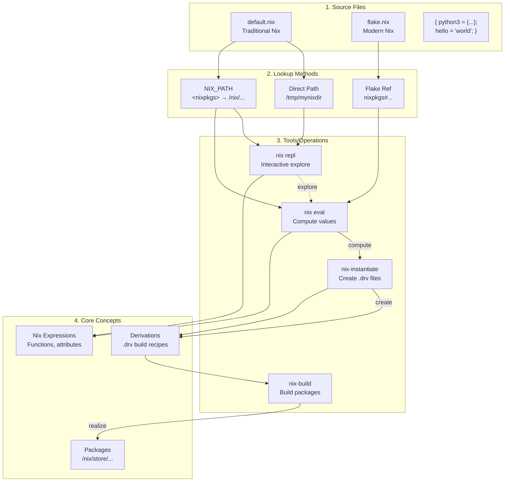

# Development setup
This repository covers my development setup, including
- NixOS configuration files 
- dotfiles to manage my configurations
- some development notes

Thus, the above (almost) fully describes my system state from OS to packages to configuration.

Given I am always tinkering with dotfiles and configurations, using NixOS or even home-manager is not responsive enough, having to "rebuild" every time a single change is made, so I use `dotbot` with symlinks.

> For example, adding a single line in `zshrc` would require a full `sudo nixos-rebuild switch` via NixOS or `home-manager build` with home-manager to apply the `zshrc` changes. With symlinks, I simple save the changes and open a new shell.

The downsides are:
- my configuration is not truly re-producible. Dotfiles are managed separately, symlinks might break, stale links might not get cleaned up
- the upside is a any changes can be applied immediately once symlinkes are established

I have made a sincere attempt to keep this repository as un-cluttered and simple as possible.

I found most dotfiles repositories daunting, with large complex configurations split into multiple sub-modules.
> Whilst this is fine if you understand fully, I do not believe it is a good starting point as the learning process of achieving such a configuration isas important as the result

## Utility script
I have included a utility script `util` to select between
- `os`: building the NixOS configuration
- `dotfiles`: applying the dotfiles symlinks
- `clean`: delete old NixOS generations


## NixOS setup
I have tried to keep my NixOS setup as simple as possible, in a vain attempt to avoid millions of different helper files, sub-modules and overrides.

For configuration files I am using `dotbot`, thus I believe `home-manager` just adds another layer of un-necessary complexity and have opted to not us it

The basic structure follows nix flakes:
- `flake.nix` selects between the configuration of the machine (located in `hosts`)
- `flake.lock` tracks the exact commit of `nixpkgs` so package versions can be replicated
- `modules` provides re-usable configuration fragments
> something I did not know as a beginner is the difference between a NixOS module and configuration fragment, which are distinct!


## Dotfiles
My dotfiles are located in `configs`, where the symlinks are applied by `dotbot` via the `install.conf.yaml` configuration file

Some of the configurations are built from scratch, some based off a templated, or edited from the defaults:
- `nvim` for neovim is based off the neovim kickstart project (although it has diverged a fair bit since)
- `hyprland` is based off the default generated configuration, although has diverged a fair bit since then
> To see the diffs from my config to the example generated one, run `git diff --no-index  <(curl https://raw.githubusercontent.com/hyprwm/Hyprland/refs/heads/main/example/hyprland.conf) configs/hypr/hyprland.conf`

## Applications
The `applications` directory is symlinked via `dotbot` to my "custom" directory in `~/.local/share/applications/`.

This enables me to have custom entries available in fuzzel launcher

## Wallpapers
Wallpapers shameless stolen from [mylinuxforwork dotfiles repo](https://github.com/mylinuxforwork/dotfiles/tree/main)

## Keyboard re-bindings
I have a set of keyboard bindings I apply as I find it helps my workflow. In short
- `caps` is rebound to a combination of `ctrl` and `escape` (hold vs tap)
- `space` when in used in conjunction with another key actives a special layer

For keyboard devices such as my laptop keyboard which do not support QMK, I have used `keyd` to remap keys (see `modules/nixos-keyd.nix`).

For my programming keybaords that do support QMK, I have forked [QMK firmware here](https://github.com/joeledwardson/qmk_firmware) with layers added for my keyboards

The additional layer is summarised as:
- `hjkl` for left/down/up/right to mimic vim
- `u` and `d` are mapped to page up/down respectively
- `i` and `x` are mapped to insert/delete respectively
- `p` for print
- `1 through 0,-,=` for fn1 to fn12 respectively
- `g` and `a` for end/home respectively
TODO: use `e` for end, makes much more sense

## Git authentication
I have setup `glab` and `gh `clis for authentication so that i can login via browser on each which is easier

TODO: review SSH keys synchronisation without commiting to git? maybe syncthing?

## Shell debugging
The `.zshrc` provides a debugging variable which uses `zprof` to log the load times when specified.

To use it, set:
```bash
export ZSH_DEBUGRC=true
```
# Nix Notes
Nix is an... interesting language, so these are my notes/thoughts along the way

## Lookup syntax
Firstly, the nix "lookup syntax" `<...>` is sometimes used with `nixpkgs`, but I'm gonna write a simple example here to help myself understand it

Nix expressions expect a `default.nix` file (or a `flake.nix` for newer ones?), see [docs on default.nix here](https://nix.dev/manual/nix/2.25/command-ref/files/default-nix-expression).

This is a super simple example of looking up my example `default.nix` file with the `greeting` variable and evaluating it
```bash
➜ jollof dev-setup (main) ✗ mkdir -p /tmp/mynixdir
➜ jollof dev-setup (main) ✗ echo -e '{\n greeting = "Hello there!";\n }' > /tmp/mynixdir/default.nix
➜ jollof dev-setup (main) ✗ nix eval --file /tmp/mynixdir greeting
"Hello there!"
➜ jollof dev-setup (main) ✗
```



## Nix derivations
I'm not hoenstly sure exactly what they, except that they are some sort of enclased part of a function/package that runs/does something??

Anyway, an example to create a derivation, "instantiate" it to the store

```bash
➜ jollof mynixdir cat > simple.nix << 'EOF'
with import <nixpkgs> {};
derivation {
  name = "simple";
  system = "x86_64-linux";
  builder = "${bash}/bin/bash";
  args = [ "-c" "echo hello > $out" ];
}
EOF
➜ jollof mynixdir nix-build simple.nix
this derivation will be built:
  /nix/store/ycdgnli9la2nhmrclldwv3mcckzb0684-simple.drv
building '/nix/store/ycdgnli9la2nhmrclldwv3mcckzb0684-simple.drv'...
/nix/store/i538l7xjp5d5sq5lr9v35pg34b6fq0mx-simple
➜ jollof mynixdir ll
lrwxrwxrwx   - jollof  9 Aug 19:24 result -> /nix/store/i538l7xjp5d5sq5lr9v35pg34b6fq0mx-simple
.rw-r--r-- 158 jollof  9 Aug 19:24 simple.nix
➜ jollof mynixdir cat result
hello
➜ jollof mynixdir readlink -f result
/nix/store/i538l7xjp5d5sq5lr9v35pg34b6fq0mx-simple
➜ jollof mynixdir cat $(readlink -f result)
hello
➜ jollof mynixdir
```

# Mental Notes
Trying to get my head round the crazy world of linux and computers in general

## Partition Management
GUI tools seem to do a much better job of combining these together, in either `GParted` or `Gnome disks`

Here is a summary of how all the different various disk management tools I have seen online relate to each other

```
PARTITION MANAGEMENT:
┌─────────────────────────────────────────────────────────┐
│                                                         │
│  fdisk (1991) ──same tool──> cfdisk (1994)              │
│      │              │            │                      │
│      │              │            │ (menu interface)     │
│      │              │            │                      │
│      └──────────────┴────────────┘                      │
│                     │                                   │
│                     ↓ replaced by                       │
│                                                         │
│                parted (1999)                            │
│                (modern standard)                        │
│                                                         │
└─────────────────────────────────────────────────────────┘

FILESYSTEM LABEL TOOLS:
┌─────────────────────────────────────────────────────────┐
│                                                         │
│  e2label (ext2/3/4)           fatlabel (FAT16/32)       │
│  ntfslabel (NTFS)             exfatlabel (exFAT)        │
│  xfs_admin (XFS)              btrfs (btrfs)             │
│                                                         │
│                     ↓ unified by                        │
│                                                         │
│                udisksctl (2012)                         │
│             (modern unified tool)                       │
│                                                         │
└─────────────────────────────────────────────────────────┘

INFORMATION TOOLS (read-only):
┌─────────────────────────────────────────────────────────┐
│                                                         │
│  lsblk (2010)                 findmnt (2010)            │
│  (block devices)              (mount points)            │
│                                                         │
└─────────────────────────────────────────────────────────┘
```

Thus, for most operations a combination of
- `parted`
- `lsblk`

*should* be sufficient

## Filesystem labels vs Parition Names
I have noticed that the "name" quoted by `sudo parted -l` does NOT match what is mounted, or the "label" in `lsblk -f`.

This is because parted names are `partition names`, stored in the GPT partition table apparently, outside of the filesystem.

Filesystem labels are stored in the filesystem metadata apparently (i guess in a header somewhere in the partition), and is used by automounters.

An example below shows where `Ventoy` was automounted and picked up the correct label name. And the both name and label from `lsblk` vs just the name in `parted`.
```
❯sudo parted -l
Model: SanDisk Cruzer Blade (scsi)
Disk /dev/sda: 30.8GB
Sector size (logical/physical): 512B/512B
Partition Table: msdos
Disk Flags:

Number  Start   End     Size    Type     File system  Flags
 1      1049kB  30.8GB  30.7GB  primary               boot
 2      30.8GB  30.8GB  33.6MB  primary  fat16        esp


Model: ADATA SX8200PNP (nvme)
Disk /dev/nvme0n1: 256GB
Sector size (logical/physical): 512B/512B
Partition Table: gpt
Disk Flags:

Number  Start   End    Size   File system  Name  Flags
 1      17.4kB  256GB  256GB  ext4


Model: CT1000P3SSD8 (nvme)
Disk /dev/nvme1n1: 1000GB
Sector size (logical/physical): 512B/512B
Partition Table: gpt
Disk Flags:

Number  Start   End     Size    File system  Name                          Flags
 1      17.4kB  16.8MB  16.8MB               Microsoft reserved partition  msftres
 2      16.8MB  499GB   499GB   ntfs         Basic data partition          msftdata
 3      499GB   499GB   538MB   fat32        EFI System Partition          boot, esp
 4      499GB   894GB   395GB   ext4         LINUX-MINT
 6      894GB   999GB   105GB   ext4         root
 5      999GB   1000GB  524MB   fat32        JOL-WIN-BOOT                  boot, esp


❯lsblk -o NAME,PARTLABEL,LABEL,SIZE,TYPE,MOUNTPOINT
NAME        PARTLABEL                    LABEL        SIZE TYPE MOUNTPOINT
sda                                                  28.7G disk
├─sda1                                   Ventoy      28.6G part /media/joelyboy/Ventoy
└─sda2                                   VTOYEFI       32M part
nvme0n1                                             238.5G disk
└─nvme0n1p1                              SPARE-DISK 238.5G part
nvme1n1                                             931.5G disk
├─nvme1n1p1 Microsoft reserved partition               16M part
├─nvme1n1p2 Basic data partition         Windows    464.3G part /mnt/jollof-windows
├─nvme1n1p3 EFI System Partition                      513M part /boot/efi
├─nvme1n1p4 LINUX-MINT                                368G part /
├─nvme1n1p5 JOL-WIN-BOOT                              500M part
└─nvme1n1p6 root                                     97.7G part

joelyboy@MINTY-RDP in dev-setup on   main  15
❯
```

Thus, to see what parted gives as well (partition labels) thus command is useful:
```bash
lsblk -o NAME,PARTLABEL,LABEL,SIZE,TYPE,MOUNTPOINT
```

To change disk label is not unified unfortunately.

Shamelessly stole these commands [from here](https://askubuntu.com/questions/1103569/how-do-i-change-the-label-reported-by-lsblk)

for ext2/ext3/ext4 filesystems (most linux stuff) can use:
```
e2label /dev/XXX <label>
```

For fat (usb drives, boot partitions) can use:
```
fatlabel /dev/XXX <label> 
```

for exfat (you might need to install exfat-utils first):
```
exfatlabel /dev/XXX <label>
```

for ntfs (windows):
```
ntfslabel /dev/XXX <label>
```

## Mount points

Show file systems with mount points
```
lsblk -f
```

example output:
```
NAME        FSTYPE FSVER LABEL         UUID                                 FSAVAIL FSUSE% MOUNTPOINTS
nvme1n1
├─nvme1n1p1 vfat   FAT32 SYSTEM        BE05-F38D                             119.1M    53% /boot
├─nvme1n1p2
├─nvme1n1p3 ntfs         Windows       5466065066063372
├─nvme1n1p4 ntfs         WinRE         F88E06A38E065A90
└─nvme1n1p5 ntfs         RecoveryImage 7040088F40085DEA
nvme0n1
└─nvme0n1p1 ext4   1.0   NIXROOT       c82fdf13-7c80-4864-92ce-78c06d81043c  863.5G     3% /nix/store
                                                                                           /
```


Find mounts
```
findmnt
```

example output:
```
TARGET                  SOURCE                FSTYPE   OPTIONS
/                       /dev/disk/by-uuid/c82fdf13-7c80-4864-92ce-78c06d81043c
│                                             ext4     rw,relatime
├─/dev                  devtmpfs              devtmpfs rw,nosuid,size=1625640k,nr_inodes=4060220,mode=755
│ ├─/dev/pts            devpts                devpts   rw,nosuid,noexec,relatime,gid=3,mode=620,ptmxmode=
│ ├─/dev/shm            tmpfs                 tmpfs    rw,nosuid,nodev,size=16256392k
│ ├─/dev/hugepages      hugetlbfs             hugetlbf rw,nosuid,nodev,relatime,pagesize=2M
│ └─/dev/mqueue         mqueue                mqueue   rw,nosuid,nodev,noexec,relatime
├─/proc                 proc                  proc     rw,nosuid,nodev,noexec,relatime
├─/run                  tmpfs                 tmpfs    rw,nosuid,nodev,size=8128196k,mode=755
│ ├─/run/keys           ramfs                 ramfs    rw,nosuid,nodev,relatime,mode=750
│ ├─/run/wrappers       tmpfs                 tmpfs    rw,nodev,relatime,size=16256392k,mode=755
│ ├─/run/credentials/systemd-journald.service
│ │                     tmpfs                 tmpfs    ro,nosuid,nodev,noexec,relatime,nosymfollow,size=1
│ └─/run/user/1000      tmpfs                 tmpfs    rw,nosuid,nodev,relatime,size=3251276k,nr_inodes=8
│   └─/run/user/1000/doc
│                       portal                fuse.por rw,nosuid,nodev,relatime,user_id=1000,group_id=100
├─/sys                  sysfs                 sysfs    rw,nosuid,nodev,noexec,relatime
│ ├─/sys/kernel/security
│ │                     securityfs            security rw,nosuid,nodev,noexec,relatime
│ ├─/sys/fs/cgroup      cgroup2               cgroup2  rw,nosuid,nodev,noexec,relatime,nsdelegate,memory_
│ ├─/sys/fs/pstore      pstore                pstore   rw,nosuid,nodev,noexec,relatime
│ ├─/sys/firmware/efi/efivars
│ │                     efivarfs              efivarfs rw,nosuid,nodev,noexec,relatime
│ ├─/sys/fs/bpf         bpf                   bpf      rw,nosuid,nodev,noexec,relatime,mode=700
│ ├─/sys/kernel/tracing tracefs               tracefs  rw,nosuid,nodev,noexec,relatime
│ ├─/sys/kernel/debug   debugfs               debugfs  rw,nosuid,nodev,noexec,relatime
│ ├─/sys/kernel/config  configfs              configfs rw,nosuid,nodev,noexec,relatime
│ └─/sys/fs/fuse/connections
│                       fusectl               fusectl  rw,nosuid,nodev,noexec,relatime
├─/nix/store            /dev/disk/by-uuid/c82fdf13-7c80-4864-92ce-78c06d81043c[/nix/store]
│                                             ext4     ro,nosuid,nodev,relatime
└─/boot                 /dev/nvme1n1p1        vfat     rw,relatime,fmask=0022,dmask=0022,codepage=437,ioc

```

Note that above, `/nix/store` is shown to be mounted to the subdirectory `/nix/store/` of `/dev/disk/by-uuid/c82fdf13-7c80-4864-92ce-78c06d81043c`

This is NOT shown in `lsblk`!


## Linux desktop theming
```
┌─────────────────────────────────────────────────────────────────────────────────────┐
│                              Linux Desktop Theming Stack                            │
└─────────────────────────────────────────────────────────────────────────────────────┘

┌─────────────────────┐                    ┌─────────────────────┐
│   GTK Applications  │                    │   Qt Applications   │
│  (GNOME, XFCE,      │                    │  (KDE, VLC, qBit-   │
│   Thunar, Firefox)  │                    │   torrent, etc)     │
└──────────┬──────────┘                    └──────────┬──────────┘
          │                                          │
          ▼                                          ▼
┌─────────────────────┐                    ┌─────────────────────┐
│    GTK Toolkit      │                    │    Qt Toolkit       │
│  • GTK2 (legacy)    │                    │  • Qt5 (current)    │
│  • GTK3 (current)   │                    │  • Qt6 (modern)     │
│  • GTK4 (modern)    │                    │  • Can mimic GTK    │
│                     │                    │    theme via        │
│                     │                    │    platformTheme    │
└─────────┬───────────┘                    └─────────┬───────────┘
         │                                          │
         ▼                                          ▼
┌─────────────────────────────────┐      ┌─────────────────────────────────┐
│      GTK Configuration          │      │      Qt Configuration           │
├─────────────────────────────────┤      ├─────────────────────────────────┤
│  GSettings → dconf              │      │  ~/.config/qt5ct/               │
│  (GNOME/GTK standard)           │      │  ~/.config/kdeglobals (KDE)     │
│  Binary database                │      │  QT_QPA_PLATFORMTHEME env var   │
└─────────────────────────────────┘      └─────────────────────────────────┘

┌─────────────────────────────────────────────────────────────────┐
│                     Configuration Tools                         │
├─────────────────────────────┬───────────────────────────────────┤
│         GTK Tools           │           Qt Tools                │
├─────────────────────────────┼───────────────────────────────────┤
│ • lxappearance (GUI)        │ • qt5ct/qt6ct (GUI)               │
│ • nwg-look (modern GUI)     │ • kvantum (theme engine)          │
│ • gsettings (CLI)           │ • kde-gtk-config (KDE→GTK sync)   │
│ • dconf-editor (GUI)        │                                   │
└─────────────────────────────┴───────────────────────────────────┘

┌───────────────────────────────────────────────────────────────┐
│                    Desktop Environments                       │
├──────────────┬──────────────┬──────────────┬──────────────────┤
│    GNOME     │     KDE      │     XFCE     │   Minimal WM     │
│ (GTK-based)  │  (Qt-based)  │ (GTK-based)  │ (Need tools      │
│ Uses dconf   │ Own system   │ Uses dconf   │  above)          │
└──────────────┴──────────────┴──────────────┴──────────────────┘

Note: "Qt can mimic GTK" means when you set QT_QPA_PLATFORMTHEME=gtk2,
Qt apps try to read GTK theme settings and match their appearance
```

## Linux file permissions
No matter how many times i read about file permissions on linux: groups,id,read,write,execute etc i seem to forget the syntaxes.

So I write (another) diagram to help me remember

### Permission Bits Reference
```
Permission Bits: Read=4, Write=2, Execute=1

Each digit in chmod represents ONE entity:
┌────────────┬────────────┬────────────┐
│ 1st digit  │ 2nd digit  │ 3rd digit  │
│   OWNER    │   GROUP    │   OTHERS   │
│ (you)      │ (your grp) │ (everyone) │
└────────────┴────────────┴────────────┘

Breaking down 755:
┌─────┬─────┬─────┐
│  7  │  5  │  5  │
└──┬──┴──┬──┴──┬──┘
   │     │     │
   │     │     └─> Others: 5 = 4+0+1 = r-x (read + execute)
   │     └─────> Group:  5 = 4+0+1 = r-x (read + execute)
   └───────────> Owner:  7 = 4+2+1 = rwx (read + write + execute)

So 755 means:
- Owner (you):     rwx (can do everything)
- Group members:   r-x (can read and execute, NOT write)
- Others:          r-x (can read and execute, NOT write)

Each digit is calculated:
7 = 4(r) + 2(w) + 1(x) = rwx
6 = 4(r) + 2(w) + 0    = rw-
5 = 4(r) + 0    + 1(x) = r-x
4 = 4(r) + 0    + 0    = r--
3 = 0    + 2(w) + 1(x) = -wx
2 = 0    + 2(w) + 0    = -w-
1 = 0    + 0    + 1(x) = --x
0 = 0    + 0    + 0    = ---
```

### Examples with 007 (DON'T DO THIS!):
```
# Create a file with normal permissions
$ touch myfile.txt
$ ls -l myfile.txt
-rw-r--r-- 1 jollof users 0 Aug  3 10:00 myfile.txt

# Apply the bizarre 007 permission
$ chmod 007 myfile.txt
$ ls -l myfile.txt
-------rwx 1 jollof users 0 Aug  3 10:00 myfile.txt
        ↑
        └── Others have FULL access!

# Now YOU (the owner) can't even read your own file!
$ cat myfile.txt
cat: myfile.txt: Permission denied

# But a random user can do anything!
$ sudo -u randomuser cat myfile.txt  # Works!
$ sudo -u randomuser rm myfile.txt   # They can even delete it!
```

### More wacky examples:
```
070 = ---rwx---  (only group members have access)
707 = rwx---rwx  (owner and others yes, group no)
000 = ---------  (nobody can do anything)
111 = --x--x--x  (everyone can execute, but not read/write)
222 = -w--w--w-  (write-only for everyone - very weird!)
444 = r--r--r--  (read-only for everyone, even owner)
```

> For `000`, the root user (or any user with ID 0) can still access given it has special capabilities. See [capabilities](https://man7.org/linux/man-pages/man7/capabilities.7.html)

### Standard permissions you actually want:
```
755 = rwxr-xr-x  # Executables/directories
644 = rw-r--r--  # Regular files
600 = rw-------  # Private files (like SSH keys)
700 = rwx------  # Private executables/directories
664 = rw-rw-r--  # Group-writable files
775 = rwxrwxr-x  # Group-writable directories
```
## Id and Groups
Diagram of how the `/etc/passwd` file works

`/etc/passwd` defines the user, UID and GID whilst `/etc/group` defines how said users are part of different groups


### How /etc/passwd, /etc/group, and /etc/shadow Connect

```
/etc/passwd                    /etc/group
username ─────────────┬────────► groupname (for supplementary)
         GID ─────────┴────────► GID (for primary group)
         x ───────────┐
                      │        /etc/shadow
                      └────────► password_hash
```

### File Format Breakdown

**`/etc/passwd` format:**
```
username:x:UID:GID:comment:home_directory:shell
```
- `username` - Login name
- `x` - Password placeholder (actual password in /etc/shadow)
- `UID` - User ID number
- `GID` - Primary Group ID number
- `comment` - User description/full name
- `home_directory` - User's home directory path
- `shell` - User's default shell

Example: `joelyboy:x:1000:1000:Joe L:/home/joelyboy:/bin/bash`

**`/etc/group` format:**
```
groupname:x:GID:user1,user2,user3
```
- `groupname` - Group name
- `x` - Password placeholder (rarely used)
- `GID` - Group ID number
- `user1,user2,user3` - Comma-separated list of users (SUPPLEMENTARY members only)

Examples:
- `root:x:0:` - root group with no supplementary members
- `networkmanager:x:57:joelyboy,nm-openvpn` - networkmanager group with two supplementary members

**Key concept:** Users are NOT listed in `/etc/group` for their PRIMARY group (defined in `/etc/passwd`). They only appear in `/etc/group` for SUPPLEMENTARY groups.
