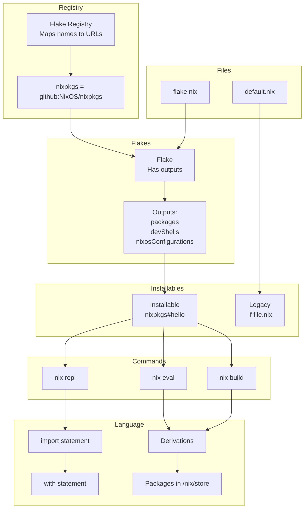
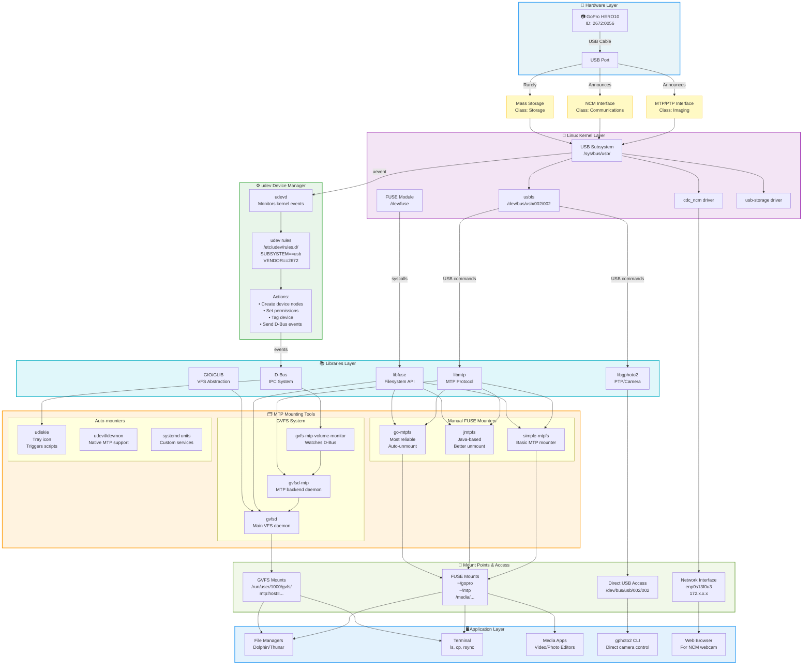

<!-- START doctoc generated TOC please keep comment here to allow auto update -->
<!-- DON'T EDIT THIS SECTION, INSTEAD RE-RUN doctoc TO UPDATE -->
**Table of Contents**  *generated with [DocToc](https://github.com/thlorenz/doctoc)*

- [Development setup](#development-setup)
  - [Utility script](#utility-script)
  - [Adding a new devices](#adding-a-new-devices)
  - [NixOS setup](#nixos-setup)
  - [Dotfiles](#dotfiles)
  - [Applications](#applications)
  - [Wallpapers](#wallpapers)
  - [Keyboard re-bindings](#keyboard-re-bindings)
  - [Git authentication](#git-authentication)
  - [Shell debugging](#shell-debugging)
- [Nix Notes](#nix-notes)
  - [Repl and Installables](#repl-and-installables)
    - [Repl](#repl)
    - [Flake show](#flake-show)
  - [Lookup syntax](#lookup-syntax)
    - [Loading](#loading)
  - [Nix derivations](#nix-derivations)
- [Mental Notes](#mental-notes)
  - [Partition Management](#partition-management)
  - [Filesystem labels vs Parition Names](#filesystem-labels-vs-parition-names)
  - [Mount points](#mount-points)
  - [Loop Devices](#loop-devices)
  - [Linux desktop theming](#linux-desktop-theming)
  - [Linux file permissions](#linux-file-permissions)
    - [Permission Bits Reference](#permission-bits-reference)
    - [Examples with 007 (DON'T DO THIS!):](#examples-with-007-dont-do-this)
    - [More wacky examples:](#more-wacky-examples)
    - [Standard permissions you actually want:](#standard-permissions-you-actually-want)
  - [Id and Groups](#id-and-groups)
    - [How /etc/passwd, /etc/group, and /etc/shadow Connect](#how-etcpasswd-etcgroup-and-etcshadow-connect)
    - [File Format Breakdown](#file-format-breakdown)
  - [Crypography](#crypography)
  - [Character Encodings](#character-encodings)
    - [Encodings themselves](#encodings-themselves)
    - [Character Encoding Examples](#character-encoding-examples)
    - [Unicode](#unicode)
    - [Escape Sequences](#escape-sequences)

<!-- END doctoc generated TOC please keep comment here to allow auto update -->

# Development setup
This repository covers my development setup, including
- NixOS configuration files 
- dotfiles to manage my configurations
- some development notes

Thus, the above (almost) fully describes my system state from OS to packages to configuration.

Given I am always tinkering with dotfiles and configurations, using NixOS or even home-manager is not responsive enough, having to "rebuild" every time a single change is made, so I use `dotbot` with symlinks.

> For example, adding a single line in `zshrc` would require a full `sudo nixos-rebuild switch` via NixOS or `home-manager build` with home-manager to apply the `zshrc` changes. With symlinks, I simple save the changes and open a new shell.

The downsides are:
- my configuration is not truly re-producible. Dotfiles are managed separately, symlinks might break, stale links might not get cleaned up
- the upside is a any changes can be applied immediately once symlinkes are established

I have made a sincere attempt to keep this repository as un-cluttered and simple as possible.

I found most dotfiles repositories daunting, with large complex configurations split into multiple sub-modules.
> Whilst this is fine if you understand fully, I do not believe it is a good starting point as the learning process of achieving such a configuration isas important as the result

## Utility script
I have included a utility script `util` to select between
- `os`: building the OS configuration
    1. Builds NixOS configuration
    2. Installs Yazi plugin packages
- `dotfiles`: applying the dotfiles symlinks
    1. Runs common dotfile symlinks
    2. Symlinks hyprland host specific `custom.conf` if exists
- `clean`: delete old NixOS generations

## Adding a new devices
I have found that to add a new devices it's easiest to add the initial code for the device on an existing setup **before** cloning the repository. This is because, otherwise NixOS requires the files to be added to git, which in turn requires git's stupid global username and email 😠. All of this is before the nix packages have been installed and `dotbot` run to setup symlinks to git config...

Thus (from an existing machine with git configured):
1. Create a new directory in `hosts` with the apprioriate hostname, by copying the most similar existing one
2. Go into the `configuration.nix` of the new host and update the `hostname`
3. Make any other necessary changes to `configuration.nix` in the new device (mounts, nvidia, cuda etc)
4. Delete the contents of `hardware-configuration.nix` (NOT the file itself!) to make space for the new correct configuration
5. Add a mapping from the username@hostname to the configuration in the `hosts` directory in `flake.nix`
6. Commit and push the changes

Then, on the target device:

7. Use the graphical NixOS USB installer to boot into NixOS (will have to set boot order in BIOS if it has an existing OS) and clone my repo
```bash
git clone https://github.com/joeledwardson/dev-setup.git
```

8. Resize the windows partition (if there is one), and create a new `ext4` partition for NixOS
> I used GParted because I'm lazy and it handles resizing NTFS windows file system and creates the `ext4` FS for me
9. Mount the partitions (in my example p7 is my new nix partition, and p1 is EFI)
```bash
sudo mount /dev/nvme0n1p7 /mnt
sudo mkdir -p /mnt/boot
sudo mount /dev/nvme0n1p1 /mnt/boot
```
10. Generate the hardware configuration
```bash
sudo nixos-generate-config --root /mnt
```
10. Set a hostname for convenience later scripts (hostname wont be set yet until nix is built)
```bash
export NEW_HOSTNAME=<....>
```
11. Copy it into my hosts dir
```bash
cp /mnt/etc/nixos/hardware-configuration.nix "$HOME/dev-setup/hosts/$NEW_HOSTNAME/hardware-configuration.nix"
```
12. Then, can install from the flake in the dev-setup dir (hostname wont be set yet so have to specify it)
```bash
sudo nixos-install --root /mnt --flake .#$NEW_HOSTNAME
```
13. Remove the USB and reboot, (GRUB should appear) and pick NixOS to boot into
14. Use the initial `password` to login
15. Press Ctrl-Q for terminal (I use Ctrl-Enter but bindings are not yet setup), and change password with `passwd`
16. Clone my repo again (was cloned on the USB stick so will not persist to NixOS)
```bash
git clone https://github.com/joeledwardson/dev-setup.git
cd dev-setup
```
17. Copy the hardware configuration across again (wont persist as previously was on the USB)
```bash
cp /etc/nixos/hardware-configuration.nix ./hosts/<HOSTNAME-GOES-HERE>/hardware-configuration.nix
```
18. Apply the dotfiles and restart hyprland
```bash
./util dotfiles
hyprctl reload
```
19. Probably should commit the hardware configuration changes, restart hyprland (`Ctrl-Shift-Q`) and that's it! 😬


## NixOS setup
I have tried to keep my NixOS setup as simple as possible, in a vain attempt to avoid millions of different helper files, sub-modules and overrides.

For configuration files I am using `dotbot`, thus I believe `home-manager` just adds another layer of un-necessary complexity and have opted to not us it

The basic structure follows nix flakes:
- `flake.nix` selects between the configuration of the machine (located in `hosts`)
- `flake.lock` tracks the exact commit of `nixpkgs` so package versions can be replicated
- `modules` provides re-usable configuration fragments
> something I did not know as a beginner is the difference between a NixOS module and configuration fragment, which are distinct!


## Dotfiles
My dotfiles are located in `configs`, where the symlinks are applied by `dotbot` via the `install.conf.yaml` configuration file

Some of the configurations are built from scratch, some based off a templated, or edited from the defaults:
- `nvim` for neovim is based off the neovim kickstart project (although it has diverged a fair bit since)
- `hyprland` is based off the default generated configuration, although has diverged a fair bit since then
> To see the diffs from my config to the example generated one, run `git diff --no-index  <(curl https://raw.githubusercontent.com/hyprwm/Hyprland/refs/heads/main/example/hyprland.conf) configs/hypr/hyprland.conf`
- `waybar` shamelessy stolen from https://github.com/d00m1k/SimpleBlueColorWaybar
- `swaync` shamelessy stolen from https://github.com/schererleander/hyprdots

## Applications
The `applications` directory is symlinked via `dotbot` to my "custom" directory in `~/.local/share/applications/`.

This enables me to have custom entries available in fuzzel launcher

## Wallpapers
Wallpapers shameless stolen from [mylinuxforwork dotfiles repo](https://github.com/mylinuxforwork/dotfiles/tree/main)

## Keyboard re-bindings
I have a set of keyboard bindings I apply as I find it helps my workflow. In short
- `caps` is rebound to a combination of `ctrl` and `escape` (hold vs tap)
- `space` when in used in conjunction with another key actives a special layer

For keyboard devices such as my laptop keyboard which do not support QMK, I have used `keyd` to remap keys (see `modules/nixos-keyd.nix`).

For my programming keybaords that do support QMK, I have forked [QMK firmware here](https://github.com/joeledwardson/qmk_firmware) with layers added for my keyboards

The additional layer is summarised as:
- `hjkl` for left/down/up/right to mimic vim
- `u` and `d` are mapped to page up/down respectively
- `i` and `x` are mapped to insert/delete respectively
- `p` for print
- `1 through 0,-,=` for fn1 to fn12 respectively
- `g` and `a` for end/home respectively
TODO: use `e` for end, makes much more sense

## Git authentication
I have setup `glab` and `gh `clis for authentication so that i can login via browser on each which is easier

TODO: review SSH keys synchronisation without commiting to git? maybe syncthing?

## Shell debugging
The `.zshrc` provides a debugging variable which uses `zprof` to log the load times when specified.

To use it, set:
```bash
export ZSH_DEBUGRC=true
```
# Nix Notes
Nix is an... interesting language, so these are my notes/thoughts along the way


## Repl and Installables
### Repl
According to the docs from `nix repl --help`
```
Synopsis

    nix repl [option...] installables...
```

The arg after nix repl is `installables`.

Reading the docs for installables [here](https://nix.dev/manual/nix/2.18/command-ref/new-cli/nix#installables), it is of the form `flakeref[ # attrpath ],

e.g. `nixpkgs#hello`, or as the `#attrpath` is optional i guess just `nixpkgs`, where we can call `nix repl 'nixpkgs'`

### Flake show
Now, `nix flake show` shows the outputs of a flake, so we can actually see with nixpkgs (i've trimmed the output as its long)
```bash
➜ joelyboy dev-setup (main) ✗ nix flake show nixpkgs
path:/nix/store/bgl6ldj5ihbwcq8p42z3a0qzgqafgk2b-source?lastModified=0&narHash=sha256-LwWRsENAZJKUdD3SpLluwDmdXY9F45ZEgCb0X%2BxgOL0%3D
├───htmlDocs: unknown
    ...
    ...
├───legacyPackages
│   ├───aarch64-darwin omitted (use '--legacy' to show)
│   ├───aarch64-linux omitted (use '--legacy' to show)
│   ├───armv6l-linux omitted (use '--legacy' to show)
│   ├───armv7l-linux omitted (use '--legacy' to show)
│   ├───i686-linux omitted (use '--legacy' to show)
│   ├───powerpc64le-linux omitted (use '--legacy' to show)
│   ├───riscv64-linux omitted (use '--legacy' to show)
│   ├───x86_64-darwin omitted (use '--legacy' to show)
│   ├───x86_64-freebsd omitted (use '--legacy' to show)
│   └───x86_64-linux omitted (use '--legacy' to show)
├───lib: unknown
└───nixosModules
    ├───notDetected: NixOS module
    └───readOnlyPkgs: NixOS module
➜ joelyboy dev-setup (main) ✗
```

Can see now the `legacyPackages` attribute is loaded into the repl! which is from `nixpkgs`.

```bash
➜ joelyboy dev-setup (main) ✗ nix repl nixpkgs
Nix 2.28.4
Type :? for help.
Loading installable 'flake:nixpkgs#'...
Added 7 variables.
nix-repl> legacyPackages
{
  aarch64-darwin = { ... };
  aarch64-linux = { ... };
  armv6l-linux = { ... };
  armv7l-linux = { ... };
  i686-linux = { ... };
  powerpc64le-linux = { ... };
  riscv64-linux = { ... };
  x86_64-darwin = { ... };
  x86_64-freebsd = { ... };
  x86_64-linux = { ... };
}

nix-repl>
```


(FROM CLAUDE)

When you run `nix repl nixpkgs`, here's what happens:

1. **"nixpkgs" is a flake ID** that gets resolved via the registry to `github:NixOS/nixpkgs`
2. **The flake itself** has outputs like `packages`, `legacyPackages`, etc.
3. **In the REPL**, you're interacting with the flake's outputs, not the flake itself

So when you type `nixpkgs` in commands:
- `nix repl nixpkgs` → loads the entire flake's outputs
- `nixpkgs#hello` → means "the hello attribute from nixpkgs flake's outputs"
- The `#` separates flake reference from attribute path

The confusion comes because:
- `nixpkgs` (the flake) contains `legacyPackages.x86_64-linux` with thousands of packages
- When you load it in REPL, you see those packages directly
- But `nixpkgs` itself is the flake, not an output attribute


## Lookup syntax
Firstly, the nix "lookup syntax" `<...>` is sometimes used with `nixpkgs`, but I'm gonna write a simple example here to help myself understand it

Nix expressions expect a `default.nix` file (or a `flake.nix` for newer ones?), see [docs on default.nix here](https://nix.dev/manual/nix/2.25/command-ref/files/default-nix-expression).

This is a super simple example of looking up my example `default.nix` file with the `greeting` variable and evaluating it

In this case, I did a load of my module `mynixdir` and then executed `greeting` (which was made available as a string from inside `mynixdir`)

```bash
➜ jollof dev-setup (main) ✗ mkdir -p /tmp/mynixdir
➜ jollof dev-setup (main) ✗ echo -e '{\n greeting = "Hello there!";\n }' > /tmp/mynixdir/default.nix
➜ jollof dev-setup (main) ✗ nix eval --file /tmp/mynixdir greeting
"Hello there!"
➜ jollof dev-setup (main) ✗
```

Or, to demonstrate an import, and allocating it to a var and getting the value of `greeting`!
```bash
➜ joelyboy dev-setup (main) ✗ nix repl
Nix 2.28.4
Type :? for help.
nix-repl> import /tmp/mynixdir
{ greeting = "Hello there!"; }

nix-repl> myvar=(import /tmp/m
/tmp/mkdp-nvim.log  /tmp/mynixdir
nix-repl> myvar=(import /tmp/mynixdir)

nix-repl> myvar.greeting
"Hello there!"

nix-repl>
```



### Loading
`:l` loads a file in the repl, AND makes all vars available (unlike `import` which must be assigned to a variable)

e.g. see how `myAge` is loaded into available variables
```bash
joelyboy@desktop-work ~/c/dev-setup (main)> echo "{myAge=31;}" > /tmp/testie.nix
joelyboy@desktop-work ~/c/dev-setup (main)> nix repl
Nix 2.28.4
Type :? for help.
nix-repl> :l /tmp/testie.nix
Added 1 variables.

nix-repl> myAge
31

nix-repl>
```

### Lambda functions
e.g.
```nix
joelyboy@desktop-work ~/c/dev-setup (main)> nix repl
Nix 2.28.4
Type :? for help.
nix-repl> myFunc = { name }: "Hello ${name}"

nix-repl> myFunc { name = "jollof"; }
"Hello jollof"

nix-repl>
```

### Nix override attributes
the `//` operator overrides attributes
e.g.
```nix
joelyboy@desktop-work ~/c/dev-setup (main)> nix repl
Nix 2.28.4
Type :? for help.
nix-repl> me = { name="jollof"; age=31;}

nix-repl> me // {age=40;}
{
  age = 40;
  name = "jollof";
}

nix-repl>
```

### Curried functions
Basically chained function creation
e.g. create a function which creates ANOTHER function to add a set number
```nix
joelyboy@desktop-work ~/c/dev-setup (main)> nix repl
Nix 2.28.4
Type :? for help.
nix-repl> createAdder = numberToAdd : value : value + numberToAdd

nix-repl> add5 = createAdder 5

nix-repl> add5 12
17

nix-repl> add3 = createAdder 3

nix-repl> add3 12
15

nix-repl>
```


## Nix derivations
I'm not hoenstly sure exactly what they, except that they are some sort of enclased part of a function/package that runs/does something??

Anyway, an example to create a derivation, "instantiate" it to the store

> A note on heredoc
The `<<` is a `here-document` (NOT SUPPORED IN FISH! [see here](https://fishshell.com/docs/current/fish_for_bash_users.html#heredocs))

`here-document`s feed a command list to STDIN (hence why it wont work with echo, which doesnt read from stdin!)


e.g. count lines with `wc -l`  is a simple example to demonstrate using `heredoc` to feed 4 lines to stdin to `wc` and print line count
```bash
[joelyboy@desktop-work:~/coding/dev-setup]$ wc -l << 'ENDHEREPLS'
> line 1
> line 2
> line 3
> line 4
> ENDHEREPLS
4

[joelyboy@desktop-work:~/coding/dev-setup]$
```

Anyway, continuing...

```bash
➜ jollof mynixdir cat > simple.nix << 'EOF'
with import <nixpkgs> {};
derivation {
  name = "simple";
  system = "x86_64-linux";
  builder = "${bash}/bin/bash";
  args = [ "-c" "echo hello > $out" ];
}
EOF
➜ jollof mynixdir nix-build simple.nix
this derivation will be built:
  /nix/store/ycdgnli9la2nhmrclldwv3mcckzb0684-simple.drv
building '/nix/store/ycdgnli9la2nhmrclldwv3mcckzb0684-simple.drv'...
/nix/store/i538l7xjp5d5sq5lr9v35pg34b6fq0mx-simple
➜ jollof mynixdir ll
lrwxrwxrwx   - jollof  9 Aug 19:24 result -> /nix/store/i538l7xjp5d5sq5lr9v35pg34b6fq0mx-simple
.rw-r--r-- 158 jollof  9 Aug 19:24 simple.nix
➜ jollof mynixdir cat result
hello
➜ jollof mynixdir readlink -f result
/nix/store/i538l7xjp5d5sq5lr9v35pg34b6fq0mx-simple
➜ jollof mynixdir cat $(readlink -f result)
hello
➜ jollof mynixdir
```

## Nix building
```bash
mkdir -p /tmp/testieflake
cat > /tmp/testieflake/flake.nix << 'EOF'
{
  description = "Super simple flake";
  
  inputs = {};  # No inputs at all!
  
  outputs = { self }: {
    packages.x86_64-linux.hello = derivation {
      name = "hello";
      system = "x86_64-linux";
      builder = "/bin/sh";
      args = [ "-c" "echo 'Hello from a flake!' > $out" ];
    };
  };
}
EOF
cd /tmp/testieflake
nix build .#hello
cat result
```

and then we get!

```bash
➜ joelyboy testieflake cd /tmp/testieflake
nix build .#hello
cat result

➜ joelyboy testieflake
```


and then we can import it into another flake, this is where the `url` style syntax comes into flakes!
```bash
➜ joelyboy myotherflake pwd
/tmp/myotherflake
➜ joelyboy myotherflake cat flake.nix
# /tmp/myotherflake/flake.nix
{
  description = "Simpler version";

  inputs = {
    mytestie.url = "/tmp/testieflake";
  };

  outputs = { self, mytestie }: {
    packages.x86_64-linux.combined = mytestie.packages.x86_64-linux.hello;
  };
}
➜ joelyboy myotherflake nix build .#combined --impure
➜ joelyboy myotherflake cat result
Hello from a flake!
➜ joelyboy myotherflake cat flake.lock
{
  "nodes": {
    "mytestie": {
      "locked": {
        "lastModified": 1758017036,
        "narHash": "sha256-xgTGb89vbd5jNRibieQ6ksc2erfI32l0s1T/pL+AHi0=",
        "path": "/tmp/testieflake",
        "type": "path"
      },
      "original": {
        "path": "/tmp/testieflake",
        "type": "path"
      }
    },
    "root": {
      "inputs": {
        "mytestie": "mytestie"
      }
    }
  },
  "root": "root",
  "version": 7
}
➜ joelyboy myotherflake
```


# Mental Notes
Trying to get my head round the crazy world of linux and computers in general

## Partition Management
GUI tools seem to do a much better job of combining these together, in either `GParted` or `Gnome disks`

Here is a summary of how all the different various disk management tools I have seen online relate to each other

```
PARTITION MANAGEMENT:
┌─────────────────────────────────────────────────────────┐
│                                                         │
│  fdisk (1991) ──same tool──> cfdisk (1994)              │
│      │              │            │                      │
│      │              │            │ (menu interface)     │
│      │              │            │                      │
│      └──────────────┴────────────┘                      │
│                     │                                   │
│                     ↓ replaced by                       │
│                                                         │
│                parted (1999)                            │
│                (modern standard)                        │
│                                                         │
└─────────────────────────────────────────────────────────┘

FILESYSTEM LABEL TOOLS:
┌─────────────────────────────────────────────────────────┐
│                                                         │
│  e2label (ext2/3/4)           fatlabel (FAT16/32)       │
│  ntfslabel (NTFS)             exfatlabel (exFAT)        │
│  xfs_admin (XFS)              btrfs (btrfs)             │
│                                                         │
│                     ↓ unified by                        │
│                                                         │
│                udisksctl (2012)                         │
│             (modern unified tool)                       │
│                                                         │
└─────────────────────────────────────────────────────────┘

INFORMATION TOOLS (read-only):
┌─────────────────────────────────────────────────────────┐
│                                                         │
│  lsblk (2010)                 findmnt (2010)            │
│  (block devices)              (mount points)            │
│                                                         │
└─────────────────────────────────────────────────────────┘
```

Thus, for most operations a combination of
- `parted`
- `lsblk`

*should* be sufficient

## Filesystem labels vs Parition Names
I have noticed that the "name" quoted by `sudo parted -l` does NOT match what is mounted, or the "label" in `lsblk -f`.

This is because parted names are `partition names`, stored in the GPT partition table apparently, outside of the filesystem.

Filesystem labels are stored in the filesystem metadata apparently (i guess in a header somewhere in the partition), and is used by automounters.

An example below shows where `Ventoy` was automounted and picked up the correct label name. And the both name and label from `lsblk` vs just the name in `parted`.
```
❯sudo parted -l
Model: SanDisk Cruzer Blade (scsi)
Disk /dev/sda: 30.8GB
Sector size (logical/physical): 512B/512B
Partition Table: msdos
Disk Flags:

Number  Start   End     Size    Type     File system  Flags
 1      1049kB  30.8GB  30.7GB  primary               boot
 2      30.8GB  30.8GB  33.6MB  primary  fat16        esp


Model: ADATA SX8200PNP (nvme)
Disk /dev/nvme0n1: 256GB
Sector size (logical/physical): 512B/512B
Partition Table: gpt
Disk Flags:

Number  Start   End    Size   File system  Name  Flags
 1      17.4kB  256GB  256GB  ext4


Model: CT1000P3SSD8 (nvme)
Disk /dev/nvme1n1: 1000GB
Sector size (logical/physical): 512B/512B
Partition Table: gpt
Disk Flags:

Number  Start   End     Size    File system  Name                          Flags
 1      17.4kB  16.8MB  16.8MB               Microsoft reserved partition  msftres
 2      16.8MB  499GB   499GB   ntfs         Basic data partition          msftdata
 3      499GB   499GB   538MB   fat32        EFI System Partition          boot, esp
 4      499GB   894GB   395GB   ext4         LINUX-MINT
 6      894GB   999GB   105GB   ext4         root
 5      999GB   1000GB  524MB   fat32        JOL-WIN-BOOT                  boot, esp


❯lsblk -o NAME,PARTLABEL,LABEL,SIZE,TYPE,MOUNTPOINT
NAME        PARTLABEL                    LABEL        SIZE TYPE MOUNTPOINT
sda                                                  28.7G disk
├─sda1                                   Ventoy      28.6G part /media/joelyboy/Ventoy
└─sda2                                   VTOYEFI       32M part
nvme0n1                                             238.5G disk
└─nvme0n1p1                              SPARE-DISK 238.5G part
nvme1n1                                             931.5G disk
├─nvme1n1p1 Microsoft reserved partition               16M part
├─nvme1n1p2 Basic data partition         Windows    464.3G part /mnt/jollof-windows
├─nvme1n1p3 EFI System Partition                      513M part /boot/efi
├─nvme1n1p4 LINUX-MINT                                368G part /
├─nvme1n1p5 JOL-WIN-BOOT                              500M part
└─nvme1n1p6 root                                     97.7G part

joelyboy@MINTY-RDP in dev-setup on   main  15
❯
```

Thus, to see what parted gives as well (partition labels) thus command is useful:
```bash
lsblk -o NAME,PARTLABEL,LABEL,SIZE,TYPE,MOUNTPOINT
```
Or, to see the list of options (why this isnt in the MAN page i'll never know 🤦)
> lsblk --list-options

To change disk label is not unified unfortunately.

Shamelessly stole these commands [from here](https://askubuntu.com/questions/1103569/how-do-i-change-the-label-reported-by-lsblk)

for ext2/ext3/ext4 filesystems (most linux stuff) can use:
```
e2label /dev/XXX <label>
```

For fat (usb drives, boot partitions) can use:
```
fatlabel /dev/XXX <label> 
```

for exfat (you might need to install exfat-utils first):
```
exfatlabel /dev/XXX <label>
```

for ntfs (windows):
```
ntfslabel /dev/XXX <label>
```

## Mount points

Show file systems with mount points
```
lsblk -f
```

example output:
```
NAME        FSTYPE FSVER LABEL         UUID                                 FSAVAIL FSUSE% MOUNTPOINTS
nvme1n1
├─nvme1n1p1 vfat   FAT32 SYSTEM        BE05-F38D                             119.1M    53% /boot
├─nvme1n1p2
├─nvme1n1p3 ntfs         Windows       5466065066063372
├─nvme1n1p4 ntfs         WinRE         F88E06A38E065A90
└─nvme1n1p5 ntfs         RecoveryImage 7040088F40085DEA
nvme0n1
└─nvme0n1p1 ext4   1.0   NIXROOT       c82fdf13-7c80-4864-92ce-78c06d81043c  863.5G     3% /nix/store
                                                                                           /
```


Find mounts
```
findmnt
```

example output:
```
TARGET                  SOURCE                FSTYPE   OPTIONS
/                       /dev/disk/by-uuid/c82fdf13-7c80-4864-92ce-78c06d81043c
│                                             ext4     rw,relatime
├─/dev                  devtmpfs              devtmpfs rw,nosuid,size=1625640k,nr_inodes=4060220,mode=755
│ ├─/dev/pts            devpts                devpts   rw,nosuid,noexec,relatime,gid=3,mode=620,ptmxmode=
│ ├─/dev/shm            tmpfs                 tmpfs    rw,nosuid,nodev,size=16256392k
│ ├─/dev/hugepages      hugetlbfs             hugetlbf rw,nosuid,nodev,relatime,pagesize=2M
│ └─/dev/mqueue         mqueue                mqueue   rw,nosuid,nodev,noexec,relatime
├─/proc                 proc                  proc     rw,nosuid,nodev,noexec,relatime
├─/run                  tmpfs                 tmpfs    rw,nosuid,nodev,size=8128196k,mode=755
│ ├─/run/keys           ramfs                 ramfs    rw,nosuid,nodev,relatime,mode=750
│ ├─/run/wrappers       tmpfs                 tmpfs    rw,nodev,relatime,size=16256392k,mode=755
│ ├─/run/credentials/systemd-journald.service
│ │                     tmpfs                 tmpfs    ro,nosuid,nodev,noexec,relatime,nosymfollow,size=1
│ └─/run/user/1000      tmpfs                 tmpfs    rw,nosuid,nodev,relatime,size=3251276k,nr_inodes=8
│   └─/run/user/1000/doc
│                       portal                fuse.por rw,nosuid,nodev,relatime,user_id=1000,group_id=100
├─/sys                  sysfs                 sysfs    rw,nosuid,nodev,noexec,relatime
│ ├─/sys/kernel/security
│ │                     securityfs            security rw,nosuid,nodev,noexec,relatime
│ ├─/sys/fs/cgroup      cgroup2               cgroup2  rw,nosuid,nodev,noexec,relatime,nsdelegate,memory_
│ ├─/sys/fs/pstore      pstore                pstore   rw,nosuid,nodev,noexec,relatime
│ ├─/sys/firmware/efi/efivars
│ │                     efivarfs              efivarfs rw,nosuid,nodev,noexec,relatime
│ ├─/sys/fs/bpf         bpf                   bpf      rw,nosuid,nodev,noexec,relatime,mode=700
│ ├─/sys/kernel/tracing tracefs               tracefs  rw,nosuid,nodev,noexec,relatime
│ ├─/sys/kernel/debug   debugfs               debugfs  rw,nosuid,nodev,noexec,relatime
│ ├─/sys/kernel/config  configfs              configfs rw,nosuid,nodev,noexec,relatime
│ └─/sys/fs/fuse/connections
│                       fusectl               fusectl  rw,nosuid,nodev,noexec,relatime
├─/nix/store            /dev/disk/by-uuid/c82fdf13-7c80-4864-92ce-78c06d81043c[/nix/store]
│                                             ext4     ro,nosuid,nodev,relatime
└─/boot                 /dev/nvme1n1p1        vfat     rw,relatime,fmask=0022,dmask=0022,codepage=437,ioc

```

Note that above, `/nix/store` is shown to be mounted to the subdirectory `/nix/store/` of `/dev/disk/by-uuid/c82fdf13-7c80-4864-92ce-78c06d81043c`

This is NOT shown in `lsblk`!

## Loop Devices
I was getting confused between
- `loop device` (i.e. what snap uses), so can have some random file appeaing as if it was a drive (not sure why TBH)
- `loop partition table`, which is basically no partition table and a free for all, just a file partition (FAT32 etc)

| Aspect | Normal Mount | Loop Mount | Normal Partitions | Loop "Partition" |
|--------|-------------|------------|-------------------|------------------|
| **Source** | Block device | File | Multiple sections | Whole device |
| **Device** | `/dev/sda1` | `/dev/loop0` → file | `/dev/sda1`, `/dev/sda2` | `/dev/sda` |
| **Partition Table** | Uses GPT/MBR | N/A | Required (GPT/MBR) | None |
| **Use Case** | Regular storage | Apps, images | Multi-boot, organization | Simple storage |
| **Flexibility** | Direct access | Portable, secure | Multiple filesystems | Single filesystem |
| **Command Example** | `mount /dev/sda1 /mnt` | `mount -o loop file.img /mnt` | `parted /dev/sda print` | `parted: "Partition Table: loop"` |
| **Real Examples** | External HDD | Snap packages | Dual-boot systems | Formatted USB stick |

## Linux desktop theming
```
┌─────────────────────────────────────────────────────────────────────────────────────┐
│                              Linux Desktop Theming Stack                            │
└─────────────────────────────────────────────────────────────────────────────────────┘

┌─────────────────────┐                    ┌─────────────────────┐
│   GTK Applications  │                    │   Qt Applications   │
│  (GNOME, XFCE,      │                    │  (KDE, VLC, qBit-   │
│   Thunar, Firefox)  │                    │   torrent, etc)     │
└──────────┬──────────┘                    └──────────┬──────────┘
          │                                          │
          ▼                                          ▼
┌─────────────────────┐                    ┌─────────────────────┐
│    GTK Toolkit      │                    │    Qt Toolkit       │
│  • GTK2 (legacy)    │                    │  • Qt5 (current)    │
│  • GTK3 (current)   │                    │  • Qt6 (modern)     │
│  • GTK4 (modern)    │                    │  • Can mimic GTK    │
│                     │                    │    theme via        │
│                     │                    │    platformTheme    │
└─────────┬───────────┘                    └─────────┬───────────┘
         │                                          │
         ▼                                          ▼
┌─────────────────────────────────┐      ┌─────────────────────────────────┐
│      GTK Configuration          │      │      Qt Configuration           │
├─────────────────────────────────┤      ├─────────────────────────────────┤
│  GSettings → dconf              │      │  ~/.config/qt5ct/               │
│  (GNOME/GTK standard)           │      │  ~/.config/kdeglobals (KDE)     │
│  Binary database                │      │  QT_QPA_PLATFORMTHEME env var   │
└─────────────────────────────────┘      └─────────────────────────────────┘

┌─────────────────────────────────────────────────────────────────┐
│                     Configuration Tools                         │
├─────────────────────────────┬───────────────────────────────────┤
│         GTK Tools           │           Qt Tools                │
├─────────────────────────────┼───────────────────────────────────┤
│ • lxappearance (GUI)        │ • qt5ct/qt6ct (GUI)               │
│ • nwg-look (modern GUI)     │ • kvantum (theme engine)          │
│ • gsettings (CLI)           │ • kde-gtk-config (KDE→GTK sync)   │
│ • dconf-editor (GUI)        │                                   │
└─────────────────────────────┴───────────────────────────────────┘

┌───────────────────────────────────────────────────────────────┐
│                    Desktop Environments                       │
├──────────────┬──────────────┬──────────────┬──────────────────┤
│    GNOME     │     KDE      │     XFCE     │   Minimal WM     │
│ (GTK-based)  │  (Qt-based)  │ (GTK-based)  │ (Need tools      │
│ Uses dconf   │ Own system   │ Uses dconf   │  above)          │
└──────────────┴──────────────┴──────────────┴──────────────────┘

Note: "Qt can mimic GTK" means when you set QT_QPA_PLATFORMTHEME=gtk2,
Qt apps try to read GTK theme settings and match their appearance
```

## Linux file permissions
No matter how many times i read about file permissions on linux: groups,id,read,write,execute etc i seem to forget the syntaxes.

So I write (another) diagram to help me remember

### Permission Bits Reference
```
Permission Bits: Read=4, Write=2, Execute=1

Each digit in chmod represents ONE entity:
┌────────────┬────────────┬────────────┐
│ 1st digit  │ 2nd digit  │ 3rd digit  │
│   OWNER    │   GROUP    │   OTHERS   │
│ (you)      │ (your grp) │ (everyone) │
└────────────┴────────────┴────────────┘

Breaking down 755:
┌─────┬─────┬─────┐
│  7  │  5  │  5  │
└──┬──┴──┬──┴──┬──┘
   │     │     │
   │     │     └─> Others: 5 = 4+0+1 = r-x (read + execute)
   │     └─────> Group:  5 = 4+0+1 = r-x (read + execute)
   └───────────> Owner:  7 = 4+2+1 = rwx (read + write + execute)

So 755 means:
- Owner (you):     rwx (can do everything)
- Group members:   r-x (can read and execute, NOT write)
- Others:          r-x (can read and execute, NOT write)

Each digit is calculated:
7 = 4(r) + 2(w) + 1(x) = rwx
6 = 4(r) + 2(w) + 0    = rw-
5 = 4(r) + 0    + 1(x) = r-x
4 = 4(r) + 0    + 0    = r--
3 = 0    + 2(w) + 1(x) = -wx
2 = 0    + 2(w) + 0    = -w-
1 = 0    + 0    + 1(x) = --x
0 = 0    + 0    + 0    = ---
```

### Examples with 007 (DON'T DO THIS!):
```
# Create a file with normal permissions
$ touch myfile.txt
$ ls -l myfile.txt
-rw-r--r-- 1 jollof users 0 Aug  3 10:00 myfile.txt

# Apply the bizarre 007 permission
$ chmod 007 myfile.txt
$ ls -l myfile.txt
-------rwx 1 jollof users 0 Aug  3 10:00 myfile.txt
        ↑
        └── Others have FULL access!

# Now YOU (the owner) can't even read your own file!
$ cat myfile.txt
cat: myfile.txt: Permission denied

# But a random user can do anything!
$ sudo -u randomuser cat myfile.txt  # Works!
$ sudo -u randomuser rm myfile.txt   # They can even delete it!
```

### More wacky examples:
```
070 = ---rwx---  (only group members have access)
707 = rwx---rwx  (owner and others yes, group no)
000 = ---------  (nobody can do anything)
111 = --x--x--x  (everyone can execute, but not read/write)
222 = -w--w--w-  (write-only for everyone - very weird!)
444 = r--r--r--  (read-only for everyone, even owner)
```

> For `000`, the root user (or any user with ID 0) can still access given it has special capabilities. See [capabilities](https://man7.org/linux/man-pages/man7/capabilities.7.html)

### Standard permissions you actually want:
```
755 = rwxr-xr-x  # Executables/directories
644 = rw-r--r--  # Regular files
600 = rw-------  # Private files (like SSH keys)
700 = rwx------  # Private executables/directories
664 = rw-rw-r--  # Group-writable files
775 = rwxrwxr-x  # Group-writable directories
```
## Id and Groups
Diagram of how the `/etc/passwd` file works

`/etc/passwd` defines the user, UID and GID whilst `/etc/group` defines how said users are part of different groups


### How /etc/passwd, /etc/group, and /etc/shadow Connect

```
/etc/passwd                    /etc/group
username ─────────────┬────────► groupname (for supplementary)
         GID ─────────┴────────► GID (for primary group)
         x ───────────┐
                      │        /etc/shadow
                      └────────► password_hash
```

### File Format Breakdown

**`/etc/passwd` format:**
```
username:x:UID:GID:comment:home_directory:shell
```
- `username` - Login name
- `x` - Password placeholder (actual password in /etc/shadow)
- `UID` - User ID number
- `GID` - Primary Group ID number
- `comment` - User description/full name
- `home_directory` - User's home directory path
- `shell` - User's default shell

Example: `joelyboy:x:1000:1000:Joe L:/home/joelyboy:/bin/bash`

**`/etc/group` format:**
```
groupname:x:GID:user1,user2,user3
```
- `groupname` - Group name
- `x` - Password placeholder (rarely used)
- `GID` - Group ID number
- `user1,user2,user3` - Comma-separated list of users (SUPPLEMENTARY members only)

Examples:
- `root:x:0:` - root group with no supplementary members
- `networkmanager:x:57:joelyboy,nm-openvpn` - networkmanager group with two supplementary members

**Key concept:** Users are NOT listed in `/etc/group` for their PRIMARY group (defined in `/etc/passwd`). They only appear in `/etc/group` for SUPPLEMENTARY groups.

## Crypography
So just trying to get my head round this and the various components and how they fit together.

I got claude to draw me a graph

```
┌──────────────────────────────────────────────────────────────────┐
│                         User Applications                        │
│  ┌─────────────┐ ┌─────────────┐ ┌─────────────┐ ┌─────────────┐ │
│  │ Email Client│ │     gpg     │ │ File Manager│ │ Git Signing │ │
│  │             │ │  (command)  │ │             │ │             │ │
│  └─────────────┘ └─────────────┘ └─────────────┘ └─────────────┘ │
└───────────────────────────────────────────────────────────────-──┘
                                  │
                                  ▼
┌─────────────────────────────────────────────────────────────────┐
│                        GPG Agent                                │
│                   Master orchestrator daemon                    │
│    • Receives requests from GPG clients                         │
│    • Manages all cryptographic operations                       │
│    • Caches passphrases securely                                │
│    • Calls Pinentry when passwords needed                       │
│    • Interfaces with hardware tokens                            │
└─────────────────────────────────────────────────────────────────┘
                │                               │
                ▼                               ▼
┌─────────────────────┐              ┌─────────────────────┐
│      Pinentry       │              │      GnuPG Core     │
│   Password helper   │              │   Crypto library    │
│                     │              │                     │
│ • Called by Agent   │              │ • Low-level crypto  │
│ • GUI/terminal      │              │ • OpenPGP standard  │
│   password dialogs  │              │ • Algorithm impl.   │
│ • Secure input only │              │ • Used by Agent     │
└─────────────────────┘              └─────────────────────┘
                                                │
                                                ▼
                                    ┌─────────────────────┐
                                    │      Keyring        │
                                    │   Storage layer     │
                                    │                     │
                                    │ • Public keys       │
                                    │ • Private keys      │
                                    │ • Trust database    │
                                    │ • Revocation certs  │
                                    └─────────────────────┘
```

Now the `gnupg` part is enabled in nix by my `modules/nixos-base` with:
```nix
programs.gnupg.agent....
```

As an example of gpg workflow:
1. generate a key for `alice`. 
2. encrypt `util` file to new file `encrypted` using `alice` gpg key
3. decrypt `decrypted` using alice passphrase to new `decrypted` file (which matches original `util` file)

3. decrypt `decrypted` using alice passphrase to new `decrypted` file (which matches original `util` file)

3. decrypt `decrypted` using alice passphrase to new `decrypted` file (which matches original `util` file)

```bash
joelyboy@desktop-work ~/c/dev-setup (main)> gpg --quick-generate-key alice
About to create a key for:
    "alice"

Continue? (Y/n) Y
gpg: A key for "alice" already exists
Create anyway? (y/N) y
gpg: creating anyway
We need to generate a lot of random bytes. It is a good idea to perform
some other action (type on the keyboard, move the mouse, utilize the
disks) during the prime generation; this gives the random number
generator a better chance to gain enough entropy.
We need to generate a lot of random bytes. It is a good idea to perform
some other action (type on the keyboard, move the mouse, utilize the
disks) during the prime generation; this gives the random number
generator a better chance to gain enough entropy.
gpg: revocation certificate stored as '/home/joelyboy/.gnupg/openpgp-revocs.d/6E46F0FBFD10A30D4C83376CD781A6723F1F0113.rev'
public and secret key created and signed.

pub   ed25519 2025-08-19 [SC] [expires: 2028-08-18]
      6E46F0FBFD10A30D4C83376CD781A6723F1F0113
uid                      alice
sub   cv25519 2025-08-19 [E]

joelyboy@desktop-work ~/c/dev-setup (main) [2]> gpg --encrypt --recipient alice --output encrypted util
File 'encrypted' exists. Overwrite? (y/N) y
joelyboy@desktop-work ~/c/dev-setup (main)> gpg --output decrypted --decrypt encrypted
gpg: encrypted with cv25519 key, ID C84520B33A555DF4, created 2025-08-19
      "alice"
File 'decrypted' exists. Overwrite? (y/N) y
joelyboy@desktop-work ~/c/dev-setup (main)>
```

## Character Encodings
Right, I'm going to try and get my head round character encodings (namely UTF-8) as I see it everywhere but have never really understood what it means.

> (I copied alot from [this blog post](https://lokalise.com/blog/what-is-character-encoding-exploring-unicode-utf-8-ascii-and-more/), was an interesting read

### Encodings themselves
It's just thrown around with
- ASCII
- ANSI?
- Unicode?

So a character encoding is the way it's transformed from bytes to wahts shown on the screen firstly (then can come to all the other stuff like terminal escape codes)
UTF-8 is the most popular, ASCII being the ancient one with 7 bits (first bit always 0), and UTF-8 the modern one.

- ASCII: 7 bits, 0 to 127
> Characters 0-31 are control characters (e.g. 10 is newline)
> 128 to 256 is reserved? so we know that its going to need more bytes?

- UTF-8: Variable length (1-4 bytes per char)

Apparently ANSI was a "code page", whereby when ASCII was expanded from the original 7 bits to 8 bits
- suddently we had 128-255 available
- so the other 126 bits could be mapped to a different language based on the code page selected

| Code Page| Region             | Example Mapping |
| -------- | -------            | -------         |
| 1252     | western eurpoe     | ñ               |
| 1253     | greek              | Ψ        |

```
ASCII (0-127): Same everywhere
├── A, B, C... (English letters)
├── 1, 2, 3... (digits)  
└── !, @, #... (basic symbols)

Extended (128-255): Different per region
├── CP-1252: ñ, é, ü, £, ©... (Western Europe)
├── CP-1251: а, б, в, г, д... (Cyrillic)
├── CP-1253: α, β, γ, δ, ε... (Greek)
└── CP-932: あ, か, さ, た, な... (Japanese)
```

Anyway back to encodings.
ASCII is legacy, and UTF-16/UTF-32 is essentially unused (as far as I know!) but it useful to see as a comparison here to UTF-8.

### Character Encoding Examples

**Example: "Hello"**

| Encoding | H | e | l | l | o |
|----------|---|---|---|---|---|
| ASCII    | 48 | 65 | 6C | 6C | 6F |
| UTF-8    | 48 | 65 | 6C | 6C | 6F |
| UTF-16   | 00 48 | 00 65 | 00 6C | 00 6C | 00 6F |
| UTF-32   | 00 00 00 48 | 00 00 00 65 | 00 00 00 6C | 00 00 00 6C | 00 00 00 6F |

**Example: "Café"**

| Encoding | C | a | f | é |
|----------|---|---|---|---|
| ASCII    | 43 | 61 | 66 | ❌ |
| UTF-8    | 43 | 61 | 66 | C3 A9 |
| UTF-16   | 00 43 | 00 61 | 00 66 | 00 E9 |
| UTF-32   | 00 00 00 43 | 00 00 00 61 | 00 00 00 66 | 00 00 00 E9 |

**Example: "你好" (Chinese "Hello")**

| Encoding | 你 | 好 |
|----------|----|----|
| ASCII    | ❌ | ❌ |
| UTF-8    | E4 BD A0 | E5 A5 BD |
| UTF-16   | 4F 60 | 59 7D |
| UTF-32   | 00 00 4F 60 | 00 00 59 7D |

**Example: "Hello 🌍"**

| Encoding | H | e | l | l | o | (space) | 🌍 |
|----------|---|---|---|---|---|---------|-----|
| ASCII    | 48 | 65 | 6C | 6C | 6F | 20 | ❌ |
| UTF-8    | 48 | 65 | 6C | 6C | 6F | 20 | F0 9F 8C 8D |
| UTF-16   | 00 48 | 00 65 | 00 6C | 00 6C | 00 6F | 00 20 | D8 3C DF 0D |
| UTF-32   | 00 00 00 48 | 00 00 00 65 | 00 00 00 6C | 00 00 00 6C | 00 00 00 6F | 00 00 00 20 | 00 01 F3 0D |

**Key observations:**
- ASCII can only represent basic English characters (0-127)
- UTF-8 is backwards compatible with ASCII for basic English text
- UTF-8 uses variable-length encoding (1-4 bytes per character)
- UTF-16 uses minimum 2 bytes per character
- UTF-32 always uses 4 bytes per character (most space-inefficient)


### Unicode
Somewhat confusingly, unicode is often referred to as an encoding, wheras its more of a lookup table?

Introduced asfter ASCII, it expands the available characters.

Most importantly, it **does NOT** specify how to store numbers (thats down to UTF-8 usually), just what the numbers mean.

It is backwards compatible with ASCII, but it typically uses hex to be represented (with U+ prefix). so
- ASCII: 65 = 'A'
- Unicode: U+41 = 'A'

Which are the **same thing**, just normally expressed in a different notation

Just a bit confusing then ASCII is (typically) represented in decimal and Unicode in Hex


```
U+0041 = 'A'
U+0042 = 'B'  
U+00F1 = 'ñ'
U+1F3A8 = '🎨'
```

The typical notation for unicode is:
- `U+0042`, always 0-pad to minimum 4 digits
- `U+U+10FFFF`, unicode maximum value (21 bits, 1,114,111)

And nowwwww, this nicely ties us along to UTF-8, how we normally represnt variable byte information (from 1 to 4 bytes).

Which (not sure these were designed at the same time), conveniently ties in with Unicode, that:
- the max UTF-8 is 4 bytes but 21 bits of data, the same as unicodes max of 21 bits of data!


| Character Length | Bit Pattern | Total Bits | Bits for Data | Bits Lost to Length Info | Efficiency |
|------------------|-------------|------------|---------------|--------------------------|------------|
| **1 byte** | `0xxxxxxx` | 8 | 7 | 1 | 87.5% |
| **2 bytes** | `110xxxxx 10xxxxxx` | 16 | 11 | 5 | 68.75% |
| **3 bytes** | `1110xxxx 10xxxxxx 10xxxxxx` | 24 | 16 | 8 | 66.67% |
| **4 bytes** | `11110xxx 10xxxxxx 10xxxxxx 10xxxxxx` | 32 | 21 | 11 | 65.625% |

### Escape Sequences
To start with the basics, 

## Yazi
Remember if having problems to use (documented [here](https://yazi-rs.github.io/docs/plugins/overview/#logging))
```bash
YAZI_LOG=debug yazi
```

- Well turns out yazi uses `J` and `K` (caps) to scroll preview, meaning i can't use `K` for preview (same as nvim) unless i rebind those also

- Also, can use `;` and `:` to run shell commands for custom application picker

## A deep dive into mounting
Well, to start with `lsmod` (disclaimer, i stole most notes from [here](https://linuxize.com/post/lsmod-command-in-linux/)
```bash
➜ jollof dev-setup (main) ✗ lsmod | head -n 5
Module                  Size  Used by
snd_seq_dummy          12288  0
snd_hrtimer            12288  1
snd_seq               118784  7 snd_seq_dummy
qrtr                   57344  2
➜ jollof dev-setup (main) ✗
``

- The used by means how many instances of module are in use (so `snd_seq_dummy` not in use)
- Size is in bytes

> Apparently, `lsmod` is just a nice way of formatting `/proc/modules` (where `/proc` 

whereby, `/proc` provides a way to see what the kernel is doing (all files are virtual)
e.g., see live updating cpu usage!
```bash
watch cat /proc/cpuinfo
......
➜ jollof dev-setup (main) ✗ lsmod | head -n 5
Module                  Size  Used by
snd_seq_dummy          12288  0
snd_hrtimer            12288  1
snd_seq               118784  7 snd_seq_dummy
qrtr                   57344  2
➜ jollof dev-setup (main) ✗
```

The next kernel style program is `lsof`, which again interacts with `/proc`
> busybox version of `lsof` is shite, just ignores all arguments! even help! hence have added own package in 'modules/base.nix`

Can see here really useful way to see which commands and processes are using my current dir
```bash
➜ jollof modules (main) ✗ lsof +D $(pwd)
COMMAND    PID   USER  FD   TYPE DEVICE SIZE/OFF     NODE NAME
zsh       7981 jollof cwd    DIR  259,6     4096 10093313 /home/jollof/coding/dev-setup/modules
zsh      86586 jollof cwd    DIR  259,6     4096 10093313 /home/jollof/coding/dev-setup/modules
yazi     86772 jollof cwd    DIR  259,6     4096 10093313 /home/jollof/coding/dev-setup/modules
lsof    109769 jollof cwd    DIR  259,6     4096 10093313 /home/jollof/coding/dev-setup/modules
lsof    109770 jollof cwd    DIR  259,6     4096 10093313 /home/jollof/coding/dev-setup/modules
➜ jollof modules (main) ✗
```

or even ports (SSH below)
```bash
➜ jollof modules (main) ✗ sudo lsof -i :22
COMMAND  PID USER FD   TYPE DEVICE SIZE/OFF NODE NAME
sshd    1323 root 6u  IPv4  16466      0t0  TCP *:ssh (LISTEN)
sshd    1323 root 7u  IPv6  16468      0t0  TCP *:ssh (LISTEN)
```

or, get some info about an active command!

say i run... `watch cat /proc/cpuinfo`

then, i can grab the PID and get some info!
```bash
➜ jollof dev-setup (main) ✗ ps aux | grep cpuinfo
jollof    111138  0.0  0.0   6536  3196 pts/2    S+   20:53   0:00 watch cat /proc/cpuinfo
jollof    113364  0.0  0.0   6820  2728 pts/4    S+   20:57   0:00 grep cpuinfo
➜ jollof dev-setup (main) ✗ cat /proc/111138/cmdline
watchcat/proc/cpuinfo%                                        ➜ jollof dev-setup (main) ✗ ls /proc/111138/fd
0  1  2
➜ jollof dev-setup (main) ✗ cat /proc/111138/cmdline
➜ jollof dev-setup (main) ✗ cat /proc/111138/status | head -n 5
Name:   watch
Umask:  0022
State:  S (sleeping)
Tgid:   111138
Ngid:   0
➜ jollof dev-setup (main) ✗
```

(From claude), understanding the devices `/dev` directory and its contents:
```

/dev/
├── block/          # Block devices (disks) - symlinks to actual devices
│   ├── sda -> ../sda
│   └── nvme0n1 -> ../nvme0n1
│
├── bus/            # Bus-specific devices
│   ├── usb/        # USB devices by bus/device number
│   │   └── 002/    # Bus 002
│   │       └── 002 # Device 002 (your GoPro!)
│   └── pci/        # PCI devices
│
├── char/           # Character devices - symlinks
│
├── disk/           # Disk devices organized by type
│   ├── by-id/      # Disks by unique ID
│   ├── by-label/   # Disks by filesystem label
│   ├── by-partlabel/
│   ├── by-partuuid/
│   ├── by-path/    # Disks by physical path
│   └── by-uuid/    # Disks by filesystem UUID
│
├── input/          # Input devices (keyboard, mouse, etc)
│   ├── event0      # Keyboard events
│   └── mice        # Mouse events
│
├── mapper/         # Device mapper (LVM, encrypted volumes)
│
├── net/            # Network interfaces (usually empty, use /sys/class/net)
│
├── pts/            # Pseudo-terminals (SSH sessions, terminals)
│
├── shm/            # Shared memory
│
└── snd/            # Sound devices

# Key device files:
/dev/null           # Discards all data written to it
/dev/zero           # Provides infinite zeros
/dev/random         # Random data generator
/dev/urandom        # Non-blocking random data
/dev/tty            # Current terminal
/dev/stdin          # Standard input
/dev/stdout         # Standard output
/dev/stderr         # Standard error
/dev/fuse           # FUSE filesystem interface
/dev/loop0-7        # Loop devices for mounting images
```



