<!-- START doctoc generated TOC please keep comment here to allow auto update -->
<!-- DON'T EDIT THIS SECTION, INSTEAD RE-RUN doctoc TO UPDATE -->
**Table of Contents**  *generated with [DocToc](https://github.com/thlorenz/doctoc)*

- [Development setup](#development-setup)
  - [Utility script](#utility-script)
  - [Adding a new devices](#adding-a-new-devices)
  - [NixOS setup](#nixos-setup)
  - [Dotfiles](#dotfiles)
  - [Windows installation](#windows-installation)
  - [Applications](#applications)
  - [Wallpapers](#wallpapers)
  - [Keyboard re-bindings](#keyboard-re-bindings)
  - [Git authentication](#git-authentication)
  - [Shell debugging](#shell-debugging)
  - [Secrets](#secrets)
    - [Syncthing](#syncthing)
    - [Work VPN setup](#work-vpn-setup)
- [Nix Notes](#nix-notes)
  - [Repl and Installables](#repl-and-installables)
    - [Repl](#repl)
    - [Flake show](#flake-show)
  - [Lookup syntax](#lookup-syntax)
    - [Loading](#loading)
    - [Lambda functions](#lambda-functions)
    - [Nix override attributes](#nix-override-attributes)
    - [Curried functions](#curried-functions)
  - [Nix derivations](#nix-derivations)
  - [Nix building](#nix-building)
  - [Nix inspection (nixpkgs and more)](#nix-inspection-nixpkgs-and-more)
- [Mental Notes](#mental-notes)
  - [Partition Management](#partition-management)
  - [Filesystem labels vs Parition Names](#filesystem-labels-vs-parition-names)
  - [Mount points](#mount-points)
  - [Loop Devices](#loop-devices)
  - [Linux desktop theming](#linux-desktop-theming)
  - [Linux file permissions](#linux-file-permissions)
    - [Permission Bits Reference](#permission-bits-reference)
    - [Examples with 007 (DON'T DO THIS!):](#examples-with-007-dont-do-this)
    - [More wacky examples:](#more-wacky-examples)
    - [Standard permissions you actually want:](#standard-permissions-you-actually-want)
  - [Id and Groups](#id-and-groups)
    - [How /etc/passwd, /etc/group, and /etc/shadow Connect](#how-etcpasswd-etcgroup-and-etcshadow-connect)
    - [File Format Breakdown](#file-format-breakdown)
  - [Crypography](#crypography)
  - [Character Encodings](#character-encodings)
    - [Encodings themselves](#encodings-themselves)
    - [Character Encoding Examples](#character-encoding-examples)
    - [Unicode](#unicode)
    - [Escape Sequences](#escape-sequences)
  - [Yazi](#yazi)
  - [A deep dive into mounting](#a-deep-dive-into-mounting)
    - [lsmod and `/proc`](#lsmod-and-proc)
    - [`/dev` directory](#dev-directory)
    - [Diagram explaining mounting](#diagram-explaining-mounting)
    - [understanding `socat`](#understanding-socat)
    - [the `/run` directory](#the-run-directory)
    - [monitoring kernel (lets try `xhci_hcd`)](#monitoring-kernel-lets-try-xhci_hcd)
    - [udevadm](#udevadm)
  - [Bash scripting](#bash-scripting)
    - [Heredocs](#heredocs)
    - [Herestring](#herestring)
    - [Color pipes](#color-pipes)
    - [Options](#options)
  - [Neovim misc](#neovim-misc)
    - [Buffers](#buffers)
    - [Command redirection](#command-redirection)
    - [Type hints](#type-hints)
    - [Finding commands](#finding-commands)
    - [Lua](#lua)
    - [Lsps](#lsps)
    - [Understanding the docs](#understanding-the-docs)
    - [Tags](#tags)
    - [Registers](#registers)
    - [Tabs](#tabs)
    - [Misc](#misc)
    - [Regexps](#regexps)
    - [Mappings](#mappings)
      - [Special Combinations](#special-combinations)
      - [:map vs :noremap — The Key Difference](#map-vs-noremap--the-key-difference)
    - [:map (allows remapping)](#map-allows-remapping)
      - [:noremap (disables remapping)](#noremap-disables-remapping)
      - [All the `noremap` variants](#all-the-noremap-variants)
  - [Shell scripting](#shell-scripting)
    - [`jq`](#jq)
  - [Networking](#networking)
    - [Resolv](#resolv)
      - [Dig](#dig)
      - [Getent](#getent)
      - [ss](#ss)
      - [diagrams](#diagrams)
    - [Iptables](#iptables)
  - [Hardware inspection](#hardware-inspection)
    - [General hardare tools](#general-hardare-tools)
    - [GPUs](#gpus)
    - [PCI and USB](#pci-and-usb)
    - [Memory (and swap)](#memory-and-swap)
  - [Power](#power)

<!-- END doctoc generated TOC please keep comment here to allow auto update -->

# Development setup
This repository covers my development setup, including
- NixOS configuration files 
- dotfiles to manage my configurations
- some development notes

Thus, the above (almost) fully describes my system state from OS to packages to configuration.

Given I am always tinkering with dotfiles and configurations, using NixOS or even home-manager is not responsive enough, having to "rebuild" every time a single change is made, so I use `dotbot` with symlinks.

> For example, adding a single line in `zshrc` would require a full `sudo nixos-rebuild switch` via NixOS or `home-manager build` with home-manager to apply the `zshrc` changes. With symlinks, I simple save the changes and open a new shell.

The downsides are:
- my configuration is not truly re-producible. Dotfiles are managed separately, symlinks might break, stale links might not get cleaned up
- the upside is a any changes can be applied immediately once symlinkes are established

I have made a sincere attempt to keep this repository as un-cluttered and simple as possible.

I found most dotfiles repositories daunting, with large complex configurations split into multiple sub-modules.
> Whilst this is fine if you understand fully, I do not believe it is a good starting point as the learning process of achieving such a configuration isas important as the result

## Utility script
I have included a utility script `util` to select between
- `os`: building the OS configuration
    1. Builds NixOS configuration
    2. Installs Yazi plugin packages
- `dotfiles`: applying the dotfiles symlinks
    1. Runs common dotfile symlinks
    2. Symlinks hyprland host specific `custom.conf` if exists
- `clean`: delete old NixOS generations

## Adding a new devices
I have found that to add a new devices it's easiest to add the initial code for the device on an existing setup **before** cloning the repository. This is because, otherwise NixOS requires the files to be added to git, which in turn requires git's stupid global username and email 😠. All of this is before the nix packages have been installed and `dotbot` run to setup symlinks to git config...

Thus (from an existing machine with git configured):
1. Create a new directory in `hosts` with the apprioriate hostname, by copying the most similar existing one
2. Go into the `configuration.nix` of the new host and update the `hostname`
3. Make any other necessary changes to `configuration.nix` in the new device (mounts, nvidia, cuda etc)
4. Delete the contents of `hardware-configuration.nix` (NOT the file itself!) to make space for the new correct configuration
5. Add a mapping from the username@hostname to the configuration in the `hosts` directory in `flake.nix`
6. Commit and push the changes

Then, on the target device:

7. Use the graphical NixOS USB installer to boot into NixOS (will have to set boot order in BIOS if it has an existing OS) and clone my repo
```bash
git clone https://github.com/joeledwardson/dev-setup.git
```

8. Resize the windows partition (if there is one), and create a new `ext4` partition for NixOS
> I used GParted because I'm lazy and it handles resizing NTFS windows file system and creates the `ext4` FS for me
9. Mount the partitions (in my example p7 is my new nix partition, and p1 is EFI)
```bash
sudo mount /dev/nvme0n1p7 /mnt
sudo mkdir -p /mnt/boot
sudo mount /dev/nvme0n1p1 /mnt/boot
```
10. Generate the hardware configuration
```bash
sudo nixos-generate-config --root /mnt
```
10. Set a hostname for convenience later scripts (hostname wont be set yet until nix is built)
```bash
export NEW_HOSTNAME=<....>
```
11. Copy it into my hosts dir
```bash
cp /mnt/etc/nixos/hardware-configuration.nix "$HOME/dev-setup/hosts/$NEW_HOSTNAME/hardware-configuration.nix"
```
12. Then, can install from the flake in the dev-setup dir (hostname wont be set yet so have to specify it)
```bash
sudo nixos-install --root /mnt --flake .#$NEW_HOSTNAME
```
13. Remove the USB and reboot, (GRUB should appear) and pick NixOS to boot into
14. Use the initial `password` to login
15. Press Ctrl-Q for terminal (I use Ctrl-Enter but bindings are not yet setup), and change password with `passwd`
16. Clone my repo again (was cloned on the USB stick so will not persist to NixOS)
```bash
git clone https://github.com/joeledwardson/dev-setup.git
cd dev-setup
```
17. Copy the hardware configuration across again (wont persist as previously was on the USB)
```bash
cp /etc/nixos/hardware-configuration.nix ./hosts/<HOSTNAME-GOES-HERE>/hardware-configuration.nix
```
18. Apply the dotfiles and restart hyprland
```bash
./util dotfiles
hyprctl reload
```
19. Probably should commit the hardware configuration changes, restart hyprland (`Ctrl-Shift-Q`) and that's it! 😬


## NixOS setup
I have tried to keep my NixOS setup as simple as possible, in a vain attempt to avoid millions of different helper files, sub-modules and overrides.

For configuration files I am using `dotbot`, thus I believe `home-manager` just adds another layer of un-necessary complexity and have opted to not us it

The basic structure follows nix flakes:
- `flake.nix` selects between the configuration of the machine (located in `hosts`)
- `flake.lock` tracks the exact commit of `nixpkgs` so package versions can be replicated
- `modules` provides re-usable configuration fragments
> something I did not know as a beginner is the difference between a NixOS module and configuration fragment, which are distinct!


## Dotfiles
My dotfiles are located in `configs`, where the symlinks are applied by `dotbot` via the `install.conf.yaml` configuration file

Some of the configurations are built from scratch, some based off a templated, or edited from the defaults:
- `nvim` for neovim is based off the neovim kickstart project (although it has diverged a fair bit since)
- `hyprland` is based off the default generated configuration, although has diverged a fair bit since then
> To see the diffs from my config to the example generated one, run `git diff --no-index  <(curl https://raw.githubusercontent.com/hyprwm/Hyprland/refs/heads/main/example/hyprland.conf) configs/hypr/hyprland.conf`
- `waybar` shamelessy stolen from https://github.com/d00m1k/SimpleBlueColorWaybar
- `swaync` shamelessy stolen from https://github.com/schererleander/hyprdots

## Windows installation
(Yes i know, windows.....)

But we all have to use it sometimes. So i'm minimizing the pain with 2 windows specific additions to the utility `util` with
- `sh util winpush`
- `sh util winpull`
(it's a bash script so need to run it with `sh` from busybox on windows)

But firstly, for the initial setup, need to install scoop and clone the repo

> Command to install scoop [was copied from here](https://scoop.sh/)
```cmd
echo "installing scoop....."
Set-ExecutionPolicy -ExecutionPolicy RemoteSigned -Scope CurrentUser
Invoke-RestMethod -Uri https://get.scoop.sh | Invoke-Expression
echo "done installing scoop!"
echo ""

echo "installing git..."
winget install -e --id Git.Git

echo "getting repo...."
git clone https://github.com/joeledwardson/dev-setup.git

echo "running package installers..."
cd dev-setup && bash util winpull
```


## Applications
The `applications` directory is symlinked via `dotbot` to my "custom" directory in `~/.local/share/applications/`.

This enables me to have custom entries available in fuzzel launcher

Ok this is pretty confusing.

Well at least i found the docs for the `mimeapps.list` file: [here](https://specifications.freedesktop.org/mime-apps/latest/file.html)

God... linux docs. well here is the list:
- [base directory specification](https://specifications.freedesktop.org/basedir/latest/)
- [desktop file naming](https://specifications.freedesktop.org/desktop-entry/latest/file-naming.html), explains about the applications subdirectory

Ok well it turns out brave browser has this line in its config!

## Wallpapers
Wallpapers shameless stolen from [mylinuxforwork dotfiles repo](https://github.com/mylinuxforwork/dotfiles/tree/main)

## Keyboard re-bindings
I have a set of keyboard bindings I apply as I find it helps my workflow. In short
- `caps` is rebound to a combination of `ctrl` and `escape` (hold vs tap)
- `space` when in used in conjunction with another key actives a special layer

For keyboard devices such as my laptop keyboard which do not support QMK, I have used `keyd` to remap keys (see `modules/nixos-keyd.nix`).

For my programming keybaords that do support QMK, I have forked [QMK firmware here](https://github.com/joeledwardson/qmk_firmware) with layers added for my keyboards

The additional layer is summarised as:
- `hjkl` for left/down/up/right to mimic vim
- `u` and `d` are mapped to page up/down respectively
- `i` and `x` are mapped to insert/delete respectively
- `p` for print
- `1 through 0,-,=` for fn1 to fn12 respectively
- `g` and `a` for end/home respectively
TODO: use `e` for end, makes much more sense

## Git authentication
I have setup `glab` and `gh `clis for authentication so that i can login via browser on each which is easier

TODO: review SSH keys synchronisation without commiting to git? maybe syncthing?

## Shell debugging
The `.zshrc` provides a debugging variable which uses `zprof` to log the load times when specified.

To use it, set:
```bash
export ZSH_DEBUGRC=true
```

## Secrets
###  Syncthing
So Am keeping my secrets in syncthing which requires peer to peer connection to operate

> Would be interesting to read into, how it pierces NAT?

According to [this documentation](https://forum.syncthing.net/t/device-behind-nat-is-sometimes-connected-without-relays/15684/7) there are some ways that it pierces NAT but honestly this is a whole tpoic in itself...

I have enabled it in NixOS so (should) be available from http://localhost:8384/

Can see the files to my `Sync` folder (requires root)
```bash
sudo ls -la /var/lib/syncthing/Sync
```

### Work VPN setup
I have put my work VPN in syncthing which can be imported by network manager as a ovpn configuration file.

Script below imports 
```bash
read -r VPN_PASS
if [[ -z "$VPN_PASS" ]]; then
  echo "no password provided"
else
  nmcli c import type openvpn file /var/lib/syncthing/Sync/work.ovpn
  nmcli c show work
  nmcli c modify work vpn.user-name Joel_Edwardson
  nmcli c modify work vpn.secrets "password=$VPN_PASS"
  nmcli c modify work +vpn.data "password-flags=0"
  nmcli c modify work ipv4.dns "8.8.8.8 1.1.1.1"
  nmcli c modify work ipv4.ignore-auto-dns no
fi
```

> According to claude, we have to forcifully set the dns otherwise it does not work? - have added claudes notes in ./DEV-LOG.md

# Mental Notes
Trying to get my head round the crazy world of linux and computers in general

## Partition Management
GUI tools seem to do a much better job of combining these together, in either `GParted` or `Gnome disks`

Here is a summary of how all the different various disk management tools I have seen online relate to each other

```
PARTITION MANAGEMENT:
┌─────────────────────────────────────────────────────────┐
│                                                         │
│  fdisk (1991) ──same tool──> cfdisk (1994)              │
│      │              │            │                      │
│      │              │            │ (menu interface)     │
│      │              │            │                      │
│      └──────────────┴────────────┘                      │
│                     │                                   │
│                     ↓ replaced by                       │
│                                                         │
│                parted (1999)                            │
│                (modern standard)                        │
│                                                         │
└─────────────────────────────────────────────────────────┘

FILESYSTEM LABEL TOOLS:
┌─────────────────────────────────────────────────────────┐
│                                                         │
│  e2label (ext2/3/4)           fatlabel (FAT16/32)       │
│  ntfslabel (NTFS)             exfatlabel (exFAT)        │
│  xfs_admin (XFS)              btrfs (btrfs)             │
│                                                         │
│                     ↓ unified by                        │
│                                                         │
│                udisksctl (2012)                         │
│             (modern unified tool)                       │
│                                                         │
└─────────────────────────────────────────────────────────┘

INFORMATION TOOLS (read-only):
┌─────────────────────────────────────────────────────────┐
│                                                         │
│  lsblk (2010)                 findmnt (2010)            │
│  (block devices)              (mount points)            │
│                                                         │
└─────────────────────────────────────────────────────────┘
```

Thus, for most operations a combination of
- `parted`
- `lsblk`

*should* be sufficient

## Filesystem labels vs Parition Names
I have noticed that the "name" quoted by `sudo parted -l` does NOT match what is mounted, or the "label" in `lsblk -f`.

This is because parted names are `partition names`, stored in the GPT partition table apparently, outside of the filesystem.

Filesystem labels are stored in the filesystem metadata apparently (i guess in a header somewhere in the partition), and is used by automounters.

An example below shows where `Ventoy` was automounted and picked up the correct label name. And the both name and label from `lsblk` vs just the name in `parted`.
```
❯sudo parted -l
Model: SanDisk Cruzer Blade (scsi)
Disk /dev/sda: 30.8GB
Sector size (logical/physical): 512B/512B
Partition Table: msdos
Disk Flags:

Number  Start   End     Size    Type     File system  Flags
 1      1049kB  30.8GB  30.7GB  primary               boot
 2      30.8GB  30.8GB  33.6MB  primary  fat16        esp


Model: ADATA SX8200PNP (nvme)
Disk /dev/nvme0n1: 256GB
Sector size (logical/physical): 512B/512B
Partition Table: gpt
Disk Flags:

Number  Start   End    Size   File system  Name  Flags
 1      17.4kB  256GB  256GB  ext4


Model: CT1000P3SSD8 (nvme)
Disk /dev/nvme1n1: 1000GB
Sector size (logical/physical): 512B/512B
Partition Table: gpt
Disk Flags:

Number  Start   End     Size    File system  Name                          Flags
 1      17.4kB  16.8MB  16.8MB               Microsoft reserved partition  msftres
 2      16.8MB  499GB   499GB   ntfs         Basic data partition          msftdata
 3      499GB   499GB   538MB   fat32        EFI System Partition          boot, esp
 4      499GB   894GB   395GB   ext4         LINUX-MINT
 6      894GB   999GB   105GB   ext4         root
 5      999GB   1000GB  524MB   fat32        JOL-WIN-BOOT                  boot, esp


❯lsblk -o NAME,PARTLABEL,LABEL,SIZE,TYPE,MOUNTPOINT
NAME        PARTLABEL                    LABEL        SIZE TYPE MOUNTPOINT
sda                                                  28.7G disk
├─sda1                                   Ventoy      28.6G part /media/joelyboy/Ventoy
└─sda2                                   VTOYEFI       32M part
nvme0n1                                             238.5G disk
└─nvme0n1p1                              SPARE-DISK 238.5G part
nvme1n1                                             931.5G disk
├─nvme1n1p1 Microsoft reserved partition               16M part
├─nvme1n1p2 Basic data partition         Windows    464.3G part /mnt/jollof-windows
├─nvme1n1p3 EFI System Partition                      513M part /boot/efi
├─nvme1n1p4 LINUX-MINT                                368G part /
├─nvme1n1p5 JOL-WIN-BOOT                              500M part
└─nvme1n1p6 root                                     97.7G part

joelyboy@MINTY-RDP in dev-setup on   main  15
❯
```

Thus, to see what parted gives as well (partition labels) thus command is useful:
```bash
lsblk -o NAME,PARTLABEL,LABEL,SIZE,TYPE,MOUNTPOINT
```
Or, to see the list of options (why this isnt in the MAN page i'll never know 🤦)
> lsblk --list-options

To change disk label is not unified unfortunately.

Shamelessly stole these commands [from here](https://askubuntu.com/questions/1103569/how-do-i-change-the-label-reported-by-lsblk)

for ext2/ext3/ext4 filesystems (most linux stuff) can use:
```
e2label /dev/XXX <label>
```

For fat (usb drives, boot partitions) can use:
```
fatlabel /dev/XXX <label> 
```

for exfat (you might need to install exfat-utils first):
```
exfatlabel /dev/XXX <label>
```

for ntfs (windows):
```
ntfslabel /dev/XXX <label>
```

## Mount points

Show file systems with mount points
```
lsblk -f
```

example output:
```
NAME        FSTYPE FSVER LABEL         UUID                                 FSAVAIL FSUSE% MOUNTPOINTS
nvme1n1
├─nvme1n1p1 vfat   FAT32 SYSTEM        BE05-F38D                             119.1M    53% /boot
├─nvme1n1p2
├─nvme1n1p3 ntfs         Windows       5466065066063372
├─nvme1n1p4 ntfs         WinRE         F88E06A38E065A90
└─nvme1n1p5 ntfs         RecoveryImage 7040088F40085DEA
nvme0n1
└─nvme0n1p1 ext4   1.0   NIXROOT       c82fdf13-7c80-4864-92ce-78c06d81043c  863.5G     3% /nix/store
                                                                                           /
```


Find mounts
```
findmnt
```

example output:
```
TARGET                  SOURCE                FSTYPE   OPTIONS
/                       /dev/disk/by-uuid/c82fdf13-7c80-4864-92ce-78c06d81043c
│                                             ext4     rw,relatime
├─/dev                  devtmpfs              devtmpfs rw,nosuid,size=1625640k,nr_inodes=4060220,mode=755
│ ├─/dev/pts            devpts                devpts   rw,nosuid,noexec,relatime,gid=3,mode=620,ptmxmode=
│ ├─/dev/shm            tmpfs                 tmpfs    rw,nosuid,nodev,size=16256392k
│ ├─/dev/hugepages      hugetlbfs             hugetlbf rw,nosuid,nodev,relatime,pagesize=2M
│ └─/dev/mqueue         mqueue                mqueue   rw,nosuid,nodev,noexec,relatime
├─/proc                 proc                  proc     rw,nosuid,nodev,noexec,relatime
├─/run                  tmpfs                 tmpfs    rw,nosuid,nodev,size=8128196k,mode=755
│ ├─/run/keys           ramfs                 ramfs    rw,nosuid,nodev,relatime,mode=750
│ ├─/run/wrappers       tmpfs                 tmpfs    rw,nodev,relatime,size=16256392k,mode=755
│ ├─/run/credentials/systemd-journald.service
│ │                     tmpfs                 tmpfs    ro,nosuid,nodev,noexec,relatime,nosymfollow,size=1
│ └─/run/user/1000      tmpfs                 tmpfs    rw,nosuid,nodev,relatime,size=3251276k,nr_inodes=8
│   └─/run/user/1000/doc
│                       portal                fuse.por rw,nosuid,nodev,relatime,user_id=1000,group_id=100
├─/sys                  sysfs                 sysfs    rw,nosuid,nodev,noexec,relatime
│ ├─/sys/kernel/security
│ │                     securityfs            security rw,nosuid,nodev,noexec,relatime
│ ├─/sys/fs/cgroup      cgroup2               cgroup2  rw,nosuid,nodev,noexec,relatime,nsdelegate,memory_
│ ├─/sys/fs/pstore      pstore                pstore   rw,nosuid,nodev,noexec,relatime
│ ├─/sys/firmware/efi/efivars
│ │                     efivarfs              efivarfs rw,nosuid,nodev,noexec,relatime
│ ├─/sys/fs/bpf         bpf                   bpf      rw,nosuid,nodev,noexec,relatime,mode=700
│ ├─/sys/kernel/tracing tracefs               tracefs  rw,nosuid,nodev,noexec,relatime
│ ├─/sys/kernel/debug   debugfs               debugfs  rw,nosuid,nodev,noexec,relatime
│ ├─/sys/kernel/config  configfs              configfs rw,nosuid,nodev,noexec,relatime
│ └─/sys/fs/fuse/connections
│                       fusectl               fusectl  rw,nosuid,nodev,noexec,relatime
├─/nix/store            /dev/disk/by-uuid/c82fdf13-7c80-4864-92ce-78c06d81043c[/nix/store]
│                                             ext4     ro,nosuid,nodev,relatime
└─/boot                 /dev/nvme1n1p1        vfat     rw,relatime,fmask=0022,dmask=0022,codepage=437,ioc

```

Note that above, `/nix/store` is shown to be mounted to the subdirectory `/nix/store/` of `/dev/disk/by-uuid/c82fdf13-7c80-4864-92ce-78c06d81043c`

This is NOT shown in `lsblk`!

## Loop Devices
I was getting confused between
- `loop device` (i.e. what snap uses), so can have some random file appeaing as if it was a drive (not sure why TBH)
- `loop partition table`, which is basically no partition table and a free for all, just a file partition (FAT32 etc)

| Aspect | Normal Mount | Loop Mount | Normal Partitions | Loop "Partition" |
|--------|-------------|------------|-------------------|------------------|
| **Source** | Block device | File | Multiple sections | Whole device |
| **Device** | `/dev/sda1` | `/dev/loop0` → file | `/dev/sda1`, `/dev/sda2` | `/dev/sda` |
| **Partition Table** | Uses GPT/MBR | N/A | Required (GPT/MBR) | None |
| **Use Case** | Regular storage | Apps, images | Multi-boot, organization | Simple storage |
| **Flexibility** | Direct access | Portable, secure | Multiple filesystems | Single filesystem |
| **Command Example** | `mount /dev/sda1 /mnt` | `mount -o loop file.img /mnt` | `parted /dev/sda print` | `parted: "Partition Table: loop"` |
| **Real Examples** | External HDD | Snap packages | Dual-boot systems | Formatted USB stick |

## Linux desktop theming
```
┌─────────────────────────────────────────────────────────────────────────────────────┐
│                              Linux Desktop Theming Stack                            │
└─────────────────────────────────────────────────────────────────────────────────────┘

┌─────────────────────┐                    ┌─────────────────────┐
│   GTK Applications  │                    │   Qt Applications   │
│  (GNOME, XFCE,      │                    │  (KDE, VLC, qBit-   │
│   Thunar, Firefox)  │                    │   torrent, etc)     │
└──────────┬──────────┘                    └──────────┬──────────┘
          │                                          │
          ▼                                          ▼
┌─────────────────────┐                    ┌─────────────────────┐
│    GTK Toolkit      │                    │    Qt Toolkit       │
│  • GTK2 (legacy)    │                    │  • Qt5 (current)    │
│  • GTK3 (current)   │                    │  • Qt6 (modern)     │
│  • GTK4 (modern)    │                    │  • Can mimic GTK    │
│                     │                    │    theme via        │
│                     │                    │    platformTheme    │
└─────────┬───────────┘                    └─────────┬───────────┘
         │                                          │
         ▼                                          ▼
┌─────────────────────────────────┐      ┌─────────────────────────────────┐
│      GTK Configuration          │      │      Qt Configuration           │
├─────────────────────────────────┤      ├─────────────────────────────────┤
│  GSettings → dconf              │      │  ~/.config/qt5ct/               │
│  (GNOME/GTK standard)           │      │  ~/.config/kdeglobals (KDE)     │
│  Binary database                │      │  QT_QPA_PLATFORMTHEME env var   │
└─────────────────────────────────┘      └─────────────────────────────────┘

┌─────────────────────────────────────────────────────────────────┐
│                     Configuration Tools                         │
├─────────────────────────────┬───────────────────────────────────┤
│         GTK Tools           │           Qt Tools                │
├─────────────────────────────┼───────────────────────────────────┤
│ • lxappearance (GUI)        │ • qt5ct/qt6ct (GUI)               │
│ • nwg-look (modern GUI)     │ • kvantum (theme engine)          │
│ • gsettings (CLI)           │ • kde-gtk-config (KDE→GTK sync)   │
│ • dconf-editor (GUI)        │                                   │
└─────────────────────────────┴───────────────────────────────────┘

┌───────────────────────────────────────────────────────────────┐
│                    Desktop Environments                       │
├──────────────┬──────────────┬──────────────┬──────────────────┤
│    GNOME     │     KDE      │     XFCE     │   Minimal WM     │
│ (GTK-based)  │  (Qt-based)  │ (GTK-based)  │ (Need tools      │
│ Uses dconf   │ Own system   │ Uses dconf   │  above)          │
└──────────────┴──────────────┴──────────────┴──────────────────┘

Note: "Qt can mimic GTK" means when you set QT_QPA_PLATFORMTHEME=gtk2,
Qt apps try to read GTK theme settings and match their appearance
```

## XDG Desktop Portals

Desktop portals provide a standardized way for sandboxed apps (Flatpak, browsers) to access system features like file choosers, screen sharing, and notifications without breaking sandbox security.


### How it works

1. **xdg-desktop-portal** (main daemon) - Routes portal requests to appropriate backends
2. **Portal backends** - Implement actual UI/functionality:
   - `xdg-desktop-portal-gtk` - GTK file choosers (lightweight)
   - `xdg-desktop-portal-kde` - Qt/KDE file choosers (feature-rich)
   - `xdg-desktop-portal-hyprland` - Hyprland-specific (screenshots, screensharing)

### Inspecting portal services

```bash
# Check running portal services (user services, not system!)
systemctl --user status xdg-desktop-portal.service
systemctl --user status xdg-desktop-portal-gtk.service

# List all portal services
systemctl --user list-units 'xdg-desktop-portal*'

# Watch portal activity in real-time
journalctl --user -u xdg-desktop-portal-gtk.service -f

# Check which backends are available
ls -la /run/current-system/sw/share/xdg-desktop-portal/portals/

# Monitor D-Bus portal calls
dbus-monitor --session "destination=org.freedesktop.portal.Desktop"
```

### Customizing portal backends

You can configure which backend handles which portal feature via config files:

```bash
# System-wide config
/etc/xdg-desktop-portal/hyprland-portals.conf

# User config (overrides system)
~/.config/xdg-desktop-portal/portals.conf
```

**Note:** Desktop portals expect GUI applications. TUI file managers like `yazi` cannot be used as portal backends because the portal spec requires graphical dialogs. However, you could theoretically write a custom portal backend that wraps yazi in a terminal window, but this would break many assumptions apps make about file pickers.

## Linux file permissions
No matter how many times i read about file permissions on linux: groups,id,read,write,execute etc i seem to forget the syntaxes.

So I write (another) diagram to help me remember

### Permission Bits Reference
```
Permission Bits: Read=4, Write=2, Execute=1

Each digit in chmod represents ONE entity:
┌────────────┬────────────┬────────────┐
│ 1st digit  │ 2nd digit  │ 3rd digit  │
│   OWNER    │   GROUP    │   OTHERS   │
│ (you)      │ (your grp) │ (everyone) │
└────────────┴────────────┴────────────┘

Breaking down 755:
┌─────┬─────┬─────┐
│  7  │  5  │  5  │
└──┬──┴──┬──┴──┬──┘
   │     │     │
   │     │     └─> Others: 5 = 4+0+1 = r-x (read + execute)
   │     └─────> Group:  5 = 4+0+1 = r-x (read + execute)
   └───────────> Owner:  7 = 4+2+1 = rwx (read + write + execute)

So 755 means:
- Owner (you):     rwx (can do everything)
- Group members:   r-x (can read and execute, NOT write)
- Others:          r-x (can read and execute, NOT write)

Each digit is calculated:
7 = 4(r) + 2(w) + 1(x) = rwx
6 = 4(r) + 2(w) + 0    = rw-
5 = 4(r) + 0    + 1(x) = r-x
4 = 4(r) + 0    + 0    = r--
3 = 0    + 2(w) + 1(x) = -wx
2 = 0    + 2(w) + 0    = -w-
1 = 0    + 0    + 1(x) = --x
0 = 0    + 0    + 0    = ---
```

### Examples with 007 (DON'T DO THIS!):
```
# Create a file with normal permissions
$ touch myfile.txt
$ ls -l myfile.txt
-rw-r--r-- 1 jollof users 0 Aug  3 10:00 myfile.txt

# Apply the bizarre 007 permission
$ chmod 007 myfile.txt
$ ls -l myfile.txt
-------rwx 1 jollof users 0 Aug  3 10:00 myfile.txt
        ↑
        └── Others have FULL access!

# Now YOU (the owner) can't even read your own file!
$ cat myfile.txt
cat: myfile.txt: Permission denied

# But a random user can do anything!
$ sudo -u randomuser cat myfile.txt  # Works!
$ sudo -u randomuser rm myfile.txt   # They can even delete it!
```

### More wacky examples:
```
070 = ---rwx---  (only group members have access)
707 = rwx---rwx  (owner and others yes, group no)
000 = ---------  (nobody can do anything)
111 = --x--x--x  (everyone can execute, but not read/write)
222 = -w--w--w-  (write-only for everyone - very weird!)
444 = r--r--r--  (read-only for everyone, even owner)
```

> For `000`, the root user (or any user with ID 0) can still access given it has special capabilities. See [capabilities](https://man7.org/linux/man-pages/man7/capabilities.7.html)

### Standard permissions you actually want:
```
755 = rwxr-xr-x  # Executables/directories
644 = rw-r--r--  # Regular files
600 = rw-------  # Private files (like SSH keys)
700 = rwx------  # Private executables/directories
664 = rw-rw-r--  # Group-writable files
775 = rwxrwxr-x  # Group-writable directories
```
## Id and Groups
Diagram of how the `/etc/passwd` file works

`/etc/passwd` defines the user, UID and GID whilst `/etc/group` defines how said users are part of different groups


### How /etc/passwd, /etc/group, and /etc/shadow Connect

```
/etc/passwd                    /etc/group
username ─────────────┬────────► groupname (for supplementary)
         GID ─────────┴────────► GID (for primary group)
         x ───────────┐
                      │        /etc/shadow
                      └────────► password_hash
```

### File Format Breakdown

**`/etc/passwd` format:**
```
username:x:UID:GID:comment:home_directory:shell
```
- `username` - Login name
- `x` - Password placeholder (actual password in /etc/shadow)
- `UID` - User ID number
- `GID` - Primary Group ID number
- `comment` - User description/full name
- `home_directory` - User's home directory path
- `shell` - User's default shell

Example: `joelyboy:x:1000:1000:Joe L:/home/joelyboy:/bin/bash`

**`/etc/group` format:**
```
groupname:x:GID:user1,user2,user3
```
- `groupname` - Group name
- `x` - Password placeholder (rarely used)
- `GID` - Group ID number
- `user1,user2,user3` - Comma-separated list of users (SUPPLEMENTARY members only)

Examples:
- `root:x:0:` - root group with no supplementary members
- `networkmanager:x:57:joelyboy,nm-openvpn` - networkmanager group with two supplementary members

**Key concept:** Users are NOT listed in `/etc/group` for their PRIMARY group (defined in `/etc/passwd`). They only appear in `/etc/group` for SUPPLEMENTARY groups.

## Crypography
So just trying to get my head round this and the various components and how they fit together.

I got claude to draw me a graph

```
┌──────────────────────────────────────────────────────────────────┐
│                         User Applications                        │
│  ┌─────────────┐ ┌─────────────┐ ┌─────────────┐ ┌─────────────┐ │
│  │ Email Client│ │     gpg     │ │ File Manager│ │ Git Signing │ │
│  │             │ │  (command)  │ │             │ │             │ │
│  └─────────────┘ └─────────────┘ └─────────────┘ └─────────────┘ │
└───────────────────────────────────────────────────────────────-──┘
                                  │
                                  ▼
┌─────────────────────────────────────────────────────────────────┐
│                        GPG Agent                                │
│                   Master orchestrator daemon                    │
│    • Receives requests from GPG clients                         │
│    • Manages all cryptographic operations                       │
│    • Caches passphrases securely                                │
│    • Calls Pinentry when passwords needed                       │
│    • Interfaces with hardware tokens                            │
└─────────────────────────────────────────────────────────────────┘
                │                               │
                ▼                               ▼
┌─────────────────────┐              ┌─────────────────────┐
│      Pinentry       │              │      GnuPG Core     │
│   Password helper   │              │   Crypto library    │
│                     │              │                     │
│ • Called by Agent   │              │ • Low-level crypto  │
│ • GUI/terminal      │              │ • OpenPGP standard  │
│   password dialogs  │              │ • Algorithm impl.   │
│ • Secure input only │              │ • Used by Agent     │
└─────────────────────┘              └─────────────────────┘
                                                │
                                                ▼
                                    ┌─────────────────────┐
                                    │      Keyring        │
                                    │   Storage layer     │
                                    │                     │
                                    │ • Public keys       │
                                    │ • Private keys      │
                                    │ • Trust database    │
                                    │ • Revocation certs  │
                                    └─────────────────────┘
```

Now the `gnupg` part is enabled in nix by my `modules/nixos-base` with:
```nix
programs.gnupg.agent....
```

As an example of gpg workflow:
1. generate a key for `alice`. 
2. encrypt `util` file to new file `encrypted` using `alice` gpg key
3. decrypt `decrypted` using alice passphrase to new `decrypted` file (which matches original `util` file)

3. decrypt `decrypted` using alice passphrase to new `decrypted` file (which matches original `util` file)

3. decrypt `decrypted` using alice passphrase to new `decrypted` file (which matches original `util` file)

```bash
joelyboy@desktop-work ~/c/dev-setup (main)> gpg --quick-generate-key alice
About to create a key for:
    "alice"

Continue? (Y/n) Y
gpg: A key for "alice" already exists
Create anyway? (y/N) y
gpg: creating anyway
We need to generate a lot of random bytes. It is a good idea to perform
some other action (type on the keyboard, move the mouse, utilize the
disks) during the prime generation; this gives the random number
generator a better chance to gain enough entropy.
We need to generate a lot of random bytes. It is a good idea to perform
some other action (type on the keyboard, move the mouse, utilize the
disks) during the prime generation; this gives the random number
generator a better chance to gain enough entropy.
gpg: revocation certificate stored as '/home/joelyboy/.gnupg/openpgp-revocs.d/6E46F0FBFD10A30D4C83376CD781A6723F1F0113.rev'
public and secret key created and signed.

pub   ed25519 2025-08-19 [SC] [expires: 2028-08-18]
      6E46F0FBFD10A30D4C83376CD781A6723F1F0113
uid                      alice
sub   cv25519 2025-08-19 [E]

joelyboy@desktop-work ~/c/dev-setup (main) [2]> gpg --encrypt --recipient alice --output encrypted util
File 'encrypted' exists. Overwrite? (y/N) y
joelyboy@desktop-work ~/c/dev-setup (main)> gpg --output decrypted --decrypt encrypted
gpg: encrypted with cv25519 key, ID C84520B33A555DF4, created 2025-08-19
      "alice"
File 'decrypted' exists. Overwrite? (y/N) y
joelyboy@desktop-work ~/c/dev-setup (main)>
```

## Character Encodings
Right, I'm going to try and get my head round character encodings (namely UTF-8) as I see it everywhere but have never really understood what it means.

> (I copied alot from [this blog post](https://lokalise.com/blog/what-is-character-encoding-exploring-unicode-utf-8-ascii-and-more/), was an interesting read

### Encodings themselves
It's just thrown around with
- ASCII
- ANSI?
- Unicode?

So a character encoding is the way it's transformed from bytes to wahts shown on the screen firstly (then can come to all the other stuff like terminal escape codes)
UTF-8 is the most popular, ASCII being the ancient one with 7 bits (first bit always 0), and UTF-8 the modern one.

- ASCII: 7 bits, 0 to 127
> Characters 0-31 are control characters (e.g. 10 is newline)
> 128 to 256 is reserved? so we know that its going to need more bytes?

- UTF-8: Variable length (1-4 bytes per char)

Apparently ANSI was a "code page", whereby when ASCII was expanded from the original 7 bits to 8 bits
- suddently we had 128-255 available
- so the other 126 bits could be mapped to a different language based on the code page selected

| Code Page| Region             | Example Mapping |
| -------- | -------            | -------         |
| 1252     | western eurpoe     | ñ               |
| 1253     | greek              | Ψ        |

```
ASCII (0-127): Same everywhere
├── A, B, C... (English letters)
├── 1, 2, 3... (digits)  
└── !, @, #... (basic symbols)

Extended (128-255): Different per region
├── CP-1252: ñ, é, ü, £, ©... (Western Europe)
├── CP-1251: а, б, в, г, д... (Cyrillic)
├── CP-1253: α, β, γ, δ, ε... (Greek)
└── CP-932: あ, か, さ, た, な... (Japanese)
```

Anyway back to encodings.
ASCII is legacy, and UTF-16/UTF-32 is essentially unused (as far as I know!) but it useful to see as a comparison here to UTF-8.

### Character Encoding Examples

**Example: "Hello"**

| Encoding | H | e | l | l | o |
|----------|---|---|---|---|---|
| ASCII    | 48 | 65 | 6C | 6C | 6F |
| UTF-8    | 48 | 65 | 6C | 6C | 6F |
| UTF-16   | 00 48 | 00 65 | 00 6C | 00 6C | 00 6F |
| UTF-32   | 00 00 00 48 | 00 00 00 65 | 00 00 00 6C | 00 00 00 6C | 00 00 00 6F |

**Example: "Café"**

| Encoding | C | a | f | é |
|----------|---|---|---|---|
| ASCII    | 43 | 61 | 66 | ❌ |
| UTF-8    | 43 | 61 | 66 | C3 A9 |
| UTF-16   | 00 43 | 00 61 | 00 66 | 00 E9 |
| UTF-32   | 00 00 00 43 | 00 00 00 61 | 00 00 00 66 | 00 00 00 E9 |

**Example: "你好" (Chinese "Hello")**

| Encoding | 你 | 好 |
|----------|----|----|
| ASCII    | ❌ | ❌ |
| UTF-8    | E4 BD A0 | E5 A5 BD |
| UTF-16   | 4F 60 | 59 7D |
| UTF-32   | 00 00 4F 60 | 00 00 59 7D |

**Example: "Hello 🌍"**

| Encoding | H | e | l | l | o | (space) | 🌍 |
|----------|---|---|---|---|---|---------|-----|
| ASCII    | 48 | 65 | 6C | 6C | 6F | 20 | ❌ |
| UTF-8    | 48 | 65 | 6C | 6C | 6F | 20 | F0 9F 8C 8D |
| UTF-16   | 00 48 | 00 65 | 00 6C | 00 6C | 00 6F | 00 20 | D8 3C DF 0D |
| UTF-32   | 00 00 00 48 | 00 00 00 65 | 00 00 00 6C | 00 00 00 6C | 00 00 00 6F | 00 00 00 20 | 00 01 F3 0D |

**Key observations:**
- ASCII can only represent basic English characters (0-127)
- UTF-8 is backwards compatible with ASCII for basic English text
- UTF-8 uses variable-length encoding (1-4 bytes per character)
- UTF-16 uses minimum 2 bytes per character
- UTF-32 always uses 4 bytes per character (most space-inefficient)


### Unicode
Somewhat confusingly, unicode is often referred to as an encoding, wheras its more of a lookup table?

Introduced asfter ASCII, it expands the available characters.

Most importantly, it **does NOT** specify how to store numbers (thats down to UTF-8 usually), just what the numbers mean.

It is backwards compatible with ASCII, but it typically uses hex to be represented (with U+ prefix). so
- ASCII: 65 = 'A'
- Unicode: U+41 = 'A'

Which are the **same thing**, just normally expressed in a different notation

Just a bit confusing then ASCII is (typically) represented in decimal and Unicode in Hex


```
U+0041 = 'A'
U+0042 = 'B'  
U+00F1 = 'ñ'
U+1F3A8 = '🎨'
```

The typical notation for unicode is:
- `U+0042`, always 0-pad to minimum 4 digits
- `U+U+10FFFF`, unicode maximum value (21 bits, 1,114,111)

And nowwwww, this nicely ties us along to UTF-8, how we normally represnt variable byte information (from 1 to 4 bytes).

Which (not sure these were designed at the same time), conveniently ties in with Unicode, that:
- the max UTF-8 is 4 bytes but 21 bits of data, the same as unicodes max of 21 bits of data!


| Character Length | Bit Pattern | Total Bits | Bits for Data | Bits Lost to Length Info | Efficiency |
|------------------|-------------|------------|---------------|--------------------------|------------|
| **1 byte** | `0xxxxxxx` | 8 | 7 | 1 | 87.5% |
| **2 bytes** | `110xxxxx 10xxxxxx` | 16 | 11 | 5 | 68.75% |
| **3 bytes** | `1110xxxx 10xxxxxx 10xxxxxx` | 24 | 16 | 8 | 66.67% |
| **4 bytes** | `11110xxx 10xxxxxx 10xxxxxx 10xxxxxx` | 32 | 21 | 11 | 65.625% |

### Escape Sequences
To start with the basics, 
This page is REALLY useful to explain, see [here](https://gist.github.com/fnky/458719343aabd01cfb17a3a4f7296797)

To start with, apparently most of these weird "escape" sequences to do weird and wonderful things with the terminal start with the escape character

Can see from [the ASCII table](https://www.ascii-code.com/) that escape is decimal 27 (as a quick refresher as these come in many formats and i always forget what they are):
- decimal: `27`
- octal: `033` or `\033` (3 + 3*8) = 27
- HEX: `0x1B` (16 + 11) = 27

> like `0x...` is the standard prefix for hex, `\0...` is the standard prefix for octal

The example i will be running with today is an OSC (operating system command?) whith apparently starts with `ESC ]`

so...., in octal that is `\033]`

Somewhat confusingly `\0` is a special sequence with octal, but `\` in general indicates the start of a escape character in terminal.
I.e. all the following are for the bell symbol
```bash
  printf "\a"
  printf "\007"
  printf "\x07"
```
Now `\007` is just decimal 7, same as `\x07` for hex 7, but the `C-escape` code (as seen in [escape codes gist](https://gist.github.com/fnky/458719343aabd01cfb17a3a4f7296797)) is a C esacpe code? theres only a few, most of which im already familiar with:
- `\r` for carriages return
- `\n` for newline 
etc...

Now putting it together, lets use one of his simple examples. move cursor down # lines is `ESC[#B`.

So...., with the 
1. `\` to enter escape sequence
2. `\033` for escape in octal form
3. `[` to specify CSI
4. `6B` for 6 lines
```bash
➜ jollof dev-setup (main) ✗   printf "\033[6B"


➜ jollof dev-setup (main) ✗
```


Nice!

Ok well apparently that wasnt the best example. terminal needs screen available to go down? not really sure how this works but that command ^ doesnt always work unless theres text to navigate through? i.e. we've previously navigated UP and THEN we have text to navigate down....

This is perhaps a clearer example..., print 10 numbers
```bash
➜ jollof dev-setup (main) ✗ for i in {1..10}; do echo $i; done
1
2
3
4
5
6
7
8
9
10
➜ jollof dev-setup (main) ✗
```
Now after running `printf "\033[6A"`, can see its removed 6 lines "up" so to speak!
```bash
➜ jollof dev-setup (main) ✗ for i in {1..10}; do echo $i; done
1
2
3
4
5
➜ jollof dev-setup (main) ✗
```

[The wiki page](https://en.wikipedia.org/wiki/ANSI_escape_code) has perhaps a more complete table of how to format these CSI commands.

For example the cursor up/down comands do not have termination. just
```
CSI n A   => Cursor Up	
CSI n B   => Cursor Down
CSI n C   => Cursor Forward
CSI n D   => Cursor Back
```

BUT for SGR (select graphic rendition) the format is `CSI n m`, where `n` is the action? and `m` is the termination. and actions can be separated by semicolons.

Thus the example in the ithub gist becomes must more clear:
```
\x1b[1;31m  # Set style to bold, red foreground.
```
Where 1 is bold, 31 is foreground red and m is termination.

Thus, can do a little example with red foreground and magenta background!!


> Will need to run myself to see the colours...

```bash
➜ jollof dev-setup (main) ✗ printf "\033[1;32;45mHello from red FG and magenta BG\033[0m\n"
Hello from red FG and magenta BG
➜ jollof dev-setup (main) ✗
```

Theres a great imae that shows the colour codes that can be used for both foreground AND background belo


Well..... great theres ANOTHER notation of caret notation like
```
^N
^P
```
which means `CTRL-n` and `CTRL-p`. simple enough right?

Well..., in the table of ANSI escape codes ([see wiki here](https://en.wikipedia.org/wiki/ANSI_escape_code)), `^[` is for escape whic is the start of CSI and other control codes!

Thus, `\033[` as the start of CSI is equivalent to `^[[`. fml...

AND, in my zshrc this makes more sense now
```
bindkey "^[[1;5C" forward-word
```

although it doesn't. this is actually a terminal INPUT sequence, [see here](https://en.wikipedia.org/wiki/ANSI_escape_code#Terminal_input_sequences).

broken down....
1. `^[` is escape
2. `^[[` is `ESC + [` CSI identifier
3. `1` is "always adedd, rest are optional" according to wiki so i guess it has to be there?
4. `;5` this adds the `4` modifier for control so `1+4=5`? god i dont know...
5. `C` is the code for right arrow as seen from the table


## Yazi
Remember if having problems to use (documented [here](https://yazi-rs.github.io/docs/plugins/overview/#logging))
```bash
YAZI_LOG=debug yazi
```

- Well turns out yazi uses `J` and `K` (caps) to scroll preview, meaning i can't use `K` for preview (same as nvim) unless i rebind those also

- Also, can use `;` and `:` to run shell commands for custom application picker

## A deep dive into mounting
### lsmod and `/proc`
Well, to start with `lsmod` (disclaimer, i stole most notes from [here](https://linuxize.com/post/lsmod-command-in-linux/)
```bash
➜ jollof dev-setup (main) ✗ lsmod | head -n 5
Module                  Size  Used by
snd_seq_dummy          12288  0
snd_hrtimer            12288  1
snd_seq               118784  7 snd_seq_dummy
qrtr                   57344  2
➜ jollof dev-setup (main) ✗
``

- The used by means how many instances of module are in use (so `snd_seq_dummy` not in use)
- Size is in bytes

> Apparently, `lsmod` is just a nice way of formatting `/proc/modules` (where `/proc` 

whereby, `/proc` provides a way to see what the kernel is doing (all files are virtual)
e.g., see live updating cpu usage!
```bash
watch cat /proc/cpuinfo
......
➜ jollof dev-setup (main) ✗ lsmod | head -n 5
Module                  Size  Used by
snd_seq_dummy          12288  0
snd_hrtimer            12288  1
snd_seq               118784  7 snd_seq_dummy
qrtr                   57344  2
➜ jollof dev-setup (main) ✗
```

The next kernel style program is `lsof`, which again interacts with `/proc`
> busybox version of `lsof` is shite, just ignores all arguments! even help! hence have added own package in 'modules/base.nix`

Can see here really useful way to see which commands and processes are using my current dir
```bash
➜ jollof modules (main) ✗ lsof +D $(pwd)
COMMAND    PID   USER  FD   TYPE DEVICE SIZE/OFF     NODE NAME
zsh       7981 jollof cwd    DIR  259,6     4096 10093313 /home/jollof/coding/dev-setup/modules
zsh      86586 jollof cwd    DIR  259,6     4096 10093313 /home/jollof/coding/dev-setup/modules
yazi     86772 jollof cwd    DIR  259,6     4096 10093313 /home/jollof/coding/dev-setup/modules
lsof    109769 jollof cwd    DIR  259,6     4096 10093313 /home/jollof/coding/dev-setup/modules
lsof    109770 jollof cwd    DIR  259,6     4096 10093313 /home/jollof/coding/dev-setup/modules
➜ jollof modules (main) ✗
```

or even ports (SSH below)
```bash
➜ jollof modules (main) ✗ sudo lsof -i :22
COMMAND  PID USER FD   TYPE DEVICE SIZE/OFF NODE NAME
sshd    1323 root 6u  IPv4  16466      0t0  TCP *:ssh (LISTEN)
sshd    1323 root 7u  IPv6  16468      0t0  TCP *:ssh (LISTEN)
```

or, get some info about an active command!

say i run... `watch cat /proc/cpuinfo`

then, i can grab the PID and get some info!
```bash
➜ jollof dev-setup (main) ✗ ps aux | grep cpuinfo
jollof    111138  0.0  0.0   6536  3196 pts/2    S+   20:53   0:00 watch cat /proc/cpuinfo
jollof    113364  0.0  0.0   6820  2728 pts/4    S+   20:57   0:00 grep cpuinfo
➜ jollof dev-setup (main) ✗ cat /proc/111138/cmdline
watchcat/proc/cpuinfo%                                        ➜ jollof dev-setup (main) ✗ ls /proc/111138/fd
0  1  2
➜ jollof dev-setup (main) ✗ cat /proc/111138/cmdline
➜ jollof dev-setup (main) ✗ cat /proc/111138/status | head -n 5
Name:   watch
Umask:  0022
State:  S (sleeping)
Tgid:   111138
Ngid:   0
➜ jollof dev-setup (main) ✗
```

### `/dev` directory
(From claude), understanding the devices `/dev` directory and its contents:
```

/dev/
├── block/          # Block devices (disks) - symlinks to actual devices
│   ├── sda -> ../sda
│   └── nvme0n1 -> ../nvme0n1
│
├── bus/            # Bus-specific devices
│   ├── usb/        # USB devices by bus/device number
│   │   └── 002/    # Bus 002
│   │       └── 002 # Device 002 (your GoPro!)
│   └── pci/        # PCI devices
│
├── char/           # Character devices - symlinks
│
├── disk/           # Disk devices organized by type
│   ├── by-id/      # Disks by unique ID
│   ├── by-label/   # Disks by filesystem label
│   ├── by-partlabel/
│   ├── by-partuuid/
│   ├── by-path/    # Disks by physical path
│   └── by-uuid/    # Disks by filesystem UUID
│
├── input/          # Input devices (keyboard, mouse, etc)
│   ├── event0      # Keyboard events
│   └── mice        # Mouse events
│
├── mapper/         # Device mapper (LVM, encrypted volumes)
│
├── net/            # Network interfaces (usually empty, use /sys/class/net)
│
├── pts/            # Pseudo-terminals (SSH sessions, terminals)
│
├── shm/            # Shared memory
│
└── snd/            # Sound devices

 Key device files:
/dev/null           # Discards all data written to it
/dev/zero           # Provides infinite zeros
/dev/random         # Random data generator
/dev/urandom        # Non-blocking random data
/dev/tty            # Current terminal
/dev/stdin          # Standard input
/dev/stdout         # Standard output
/dev/stderr         # Standard error
/dev/fuse           # FUSE filesystem interface
/dev/loop0-7        # Loop devices for mounting images
```

### Diagram explaining mounting
Got this from claude (chat [here]())

This explains how physical hardware layer and device announemnts links to low level kernel up to the application layer
```
┌─────────────────────────────────────────────────────────────────────┐
│                         Hardware Layer                              │
├─────────────────────────────────────────────────────────────────────┤
│  [GoPro HERO10] ──USB──> [USB Port] ──> Announces: MTP/PTP + NCM    │
└─────────────────────────────────────────────────────────────────────┘
                                 │
                                 ▼
┌─────────────────────────────────────────────────────────────────────┐
│                      Linux Kernel Layer                             │
├─────────────────────────────────────────────────────────────────────┤
│  ┌──────────────┐    ┌──────────────┐    ┌──────────────┐           │
│  │ USB Subsystem│───>│    usbfs     │───>│    FUSE      │           │
│  │ 2672:0056    │    │/dev/bus/usb/*│    │ /dev/fuse    │           │
│  └──────────────┘    └──────────────┘    └──────────────┘           │
│         │                    │                    │                 │
│         │                    │                    │                 │
│    [cdc_ncm driver]     [No driver -         [Kernel module         │
│     for networking]      userspace]           for filesystems]      │
└─────────────────────────────────────────────────────────────────────┘
                                 │
                                 ▼
┌─────────────────────────────────────────────────────────────────────┐
│                    udev (Device Manager)                            │
├─────────────────────────────────────────────────────────────────────┤
│  1. Monitors kernel events (uevent)                                 │
│  2. Applies rules: SUBSYSTEM=="usb", VENDOR=="2672"                 │
│  3. Tags device: ID_MTP_DEVICE=1, ID_GPHOTO2=1                      │
│  4. Sends D-Bus events                                              │
│  5. Can trigger systemd services or scripts                         │
└─────────────────────────────────────────────────────────────────────┘
                                 │
                    ┌────────────┴────────────┐
                    ▼                          ▼
┌─────────────────────────────┐   ┌───────────────────────────────────┐
│     Libraries Layer         │   │    MTP Mounting Tools             │
├─────────────────────────────┤   ├───────────────────────────────────┤
│ • libmtp - MTP protocol     │   │ Manual FUSE:                      │
│ • libgphoto2 - PTP/cameras  │   │ • simple-mtpfs (basic)            │
│ • libfuse - FUSE operations │   │ • jmtpfs (better unmount)         │
│ • GIO - VFS abstraction     │   │ • go-mtpfs (most reliable)        │
│ • D-Bus - IPC messaging     │   │                                   │
└─────────────────────────────┘   │ Automatic (gvfs):                 │
            │                     │ • gvfs-mtp-volume-monitor         │
            │                     │ • gvfsd-mtp (backend)             │
            └────────────────────>│ • gvfsd (main daemon)             │
                                  │                                   │
                                  │ Auto-mounters:                    │
                                  │ • udiskie (monitors D-Bus)        │
                                  │ • udevil/devmon (powerful)        │
                                  │ • systemd services (custom)       │
                                  └───────────────────────────────────┘
                                                │
                                                ▼
┌─────────────────────────────────────────────────────────────────────┐
│                      Mount Points & Access                          │
├─────────────────────────────────────────────────────────────────────┤
│  FUSE Mounts: ~/gopro, ~/mtp, /media/...                            │
│  GVFS Mounts: /run/user/1000/gvfs/mtp:host=...                      │
│  Network: enp0s13f0u3 (172.x.x.x)                                   │
│  Direct USB: /dev/bus/usb/002/002                                   │
└─────────────────────────────────────────────────────────────────────┘
                                 │
                                 ▼
┌─────────────────────────────────────────────────────────────────────┐
│                       Application Layer                             │
├─────────────────────────────────────────────────────────────────────┤
│  [Dolphin] [Terminal] [Video Editors] [Photo Apps] [gphoto2]        │
└─────────────────────────────────────────────────────────────────────┘
```


### understanding `socat`
Will give a brief overview of socat, a "relay" to transfer data between channels....

Yeah i have no idea what that means in laymans terms, so will do an example

Using `nc` to listen to port `1234` and print the output
```bash
joelyboy@desktop-work ~/c/dev-setup (main)> nc -l localhost 1234
hello there
i am jollof
```

Then, in another terminal, can use socat to redirect `STDIO` > `localhost` port `1234`, where we can see (above) it echoes the output

> Thats me typing the two lines!

```bash
➜ joelyboy dev-setup (main) ✗ socat STDIO TCP:localhost:1234
hello there
i am jollof
```

### the `/run` directory
I noticed that `udiskis` mounts to `/run/media/jollof` and i had no idea what the `/run` directory is for, so thought I would ask claude.

Apparently is a temporary filesystem in RAM (hence the mount type `tmpfs`), containing "runtime" information. I.e. cleared every boot

```bash
➜ joelyboy dev-setup (main) ✗ mount -l | grep "/run "
tmpfs on /run type tmpfs (rw,nosuid,nodev,size=16437536k,mode=755)
➜ joelyboy dev-setup (main) ✗
```

Got a diagram from claude here that shows each subdir of `/run`, including the `/run/media/`
```
/run/
│
├── /run/user/                 # User-specific runtime data
│   └── 1000/                   # Per-user directories (by UID)
│       ├── gvfs/               # GNOME virtual filesystem mounts
│       ├── systemd/            # User systemd session data
│       └── dbus/               # User D-Bus session bus
│
├── /run/media/                 # Removable media mount points
│   └── <username>/             # Per-user media mounts
│       └── USB_DRIVE/          # Mounted removable devices
│
├── /run/systemd/               # Systemd runtime state
│   ├── system/                 # System service runtime data
│   ├── journal/                # Current boot journal logs
│   ├── seats/                  # Seat (login station) info
│   ├── sessions/               # Active session data
│   └── units/                  # Active unit states
│
├── /run/lock/                  # Lock files (prevent duplicate processes)
│   └── subsys/                 # Subsystem locks
│
├── /run/shm/                   # Shared memory (tmpfs)
│
├── /run/dbus/                  # D-Bus inter-process communication
│   └── system_bus_socket       # System bus socket file
│
├── /run/udev/                  # Device manager runtime data
│   ├── data/                   # Device database
│   └── tags/                   # Device tags/properties
│
├── /run/NetworkManager/        # Network manager state
│   ├── resolv.conf             # Generated DNS config
│   └── system-connections/     # Runtime connections
│
├── /run/mount/                 # Temporary mount points (boot)
│
├── /run/tmpfiles.d/            # Temp file/dir creation rules
│
├── /run/sshd/                  # SSH daemon runtime files
│
└── [service-dirs]/             # Service-specific directories
    ├── docker/                 # Docker runtime
    ├── postgresql/             # PostgreSQL PID/socket
    ├── nginx.pid               # Nginx process ID
    └── ...                     # Other services as installed

Notes:
- /run is a tmpfs (RAM-based) filesystem - cleared on reboot
- Typically limited to ~10% of system RAM
- Replaced /var/run and /var/lock in modern Linux
- Available early in boot before other filesystems mount
```

### monitoring kernel (lets try `xhci_hcd`)
> xhci_hcd is the linux kernel driver that implements eXtensible Host Controller Interface (i.e USB)

can use dmesg with `-w` to watch for new events, then un-plugging and re-plugging in my keyboard can see the events from the kernel
```bash
[343561.764190] usb 3-1: USB disconnect, device number 2
[343564.059114] usb 3-1: new full-speed USB device number 4 using xhci_hcd
[343564.208263] usb 3-1: New USB device found, idVendor=3434, idProduct=0142, bcdDevice= 1.00
[343564.208269] usb 3-1: New USB device strings: Mfr=1, Product=2, SerialNumber=3
[343564.208272] usb 3-1: Product: Keychron Q4
[343564.208274] usb 3-1: Manufacturer: Keychron
[343564.208276] usb 3-1: SerialNumber: 63002200115041593232312000000000
[343564.225505] input: Keychron Keychron Q4 as /devices/pci0000:00/0000:00:08.1/0000:0a:00.3/usb3/3-1/3-1:1.0/0003:3434:0142.0008/input/input23
[343564.306168] hid-generic 0003:3434:0142.0008: input,hidraw0: USB HID v1.11 Keyboard [Keychron Keychron Q4] on usb-0000:0a:00.3-1/input0
[343564.313513] input: Keychron Keychron Q4 Mouse as /devices/pci0000:00/0000:00:08.1/0000:0a:00.3/usb3/3-1/3-1:1.1/0003:3434:0142.0009/input/input24
[343564.313651] input: Keychron Keychron Q4 System Control as /devices/pci0000:00/0000:00:08.1/0000:0a:00.3/usb3/3-1/3-1:1.1/0003:3434:0142.0009/input/input25
[343564.364254] input: Keychron Keychron Q4 Consumer Control as /devices/pci0000:00/0000:00:08.1/0000:0a:00.3/usb3/3-1/3-1:1.1/0003:3434:0142.0009/input/input26
[343564.364334] input: Keychron Keychron Q4 Keyboard as /devices/pci0000:00/0000:00:08.1/0000:0a:00.3/usb3/3-1/3-1:1.1/0003:3434:0142.0009/input/input27
[343564.422199] hid-generic 0003:3434:0142.0009: input,hidraw2: USB HID v1.11 Mouse [Keychron Keychron Q4] on usb-0000:0a:00.3-1/input1
[343564.429463] hid-generic 0003:3434:0142.000A: hiddev97,hidraw3: USB HID v1.11 Device [Keychron Keychron Q4] on usb-0000:0a:00.3-1/input2
```

can see that kernal has used `xhci_hcd` to load the device. can get some info about the kernel driver!
```bash
➜ joelyboy dev-setup (main) ✗ modinfo xhci_hcd
filename:       /run/booted-system/kernel-modules/lib/modules/6.12.46/kernel/drivers/usb/host/xhci-hcd.ko.xz
license:        GPL
author:         Sarah Sharp
description:    'eXtensible' Host Controller (xHC) Driver
depends:
intree:         Y
name:           xhci_hcd
retpoline:      Y
vermagic:       6.12.46 SMP preempt mod_unload
parm:           link_quirk:Don't clear the chain bit on a link TRB (int)
parm:           quirks:Bit flags for quirks to be enabled as default (ullong)
➜ joelyboy dev-setup (main) ✗
```

Then, can see the events triggered (see the `/run` dir explanation above for events!) of who is using it?

I don't fully understand this, but can see hyprland is listening to dev input events i guess
```bash
➜ joelyboy dev-setup (main) ✗ sudo lsof /dev/input/event* | tail -n 20
lsof: WARNING: can't stat() fuse.portal file system /run/user/1000/doc
      Output information may be incomplete.
lsof: WARNING: can't stat() fuse.gvfsd-fuse file system /run/user/1000/gvfs
      Output information may be incomplete.
systemd-l 1147     root  39u   CHR  13,66      0t0  947 /dev/input/event2
systemd-l 1147     root  40u   CHR  13,67      0t0  948 /dev/input/event3
systemd-l 1147     root  41u   CHR  13,65      0t0  945 /dev/input/event1
systemd-l 1147     root  42u   CHR  13,69      0t0  531 /dev/input/event5
systemd-l 1147     root  43u   CHR  13,70      0t0  532 /dev/input/event6
systemd-l 1147     root  44u   CHR  13,71      0t0  533 /dev/input/event7
systemd-l 1147     root  45u   CHR  13,72      0t0  534 /dev/input/event8
systemd-l 1147     root  46u   CHR  13,75      0t0  644 /dev/input/event11
.Hyprland 1396 joelyboy  20u   CHR  13,74      0t0  536 /dev/input/event10
.Hyprland 1396 joelyboy  21u   CHR  13,73      0t0  535 /dev/input/event9
.Hyprland 1396 joelyboy  24u   CHR  13,64      0t0  943 /dev/input/event0
.Hyprland 1396 joelyboy  25u   CHR  13,68      0t0  949 /dev/input/event4
.Hyprland 1396 joelyboy  27u   CHR  13,69      0t0  531 /dev/input/event5
.Hyprland 1396 joelyboy  28u   CHR  13,70      0t0  532 /dev/input/event6
.Hyprland 1396 joelyboy  29u   CHR  13,71      0t0  533 /dev/input/event7
.Hyprland 1396 joelyboy  30u   CHR  13,72      0t0  534 /dev/input/event8
.Hyprland 1396 joelyboy  31u   CHR  13,75      0t0  644 /dev/input/event11
.Hyprland 1396 joelyboy 274u   CHR  13,66      0t0  947 /dev/input/event2
.Hyprland 1396 joelyboy 322u   CHR  13,67      0t0  948 /dev/input/event3
.Hyprland 1396 joelyboy 342u   CHR  13,65      0t0  945 /dev/input/event1
➜ joelyboy dev-setup (main) ✗
```

Then can see some more info about these events
```bash
➜ joelyboy dev-setup (main) ✗ cat /sys/class/input/event1/device/name
Keychron Keychron Q4 Mouse
➜ joelyboy dev-setup (main) ✗ cat /sys/class/input/event2/device/name
Keychron Keychron Q4 System Control
➜ joelyboy dev-setup (main) ✗ cat /sys/class/input/event3/device/name
Keychron Keychron Q4 Consumer Control
➜ joelyboy dev-setup (main) ✗
```

### udevadm
Can export db as such
```bash
➜ joelyboy dev-setup (main) ✗ udevadm info --export-db
P: /devices/LNXSYSTM:00
P: /devices/LNXSYSTM:00
M: LNXSYSTM:00
R: 00
J: +acpi:LNXSYSTM:00
U: acpi
E: DEVPATH=/devices/LNXSYSTM:00
E: SUBSYSTEM=acpi
E: MODALIAS=acpi:LNXSYSTM:
E: USEC_INITIALIZED=5077194
E: PATH=/nix/store/wj4z7vsjqv6zsapgrnm0pxslpkk49ddk-udev-path/bin:/nix/store/wj4z7vsjqv6zsap>
E: ID_VENDOR_FROM_DATABASE=The Linux Foundation

P: /devices/LNXSYSTM:00/LNXPWRBN:00
...

Or get some info about my other disk drive
```bash
➜ joelyboy dev-setup (main) ✗ PAGER="" udevadm info /dev/nvme0n1
P: /devices/pci0000:00/0000:00:01.1/0000:01:00.0/nvme/nvme0/nvme0n1
M: nvme0n1
R: 1
J: b259:0
U: block
T: disk
D: b 259:0
N: nvme0n1
L: 0
S: disk/by-id/nvme-ADATA_SX8200PNP_2L082LSBB1EF
S: disk/by-path/pci-0000:01:00.0-nvme-1
S: disk/by-diskseq/1
S: disk/by-id/nvme-nvme.1cc1-324c3038324c534242314546-414441544120535838323030504e50-00000001
S: disk/by-id/nvme-ADATA_SX8200PNP_2L082LSBB1EF_1
Q: 1
E: DEVPATH=/devices/pci0000:00/0000:00:01.1/0000:01:00.0/nvme/nvme0/nvme0n1
E: DEVNAME=/dev/nvme0n1
E: DEVTYPE=disk
E: DISKSEQ=1
E: MAJOR=259
E: MINOR=0
E: SUBSYSTEM=block
E: USEC_INITIALIZED=1075704
E: PATH=/nix/store/wj4z7vsjqv6zsapgrnm0pxslpkk49ddk-udev-path/bin:/nix/store/wj4z7vsjqv6zsapgrnm0pxslpkk49ddk-udev-path/sbin
E: ID_SERIAL_SHORT=2L082LSBB1EF
E: ID_WWN=nvme.1cc1-324c3038324c534242314546-414441544120535838323030504e50-00000001
E: ID_MODEL=ADATA SX8200PNP
E: ID_REVISION=42G1TBKA
E: ID_NSID=1
E: ID_SERIAL=ADATA_SX8200PNP_2L082LSBB1EF_1
E: ID_PATH=pci-0000:01:00.0-nvme-1
E: ID_PATH_TAG=pci-0000_01_00_0-nvme-1
E: ID_PART_TABLE_UUID=9cd5ed3f-b4ac-4c2f-85cc-669ea1a1ae76
E: ID_PART_TABLE_TYPE=gpt
E: DEVLINKS=/dev/disk/by-id/nvme-ADATA_SX8200PNP_2L082LSBB1EF /dev/disk/by-path/pci-0000:01:00.0-nvme-1 /dev/disk/by-diskseq/1 /dev/disk/by-id/nvme-nvme.1cc1-324c3038324c534242314546-414441544120535838323030504e50-00000001 /dev/disk/by-id/nvme-ADATA_SX8200PNP_2L082LSBB1EF_1
E: TAGS=:systemd:
E: CURRENT_TAGS=:systemd:

➜ joelyboy dev-setup (main) ✗
```

## Bash scripting
### Heredocs
The `<<` is a `here-document` (NOT SUPPORED IN FISH! [see here](https://fishshell.com/docs/current/fish_for_bash_users.html#heredocs))

`here-document`s feed a command list to STDIN (hence why it wont work with echo, which doesnt read from stdin!)


e.g. count lines with `wc -l`  is a simple example to demonstrate using `heredoc` to feed 4 lines to stdin to `wc` and print line count
```bash
[joelyboy@desktop-work:~/coding/dev-setup]$ wc -l << 'ENDHEREPLS'
> line 1
> line 2
> line 3
> line 4
> ENDHEREPLS
4

[joelyboy@desktop-work:~/coding/dev-setup]$
```

### Herestring
The `<<<` is a here string.

Similarly to `heredoc`, it goes AFTER the command.

It seems pretty similar to piping input with echo, but i found with my `bw-view` and `bw-edit` functions that echo prints newlines!. Thus will break `jq` parsers

A simple demonstration below, we can see a multilint string is printed across multi lines (as expected) with `echo`, whereas with `<<<` it pipes directly in
> Another addition to using `grep |` is id does not create another process
```bash
➜ joelyboy dev-setup (main) ✗   json='{"note":"Line1\nLine2\tTabbed"}'  # Contains \n and \t
➜ joelyboy dev-setup (main) ✗ echo $json
{"note":"Line1
Line2   Tabbed"}
➜ joelyboy dev-setup (main) ✗ echo $json | jq
jq: parse error: Invalid string: control characters from U+0000 through U+001F must be escaped at line 2, column 13
➜ joelyboy dev-setup (main) ✗ echo "$json" | jq
jq: parse error: Invalid string: control characters from U+0000 through U+001F must be escaped at line 2, column 13
➜ joelyboy dev-setup (main) ✗ jq <<< "$json"
{
  "note": "Line1\nLine2\tTabbed"
}
➜ joelyboy dev-setup (main) ✗
```

Unlike `heredoc`, it only takes a stringle string and does NOT require a delimeter

### Color pipes
I've noticed that alot of linux utilities will not print colour if they thing they are being sent to a TTY terminal they don't print colour.

E.g. with `eza` need to add this and then colours will appear to force it
```bash
eza -l --color=always | xargs -I {} echo {}
```

> I guess the rationale is if the user is piping to another program, escape codes will show up as garbage in a text file for example

Another great example when trawling through syslogs is `dmesg` (seems that `--color=always` is a standardish unix option)
```bash
sudo dmesg --color=always | less
```
### Options
`getopts` is usedful, i (think) its just fancy iterator through bash $@ args?
e.g. checking a `-x` flag
```bash
➜ joelyboy dash (master) ✗ echo 'getopts x opt; echo $opt' > testie.sh
➜ joelyboy dash (master) ✗ ./testie.sh
?
➜ joelyboy dash (master) ✗ ./testie.sh -x
x
```


e.g. multi args (yes im too lazy to do it over multi line in while to make it clearer)
```bash
➜ joelyboy dash (master) ✗ echo 'while getopts xyz opt; do echo $opt; done' > testie.sh
➜ joelyboy dash (master) ✗ ./testie.sh -x
x
➜ joelyboy dash (master) ✗ ./testie.sh -xyz
x
y
z
➜ joelyboy dash (master) ✗
```

## Neovim misc
### Buffers
Ok, time to start making some notes on neovim, will be a long journey I'm sure

To start with buffers
- telescope has `space space` to view buffers
- `echo bufnr()` (or `echo bufname()` to view buffer name)
- view `help buffers` to view vim's help
- according to claude, `ctrl-g` is also view buffer number?

This is however false, as i found out!

> to view vim's list of all commands do `:help index`. then can search for `ctrl-g` and see the following line
```
|CTRL-G|	CTRL-G		   display current file name and position
```

Right I FINALLY know what the buffer things mean in vim

> (yes i know i could have just done `:h buffers` all this time...)

But, `h` is hidden, `a` is active and 

Ahhh and unlisted buffers! that's where help, outline, aerial lazy etc put their buffers! makes sense now.

To view just to `:buffers!` with the exclamation mark

### Command redirection
see `:help redir`
e.g.
```
:redir >pls.txt
```
then
```
:registers
```
then
```
:redir END
```


### Type hints
So... type hints in lua are.. interesting, why they couldnt just use typescripts way? 😠

Turns out i can configure the lua language server DIRECTLY.

TODO
I need to research this more, but can configure `workspace.library`?
e.g. from claude? if i wanted to set some types file for a lib?
```
{
  "workspace.library": ["./yazi_types.lua"]
}
```

But i actually already have lazydev installed, which according to claude helps as it can
- adds nvim library stuffs to lua (guess would be nightmare trying to do myself)

> already added wezterm types in there

### Finding commands
With my neovim setup based on kickstart, i have `leader(space)-s-k` to search commands

But in general (from claude 😆)

```vim
  :help index           " All commands overview
  :help normal-index    " Normal mode commands
  :help insert-index    " Insert mode commands
  :help visual-index    " Visual mode commands
  :help ex-cmd-index    " Ex commands (:commands)
```

:help index is the closest to "view all keybindings" - it shows built-in Vim commands organized by mode.

For your custom mappings, use:
```vim
:nmap    " normal mode
:imap    " insert mode
:vmap    " visual mode
```


nice, `cat pls.txt` gives:
```bash
Type Name Content
  l  ""   |CTRL-G|^ICTRL-G^I^I   display current file name and position^J
  l  "0   |CTRL-G|^ICTRL-G^I^I   display current file name and position^J
  l  "1     "$schema": "/etc/xdg/swaync/configSchema.json",^J
.................
```

### Lua
so lua in neovim has alot of ways to interact with vim itself, here some of the main ones
```vim
vim.api        -- Low-level Neovim API (buffers, windows, keymaps)
vim.lsp        -- LSP client functions
vim.diagnostic -- Diagnostics (errors, warnings)
vim.fn         -- Call Vimscript functions from Lua
vim.keymap     -- Set keymaps (nicer than vim.api.nvim_set_keymap)
vim.opt        -- Set options (like set number, set mouse=a)
vim.cmd        -- vim commands?
```

but also, given that extensions/plugins must register commands with vim itself to be able to call

e.g.
```vim
  vim.api.nvim_create_user_command('HelloWorld', function()
    print('Hello from Lua!')
  end, {}
```

registers `HelloWorld` with vim itself (but defined in lua)? so we can call `:HelloWorld`

One useful link for documentation on [lua type hints is here](https://luals.github.io/wiki/annotations/)

### Lsps
It seems that most lsp configs are NOT typed. i guess that calling
```lua
require('lspconfig')[server_name].setup(server)
```

would be difficult to type all of them?

BUT all the configurations can be found [here](https://github.com/neovim/nvim-lspconfig/blob/master/doc/configs.md#lua_ls), just have to dig through the docs normally

Now i couldn't get luals to give type hints to work, and `lazydev` docs are about as useful as a sack of potatoes, so I'm digging through myself. (with some help from claude)

Now
- neovim's state is installed to `~/.local/share/nvim`
- once again 0 documentation about this very helpfully, found out the `lua ls` from mason is at `~/.local/share/nvim/mason/bin/lua-language-server`
- soooo, running ``~/.local/share/nvim/mason/bin/lua-language-server --help`, found out can add `--loglevel=debug` to cmd args!

I've yet to figure out how to put this into my own "standard" lib, but having a utility to deep print all lua object  properties.... welllll turns out thats `vim.inspect` 😆. but will put it here for my own learnings
```lua
local function printer_util(entry)
	local function inner(key, value, indent)
		if type(value) == "table" then
			print(string.rep("  ", indent) .. tostring(key))
			for k, v in pairs(value) do
				inner(k, v, indent + 1)
			end
		else
			print(string.rep("  ", indent) .. tostring(key) .. ": " .. tostring(value))
		end
	end
	inner("_", entry, 0)
end
```

### Understanding the docs
Can use `:h notation` to see how the neovim documentation refers to stuff like option chars in `[]` (e.g. `:mes[sages]` could be `:mes` or `:messages`)

Another good one is `:helpgrep` for searching through the help. Although finding help (sections NOT searching) is provided by telescope via `<LEADER>-s-h`


Another one is `:h key-notation`.

> something to note is its not mentioned anywhere epxlicitly that sometimes in the docs they use `caret notation`, like `^V` for `ctrl-v`

Didn't know  about execution mode `gQ` either, pretty cool for re-running commands

### Tags
Just do `:h tagsrch` honestly (short for tag and special search)
Apparently calling `:ta[g]` is the same as `C-]`

soooo
`C-]` = `:tag` = `:ta`

Also can name tag to go to? like `:tag help` to go to help tag

So tags are not that fancy after all, just `*tag_here*`. like in the outline help can use `c-]` on `outline-prerequisites` to jump to the tag, but unformatted text is just like this!

```txt
➜ jollof ~ cat /home/jollof/.local/share/nvim/lazy/outline.nvim/doc/outline.txt

*outline.txt*             For NVIM v0.7.0

==============================================================================
Table of Contents                                  *outline-table-of-contents*

  - Prerequisites                                      |outline-prerequisites|
  - Installation                                        |outline-installation|
  - Setup                                                      |outline-setup|
  - Configuration                                      |outline-configuration|
  - Providers                                              |outline-providers|
  - Commands                                                |outline-commands|
  - Default keymaps                                  |outline-default-keymaps|
  - Highlights                                            |outline-highlights|
  - Lua API                                                  |outline-lua-api|
  - Tips                                                        |outline-tips|
  - Recipes                                                  |outline-recipes|
  - Neovim 0.7                                            |outline-neovim-0.7|
  - Limitations                                          |outline-limitations|
  - Related plugins                                  |outline-related-plugins|
------------------------------------------------------------------------------

PREREQUISITES                                          *outline-prerequisites*
```

Vim stores these in files (somewhere) to keep an index of tags so can jump between files


### Registers
`stressed-boomer`

Ahhhh finally, i should have googled this a LONG time ago.

The black hole register means the data dies, so can delete without putting it into the register!.

e.g. `"_d` to delete to black hole register

oh this is cool!
```
:let @{reg-name} = {expr1}			*:let-register* *:let-@*
			Write the result of the expression {expr1} in register
```

Like.... erm?
```vim
:let @a = bufnr()
```

to set buffer `a` to buffer number? couldn't think of a better example ‍‍🤷


Like.... erm?
```vim
:let @a = bufnr()
```

to set buffer `a` to buffer number? couldn't think of a better example ‍‍🤷

The `+` register is `quoteplus` which apparently is the system clipboard?
So can do
```vim
let @+ = "hello there pls"
```

To set a string to clipboard

### Tabs
Didn't realise this b ut I can use `:1tabn` to go to tab 1 and `:4tabn` to go to tab 4 etc
This is also equiv to `1gt`

Also I can stop doing `:tabnew` and then `:help ...`

And just (if I'd bothered to do this before lol 🤣 `:h :tab`)
```vim
:tab :help ...
```

### Misc
**Pipe**

So `:help :bar` will explain but can show an example that makes more sense:
```vim
:tabnew | :h buffers
```

Will notice above that the help is in the bottom half of the window if this is called. I.e. the commands are chained NOT piped. My interpretation of this is
1. open a new tab
2. open help for buffers

Ok wow this example taught me alot:
```vim
:execute 'r !ls' | '[
```

read i guess takes not file file name but also bash commands to read in?

And then (remember `|` is NOT pipe but chaining commands), go to mark `[` which is beginning of yank or previously unchanged text (i.e. top of output in english)

> remember that ' is for marks

**Set**

So set sets an option but would be interesting to see a test.

I actually have `relativenumber` set in my `init.lua` but I think some plugins must be overriding because when i call `set relativenumber?` to retrieve its blank!

Something more simple is the `:set timeoutlen?` gets me the `timeoutlen = 300` value

**Messages**

Really need to read into this more, but `:NoiceAll` has more messages.
According to claude `:redraw` can help flush messages? although that doesn't make sense to me as this is Noice and NOT vim internally

**Delete Command**
FML..... I was reading the wrong command
`:[range]d register`
wondering why it wasn't working.

but this, `:d` is DIFFERENT to `d`, as it is an execution/command

TODO
- read [this](https://github.com/folke/noice.nvim/wiki/A-Guide-to-Messages), noice guide on msgs
- have a read through `:help ui-messages`

**Execute**
Thanks clude, i didn't understand this myself...

Literally just executing stringified expressions, but vim expressions (not terminal).

Like, lets combine a register?

So earlier I was playing around with setting registers. `:echo getreg('a')` prints 3, the buffer name I set earlier.

So then to open the tab with a buffer from register `a` can do
```vim
:execute "buffer" getreg('a')`
```

Or another one(I suppose as we are technically in cmd mode `gg` wouldn't work without the `normal` prefix)
```vim
:execute "normal! gg"              " Runs normal mode commands
```

**Commands vs functions vs expressions**
An important distinction here is that `getreg` is a vim **function**, NOT a command

- functions cannot be called like `:` as commands are
- functions can return values
- functions must be invoked like `run_function()` with parenthesis

Or wait, I (think) command is a bit ambiguous here? A command being like `:e` or `:reg` etc etc.

Ok doing `:h vimeval.txt` would be a good read as it covers vim expressions and its syntax which is pretty key to understanding all of this long term

This table is a super useful reference point from `:help expression` to see how to access different types of vars/registers etc
```vim
|expr9|	number			number constant
	"string"		string constant, backslash is special
	`'string'`		string constant, ' is doubled
	[expr1, ...]		|List|
	`{expr1: expr1, ...}`	|Dictionary|
	#{key: expr1, ...}	|Dictionary|
	&option			option value
	(expr1)			nested expression
	variable		internal variable
	va{ria}ble		internal variable with curly braces
	$VAR			environment variable
	@r			contents of register "r"
	function(expr1, ...)	function call
	func{ti}on(expr1, ...)	function call with curly braces
	`{args -> expr1}`	lambda expression
```

**Eval**
To show here a good usecase, it clearly says in the docs that `:h :echo` that you `:echo {expr}` i.e. echo and expression
So `:echo 4+5` is 9. where 4+5 is the expression

Or, could have done `:echo eval("4+5")` to achieve the same thing

So...
- `:execute` executes a string (command written as text). e.g `:execute 'normal gg'`
- `:echo` executes an expression and prints the result e.g. `:echo x` to print variable `x`
- `eval` executes a string (expression written as text). e.g. `eval("x")` would retrieve variable `x` 


**History**
Wow must NOT forget these, command line history and search history respectively!
- `q:`
- `g/`

### Regexps
Ok so I (roughly) understand what this magic stuff is about in regexp

Can see from `:set magic?` that its `magic` (and NOT `nomagic`, strange syntax choice here from vim that `true` is `:set magic` and false is `:set nomagic`)... so the `no` is the invert bit?

So the default behaviour is to take everything literally, like brackets (), pipe | etc...

The only exception I have see is `/` which is the last pattern (ok this is much quicker than doing `/` and then up to find last pattern tbf). also backslash `\` must always be escaped

Ok so default is 'magic':

- in magic, in general stuff must be escaped (like `\.` for literal dot)
- `\m` forces magic mode (e.g. `\m\.` forces magic modes and searches for literal dot)
- in "no magic" (NOT default), magic characters are generally off (just `.` for literal dot)
- `\M` forces no magic mode (e.g. `\M.` forces no magic mode and searches for literal dot)

Additional modes
- "very" magic, even `(` and `)` literals must be escaped
> this one is SO annoying. given the default is sort od regexp EXCEPT for braces 👿
- `\v` triggers "very" magic, e.g. `\v\(` to search for `(` char
- the default is `(` just to search for `(` char

- "very" not magic, even `\$` is required
- `\V` to trigger "very" not magic


### Mappings
I ALWAYS get lost looking at the strange mapping syntax in vim `nnnoommapremap` shite. So i got claude to write me a diagram of the `i` (for insert), vs `no` for no remapping and various combinations....

| Command | Mode | Description |
|---------|------|-------------|
| `nmap` | **n**ormal | When you're just moving around |
| `imap` | **i**nsert | When you're typing text |
| `vmap` | **v**isual | When you've selected text |
| `xmap` | e**x**tended visual | Visual block mode (strict visual) |
| `omap` | **o**perator-pending | After d, c, y, etc |
| `smap` | **s**elect | Select mode (like visual but different) |
| `cmap` | **c**ommand-line | When typing `:commands` |
| `tmap` | **t**erminal | In terminal buffer |


#### Special Combinations
| Command | Modes | Description |
|---------|-------|-------------|
| `:map` | n, v, o | Works in normal, visual, and operator-pending |
| `:map!` | i, c | Works in insert and command-line modes |

> The `no` in `noremap`

**"no" = "NO remap"** — it means **disable remapping** of the right-hand side. The "no" is a prefix meaning "don't allow remapping".

#### :map vs :noremap — The Key Difference

### :map (allows remapping)
```vim
:map a b
:map b c
```
**You press:** `a`
- → remapped to `b`
- → remapped again to `c`
- **Result:** `c` executes

⚠️ Can cause chains and loops!

#### :noremap (disables remapping)
```vim
:noremap a b
:map b c
```
**You press:** `a`
- → mapped to `b` (literal, won't scan again)
- **Result:** `b` executes

✓ Safe and predictable!

#### All the `noremap` variants

| Command | Mode | Description |
|---------|------|-------------|
| `nnoremap` | normal | No remap |
| `inoremap` | insert | No remap |
| `vnoremap` | visual | No remap |
| `xnoremap` | visual block | No remap |
| `onoremap` | operator-pending | No remap |
| `snoremap` | select | No remap |
| `cnoremap` | command-line | No remap |
| `tnoremap` | terminal | No remap |


## Shell scripting
### `jq`
To start with, jq has the "identity" operator `.`, where `jq '.'` is equivalent to `jq`.

And by default it reads from stdin. Can see this just by running it

> That's me typing the inputs and `jq` echoing it back to me (formatted)


```bash
➜ jollof dev-setup (main) ✗ jq '.'
{"a": 1}
{
  "a": 1
}
{"b": 2}
{
  "b": 2
}
3
3
```

Or, can extract value of key "a" from user stdin:
```bash
➜ jollof dev-setup (main) ✗ jq '.a'
1
jq: error (at <stdin>:1): Cannot index number with string "a"
{"a": 4}
4
^C
➜ jollof dev-setup (main) ✗
```

which brings us neatly along to the merge operator, `*`, to combine objects together.


can see here it will take my stdin object and merge with `{a:1}`
```bash
➜ jollof dev-setup (main) ✗ jq '. * {"a": 1}'
{"b": 1}
{
  "b": 1,
  "a": 1
}
{"a": 9999}
{
  "a": 1
}
^C
➜ jollof dev-setup (main) ✗
```


this is NOT to be confused with the mathematical multiplication operator lmao
```bash
➜ jollof dev-setup (main) ✗ jq '. * 3'
10
30
100
300
^C
➜ jollof dev-setup (main) ✗
```


now the `-s` operator will join things together, so if i enter a few lines here to STDIN (then press `ctrl-d` to prompt end ofstdin) it will produce an array, rather than processing 1 by 1.
```bash
➜ jollof dev-setup (main) ✗ jq -s '.'

1
2
3
[
  1,
  2,
  3
]
➜ jollof dev-setup (main) ✗
```

another great example of heredoc! to pipe some lines of stdin to `jq` and see it process them (all as one!) so don't need to fanny around with multiple commands an `ctrl-d`
```bash
➜ jollof dev-setup (main) ✗ jq -s '.' <<EOF
{"a": 1}
{"b": 2}
EOF
[
  {
    "a": 1
  },
  {
    "b": 2
  }
]
➜ jollof dev-setup (main) ✗
```

and now using the full syntax of jq with
```
jq [options...] filter [files...]
```

can see it here

> without the `-s` its just processing `test1` and `test2` as 2 separate commands...?

```bash
➜ jollof dev-setup (main) ✗ echo '{"a": 1}' > /tmp/test1.json
➜ jollof dev-setup (main) ✗ echo '{"b": 2}' > /tmp/test2.json
➜ jollof dev-setup (main) ✗ jq '.' /tmp/test1.json
{
  "a": 1
}
➜ jollof dev-setup (main) ✗ jq '.' /tmp/test1.json  /tmp/test2.json
{
  "a": 1
}
{
  "b": 2
}
➜ jollof dev-setup (main) ✗ jq -s '.' /tmp/test1.json  /tmp/test2.json
[
  {
    "a": 1
  },
  {
    "b": 2
  }
]
➜ jollof dev-setup (main) ✗ jq -s '.' /tmp/test1.json  /tmp/test2.json
```


## Networking
### Resolv

Ok, so to start i have a vague idea of what this is about... telling which namesevers to use

```bash
➜ jollof ~ cat /etc/resolv.conf
# Generated by resolvconf
nameserver 192.168.1.1
nameserver fe80::b219:21ff:fe17:61ef%enp45s0f3u2u2
options edns0
```

Ahhhh so apparently a [link local address](https://en.wikipedia.org/wiki/Link-local_address) is typically a 1-to-1 address, which kind of makes sense when networking is broken and I always end up seeing the `169.xxx` style addresses

Accoridng to wiki, the link local addresses are
- ipv4 `169.254.0.0/16`
- ipv6 `fe80::/10`

So...
- the ipv6 nameserver above is a link local address ^
- Can also see the `enp45s0f3u2u2` in the address is the network interface

And the `options edns0` is extremely boring but RFC2671 is... some DNS message extension from the original schema in 1980? honestly no idea not relevant

so apparently `systemd-resolved` adds DNSSEC validation amongst caching and other things
> I CBA to understand DNSSEC properly, the only valid info I think i need is [here on cloudflare](https://www.cloudflare.com/en-gb/learning/dns/dnssec/how-dnssec-works/). adds some more DNS record types like `RRSIG, DNSKEY, DS, NSEC, CDNSKEY`?

So without customising network manager, it will use its own internal DNS resolution, like the one above printed ^

If using network manager and not sure how it was configured (should always be obvious with nixos but anyway). Nmcli does provide some ways to query
```bash
➜ jollof dev-setup (main) ✗ nmcli connection show --active
NAME                UUID                                  TYPE      DEVICE
Wired connection 1  bc3e9c81-f092-3c97-986b-7e9576a0a9f7  ethernet  enp45s0f3u2u2
lo                  0043af43-f1e7-4beb-994a-1b219eb3c8f9  loopback  lo
➜ jollof dev-setup (main) ✗ nmcli device show | grep --ignore-case dns
IP4.DNS[1]:                             192.168.1.1
IP6.DNS[1]:                             fe80::b219:21ff:fe17:61ef
➜ jollof dev-setup (main) ✗
```

Ok i'm spamming claude here, but still trying to get my head round various networking tools here
#### Dig
Dig helps grab DNS info. 

See example to trace all info to `google.com`. can see
- it went via the router (`192.168.1.1`) via port 53
- apparently went via UDP (so not using EDNS0?)

```bash
➜ jollof dev-setup (main) ✗ dig google.com

; <<>> DiG 9.20.12 <<>> google.com
;; global options: +cmd
;; Got answer:
;; ->>HEADER<<- opcode: QUERY, status: NOERROR, id: 64671
;; flags: qr rd ra; QUERY: 1, ANSWER: 6, AUTHORITY: 0, ADDITIONAL: 1

;; OPT PSEUDOSECTION:
; EDNS: version: 0, flags:; udp: 512
;; QUESTION SECTION:
;google.com.                    IN      A

;; ANSWER SECTION:
google.com.             62      IN      A       142.250.140.139
google.com.             62      IN      A       142.250.140.113
google.com.             62      IN      A       142.250.140.100
google.com.             62      IN      A       142.250.140.102
google.com.             62      IN      A       142.250.140.138
google.com.             62      IN      A       142.250.140.101

;; Query time: 10 msec
;; SERVER: 192.168.1.1#53(192.168.1.1) (UDP)
;; WHEN: Sun Oct 12 13:40:18 BST 2025
;; MSG SIZE  rcvd: 135

➜ jollof dev-setup (main) ✗
```

There is a deliberalty configured domain `dnssec-failed.org` that it SHOULD fail dnssec testing on for user testing. Can see here that my route is like all good mate! and returns the IP `96.99.227.255` but cloudflare is like na DNSSEC failed!
```bash
➜ jollof dev-setup (main) ✗ dig @192.168.1.1 dnssec-failed.org

; <<>> DiG 9.20.12 <<>> @192.168.1.1 dnssec-failed.org
; (1 server found)
;; global options: +cmd
;; Got answer:
;; ->>HEADER<<- opcode: QUERY, status: NOERROR, id: 619
;; flags: qr rd ra; QUERY: 1, ANSWER: 1, AUTHORITY: 0, ADDITIONAL: 1

;; OPT PSEUDOSECTION:
; EDNS: version: 0, flags:; udp: 512
;; QUESTION SECTION:
;dnssec-failed.org.             IN      A

;; ANSWER SECTION:
dnssec-failed.org.      229     IN      A       96.99.227.255

;; Query time: 7 msec
;; SERVER: 192.168.1.1#53(192.168.1.1) (UDP)
;; WHEN: Sun Oct 12 13:43:04 BST 2025
;; MSG SIZE  rcvd: 62

➜ jollof dev-setup (main) ✗ dig @1.1.1.1 dnssec-failed.org

; <<>> DiG 9.20.12 <<>> @1.1.1.1 dnssec-failed.org
; (1 server found)
;; global options: +cmd
;; Got answer:
;; ->>HEADER<<- opcode: QUERY, status: SERVFAIL, id: 47524
;; flags: qr rd ra; QUERY: 1, ANSWER: 0, AUTHORITY: 0, ADDITIONAL: 1

;; OPT PSEUDOSECTION:
; EDNS: version: 0, flags:; udp: 1232
; EDE: 9 (DNSKEY Missing): (no SEP matching the DS found for dnssec-failed.org.)
;; QUESTION SECTION:
;dnssec-failed.org.             IN      A

;; Query time: 10 msec
;; SERVER: 1.1.1.1#53(1.1.1.1) (UDP)
;; WHEN: Sun Oct 12 13:43:13 BST 2025
;; MSG SIZE  rcvd: 103

➜ jollof dev-setup (main) ✗
```

#### Getent
I really don't get the point of this command? its a mixture of nslookup combined with a fancy cat? as everything in linux is a file? has it been replaced by something newer?

Apparently it provides a way to use `NSS` (name service switch?)

Can view them here
```bash
➜ jollof dev-setup (main) ✗ cat /etc/nsswitch.conf
passwd:    files systemd
group:     files [success=merge] systemd
shadow:    files
sudoers:   files

hosts:     mymachines files myhostname dns
networks:  files

ethers:    files
services:  files
protocols: files
rpc:       files
➜ jollof dev-setup (main) ✗
```

But I (THINK), from claude obviously, that because linux stores runtime stuffs in a database (somewhere I guess) that there are cases where the runtime state has changed, using `cat` wouldn't show the most up to date state.

Like these are equivalent:
```bash
➜ jollof dev-setup (main) ✗ getent passwd jollof
jollof:x:1002:100:jollof:/home/jollof:/run/current-system/sw/bin/zsh
➜ jollof dev-setup (main) ✗ cat /etc/passwd | grep jollof
jollof:x:1002:100:jollof:/home/jollof:/run/current-system/sw/bin/zsh
➜ jollof dev-setup (main) ✗
```

Yeah i still don't get the point. need to do another map of linux tools and modern ones like i did for cfdisk, parted etc

#### ss
So this (not to be confused with 🇩🇪 ss) is for socket listening.

The classique is `ss -tlnp # -t = TCP, -l = listening, -n = numbers not names, -p = process`


#### diagrams

```mermaid
graph TB
    subgraph "Packet Capture & Analysis"
        tcpdump["tcpdump<br/>(1988)<br/>✓ CLI standard"]
        wireshark["Wireshark<br/>(1998)<br/>✓ GUI standard"]
        tshark["tshark<br/>(Wireshark CLI)<br/>✓ Scripting"]
        
        tcpdump -->|"GUI version"| wireshark
        wireshark -->|"CLI version"| tshark
    end
    
    subgraph "Path & Connectivity"
        ping["ping<br/>(1983)<br/>✓ Universal"]
        traceroute["traceroute<br/>(1988)<br/>✓ Path discovery"]
        tracepath["tracepath<br/>(2000)<br/>✓ No root needed"]
        mtr["mtr<br/>(1997)<br/>✓ Continuous trace"]
        
        ping --> mtr
        traceroute --> mtr
        traceroute -->|"alternative"| tracepath
    end
    
    subgraph "Performance Testing"
        iperf["iperf<br/>(2003)<br/>⚠️ Legacy"]
        iperf3["iperf3<br/>(2014)<br/>✓ Current"]
        netperf["netperf<br/>(1993)<br/>✓ Detailed"]
        
        iperf -->|"rewrite"| iperf3
    end
    
    subgraph "Swiss Army Knives"
        nc["netcat (nc)<br/>(1995)<br/>✓ Basic"]
        socat["socat<br/>(2000)<br/>✓ Advanced"]
        nmap["nmap<br/>(1997)<br/>✓ Port scanning"]
        
        nc -->|"more features"| socat
    end
    
    subgraph "File Transfer"
        wget["wget<br/>(1996)<br/>✓ Simple"]
        curl["curl<br/>(1998)<br/>✓ Full featured"]
        scp["scp<br/>(1999)<br/>⚠️ Security issues"]
        sftp["sftp<br/>(1999)<br/>✓ Secure"]
        rsync["rsync<br/>(1996)<br/>✓ Sync"]
        
        scp -->|"use instead"| sftp
        wget -->|"more features"| curl
    end
    
    style iperf fill:#ffffcc
    style scp fill:#ffffcc
    style tcpdump fill:#ccffcc
    style ping fill:#ccffcc
    style curl fill:#ccffcc
    style iperf3 fill:#ccffcc
```



### Iptables
Ahhh, the beast. So from a high level...

Theres ALOT going on here, from mangling to prerouting and all sorts of other lovely logic.

IPtables by default uses table `filter`, (equivalent to `iptables -t filter`), so represents the three green boxes shown in this diagram


For my work desktop i'll paste the output below
```bash
➜ joelyboy dev-setup (main) ✗ sudo iptables  -L -n -v
Chain INPUT (policy ACCEPT 0 packets, 0 bytes)
 pkts bytes target     prot opt in     out     source               destination
  43M   48G nixos-fw   all  --  *      *       0.0.0.0/0            0.0.0.0/0

Chain FORWARD (policy ACCEPT 0 packets, 0 bytes)
 pkts bytes target     prot opt in     out     source               destination
    0     0 DOCKER-USER  all  --  *      *       0.0.0.0/0            0.0.0.0/0
    0     0 DOCKER-ISOLATION-STAGE-1  all  --  *      *       0.0.0.0/0            0.0.0.0/0
    0     0 ACCEPT     all  --  *      docker0  0.0.0.0/0            0.0.0.0/0            ctstate RELATED,ESTABLISHED
    0     0 DOCKER     all  --  *      docker0  0.0.0.0/0            0.0.0.0/0
    0     0 ACCEPT     all  --  docker0 !docker0  0.0.0.0/0            0.0.0.0/0
    0     0 ACCEPT     all  --  docker0 docker0  0.0.0.0/0            0.0.0.0/0

Chain OUTPUT (policy ACCEPT 0 packets, 0 bytes)
 pkts bytes target     prot opt in     out     source               destination

Chain DOCKER (1 references)
 pkts bytes target     prot opt in     out     source               destination

Chain DOCKER-ISOLATION-STAGE-1 (1 references)
 pkts bytes target     prot opt in     out     source               destination
    0     0 DOCKER-ISOLATION-STAGE-2  all  --  docker0 !docker0  0.0.0.0/0            0.0.0.0/0
    0     0 RETURN     all  --  *      *       0.0.0.0/0            0.0.0.0/0

Chain DOCKER-ISOLATION-STAGE-2 (1 references)
 pkts bytes target     prot opt in     out     source               destination
    0     0 DROP       all  --  *      docker0  0.0.0.0/0            0.0.0.0/0
    0     0 RETURN     all  --  *      *       0.0.0.0/0            0.0.0.0/0

Chain DOCKER-USER (1 references)
 pkts bytes target     prot opt in     out     source               destination
    0     0 RETURN     all  --  *      *       0.0.0.0/0            0.0.0.0/0

Chain nixos-fw (1 references)
 pkts bytes target     prot opt in     out     source               destination
 109K   44M nixos-fw-accept  all  --  lo     *       0.0.0.0/0            0.0.0.0/0
  38M   47G nixos-fw-accept  all  --  *      *       0.0.0.0/0            0.0.0.0/0            ctstate RELATED,ESTABLISHED
   13   780 nixos-fw-accept  tcp  --  *      *       0.0.0.0/0            0.0.0.0/0            tcp dpt:22
    3   180 nixos-fw-accept  tcp  --  *      *       0.0.0.0/0            0.0.0.0/0            tcp dpt:80
    1    60 nixos-fw-accept  tcp  --  *      *       0.0.0.0/0            0.0.0.0/0            tcp dpt:443
    0     0 nixos-fw-accept  tcp  --  *      *       0.0.0.0/0            0.0.0.0/0            tcp dpt:8282
    0     0 nixos-fw-accept  tcp  --  *      *       0.0.0.0/0            0.0.0.0/0            tcp dpt:22000
13880 3692K nixos-fw-accept  udp  --  *      *       0.0.0.0/0            0.0.0.0/0            udp dpt:21027
    0     0 nixos-fw-accept  udp  --  *      *       0.0.0.0/0            0.0.0.0/0            udp dpt:22000
    1    84 nixos-fw-accept  icmp --  *      *       0.0.0.0/0            0.0.0.0/0            icmptype 8
5141K 1483M nixos-fw-log-refuse  all  --  *      *       0.0.0.0/0            0.0.0.0/0

Chain nixos-fw-accept (10 references)
 pkts bytes target     prot opt in     out     source               destination
  38M   47G ACCEPT     all  --  *      *       0.0.0.0/0            0.0.0.0/0

Chain nixos-fw-log-refuse (1 references)
 pkts bytes target     prot opt in     out     source               destination
  154  9240 LOG        tcp  --  *      *       0.0.0.0/0            0.0.0.0/0            tcp flags:0x17/0x02 LOG flags 0 level 6 prefix "refused connection: "
5141K 1483M nixos-fw-refuse  all  --  *      *       0.0.0.0/0            0.0.0.0/0            PKTTYPE != unicast
  154  9240 nixos-fw-refuse  all  --  *      *       0.0.0.0/0            0.0.0.0/0

Chain nixos-fw-refuse (2 references)
 pkts bytes target     prot opt in     out     source               destination
5141K 1483M DROP       all  --  *      *       0.0.0.0/0            0.0.0.0/0
➜ joelyboy dev-setup (main) ✗
```

And, claude has helpfully created a diagram to show how these link together

> TODO still not sure how those docker tables work? they aren't even connected?


## Hardware inspection
So there are a multitude (fancy word) of tools to analyse hardware on a linux machine, which I will try to summarise here


### General hardare tools

```mermaid
graph TD
    subgraph Kernel
        A["dmesg"]
        B["/proc & /sys"]
    end

    subgraph Comprehensive
        C["lshw<br/>⭐ Primary"]
        D["hwinfo<br/>Detailed"]
        E["dmidecode<br/>BIOS/Mobo"]
    end

    subgraph Display
        F["inxi<br/>Forum posts"]
        G["neofetch"]
        H["fastfetch"]
    end

    A --> C
    B --> C
    E --> C
    C -.-> D
    C -.-> F
    G --> H

    classDef kernel fill:#e1f5ff
    classDef comp fill:#ccffcc
    classDef display fill:#fff4cc
    
    class A,B kernel
    class C,D,E comp
    class F,G,H display
```



### GPUs


### PCI and USB

```mermaid
graph TD
    subgraph PCI
        A["/sys/bus/pci"]
        B["lspci<br/>⭐ PRIMARY"]
        C["lspci -v<br/>verbose"]
    end

    subgraph USB
        D["/sys/bus/usb"]
        E["lsusb<br/>⭐ PRIMARY"]
        F["lsusb -v<br/>verbose"]
    end

    subgraph Wrappers
        G["lshw<br/>All-in-one"]
        H["hwinfo<br/>Detailed"]
    end

    A --> B
    B --> C
    D --> E
    E --> F
    B -.-> G
    E -.-> G
    G -.-> H

    classDef kernel fill:#e1f5ff
    classDef primary fill:#ccffcc
    classDef wrapper fill:#fff4cc
    
    class A,D kernel
    class B,C,E,F primary
    class G,H wrapper
```

### Memory (and swap)
Can use `free` to see memory usage (AND swap), or `swapon` to manage swap
```bash
➜ jollof dev-setup (main) ✗ free -h
               total        used        free      shared  buff/cache   available
Mem:            30Gi       4.0Gi        24Gi       329Mi       2.4Gi        26Gi
Swap:          8.0Gi          0B       8.0Gi
➜ jollof dev-setup (main) ✗ swapon --show
NAME              TYPE SIZE USED PRIO
/var/lib/swapfile file   8G   0B   -2
➜ jollof dev-setup (main) ✗
```

## Power
So I'm just spamming what claude tells me here, I have no idea what I'm doing
```bash
➜ jollof dev-setup (main) ✗ cat /sys/power/state
freeze mem disk
➜ jollof dev-setup (main) ✗ cat /sys/power/mem_sleep
[s2idle]
➜ jollof dev-setup (main) ✗ cat /etc/systemd/logind.conf
[Login]
KillUserProcesses=no
HandlePowerKey=poweroff
HandlePowerKeyLongPress=ignore
HandleRebootKey=reboot
HandleRebootKeyLongPress=poweroff
HandleSuspendKey=suspend
HandleSuspendKeyLongPress=hibernate
HandleHibernateKey=hibernate
HandleHibernateKeyLongPress=ignore
HandleLidSwitch=suspend
HandleLidSwitchExternalPower=suspend
HandleLidSwitchDocked=ignore
```

Apparently `systemd-logind` manages login sessions from users, and sleep etc, so is responsible for managing the `logind.conf` as seen above.

Can see when i logged in here!
```bash
➜ jollof ~ sudo systemctl status systemd-logind.service
[sudo] password for jollof:
● systemd-logind.service - User Login Management
     Loaded: loaded (/etc/systemd/system/systemd-logind.service; enabled; preset: ignored)
    Drop-In: /nix/store/5va37sr6fil452syg2hg1a2185mah7ns-system-units/systemd-logind.service.d
             └─overrides.conf
     Active: active (running) since Thu 2025-10-23 11:51:09 CEST; 1h 34min ago
 Invocation: 928c9a619ad246a2a506588591d5a6f5
       Docs: man:sd-login(3)
             man:systemd-logind.service(8)
             man:logind.conf(5)
             man:org.freedesktop.login1(5)
   Main PID: 1240 (systemd-logind)
     Status: "Processing requests..."
         IP: 0B in, 0B out
         IO: 396K read, 0B written
      Tasks: 1 (limit: 37236)
   FD Store: 19 (limit: 768)
     Memory: 2.1M (peak: 4.3M)
        CPU: 307ms
     CGroup: /system.slice/systemd-logind.service
             └─1240 /nix/store/iq67az90s1wh3962rnja9cpvnzfh8kpg-systemd-257.8/lib/systemd/systemd-logind

Oct 23 11:51:09 degen-home systemd[1]: Started User Login Management.
Oct 23 11:51:09 degen-home systemd-logind[1240]: Watching system buttons on /dev/input/event17 (keyd virtual keyboard)
Oct 23 11:51:12 degen-home systemd-logind[1240]: New session 1 of user greeter.
Oct 23 11:51:12 degen-home systemd-logind[1240]: New session 2 of user greeter.
Oct 23 11:51:19 degen-home systemd-logind[1240]: Session 1 logged out. Waiting for processes to exit.
Oct 23 11:51:19 degen-home systemd-logind[1240]: Removed session 1.
Oct 23 11:51:19 degen-home systemd-logind[1240]: New session 3 of user jollof.
Oct 23 11:51:19 degen-home systemd-logind[1240]: New session 4 of user jollof.
Oct 23 11:51:30 degen-home systemd-logind[1240]: Removed session 2.
Oct 23 12:17:11 degen-home systemd-logind[1240]: Watching system buttons on /dev/input/event21 (WH-1000XM4 (AVRCP))
➜ jollof ~
```


Apparently these are the args passed to the linux kernel at boot? (See [here](https://man7.org/linux/man-pages/man5/proc_cmdline.5.html#:~:text=DESCRIPTION%20top,CONFIG_BOOT_CONFIG%20will%20also%20be%20displayed.))

```bash
➜ jollof ~ cat /proc/cmdline
BOOT_IMAGE=(hd0,gpt1)//kernels/47gxa8zq9zxry85dphqjxlvyrqrx3k3b-linux-6.12.47-bzImage init=/nix/store/wpxcxz7l9dapqg5d6z743z9c61zn6bjs-nixos-system-degen-home-25.05.20250914.9a09444/init loglevel=4 lsm=landlock,yama,bpf
```

## Virtualisation
A graph, curtesy of gemini

