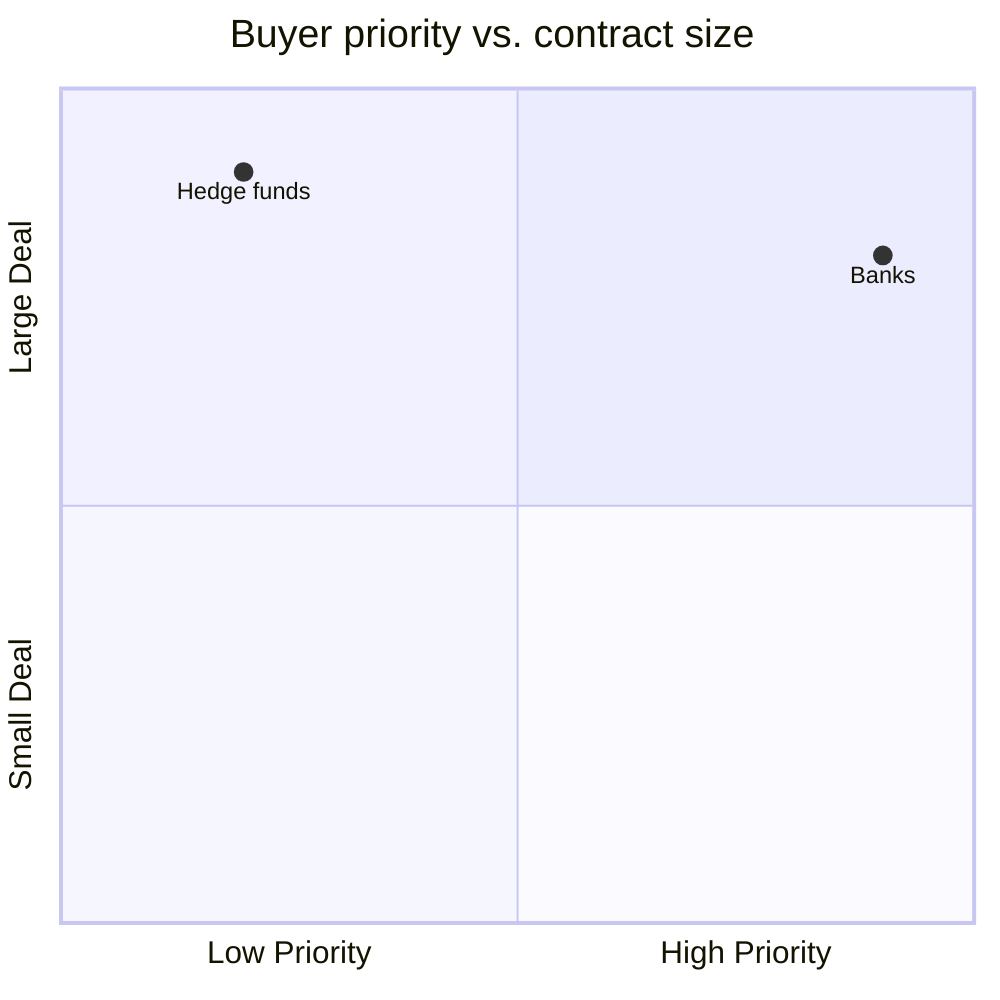

# diagram — generate diagrams that render correctly

LLMs reliably produce diagram *source*. They unreliably produce diagrams that *look good* without seeing the output. This skill closes that loop: generate → render → view the PNG → critique → iterate.

## When to use

- User asks for a diagram, flowchart, chart, visualization, "visual guide", architecture diagram, org chart, matrix, mind map, etc.
- User pastes an existing diagram and asks to improve it.
- Any time the user says "draw me", "visualize", "make a diagram".

**Don't use for:** data plots with numeric data (use matplotlib/plotly), code call graphs (use existing tools like `madge`, `pydeps`), real-time dashboards.

## Step 1 — pick the right tool for the data shape

The #1 reason diagrams look bad is **wrong tool for the data**. A buyer-segmentation table rendered as a flowchart will always be ugly no matter how much you iterate.

| Data shape | Tool | Why |
|---|---|---|
| Flow / sequence / state machine / ER | **Mermaid** | Native fit, best auto-layout for this |
| Grid / matrix / categories in parallel / org | **D2** | `grid-columns`, `grid-rows`, nicer themes |
| 2×2 priority or any quadrant | **Mermaid `quadrantChart`** | Purpose-built, ~10 lines |
| Mind map / taxonomy | **Mermaid `mindmap`** | Purpose-built |
| Graph / dependency tree | **Graphviz DOT** | Best graph auto-layout |
| Timeline / gantt | **Mermaid `gantt` / `timeline`** | Purpose-built |
| Precise custom layout, overlaps, annotations | **Raw SVG** | Total control |
| Hand-drawn aesthetic | **Excalidraw JSON** | Informal whiteboard feel |
| Cloud / C4 architecture | **PlantUML C4** or **D2** | Dedicated notation |

**Default picks:**
- Any flow-like data → Mermaid
- Anything else → D2 (if installed) else raw SVG

**Never default to `flowchart TD` for non-flow data.** If the arrows don't carry meaning, it's not a flowchart.

## Step 2 — check available renderers

Before generating, confirm which tools are installed:

```
which mmdc d2 rsvg-convert dot plantuml 2>/dev/null
```

Minimum viable: one of `mmdc` (Mermaid) or `rsvg-convert` (for SVG/D2 output). On this user's NixOS boxes, `mmdc` is in `nixos-base.nix`. If `d2` / `rsvg-convert` / `dot` missing and the data really needs them, tell the user and fall back to Mermaid.

## Step 3 — generate source with layout constraints

When prompting yourself to generate, **always** include a viewport budget and layout hints:

- **Target aspect ratio:** ~1.5:1 landscape, never exceed 3:1 in either direction
- **Target size:** designed to render clearly at 1200×800
- **Node label rules:** no markdown inside nodes (`**bold**`, `<b>` break Mermaid's foreignObject sizing). Use `<br/>` for wraps. Avoid em-dashes in labels (Mermaid measures them wrong; use `-` instead).
- **Colour coding:** if priority/category differentiation matters, use class/style definitions, not ad-hoc fills.

Save source to `scratchpads/diagram-<name>.{mmd,d2,svg,dot}`.

## Step 4 — render to PNG

Always render to PNG (not SVG) for self-review. Claude Code reads PNG/JPG natively via the Read tool.

Render at a fixed viewport to catch "image too long" issues — the whole point of the loop.

### Mermaid

```
mmdc -i scratchpads/diagram-foo.mmd \
     -o scratchpads/diagram-foo.png \
     -w 1200 -H 800 \
     -b transparent \
     -t dark
```

Themes: `default`, `dark`, `forest`, `neutral`. Match the user's palette preference if known.

### D2

```
d2 --theme 200 --layout elk \
   scratchpads/diagram-foo.d2 \
   scratchpads/diagram-foo.svg
rsvg-convert -w 1200 scratchpads/diagram-foo.svg \
   > scratchpads/diagram-foo.png
```

Layouts: `dagre` (default, compact), `elk` (tree/hierarchical, usually better), `tala` (paid, skip).
Themes: `0` (default), `1` (neutral grey), `100` (vanilla), `200` (dark), `300+` (various).

### Raw SVG

```
rsvg-convert -w 1200 scratchpads/diagram-foo.svg \
   > scratchpads/diagram-foo.png
```

If the SVG has an explicit `viewBox` and no `width`/`height`, `rsvg-convert -w 1200` will scale proportionally.

### Graphviz

```
dot -Tpng -Gsize=12,8\! -Gdpi=100 \
    scratchpads/diagram-foo.dot \
    -o scratchpads/diagram-foo.png
```

### PlantUML

```
plantuml -tpng scratchpads/diagram-foo.puml
```

## Step 5 — review the PNG against a rubric

Read the PNG back with the Read tool. Score against:

1. **Aspect ratio** — is it within 3:1? If >3:1 in either direction, layout is wrong; change `TD → LR`, add `grid-columns`, or switch tool.
2. **Text overflow / clipping** — any node label cut off? Any text spilling outside its container?
3. **Legibility at actual size** — would this be readable at 1200×800? If you'd have to zoom in, text is too small / too dense.
4. **Colour differentiation** — if categories / priorities are encoded by colour, are they distinguishable? Colourblind-safe palette?
5. **Overlapping elements** — do any edges cross nodes? Do labels overlap lines?
6. **Semantic correctness** — does the visual structure actually match the data? Arrows should mean something; clusters should group meaningfully.
7. **Whitespace** — is it cramped? too sparse?

Be blunt in the self-critique. "Looks fine" is not a critique.

## Step 6 — iterate

If any rubric item fails, fix the source and re-render. **Max 3 iterations.** If after 3 iterations it's still bad, you've probably picked the wrong tool — switch tool and start over.

After 3 iterations across 2 tools (total 6 renders), show the user what you've got and ask for direction. Don't spin forever.

## Common failure modes and fixes

| Symptom | Cause | Fix |
|---|---|---|
| Image very tall (like 350×2800) | `flowchart TD` for non-flow data, too many sequential nodes | Switch to D2 `grid-columns` or Mermaid `flowchart LR`; or restructure as matrix |
| Text cut off in nodes | Markdown (`**bold**`, `<b>`) inside labels, long unbroken words, em-dash metrics | Remove inline markdown; add `<br/>` for wraps; swap `—` → `-` |
| Edges crossing nodes | Too many edges for the layout engine | Graphviz with `dot` or D2 with `elk` layout usually resolves |
| All one colour | No class/style definitions | Add `classDef` (Mermaid) or class styles (D2); pick distinguishable hues |
| Labels overlapping edges | Default spacing too tight | Mermaid: `flowchart LR` often helps; D2: increase `style.padding` |
| Blurry PNG | Rendered at too-low resolution | Use `-w 1200` minimum; for print-quality use `-w 2400` |
| D2 layout looks like spaghetti | Default `dagre` can't find a clean layout | Switch to `--layout elk` |
| Mermaid foreignObject errors | HTML-unsafe chars in labels | Escape or replace `<`, `>`, `&` |

## Output conventions

- Save source + PNG both to `scratchpads/` so the user can re-render or tweak.
- Name files by topic: `scratchpads/diagram-buyer-segments.mmd` + `.png`.
- When presenting to the user, tell them the path of both files.
- If the user asks to iterate later, re-read the source from `scratchpads/` — don't regenerate from scratch.

## Worked example — the "tall narrow flowchart" problem

User had a buyer-segmentation Mermaid flowchart rendered at 351×2834. Data was 6 categories × 2–3 companies each with priority tiers. Reviewed, rubric failed on aspect ratio (8:1) and semantic correctness (arrows meaningless).

Fix: switched tool from Mermaid `flowchart TD` to D2 with `grid-columns: 3`, rendered 1200×900, all 6 categories as horizontally-arranged containers. Colour-coded by priority via D2 classes. Re-reviewed, passed.

Lesson: always question whether `flowchart` is the right primitive.

## Tool notes

### Mermaid `quadrantChart` — underrated

For 2×2 priority/effort/value matrices, ~10 lines:



### D2 cheat sheet for grids

```d2
grid-columns: 3
compliance: "Compliance & Risk" {
  banks; insurance; audit
}
legal: "Legal"
corporate: "Corporate"
```

Each container becomes a cell. Zero layout struggle.

### Raw SVG when all else fails

For one-off precise diagrams (overlap diagrams, annotated screenshots, custom visuals) write SVG directly. Use `viewBox="0 0 W H"` and skip `width`/`height` attributes — lets `rsvg-convert -w 1200` scale cleanly.

Keep it readable: group related elements with `<g>`, use CSS inside `<style>` for theming, use `<text>` with `text-anchor="middle"` for centred labels. Avoid foreignObject — not all renderers support it.
