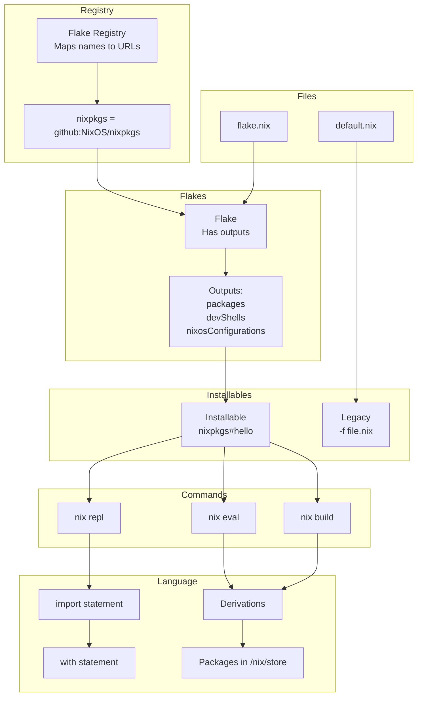

# NixOS notes
Nix is an... interesting language, so these are my notes/thoughts along the way

Right so nixos deserves its own file for all its... intricacies

## Syntax (i always forget)

### Angular bracket syntax


## Repl and Installables
### Repl
According to the docs from `nix repl --help`
```
Synopsis

    nix repl [option...] installables...
```

The arg after nix repl is `installables`.

Reading the docs for installables [here](https://nix.dev/manual/nix/2.18/command-ref/new-cli/nix#installables), it is of the form `flakeref[ # attrpath ],

e.g. `nixpkgs#hello`, or as the `#attrpath` is optional i guess just `nixpkgs`, where we can call `nix repl 'nixpkgs'`

### Flake show
Now, `nix flake show` shows the outputs of a flake, so we can actually see with nixpkgs (i've trimmed the output as its long)
```bash
➜ joelyboy dev-setup (main) ✗ nix flake show nixpkgs
path:/nix/store/bgl6ldj5ihbwcq8p42z3a0qzgqafgk2b-source?lastModified=0&narHash=sha256-LwWRsENAZJKUdD3SpLluwDmdXY9F45ZEgCb0X%2BxgOL0%3D
├───htmlDocs: unknown
    ...
    ...
├───legacyPackages
│   ├───aarch64-darwin omitted (use '--legacy' to show)
│   ├───aarch64-linux omitted (use '--legacy' to show)
│   ├───armv6l-linux omitted (use '--legacy' to show)
│   ├───armv7l-linux omitted (use '--legacy' to show)
│   ├───i686-linux omitted (use '--legacy' to show)
│   ├───powerpc64le-linux omitted (use '--legacy' to show)
│   ├───riscv64-linux omitted (use '--legacy' to show)
│   ├───x86_64-darwin omitted (use '--legacy' to show)
│   ├───x86_64-freebsd omitted (use '--legacy' to show)
│   └───x86_64-linux omitted (use '--legacy' to show)
├───lib: unknown
└───nixosModules
    ├───notDetected: NixOS module
    └───readOnlyPkgs: NixOS module
➜ joelyboy dev-setup (main) ✗
```

Can see now the `legacyPackages` attribute is loaded into the repl! which is from `nixpkgs`.

```bash
➜ joelyboy dev-setup (main) ✗ nix repl nixpkgs
Nix 2.28.4
Type :? for help.
Loading installable 'flake:nixpkgs#'...
Added 7 variables.
nix-repl> legacyPackages
{
  aarch64-darwin = { ... };
  aarch64-linux = { ... };
  armv6l-linux = { ... };
  armv7l-linux = { ... };
  i686-linux = { ... };
  powerpc64le-linux = { ... };
  riscv64-linux = { ... };
  x86_64-darwin = { ... };
  x86_64-freebsd = { ... };
  x86_64-linux = { ... };
}

nix-repl>
```


(FROM CLAUDE)

When you run `nix repl nixpkgs`, here's what happens:

1. **"nixpkgs" is a flake ID** that gets resolved via the registry to `github:NixOS/nixpkgs`
2. **The flake itself** has outputs like `packages`, `legacyPackages`, etc.
3. **In the REPL**, you're interacting with the flake's outputs, not the flake itself

So when you type `nixpkgs` in commands:
- `nix repl nixpkgs` → loads the entire flake's outputs
- `nixpkgs#hello` → means "the hello attribute from nixpkgs flake's outputs"
- The `#` separates flake reference from attribute path

The confusion comes because:
- `nixpkgs` (the flake) contains `legacyPackages.x86_64-linux` with thousands of packages
- When you load it in REPL, you see those packages directly
- But `nixpkgs` itself is the flake, not an output attribute


## Lookup syntax
Firstly, the nix "lookup syntax" `<...>` is sometimes used with `nixpkgs`, but I'm gonna write a simple example here to help myself understand it

Nix expressions expect a `default.nix` file (or a `flake.nix` for newer ones?), see [docs on default.nix here](https://nix.dev/manual/nix/2.25/command-ref/files/default-nix-expression).

This is a super simple example of looking up my example `default.nix` file with the `greeting` variable and evaluating it

In this case, I did a load of my module `mynixdir` and then executed `greeting` (which was made available as a string from inside `mynixdir`)

```bash
➜ jollof dev-setup (main) ✗ mkdir -p /tmp/mynixdir
➜ jollof dev-setup (main) ✗ echo -e '{\n greeting = "Hello there!";\n }' > /tmp/mynixdir/default.nix
➜ jollof dev-setup (main) ✗ nix eval --file /tmp/mynixdir greeting
"Hello there!"
➜ jollof dev-setup (main) ✗
```

Or, to demonstrate an import, and allocating it to a var and getting the value of `greeting`!
```bash
➜ joelyboy dev-setup (main) ✗ nix repl
Nix 2.28.4
Type :? for help.
nix-repl> import /tmp/mynixdir
{ greeting = "Hello there!"; }

nix-repl> myvar=(import /tmp/m
/tmp/mkdp-nvim.log  /tmp/mynixdir
nix-repl> myvar=(import /tmp/mynixdir)

nix-repl> myvar.greeting
"Hello there!"

nix-repl>
```



### Loading
`:l` loads a file in the repl, AND makes all vars available (unlike `import` which must be assigned to a variable)

e.g. see how `myAge` is loaded into available variables
```bash
joelyboy@desktop-work ~/c/dev-setup (main)> echo "{myAge=31;}" > /tmp/testie.nix
joelyboy@desktop-work ~/c/dev-setup (main)> nix repl
Nix 2.28.4
Type :? for help.
nix-repl> :l /tmp/testie.nix
Added 1 variables.

nix-repl> myAge
31

nix-repl>
```

### Lambda functions
e.g.
```nix
joelyboy@desktop-work ~/c/dev-setup (main)> nix repl
Nix 2.28.4
Type :? for help.
nix-repl> myFunc = { name }: "Hello ${name}"

nix-repl> myFunc { name = "jollof"; }
"Hello jollof"

nix-repl>
```

### Nix override attributes
the `//` operator overrides attributes
e.g.
```nix
joelyboy@desktop-work ~/c/dev-setup (main)> nix repl
Nix 2.28.4
Type :? for help.
nix-repl> me = { name="jollof"; age=31;}

nix-repl> me // {age=40;}
{
  age = 40;
  name = "jollof";
}

nix-repl>
```

### Curried functions
Basically chained function creation
e.g. create a function which creates ANOTHER function to add a set number
```nix
joelyboy@desktop-work ~/c/dev-setup (main)> nix repl
Nix 2.28.4
Type :? for help.
nix-repl> createAdder = numberToAdd : value : value + numberToAdd

nix-repl> add5 = createAdder 5

nix-repl> add5 12
17

nix-repl> add3 = createAdder 3

nix-repl> add3 12
15

nix-repl>
```


## Nix derivations
I'm not hoenstly sure exactly what they, except that they are some sort of enclased part of a function/package that runs/does something??

Anyway, an example to create a derivation, "instantiate" it to the store

> A note on heredoc
Anyway, continuing...

```bash
➜ jollof mynixdir cat > simple.nix << 'EOF'
with import <nixpkgs> {};
derivation {
  name = "simple";
  system = "x86_64-linux";
  builder = "${bash}/bin/bash";
  args = [ "-c" "echo hello > $out" ];
}
EOF
➜ jollof mynixdir nix-build simple.nix
this derivation will be built:
  /nix/store/ycdgnli9la2nhmrclldwv3mcckzb0684-simple.drv
building '/nix/store/ycdgnli9la2nhmrclldwv3mcckzb0684-simple.drv'...
/nix/store/i538l7xjp5d5sq5lr9v35pg34b6fq0mx-simple
➜ jollof mynixdir ll
lrwxrwxrwx   - jollof  9 Aug 19:24 result -> /nix/store/i538l7xjp5d5sq5lr9v35pg34b6fq0mx-simple
.rw-r--r-- 158 jollof  9 Aug 19:24 simple.nix
➜ jollof mynixdir cat result
hello
➜ jollof mynixdir readlink -f result
/nix/store/i538l7xjp5d5sq5lr9v35pg34b6fq0mx-simple
➜ jollof mynixdir cat $(readlink -f result)
hello
➜ jollof mynixdir
```

## Nix building
```bash
mkdir -p /tmp/testieflake
cat > /tmp/testieflake/flake.nix << 'EOF'
{
  description = "Super simple flake";
  
  inputs = {};  # No inputs at all!
  
  outputs = { self }: {
    packages.x86_64-linux.hello = derivation {
      name = "hello";
      system = "x86_64-linux";
      builder = "/bin/sh";
      args = [ "-c" "echo 'Hello from a flake!' > $out" ];
    };
  };
}
EOF
cd /tmp/testieflake
nix build .#hello
cat result
```

and then we get!

```bash
➜ joelyboy testieflake cd /tmp/testieflake
nix build .#hello
cat result

➜ joelyboy testieflake
```


and then we can import it into another flake, this is where the `url` style syntax comes into flakes!
```bash
➜ joelyboy myotherflake pwd
/tmp/myotherflake
➜ joelyboy myotherflake cat flake.nix
# /tmp/myotherflake/flake.nix
{
  description = "Simpler version";

  inputs = {
    mytestie.url = "/tmp/testieflake";
  };

  outputs = { self, mytestie }: {
    packages.x86_64-linux.combined = mytestie.packages.x86_64-linux.hello;
  };
}
➜ joelyboy myotherflake nix build .#combined --impure
➜ joelyboy myotherflake cat result
Hello from a flake!
➜ joelyboy myotherflake cat flake.lock
{
  "nodes": {
    "mytestie": {
      "locked": {
        "lastModified": 1758017036,
        "narHash": "sha256-xgTGb89vbd5jNRibieQ6ksc2erfI32l0s1T/pL+AHi0=",
        "path": "/tmp/testieflake",
        "type": "path"
      },
      "original": {
        "path": "/tmp/testieflake",
        "type": "path"
      }
    },
    "root": {
      "inputs": {
        "mytestie": "mytestie"
      }
    }
  },
  "root": "root",
  "version": 7
}
➜ joelyboy myotherflake
```


## Nix inspection (nixpkgs and more)
A good one is `nix flake metadata` after building this to see what `nixpkgs` is pinned to
```bash
➜ jollof dev-setup (main) ✗ nix flake metadata
warning: Git tree '/home/jollof/coding/dev-setup' is dirty
Resolved URL:  git+file:///home/jollof/coding/dev-setup
Description:   NixOS configuration of joel
Path:          /nix/store/p60sr5h6pgfa66b59n6cllmb4iixcz83-source
Revision:      635c008bcbb3f3080a9539f47c498da25b602375-dirty
Last modified: 2025-10-23 15:04:13
Fingerprint:   bc01275b322600e68894578c978ba61dc745fb529f73c90904a4271aab9b0dfe
Inputs:
├───nixpkgs: github:NixOS/nixpkgs/9a094440e02a699be5c57453a092a8baf569bdad?narHash=sha256-Vp9K5ol6h0J90jG7Rm4RWZsCB3x7v5VPx588TQ1dkfs%3D (2025-09-14 00:35:52)
├───nixpkgs-unstable: github:NixOS/nixpkgs/e643668fd71b949c53f8626614b21ff71a07379d?narHash=sha256-NY3kSorgqE5LMm1LqNwGne3ZLMF2/ILgLpFr1fS4X3o%3D (2025-09-24 05:06:22)
└───nur: github:nix-community/NUR/402529374b6642ed0a3c6e7cd26f47b475bb46ea?narHash=sha256-oP/0YzBq2TzFSgAOxKWxhnDgn1OYX0CfX6huYhdtXWE%3D (2025-10-24 12:40:00)
    ├───flake-parts: github:hercules-ci/flake-parts/205b12d8b7cd4802fbcb8e8ef6a0f1408781a4f9?narHash=sha256-4pDvzqnegAfRkPwO3wmwBhVi/Sye1mzps0zHWYnP88c%3D (2024-12-04 11:43:21)
    │   └───nixpkgs-lib follows input 'nur/nixpkgs'
    └───nixpkgs follows input 'nixpkgs'
➜ jollof dev-setup (main) ✗
```

And can do registry list
```bash
➜ jollof dev-setup (main) ✗ nix registry list -v
system flake:nixpkgs path:/nix/store/805qxiz47zwd8hm35hbpk3ifr8slpj2r-source
global flake:agda github:agda/agda
global flake:arion github:hercules-ci/arion
global flake:blender-bin github:edolstra/nix-warez?dir=blender
global flake:bundlers github:NixOS/bundlers
global flake:cachix github:cachix/cachix
global flake:composable github:ComposableFi/composable
...
```

