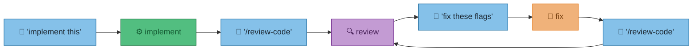
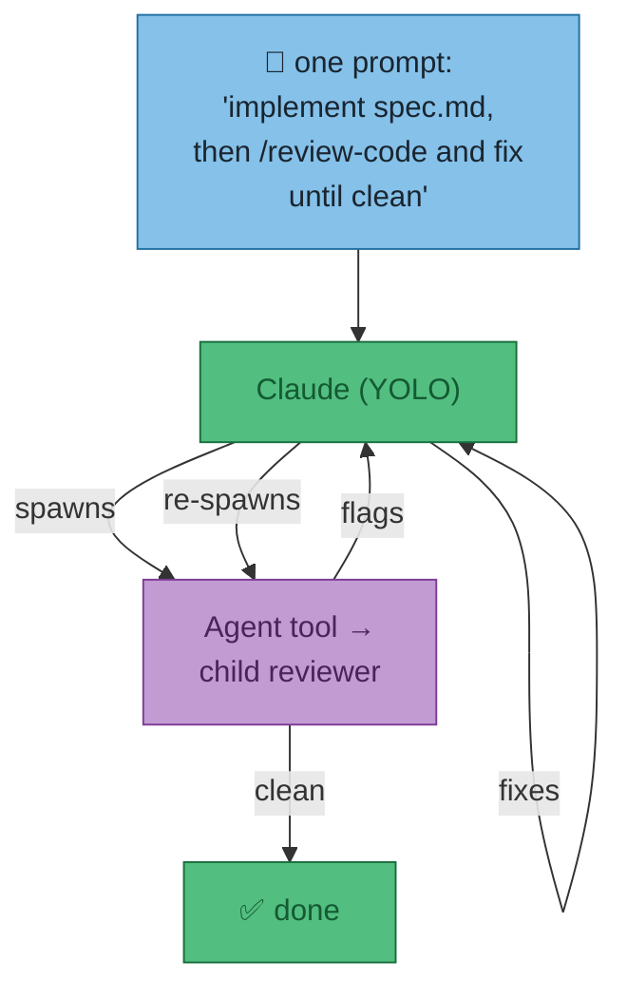
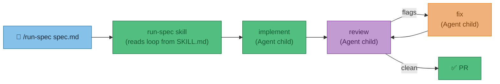
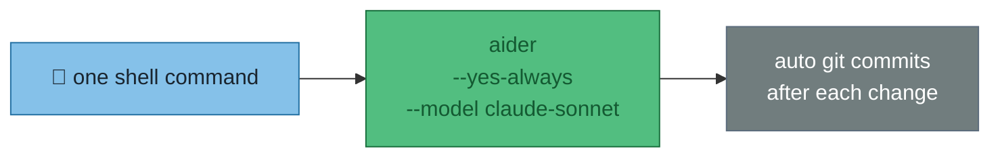
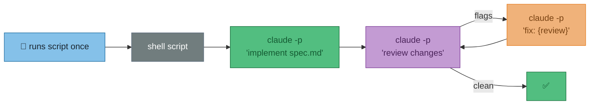

# ADR-001 — Reducing user prompts: autonomous spec-to-PR loop

**Status**: Proposed  
**Date**: 2026-05-31  
**Context**: The current workflow requires a human to prompt each step: implement, then manually invoke `/review-code`, read the output, prompt Claude to fix, re-review. The goal is to reduce that to one trigger — "implement spec.md" — and have Claude handle the rest without further prompting.  
**Decision**: Not yet made — this document captures the options.

---

## The problem

Today's flow requires a human at each arrow:



The goal: one prompt from the user, Claude drives all the arrows.

---

## Options

### Option A — Claude self-drives (zero tooling)

Tell YOLO-mode Claude to run the full loop in a single prompt. Claude uses the built-in `Agent` tool to spawn reviewer subagents and acts on their output.



**In practice:** Just tell it.

```
implement everything in spec.md, then run /review-code,
fix all flags, and repeat until /review-code comes back clean
```

| | |
|---|---|
| **Effort** | None — works today |
| **Loop control** | Claude decides when "clean" — usually correct |
| **Weak point** | Context window is the loop budget; Claude may drift or hallucinate "clean" after many turns |

---

### Option B — A `/run-spec` skill

A dedicated skill that encodes the loop explicitly: read spec → implement → review → fix → review. User types one slash command.



**In practice:** Write `configs/claude/skills/run-spec/SKILL.md` with explicit step-by-step instructions. The skill controls the loop — no ambiguity about when to stop.

| | |
|---|---|
| **Effort** | Write one SKILL.md (~1 hour) |
| **Loop control** | Explicit — skill defines the exit condition |
| **Weak point** | Still one Claude process; context window still the limit |

---

### Option C — Aider (`--yes-always`)

Aider is a CLI AI pair-programmer. With `--yes-always` it runs completely unattended. User fires one command and walks away.



**In practice:**
```bash
aider --model claude-sonnet-4-6 --yes-always \
  --message "implement spec.md, then review and fix until clean" \
  src/
```

| | |
|---|---|
| **Effort** | `pip install aider-chat` + config |
| **Loop control** | Single-shot — Aider doesn't natively loop review→fix; needs prompting in the message |
| **Weak point** | Less capable than Claude Code for complex tool use; no awareness of existing skills |

---

### Option D — `claude --print` pipeline (headless chaining)

Claude Code's `-p` / `--print` flag runs non-interactively. Pipe the output of one call into the next — review output becomes fix input.



**In practice:**
```bash
claude -p "implement spec.md" --allowedTools Edit,Write,Bash
REVIEW=$(claude -p "review git diff, output JSON flags" --print)
until [ "$(echo $REVIEW | jq '.flags | length')" = "0" ]; do
  claude -p "fix: $REVIEW" --allowedTools Edit
  REVIEW=$(claude -p "re-review" --print)
done
```

| | |
|---|---|
| **Effort** | Write one bash script |
| **Loop control** | Fully explicit — you control the exit condition |
| **Weak point** | Each invocation starts cold (no memory); diff context grows with each loop |

---

## Comparison

| Option | User effort per run | Loop intelligence | Setup cost | Context-aware |
|--------|---------------------|-------------------|------------|---------------|
| **A — Self-drive** | One prose prompt | Claude judges | None | Yes (single session) |
| **B — /run-spec skill** | `/run-spec spec.md` | Skill-defined rules | ~1 hour | Yes (single session) |
| **C — Aider** | One shell command | Single-pass only | 30 min | Partial |
| **D — Headless pipeline** | One shell command | Script-defined | 1–2 hours | No (cold starts) |

---

## Recommendation

**B is the right answer** — a `/run-spec` skill gives you Option A's convenience with explicit loop control, uses the review skills already built, and stays within Claude Code's context so it has full awareness of the codebase. One SKILL.md file, no new dependencies.

**A works right now** for one-offs and exploration. The prompt above is all you need.

**D is useful** if you want the loop to run unattended overnight (outside a terminal session), since each `claude -p` call is independent and the process survives.

!!! warning "Does NOT cover"
    CI automation (GitHub Actions, webhooks), multi-repo orchestration, or evaluation pipelines — those are a separate concern.
