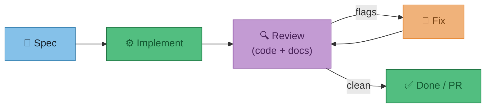
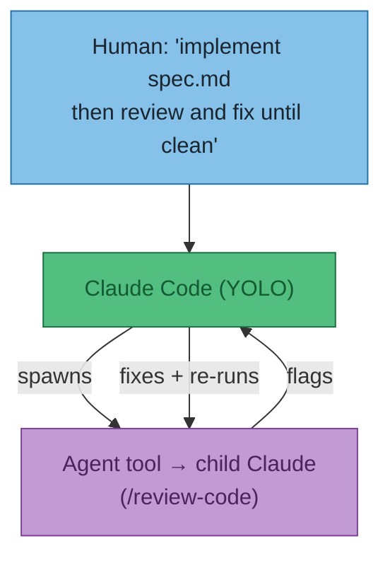
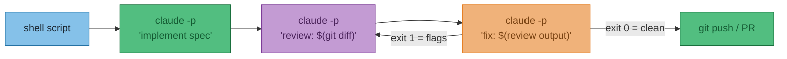
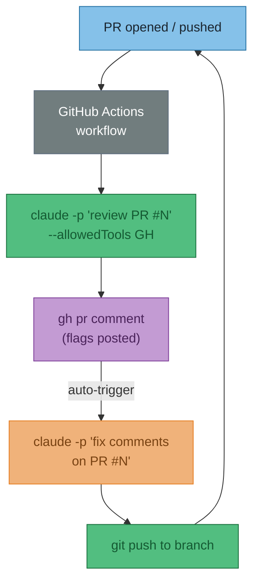
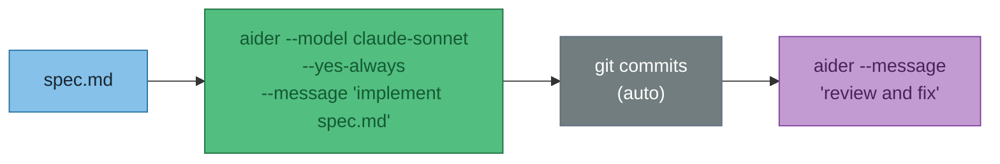
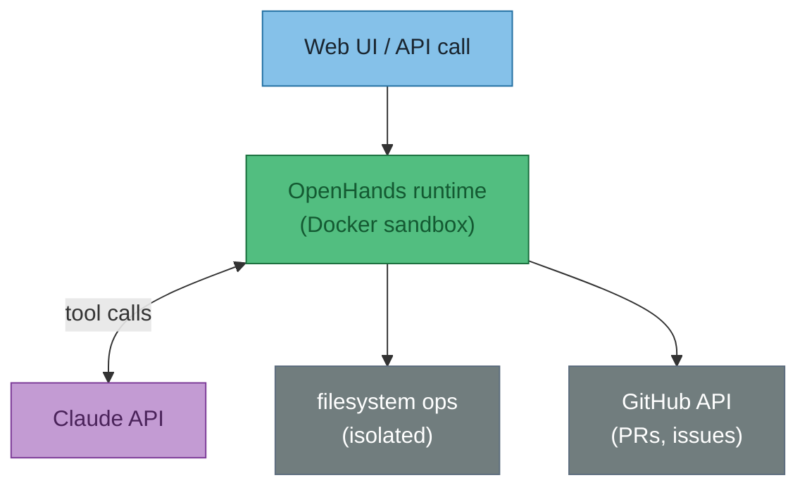
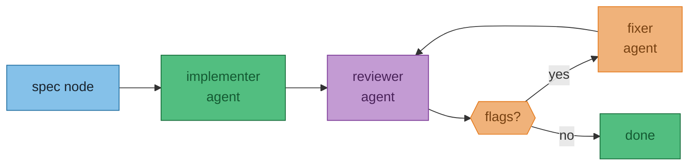

# ADR-001 — Claude Code external orchestration options

**Status**: Proposed  
**Date**: 2026-05-31  
**Context**: The current setup uses Claude Code skills (claude-master, review-code, review-docs) invoked manually. The goal is a closed loop: spec → implement → review → fix, driven externally with minimal human input per cycle.  
**Decision**: Not yet made — this document captures the options.

---

## The loop we're trying to build



The question is: what drives the arrows between those boxes?

---

## Options

### Option A — Claude drives itself (path of least resistance)

Tell Claude Code in YOLO mode to run the full loop: implement, then `/review-code`, then act on the output, then re-review. No external tooling.



**In practice:**
```
/implement spec.md then run /review-code and fix all flags, repeat until clean
```

Claude uses the built-in `Agent` tool to spawn a reviewer subagent, reads the output, and loops. Already possible with the current setup.

| | |
|---|---|
| **Cost** | Claude API tokens only — no extra infra |
| **Maturity** | Works today via claude-master + YOLO |
| **Limit** | Context window is the loop budget; no parallelism; Claude decides when "clean" |

---

### Option B — Shell script + Claude Code headless (`claude -p`)

Claude Code's `--print` / `-p` flag runs non-interactively. Chain invocations in bash — the output of one becomes the input of the next.



**In practice:**
```bash
claude -p "read spec.md and implement" --allowedTools Edit,Write,Bash
REVIEW=$(claude -p "review git diff, output flags as JSON" --print)
while echo "$REVIEW" | grep -q '"flags"'; do
  claude -p "fix these: $REVIEW" --allowedTools Edit
  REVIEW=$(claude -p "re-review git diff" --print)
done
```

| | |
|---|---|
| **Cost** | API tokens; can be tight-looped cheaply with Haiku for review pass |
| **Maturity** | `claude -p` is stable; scripting is DIY |
| **Limit** | No persistent memory between invocations; diff context can get large |

---

### Option C — GitHub Actions (CI-driven loop)

Trigger Claude Code on PR events. Review runs automatically; comments posted back; Claude auto-pushes fixes to the branch.



**In practice:** This is essentially what Anthropic's own [claude-code-action](https://github.com/anthropics/claude-code-action) does — a GHA that runs Claude Code headlessly against a PR. Already production-hardened.

| | |
|---|---|
| **Cost** | GHA minutes (free for public repos) + API tokens |
| **Maturity** | `claude-code-action` is official and actively maintained |
| **Limit** | Async (minutes per loop turn); needs repo write perms; loop depth limited by GHA timeouts |

---

### Option D — Aider

Aider is a battle-tested CLI AI pair-programmer. Supports Claude natively. Has `--yes-always` for fully unattended runs and `--auto-commits`. 



**In practice:**
```bash
aider --model claude-sonnet-4-5 --yes-always \
  --message "implement everything in spec.md" \
  src/

aider --model claude-sonnet-4-5 --yes-always \
  --message "review your last changes, fix any issues" \
  src/
```

| | |
|---|---|
| **Cost** | API tokens; Aider itself is free/OSS |
| **Maturity** | Very mature — 3+ years, active community, battle-tested on real codebases |
| **Limit** | Less flexible than Claude Code for complex tool use; no built-in review loop |

---

### Option E — OpenHands (formerly OpenDevin)

Open-source software development agent with a web UI, sandboxed Docker execution, and multi-agent support. Self-hostable.



**In practice:** Point it at a GitHub issue, it clones the repo, implements a fix, opens a PR. All automated.

| | |
|---|---|
| **Cost** | Self-host free; managed cloud ~$25/task rough estimate |
| **Maturity** | Actively developed; production-usable but occasionally flaky on complex tasks |
| **Limit** | Heavy infra (Docker required); overkill for single-repo use |

---

### Option F — LangGraph / AutoGen

Frameworks for building stateful multi-agent graphs. You define nodes (agents, tools, conditions) and edges (transitions). Full control over the loop logic.



| | |
|---|---|
| **Cost** | API tokens + your dev time to build the graph |
| **Maturity** | LangGraph: mature, production-ready. AutoGen: solid but Microsoft-opinionated |
| **Limit** | Significant upfront build cost; you're writing the orchestration from scratch |

---

## Comparison

| Option | Effort to set up | Loop control | Cost | Best for |
|--------|-----------------|--------------|------|----------|
| **A — Claude self-drives** | None (works today) | Claude decides | API tokens | One-shot tasks, experimenting |
| **B — Shell script** | Low (bash) | Explicit, cheap | API tokens | Repeatable pipelines you control |
| **C — GitHub Actions** | Low (`claude-code-action`) | PR-event-driven | GHA + tokens | Team workflows, PR review |
| **D — Aider** | Low (install + config) | CLI flags | API tokens | Unattended implementation runs |
| **E — OpenHands** | High (Docker, infra) | Full | Cloud/self-host | Complex multi-step tasks with isolation |
| **F — LangGraph/AutoGen** | High (framework code) | Full | API tokens | Custom multi-agent products |

---

## Recommendation

**Start with A** — Claude already does this when asked correctly in YOLO mode. Zero setup cost, uses the review-code and review-docs skills already built.

**Graduate to B or C** once the loop needs to run without a human present (overnight jobs, CI gates). The `claude-code-action` makes C near-zero-effort for PR workflows.

**Only reach for E or F** if you need isolation, parallelism across many repos, or are building a product on top of it.

!!! warning "Does NOT cover"
    Model fine-tuning, RAG pipelines, or evaluation frameworks — those are separate concerns.
