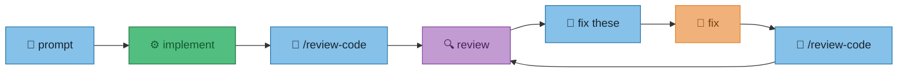
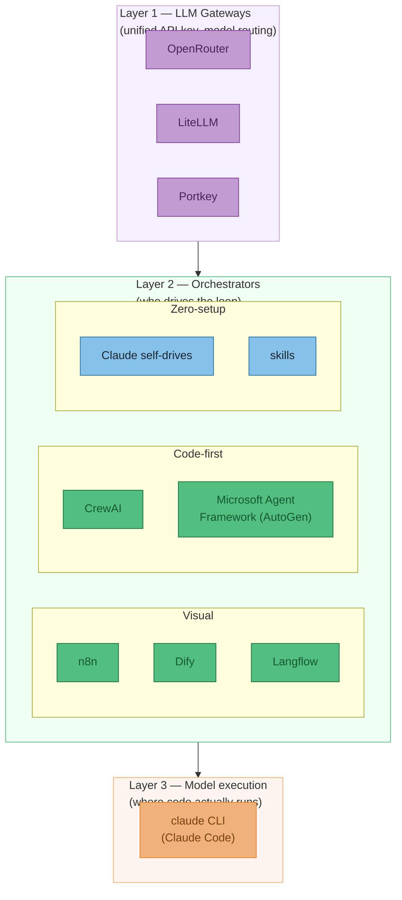
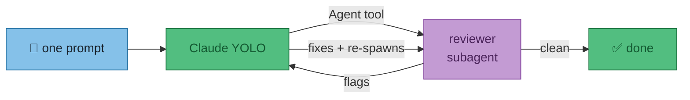
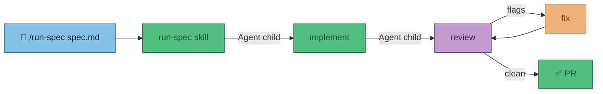
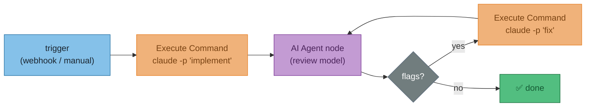
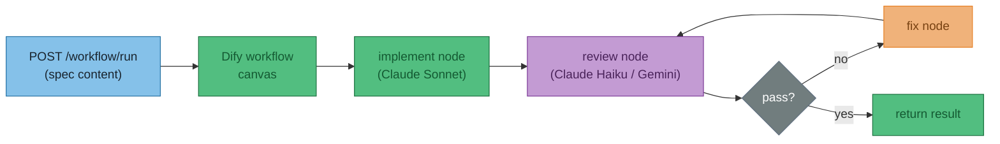
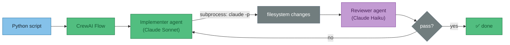
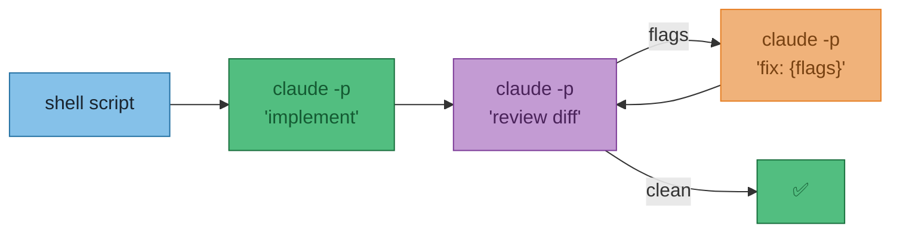

# ADR-001 — Reducing user prompts: autonomous spec-to-PR loop

**Status**: Proposed  
**Date**: 2026-05-31  
**Context**: The current workflow requires a human to prompt each step: implement, then manually invoke `/review-code`, read the output, prompt Claude to fix, re-review. The goal is to reduce that to one trigger — "implement spec.md" — and have Claude handle the rest without further prompting.  
**Decision**: Not yet made — this document captures the options.

!!! warning "Does NOT cover"
    CI automation (GitHub Actions, webhooks), evaluation frameworks, or RAG (Retrieval-Augmented Generation) pipelines.

---

## The problem

Today's flow requires a human at each arrow:



The goal: one prompt in, Claude drives all the arrows.

---

## Tool landscape

The tools fall into three layers. You need to understand all three to pick the right combination.



!!! tip "Key insight"
    None of these tools have native Claude Code integration. Every option eventually shells out to `claude -p` or calls the Anthropic API directly. The loop is always yours to wire — the tools just differ in how much wiring they do for you.

---

## Layer 1 — LLM Gateways

Gateways do one thing: give you a **single API key and endpoint** that routes to any model (GPT-4, Claude, Gemini, Llama, etc.). They are not orchestrators — they don't drive the loop.

| Tool | Self-host | Cost | Best for |
|------|-----------|------|----------|
| **OpenRouter** | No | 5.5% fee, ~27 free models | Zero-infra access to 300+ models |
| **LiteLLM** | Yes (MIT) | Free; enterprise ~$250/mo | Self-hosted routing, spend tracking |
| **Portkey** | No | Free 10K logs/mo; $49/mo Pro | Production observability, cost tracing |

**OpenRouter** is the simplest: sign up, add credits, point any tool at `openrouter.ai/api/v1` with one key. Useful when you want to swap models (e.g. use Gemini Flash for the cheap review pass, Claude Sonnet for implementation) without managing separate credentials.

**LiteLLM** is OpenRouter but self-hosted — you run the proxy, own the routing config, and get per-model spend caps to prevent runaway loops.

---

## Layer 2 — Orchestrators

### Option A — Claude self-drives (zero tooling)

Tell YOLO-mode Claude to run the full loop in one prompt. Claude uses the built-in `Agent` tool to spawn reviewer subagents.



```
implement everything in spec.md, then run /review-code,
fix all flags, and repeat until /review-code comes back clean
```

**Works today. Zero setup.** Weak point: context window is the loop budget; Claude decides when "clean".

---

### Option B — `/run-spec` skill

A SKILL.md that encodes the loop explicitly. User types one slash command.



Write `configs/claude/skills/run-spec/SKILL.md` with explicit step-by-step instructions. The skill defines the exit condition — no ambiguity about when to stop.

**~1 hour to build. Uses skills already built. Best next step.**

---

### Option C — n8n (visual orchestrator)

n8n is a self-hostable workflow automation tool (183K GitHub stars) with first-class AI Agent nodes. The key node for this use case: **Execute Command** — lets you shell out to `claude -p` from within a visual flow.



Pair with OpenRouter/LiteLLM so all model credentials live in one place — n8n just passes through the unified key.

**Best if you want visual debugging of each loop step. ~2 hours to set up. Self-hostable.**

---

### Option D — Dify

Dify (138K GitHub stars) is a visual platform for building and **deploying** LLM-powered apps. More app-builder than dev-automation tool — but its workflow canvas can model the loop, and the output can be exposed as an API endpoint.



Limitation: Dify operates on text — it can call the Anthropic API to generate code, but it cannot run `claude` CLI (i.e. Claude Code with filesystem access). Use this when the loop is pure model-to-model, not when Claude Code needs to actually edit files.

**Best if you want a deployable app with a REST API. Overkill for personal dev workflow.**

---

### Option E — CrewAI

Python library for role-based multi-agent workflows. Lowest boilerplate of the code-first options (~35 lines for a working crew). Uses LiteLLM under the hood, so any model per agent.



Caveat: the open-source version lacks built-in tracing. When the loop runs unattended and fails on turn 4, debugging is painful without the paid AMP (Agent Management Platform) tier.

**Best code-first option if you want explicit loop control in Python with low ceremony.**

---

### Option F — `claude --print` headless pipeline

Claude Code's `-p` flag runs non-interactively. Shell-script the loop yourself — review output becomes fix input.



Each `claude -p` call starts cold — no memory of previous turns. The diff grows with each loop iteration. Works well for overnight unattended runs where you don't need a persistent session.

---

## Tools to skip

| Tool | Why |
|------|-----|
| **Langflow / Flowise** | Squeezed between n8n (better automation) and Dify (better app-building). No compelling advantage for this use case. |
| **Wordware** | Company pivoted in April 2025 to a consumer product ("Sauna"). Workflow product has uncertain future. |
| **Coze (ByteDance)** | Generous free model access but ByteDance data provenance is a concern; better for chatbots than dev automation. |
| **Microsoft Agent Framework** | Powerful but .NET/Azure-oriented and heavy ceremony for a personal dev loop. |

---

## Full comparison

| Option | User effort per run | Drives Claude Code CLI | Multi-model | Setup cost | Self-host |
|--------|---------------------|------------------------|-------------|------------|-----------|
| **A — Self-drive** | One prose prompt | Yes (native) | No | None | — |
| **B — /run-spec skill** | `/run-spec spec.md` | Yes (native) | No | ~1 hour | — |
| **C — n8n** | Trigger button / webhook | Via Execute Command node | Via OpenRouter/LiteLLM | ~2–3 hours | Yes |
| **D — Dify** | API call | No (API only, no filesystem) | Yes (built-in) | ~2–3 hours | Yes |
| **E — CrewAI** | `python run_spec.py` | Via subprocess | Via LiteLLM | ~2 hours | Yes (lib) |
| **F — Headless pipeline** | `./run-spec.sh` | Via `claude -p` | Via OpenRouter/LiteLLM | ~2 hours | Yes |

---

## Recommendation

!!! abstract "Short answer"
    **B now. C or E when you need unattended runs or multi-model routing.**

**Start with B** — a `/run-spec` skill is one SKILL.md file, reuses the review skills already built, stays inside Claude Code's context (so it can actually edit files), and the loop is explicit. An afternoon's work.

**Upgrade to C (n8n) or E (CrewAI)** when you need:

- The loop to run without a terminal session open (overnight jobs)
- A cheaper model for the review pass (use OpenRouter to swap Gemini Flash in without changing the loop logic)
- Visual per-step debugging (n8n) or Python control flow (CrewAI)

**D (Dify)** is only interesting if you want to expose the loop as a REST API that something else calls into — not a personal dev tool.
