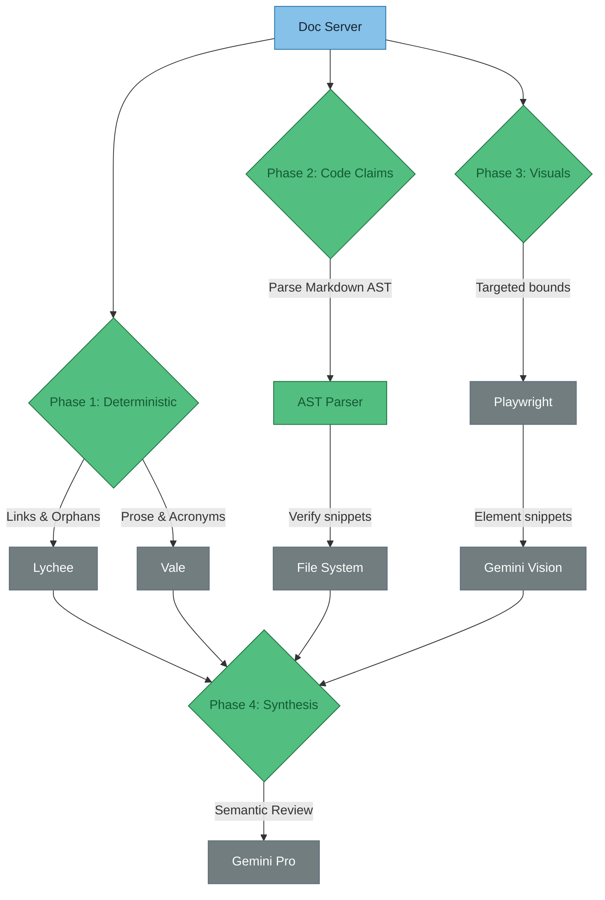

# ADR-002 — Robust AI Documentation Review Pipeline

**Status**: Proposed  
**Date**: 2026-06-01  
**Context**: The current `review-docs` bash-based skill relies on fixed-height `chromium` screenshots and Gemini LLM calls to handle both deterministic checks (broken links, missing acronyms) and semantic reasoning. This causes truncation of long pages, misses lazy-loaded elements, and burns context tokens on tasks better suited for static analysis.  
**Decision**: Transition the documentation review pipeline to a hybrid architecture: offload deterministic checks to purpose-built static analysis tools (Lychee, Vale, AST parsing) and reserve Gemini strictly for holistic semantic review and targeted Playwright element screenshots.

**Consequences**:
- ✓ **What this enables**: Perfect link checking, zero-hallucination acronym linting, and high-fidelity, untruncated diagram reviews via bounded screenshots.
- ✗ **What this rules out or costs**: Increases tooling complexity by requiring a Node.js/Python orchestrator, Playwright binaries, and Vale dictionaries instead of a single standalone bash script.

---

## Pipeline Architecture

!!! abstract "Key insight"
    Stop using the LLM for things a linter can do. An LLM cannot reliably click a broken link or count acronyms. It *can* tell you if a diagram is confusing. 

## Category Breakdown & Recommendations

| Category | Scope | Recommended Tool | Why this tool? |
|----------|-------|------------------|----------------|
| **Navigation & Links** | Broken internal/external links, missing images, orphaned pages not in navigation | **Lychee** (Rust) | Checks rendered HTML (not just raw Markdown source) for broken routing concurrently. |
| **Prose & Style** | Undefined acronyms, assumed jargon, passive voice, readability | **Vale** (Go) | Industry-standard linter. Uses deterministic rulesets. Fails instantly on unapproved terminology without hallucinating. |
| **Visual Rendering** | Broken Mermaid syntax, overlapping text, layout bugs | **Playwright** + **Gemini Vision** | Avoids 8000px truncation. Captures high-res bounding-box screenshots of just the `.mermaid` or `img` elements. |
| **Factual Consistency** | Do code references actually exist in the current repo? | **AST Parsing** + **LLM** | Extracts `inline_code` perfectly. Code fetches verify existence. Small LLM prompt confirms claims. |
| **Semantic Context** | Does this page make logical sense? Are there leaps in reasoning? | **Gemini Pro** | Freed from counting links, the LLM can act purely as the "Junior Researcher" cold-reading the page structure. |

!!! tip "Why Playwright over `chromium --headless`?"
    A raw Chromium capture won't click through interactive tabs, won't trigger lazy-loading below the fold, and its `--window-size` argument blindly crops content. Playwright allows the script to scroll, expand accordions, and isolate specific diagrams (`await page.$('.mermaid').screenshot()`).

## Scripting Recommendations

The current `SKILL.md` is a monolithic bash script stringing together `grep` and `cat`. This needs to be rewritten as a structured orchestrator (Node.js/TypeScript or Python).

1. **Initialization**: Start the local `mkdocs serve` process in the background.
2. **Lychee Sweep**: Execute `lychee http://localhost:<port>` to identify routing and missing image issues globally.
3. **Vale Sweep**: Execute `vale docs/` to collect all style, acronym, and clarity flags.
4. **Playwright Execution**:
    - Iterate over the site map.
    - Screenshot the top 1000px "Hero" section of each page.
    - Locate all `img`, `svg`, and `.mermaid` elements, taking precise bounding-box screenshots of each.
5. **Synthesis**: Batch the findings. Send the text, static tool reports, and specific image elements to Gemini for the final "Junior Researcher" summary.
