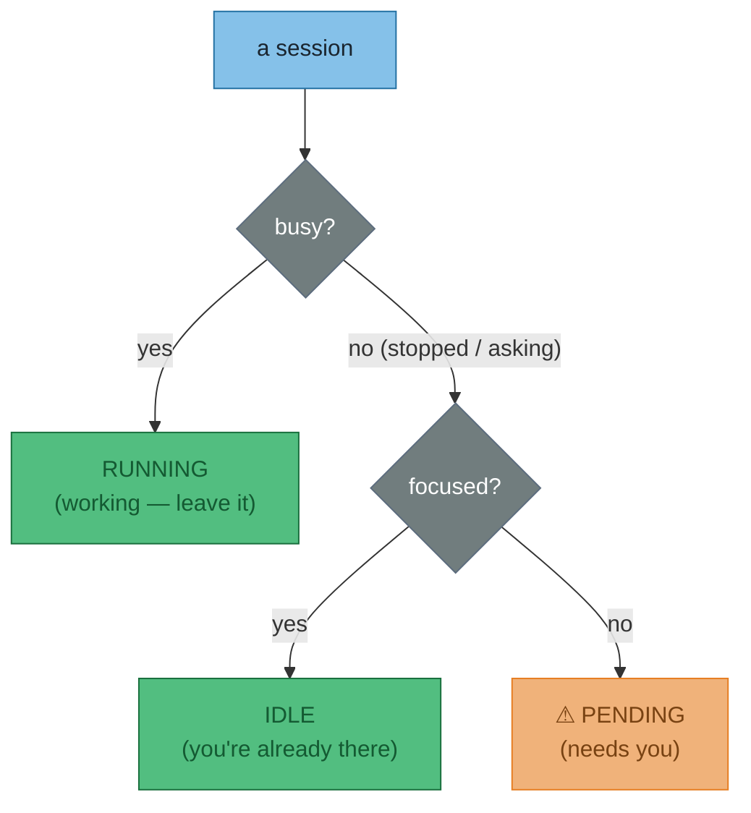
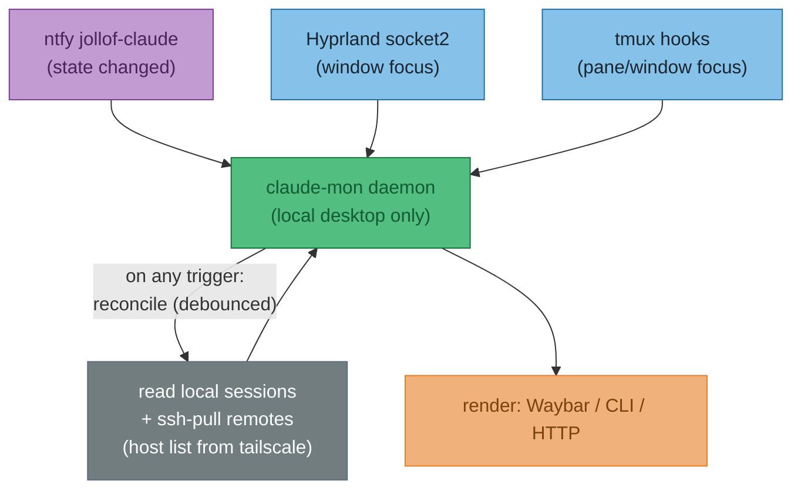

# ADR-003 — Claude Session Monitor: event-driven, multi-host state tracking

**Status**: Accepted
**Date**: 2026-06-14
**Context**: One at-a-glance view of every Claude Code session across all machines — the local desktop **and** remote boxes reached over SSH (Secure Shell). Each session is **running**, **idle**, or **pending** ("Claude stopped or is asking, and you haven't looked yet"). This records the chosen architecture. (Full feature spec: `dev-notes/claude-session-monitor-spec.md`.)

**Decision**: One `claude-mon` daemon on the local desktop. **Events decide *when* to refresh; a pull decides *what's true*.** ntfy + Hyprland + tmux hooks are triggers; an SSH-pull of `~/.claude/sessions/*.json` is the source of truth. Remotes run only a tiny `claude-mon collect` script — no daemon, no API.

!!! warning "Does NOT cover"
    Render surface (Waybar vs HTTP vs CLI), state-precedence rules, and the stale-timeout value — those are D1–D5 in the spec, unchanged.

---

## The state model

Two independent questions per session; combine them for the three reportable states:

The **state** axis (busy?) and the **focus** axis (looking at it?) come from different inputs — that's why there are two pipelines below.

!!! abstract "The one idea that drives the whole design: edges vs levels"
    ntfy is a stream of **transitions** (edges) — "a session just stopped". It can *never* tell you what's running *right now* or even what sessions exist (levels). So ntfy is a perfect **trigger**, but the **source of truth** has to be a direct read of the session files. Hence: event triggers a *pull*, the pull is ground truth.

---

## Architecture

One daemon, three triggers, one authoritative pull, one render. Remotes are passive — they just hold their `~/.claude/sessions/*.json` and answer `ssh <host> claude-mon collect`.

---

## The decisions

| # | Decision | Chosen | Why |
|---|----------|--------|-----|
| **D6** | Remote-host list | **Tailscale** — `tailscale status --json`, filter to online peers | No config to maintain; **read-only, needs no sudo** |
| **D7** | Acquire remote state | **SSH-pull** = source of truth; ntfy = trigger only. No per-host API | Pull gives complete *levels*; reuses SSH + Tailscale already in place; no daemon on remotes |
| **D8** | Focus transport | **Event-driven**: Hyprland `socket2` + tmux hooks | Already proven for `waybar-focus.sh`; no polling |
| **D9** | Remote (SSH) focus | **Pull on local focus event** — piggyback the SSH-pull | No remote-push channel, no ntfy side-topic, no key interception |

### D7 — how the pull works

Local sessions are a plain file read. Remote sessions: the daemon runs `ssh <host> claude-mon collect`, which returns the host's session JSON. This is the ground-truth *level* snapshot and the fallback whenever ntfy is down (ntfy's `since=` replays missed edges after downtime). Pull only on a trigger, debounced — so it's cheap.

### D8 — focus, two doors

- **Hyprland (window focus):** tail `socket2` with `socat` for `activewindow` — the same pattern as `configs/hypr/scripts/waybar-focus.sh`. Covers groups for free (the active window *is* the visible group tab).
- **tmux (pane/window focus):** no socket, but global hooks — `set-hook -g pane-focus-in 'run-shell …'` (plus `after-select-pane` / `after-select-window`) poke the daemon when you switch panes.
- **Matching:** `hyprctl activewindow -j \| .pid` → the session whose `TERMINAL_WINDOW_PID` (from `/proc/<pid>/environ`, no hook needed) matches; if inside tmux, confirm `pane_active && window_active`. Logic lifted from `notify-if-unfocused.sh`.

### D9 — remote focus without a remote channel

For an SSH session the tmux that matters runs on the *remote* host. Rather than have the remote push its focus back (another channel to keep alive), the daemon pulls: **when local Hyprland focus lands on the terminal that's SSH'd into `<host>`, the same SSH-pull also returns that host's tmux focus bits**, computed where tmux actually lives. Remote focus = *local* window event → pull. No remote push.

---

## Consequences

- ✓ Remotes stay dumb: one `collect` script, no daemon, no API, no open ports.
- ✓ Reuses what's already working: ntfy hook, Tailscale, SSH, the Hyprland-socket pattern.
- ✓ Push latency without trusting push as truth (event-triggered reconciliation).
- ✗ A daemon to supervise (start/restart, debounce, missed-event catch-up) — more than a naive 2s poll, but the cost of low latency.
- ✗ SSH-pull adds per-trigger latency; if it ever hurts, the escape hatch is a per-host API (D7 Option 3), explicitly deferred until proven necessary.
