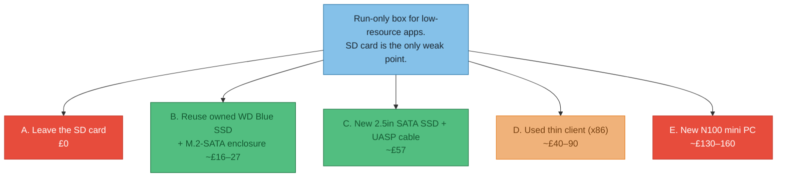

# ADR-004 — pi-box: add storage, or replace the machine?

**Status**: Accepted
**Date**: 2026-06-14
**Resolution (2026-06-14)**: Keep the Pi; **ordered a Fikwot FX815 256GB 2.5" SATA SSD (£34.99) + UGREEN 2.5" UASP USB-3 caddy (£9.99) = £44.98.** Reusing the internal WD Blue was rejected — it's an internal `sata` drive holding live data, so freeing it means opening the desktop for no net saving over a £45 new drive.
**Context**: pi-box (Raspberry Pi 4, 8GB RAM, bought ~£100) is meant to be the **cheap, stable, low-maintenance box that just *runs* low-resource apps** (e.g. the SparkyFitness calorie tracker) — explicitly **not** a dev box. That role belongs to streaming-server (the Beelink N100). pi-box felt sluggish; diagnosis ([dev-log 2026-06-14](../../dev-log/2026-06.md)) found the **only** weakness is its SD card (~750 random-write IOPS, plus the long-term wear/corruption risk SD cards carry). The question this ADR answers is **not** "which SSD" — it's "**is upgrading this Pi worth it for a run-only box, or should I spend similar money on a different machine?**"

!!! success "Decided & ordered"
    **Keep the Pi; add an SSD.** Ordered: **Fikwot FX815 256GB 2.5" SATA SSD + UGREEN 2.5" UASP caddy = £44.98.** Not a new machine — the Pi is already adequate for the run-only role; its sole gap is storage, and the main reason to fix it is *reliability* (SD-card wear), not speed. SSD power draw is fine on the Pi 4's USB (unlike the spinning HDD, which isn't).

## The real question: speed isn't the issue — reliability is

!!! tip "Why the SD card matters *less* than the diagnosis implied — but still matters"
    The painful symptom (slow `nixos-rebuild`, sluggish SSH) is a **dev** workload — thousands of small writes. This box won't do that. For **running** SparkyFitness (≈500MB RAM, occasional small database writes) the SD card's ~750 write IOPS is *tolerable*. **So the upgrade isn't really about speed for this use case — it's about reliability:** SD cards are the #1 cause of Raspberry Pi failure, and a database writing continuously will wear and eventually corrupt one. An SSD removes that failure mode.

## Options

| Option | Cost | Verdict for a *run-only* box |
|---|---|---|
| **A. Keep SD card** | £0 | ❌ Works, but the wear/corruption risk is exactly what you don't want in an unattended always-on box. False economy. |
| **B. Reuse WD Blue SSD + M.2-SATA enclosure** | ~£16–27 | ❌ *Rejected.* The WD Blue is **internal** (`sata`) and holds live data — freeing it means opening the desktop, for no saving over a £45 new drive. |
| **C. New 2.5" SATA SSD + UASP caddy** | **~£45** | ✅ **Chosen** — Fikwot FX815 256GB (£34.99) + UGREEN UASP caddy (£9.99). Clean, in stock, leaves the WD Blue untouched. |
| **D. Used thin client (Dell Wyse 5070 / Lenovo M-series)** | ~£40–90 | 🟠 Strictly better hardware (x86, onboard SATA/NVMe, 8GB+), similar money — but means a fresh NixOS install + migration + finding a good unit. Only worth it if you want to *retire* the Pi. |
| **E. New N100 mini PC** | ~£130–160 | ❌ Overkill for run-only, and the most money. The Pi already has the RAM/CPU headroom this role needs. |

## Decision

**Proposed: Option B if the WD Blue can be freed (~£20), otherwise Option C (~£57). Keep the Pi.**

The £100 already spent on the Pi is sunk. The live decision is *marginal*: **~£20–57 to make the box you own reliable**, vs **~£40–160 to replace a box that is already adequate** (plus migration effort). For a stable, low-resource, run-only role, the Pi 4 8GB is genuinely enough — CPU, RAM, power and thermals all measured healthy; storage is the only gap, and a cheap SSD closes it.

!!! note "When to revisit (i.e. when replacement *would* be justified)"
    - The apps outgrow ~8GB RAM or want real multi-core x86 grunt.
    - You want to consolidate onto one machine and retire the Pi.
    - The Pi's USB power budget proves flaky under the SSD (then a powered USB hub or a thin client with internal storage wins).

## Consequences

- ✓ Keeps cost minimal (~£20–57) and reuses owned hardware.
- ✓ Removes the SD-card reliability/wear failure mode — the real win for an unattended box.
- ✓ No OS reinstall or migration; the existing NixOS `pi-box` config carries over.
- ✗ Still a Pi 4 — if future apps get heavy, this only delays a replacement, doesn't avoid it.
- ✗ Option B depends on the WD Blue being spare and buying the *correct* enclosure type (see the M.2/SATA/NVMe explainer in the dev-log — easy to buy the wrong one).
