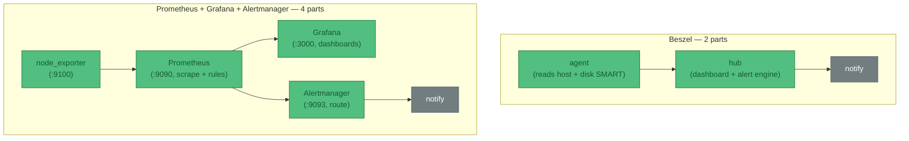

# ADR-005 — Homelab observability: trial Beszel vs Prometheus/Grafana/Alertmanager

**Status**: Proposed (trial)  
**Date**: 2026-06-20  
**Context**: The landscape is mapped in [reference/observability](../../reference/observability.md). For host metrics + dashboards + alerts on the homelab boxes, two approaches are worth trialling on real hardware. The rest are ruled out: **Netdata** (its RAM-growth bug is open and recurred on v2.8.2 in Dec 2025, the UI went proprietary, and it was dropped from Debian — enshittification), and **SigNoz** (OpenTelemetry/ClickHouse all-in-one — too enterprise-shaped and heavy for this scale).

**Decision**: Trial **Beszel** (lightweight, dashboard + alerts in one) and **Prometheus + Grafana + Alertmanager** (the standard, for when PromQL and the ecosystem are wanted). Minimal NixOS configs below. Beszel is the default-light; reach for the Prometheus stack only once Beszel's fixed metric set isn't enough.

!!! note "Dashboards are a parallel concern to alerts"
    Both stacks give you a **dashboard to *look* at CPU/RAM/IOPS trends** (proactive) *and* an **alert path to be *told*** (reactive). The dashboard is useful with zero alert rules set — see the reference page.

## Moving parts — the deciding axis



Grafana *has* got easier — **Grafana Alloy** (one collector replacing node_exporter-scraping + promtail + OTel agents) and Grafana's **built-in unified alerting** (which can absorb standalone Alertmanager) both cut parts. But even slimmed, the Prometheus stack is 3–4 services to the Beszel stack's 2 (hub + agent, one binary each).

## Option A — Beszel (minimal, single box: hub + agent)

```nix
# Hub: web UI + alert engine. Agent: per-host metrics incl. disk I/O via SMART (your IOPS).
services.beszel.hub = {
  enable = true;
  host = "0.0.0.0";          # reach the UI from your LAN / tailnet
  port = 8090;
};

services.beszel.agent = {
  enable = true;
  smartmon.enable = true;     # disk I/O + SMART health (adds the agent to the disk group)
  openFirewall = true;        # hub -> agent on :45876
  # KEY = the hub's public key, shown in the hub UI's "Add System" dialog after first launch.
  # Use environmentFile (agenix) for real secrecy; inline shown for clarity:
  environment.KEY = "ssh-ed25519 AAAA...replace-me...";
};

networking.firewall.allowedTCPPorts = [ 8090 ];   # expose the dashboard
```

First-run: open `http://<host>:8090`, create the admin user, **Add System** (localhost, port 45876) → it shows the `KEY` to paste above → rebuild. Alerts (CPU/mem/disk/temp/status) are configured *in the hub UI*, delivered via Shoutrrr (ntfy, email, Telegram, webhook…). Two services, one box, done.

## Option B — Prometheus + Grafana + Alertmanager (minimal)

```nix
# node_exporter — exposes this host's CPU / RAM / disk-IOPS / net on :9100
services.prometheus.exporters.node.enable = true;

# Prometheus — scrape the exporter, evaluate alert rules, hand firing alerts to Alertmanager
services.prometheus = {
  enable = true;                                   # :9090
  scrapeConfigs = [{
    job_name = "node";
    static_configs = [{ targets = [ "localhost:9100" ]; }];
  }];
  rules = [''
    groups:
      - name: host
        rules:
          - alert: HighCPU
            expr: 100 - (avg by (instance) (rate(node_cpu_seconds_total{mode="idle"}[5m])) * 100) > 85
            for: 5m
            annotations: { summary: "CPU > 85% for 5m on {{ $labels.instance }}" }
  ''];
  alertmanagers = [{ static_configs = [{ targets = [ "localhost:9093" ]; }]; }];
};

# Alertmanager — route/dedupe firing alerts to a receiver
services.prometheus.alertmanager = {
  enable = true;                                   # :9093
  configuration = {
    route.receiver = "default";
    receivers = [{
      name = "default";
      # webhook shown; swap for email_configs / slack_configs / etc.
      webhook_configs = [{ url = "https://ntfy.sh/your-topic"; }];
    }];
  };
};

# Grafana — dashboards over Prometheus (datasource auto-provisioned)
services.grafana = {
  enable = true;                                   # :3000
  settings.server = { http_addr = "0.0.0.0"; http_port = 3000; };
  provision.datasources.settings.datasources = [{
    name = "Prometheus"; type = "prometheus"; url = "http://localhost:9090"; isDefault = true;
  }];
};

networking.firewall.allowedTCPPorts = [ 3000 ];    # expose Grafana
```

First-run: open Grafana on `:3000` (default admin/admin), the Prometheus datasource is already wired, import a node-exporter dashboard (e.g. Grafana dashboard ID 1860). Four services to Beszel's two.

!!! warning "ntfy receiver caveat"
    Alertmanager's `webhook_configs` POSTs *its own JSON* — ntfy will show that blob as the message body. For clean ntfy notifications use a small relay, an `email_configs` receiver, or **Grafana's built-in unified alerting** (richer contact points, and it lets you drop the standalone Alertmanager → one fewer part).

## Consequences

- ✓ Both are pure NixOS modules — declared in `configuration.nix`, no Docker, reproducible.
- ✓ Beszel: 2 services, ~10 MB agent, disk-IOPS + SMART, dashboard + alerts in one — the low-maintenance default.
- ✓ Prometheus stack: PromQL, huge dashboard/exporter ecosystem, long retention — when you outgrow Beszel.
- ✗ Prometheus stack is 3–4 services + a query language to learn; clean ntfy needs a relay or Grafana alerting.
- ✗ Beszel is younger (v0.18.x) with a fixed metric set and no PromQL.
- **Trial plan:** run Beszel first (cheap to stand up); add the Prometheus stack on the same box to compare dashboards/alerting hands-on, then keep whichever earns its moving parts.
