# November 2025
Ok I have some time gonna try and finally figure out how to setup networking properly so mullvad works
Well firstly i found the arch docs for [resolv.conf here](https://man.archlinux.org/man/resolved.conf.5)

Ok the domains = "~." makes a bit more sense now. have asked claude to give some examples.

```mermaid
graph TD
    A["Your Laptop"] --> B["Two Network Connections"]
    B --> C["eth0<br/>(Wired - Office Network)<br/>DNS: 10.0.0.1, 10.0.0.2"]
    B --> D["wlan0<br/>(WiFi - Home)<br/>DNS: 8.8.8.8, 8.8.4.4"]
    
    C --> E["eth0 Config:<br/>Domains=~corp.local"]
    D --> F["wlan0 Config:<br/>Domains=~home.local"]
    
    E --> G["Query: database.corp.local"]
    F --> H["Query: printer.home.local"]
    
    G --> I["✓ Uses Office DNS<br/>10.0.0.1 or 10.0.0.2"]
    H --> J["✓ Uses Home WiFi DNS<br/>8.8.8.8 or 8.8.4.4"]
    
    K["WITHOUT route-only domains ~"] --> L["❌ Both queries might use<br/>same default DNS<br/>and fail!"]
```



Need to figure out this shite
```vim
echo expand("%:p")
```

**Schemas**
ALso JSON schema is fine.... I was being the pleb that it is the schema that defines whether one can haveaa additional properties or not....
So vscode json schema is absolutely fine....

In fact, i actually broken the entire JSON schema validation by me trying to hack together the path for json schema path for SWAYNC.

Well... now its working again and setup basic schema validation for JSON and YAML via schema store plugin (thanks to whoever made that!)


** Lua type checking **


**TODO comments**
Wow.....,  I'm dumb, turns out todo-comments actually says that it matches any text *followed by a colon* in the docs, that's why it wasn't working before...

**Theme**
So have been using using kanagawa up until now but finding it a bit ... lackluster, idk anything specific but just not me.

Plus i overrode the colours for diff view ages ago and it has been messing up my colours schema ever since.

> TODO: still need to get around to making some notes about highlight groups

Ok REALLY liking onedark so far, seems really clear, easy to read and nice to look at

But so far:
- kanagawa: colours nice, but a bit lackluster, diff view not that clear. markdown render doesn't play nice
- lemons: bit too harsh back/yellow combination for me
- nanode: not "clear" enough for me, the contrast between the green and the background and comments (brackets etc)

### Lua
Ok so metatables? another excellently documented feature in Lua... [here](https://www.lua.org/pil/13.html) 😠

So.... its just a really poorly implemented version of classes and methods? this language just keeps on giving doesn't it...
```lua

me={age=31}
solene={age=29}
mt = {
  __add = function(a,b)
    local newAge = a.age + b.age
    return {age=newAge}
  end
}

setmetatable(me, mt)
setmetatable(solene, mt)

print(me + solene)

=> {
  age = 60
}
```

An example of how not to do lua (lol). To be fair it does say in the docs that the metamethod `__index` is only called when a field is absent in the table
```lua
local myObj = {name="jollof", age=31}
mt = {
  __index = function(tbl, key)
    print("you are accesing the key: ", key)
    return tbl[key]
  end
}
setmetatable(myObj, mt)

=> {
  age = 31,
  name = "jollof",
  <metatable> = {
    __index = <function 1>
  }
}
myObj.name

=> "jollof"
myObj.age

=> 31

myObj.ohdear

=> [1] "you are accesing the key: ", [2] "ohdear"
[1] "you are accesing the key: ", [2] "ohdear"
[1] "you are accesing the key: ", [2] "ohdear"
[1] "you are accesing the key: ", [2] "ohdear"
[1] "you are accesing the key: ", [2] "ohdear"
[1] "you are accesing the key: ", [2] "ohdear"
[1] "you are accesing the key: ", [2] "ohdear"
[1] "you are accesing the key: ", [2] "ohdear"
[1] "you are accesing the key: ", [2] "ohdear"
[1] "you are accesing the key: ", [2] "ohdear"
[1] "you are accesing the key: ", [2] "ohdear"
[1] "you are accesing the key: ", [2] "ohdear"
[1] "you are accesing the key: ", [2] "ohdear"
[1] "you are accesing the key: ", [2] "ohdear"
```

> yay infinite loop!

I (think) this explains a bit better
- create a "namespace" with default values, constructor
- constructor to set metatable to new instance of object and then just return the object
- define meteatable index if the requested key does not exist in the (user) object
- if not in user object then query the prototype
- in my testie debug example, i log an error (even if the key exists in prototype!)

```lua
-- create a namespace
Window = {}
-- create the prototype with default values
Window.prototype = {x=0, y=0, width=100, height=100, }
-- create a metatable
Window.mt = {}
-- declare the constructor function
function Window.new (o)
  setmetatable(o, Window.mt)
  return o
end
Window.mt.__index = function (table, key)
  print("oh dear, trying to access ", key)
  return Window.prototype[key]
end


myWindow = Window.new({pls=1})

myWindow.pls

=> 1

myWindow.x

=> [1] "oh dear, trying to access ", [2] "x"
0

myWindow.height

=> [1] "oh dear, trying to access ", [2] "height"
100

myWindow.asdfasdfasdf

=> [1] "oh dear, trying to access ", [2] "asdfasdfasdf"
```

Well after all that there is no actual way to know the variables and methods that a person as defined when providing an object (i.e. nvim extensions) without actually reviewing the `__index` function as its provided as code.

> that is, unless the author has been kind enough to provide a `.lua` file with the `M.<func_here>` stubs file

Fuck, turns out blink snippets just don't need to go into insert mode! just need to use `<tab>` and `<s-tab>`

### Markdown LSP (dive into `icu` not working on NIXOS?)
Ok well `markdown-oxide` is crap (keeps treating # at end of a line as a h1...)

So trying out marksman but its complaining about `icu`? which smells distinctly like a NixOS problem rather than marksman itself.

So I (tried) using `icu` in systemPackages and rebuilding but no luck unfortunately.

Interesting to take a dive into nix build, where we are actually building a nix package ourselves! still not sure what the real life use case of this but oh well (or maybe the situation I'm in now?)

```bash
➜ jollof dev-setup (main) ✗ nix-build '<nixpkgs>' -A icu --no-out-link
/nix/store/girp43cxvqpjq4ad56r8girsq8na5bxh-icu4c-76.1
➜ jollof dev-setup (main) ✗ ls -la /nix/store/girp43cxvqpjq4ad56r8girsq8na5bxh-icu4c-76.1

total 7352
dr-xr-xr-x    4 root root      4096 Jan  1  1970 .
drwxrwxr-t 6893 root nixbld 7507968 Nov  9 16:06 ..
dr-xr-xr-x    2 root root      4096 Jan  1  1970 lib
dr-xr-xr-x    3 root root      4096 Jan  1  1970 share
```

Ok, I'm getting a bit lost here so I will try my best to log all of this down in my findings
When i do `nix-shell` it DOES work but I'm not sure why?. the path isn't actually the same (`icupkg` is one of the packages included when installing `icu`)
```bash
➜ jollof dev-setup (main) ✗ nix-shell -p icu

[nix-shell:~/coding/dev-setup]$ which icupkg
/nix/store/fkg8mlga46zabn5vzwazdwb9ws4z7m5w-icu4c-76.1-dev/bin/icupkg

[nix-shell:~/coding/dev-setup]$
```


I'm coming across `nix eval` again but honestly I can't remember how it works.

Well apparently it defaults to a file? Or it requires an argument to tell it whether its a file or expression typically (the `--expr` or `--file`, see [docs](https://nix.dev/manual/nix/2.18/command-ref/new-cli/nix3-eval))

Nice an easy example to refresh my memory (remember that builins.trace 2nd arg is the return val)
```bash
➜ jollof dev-setup (main) ✗   nix eval --expr 'builtins.trace "hi" 1'
trace: hi
1
➜ jollof dev-setup (main) ✗
```

Ok well I've tried adding an example `./scratchpads/hello.nix` and now going to "instatiate" it? which will add a derivation to the store
```bash
➜ jollof scratchpads (main) ✗ nix-instantiate hello.nix

warning: you did not specify '--add-root'; the result might be removed by the garbage collector
/nix/store/b4xsz860fm5ni2ds5hg0m71vw9jk5mgl-hello-text.drv
➜ jollof scratchpads (main) ✗
```

And now inspect the derivation?
```bash
➜ jollof scratchpads (main) ✗ nix derivation show /nix/store/b4xsz860fm5ni2ds5hg0m71vw9jk5mgl-hello-text.drv

{
  "/nix/store/b4xsz860fm5ni2ds5hg0m71vw9jk5mgl-hello-text.drv": {
    "args": [
      "-c",
      "echo 'Hello world!' > $out"
    ],
    "builder": "/bin/sh",
    "env": {
      "builder": "/bin/sh",
      "name": "hello-text",
      "out": "/nix/store/qn7dpn3an7la7w4br1ahkg06kmkhxi1l-hello-text",
      "system": "x86_64-linux"
    },
    "inputDrvs": {},
    "inputSrcs": [],
    "name": "hello-text",
    "outputs": {
      "out": {
        "path": "/nix/store/qn7dpn3an7la7w4br1ahkg06kmkhxi1l-hello-text"
      }
    },
    "system": "x86_64-linux"
  }
}
```

And now "realising" it (I have 0 idea what im doing....)
```bash
➜ jollof scratchpads (main) ✗ nix-store --realise /nix/store/b4xsz860fm5ni2ds5hg0m71vw9jk5mgl-hello-text.drv

this derivation will be built:
  /nix/store/b4xsz860fm5ni2ds5hg0m71vw9jk5mgl-hello-text.drv
building '/nix/store/b4xsz860fm5ni2ds5hg0m71vw9jk5mgl-hello-text.drv'...
warning: you did not specify '--add-root'; the result might be removed by the garbage collector
/nix/store/qn7dpn3an7la7w4br1ahkg06kmkhxi1l-hello-text
➜ jollof scratchpads (main) ✗ bat /nix/store/qn7dpn3an7la7w4br1ahkg06kmkhxi1l-hello-text

───────┬──────────────────────────────────────────────────────────────────────────────────────────────────────────────────────────────────
       │ File: /nix/store/qn7dpn3an7la7w4br1ahkg06kmkhxi1l-hello-text
───────┼──────────────────────────────────────────────────────────────────────────────────────────────────────────────────────────────────
   1   │ Hello world!
───────┴──────────────────────────────────────────────────────────────────────────────────────────────────────────────────────────────────
➜ jollof scratchpads (main) ✗
```

But.... at least I understand the diagram the guy posted on stackoverflow [derivation workflow](https://i.sstatic.net/NqxsO.png)


Perhaps this is a better example of an actual program (even though all it does is print hello world...), it IS STILL a binary
```bash
➜ jollof scratchpads (main) ✗ nix-instantiate hello-world.nix
warning: you did not specify '--add-root'; the result might be removed by the garbage collector
/nix/store/zjg421rhc7hfahgv3qhc30v25p5q8545-hello-world.drv
➜ jollof scratchpads (main) ✗ nix-store --realise /nix/store/zjg421rhc7hfahgv3qhc30v25p5q8545-hello-world.drv

this derivation will be built:
  /nix/store/zjg421rhc7hfahgv3qhc30v25p5q8545-hello-world.drv
building '/nix/store/zjg421rhc7hfahgv3qhc30v25p5q8545-hello-world.drv'...
warning: you did not specify '--add-root'; the result might be removed by the garbage collector
/nix/store/5nfhr4s73z9krcykw6hzxnf89jwswv0w-hello-world
➜ jollof scratchpads (main) ✗ /nix/store/5nfhr4s73z9krcykw6hzxnf89jwswv0w-hello-world

Hello, World!
➜ jollof scratchpads (main) ✗

Ahhhh, a crucial part of the derivation system is it has the system in there! so A different platform will produce a different derivation!

That's the first detail beside the generic "rEProDUCible" garbage out of google/chatGPT i've seen that helps explain why derivations are needed (over just nix code)


Well the `path-info` seems easy enough to understad...
```bash
➜ jollof scratchpads (main) ✗ nix path-info nixpkgs#icu
/nix/store/girp43cxvqpjq4ad56r8girsq8na5bxh-icu4c-76.1
➜ jollof scratchpads (main) ✗

As i suspected, `-r` for recursive means everything it depends on
```bash
➜ jollof scratchpads (main) ✗ nix path-info -r nixpkgs#icu
/nix/store/16hvpw4b3r05girazh4rnwbw0jgjkb4l-xgcc-14.3.0-libgcc
/nix/store/7r0k7ywzmgkscjxgzmgwsng0545h8id6-libunistring-1.3
/nix/store/2q1vszdygbs1icp1cd18a4d11zcsc97y-libidn2-2.3.8
/nix/store/4j6p91af1bfgnn31agg1c9ijr0kyg6gi-gcc-14.3.0-libgcc
/nix/store/g8zyryr9cr6540xsyg4avqkwgxpnwj2a-glibc-2.40-66
/nix/store/dj06r96j515npcqi9d8af1d1c60bx2vn-gcc-14.3.0-lib
/nix/store/girp43cxvqpjq4ad56r8girsq8na5bxh-icu4c-76.1
```

Also the treeview is pretty cool...
```bash
[nix-shell:~/coding/dev-setup/scratchpads]$ exit
exit
➜ jollof scratchpads (main) ✗ # get the store path for icu
p=$(nix path-info nixpkgs#icu)

➜ jollof scratchpads (main) ✗ echo $p
/nix/store/girp43cxvqpjq4ad56r8girsq8na5bxh-icu4c-76.1
➜ jollof scratchpads (main) ✗ nix-store -q --tree "$p"
/nix/store/girp43cxvqpjq4ad56r8girsq8na5bxh-icu4c-76.1
├───/nix/store/g8zyryr9cr6540xsyg4avqkwgxpnwj2a-glibc-2.40-66
│   ├───/nix/store/16hvpw4b3r05girazh4rnwbw0jgjkb4l-xgcc-14.3.0-libgcc
│   ├───/nix/store/2q1vszdygbs1icp1cd18a4d11zcsc97y-libidn2-2.3.8
│   │   ├───/nix/store/7r0k7ywzmgkscjxgzmgwsng0545h8id6-libunistring-1.3
│   │   │   └───/nix/store/7r0k7ywzmgkscjxgzmgwsng0545h8id6-libunistring-1.3 [...]
│   │   └───/nix/store/2q1vszdygbs1icp1cd18a4d11zcsc97y-libidn2-2.3.8 [...]
│   └───/nix/store/g8zyryr9cr6540xsyg4avqkwgxpnwj2a-glibc-2.40-66 [...]
├───/nix/store/dj06r96j515npcqi9d8af1d1c60bx2vn-gcc-14.3.0-lib
│   ├───/nix/store/4j6p91af1bfgnn31agg1c9ijr0kyg6gi-gcc-14.3.0-libgcc
│   ├───/nix/store/g8zyryr9cr6540xsyg4avqkwgxpnwj2a-glibc-2.40-66 [...]
│   └───/nix/store/dj06r96j515npcqi9d8af1d1c60bx2vn-gcc-14.3.0-lib [...]
└───/nix/store/girp43cxvqpjq4ad56r8girsq8na5bxh-icu4c-76.1 [...]
➜ jollof scratchpads (main) ✗
```

### SSHing clipboard
Ahhh back to this old fun.

So apparently kitty supports OSC52 by default (so no additional configuration needed!). 

So just trying to remind myself about escape codes... `\033` is the octal form of 27 (or escape)  then `[` is to do a CSI.

E.g. for a temrinal bell (number 7) it would be `printf "\a"` (for the control codes, or c0). remember that bell is a "general" code so does not need the `[` for CSI.

ANYWAY

claude gave this example which is to use OSC 52: the standard `\033` for 27 and ESC then `]` (NOT `[` for CSI) to get OSC.

- then `52` (for OSC 52)
- `c` for clipbaord
- then apparently it needs to be encoded?

so...

```bash
echo -ne "\033]52;c;$(echo -n "hello world" | base64)\a"
```

into any modern clipboard that supports OSC 52 (should) send that to clipboard which will work over SSH!

```mermaid
graph TD
    ESC["ESC (\\033, \\x1B, ^[)"]
    
    ESC --> CSI["[ → CSI<br/>Control Sequence Introducer"]
    ESC --> OSC["] → OSC<br/>Operating System Command"]
    ESC --> DCS["P → DCS<br/>Device Control String"]
    ESC --> OTHER["Other Sequences"]
    
    %% CSI Branch
    CSI --> CSI_FORMAT["Format: ESC [ params ; params letter"]
    CSI_FORMAT --> CSI_EXAMPLES["Examples:"]
    CSI_EXAMPLES --> CSI_EX1["\\033[2J - Clear screen"]
    CSI_EXAMPLES --> CSI_EX2["\\033[1;31m - Bold red text"]
    CSI_EXAMPLES --> CSI_EX3["\\033[10;20H - Move cursor to row 10, col 20"]
    CSI_EXAMPLES --> CSI_EX4["\\033[?25l - Hide cursor"]
    CSI_EXAMPLES --> CSI_EX5["\\033[38;5;214m - 256 color (214)"]
    CSI_EXAMPLES --> CSI_EX6["\\033[38;2;255;0;128m - RGB color"]
    
    CSI_FORMAT --> CSI_TERMINATOR["Terminators (letters):"]
    CSI_TERMINATOR --> CSI_TERM_LIST["m = SGR (colors/style)<br/>H = cursor position<br/>J = erase display<br/>K = erase line<br/>A/B/C/D = cursor move<br/>s/u = save/restore cursor<br/>h/l = set/reset mode"]
    
    %% OSC Branch
    OSC --> OSC_FORMAT["Format: ESC ] number ; text ST"]
    OSC_FORMAT --> OSC_EXAMPLES["Examples:"]
    OSC_EXAMPLES --> OSC_EX1["\\033]0;Window Title\\a - Set window title"]
    OSC_EXAMPLES --> OSC_EX2["\\033]52;c;base64text\\a - Clipboard"]
    OSC_EXAMPLES --> OSC_EX3["\\033]7;file://hostname/path\\a - Set working dir"]
    OSC_EXAMPLES --> OSC_EX4["\\033]8;;http://example.com\\aLink\\033]8;;\\a - Hyperlink"]
    
    OSC_FORMAT --> OSC_TERMINATOR["Terminators:"]
    OSC_TERMINATOR --> OSC_TERM_LIST["\\a (BEL, \\007)<br/>or<br/>\\033\\\\ (ESC \\)"]
    
    %% DCS Branch
    DCS --> DCS_FORMAT["Format: ESC P params ; data ESC \\"]
    DCS_FORMAT --> DCS_EXAMPLES["Examples:"]
    DCS_EXAMPLES --> DCS_EX1["\\033P1$r1;24r\\033\\\\ - DECSTBM margins"]
    DCS_EXAMPLES --> DCS_EX2["\\033P0;1|17/ab\\033\\\\ - Sixel graphics"]
    DCS_EXAMPLES --> DCS_EX3["\\033Pq#0;2;0;0;0#1\\033\\\\ - DECRQSS"]
    
    DCS_FORMAT --> DCS_NOTE["Note: Less common today<br/>Used for Sixel graphics,<br/>tmux passthrough,<br/>terminal queries"]
    
    %% Other sequences
    OTHER --> OTHER_LIST["ESC M - Reverse linefeed<br/>ESC 7 - Save cursor (DECSC)<br/>ESC 8 - Restore cursor (DECRC)<br/>ESC = - Keypad app mode<br/>ESC > - Keypad num mode<br/>ESC c - Full reset (RIS)"]
    
    %% Styling
    classDef escapeBox fill:#ffdddd,stroke:#cc0000,stroke-width:3px
    classDef csiBox fill:#ddffdd,stroke:#00cc00,stroke-width:2px
    classDef oscBox fill:#ddddff,stroke:#0000cc,stroke-width:2px
    classDef dcsBox fill:#ffffdd,stroke:#cccc00,stroke-width:2px
    classDef exampleBox fill:#f0f0f0,stroke:#888,stroke-width:1px
    
    class ESC escapeBox
    class CSI,CSI_FORMAT,CSI_TERMINATOR,CSI_TERM_LIST csiBox
    class OSC,OSC_FORMAT,OSC_TERMINATOR,OSC_TERM_LIST oscBox
    class DCS,DCS_FORMAT,DCS_NOTE dcsBox
    class CSI_EXAMPLES,CSI_EX1,CSI_EX2,CSI_EX3,CSI_EX4,CSI_EX5,CSI_EX6,OSC_EXAMPLES,OSC_EX1,OSC_EX2,OSC_EX3,OSC_EX4,DCS_EXAMPLES,DCS_EX1,DCS_EX2,DCS_EX3,OTHER_LIST exampleBox
```


