# June 2026

??? info "Key terms"
    | Term | Plain English |
    |---|---|
    | **ALSA** | Advanced Linux Sound Architecture — the kernel's raw audio driver layer. Every audio tool eventually hits this at the bottom. You rarely touch it directly. |
    | **PipeWire** | Modern Linux sound server (2021+). Routes audio between apps and hardware. Replaced both PulseAudio and JACK. |
    | **WirePlumber** | The policy brain on top of PipeWire — decides defaults, auto-switching, device rules. |
    | **A2DP** | Advanced Audio Distribution Profile — the Bluetooth "music quality" mode. Stereo, 44.1kHz, one-way (listen only). |
    | **HFP** | Hands-Free Profile — Bluetooth "phone call quality" mode. Mono, 16kHz, bidirectional. Activates the moment any app opens the headset mic. |
    | **HSP** | Headset Profile — older/worse version of HFP. 8kHz mono. |
    | **dBFS** | Decibels relative to Full Scale — digital loudness. 0 = ceiling (clipping). Everything useful is negative. |
    | **LUFS** | Loudness Units relative to Full Scale — perceptual loudness, frequency-weighted. What Spotify/YouTube actually measure. |
    | **RMS** | Root Mean Square — the "real" loudness of an audio file. √(average of all samples²). More meaningful than peak amplitude. |
    | **swhkd** | Simple Wayland HotKey Daemon — listens for key combos and runs shell commands. Wayland-native replacement for `sxhkd` (X11-only). |
    | **wtype** | Wayland keystroke injector — types text into the active window programmatically. Replaces `xdotool type` (X11-only). |
    | **SCO** | Synchronous Connection Oriented — the Bluetooth link type used for bidirectional audio. Too narrow for A2DP-quality data in both directions simultaneously. |

---

**Local voice dictation on Linux**

!!! success "What's running"
    `whisper.cpp` + `wtype` + `swhkd` — fully local, no API key. `base.en` model, ~400ms latency.

**How it works — end to end:**

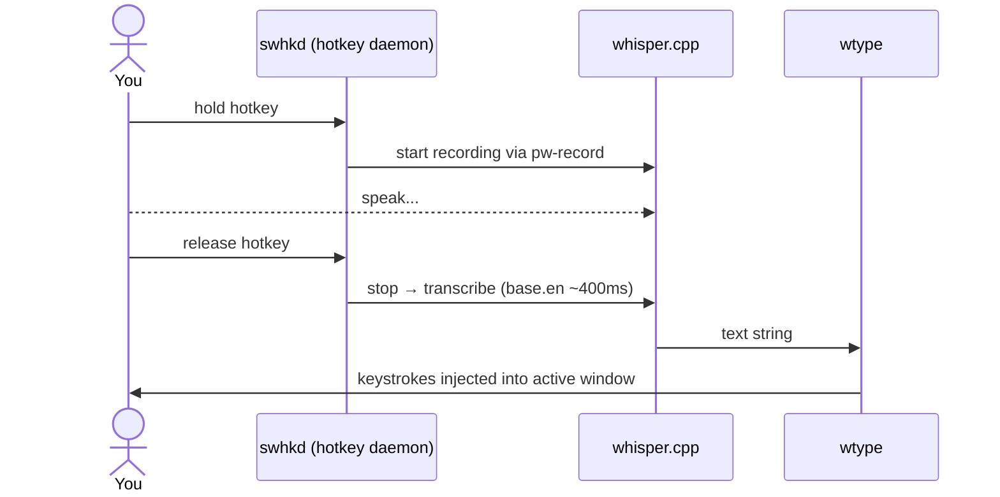

**Engine options:**

| Engine | Tool | Wayland | Latency | Notes |
|---|---|---|---|---|
| Whisper | `whisper.cpp` | ✅ | ~400ms | ✅ Chosen |
| Whisper | `faster-whisper` | ✅ | ~300ms | CTranslate2 backend |
| Whisper | `whisper-live` | ✅ | ~300ms streaming | Harder setup |
| Distil-Whisper | `whisper.cpp` | ✅ | ~200ms | Slightly less accurate |
| Vosk | `nerd-dictation` | ❌ XWayland only | ~100ms | Breaks on native Wayland |

**Model sizes** — pick by CPU budget:

| Model | Size | Latency | Sweet spot? |
|---|---|---|---|
| `tiny.en` | 75 MB | ~150ms | Fast but rough |
| `base.en` | 140 MB | ~400ms | ✅ Best balance |
| `small.en` | 460 MB | ~1s | Better accuracy, noticeable lag |
| `medium.en` | 1.5 GB | ~3s | Overkill for dictation |

!!! note "Why `swhkd` not `sxhkd`, `wtype` not `xdotool`"
    Both `sxhkd` and `xdotool` are X11-only. On native Wayland they silently fail or don't exist.

---

**Linux audio stack**

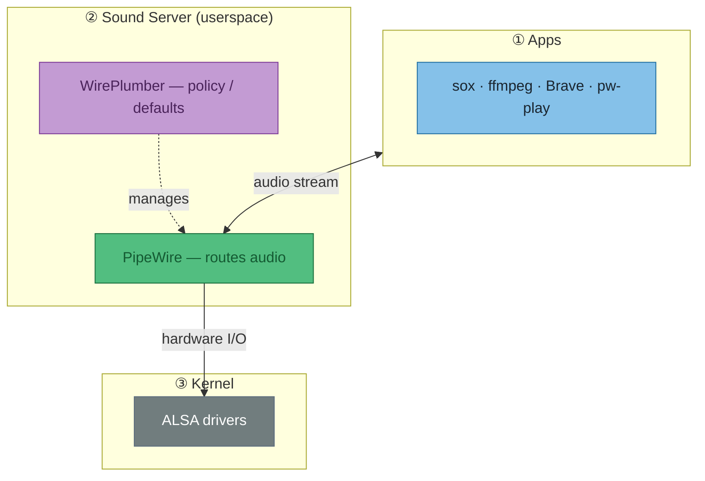

!!! tip "So what — debugging mental model"
    Tool not found or not working? First ask: **which layer does it live at?**

    | Symptom | Cause | Fix |
    |---|---|---|
    | `pactl: command not found` | PulseAudio not installed | Use `wpctl` instead, or add `pipewire-pulse` shim |
    | `aplay` works but `pw-play` doesn't | Wrong layer for this context | Use `pw-play` for PipeWire, `aplay` for raw ALSA |
    | App can't find mic | WirePlumber policy / default not set | `wpctl set-default <source-id>` |

!!! warning "Why `pactl` is missing on this machine"
    Pure PipeWire, no `pipewire-pulse` shim installed. Add `pipewire-pulse` to NixOS config to restore it.

**PulseAudio → PipeWire equivalents:**

| Task | PulseAudio | PipeWire |
|---|---|---|
| List devices | `pactl list sources short` | `wpctl status` |
| Set volume | `pactl set-sink-volume @DEFAULT_SINK@ 80%` | `wpctl set-volume @DEFAULT_AUDIO_SINK@ 80%` |
| Inspect device | `pactl list cards` | `wpctl inspect <id>` |
| Record | `parecord file.wav` | `pw-record file.wav` |
| Play | `paplay file.wav` | `pw-play file.wav` |

---

**Bluetooth audio: A2DP vs HFP**

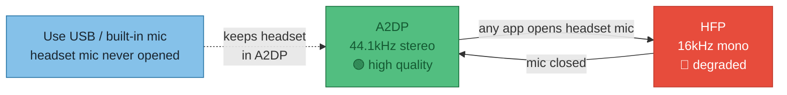

!!! tip "Why it switches"
    Bluetooth SCO (Synchronous Connection Oriented) links can't carry high-quality audio in both directions — bandwidth isn't there. Opening *any* mic input on the headset forces the switch.

!!! success "The fix — one line"
    Point `pw-record` / `rec` at a USB or built-in mic. Headset never gets a mic request → stays in A2DP.
    ```bash
    pw-record --target=<usb-mic-id> recording.wav
    ```

!!! tip "HFP is fine for Whisper anyway"
    16kHz is Whisper's native training format. Only matters if you want music *while* dictating.

| Profile | Quality | Direction | Codec |
|---|---|---|---|
| **A2DP** (Advanced Audio Distribution) | 44.1kHz stereo | Listen only | LDAC / aptX / AAC |
| **HFP** (Hands-Free Profile) | 16kHz mono | Bidirectional | CVSD / mSBC |
| **HSP** (Headset Profile) | 8kHz mono | Bidirectional | CVSD |

**Check active profile:**
```bash
wpctl inspect <id>   # id from: wpctl status
# api.bluez5.profile = "a2dp-sink"         ← good
# api.bluez5.profile = "headset-head-unit" ← degraded
```

WH-1000XM4 state (2026-06-06): `a2dp-sink` / `ldac`. Built-in mic is default source → A2DP preserved.

---

**WAV file analysis**

**Tools at a glance:**

| Command | Gives you |
|---|---|
| `ffprobe -show_streams file.wav` | Format: codec, sample rate, channels, duration |
| `sox file.wav -n stat` | Signal stats: peak, RMS, loudness |
| `ffmpeg -i file.wav -filter:a volumedetect -f null /dev/null` | dBFS peak + mean — ffmpeg alternative to sox |

**dBFS — the loudness scale**

!!! note "dBFS vs LUFS"
    **dBFS** (decibels relative to Full Scale) = raw peak amplitude. 0 = digital ceiling, everything useful is negative.
    **LUFS** (Loudness Units relative to Full Scale) = perceptual loudness, frequency-weighted. What streaming platforms actually normalise to.

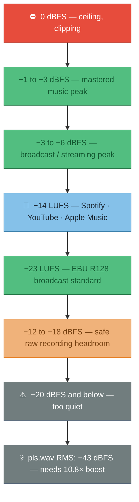

**`sox file.wav -n stat` — reading the output**

!!! warning "Bottom line first — `pls.wav`"
    Peak **−21 dBFS**, RMS **−43 dBFS**. Normal content sits at −3 to −14 dBFS. Needs ~10.8× boost.
    ```bash
    sox pls.wav out.wav norm        # normalize to 0 dBFS peak
    sox pls.wav out.wav vol 10.815  # explicit 10.8× boost
    ```

**The two numbers that matter:**

| Field | `pls.wav` | What it means | dBFS |
|---|---|---|---|
| `Maximum amplitude` | **0.092** | Loudest single sample — 9% of ceiling | **−21 dBFS** |
| `RMS amplitude` | **0.006935** | Real loudness — √(mean of all samples²) | **−43 dBFS** |

!!! tip "Peak vs RMS — why both matter"
    **Peak** tells you if you're clipping. **RMS** tells you how loud it actually sounds. A file can peak fine but be inaudible if the RMS is too low — that's exactly `pls.wav`.

**Supporting fields:**

| Field | `pls.wav` | Meaning |
|---|---|---|
| `Volume adjustment` | **10.815** | `1 / 0.092` — multiply by this to hit 0 dBFS peak |
| `Rough frequency` | 682 Hz | Dominant frequency — mid voice range |
| `Midline amplitude` | 0.002 | (max + min) / 2 — near 0 = no DC offset (good) |

??? info "All fields"
    | Field | Meaning |
    |---|---|
    | `Samples read` | Total samples = channels × duration × sample rate |
    | `Scaled by` | 32-bit int max — sox normalises all values to −1.0…+1.0 |
    | `Minimum amplitude` | Most negative sample — audio oscillates around zero, always negative |
    | `Mean norm` | Average of absolute values — ignores direction |
    | `Mean amplitude` | Raw average incl. direction — near-zero = balanced wave (expected) |
    | `Maximum delta` | Biggest jump between consecutive samples — high-freq content indicator |
    | `Mean delta` | Average sample-to-sample change — low = smooth/quiet signal |

**`wpctl status` — what's connected and routing where**

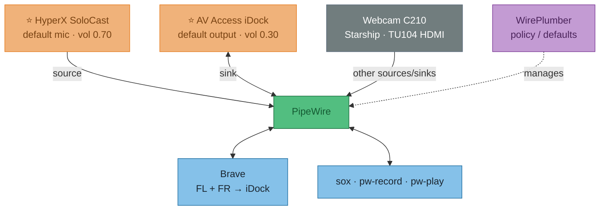

!!! tip "So what — reading `wpctl status`"
    | Term | Meaning |
    |---|---|
    | **Sink** | Output — speakers, headphones, dock |
    | **Source** | Input — mic, line-in |
    | **`*`** | Active default |
    | **`vol: 0.30`** | PipeWire software volume (0–1.0), separate from hardware gain |
    | **Streams** | Live routes — Brave output_FL/FR → iDock playback_FL/FR means browser audio is playing through the dock |
    | **Configured default** | Persisted preference — SteelSeries Arctis 7 saved but not connected, WirePlumber fell back to iDock automatically |

---

**Hyprland dictation — spec & solution comparison**

**Spec:** hold key → speak → release → text injected into active window. Accuracy over latency. NixOS / Hyprland / PipeWire.

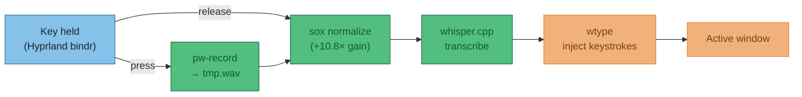

!!! warning "Normalize before transcribing"
    SoloCast records quiet (confirmed: `pls.wav` peak −21 dBFS). Sox normalize step is not optional — Whisper accuracy drops on under-gained audio.

**Solution comparison:**

| Approach | Accuracy | Post-release latency | NixOS | Verdict |
|---|---|---|---|---|
| **DIY script** — `pw-record` + `sox` + `whisper.cpp` + `wtype` | ⭐⭐⭐ | ~400ms–1s | ✅ all nixpkgs | ✅ Recommended |
| **whisper.cpp `--stream`** | ⭐⭐ | Live (jittery) | ✅ | Partial audio = worse accuracy |
| **waystt** (local mode) | ⭐⭐⭐ | Same as DIY | ❌ not in nixpkgs | Needs manual flake; defaults to cloud |
| **whisper-live** | ⭐⭐ | Near-live | ⚠️ needs flake | Python WebSocket server, complex setup |

!!! note "Why waystt needs an API key (and why `openai-whisper` didn't)"
    These are two different things with confusingly similar names:

    | Thing | What it is | API key? | Cost |
    |---|---|---|---|
    | `openai-whisper` (Python package) | Open-source model weights, runs **locally** | ❌ None | Free |
    | OpenAI Whisper **API** | Cloud inference service at api.openai.com | ✅ Required | Pay per minute |
    | Whisper large-v3-turbo ("turbo") | Distilled open-source model, runs **locally** | ❌ None | Free |

    `waystt` defaults to the cloud API backend — that's why it asks for a key. Switch `TRANSCRIPTION_PROVIDER=local` in `~/.config/waystt/.env` and it uses local GGML weights (same as `whisper.cpp`) with no key and no cost. The local mode is not the default though, which is the footgun.

**Hyprland binding pattern — no `swhkd` needed:**

```ini
# hyprland.conf — Hyprland handles press/release natively
bind  = SUPER, R, exec, ~/.local/bin/dictate-start.sh
bindr = SUPER, R, exec, ~/.local/bin/dictate-stop.sh
```

`bindr` fires on key **release**. `swhkd` is unnecessary — Hyprland has this built in.

## 2026-06-07 — flock / fd redirection primer (waybar double-start)

**Context:** double waybar on UWSM boot — `exec =` in hyprland.conf fires the restart script twice concurrently, both race to `waybar &`.

---

**The fd (file descriptor) table**

Every process owns a numbered table of open files — think of it as a cloakroom with numbered pegs. Each peg holds one open file. Three pegs are always taken:

```
peg 0 = stdin  (keyboard input)
peg 1 = stdout (terminal output)
peg 2 = stderr (error output)
pegs 3–9 = yours to use
```

`exec 9>/tmp/foo` hangs `/tmp/foo` on peg 9 — without starting a new process:

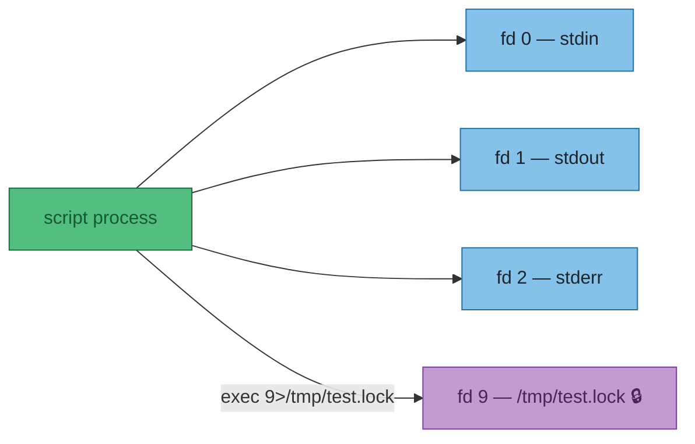

`flock -n 9` puts a kernel advisory lock on fd 9. **The lock lives on the fd — close the fd, lock is gone.**

---

**Decoding the redirection syntax**

Start with something familiar — redirecting output to a file:

```sh
echo hello > /tmp/foo
```

What you don't see: **every `>` secretly has a number in front of it.** That number is which fd to redirect. The default is `1` (stdout):

```sh
echo hello 1> /tmp/foo   # same thing — 1 is stdout
echo hello 2> /tmp/foo   # stderr instead
```

So `9>/tmp/foo` just means: open this file, but call it fd 9 instead of 0/1/2.

---

Now `>&` — the `&` means *"what follows is an fd number, not a filename"*:

```sh
2>1      # ❌ writes stderr to a file literally named "1"
2>&1     # ✅ points stderr at whatever fd 1 (stdout) is
```

That's the only job of `&` here. It's just a disambiguator so the shell knows you mean an fd, not a filename.

---

And `-` after `&` is a special shell keyword meaning *"close"*. Think of `>&N` as "point this fd at fd N":

```sh
9>&1     # point fd 9 at fd 1 (stdout)
9>&2     # point fd 9 at fd 2 (stderr)
9>&-     # point fd 9 at... nothing  =  close it
```

`-` is just shell for "the void". No fd, no file — gone.

And `&` must be there even for `-`:

```sh
2>-     # stderr → file literally named "-"   ❌
2>&-    # stderr → nothing = close stderr     ✅
```

---

**`> out.txt` is just shorthand**

Every `>` has a hidden `1` in front of it. The shell assumes stdout if you don't say otherwise:

```sh
./prog > out.txt    # same as...
./prog 1> out.txt   # exactly the same thing
```

`1` is just the default. You only need to write it explicitly when you want something *other* than stdout — like `2>` for stderr.

---

**Putting it together — "send everything to one file"**

```sh
./prog > out.txt 2>&1    # stdout → out.txt, then stderr → wherever stdout is = out.txt ✅
./prog 2> out.txt 1>&2   # stderr → out.txt, then stdout → wherever stderr is = out.txt ✅
./prog > out.txt 2>out.txt  # ⚠️  opens out.txt TWICE — two independent write heads
                             # works, but output can interleave/corrupt each other
```

Lines 1 and 2 are truly equivalent. Line 3 looks the same but isn't — two separate handles to the same file means writes don't coordinate.

!!! warning "Order matters on line 1"
    ```sh
    ./prog > out.txt 2>&1   # ✅ stderr follows stdout to out.txt
    ./prog 2>&1 > out.txt   # ❌ stderr → terminal (stdout at that moment), then stdout → out.txt
    ```
    Shell evaluates redirections left to right. `2>&1` means "stderr to wherever stdout *currently* points" — if stdout hasn't been redirected yet, stderr goes to the terminal.

---

Put it together:

```sh
exec 9>/tmp/test.lock   # open the lock file, give it fd 9
flock -n 9              # lock fd 9
waybar 9>&- &           # start waybar — but close fd 9 inside it first
                        # so waybar doesn't hold the lock open
```

---

**The race flock prevents**

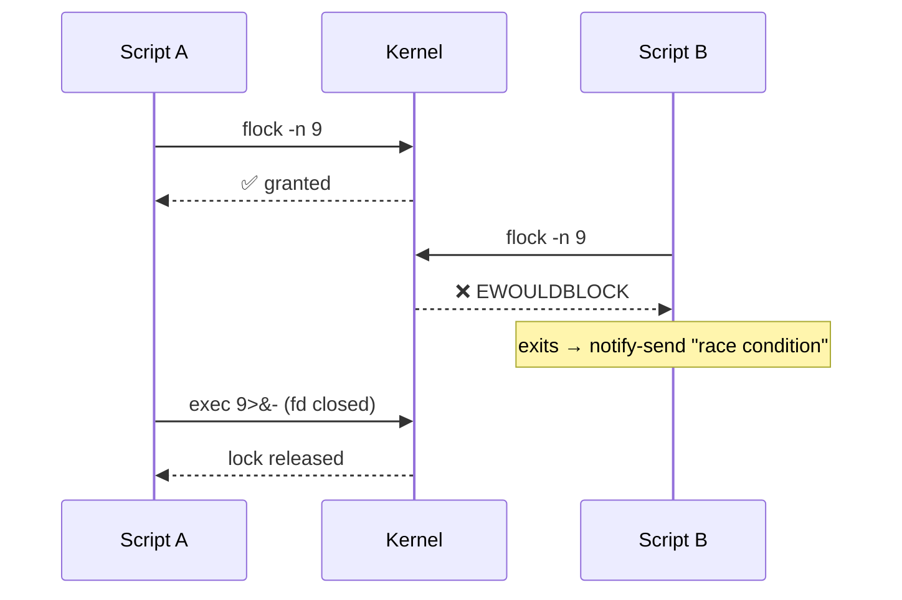

---

**The `9>&-` trick**

Child processes inherit all open fds. Without it, `waybar &` holds fd 9 open forever — the lock never releases:

```sh
exec 9>/tmp/restart-waybar.lock
if flock -n 9; then
    pkill waybar
    sleep 0.3
    waybar 9>&- &  # (1)!
else
    notify-send -i "error" "race condition - cannot restart waybar"
fi
```

1. `9>&-` closes fd 9 **inside waybar's process** before it starts — releases the lock without waiting for the script to exit.

---

**See it for real — `/proc/self/fd`**

The fd table isn't abstract — the kernel exposes it as a directory. After `exec 9>/tmp/test.lock`:

```sh
$ ls -la /proc/self/fd
0 -> /dev/pts/6       # stdin  (terminal)
1 -> /dev/pts/6       # stdout (terminal)
2 -> /dev/pts/6       # stderr (terminal)
3 -> /proc/471463/fd  # ls inspecting itself
9 -> /tmp/test.lock   # ← our lock fd, right there
```

fd 9 is a real symlink to the file. While that entry exists, the kernel lock is held.

---

**Test it live (two terminals)**

```sh
# terminal 1 — open fd 9 and lock it
exec 9>/tmp/test.lock; flock -n 9 && echo "🔒 locked"

# terminal 2 — try to acquire (should fail)
( exec 9>/tmp/test.lock; flock -n 9 && echo "locked" || echo "❌ already locked" )

# terminal 1 — release
exec 9>&-

# terminal 2 — try again (now succeeds)
( exec 9>/tmp/test.lock; flock -n 9 && echo "🔒 locked" || echo "already locked" )
```

!!! warning "Interactive shell gotcha"
    `exec 9>/tmp/foo` in your shell rewires **that shell's** fd table. Lock holds until `exec 9>&-` or shell exits. In a script file this is fine — the script process exits and closes all fds automatically. Don't paste the multi-line block interactively.

!!! tip "Outcome"
    Went with the simpler fix — `pkill` first, then `sleep 0.3`, then `waybar &`. `flock` is the right concept but fd inheritance from backgrounded processes adds more complexity than the problem warrants.

---

## ZSH history corruption after crash

**Date:** 2026-06-05
**Symptom:** After an unclean shutdown, every new terminal shows:
```
zsh: corrupt history file /home/joelyboy/.zsh_history
```

**Why it happens**

zsh keeps a file of every command you've typed (`~/.zsh_history`). If the machine dies mid-write, the partially-written chunk gets filled with **null bytes** (`\x00` — zeros, not readable text). zsh hits them on startup and complains.

Not a broken disk. Not data loss. Just zeros in the wrong place.

**Fix**

```bash
cp ~/.zsh_history ~/.zsh_history.bak
perl -i -pe 's/\x00//g' ~/.zsh_history
```

Line 1 backs up the file. Line 2 strips the null bytes out. Open a new terminal — warning gone.

> `perl` is used here instead of `sed` because `sed` doesn't handle raw binary/null bytes reliably.

---

## Crash investigation — June 4 2026, ~17:17–17:19 BST

**Reference: what Linux stores for crash/unclean shutdown forensics**

This is the canonical set of places to look, in order of usefulness:

| Source | Command | What you get |
|---|---|---|
| **systemd journal — previous boot** | `journalctl -b -1` | Everything systemd logged before the crash. `-b -1` = one boot back, `-b -2` = two back, etc. |
| **Kernel-only messages — previous boot** | `journalctl -b -1 -k` | Just kernel messages: OOM killer, segfaults, hardware errors (MCE), panics |
| **List all boots** | `journalctl --list-boots` | Shows every boot with timestamps — lets you identify which `-b N` number is the crash |
| **Priority filter** | `journalctl -b -1 -p err` | Only error-level and above — fast triage |
| **pstore / ramoops** | `ls /sys/fs/pstore/` | If configured: kernel preserves a panic dump in a reserved chunk of RAM across reboots. Survives even if disk write failed. Not configured on this machine. |
| **kdump** | `/var/crash/` | If configured: a second minimal kernel boots on panic and dumps memory to disk. Not configured here. |
| **dmesg (current boot only)** | `sudo dmesg` | Kernel ring buffer — only current boot, doesn't persist across reboots. Useful for hardware errors on the current session. |

> **Key insight:** `journalctl -b -1` is your first call every time. If the journal just stops mid-stream with no "Reached target Shutdown" line, that's a hard death — power cut, hardware hang, or kernel panic with no time to log.

**What was found for this specific crash**

**Two separate events happened:**

**Event 1 — 16:28:10 BST: Hyprland (the display compositor) crashed**

```
.Hyprland-wrapped: segfault at 200 error 4 (likely on CPU 13)
.xdg-desktop-portal: segfault in libwayland-client.so (x2)
```

**ELI5:** Hyprland is the thing that draws windows on screen and manages your Wayland desktop. It crashed with a segfault (a program accessed memory it shouldn't — the OS kills it immediately). When the compositor dies, all GUI apps lose their connection to the screen.

The system itself **did not die** here — just the desktop. Postgres kept logging until 17:17:39, which proves the OS was alive for nearly another hour.

**Event 2 — ~17:17:39–17:19:23 BST: Hard reset after frozen desktop**

Boot -1 last log entry: `17:17:39`. Boot 0 first entry: `17:19:23`. Gap: ~2 minutes.

The journal just stops cold — no "Reached target Shutdown", no kernel panic. This is a **hard reset** (power button held) after the desktop froze. The OS was still alive (SSH would have worked), but with no display/input there was no way to recover gracefully. The journal stopping cold is the hard reset, not a second crash event.

**What the postgres errors were (not the crash cause)**

The logs are full of:
```
ERROR: could not access file "$libdir/timescaledb-2.23.1": No such file or directory
```
This is a **separate, pre-existing issue** from the NixOS upgrade. The TimescaleDB extension version in the database catalogue no longer matches the installed library version. It causes postgres to reject connections from anything that loads TimescaleDB. It did not cause the crash.

**What `coredumpctl` revealed**

`coredumpctl` is the tool for this — it captures full process crash dumps automatically via systemd, no configuration needed. It was already running and caught everything.

```bash
coredumpctl list               # see all captured crashes
coredumpctl info <PID>         # full backtrace for a specific crash
```

The Hyprland core dump (PID 2624, 9.6MB) gave a full backtrace:

```
#0  CHyprGroupBarDecoration::textureFromTitle()   ← SEGFAULT: reads title of dead window
#1  CHyprGroupBarDecoration::draw()
#2  IHyprRenderer::renderWindow()
#3  IHyprRenderer::makeSnapshot()
#4  CWindow::unmapWindow()                        ← window being closed during cleanup
...
#15 wl_client_destroy()                           ← Wayland client (xdg-portal) disconnected
#17 CCompositor::cleanup()
#18 main()
```

A Wayland client disconnected (xdg-portal), Hyprland started cleaning up that window, tried to render its group bar title during teardown — but the window object was already partially destroyed. Classic use-after-free. This is a **Hyprland 0.55.2 bug** in its window cleanup path.

**Suspected root cause: CopyQ**

CopyQ (clipboard manager, PID 362605) crashed at 16:28:53 — 43 seconds after the main event — with this backtrace:

```
X11Platform::createServerApplication()  ← CopyQ trying to connect via X11/XWayland
Qt::fatal — platform couldn't init     ← XWayland is dead, abort
```

CopyQ is running in **X11 mode** (via XWayland), not native Wayland. It crashed 3 times total across boots, including once on the very next boot (17:19:38).

CopyQ sits at the Wayland↔X11 clipboard bridge — a known stress point for Nvidia/XWayland instability. The likely chain:

1. CopyQ's X11↔Wayland clipboard bridging destabilises xdg-desktop-portal
2. xdg-portal crashes (13:58 and 16:28 crashes both logged)
3. Hyprland cleans up the dead xdg-portal client, hits the use-after-free bug
4. Hyprland segfaults, desktop freezes
5. Hard reset at 17:17

**Suggestions / actions**

1. **ZSH history fix done** — stripped null bytes, warning gone.

2. **Hyprland env var mitigations applied** — added `WLR_NO_HARDWARE_CURSORS=1` and `HYPRLAND_NO_DIRECT_SCANOUT=1` to `hyprland.lua`. These reduce Nvidia 595.x Wayland crash triggers.

3. **CopyQ replaced with cliphist** — CopyQ (X11 mode, likely root cause) removed. Replaced with `cliphist` + `wl-clipboard` — fully native Wayland, no X11 bridge. Changes made:
   - `nixos-core-desktop.nix`: `copyq` → `cliphist` (wl-clipboard was already present)
   - `hyprland.lua` exec: `copyq --start-server` → `wl-paste --watch cliphist store`
   - `hyprland.lua` `SUPER+V` bind: `copyq show` → `cliphist list | fuzzel --dmenu | cliphist decode | wl-copy`
   - Removed `copyq-float` window rule

4. **Crash forensics ceiling** — ramoops not compiled into this kernel. Doesn't matter here — the crash was a userspace segfault, not a kernel panic. `coredumpctl` is the right tool and it already works.

5. **TimescaleDB mismatch** — separate issue, unrelated to crash. Update timescaledb in NixOS config to match the installed version, or run `ALTER EXTENSION timescaledb UPDATE;`.

---

**PAM — what it is and why GNOME keyring needs it**

**Context:** `security.pam.services.greetd.enableGnomeKeyring = true` in NixOS — what does this actually do and why is it needed?

**What PAM is**

PAM (Pluggable Authentication Modules) is the Linux authentication middleware layer. It sits between "a service wants to verify a user" and "the actual check happens".

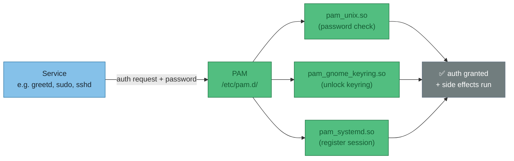

Each service has its own PAM stack — a list of modules in `/etc/pam.d/<service>`. When greetd logs you in, PAM runs the whole stack in order. Every module can `pass`, `fail`, or `skip`.

!!! note "Why not just one hardcoded check?"
    PAM was designed so auth behaviour can change without recompiling the service. A distro can swap password hashing, add MFA, or add session side-effects (like unlocking a keyring) purely by editing the module list — the service (greetd, sudo, sshd) never needs to know.

**Why GNOME keyring needs a PAM hook**

The GNOME keyring stores secrets (passwords, API keys, SSH passphrases) encrypted with your **login password**. Without a PAM hook, the keyring can't unlock itself at login — it doesn't know your password. The result: every app that needs a stored secret gets a popup asking for the keyring password, even though you already typed your login password 10 seconds ago.

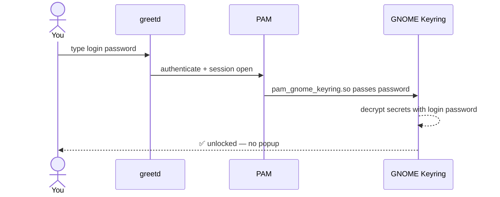

Without `pam_gnome_keyring.so` in greetd's stack, the keyring daemon starts but stays locked. Apps (Remmina, Chrome, SSH agent) hit it and prompt you manually.

**What the NixOS option does**

```nix
services.gnome.gnome-keyring.enable = true;           # installs + starts the daemon
security.pam.services.greetd.enableGnomeKeyring = true; # adds pam_gnome_keyring.so to greetd's PAM stack
```

`enableGnomeKeyring` appends two lines to `/etc/pam.d/greetd`:

```
auth     optional  pam_gnome_keyring.so
session  optional  pam_gnome_keyring.so auto_start
```

- `auth` line — passes the login password to the keyring daemon at auth time
- `session` line — tells the daemon to auto-start and finish unlocking when the session opens

`optional` means a keyring failure doesn't block login — if the daemon isn't running, PAM shrugs and moves on.

| Option | What it installs | What it doesn't do |
|--------|-----------------|-------------------|
| `services.gnome.gnome-keyring.enable` | The `gnome-keyring-daemon` binary + systemd user unit | Hook into any login service |
| `security.pam.services.greetd.enableGnomeKeyring` | The PAM hook for greetd | Do anything if the daemon isn't installed |

Both lines are needed. The daemon alone stays locked forever; the PAM hook alone has nothing to unlock.

---

## 2026-06-08 — Full system hang root cause: NVIDIA + suspend misconfiguration

!!! abstract "TL;DR"
    `hypridle` was suspending the machine after 10 min idle. Suspend failed silently because two NixOS settings directly contradict each other. The failed suspend left the NVIDIA driver in a bad state. ~2 hours later: full system hang — SSH dead, no TTY switching, hard reset required.

**The contradicting config**

```nix
# desktop-work/configuration.nix — these two fight each other:
boot.kernelParams = [ "nvidia.NVreg_PreserveVideoMemoryAllocations=1" ]  # ← requires procfs suspend interface
hardware.nvidia.powerManagement.enable = false                            # ← removes procfs suspend interface
```

`NVreg_PreserveVideoMemoryAllocations=1` tells the NVIDIA kernel module to preserve GPU VRAM across suspend/resume. To do that, it needs to hook into the kernel's suspend path via a procfs interface. That interface only exists when `powerManagement.enable = true`. With it disabled, the driver has nowhere to register its suspend handler.

**The causal chain (confirmed + inferred)**

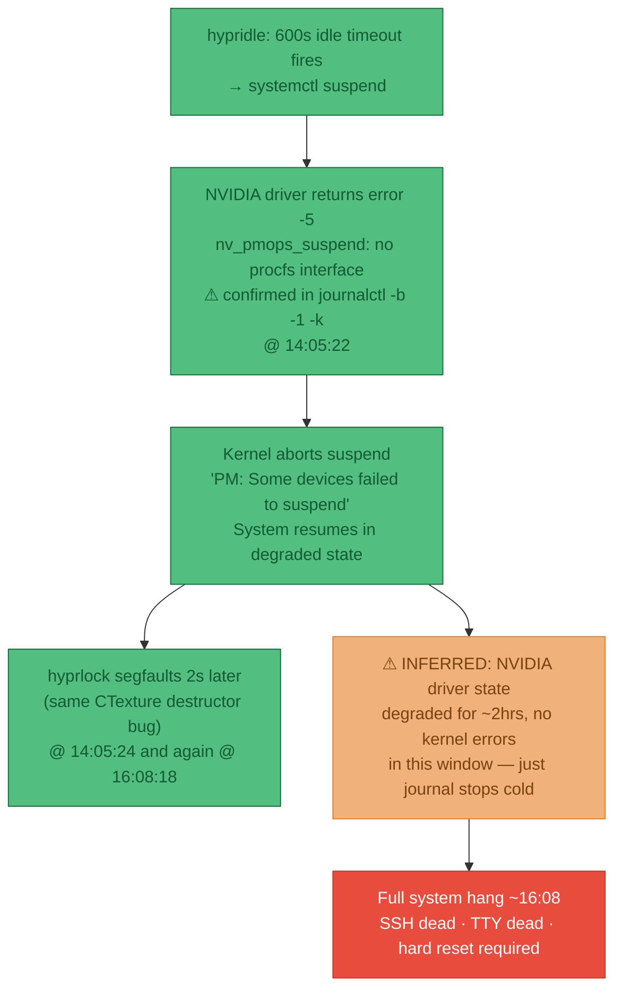

!!! note "What's confirmed vs inferred"
    **Confirmed** (exact kernel log lines): the suspend failure at 14:05:22, the NVIDIA error -5, the `PM: Some devices failed to suspend` message, both hyprlock segfaults.

    **Inferred** (no direct log evidence): that the corrupted NVIDIA driver state from the failed suspend caused the final hang 2hrs later. The journal stops cold at ~16:08 with no kernel panic, no OOM, no explicit NVIDIA error — which is consistent with a driver-level deadlock, but can't be proved from logs alone.

**ELI5 — `systemctl suspend` vs `hyprlock`**

These are completely different things that happen to both be triggered by `hypridle`:

| | `hyprlock` | `systemctl suspend` |
|---|---|---|
| **What it does** | Draws a lock screen overlay on top of the desktop | Puts the whole machine into a low-power sleep state |
| **Machine state** | Fully running — CPU running, network up, SSH works | Everything off except RAM — CPU stopped, network dead, SSH impossible |
| **How to wake** | Type your password | Press a key or power button |
| **NVIDIA involved?** | Yes, renders the lock screen via GPU | Yes, GPU must be saved/restored — this is where it broke |
| **Safe with broken power mgmt?** | ✅ Yes | ❌ No |

The lock screen and the suspend are independent actions. You can have one without the other. The crash was from `suspend`, not from `lock`.

**Fixes applied**

| Fix | File | Needs rebuild? |
|-----|------|---------------|
| Removed `NVreg_PreserveVideoMemoryAllocations=1` from kernel params | `hosts/desktop-work/configuration.nix` | ✅ Yes |
| Removed `systemctl suspend` from hypridle | `configs/hypr/hypridle.conf` | No — live |
| Added `hardware.nvidia.nvidiaPersistenced = true` | `hosts/desktop-work/configuration.nix` | ✅ Yes |
| `docker.service.after = ["multi-user.target"]` | `modules/nixos-base.nix` | ✅ Yes |
| `postgresql.target.after = ["multi-user.target"]` | `modules/nixos-extended-desktop.nix` | ✅ Yes |
| Magic SysRq enabled (`kernel.sysrq = 1`) | `modules/nixos-base.nix` | ✅ Yes |

!!! tip "Live workaround until rebuild"
    ```bash
    systemctl --user stop hypridle    # prevent any further suspend attempts
    sudo nvidia-smi -pm 1             # persistence mode for this session
    ```

**How the root cause was found**

The diagnostic process — in order:

1. **`journalctl -b -1 -k`** — scanned previous boot's kernel messages for `nvidia|drm|hang|oom|mce`. Found the explicit NVIDIA suspend failure at 14:05:22 with exact error text.

2. **Correlated the timeline** — boot started 10:54, failure at 14:05 = 3hr 11min into the session. `hypridle.conf` had `timeout = 600` (10 min) → `systemctl suspend`. A machine sitting idle for 10 min at some point in a 3-hour session is entirely plausible.

3. **Cross-referenced the NixOS config** — NVIDIA's own error message (`PreserveVideoMemoryAllocations module parameter is set. System Power Management attempted without driver procfs suspend interface`) directly names the conflict. Found the matching contradicting lines in `configuration.nix`.

4. **Explained the 2-hour gap** — the hard part. Between 14:05 and ~16:08 the kernel logged nothing alarming. The system appeared to function. The link between the failed suspend and the final hang is an inference based on: (a) failed suspend is a known cause of NVIDIA driver state corruption, (b) no other cause visible in the logs, (c) the journal stopping cold (not a clean shutdown, not a kernel panic with a message) is consistent with a driver-level deadlock rather than a software crash.

---

**NixOS user service: dead symlink pattern**

**Symptom:** service has journal history but `systemctl --user cat <name>` says `No files found`, and the journal says `Failed to open /home/joelyboy/.config/systemd/user/<name>.service`.

**What it means:** a dead symlink in `~/.config/systemd/user/` is shadowing the live NixOS-managed copy in `/etc/systemd/user/`. Systemd finds the user-local symlink first, follows it to a dead nix store path, fails.

**Diagnostic chain:**

```bash
# 1. untruncate the journal to see the full path
journalctl --user -u <name> --no-pager -l | head -5

# 2. check what's in the user systemd dir
ls -la ~/.config/systemd/user/

# 3. follow the symlink — does the target exist?
ls $(readlink ~/.config/systemd/user/<name>.service)   # "No such file" = dead

# 4. confirm NixOS has the live copy
ls /etc/systemd/user/ | grep <name>
```

**Fix:**

```bash
rm ~/.config/systemd/user/<name>.service
rm ~/.config/systemd/user/*.wants/<name>.service 2>/dev/null
systemctl --user daemon-reload
systemctl --user start <name>
```

!!! note "NixOS rule of thumb"
    `~/.config/systemd/user/` should be empty unless you deliberately put something there. NixOS-managed user services live in `/etc/systemd/user/`. If a service is defined via `systemd.user.services` in your NixOS config, never run `systemctl --user enable` on it — that creates user-local symlinks that go stale after rebuilds.

---

## 2026-06-09 — Second overnight hang + hyprlock → swaylock

!!! abstract "TL;DR"
    The machine hung again overnight (Jun 8 ~21:xx → Jun 9 08:27). Same root cause as the Jun 8 hang — `NVreg_PreserveVideoMemoryAllocations=1` + `systemctl suspend`. Both fixes from the previous session had been applied to config files, but **neither was actually running**: the NixOS rebuild wasn't done, and the hypridle config edit raced the process start and lost.

    Separately: hyprlock crashes with SIGSEGV on every exit. Not dangerous (crash is after unlock, on cleanup), but replaced with swaylock as a stopgap.

---

**Issue 1 — NVreg still in kernel (NixOS rebuild not run)**

**Found in:** `journalctl -b -1 -k` kernel cmdline at boot

**Evidence:**
```
kernel: Command line: ...init=/nix/store/qx73nqij...-nixos-system-desktop-work-26.05.20260603.6b31628/init
        nvidia.NVreg_PreserveVideoMemoryAllocations=1 root=fstab...
```
vs current (boot 0):
```
kernel: Command line: ...init=/nix/store/hwdn9q4v...-nixos-system-desktop-work-26.05.20260603.6b31628/init
        root=fstab...
```
Same nixpkgs version label, different store hashes → same nixpkgs commit, different config. The NVreg removal was written to `configuration.nix` but `nixos-rebuild switch` was never run in the previous session.

**Inference:** NVreg active + `powerManagement.enable=false` = suspend fails with error -5, driver corrupts, hang follows.

**Fix:** `sudo nixos-rebuild switch` — confirmed resolved in current boot (NVreg absent from cmdline).

**Why it didn't protect boot -1:** The user rebooted at 16:11 and GRUB booted the previous generation. The new generation only took effect when the rebuild was explicitly run and the system rebooted into it.

---

**Issue 2 — hypridle 600s suspend still loaded (config edit raced process start)**

**Found in:** `journalctl -b -1 | grep hypridle`

**Evidence:**
```
Jun 08 16:20:55 hypridle[2410]: [LOG] Registered timeout rule for 600s:
Jun 08 16:20:55 hypridle[2410]:       on-timeout: systemctl suspend
```
And from `stat configs/hypr/hypridle.conf`:
```
Modify: 2026-06-08 16:24:35
```

**Inference:** hypridle started at 16:20:55 and read the old config from disk. The config edit was saved at 16:24:35 — **4 minutes late**. hypridle reads config once at startup and has no hot-reload. The suspend rule was live in memory for the entire session.

**Fix:** Suspend listener removed from `configs/hypr/hypridle.conf`. Confirmed: current boot registers only the 300s → `swaylock` rule.

**Why it didn't protect boot -1:** The file write lost the race. The edit was made during the previous session but only saved after hypridle had already started in the new boot. Rule: after editing `hypridle.conf`, always `pkill hypridle` to force a config reload.

---

**Issue 3 — Inhibit lock delayed but didn't prevent**

**Found in:** `journalctl -b -1 | grep hypridle`

**Evidence:**
```
Jun 08 19:25:48 hypridle[2410]: [LOG] Idled: rule 5c5a9d7b4e98
Jun 08 19:25:48 hypridle[2410]: [LOG] Ignoring from onIdled(), inhibit locks: 1
```
Last journal entry overall:
```
Jun 08 20:21:37 mullvad-daemon: WARN netlink_packet_route...  [then: silence]
```

**Inference:** At 19:25 the 600s timer fired but was blocked by a Wayland idle-inhibit lock from an open application. Once that app closed (unknown time after 20:21), the timer restarted. After 600s → `systemctl suspend` → NVIDIA error -5 → full hang. Journal writes stopped, SSH died, no further entries until the next boot at 08:27.

**No direct fix for this** — the inhibit lock was correct app behaviour. The actual fix is removing suspend from hypridle entirely, which makes the inhibit lock irrelevant.

!!! warning "Lesson: config file edits don't restart running processes"
    Two separate timing failures caused this crash. Whenever a dotfile change needs to take effect immediately:

    | Process | How to reload |
    |---------|--------------|
    | hypridle | `pkill hypridle` (systemd will restart it) |
    | waybar | `pkill waybar && waybar &` |
    | NixOS config | `sudo nixos-rebuild switch` then verify GRUB booted the new generation via `cat /proc/cmdline` |

---

**hyprlock SIGSEGV — crash on exit, not during lock**

**Found in:** `coredumpctl list` + `coredumpctl info <PID>`

**Evidence (7 crashes, identical backtrace every time):**
```
#1  CTexture::~CTexture()
#2  CAtomicSharedPointer<CTexture>::_delete()
#3  ~unordered_map<uint64, SPreloadedTexture>    ← preloaded texture cache teardown
#5  CUniquePointer<CAsyncResourceManager>::~CUniquePointer()
#8  CHyprlock::run()    ← returns normally first
#9  main
```

**Inference:** Use-after-free in `CAsyncResourceManager` destructor. The texture cache is destroyed after the OpenGL/Wayland context is already gone, so GL objects it tries to free no longer exist → SEGV. Crash is in cleanup code that runs **after** `run()` returns — meaning the lock screen works correctly (lock, authenticate, unlock) and only crashes silently on process exit.

**This is NOT causing system hangs.** Crashes present since at least Jun 8 09:57 across sessions that ran for hours without issue. A userspace process segfaulting in GL cleanup cannot corrupt the NVIDIA kernel driver. Impact: ~1.8MB coredump generated per lock cycle.

**Status:** No fix in hyprlock 0.9.5 (current latest). No newer version to upgrade to.

---

**Lock screen: hyprlock → swaylock (temporary)**

**Changes applied:**

| File | Change |
|------|--------|
| `modules/nixos-core-desktop.nix` | Removed `programs.hyprlock.enable`, added `pkgs.swaylock` + `security.pam.services.swaylock = {}` |
| `configs/swaylock/config` | Created — TokyoNight colours, wallpaper background, ring indicator |
| `configs/swaylock/wallpaper.jpeg` | Lock screen background (1680×1050) |
| `configs/hypr/hypridle.conf` | `hyprlock` → `swaylock -f` |
| `configs/hypr/hyprland.lua:221` | `CTRL+ALT+L` bind updated |
| `install.conf.yaml` | Added swaylock symlinks, removed copyq entry |

!!! note "PAM is required for swaylock"
    `security.pam.services.swaylock = {}` is not optional. Without it swaylock starts but the password ring spins forever — PAM has no entry for swaylock so authentication always fails silently.

!!! tip "Return to hyprlock when patched"
    hyprlock has a better display (blurred background, clock, animated indicator) and is the actively developed tool for this stack. The CTexture destructor bug is the only blocker. When a fix lands in nixpkgs, swap back:

    - `nixos-core-desktop.nix`: replace `pkgs.swaylock` + PAM entry with `programs.hyprlock.enable = true`
    - `configs/hypr/hypridle.conf`: `swaylock -f` → `hyprlock`
    - `configs/hypr/hyprland.lua:221`: `swaylock -f` → `hyprlock`

---

## 2026-06-10 — sudo hangs in tmux: terminal line discipline, pts, lsof

!!! abstract "TL;DR"
    `sudo` was failing silently in certain tmux panes with `pam_unix: conversation failed` — PAM couldn't read the password at all. Root cause: the terminal's `icrnl` setting was off, so pressing Enter sent `\r` instead of `\n` and PAM's readline never saw end-of-input. A previous process had modified the terminal settings and not restored them. Fix: `stty sane` to reset, and `tty -s && stty sane` in `.zshrc` to prevent recurrence.

---

**Background concepts**

??? info "Key terms"
    | Term | Plain English |
    |---|---|
    | **PTY** | Pseudo-Terminal — a fake terminal the kernel creates when you open a terminal app. Every terminal window, tmux pane, and SSH session gets its own PTY. |
    | **pts** | Pseudo-Terminal Slave — the "user-facing" end of a PTY. Lives at `/dev/pts/N`. Your shell reads and writes here. |
    | **TTY line discipline** | The kernel layer that sits between raw keystrokes and what your shell reads — converts characters, handles Ctrl+C, echoes typed chars, etc. `stty` controls it. |
    | **`icrnl`** | Input: Convert CR (carriage return, `\r`) to NL (newline, `\n`). When on, pressing Enter works normally. When off, Enter sends `\r` which most programs don't recognise as end-of-line. |
    | **PAM** | Pluggable Authentication Modules — Linux auth middleware. sudo uses it to verify your password. Covered in detail earlier in this log. |
    | **PAM conversation** | The interface PAM uses to ask you questions (like "password:") and read your response. Reads from the TTY — breaks if TTY settings are wrong. |
    | **lsof** | "List Open Files" — shows which processes have which files open. On Linux, everything is a file: terminals, sockets, pipes, devices. |

---

**What is a pts?**

Every time you open a terminal — Kitty, a tmux pane, an SSH session — the kernel allocates a **PTY (Pseudo-Terminal)** pair:

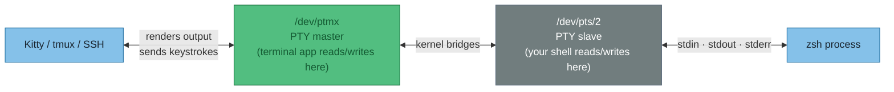

The slave end (`/dev/pts/2`) is what your shell sees as "the terminal". Run `tty` in any shell and it prints the pts path for that pane.

```bash
# each pane has its own pts
$ tty           # pane 1
/dev/pts/2
$ tty           # pane 2
/dev/pts/5
```

When you open a new tmux pane, a new pts is allocated. When you close it, that pts number gets recycled.

---

**What is lsof?**

`lsof` (list open files) answers the question: **which processes currently have this file open?**

On Linux, "file" means almost anything — regular files, sockets, pipes, and terminal devices like `/dev/pts/2`.

```bash
$ lsof /dev/pts/2
COMMAND  PID     USER FD  TYPE DEVICE SIZE/OFF NODE NAME
zsh     5711 joelyboy  0u  CHR  136,2      0t0    5 /dev/pts/2   ← stdin
zsh     5711 joelyboy  1u  CHR  136,2      0t0    5 /dev/pts/2   ← stdout
zsh     5711 joelyboy  2u  CHR  136,2      0t0    5 /dev/pts/2   ← stderr
```

| Column | Meaning |
|--------|---------|
| `COMMAND` | Process name |
| `PID` | Process ID |
| `FD` | File descriptor number + mode (`u` = read+write, `r` = read, `w` = write) |
| `TYPE CHR` | Character device — a terminal |
| `NAME` | The actual file path |

**FDs 0, 1, 2** are always stdin, stdout, stderr. A shell has all three pointing at its pts — it reads your keystrokes from fd 0 and writes output to fds 1 and 2.

---

**What is the TTY line discipline?**

Every pts device has a **line discipline** — a kernel layer that sits between raw keystrokes and what your shell actually reads. It handles things like:

- Echoing typed characters back to the screen
- Turning `^C` into `SIGINT`
- **Converting characters** (e.g. Enter → newline)

`stty` (set tty) is the tool to read and change these settings. `stty -a` prints all of them. There are ~40 settings — here are the ones that actually matter:

| Setting | What it does | If wrong |
|---------|-------------|----------|
| **`icrnl`** | Input: convert `\r` (Enter key) → `\n` (newline) | Programs waiting for newline never see it — **the actual bug here** |
| `icanon` | Buffer input line-by-line before sending to app | If off (raw mode): every keypress is sent immediately, no backspace |
| `echo` | Show typed characters on screen | If off: typing is invisible (normal for passwords, bad otherwise) |
| `isig` | `^C` sends SIGINT, `^Z` sends SIGTSTP | If off: Ctrl+C does nothing |
| `ixon` / `start` / `stop` | XON/XOFF flow control (`^S` pauses, `^Q` resumes) | If `start`/`stop` are `<undef>`: flow control keys don't work |

!!! tip "Why Enter sends `\r` not `\n`"
    On old hardware, "carriage return" (move cursor to column 1) and "line feed" (move cursor down) were separate physical actions. Enter keys send `\r` by convention. The TTY line discipline (`icrnl`) silently converts it to `\n` so programs only need to handle one character. Turn that conversion off and every program that reads lines breaks.

---

**What broke: `icrnl` was off**

Running `stty -a` in working vs broken pane revealed this:

```
# working pane
icrnl       ← Enter (\r) is converted to newline (\n) ✅
echoe echok ← backspace and kill echo correctly

# broken pane
-icrnl      ← Enter (\r) is NOT converted ❌
start = <undef>; stop = <undef>  ← XON/XOFF keys cleared
-echoe -echok
```

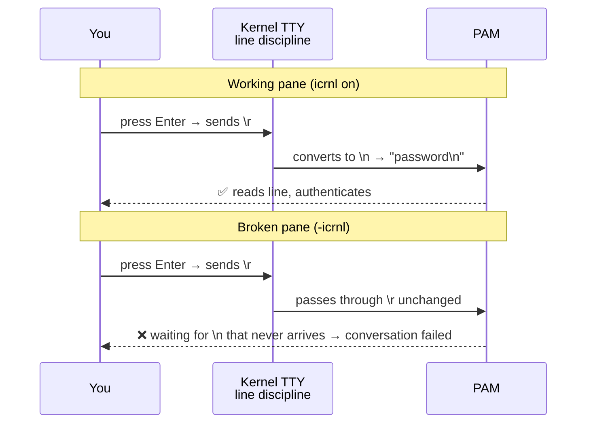

PAM's conversation function reads until it sees `\n`. With `-icrnl`, pressing Enter sends `\r` which PAM doesn't recognise as end-of-line. It waits indefinitely — `conversation failed`.

---

**The diagnostic chain**

**Step 1 — isolate: pane-specific or system-wide?**
```bash
# open a fresh pane → sudo works fine
# same broken pane → sudo hangs
# → pane-specific. Not a system or PAM config issue.
```

**Step 2 — diff environments (red herring):**
```bash
env | sort > /tmp/env-broken.txt
env | sort > /tmp/env-working.txt
diff /tmp/env-broken.txt /tmp/env-working.txt
# → only GPG_TTY and TMUX_PANE differed
# → unset GPG_TTY && sudo ... → still broken
# → env vars are NOT the cause
```

**Step 3 — compare terminal settings:**
```bash
stty -a    # run in both panes, compare output
# → broken pane has -icrnl (and start/stop = <undef>)
# → working pane has icrnl
```

**Step 4 — fix and confirm:**
```bash
stty sane && sudo echo test    # works immediately
```

---

**The fix**

**Immediate** — run in the broken pane:
```bash
stty sane
```

`stty sane` resets all terminal settings to sensible defaults. The `sane` preset is built into the kernel and covers `icrnl`, `echo`, `icanon`, `isig`, XON/XOFF, and everything else.

**Persistent** — add to `~/.config/zsh/.zshrc`:
```bash
tty -s && stty sane 2>/dev/null
```

`tty -s` checks if the shell is attached to a terminal (silently exits if not — e.g. in scripts). The `stty sane` then runs for every interactive shell, resetting whatever state the previous process left behind.

!!! warning "Root cause: a process didn't restore terminal settings"
    Programs that use raw terminal input (text editors, pagers, interactive prompts, SSH clients) temporarily change TTY settings while running and are supposed to restore them on exit. If one crashes, is killed with a signal, or has a bug, the settings stay broken for the life of that pane. `stty sane` is the manual recovery.

---

## 2026-06-10 — crash capture: netconsole + pstore

!!! abstract "TL;DR"
    desktop-work has been hanging silently — journal stops cold, no SSH, no panic. Two tools now configured: **netconsole** streams kernel log to degen-bot over UDP in real time (catches silent hangs), **pstore** writes to EFI memory on kernel panic (survives reboot, read at `/sys/fs/pstore/`).

**Why journalctl isn't enough**

Disk writes require the kernel to be running. Hard hang = kernel stops = buffered log entries never reach disk. Journal stops mid-stream.

| Tool | Catches | Mechanism |
|------|---------|-----------|
| **netconsole** | Hard hangs, GPU lockups | Streams `printk` over UDP — bypasses disk entirely |
| **pstore** | Kernel panics only | Writes to EFI memory, survives reboot |
| `journalctl -b -1` | Clean crashes, OOM kills | Only if kernel flushed to disk before dying |

**Receiver command — run on degen-bot before leaving desktop-work unattended**

```bash
# foreground
nc -ulp 6666 | tee ~/desktop-crash.log

# or background in tmux
tmux new-session -d -s crash-watch 'nc -ulp 6666 | tee ~/desktop-crash.log'
```

**What to look for**

| Pattern | Meaning |
|---------|---------|
| Messages stop abruptly mid-line | Hard lockup |
| `NVRM: GPU-00000800` errors | NVIDIA driver fault |
| `watchdog: BUG: soft lockup` | CPU stuck in kernel loop >20s |
| `MCE:` / `NMI: IOCK error` | Hardware error (RAM, CPU, PCIe) |
| `BUG:` / `kernel BUG at` | Kernel caught its own bug |

---

**2026-06-14 — pi-box: why it feels sluggish (it's the SD card)**

!!! abstract "TL;DR"
    pi-box (Raspberry Pi 4, 8GB RAM) felt sluggish over SSH and painfully slow to `nixos-rebuild`. Measured everything. **The SD card does ~750 small random writes per second — vs ~80,000+ for an SSD.** That ~100× gap on write-heavy work (rebuilds, databases) is the bottleneck. CPU, RAM, power, and temperature are all healthy. The fix is a USB 3.0 SSD; nothing else will meaningfully help.

!!! warning "Correction (after re-measuring with `fio`)"
    My first pass used a `dd` loop and reported **37 IOPS** — that was **wrong by ~20×**. Each of the 512 loop iterations spawned a separate `dd` process, so most of the measured time was process fork/exec overhead, not the card. Re-running with `fio` (the proper tool) gave the true figures: **~750 random-write IOPS, ~5,000 random-read IOPS**. The verdict is unchanged (the SD card is the bottleneck, an SSD is the fix) — but the *magnitude* below originally read "37"; treat the real number as ~750 write / ~5,000 read. See Deep-dive 1 for why `dd` lied.

??? info "Key terms (plain English)"
    | Term | Plain English |
    |---|---|
    | **SD card** | The little memory card the Pi boots and runs from. Cheap flash storage — but slow at lots-of-tiny-files work. |
    | **SSD** | Solid State Drive — proper flash storage. Hundreds of times faster at the tiny-files work that actually matters. |
    | **IOPS** | Input/Output Operations Per Second — how many *separate* read/write jobs the disk can do each second. The number that predicts "does it feel snappy". Explained in full below. |
    | **Throughput** | How many megabytes-per-second the disk moves in one big continuous transfer. The headline spec on the box. Often misleading. |
    | **`fsync`** | "Write this to the disk *right now* and don't lie to me that it's done." Databases and package managers do this constantly for safety; it's the slowest kind of write. |
    | **`nixos-rebuild`** | The command that applies a NixOS config change. It writes thousands of small files into `/nix/store` — a worst case for a slow card. |
    | **schedutil** | The Linux "CPU speed manager" that ramps clock speed up under load and down when idle. Was suspected, turned out fine. |
    | **PSU** | Power Supply Unit — the Pi's mains adapter. A weak one makes the Pi throttle itself; checked, it's fine here. |
    | **`vmstat` / `dd` / `dmesg`** | Standard Linux tools: live system stats / raw disk speed test / kernel message log. Used below. |

**The diagnosis at a glance**

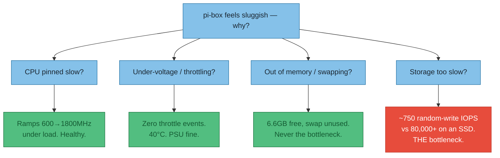

!!! danger "The number that matters: ~750 write IOPS"
    `fio` measured **~750 random-write IOPS** (and ~5,000 read). A cheap USB SSD does **80,000+**. So on the small-scattered-writes work that dominates a rebuild or a database, the card is ~100× slower than an SSD. Every slow thing on this Pi (rebuilds, databases, git, background sync) is bottlenecked here. *(My initial `dd` loop wrongly reported 37 — see the correction box above.)*

**What is IOPS? (ELI5)**

!!! tip "The librarian analogy"
    Picture your storage as a **librarian fetching books**:

    - **Throughput (MB/s)** = how fast they walk once they've got a big armful of books. Good for *one huge book* (a video file).
    - **IOPS** = how many *separate trips to different shelves* they can make each second. Good for *a thousand sticky-notes scattered all over the library*.

    Your SD card librarian has okay-ish walking speed but is slow at starting a new trip — about **750 trips per second** where an SSD librarian manages **tens of thousands**. Hand them one big book: fine. Ask for 10,000 scattered notes: the SD librarian is ~100× slower at it.

**Why this wrecks a Pi specifically:** the work an operating system actually does is *thousands of scattered tiny files*, not one big transfer:

| Everyday task | What it really is | Hurt by low IOPS? |
|---|---|---|
| `nixos-rebuild` | Writing thousands of small files into `/nix/store` | 🔴 Severely |
| Database write (e.g. logging a meal) | Tiny `fsync`'d writes to a log file | 🔴 Yes |
| `git status` / shell startup | Hundreds of small file reads | 🟠 Noticeably |
| Copying one big video file | One long continuous transfer | 🟢 No — that's throughput |

!!! note "IOPS vs read/write-time (throughput) monitoring — the key difference"
    They measure **different things**, and watching the wrong one hides the problem:

    | | Throughput (MB/s) | IOPS |
    |---|---|---|
    | **Measures** | Volume moved per second | Number of operations per second |
    | **Best case for it** | One big sequential file | Many small scattered files |
    | **This card scored** | 16 write / 41 read MB/s (*mediocre*) | **~750 write / ~5,000 read (*slow — ~100× behind an SSD*)** |
    | **What it predicts** | "copy a big file" speed | "does the system feel snappy" |

    If we'd only watched read/write **throughput** (the usual `MB/s` number), the card would have looked merely *meh* — 16–41 MB/s isn't alarming. The **IOPS** test is what exposed the gap. Throughput is about *how much*; IOPS is about *how many*; **latency** (how long one operation takes) is the third sibling — `fio` measured ~1.3 milliseconds per forced write (≈750/sec), where an SSD is well under 0.1ms.

**How I measured it — commands, results, and what's proven vs inferred**

!!! success "Concrete — directly measured numbers"
    | What I ran | Plain English | Result |
    |---|---|---|
    | `fio --rw=randwrite --bs=4k --direct=1 --iodepth=1` | Proper random-write IOPS test | **752 IOPS**, 1.3ms avg — the real bottleneck |
    | `fio --rw=randwrite --iodepth=32` | Same, but parallel | 668 IOPS — *no* gain (SD has shallow queues) |
    | `fio --rw=randread --iodepth=32` | Random read IOPS | ~5,000 IOPS (reads fare better) |
    | `dd ... bs=4k oflag=dsync` ×512 | Crude IOPS attempt — **discredited** | 37 "IOPS" — wrong, see correction box |
    | `dd ... bs=1M conv=fsync` | Write one big 256MB file (throughput) | 15.8 MB/s (slow) |
    | `dd` read after dropping cache | Read a big file fresh from the card | 41 MB/s (mediocre) |
    | busy-loop on all cores + read `scaling_cur_freq` | Force the CPU to work, check its speed | 600→**1800MHz**, all 4 cores — healthy |
    | `sudo dmesg \| grep -i under-voltage` | Search kernel log for power warnings | **None** — PSU is fine |
    | `free -h`, `vmstat` | Check memory and swap use | 6.6GB free, **0 swap used** |
    | `sshd -T \| grep usedns` | Is slow SSH login caused by DNS lookups? | `usedns no` — not the cause |
    | `systemctl is-active ...` | Which background services are running | syncthing, docker, tailscaled all active |

!!! warning "Inferred — reasoned from the numbers, not directly observed"
    - **The SD card is the root cause of slow rebuilds/DB/git.** I measured ~750 write IOPS with `fio`; I did *not* time a full rebuild. But a rebuild = tens of thousands of small writes, and at ~750/sec that's tens of seconds of pure write-wait the card forces. (High-confidence inference.)
    - **syncthing intermittently makes it feel worse.** It's running and periodically rescans/hashes files (= lots of small reads). On a ~750-write/~5,000-read-IOPS card a rescan competes for that budget and can stall other work. I didn't catch it red-handed mid-stall. (Plausible aggravator.)
    - **The card is low-grade or weak.** 15.8 MB/s write is poor for a card whose manufacture date (read from the card) is January 2026 — only months old, so this isn't simple wear-out. (Inference from the spec vs the date.)
    - **A USB 3.0 SSD will fix it.** A SATA SSD does ~80,000 write IOPS vs the measured ~750 — ~100×. Not yet tested on this Pi. (High-confidence, unverified locally.)

**Deep-dive 1 — `dd`, and how it measures IOPS**

??? note "What `dd` is and how the IOPS test actually works (click to expand)"
    **What `dd` is (ELI5):** `dd` is a dead-simple "copy raw bytes from A to B" tool. You tell it the **block size** (how big each chunk is) and **how many chunks**. By choosing those numbers — and one magic flag — you can turn it into a crude disk-speed tester. It's *fine for throughput* (big sequential transfers) but **misleading for IOPS** — as this entry found out the hard way (see the lesson box below).

    The two tests do opposite things:

    === "Throughput test (big chunks)"
        ```bash
        dd if=/dev/zero of=testfile bs=1M count=256 conv=fsync
        #    │            │          │        │        └─ at the end, force everything to the card and time that too
        #    │            │          │        └─ 256 chunks  → 256 MB total
        #    │            │          └─ block size = 1 Megabyte (one BIG chunk)
        #    │            └─ output file (on the SD card)
        #    └─ input = /dev/zero, an endless stream of zero bytes (free, instant to read)
        ```
        Big 1MB chunks = the librarian carrying one huge armful. This measures **throughput (MB/s)**. Result here: 15.8 MB/s.

    === "IOPS test (tiny chunks, forced)"
        ```bash
        for i in $(seq 1 512); do
          dd if=/dev/zero of=f$i bs=4k count=1 oflag=dsync
          #                       │        │     └─ dsync = wait for THIS write to physically land before returning
          #                       │        └─ exactly one chunk
          #                       └─ 4 kilobytes — a realistic "small file" size
        done
        ```
        512 separate tiny 4KB writes, each one **forced to fully complete before the next starts**. That's the librarian making 512 separate trips. Time the whole loop, then `512 ÷ seconds = IOPS`. Result: 13.8s → 37 "IOPS".

    !!! danger "…and why that 37 was WRONG (the lesson)"
        Re-running the *same card* with `fio` gave **752 IOPS** — 20× higher. The flaw: the loop launches **512 separate `dd` processes**, and starting a process (fork/exec) takes longer than the 4KB write itself on this hardware. So I was mostly timing the *shell*, not the *card*. This is the textbook reason you don't measure IOPS with a `dd` loop — use `fio`, which issues all the I/O from one process and reports the true figure.

    !!! tip "Why `oflag=dsync` is the whole trick"
        Without it, the card (and the OS) **lie**: they say "done!" the instant the data is in a fast buffer, then write it to flash lazily in the background. That measures the buffer, not the card. `dsync` forces each write to truly hit the flash before counting it — which is exactly what a database's `fsync` does for safety. So this test mimics real database/`nixos-rebuild` behaviour, not a best-case benchmark.

    !!! warning "`dd` is a rough tool, not a lab instrument"
        It's single-threaded and approximate. The *proper* tool is `fio` (Flexible I/O tester), which does parallel queues, mixed read/write, and proper random-access patterns — `fio --name=randwrite --rw=randwrite --bs=4k --iodepth=32 ...`. `fio` wasn't installed at first so I reached for `dd` — which then lied by 20×. The fix was one command: `nix shell nixpkgs#fio -c fio ...` (no install needed, runs straight from the Nix cache). **Lesson: for IOPS, go straight to `fio`.**

**Deep-dive 2 — how to check for under-voltage / throttling**

??? note "Spotting a starved or throttled Pi — every method (click to expand)"
    **The ELI5:** a Raspberry Pi is fussy about power. If the supply dips (cheap charger, thin cable, power-hungry USB device), the Pi *deliberately slows its own CPU down* to avoid crashing — "throttling". It also throttles when too hot (>80°C). A throttled Pi feels sluggish for a completely different reason than a slow disk, so you check it early to rule it out. Here it was **clean** — but here's the full toolkit.

    | Method | Command | What you're looking for |
    |---|---|---|
    | **`vcgencmd`** (the proper way) | `vcgencmd get_throttled` | A hex code. `0x0` = perfect. Any bit set = a problem (see decoder below). Also `vcgencmd measure_volts` and `measure_temp`. |
    | **Kernel log (live)** | `dmesg \| grep -i voltage` | Lines like `Under-voltage detected! (0x00050005)` — the kernel shouting in real time. |
    | **Kernel log (history)** | `journalctl -k -b \| grep -i voltage` | Same warnings but across the **whole boot**, including ones that scrolled past. `-k` = kernel only, `-b` = this boot. |
    | **The CPU-ramp test** | busy-loop all cores, read `scaling_cur_freq` | If it **can't** reach 1800MHz under load, something is capping it (throttle or a locked governor). Here it *did* reach 1800 → not throttled. This is the indirect tell when `vcgencmd` isn't available. |
    | **Live throttle watch** | `watch -n1 vcgencmd get_throttled` | Catch throttling that only happens under load (plug in the SSD, hammer the CPU, watch the flags change). |

    !!! tip "Decoding `get_throttled` — the bits that matter"
        The hex value is a bitfield. Read it like flags:

        | Bit | Meaning | |
        |---|---|---|
        | `0` (`0x1`) | Under-voltage **happening right now** | 🔴 |
        | `1` (`0x2`) | CPU frequency capped right now | 🟠 |
        | `2` (`0x4`) | Currently throttled | 🔴 |
        | `16` (`0x10000`) | Under-voltage **has occurred** since boot | 🟠 |
        | `18` (`0x40000`) | Throttling has occurred since boot | 🟠 |

        So `0x50005` = under-voltage now + capped now + both have happened before = **a failing power supply**. `0x0` = all clear, which is what pi-box showed.

    !!! danger "NixOS gotcha — `vcgencmd` may be missing"
        `vcgencmd` ships in the `libraspberrypi` package, which **isn't installed by default on NixOS** (it's a Raspberry Pi OS tool). That's why the diagnostic fell back to the **CPU-ramp test + `dmesg`/`journalctl`** instead. To get the proper tool: add `libraspberrypi` to `environment.systemPackages`. Until then, "does it ramp to 1800MHz under load?" is the reliable proxy.

**Verdict & next step**

!!! tip "What to actually do"
    1. **Buy a USB 3.0 SSD** and move root onto it (Pi 4 boots from USB). ~750 write IOPS → tens of thousands (~100×). This is the only change that meaningfully fixes the sluggishness.
    2. **Already done:** switched swap from a 32GB file *on the SD card* to compressed-RAM swap (`zramSwap`) — stops swap ever touching the slow card. (Commit on the `calories-app`/pi-box config.)
    3. **Optional until the SSD arrives:** disable `syncthing` on pi-box to cut the background disk churn.

!!! danger "Don't waste money on these"
    A faster *power supply*, *heatsink/fan*, or *more RAM* — all measured healthy. They are not the problem. A USB **flash/thumb drive** is also not the answer: those often have *worse* random IOPS than the SD card. Only a real SSD (SATA-over-USB or USB-C portable) fixes it.

---

**2026-06-14 — pi-box storage: what to actually buy**

!!! success "Decided & ordered (2026-06-14)"
    Keep the Pi, add an SSD — see [ADR-004](../appendix/adr/004-pi-box-storage-vs-replace.md). **Ordered: Fikwot FX815 256GB 2.5" SATA SSD (£34.99) + UGREEN 2.5" UASP USB-3 caddy (£9.99) = £44.98.** SSD power draw is fine on the Pi 4's USB. The reference/jargon below is kept for next time. (A spinning HDD is *not* a substitute — see chart; and reusing the internal WD Blue was rejected as it'd mean opening the desktop.)

**Jargon decoder — M.2 / SATA / NGFF / NVMe (this confused me, so:)**

!!! tip "An SSD has TWO independent properties — shape and language"
    People (me included) mix these up because **"M.2" sounds like a type of drive — it isn't, it's only a shape.** Keep the two axes separate:

    1. **Shape (form factor)** — what it physically looks like / how it mounts.
    2. **Language (interface)** — the protocol it talks: **SATA** (older, slower) or **NVMe** (newer, much faster, runs over PCIe).

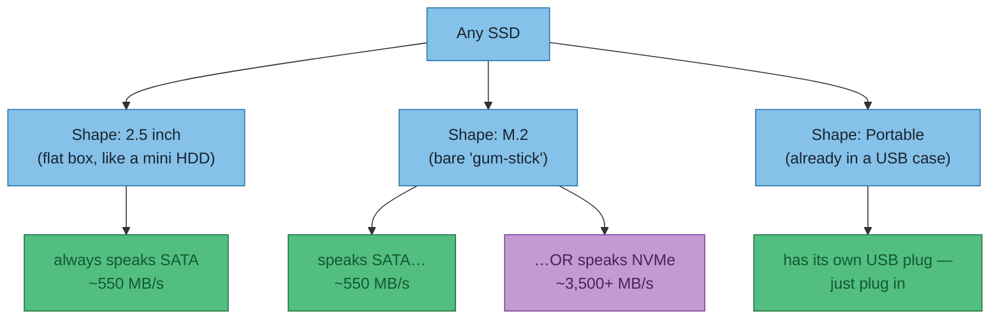

| Term | Plain English |
|---|---|
| **2.5"** | The flat-box shape (same as a laptop hard drive). Always SATA. Goes in a 2.5" caddy or on a USB-SATA cable. |
| **M.2** | The bare "stick of gum" shape. **Says nothing about speed** — an M.2 stick can be SATA *or* NVMe. |
| **NGFF** | Old name for M.2 ("Next Generation Form Factor"). On shopping sites, "NGFF" almost always means **M.2 SATA** specifically. |
| **SATA** | The older, slower *language* (~550 MB/s). Plenty for a Pi. |
| **NVMe / PCIe** | The newer, much faster *language* (~3,500+ MB/s). Pointless on a Pi-over-USB (see below). |
| **B-key / M-key / B+M** | The notch pattern on an M.2 stick. **M.2 SATA = B+M (two notches); M.2 NVMe = M (one notch).** It's how the connector physically stops a mismatch. |

!!! danger "Why my WD Blue needs a *specific* enclosure"
    My **WD Blue WDS500G2B0B** is **M.2 shape + SATA language (B+M key)**. So it needs an **"M.2 SATA / NGFF"** enclosure. An **NVMe-only enclosure will not talk to it** — same slot shape, wrong language. A **combo (SATA + NVMe)** enclosure works with either and is the safe buy.

!!! note "On a Pi, SATA vs NVMe doesn't matter — the USB port is the limit"
    The Pi 4's USB 3.0 caps at ~5 Gbps ≈ ~450 MB/s usable. A SATA SSD (~550 MB/s) already saturates that. NVMe's 3,500 MB/s would be throttled right down to the same ceiling. **So don't pay extra for NVMe here — SATA is the sweet spot.**

**Reading your own drives — what `TRAN` and `ROTA` mean**

Run `lsblk -o NAME,MODEL,TRAN,ROTA,SIZE`. Two columns tell you everything:

!!! tip "`TRAN` = *how* it's plugged in · `ROTA` = *what kind* of drive"
    - **`TRAN`** (transport) — the road the data travels:
        - `sata` = **internal**, on a SATA cable inside the machine
        - `nvme` = **internal**, in an NVMe/PCIe slot on the motherboard
        - `usb` = **external**, plugged in over USB (i.e. already in an enclosure or a portable case)
    - **`ROTA`** (rotational) — is it mechanical?
        - `1` = **spinning hard drive (HDD)** — slow at random I/O
        - `0` = **SSD** (flash, no moving parts) — fast

My actual machine, decoded:

| Device | `TRAN` | `ROTA` | Translation |
|---|---|---|---|
| `sda` WD Blue WDS500G2B0B | `sata` | `0` | **Internal SSD.** The good drive — but *inside* the desktop, not on USB. To use on the Pi: pull it out + an M.2-SATA enclosure. |
| `sdb` Seagate "Portable" | `usb` | `1` | **External, but a spinning HDD.** This is the £0 drive I already own — but `ROTA 1` means it's the wrong tool (worse than the SD card). |
| `nvme0n1` Sabrent Rocket Q | `nvme` | `0` | Internal NVMe — the desktop's main drive. |

!!! warning "The mix-up this cleared up"
    The USB drive I've had for ages **is the Seagate Portable, and it's a spinning HDD** (`usb` + `ROTA 1`) — not the SSD I assumed. The WD Blue SSD is the `sata` one, sitting **inside** the desktop. So "free drive I already have on USB" ≠ a usable SSD for the Pi. The honest options stay: buy a cheap SATA SSD + cable (~£57), or extract the internal WD Blue + an M.2-SATA enclosure (~£16).

**Why the Seagate "Portable" (HDD) is the wrong tool**

A different axis entirely: **HDD (spinning) vs SSD (flash).** The Seagate has moving parts — a head that physically swings to each spot on a platter — so every small random operation waits ~5–10 ms.

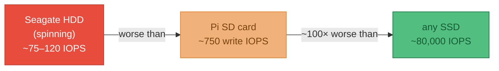

| Drive | Random write IOPS | For the Pi |
|---|---|---|
| Seagate portable HDD | ~75–120 | ❌ *worse* than the SD card — going backwards |
| Current SD card | ~750 | 🟠 the thing we're replacing |
| Any SATA/USB SSD | ~80,000 | ✅ the fix |

Keep the Seagate for backups/media (its strengths: cheap-per-GB, fine for big sequential files). It is **not** a Pi boot-drive candidate.

**What to buy — split into "the drive" and "the connector"**

!!! warning "Prices are swinging daily (NAND shortage) — track, don't fixate"
    The SKUs below are *examples*; the price you see today may differ a lot. **Buy whichever reputable-brand 240–500GB 2.5" SATA SSD is cheapest right now.** Use a price-history tracker:

    - **CamelCamelCamel** (Amazon UK price history): [camelcamelcamel.com](https://uk.camelcamelcamel.com/) — paste any Amazon link to see if today's price is actually good.
    - Live searches: [Amazon — 2.5" SATA SSD 500GB](https://www.amazon.co.uk/s?k=2.5+inch+sata+ssd+500gb) · [The Pi Hut storage](https://thepihut.com/search?q=ssd)

=== "The drive (pick the cheapest reputable one)"
    240GB is ample for the OS + apps; 500GB for headroom. Good budget→better brands:

    | Model | Tier | Example link |
    |---|---|---|
    | Crucial BX500 | budget | [BX500](https://www.amazon.co.uk/MICRON-CONSUMER-PRODUCTS-GROUP-CRUCIAL/dp/B07GSXGN46) |
    | WD Green | budget | [The Pi Hut](https://thepihut.com/search?q=ssd) |
    | Kingston A400 | budget *(only if not gouged — was £92!)* | [A400](https://www.amazon.co.uk/Kingston-A400-Solid-State-Drive/dp/B01N0TQPQB) |
    | Crucial MX500 / Samsung 870 EVO | better (more endurance) | [MX500 search](https://www.amazon.co.uk/s?k=crucial+mx500+500gb) |

=== "The connector (drive → USB)"
    | For this drive | Buy | ~£ | Example |
    |---|---|---|---|
    | 2.5" SATA SSD | UASP USB3 **cable** (cheapest) | £6 | [The Pi Hut "SSD-to-USB 3.0 Cable for Pi"](https://thepihut.com/search?q=ssd+usb) |
    | 2.5" SATA SSD | UASP 2.5" **caddy** (tidier) | ~£15 | [UGREEN caddy](https://www.amazon.co.uk/UGREEN-Enclosure-External-Thunderbolt-Compatible/dp/B0851B6TCC) |
    | WD Blue (M.2 **SATA**) | M.2 **SATA/NGFF** enclosure | ~£16 | [FIDECO NGFF](https://www.amazon.co.uk/FIDECO-External-Enclosure-Adapter-Transfer-M-2-SATA-NGFF/dp/B07TTG66GW) |
    | any M.2 (future-proof) | **combo** SATA+NVMe enclosure | ~£20–27 | [combo RTL9210B](https://www.amazon.co.uk/Enclosure-Adapter-RTL9210B-10Gbps-Support/dp/B09217RVN3) |

    **Whatever you pick, it must say UASP** — without it you lose most of the IOPS gain.

=== "Zero-assembly (if you can't be bothered)"
    A pre-built portable USB-C SSD — plug straight in, no caddy. Pricier per GB.

    | Model | ~£ (volatile) | Link |
    |---|---|---|
    | Crucial X9 1TB | ~£140 (spiked) | [X9 1TB](https://www.amazon.co.uk/Crucial-1TB-Portable-SSD-CT1000X9SSD902/dp/B0CGW1FQV4) |

!!! note "Prices/links captured 2026-06-14 via live browser (Brave). They move — treat as examples and check a tracker before buying. Full buy-vs-replace reasoning in [ADR-004](../appendix/adr/004-pi-box-storage-vs-replace.md)."


## 2026-06-18 Building the Pi on the SSD

!!! abstract "TL;DR — the whole journey, 4 steps"
    1. **Build** my flake's `pi-box` config *as an image* → a `.img.zst` file.
    2. The image knows how to build itself **and** where its disk is, because `pi-box` imports nixpkgs' `sd-image` module.
    3. That module drops a `sdImage` product onto the build "shelf" (next to the everyday `toplevel`).
    4. **Flash** the image onto the SSD with `dd`, move it to the Pi, boot.

    **Colour key for the diagrams below:** 🟦 my code · ⬜ upstream nixpkgs · 🟩 build products · 🟪 the disk/boot definition (the bit that replaces `hardware-configuration.nix`).

alrighty - from claudes commands this is what i actually ran. its quite a lot to get head round. from decompressing from `zst`, copying it the the drive at `/dev/sda` with `dd`. the `sync` just to ensure written

**1. Build the image — and why my command differs from the nixpkgs doc**

firstly to build the image... (because i forgot to write this part down the first time 🤦‍♂️)
```bash
nix build .#nixosConfigurations.pi-box.config.system.build.sdImage
```

Ok so this is a bit confusing... the above command ^ (if i actually read [the code](https://github.com/NixOS/nixpkgs/blob/master/nixos/modules/installer/sd-card/sd-image-aarch64.nix)) says at the top:

```
# nix-build nixos -I nixos-config=nixos/modules/installer/sd-card/sd-image-aarch64.nix -A config.system.build.sdImage
```
compared to what i run, we use MY configuration from the flake => `pi-box` (not `sd-image-aarch64.nix`). BUT we both use the `config.system.build.sdImage` (which is provided by the sd image nix file.)

Both commands aim at the **same target** (`config.system.build.sdImage`) — they only differ in *which config* they feed it. The doc feeds the bare module (a generic demo image); I feed my real machine (so the image comes out with my users, SSH and Tailscale baked in):


**2. How my flake even reaches that `sd-image` code**

The link is a single `imports = [ … ]` line in my host config. My flake → my pi-box config → it imports the Pi wrapper → which imports the real engine:

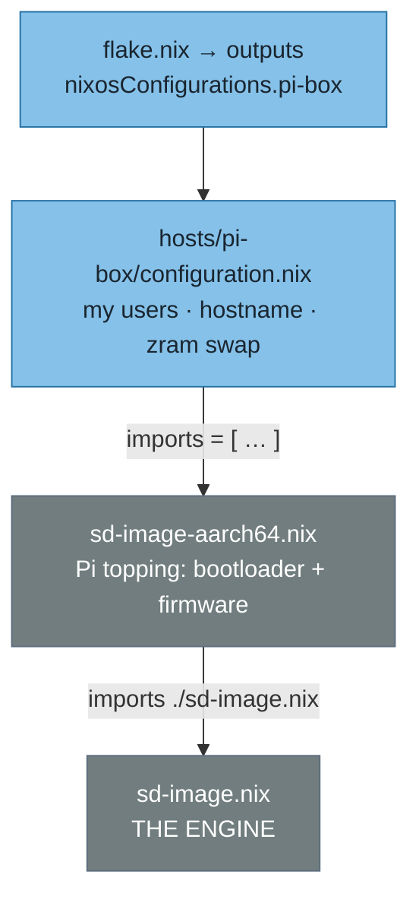

**3. What `sd-image.nix` actually provides (the build "shelf")**

ok this is getting beyond me... from claude the below to inspect?
```
➜ claude@streaming-server dev-setup (main) ✗   nix eval .#nixosConfigurations.pi-box.config.system.build --apply builtins.attrNames 

warning: Git tree '/home/claude/dev-setup' is dirty
[ "bootStage1" "bootStage2" "earlyMountScript" "etc" "etcActivationCommands" "etcBasedir" "etcMetadataImage" "extraUtils" "fileSystems" "image" "images" "inhibitSwitch" "initialRamdisk" "initialRamdiskSecretAppender" "installBootLoader" "kernel" "manual" "modulesClosure" "nixos-generate-config" "nixos-install" "nixos-rebuild" "noFacter" "sdImage" "separateActivationScript" "setEnvironment" "toplevel" "uki" "units" "vm" "vmWithBootLoader" ]
➜ claude@streaming-server dev-setup (main) ✗
```

`config.system.build` is a **shelf of buildable products**. The everyday one is `toplevel` (the running OS, what `nixos-rebuild switch` activates); the `sd-image` module adds a second one, `sdImage` — the one I built. The *same* module also sets the filesystems + bootloader, which is the part doing the `hardware-configuration.nix` job:

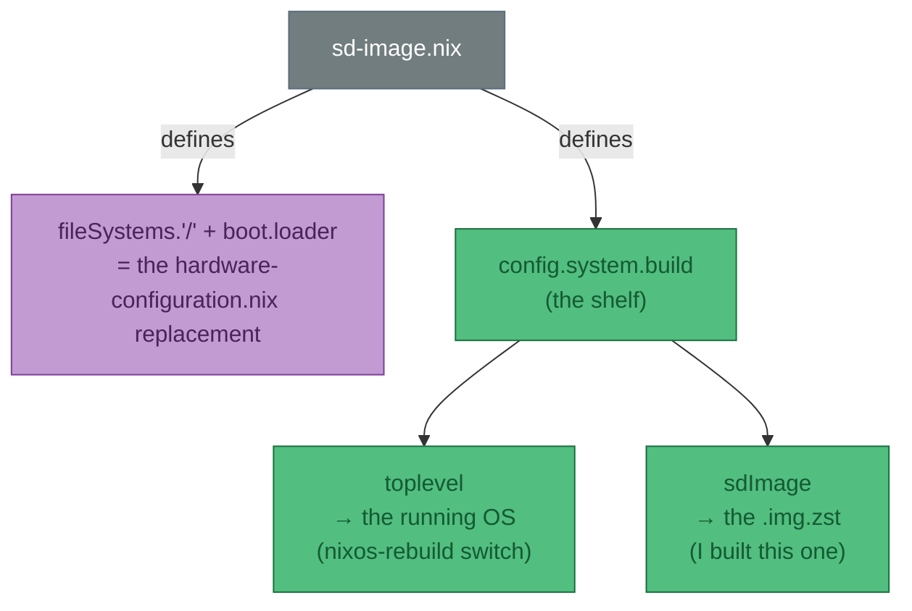

BUT, it is also a sort of equivalent to `import hardware-configuration.nix` - it sets up other stuff too - see [the sd image nix file](https://github.com/NixOS/nixpkgs/blob/master/nixos/modules/installer/sd-card/sd-image.nix), can see it sets up partitions and mounts for the SSD!

!!! tip "Why I can't just delete the sd-image import later"
    The `fileSystems.'/'` line (🟪 above) is *where the OS lives*. Every `nixos-rebuild switch` needs it. The image-building parts (`sdImage`) are inert on a running box — only realised when I explicitly `nix build …sdImage`. So: keep the import, it costs nothing at runtime.

**4. Flash it to the SSD**

The build leaves a *recipe's output* — a compressed image file under `result/`. Decompress it, then `dd` writes it raw onto the whole disk; first boot on the Pi grows the root to fill all 238 GB:


this the image `zst` file in the `result/` directory for it to be flashed to the SSD (which is currently plugged in)

```bash
➜ claude@streaming-server dev-setup (main) ✗   ls -la result/sd-image/

Found existing alias for "ls --color=tty". You should use: "ls"
total 4994808
dr-xr-xr-x 2 root root       4096 Jan  1  1970 .
dr-xr-xr-x 4 root root       4096 Jan  1  1970 ..
-r--r--r-- 1 root root 5114670228 Jan  1  1970 nixos-image-sd-card-26.05.20260603.6b31628-aarch64-linux.img.zst
➜ claude@streaming-server dev-setup (main) ✗   zstd --decompress \
       result/sd-image/nixos-image-sd-card-26.05.20260603.6b31628-aarch64-linux.img.zst \
       --output-dir-flat . \
       -o pi-box.img

result/sd-image/nixos-image-sd-card-26.05.20260603.6b31628-aarch64-linux.img.zst: 18855362560 bytes
➜ claude@streaming-server dev-setup (main) ✗   sudo dd \
    if=pi-box.img \
    of=/dev/sda \
    bs=4M \
    status=progress \
    conv=fsync


[sudo] password for claude:
18513657856 bytes (19 GB, 17 GiB) copied, 43 s, 430 MB/s18855362560 bytes (19 GB, 18 GiB) copied, 43.8051 s, 430 MB/s

4495+1 records in
4495+1 records out
18855362560 bytes (19 GB, 18 GiB) copied, 47.7848 s, 395 MB/s
➜ claude@streaming-server dev-setup (main) ✗ sync
➜ claude@streaming-server dev-setup (main) ✗
```


---

**2026-06-14 — Live mic transcription: whisper-ctranslate2 + the real fix was mic gain**

!!! success "What worked"
    `whisper-ctranslate2 --live_transcribe` (already in nixpkgs) for "talk → watch text appear" feedback. 100% local. The accuracy problem turned out to be a **quiet mic**, not the tool — fixed by boosting the PipeWire source gain, not by fiddling the volume gate.

**The goal** was modest: talk into the mic and *see text come out* so I know it's working, rather than dictating blind. Not necessarily low-latency-live. This is separate from the hold-to-talk dictation flow ([above](#local-voice-dictation-on-linux)) — that injects into the active window; this just prints to the terminal for reassurance.

**`whisper-live` (collabora/WhisperLive) — still not packaged**

Confirmed via `nix search nixpkgs whisper`: **there is no `whisper-live` package and no maintained flake.** The upstream repo is a `pip`/Docker WebSocket server with no `flake.nix`, so it'd be a hand-rolled `buildPythonApplication`. Not worth it. What *is* in nixpkgs:

| Package | What it is | Live mode? |
|---|---|---|
| `whisper-cpp` / `-vulkan` | C++ port, has `--stream` | ⚠️ jittery |
| `whisper-ctranslate2` | CLI on faster-whisper, **`--live_transcribe`** | ✅ chosen |
| `python3Packages.faster-whisper` | CTranslate2 backend (library) | — |
| `python3Packages.whisperx` | word-timestamps + diarization | batch only |
| `wyoming-faster-whisper` | Wyoming server (Home Assistant) | server |

**"Wait — is this actually local?"**

Yes. The only network use is the **one-time model download** from HuggingFace Hub (`base.en` ≈ 145 MB → `~/.cache/huggingface/`). The `Warning: ... unauthenticated requests to the HF Hub ...` line is *just* about anonymous download rate limits — not cloud inference. After the weights are cached, transcription is CPU-only and offline.

!!! tip "Pre-fetch the model so the first live run isn't blocked"
    Ctrl+C'ing during that first download leaves an incomplete cache (saw 2.6 MB of 145 MB) and no text appears. Warm it up non-interactively by transcribing a silent file:
    ```sh
    sox -n -r 16000 -c 1 /tmp/silence.wav trim 0.0 1.0
    whisper-ctranslate2 --model base.en --language en --output_dir /tmp /tmp/silence.wav
    ```
    Then prove it's offline with `HF_HUB_OFFLINE=1` (kills the warning too) or `--local_files_only True`.

**The real problem: under-gained mic, not the volume threshold**

Transcription was missing loads of words. Instinct was to lower `--live_volume_threshold` (tried `0.05`) — **wrong lever.** The gate only decides *when to start transcribing*; it can't make quiet audio louder. Lower it too far and it trips on noise and transcribes garbage. Same root cause already documented for the hold-to-talk flow:

> SoloCast records quiet (peak −21 dBFS). Normalize is not optional — Whisper accuracy drops on under-gained audio. ([WAV file analysis](#wav-file-analysis))

`whisper-ctranslate2 --live` has **no normalization stage** (unlike the DIY pipeline's `+10.8× sox` step), so it feeds the raw quiet signal straight to the model. `wpctl` showed the SoloCast default source sitting at **70%** (below unity). Fix = boost gain at the PipeWire source so the gate *and* the model both see a leveled signal:

```sh
wpctl set-volume @DEFAULT_AUDIO_SOURCE@ 2.5    # 250% — over-unity software gain
# retest with the gate back UP (louder signal → higher gate rejects noise better):
HF_HUB_OFFLINE=1 whisper-ctranslate2 --live_transcribe True --model base.en \
  --language en --live_volume_threshold 0.2
```

That was **significantly better**. Tuning: still missing words → push to `4.0` (−21 dBFS may need 4–6×); garbled/robotic → that's clipping, back off; want more accuracy regardless → `--model small.en`.

!!! warning "Two caveats — parked here, not committed"
    - **`wpctl` gain is not persistent** across reboots. If keeping this, the real home is WirePlumber config (declarative), not a manual command.
    - **Tried via `nix profile add` (imperative)** — not tracked in this repo, won't pin to the flake's nixpkgs. Either promote to `nixos-extended-desktop.nix` + `nix profile remove`, or `nix profile remove` to clean up.
    - The live tool will always be rougher than the normalized hold-to-talk pipeline. Worth it only for the "watch it work" feedback, not as a dictation replacement.

## 2026-06-21 — SparkyFitness declarative deploy on pi-box

Tracking the unattended push to get SparkyFitness running on pi-box, fully declarative, with agenix secrets, and an end-to-end test (localhost + Tailscale HTTPS).

**Start: agenix secrets + rebuild + e2e**

**Context**: `hosts/pi-box/sparkyfitness.nix` already drives the upstream compose via a systemd service (clone-if-missing + `docker compose up` foreground) plus a foreground `tailscale serve` unit. Outstanding: the `.env` was a manual file. Goal = make secrets declarative via agenix (already used elsewhere in this flake), rebuild, and verify e2e.

**Plan**:
1. agenix: register `secrets/sparkyfitness-secrets.age` (the 4 real secrets only), wire the agenix module into pi-box, decrypt at runtime, pass to compose via `--env-file`.
2. Non-secret config (DB name/user, data paths, FRONTEND_URL) → declarative Nix `environment`.
3. `nix eval` → `nixos-rebuild switch --flake .#pi-box`.
4. Verify: `docker ps` (3 up), `curl localhost:3004`, then `tailscale serve` + HTTPS e2e.

**Env facts**: docker active (29.5.2); pi-box on tailnet as `pi-box.rove-lydian.ts.net`; no serve config yet; sudo works with the default password; ntfy token not present on this host (skip push notifications, log instead).

**Deployed + e2e GREEN**

**Action**: Wired agenix secrets, rebuilt pi-box twice, drove the stack up.

**Bug fixed**: first rebuild → `sparkyfitness.service` failed `ExecStartPre` with `200/CHDIR`. systemd applies `WorkingDirectory` before `ExecStartPre`, and `.../repo/docker` doesn't exist until the clone runs. Fix: `WorkingDirectory` = the always-present StateDirectory (`/var/lib/sparkyfitness`); reference the compose file by absolute path (`-f ${composeDir}/...`) with a stable `-p sparkyfitness` project name.

**Result (e2e green)**:
- agenix secret decrypts to `/run/agenix/sparkyfitness-secrets` (root-only); compose reads it via `--env-file`.
- 3 containers healthy: db, server (migrations applied, Better Auth mounted, listening :3010, `/api/health` 200), frontend.
- `http://localhost:3004` → 200, `<title>SparkyFitness</title>`.
- `https://pi-box.rove-lydian.ts.net` → 200, valid TLS cert (curl ssl_verify=0), `/api/health` 200.
- `tailscale serve status` shows "No serve config" — expected: the serve is foreground (held by the systemd unit), not persisted to disk. Stopping the unit removes it. Matches the intent.

**Not yet tested**: reboot survival (units are enabled + `wantedBy multi-user.target`, but I did not reboot the box unattended). First account still needs registering via the UI.

**Review pass + re-verify**

Ran a focused code review (proportionate to a 91-line, e2e-verified Nix diff). 3 findings, all fixed in commit "address review findings": stale Podman comment, clone-wedge on interrupted first clone (added `rm -rf` guard), and DRY for the data paths. Rebuilt (3rd switch) → stack restarted, re-verified: localhost:3004 / https root / https /api/health all 200, valid TLS, login page (with passkey button) renders. DONE — on branch `sparkyfitness-pi-box-deploy`, not merged.

## 2026-06-22 — Declarative AI (Gemini) + MCP sidecar correction

**Goal**: set up SparkyAI declaratively. Two findings while proving the mechanism:

1. **Global AI config is seedable with NO user/admin/session.** `ai_service_settings` allows `user_id=NULL` for `is_public=TRUE` rows (CHECK constraint enforces it), inserted via a system client that bypasses RLS, and `getActiveAiServiceSetting` falls back to the global row (Priority 2). Proved end-to-end: decrypted the existing `llm-gemini-key.age`, ran the app's own `upsertGlobalAiServiceSetting` via `docker exec ... tsx` inside the server container → global Gemini (gemini-2.5-flash) inserted, encrypted with the app's cipher. The frontend's `GET /api/chat/ai-service-settings` resolver returns it for the test user. Idempotent (upsert by service_type).

2. **MCP sidecar must come back (correction).** Chat on the published `codewithcj/*:latest` images FAILS with `Connection closed` — the image's `chatService` uses MCP **stdio** transport (spawns `/app/SparkyFitnessMCP/dist/index.cjs`, absent in the server image) UNLESS `SPARKY_FITNESS_MCP_URL` is set, and this image has no in-process `/mcp` route. `main`'s compose marks MCP deprecated/in-process, but the RELEASE hasn't caught up. So: re-add the `sparkyfitness-mcp` sidecar + point the server at it over HTTP — matches the proven streaming-server config. Doing this via a NixOS-managed `docker-compose.override.yml`.

**AI e2e GREEN**

Rebuilt with the MCP sidecar override + AI-seed unit. Results:
- Override rendered to /etc/sparkyfitness/docker-compose.override.yml; server got `SPARKY_FITNESS_MCP_URL=http://sparkyfitness-mcp:3001`; mcp container serving HTTP on 3001 (its docker healthcheck reports "unhealthy" but it's functionally up — cosmetic).
- `sparkyfitness-ai-seed.service` → "updated global gemini" (idempotent: found the existing global google row and updated it). 4 containers running.
- Chat e2e: `POST /api/chat/stream` → Gemini streamed "PONG" (finishReason stop, 200).
- Agentic e2e: "what did I log today?" → Gemini called MCP tool `sparky_manage_food` (tool-input → tool-output) and answered correctly (empty — the test sandwich was the 21st).

So SparkyAI (Gemini + MCP tools + DB) is fully working and fully declarative: agenix key → app-native encryption → global is_public AI row → chat falls back to it for every user. Cosmetic TODO: mcp healthcheck shows unhealthy; functionally fine.

## Bash Globbing

Quick note by me (yes a human!) not AI for once.... on bash globbing as I keep forgetting.

Bash builtins use a feature called **bash globbing** — a trimmed-down wildcard syntax. Just `*` (anything) and `?` (one character). Used in `ls *.png` etc. What I didn't know: it works in `for in` too:

```bash
for a in *.HEIC; do
    echo $a
done
```

Other common commands that use it: `echo`, `mv`, `cp` ...

## Substrings in bash

right this is confusing. in bash `.*` is NOT "any non whitespar char" for "0 or many occurances". this is globbing where `.` is NOT a wildcard. thus. using the `%` we scan leftwards and take the first match (in this case searching for a literal `.`)


```bash
➜ joelyboy@desktop-work dev-setup (main) ✗ joels_test_var=vacation.backup.HEIC
➜ joelyboy@desktop-work dev-setup (main) ✗ echo "${joels_test_var%.*}"
vacation.backup
➜ joelyboy@desktop-work dev-setup (main) ✗ echo "${joels_test_var%a*}"
vacation.b
```

notice how it took the FIRST `a` in backup (scanning left)?


with %% it goes left until last match.
```bash
➜ joelyboy@desktop-work dev-setup (main) ✗ echo "${joels_test_var%%a*}"
v
```


and now the hash. we scan to the right (from the beginning)
```bash
➜ joelyboy@desktop-work dev-setup (main) ✗ echo "${joels_test_var##*a}"
ckup.HEIC
➜ joelyboy@desktop-work dev-setup (main) ✗ echo "${joels_test_var#*a}"
cation.backup.HEIC
```

> following is stolen from [here](https://web.archive.org/web/20230408142504/https://wiki.bash-hackers.org/syntax/pe#substring_removal)

**From the beginning** — `${PARAMETER#PATTERN}` and `${PARAMETER##PATTERN}`

Remove the pattern matching from the **beginning** of the string. `#` removes the **shortest** match, `##` removes the **longest**.

| Syntax | Result |
|---|---|
| `${MYSTRING#*in}` | ~~Be liberal in~~ what you accept, and conservative in what you send |
| `${MYSTRING##*in}` | ~~Be liberal in what you accept, and conservative in~~ what you send |

**From the end** — `${PARAMETER%PATTERN}` and `${PARAMETER%%PATTERN}`

Same idea, but Bash matches from the **end** of the string. `%` removes the **shortest** match, `%%` removes the **longest**.

| Syntax | Result |
|---|---|
| `${MYSTRING%in*}` | Be liberal in what you accept, and conservative ~~in what you send~~ |
| `${MYSTRING%%in*}` | Be liberal ~~in what you accept, and conservative in what you send~~ |


## wl pasting
gosh - trying to past multiple images bit of a pain.

if i copy 3 images from dolphin and inspect from `wl-paste`:
```bash
➜ joelyboy@desktop-work wallpapers (main) ✗ wl-paste --list-types
text/uri-list
application/x-kde4-urilist
application/vnd.portal.filetransfer
application/x-kde-source-id
➜ joelyboy@desktop-work wallpapers (main) ✗ wl-paste
file:///home/joelyboy/Downloads/Photos-3-001%20(1)/IMG_1460.png
file:///home/joelyboy/Downloads/Photos-3-001%20(1)/IMG_1458.png
file:///home/joelyboy/Downloads/Photos-3-001%20(1)/IMG_1457.png
```

so... its a `text/uri-list` and then just the files joined by `\n`. seems simple right? idk why claude was making such a big deal of it before? doing horrible mashing


as a test ill use my `lP` (print full path) to grab 2. 
```bash
lP | tail -n 2
/home/joelyboy/dev-setup/wallpapers/red-forest.png
/home/joelyboy/dev-setup/wallpapers/cave-dream.jpeg
```

then adding `file://` to create the `file:///`:
ok well interestingly apparently its a feature of `xargs` that the input is treated as separating line by line and is NOT a feature of bash by default (input  **might** be 1 output? but xargs will split it)
```bash
lP | tail -n 2 | sed 's|^|file://|' | xargs -I {} echo hello there pls {}
hello there pls file:///home/joelyboy/dev-setup/wallpapers/red-forest.png
hello there pls file:///home/joelyboy/dev-setup/wallpapers/cave-dream.jpeg
```


so this works apparently? can update yazi i guess to copy multiple images to `wl-copy` rather than just a single one?
```bash
lP | grep png | sed 's|^|file://|' | wl-copy --type text/uri-list
```

---

**Dictation, take 2 — replacing the swhkd glue with `hyprwhspr-rs`** (2026-06-20)

Earlier this month I hand-wired dictation: `whisper.cpp` + `wtype` + `swhkd` glued together (see *Local voice dictation on Linux* above). It worked, but it was three moving parts I had to keep in sync. [`hyprwhspr-rs`](https://github.com/goodroot/hyprwhspr) collapses all of that into **one daemon**: it owns the hotkey, recording, Whisper transcription, *and* the keystroke injection. Same engine underneath (`whisper.cpp` + `wtype`), one process to supervise.

!!! success "What's running now"
    `hyprwhspr-rs` daemon (systemd `--user`) → `whisper-cli` (base.en, GPU) → Wayland virtual keyboard / `wtype`. Push-to-talk on **SUPER+ALT+R**. Scaffolded declaratively in `modules/nixos-dictation.nix` (jollof-home).

**Three gotchas that ate the afternoon — all worth remembering:**

| Symptom | Cause | Fix |
|---|---|---|
| Transcription was total word salad ("Uh, whoops, it's actually a lot of English") | Mic gain left at **250%** (`wpctl set-volume @DEFAULT_AUDIO_SOURCE@ 2.5`) → the HyperX SoloCast **clips**, and Whisper can't read clipped audio | `wpctl set-volume @DEFAULT_AUDIO_SOURCE@ 1.0`. Never over-unity on a condenser mic. |
| Daemon died: `No whisper binaries found` | `hyprwhspr-rs install --service` generates a unit whose `ExecStart` is the **inner** `.hyprwhspr-rs-wrapped` — bypassing the Nix wrapper that puts `whisper-cli` on `PATH` | Declare our own `systemd.user.services` pointing at the **wrapper** `${pkgs.hyprwhspr-rs}/bin/hyprwhspr-rs`. |
| `No models found` even though I had whisper models | `hyprwhspr-rs` wants **whisper.cpp GGML** (`ggml-base.en.bin`), a *different file format* from the **CTranslate2** models `whisper-ctranslate2` uses. They are not interchangeable. | Fetch GGML separately; `fetchurl` it into the Nix store, symlink into `~/.local/share/hyprwhspr-rs/models`. |

??? note "Why this is a daemon, not the `whisper-ctranslate2 --live_transcribe` I'd been poking at"
    `whisper-ctranslate2 --live_transcribe` only prints to **stdout** — there's no keystroke-injection mode, and its live output interleaves progress dots + re-emitted partials, so scraping it to type into a window is a parsing nightmare. `hyprwhspr-rs` is purpose-built for "speak → text appears in the focused field", so no wrapper needed.

**Nix scaffold** (`modules/nixos-dictation.nix`, imported by jollof-home): the daemon package, `wtype`, the GGML model via reproducible `fetchurl` + a `tmpfiles` symlink, and a working `systemd --user` unit. The editable `config.jsonc` stays in git (`configs/hyprwhspr-rs/`) and is symlinked by dotbot — config in version control, model in the Nix store. Decision recorded in [ADR-006](../appendix/adr/006-hyprwhspr-dictation.md).


## Nix shell envs
Up until now i have been using `nix-shell -p nixpkgs#something-something`.

But apparently the "new" way of doing things just works anyway - plops me into my default `zsh` with all my fancy dotfiles configs just by doing: `nix shell nixpkgs#something-something`


## Nvim `cwd`
Ok so this is the source of some confusion for me:

Apparently `pwd` command in neovim is scoped to where it was set. So if no diddling has been done then 
```
[global] /home/jollof/dev-setup
```
thats from `verbose pwd`

BUT if i open a file outside this dir in neo-tree and press `y` when it asks to change the cwd. then  when i do `:verbose pwd` i get:
```lua
[tabpage] /home/jollof/.local/state
```

This makes sense then that neo-tree is calling the tab version of `:tcd` (the other is `:lcd` for window), vs the global `cd`

so if i wanted to change window dir to the path of the current file can use `:tcd %:h` 

> to see the syntax of the file name modifier `:h`, see `:h %:h` which grabs the dirname from a filename


- Also interestingly, is in Oil can do a backtick \` to change directory under the cursor!
- also remember, `echo` is vimscript... so the args are just number etc (e.g. `:echo 10%3` is just modulo so prints 1)
- commands like `:cd`, `:edit` etc whereby `%` works are called "ex special characters"? see - `:h cmdline-special`
- seems like there is no caconical reference to when % is used as a file except for `cmdline-special` (which is absolutely ZERO help ffs... 🙄)

Ok so let me break this down - i want to do `:TsInstallInfo` but to a buffer? or anywhere i can scan the output
1. `TsInstallInfo` prints to the "message area" according to claude - although there isnt an official reference point for this? i've tried searching for it 🤨, i guess just `:h cmdline`
2. CLaude uses the example of `:new | put =execute('TsInstallInfo')`. breaking it down this is the same as.. `:new`.. and then `:put =execute('TsInstallInfo')`
3. wow... in the help for `:h :put` neovim says this examples `:put ='path' .. \",/test\"` to explain about escaping ". not the simplest example 🤦‍♂️ - but tbf the docs DO SAY that  if not register you can use `=` and an expression

Ok fuck it - i just ended up writing a helper that dumps execution output into a fresh scratch buffer for those that print to the message area - have added a `Bufferize` lua function which I'm proud to say was (mostly) non vibe coded- only assited


## tmp files
---

**`tmpfiles.d` in plain English** (kept tripping over this while wiring the model symlink)

`systemd-tmpfiles` is just a list of "make sure this file/dir/symlink exists" rules. systemd reads them at boot (and on a timer) and **makes reality match the rule**. Each rule is one line: `TYPE  PATH  MODE  USER  GROUP  AGE  ARGUMENT`. The first letter (TYPE) is the whole game; `-` means "leave this field default".

| What you write | What it does |
|---|---|
| `d /var/cache/foo 0755 alice users -` | Make directory `/var/cache/foo` if missing, owned by alice, mode 755 |
| `L+ /home/alice/.config/x - - - - /nix/store/abc-x` | Make `~/.config/x` a **symlink** → the store path. `+` = "if something's already there, delete it first" |
| `f /var/log/app.log 0644 alice users -` | Create an empty file if missing |
| `r! /run/stale.sock - - - -` | **Remove** that path (`!` = only at boot, not on the timer) |
| `d /tmp/scratch 0755 alice users 10d` | Make the dir, and auto-delete anything inside older than **10 days** (that's the AGE field — this is literally why `/tmp` self-cleans) |

The bit that bit me: **system** rules (`systemd.tmpfiles.rules`) run as root, so `%h` (= "the user's home") has no meaning and you'd hardcode `/home/jollof`. **User** rules (`systemd.user.tmpfiles.rules`) run per-user, so `%h` expands properly and the file is owned by the user. That's why the dictation model symlink moved to the user variant — no hardcoded home.

Full reference: [`man tmpfiles.d`](https://www.mankier.com/5/tmpfiles.d).


