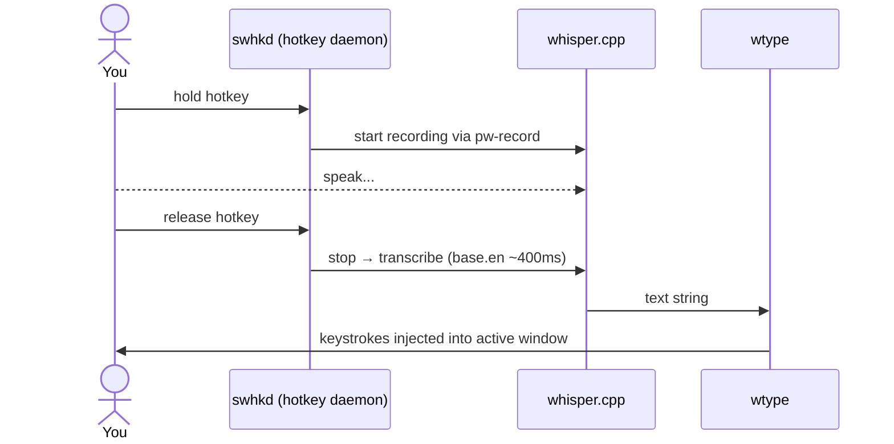
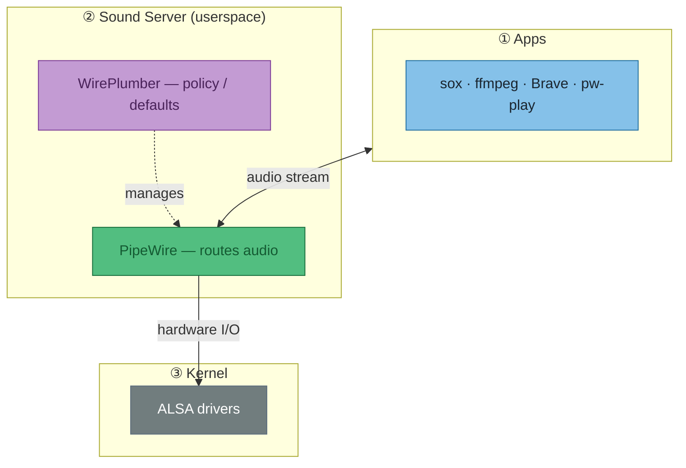
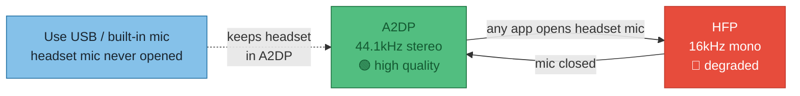
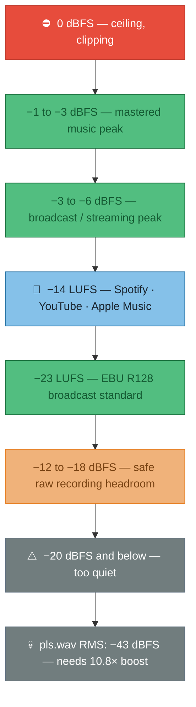
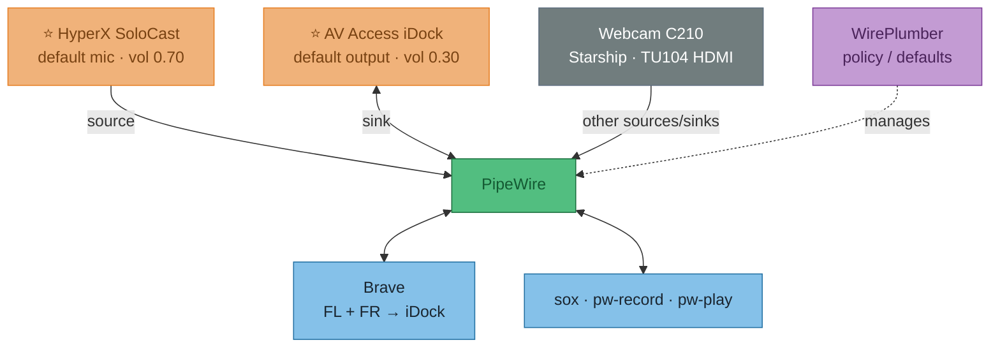
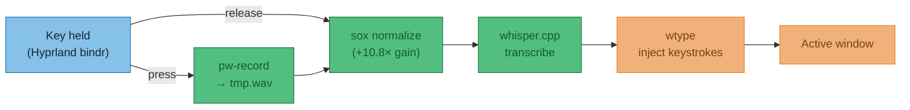
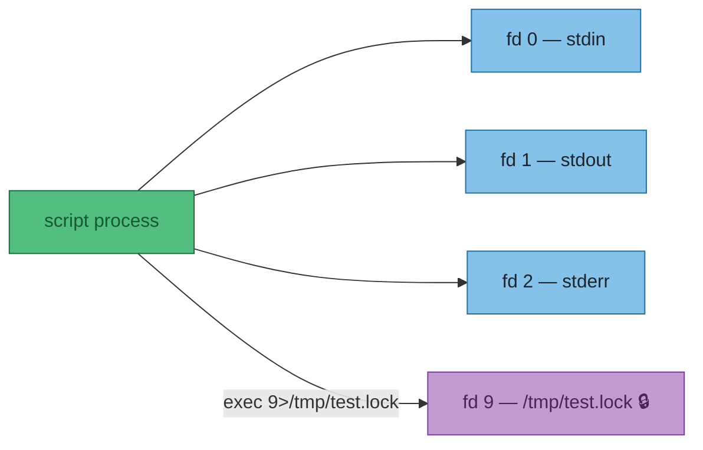
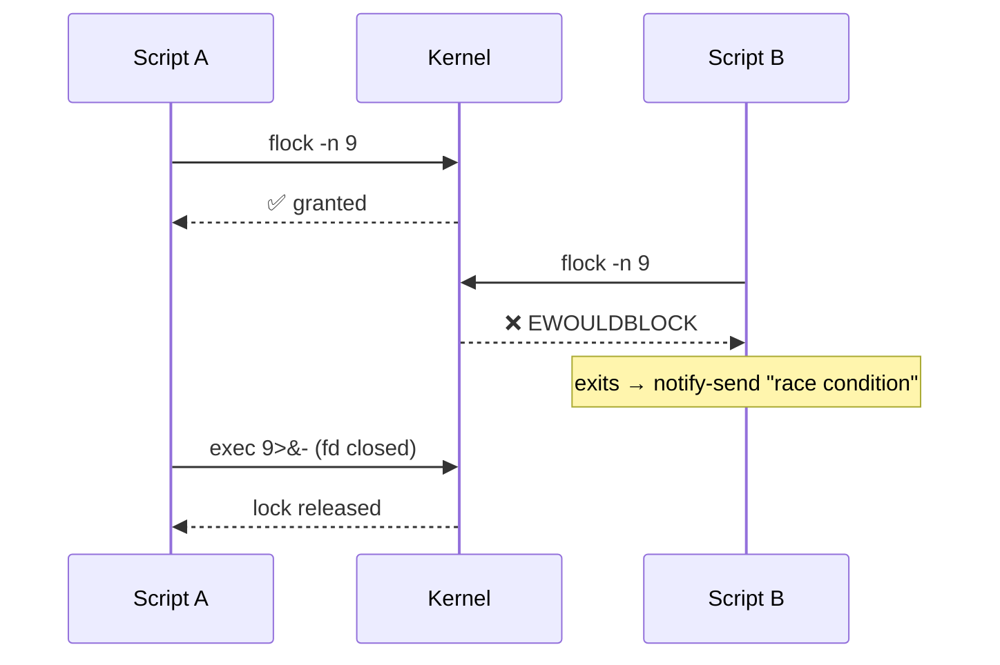

# June 2026

??? info "Key terms"
    | Term | Plain English |
    |---|---|
    | **ALSA** | Advanced Linux Sound Architecture — the kernel's raw audio driver layer. Every audio tool eventually hits this at the bottom. You rarely touch it directly. |
    | **PipeWire** | Modern Linux sound server (2021+). Routes audio between apps and hardware. Replaced both PulseAudio and JACK. |
    | **WirePlumber** | The policy brain on top of PipeWire — decides defaults, auto-switching, device rules. |
    | **A2DP** | Advanced Audio Distribution Profile — the Bluetooth "music quality" mode. Stereo, 44.1kHz, one-way (listen only). |
    | **HFP** | Hands-Free Profile — Bluetooth "phone call quality" mode. Mono, 16kHz, bidirectional. Activates the moment any app opens the headset mic. |
    | **HSP** | Headset Profile — older/worse version of HFP. 8kHz mono. |
    | **dBFS** | Decibels relative to Full Scale — digital loudness. 0 = ceiling (clipping). Everything useful is negative. |
    | **LUFS** | Loudness Units relative to Full Scale — perceptual loudness, frequency-weighted. What Spotify/YouTube actually measure. |
    | **RMS** | Root Mean Square — the "real" loudness of an audio file. √(average of all samples²). More meaningful than peak amplitude. |
    | **swhkd** | Simple Wayland HotKey Daemon — listens for key combos and runs shell commands. Wayland-native replacement for `sxhkd` (X11-only). |
    | **wtype** | Wayland keystroke injector — types text into the active window programmatically. Replaces `xdotool type` (X11-only). |
    | **SCO** | Synchronous Connection Oriented — the Bluetooth link type used for bidirectional audio. Too narrow for A2DP-quality data in both directions simultaneously. |

---

### Local voice dictation on Linux

!!! success "What's running"
    `whisper.cpp` + `wtype` + `swhkd` — fully local, no API key. `base.en` model, ~400ms latency.

**How it works — end to end:**



**Engine options:**

| Engine | Tool | Wayland | Latency | Notes |
|---|---|---|---|---|
| Whisper | `whisper.cpp` | ✅ | ~400ms | ✅ Chosen |
| Whisper | `faster-whisper` | ✅ | ~300ms | CTranslate2 backend |
| Whisper | `whisper-live` | ✅ | ~300ms streaming | Harder setup |
| Distil-Whisper | `whisper.cpp` | ✅ | ~200ms | Slightly less accurate |
| Vosk | `nerd-dictation` | ❌ XWayland only | ~100ms | Breaks on native Wayland |

**Model sizes** — pick by CPU budget:

| Model | Size | Latency | Sweet spot? |
|---|---|---|---|
| `tiny.en` | 75 MB | ~150ms | Fast but rough |
| `base.en` | 140 MB | ~400ms | ✅ Best balance |
| `small.en` | 460 MB | ~1s | Better accuracy, noticeable lag |
| `medium.en` | 1.5 GB | ~3s | Overkill for dictation |

!!! note "Why `swhkd` not `sxhkd`, `wtype` not `xdotool`"
    Both `sxhkd` and `xdotool` are X11-only. On native Wayland they silently fail or don't exist.

---

### Linux audio stack



!!! tip "So what — debugging mental model"
    Tool not found or not working? First ask: **which layer does it live at?**

    | Symptom | Cause | Fix |
    |---|---|---|
    | `pactl: command not found` | PulseAudio not installed | Use `wpctl` instead, or add `pipewire-pulse` shim |
    | `aplay` works but `pw-play` doesn't | Wrong layer for this context | Use `pw-play` for PipeWire, `aplay` for raw ALSA |
    | App can't find mic | WirePlumber policy / default not set | `wpctl set-default <source-id>` |

!!! warning "Why `pactl` is missing on this machine"
    Pure PipeWire, no `pipewire-pulse` shim installed. Add `pipewire-pulse` to NixOS config to restore it.

**PulseAudio → PipeWire equivalents:**

| Task | PulseAudio | PipeWire |
|---|---|---|
| List devices | `pactl list sources short` | `wpctl status` |
| Set volume | `pactl set-sink-volume @DEFAULT_SINK@ 80%` | `wpctl set-volume @DEFAULT_AUDIO_SINK@ 80%` |
| Inspect device | `pactl list cards` | `wpctl inspect <id>` |
| Record | `parecord file.wav` | `pw-record file.wav` |
| Play | `paplay file.wav` | `pw-play file.wav` |

---

### Bluetooth audio: A2DP vs HFP



!!! tip "Why it switches"
    Bluetooth SCO (Synchronous Connection Oriented) links can't carry high-quality audio in both directions — bandwidth isn't there. Opening *any* mic input on the headset forces the switch.

!!! success "The fix — one line"
    Point `pw-record` / `rec` at a USB or built-in mic. Headset never gets a mic request → stays in A2DP.
    ```bash
    pw-record --target=<usb-mic-id> recording.wav
    ```

!!! tip "HFP is fine for Whisper anyway"
    16kHz is Whisper's native training format. Only matters if you want music *while* dictating.

| Profile | Quality | Direction | Codec |
|---|---|---|---|
| **A2DP** (Advanced Audio Distribution) | 44.1kHz stereo | Listen only | LDAC / aptX / AAC |
| **HFP** (Hands-Free Profile) | 16kHz mono | Bidirectional | CVSD / mSBC |
| **HSP** (Headset Profile) | 8kHz mono | Bidirectional | CVSD |

**Check active profile:**
```bash
wpctl inspect <id>   # id from: wpctl status
# api.bluez5.profile = "a2dp-sink"         ← good
# api.bluez5.profile = "headset-head-unit" ← degraded
```

WH-1000XM4 state (2026-06-06): `a2dp-sink` / `ldac`. Built-in mic is default source → A2DP preserved.

---

### WAV file analysis

**Tools at a glance:**

| Command | Gives you |
|---|---|
| `ffprobe -show_streams file.wav` | Format: codec, sample rate, channels, duration |
| `sox file.wav -n stat` | Signal stats: peak, RMS, loudness |
| `ffmpeg -i file.wav -filter:a volumedetect -f null /dev/null` | dBFS peak + mean — ffmpeg alternative to sox |

#### dBFS — the loudness scale

!!! note "dBFS vs LUFS"
    **dBFS** (decibels relative to Full Scale) = raw peak amplitude. 0 = digital ceiling, everything useful is negative.
    **LUFS** (Loudness Units relative to Full Scale) = perceptual loudness, frequency-weighted. What streaming platforms actually normalise to.



#### `sox file.wav -n stat` — reading the output

!!! warning "Bottom line first — `pls.wav`"
    Peak **−21 dBFS**, RMS **−43 dBFS**. Normal content sits at −3 to −14 dBFS. Needs ~10.8× boost.
    ```bash
    sox pls.wav out.wav norm        # normalize to 0 dBFS peak
    sox pls.wav out.wav vol 10.815  # explicit 10.8× boost
    ```

**The two numbers that matter:**

| Field | `pls.wav` | What it means | dBFS |
|---|---|---|---|
| `Maximum amplitude` | **0.092** | Loudest single sample — 9% of ceiling | **−21 dBFS** |
| `RMS amplitude` | **0.006935** | Real loudness — √(mean of all samples²) | **−43 dBFS** |

!!! tip "Peak vs RMS — why both matter"
    **Peak** tells you if you're clipping. **RMS** tells you how loud it actually sounds. A file can peak fine but be inaudible if the RMS is too low — that's exactly `pls.wav`.

**Supporting fields:**

| Field | `pls.wav` | Meaning |
|---|---|---|
| `Volume adjustment` | **10.815** | `1 / 0.092` — multiply by this to hit 0 dBFS peak |
| `Rough frequency` | 682 Hz | Dominant frequency — mid voice range |
| `Midline amplitude` | 0.002 | (max + min) / 2 — near 0 = no DC offset (good) |

??? info "All fields"
    | Field | Meaning |
    |---|---|
    | `Samples read` | Total samples = channels × duration × sample rate |
    | `Scaled by` | 32-bit int max — sox normalises all values to −1.0…+1.0 |
    | `Minimum amplitude` | Most negative sample — audio oscillates around zero, always negative |
    | `Mean norm` | Average of absolute values — ignores direction |
    | `Mean amplitude` | Raw average incl. direction — near-zero = balanced wave (expected) |
    | `Maximum delta` | Biggest jump between consecutive samples — high-freq content indicator |
    | `Mean delta` | Average sample-to-sample change — low = smooth/quiet signal |

#### `wpctl status` — what's connected and routing where



!!! tip "So what — reading `wpctl status`"
    | Term | Meaning |
    |---|---|
    | **Sink** | Output — speakers, headphones, dock |
    | **Source** | Input — mic, line-in |
    | **`*`** | Active default |
    | **`vol: 0.30`** | PipeWire software volume (0–1.0), separate from hardware gain |
    | **Streams** | Live routes — Brave output_FL/FR → iDock playback_FL/FR means browser audio is playing through the dock |
    | **Configured default** | Persisted preference — SteelSeries Arctis 7 saved but not connected, WirePlumber fell back to iDock automatically |

---

### Hyprland dictation — spec & solution comparison

**Spec:** hold key → speak → release → text injected into active window. Accuracy over latency. NixOS / Hyprland / PipeWire.



!!! warning "Normalize before transcribing"
    SoloCast records quiet (confirmed: `pls.wav` peak −21 dBFS). Sox normalize step is not optional — Whisper accuracy drops on under-gained audio.

**Solution comparison:**

| Approach | Accuracy | Post-release latency | NixOS | Verdict |
|---|---|---|---|---|
| **DIY script** — `pw-record` + `sox` + `whisper.cpp` + `wtype` | ⭐⭐⭐ | ~400ms–1s | ✅ all nixpkgs | ✅ Recommended |
| **whisper.cpp `--stream`** | ⭐⭐ | Live (jittery) | ✅ | Partial audio = worse accuracy |
| **waystt** (local mode) | ⭐⭐⭐ | Same as DIY | ❌ not in nixpkgs | Needs manual flake; defaults to cloud |
| **whisper-live** | ⭐⭐ | Near-live | ⚠️ needs flake | Python WebSocket server, complex setup |

!!! note "Why waystt needs an API key (and why `openai-whisper` didn't)"
    These are two different things with confusingly similar names:

    | Thing | What it is | API key? | Cost |
    |---|---|---|---|
    | `openai-whisper` (Python package) | Open-source model weights, runs **locally** | ❌ None | Free |
    | OpenAI Whisper **API** | Cloud inference service at api.openai.com | ✅ Required | Pay per minute |
    | Whisper large-v3-turbo ("turbo") | Distilled open-source model, runs **locally** | ❌ None | Free |

    `waystt` defaults to the cloud API backend — that's why it asks for a key. Switch `TRANSCRIPTION_PROVIDER=local` in `~/.config/waystt/.env` and it uses local GGML weights (same as `whisper.cpp`) with no key and no cost. The local mode is not the default though, which is the footgun.

**Hyprland binding pattern — no `swhkd` needed:**

```ini
# hyprland.conf — Hyprland handles press/release natively
bind  = SUPER, R, exec, ~/.local/bin/dictate-start.sh
bindr = SUPER, R, exec, ~/.local/bin/dictate-stop.sh
```

`bindr` fires on key **release**. `swhkd` is unnecessary — Hyprland has this built in.

## 2026-06-07 — flock / fd redirection primer (waybar double-start)

**Context:** double waybar on UWSM boot — `exec =` in hyprland.conf fires the restart script twice concurrently, both race to `waybar &`.

---

### The fd (file descriptor) table

Every process owns a numbered table of open files — think of it as a cloakroom with numbered pegs. Each peg holds one open file. Three pegs are always taken:

```
peg 0 = stdin  (keyboard input)
peg 1 = stdout (terminal output)
peg 2 = stderr (error output)
pegs 3–9 = yours to use
```

`exec 9>/tmp/foo` hangs `/tmp/foo` on peg 9 — without starting a new process:



`flock -n 9` puts a kernel advisory lock on fd 9. **The lock lives on the fd — close the fd, lock is gone.**

---

### Decoding the redirection syntax

Start with something familiar — redirecting output to a file:

```sh
echo hello > /tmp/foo
```

What you don't see: **every `>` secretly has a number in front of it.** That number is which fd to redirect. The default is `1` (stdout):

```sh
echo hello 1> /tmp/foo   # same thing — 1 is stdout
echo hello 2> /tmp/foo   # stderr instead
```

So `9>/tmp/foo` just means: open this file, but call it fd 9 instead of 0/1/2.

---

Now `>&` — the `&` means *"what follows is an fd number, not a filename"*:

```sh
2>1      # ❌ writes stderr to a file literally named "1"
2>&1     # ✅ points stderr at whatever fd 1 (stdout) is
```

That's the only job of `&` here. It's just a disambiguator so the shell knows you mean an fd, not a filename.

---

And `-` after `&` is a special shell keyword meaning *"close"*. Think of `>&N` as "point this fd at fd N":

```sh
9>&1     # point fd 9 at fd 1 (stdout)
9>&2     # point fd 9 at fd 2 (stderr)
9>&-     # point fd 9 at... nothing  =  close it
```

`-` is just shell for "the void". No fd, no file — gone.

And `&` must be there even for `-`:

```sh
2>-     # stderr → file literally named "-"   ❌
2>&-    # stderr → nothing = close stderr     ✅
```

---

### `> out.txt` is just shorthand

Every `>` has a hidden `1` in front of it. The shell assumes stdout if you don't say otherwise:

```sh
./prog > out.txt    # same as...
./prog 1> out.txt   # exactly the same thing
```

`1` is just the default. You only need to write it explicitly when you want something *other* than stdout — like `2>` for stderr.

---

### Putting it together — "send everything to one file"

```sh
./prog > out.txt 2>&1    # stdout → out.txt, then stderr → wherever stdout is = out.txt ✅
./prog 2> out.txt 1>&2   # stderr → out.txt, then stdout → wherever stderr is = out.txt ✅
./prog > out.txt 2>out.txt  # ⚠️  opens out.txt TWICE — two independent write heads
                             # works, but output can interleave/corrupt each other
```

Lines 1 and 2 are truly equivalent. Line 3 looks the same but isn't — two separate handles to the same file means writes don't coordinate.

!!! warning "Order matters on line 1"
    ```sh
    ./prog > out.txt 2>&1   # ✅ stderr follows stdout to out.txt
    ./prog 2>&1 > out.txt   # ❌ stderr → terminal (stdout at that moment), then stdout → out.txt
    ```
    Shell evaluates redirections left to right. `2>&1` means "stderr to wherever stdout *currently* points" — if stdout hasn't been redirected yet, stderr goes to the terminal.

---

Put it together:

```sh
exec 9>/tmp/test.lock   # open the lock file, give it fd 9
flock -n 9              # lock fd 9
waybar 9>&- &           # start waybar — but close fd 9 inside it first
                        # so waybar doesn't hold the lock open
```

---

### The race flock prevents



---

### The `9>&-` trick

Child processes inherit all open fds. Without it, `waybar &` holds fd 9 open forever — the lock never releases:

```sh
exec 9>/tmp/restart-waybar.lock
if flock -n 9; then
    pkill waybar
    sleep 0.3
    waybar 9>&- &  # (1)!
else
    notify-send -i "error" "race condition - cannot restart waybar"
fi
```

1. `9>&-` closes fd 9 **inside waybar's process** before it starts — releases the lock without waiting for the script to exit.

---

### See it for real — `/proc/self/fd`

The fd table isn't abstract — the kernel exposes it as a directory. After `exec 9>/tmp/test.lock`:

```sh
$ ls -la /proc/self/fd
0 -> /dev/pts/6       # stdin  (terminal)
1 -> /dev/pts/6       # stdout (terminal)
2 -> /dev/pts/6       # stderr (terminal)
3 -> /proc/471463/fd  # ls inspecting itself
9 -> /tmp/test.lock   # ← our lock fd, right there
```

fd 9 is a real symlink to the file. While that entry exists, the kernel lock is held.

---

### Test it live (two terminals)

```sh
# terminal 1 — open fd 9 and lock it
exec 9>/tmp/test.lock; flock -n 9 && echo "🔒 locked"

# terminal 2 — try to acquire (should fail)
( exec 9>/tmp/test.lock; flock -n 9 && echo "locked" || echo "❌ already locked" )

# terminal 1 — release
exec 9>&-

# terminal 2 — try again (now succeeds)
( exec 9>/tmp/test.lock; flock -n 9 && echo "🔒 locked" || echo "already locked" )
```

!!! warning "Interactive shell gotcha"
    `exec 9>/tmp/foo` in your shell rewires **that shell's** fd table. Lock holds until `exec 9>&-` or shell exits. In a script file this is fine — the script process exits and closes all fds automatically. Don't paste the multi-line block interactively.

!!! tip "Outcome"
    Went with the simpler fix — `pkill` first, then `sleep 0.3`, then `waybar &`. `flock` is the right concept but fd inheritance from backgrounded processes adds more complexity than the problem warrants.
