# June 2026

??? info "Key terms"
    | Term | Plain English |
    |---|---|
    | **ALSA** | Advanced Linux Sound Architecture — the kernel's raw audio driver layer. Every audio tool eventually hits this at the bottom. You rarely touch it directly. |
    | **PipeWire** | Modern Linux sound server (2021+). Routes audio between apps and hardware. Replaced both PulseAudio and JACK. |
    | **WirePlumber** | The policy brain on top of PipeWire — decides defaults, auto-switching, device rules. |
    | **A2DP** | Advanced Audio Distribution Profile — the Bluetooth "music quality" mode. Stereo, 44.1kHz, one-way (listen only). |
    | **HFP** | Hands-Free Profile — Bluetooth "phone call quality" mode. Mono, 16kHz, bidirectional. Activates the moment any app opens the headset mic. |
    | **HSP** | Headset Profile — older/worse version of HFP. 8kHz mono. |
    | **dBFS** | Decibels relative to Full Scale — digital loudness. 0 = ceiling (clipping). Everything useful is negative. |
    | **LUFS** | Loudness Units relative to Full Scale — perceptual loudness, frequency-weighted. What Spotify/YouTube actually measure. |
    | **RMS** | Root Mean Square — the "real" loudness of an audio file. √(average of all samples²). More meaningful than peak amplitude. |
    | **swhkd** | Simple Wayland HotKey Daemon — listens for key combos and runs shell commands. Wayland-native replacement for `sxhkd` (X11-only). |
    | **wtype** | Wayland keystroke injector — types text into the active window programmatically. Replaces `xdotool type` (X11-only). |
    | **SCO** | Synchronous Connection Oriented — the Bluetooth link type used for bidirectional audio. Too narrow for A2DP-quality data in both directions simultaneously. |

---

### Local voice dictation on Linux

!!! success "What's running"
    `whisper.cpp` + `wtype` + `swhkd` — fully local, no API key. `base.en` model, ~400ms latency.

**How it works — end to end:**

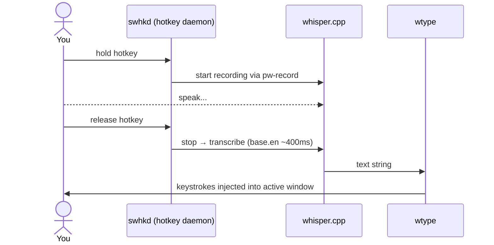

**Engine options:**

| Engine | Tool | Wayland | Latency | Notes |
|---|---|---|---|---|
| Whisper | `whisper.cpp` | ✅ | ~400ms | ✅ Chosen |
| Whisper | `faster-whisper` | ✅ | ~300ms | CTranslate2 backend |
| Whisper | `whisper-live` | ✅ | ~300ms streaming | Harder setup |
| Distil-Whisper | `whisper.cpp` | ✅ | ~200ms | Slightly less accurate |
| Vosk | `nerd-dictation` | ❌ XWayland only | ~100ms | Breaks on native Wayland |

**Model sizes** — pick by CPU budget:

| Model | Size | Latency | Sweet spot? |
|---|---|---|---|
| `tiny.en` | 75 MB | ~150ms | Fast but rough |
| `base.en` | 140 MB | ~400ms | ✅ Best balance |
| `small.en` | 460 MB | ~1s | Better accuracy, noticeable lag |
| `medium.en` | 1.5 GB | ~3s | Overkill for dictation |

!!! note "Why `swhkd` not `sxhkd`, `wtype` not `xdotool`"
    Both `sxhkd` and `xdotool` are X11-only. On native Wayland they silently fail or don't exist.

---

### Linux audio stack

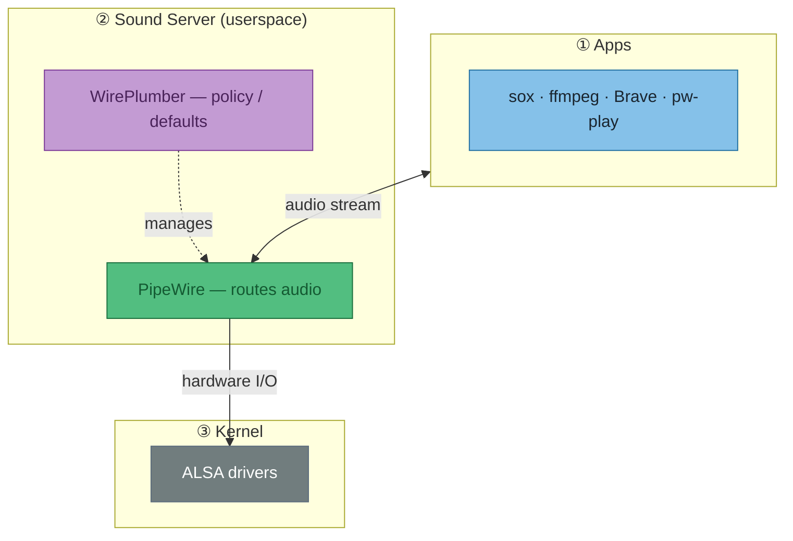

!!! tip "So what — debugging mental model"
    Tool not found or not working? First ask: **which layer does it live at?**

    | Symptom | Cause | Fix |
    |---|---|---|
    | `pactl: command not found` | PulseAudio not installed | Use `wpctl` instead, or add `pipewire-pulse` shim |
    | `aplay` works but `pw-play` doesn't | Wrong layer for this context | Use `pw-play` for PipeWire, `aplay` for raw ALSA |
    | App can't find mic | WirePlumber policy / default not set | `wpctl set-default <source-id>` |

!!! warning "Why `pactl` is missing on this machine"
    Pure PipeWire, no `pipewire-pulse` shim installed. Add `pipewire-pulse` to NixOS config to restore it.

**PulseAudio → PipeWire equivalents:**

| Task | PulseAudio | PipeWire |
|---|---|---|
| List devices | `pactl list sources short` | `wpctl status` |
| Set volume | `pactl set-sink-volume @DEFAULT_SINK@ 80%` | `wpctl set-volume @DEFAULT_AUDIO_SINK@ 80%` |
| Inspect device | `pactl list cards` | `wpctl inspect <id>` |
| Record | `parecord file.wav` | `pw-record file.wav` |
| Play | `paplay file.wav` | `pw-play file.wav` |

---

### Bluetooth audio: A2DP vs HFP

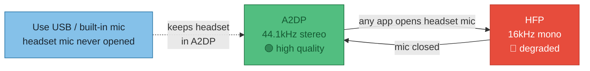

!!! tip "Why it switches"
    Bluetooth SCO (Synchronous Connection Oriented) links can't carry high-quality audio in both directions — bandwidth isn't there. Opening *any* mic input on the headset forces the switch.

!!! success "The fix — one line"
    Point `pw-record` / `rec` at a USB or built-in mic. Headset never gets a mic request → stays in A2DP.
    ```bash
    pw-record --target=<usb-mic-id> recording.wav
    ```

!!! tip "HFP is fine for Whisper anyway"
    16kHz is Whisper's native training format. Only matters if you want music *while* dictating.

| Profile | Quality | Direction | Codec |
|---|---|---|---|
| **A2DP** (Advanced Audio Distribution) | 44.1kHz stereo | Listen only | LDAC / aptX / AAC |
| **HFP** (Hands-Free Profile) | 16kHz mono | Bidirectional | CVSD / mSBC |
| **HSP** (Headset Profile) | 8kHz mono | Bidirectional | CVSD |

**Check active profile:**
```bash
wpctl inspect <id>   # id from: wpctl status
# api.bluez5.profile = "a2dp-sink"         ← good
# api.bluez5.profile = "headset-head-unit" ← degraded
```

WH-1000XM4 state (2026-06-06): `a2dp-sink` / `ldac`. Built-in mic is default source → A2DP preserved.

---

### WAV file analysis

**Tools at a glance:**

| Command | Gives you |
|---|---|
| `ffprobe -show_streams file.wav` | Format: codec, sample rate, channels, duration |
| `sox file.wav -n stat` | Signal stats: peak, RMS, loudness |
| `ffmpeg -i file.wav -filter:a volumedetect -f null /dev/null` | dBFS peak + mean — ffmpeg alternative to sox |

#### dBFS — the loudness scale

!!! note "dBFS vs LUFS"
    **dBFS** (decibels relative to Full Scale) = raw peak amplitude. 0 = digital ceiling, everything useful is negative.
    **LUFS** (Loudness Units relative to Full Scale) = perceptual loudness, frequency-weighted. What streaming platforms actually normalise to.

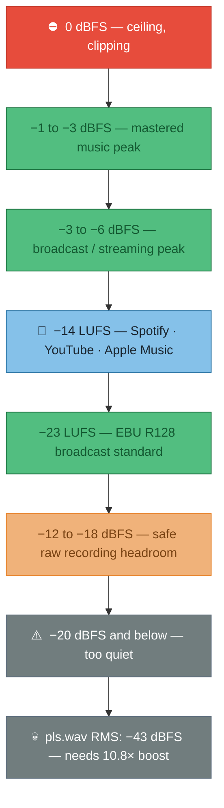

#### `sox file.wav -n stat` — reading the output

!!! warning "Bottom line first — `pls.wav`"
    Peak **−21 dBFS**, RMS **−43 dBFS**. Normal content sits at −3 to −14 dBFS. Needs ~10.8× boost.
    ```bash
    sox pls.wav out.wav norm        # normalize to 0 dBFS peak
    sox pls.wav out.wav vol 10.815  # explicit 10.8× boost
    ```

**The two numbers that matter:**

| Field | `pls.wav` | What it means | dBFS |
|---|---|---|---|
| `Maximum amplitude` | **0.092** | Loudest single sample — 9% of ceiling | **−21 dBFS** |
| `RMS amplitude` | **0.006935** | Real loudness — √(mean of all samples²) | **−43 dBFS** |

!!! tip "Peak vs RMS — why both matter"
    **Peak** tells you if you're clipping. **RMS** tells you how loud it actually sounds. A file can peak fine but be inaudible if the RMS is too low — that's exactly `pls.wav`.

**Supporting fields:**

| Field | `pls.wav` | Meaning |
|---|---|---|
| `Volume adjustment` | **10.815** | `1 / 0.092` — multiply by this to hit 0 dBFS peak |
| `Rough frequency` | 682 Hz | Dominant frequency — mid voice range |
| `Midline amplitude` | 0.002 | (max + min) / 2 — near 0 = no DC offset (good) |

??? info "All fields"
    | Field | Meaning |
    |---|---|
    | `Samples read` | Total samples = channels × duration × sample rate |
    | `Scaled by` | 32-bit int max — sox normalises all values to −1.0…+1.0 |
    | `Minimum amplitude` | Most negative sample — audio oscillates around zero, always negative |
    | `Mean norm` | Average of absolute values — ignores direction |
    | `Mean amplitude` | Raw average incl. direction — near-zero = balanced wave (expected) |
    | `Maximum delta` | Biggest jump between consecutive samples — high-freq content indicator |
    | `Mean delta` | Average sample-to-sample change — low = smooth/quiet signal |

#### `wpctl status` — what's connected and routing where

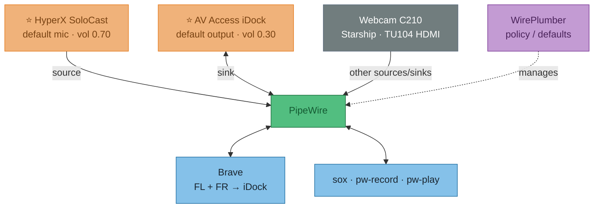

!!! tip "So what — reading `wpctl status`"
    | Term | Meaning |
    |---|---|
    | **Sink** | Output — speakers, headphones, dock |
    | **Source** | Input — mic, line-in |
    | **`*`** | Active default |
    | **`vol: 0.30`** | PipeWire software volume (0–1.0), separate from hardware gain |
    | **Streams** | Live routes — Brave output_FL/FR → iDock playback_FL/FR means browser audio is playing through the dock |
    | **Configured default** | Persisted preference — SteelSeries Arctis 7 saved but not connected, WirePlumber fell back to iDock automatically |

---

### Hyprland dictation — spec & solution comparison

**Spec:** hold key → speak → release → text injected into active window. Accuracy over latency. NixOS / Hyprland / PipeWire.

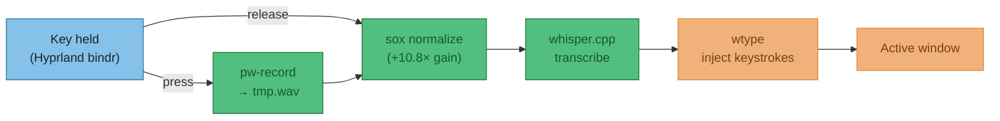

!!! warning "Normalize before transcribing"
    SoloCast records quiet (confirmed: `pls.wav` peak −21 dBFS). Sox normalize step is not optional — Whisper accuracy drops on under-gained audio.

**Solution comparison:**

| Approach | Accuracy | Post-release latency | NixOS | Verdict |
|---|---|---|---|---|
| **DIY script** — `pw-record` + `sox` + `whisper.cpp` + `wtype` | ⭐⭐⭐ | ~400ms–1s | ✅ all nixpkgs | ✅ Recommended |
| **whisper.cpp `--stream`** | ⭐⭐ | Live (jittery) | ✅ | Partial audio = worse accuracy |
| **waystt** (local mode) | ⭐⭐⭐ | Same as DIY | ❌ not in nixpkgs | Needs manual flake; defaults to cloud |
| **whisper-live** | ⭐⭐ | Near-live | ⚠️ needs flake | Python WebSocket server, complex setup |

!!! note "Why waystt needs an API key (and why `openai-whisper` didn't)"
    These are two different things with confusingly similar names:

    | Thing | What it is | API key? | Cost |
    |---|---|---|---|
    | `openai-whisper` (Python package) | Open-source model weights, runs **locally** | ❌ None | Free |
    | OpenAI Whisper **API** | Cloud inference service at api.openai.com | ✅ Required | Pay per minute |
    | Whisper large-v3-turbo ("turbo") | Distilled open-source model, runs **locally** | ❌ None | Free |

    `waystt` defaults to the cloud API backend — that's why it asks for a key. Switch `TRANSCRIPTION_PROVIDER=local` in `~/.config/waystt/.env` and it uses local GGML weights (same as `whisper.cpp`) with no key and no cost. The local mode is not the default though, which is the footgun.

**Hyprland binding pattern — no `swhkd` needed:**

```ini
# hyprland.conf — Hyprland handles press/release natively
bind  = SUPER, R, exec, ~/.local/bin/dictate-start.sh
bindr = SUPER, R, exec, ~/.local/bin/dictate-stop.sh
```

`bindr` fires on key **release**. `swhkd` is unnecessary — Hyprland has this built in.

## 2026-06-07 — flock / fd redirection primer (waybar double-start)

**Context:** double waybar on UWSM boot — `exec =` in hyprland.conf fires the restart script twice concurrently, both race to `waybar &`.

---

### The fd (file descriptor) table

Every process owns a numbered table of open files — think of it as a cloakroom with numbered pegs. Each peg holds one open file. Three pegs are always taken:

```
peg 0 = stdin  (keyboard input)
peg 1 = stdout (terminal output)
peg 2 = stderr (error output)
pegs 3–9 = yours to use
```

`exec 9>/tmp/foo` hangs `/tmp/foo` on peg 9 — without starting a new process:

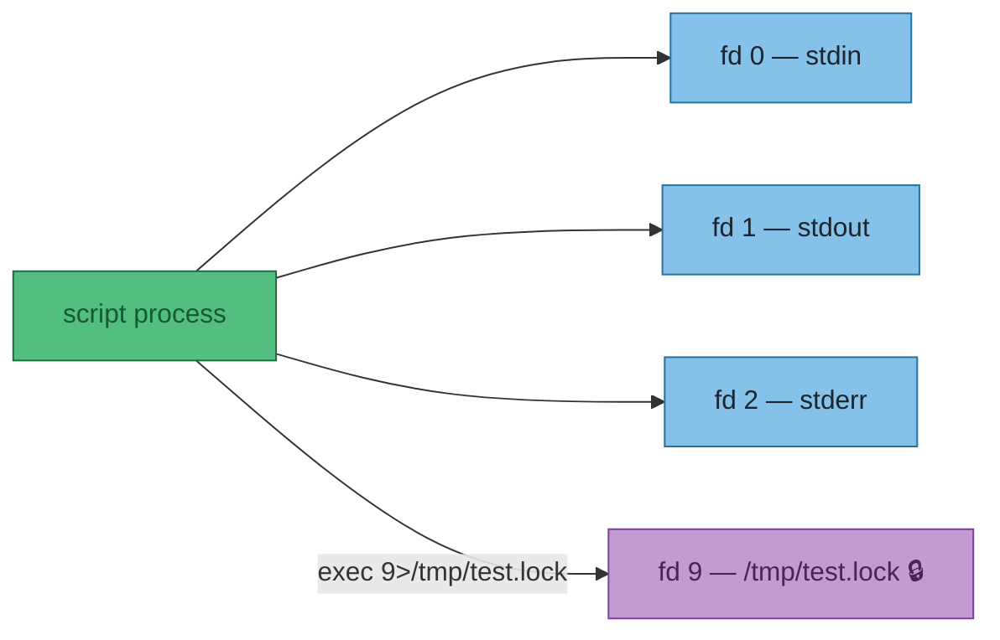

`flock -n 9` puts a kernel advisory lock on fd 9. **The lock lives on the fd — close the fd, lock is gone.**

---

### Decoding the redirection syntax

Start with something familiar — redirecting output to a file:

```sh
echo hello > /tmp/foo
```

What you don't see: **every `>` secretly has a number in front of it.** That number is which fd to redirect. The default is `1` (stdout):

```sh
echo hello 1> /tmp/foo   # same thing — 1 is stdout
echo hello 2> /tmp/foo   # stderr instead
```

So `9>/tmp/foo` just means: open this file, but call it fd 9 instead of 0/1/2.

---

Now `>&` — the `&` means *"what follows is an fd number, not a filename"*:

```sh
2>1      # ❌ writes stderr to a file literally named "1"
2>&1     # ✅ points stderr at whatever fd 1 (stdout) is
```

That's the only job of `&` here. It's just a disambiguator so the shell knows you mean an fd, not a filename.

---

And `-` after `&` is a special shell keyword meaning *"close"*. Think of `>&N` as "point this fd at fd N":

```sh
9>&1     # point fd 9 at fd 1 (stdout)
9>&2     # point fd 9 at fd 2 (stderr)
9>&-     # point fd 9 at... nothing  =  close it
```

`-` is just shell for "the void". No fd, no file — gone.

And `&` must be there even for `-`:

```sh
2>-     # stderr → file literally named "-"   ❌
2>&-    # stderr → nothing = close stderr     ✅
```

---

### `> out.txt` is just shorthand

Every `>` has a hidden `1` in front of it. The shell assumes stdout if you don't say otherwise:

```sh
./prog > out.txt    # same as...
./prog 1> out.txt   # exactly the same thing
```

`1` is just the default. You only need to write it explicitly when you want something *other* than stdout — like `2>` for stderr.

---

### Putting it together — "send everything to one file"

```sh
./prog > out.txt 2>&1    # stdout → out.txt, then stderr → wherever stdout is = out.txt ✅
./prog 2> out.txt 1>&2   # stderr → out.txt, then stdout → wherever stderr is = out.txt ✅
./prog > out.txt 2>out.txt  # ⚠️  opens out.txt TWICE — two independent write heads
                             # works, but output can interleave/corrupt each other
```

Lines 1 and 2 are truly equivalent. Line 3 looks the same but isn't — two separate handles to the same file means writes don't coordinate.

!!! warning "Order matters on line 1"
    ```sh
    ./prog > out.txt 2>&1   # ✅ stderr follows stdout to out.txt
    ./prog 2>&1 > out.txt   # ❌ stderr → terminal (stdout at that moment), then stdout → out.txt
    ```
    Shell evaluates redirections left to right. `2>&1` means "stderr to wherever stdout *currently* points" — if stdout hasn't been redirected yet, stderr goes to the terminal.

---

Put it together:

```sh
exec 9>/tmp/test.lock   # open the lock file, give it fd 9
flock -n 9              # lock fd 9
waybar 9>&- &           # start waybar — but close fd 9 inside it first
                        # so waybar doesn't hold the lock open
```

---

### The race flock prevents

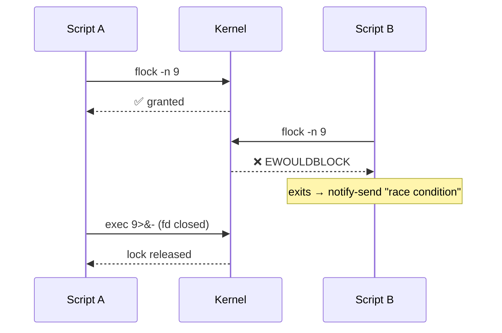

---

### The `9>&-` trick

Child processes inherit all open fds. Without it, `waybar &` holds fd 9 open forever — the lock never releases:

```sh
exec 9>/tmp/restart-waybar.lock
if flock -n 9; then
    pkill waybar
    sleep 0.3
    waybar 9>&- &  # (1)!
else
    notify-send -i "error" "race condition - cannot restart waybar"
fi
```

1. `9>&-` closes fd 9 **inside waybar's process** before it starts — releases the lock without waiting for the script to exit.

---

### See it for real — `/proc/self/fd`

The fd table isn't abstract — the kernel exposes it as a directory. After `exec 9>/tmp/test.lock`:

```sh
$ ls -la /proc/self/fd
0 -> /dev/pts/6       # stdin  (terminal)
1 -> /dev/pts/6       # stdout (terminal)
2 -> /dev/pts/6       # stderr (terminal)
3 -> /proc/471463/fd  # ls inspecting itself
9 -> /tmp/test.lock   # ← our lock fd, right there
```

fd 9 is a real symlink to the file. While that entry exists, the kernel lock is held.

---

### Test it live (two terminals)

```sh
# terminal 1 — open fd 9 and lock it
exec 9>/tmp/test.lock; flock -n 9 && echo "🔒 locked"

# terminal 2 — try to acquire (should fail)
( exec 9>/tmp/test.lock; flock -n 9 && echo "locked" || echo "❌ already locked" )

# terminal 1 — release
exec 9>&-

# terminal 2 — try again (now succeeds)
( exec 9>/tmp/test.lock; flock -n 9 && echo "🔒 locked" || echo "already locked" )
```

!!! warning "Interactive shell gotcha"
    `exec 9>/tmp/foo` in your shell rewires **that shell's** fd table. Lock holds until `exec 9>&-` or shell exits. In a script file this is fine — the script process exits and closes all fds automatically. Don't paste the multi-line block interactively.

!!! tip "Outcome"
    Went with the simpler fix — `pkill` first, then `sleep 0.3`, then `waybar &`. `flock` is the right concept but fd inheritance from backgrounded processes adds more complexity than the problem warrants.
# June 2026

---

## ZSH history corruption after crash

**Date:** 2026-06-05
**Symptom:** After an unclean shutdown, every new terminal shows:
```
zsh: corrupt history file /home/joelyboy/.zsh_history
```

### Why it happens

zsh keeps a file of every command you've typed (`~/.zsh_history`). If the machine dies mid-write, the partially-written chunk gets filled with **null bytes** (`\x00` — zeros, not readable text). zsh hits them on startup and complains.

Not a broken disk. Not data loss. Just zeros in the wrong place.

### Fix

```bash
cp ~/.zsh_history ~/.zsh_history.bak
perl -i -pe 's/\x00//g' ~/.zsh_history
```

Line 1 backs up the file. Line 2 strips the null bytes out. Open a new terminal — warning gone.

> `perl` is used here instead of `sed` because `sed` doesn't handle raw binary/null bytes reliably.

---

## Crash investigation — June 4 2026, ~17:17–17:19 BST

### Reference: what Linux stores for crash/unclean shutdown forensics

This is the canonical set of places to look, in order of usefulness:

| Source | Command | What you get |
|---|---|---|
| **systemd journal — previous boot** | `journalctl -b -1` | Everything systemd logged before the crash. `-b -1` = one boot back, `-b -2` = two back, etc. |
| **Kernel-only messages — previous boot** | `journalctl -b -1 -k` | Just kernel messages: OOM killer, segfaults, hardware errors (MCE), panics |
| **List all boots** | `journalctl --list-boots` | Shows every boot with timestamps — lets you identify which `-b N` number is the crash |
| **Priority filter** | `journalctl -b -1 -p err` | Only error-level and above — fast triage |
| **pstore / ramoops** | `ls /sys/fs/pstore/` | If configured: kernel preserves a panic dump in a reserved chunk of RAM across reboots. Survives even if disk write failed. Not configured on this machine. |
| **kdump** | `/var/crash/` | If configured: a second minimal kernel boots on panic and dumps memory to disk. Not configured here. |
| **dmesg (current boot only)** | `sudo dmesg` | Kernel ring buffer — only current boot, doesn't persist across reboots. Useful for hardware errors on the current session. |

> **Key insight:** `journalctl -b -1` is your first call every time. If the journal just stops mid-stream with no "Reached target Shutdown" line, that's a hard death — power cut, hardware hang, or kernel panic with no time to log.

### What was found for this specific crash

**Two separate events happened:**

#### Event 1 — 16:28:10 BST: Hyprland (the display compositor) crashed

```
.Hyprland-wrapped: segfault at 200 error 4 (likely on CPU 13)
.xdg-desktop-portal: segfault in libwayland-client.so (x2)
```

**ELI5:** Hyprland is the thing that draws windows on screen and manages your Wayland desktop. It crashed with a segfault (a program accessed memory it shouldn't — the OS kills it immediately). When the compositor dies, all GUI apps lose their connection to the screen.

The system itself **did not die** here — just the desktop. Postgres kept logging until 17:17:39, which proves the OS was alive for nearly another hour.

#### Event 2 — ~17:17:39–17:19:23 BST: Hard reset after frozen desktop

Boot -1 last log entry: `17:17:39`. Boot 0 first entry: `17:19:23`. Gap: ~2 minutes.

The journal just stops cold — no "Reached target Shutdown", no kernel panic. This is a **hard reset** (power button held) after the desktop froze. The OS was still alive (SSH would have worked), but with no display/input there was no way to recover gracefully. The journal stopping cold is the hard reset, not a second crash event.

#### What the postgres errors were (not the crash cause)

The logs are full of:
```
ERROR: could not access file "$libdir/timescaledb-2.23.1": No such file or directory
```
This is a **separate, pre-existing issue** from the NixOS upgrade. The TimescaleDB extension version in the database catalogue no longer matches the installed library version. It causes postgres to reject connections from anything that loads TimescaleDB. It did not cause the crash.

### What `coredumpctl` revealed

`coredumpctl` is the tool for this — it captures full process crash dumps automatically via systemd, no configuration needed. It was already running and caught everything.

```bash
coredumpctl list               # see all captured crashes
coredumpctl info <PID>         # full backtrace for a specific crash
```

The Hyprland core dump (PID 2624, 9.6MB) gave a full backtrace:

```
#0  CHyprGroupBarDecoration::textureFromTitle()   ← SEGFAULT: reads title of dead window
#1  CHyprGroupBarDecoration::draw()
#2  IHyprRenderer::renderWindow()
#3  IHyprRenderer::makeSnapshot()
#4  CWindow::unmapWindow()                        ← window being closed during cleanup
...
#15 wl_client_destroy()                           ← Wayland client (xdg-portal) disconnected
#17 CCompositor::cleanup()
#18 main()
```

A Wayland client disconnected (xdg-portal), Hyprland started cleaning up that window, tried to render its group bar title during teardown — but the window object was already partially destroyed. Classic use-after-free. This is a **Hyprland 0.55.2 bug** in its window cleanup path.

### Suspected root cause: CopyQ

CopyQ (clipboard manager, PID 362605) crashed at 16:28:53 — 43 seconds after the main event — with this backtrace:

```
X11Platform::createServerApplication()  ← CopyQ trying to connect via X11/XWayland
Qt::fatal — platform couldn't init     ← XWayland is dead, abort
```

CopyQ is running in **X11 mode** (via XWayland), not native Wayland. It crashed 3 times total across boots, including once on the very next boot (17:19:38).

CopyQ sits at the Wayland↔X11 clipboard bridge — a known stress point for Nvidia/XWayland instability. The likely chain:

1. CopyQ's X11↔Wayland clipboard bridging destabilises xdg-desktop-portal
2. xdg-portal crashes (13:58 and 16:28 crashes both logged)
3. Hyprland cleans up the dead xdg-portal client, hits the use-after-free bug
4. Hyprland segfaults, desktop freezes
5. Hard reset at 17:17

### Suggestions / actions

1. **ZSH history fix done** — stripped null bytes, warning gone.

2. **Hyprland env var mitigations applied** — added `WLR_NO_HARDWARE_CURSORS=1` and `HYPRLAND_NO_DIRECT_SCANOUT=1` to `hyprland.lua`. These reduce Nvidia 595.x Wayland crash triggers.

3. **CopyQ replaced with cliphist** — CopyQ (X11 mode, likely root cause) removed. Replaced with `cliphist` + `wl-clipboard` — fully native Wayland, no X11 bridge. Changes made:
   - `nixos-core-desktop.nix`: `copyq` → `cliphist` (wl-clipboard was already present)
   - `hyprland.lua` exec: `copyq --start-server` → `wl-paste --watch cliphist store`
   - `hyprland.lua` `SUPER+V` bind: `copyq show` → `cliphist list | fuzzel --dmenu | cliphist decode | wl-copy`
   - Removed `copyq-float` window rule

4. **Crash forensics ceiling** — ramoops not compiled into this kernel. Doesn't matter here — the crash was a userspace segfault, not a kernel panic. `coredumpctl` is the right tool and it already works.

5. **TimescaleDB mismatch** — separate issue, unrelated to crash. Update timescaledb in NixOS config to match the installed version, or run `ALTER EXTENSION timescaledb UPDATE;`.

---

### PAM — what it is and why GNOME keyring needs it

**Context:** `security.pam.services.greetd.enableGnomeKeyring = true` in NixOS — what does this actually do and why is it needed?

#### What PAM is

PAM (Pluggable Authentication Modules) is the Linux authentication middleware layer. It sits between "a service wants to verify a user" and "the actual check happens".

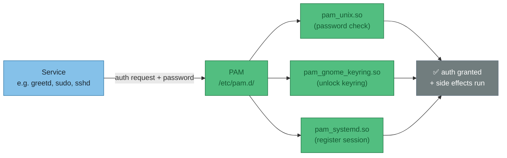

Each service has its own PAM stack — a list of modules in `/etc/pam.d/<service>`. When greetd logs you in, PAM runs the whole stack in order. Every module can `pass`, `fail`, or `skip`.

!!! note "Why not just one hardcoded check?"
    PAM was designed so auth behaviour can change without recompiling the service. A distro can swap password hashing, add MFA, or add session side-effects (like unlocking a keyring) purely by editing the module list — the service (greetd, sudo, sshd) never needs to know.

#### Why GNOME keyring needs a PAM hook

The GNOME keyring stores secrets (passwords, API keys, SSH passphrases) encrypted with your **login password**. Without a PAM hook, the keyring can't unlock itself at login — it doesn't know your password. The result: every app that needs a stored secret gets a popup asking for the keyring password, even though you already typed your login password 10 seconds ago.

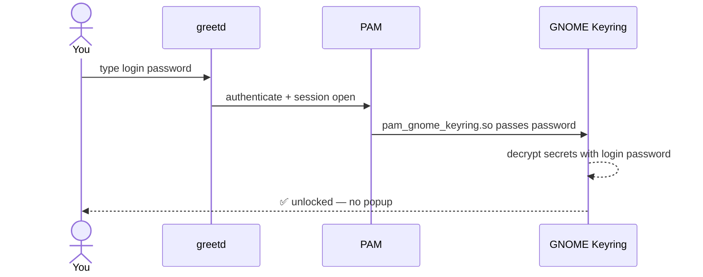

Without `pam_gnome_keyring.so` in greetd's stack, the keyring daemon starts but stays locked. Apps (Remmina, Chrome, SSH agent) hit it and prompt you manually.

#### What the NixOS option does

```nix
services.gnome.gnome-keyring.enable = true;           # installs + starts the daemon
security.pam.services.greetd.enableGnomeKeyring = true; # adds pam_gnome_keyring.so to greetd's PAM stack
```

`enableGnomeKeyring` appends two lines to `/etc/pam.d/greetd`:

```
auth     optional  pam_gnome_keyring.so
session  optional  pam_gnome_keyring.so auto_start
```

- `auth` line — passes the login password to the keyring daemon at auth time
- `session` line — tells the daemon to auto-start and finish unlocking when the session opens

`optional` means a keyring failure doesn't block login — if the daemon isn't running, PAM shrugs and moves on.

| Option | What it installs | What it doesn't do |
|--------|-----------------|-------------------|
| `services.gnome.gnome-keyring.enable` | The `gnome-keyring-daemon` binary + systemd user unit | Hook into any login service |
| `security.pam.services.greetd.enableGnomeKeyring` | The PAM hook for greetd | Do anything if the daemon isn't installed |

Both lines are needed. The daemon alone stays locked forever; the PAM hook alone has nothing to unlock.

---

## 2026-06-08 — Full system hang root cause: NVIDIA + suspend misconfiguration

!!! abstract "TL;DR"
    `hypridle` was suspending the machine after 10 min idle. Suspend failed silently because two NixOS settings directly contradict each other. The failed suspend left the NVIDIA driver in a bad state. ~2 hours later: full system hang — SSH dead, no TTY switching, hard reset required.

### The contradicting config

```nix
# desktop-work/configuration.nix — these two fight each other:
boot.kernelParams = [ "nvidia.NVreg_PreserveVideoMemoryAllocations=1" ]  # ← requires procfs suspend interface
hardware.nvidia.powerManagement.enable = false                            # ← removes procfs suspend interface
```

`NVreg_PreserveVideoMemoryAllocations=1` tells the NVIDIA kernel module to preserve GPU VRAM across suspend/resume. To do that, it needs to hook into the kernel's suspend path via a procfs interface. That interface only exists when `powerManagement.enable = true`. With it disabled, the driver has nowhere to register its suspend handler.

### The causal chain (confirmed + inferred)

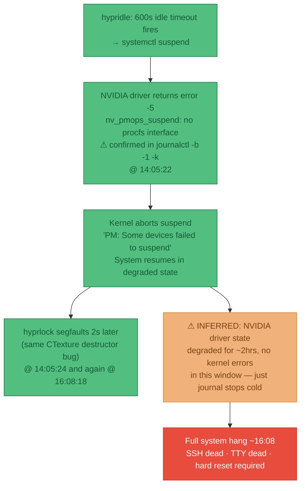

!!! note "What's confirmed vs inferred"
    **Confirmed** (exact kernel log lines): the suspend failure at 14:05:22, the NVIDIA error -5, the `PM: Some devices failed to suspend` message, both hyprlock segfaults.

    **Inferred** (no direct log evidence): that the corrupted NVIDIA driver state from the failed suspend caused the final hang 2hrs later. The journal stops cold at ~16:08 with no kernel panic, no OOM, no explicit NVIDIA error — which is consistent with a driver-level deadlock, but can't be proved from logs alone.

### ELI5 — `systemctl suspend` vs `hyprlock`

These are completely different things that happen to both be triggered by `hypridle`:

| | `hyprlock` | `systemctl suspend` |
|---|---|---|
| **What it does** | Draws a lock screen overlay on top of the desktop | Puts the whole machine into a low-power sleep state |
| **Machine state** | Fully running — CPU running, network up, SSH works | Everything off except RAM — CPU stopped, network dead, SSH impossible |
| **How to wake** | Type your password | Press a key or power button |
| **NVIDIA involved?** | Yes, renders the lock screen via GPU | Yes, GPU must be saved/restored — this is where it broke |
| **Safe with broken power mgmt?** | ✅ Yes | ❌ No |

The lock screen and the suspend are independent actions. You can have one without the other. The crash was from `suspend`, not from `lock`.

### Fixes applied

| Fix | File | Needs rebuild? |
|-----|------|---------------|
| Removed `NVreg_PreserveVideoMemoryAllocations=1` from kernel params | `hosts/desktop-work/configuration.nix` | ✅ Yes |
| Removed `systemctl suspend` from hypridle | `configs/hypr/hypridle.conf` | No — live |
| Added `hardware.nvidia.nvidiaPersistenced = true` | `hosts/desktop-work/configuration.nix` | ✅ Yes |
| `docker.service.after = ["multi-user.target"]` | `modules/nixos-base.nix` | ✅ Yes |
| `postgresql.target.after = ["multi-user.target"]` | `modules/nixos-extended-desktop.nix` | ✅ Yes |
| Magic SysRq enabled (`kernel.sysrq = 1`) | `modules/nixos-base.nix` | ✅ Yes |

!!! tip "Live workaround until rebuild"
    ```bash
    systemctl --user stop hypridle    # prevent any further suspend attempts
    sudo nvidia-smi -pm 1             # persistence mode for this session
    ```

### How the root cause was found

The diagnostic process — in order:

1. **`journalctl -b -1 -k`** — scanned previous boot's kernel messages for `nvidia|drm|hang|oom|mce`. Found the explicit NVIDIA suspend failure at 14:05:22 with exact error text.

2. **Correlated the timeline** — boot started 10:54, failure at 14:05 = 3hr 11min into the session. `hypridle.conf` had `timeout = 600` (10 min) → `systemctl suspend`. A machine sitting idle for 10 min at some point in a 3-hour session is entirely plausible.

3. **Cross-referenced the NixOS config** — NVIDIA's own error message (`PreserveVideoMemoryAllocations module parameter is set. System Power Management attempted without driver procfs suspend interface`) directly names the conflict. Found the matching contradicting lines in `configuration.nix`.

4. **Explained the 2-hour gap** — the hard part. Between 14:05 and ~16:08 the kernel logged nothing alarming. The system appeared to function. The link between the failed suspend and the final hang is an inference based on: (a) failed suspend is a known cause of NVIDIA driver state corruption, (b) no other cause visible in the logs, (c) the journal stopping cold (not a clean shutdown, not a kernel panic with a message) is consistent with a driver-level deadlock rather than a software crash.

---

### NixOS user service: dead symlink pattern

**Symptom:** service has journal history but `systemctl --user cat <name>` says `No files found`, and the journal says `Failed to open /home/joelyboy/.config/systemd/user/<name>.service`.

**What it means:** a dead symlink in `~/.config/systemd/user/` is shadowing the live NixOS-managed copy in `/etc/systemd/user/`. Systemd finds the user-local symlink first, follows it to a dead nix store path, fails.

**Diagnostic chain:**

```bash
# 1. untruncate the journal to see the full path
journalctl --user -u <name> --no-pager -l | head -5

# 2. check what's in the user systemd dir
ls -la ~/.config/systemd/user/

# 3. follow the symlink — does the target exist?
ls $(readlink ~/.config/systemd/user/<name>.service)   # "No such file" = dead

# 4. confirm NixOS has the live copy
ls /etc/systemd/user/ | grep <name>
```

**Fix:**

```bash
rm ~/.config/systemd/user/<name>.service
rm ~/.config/systemd/user/*.wants/<name>.service 2>/dev/null
systemctl --user daemon-reload
systemctl --user start <name>
```

!!! note "NixOS rule of thumb"
    `~/.config/systemd/user/` should be empty unless you deliberately put something there. NixOS-managed user services live in `/etc/systemd/user/`. If a service is defined via `systemd.user.services` in your NixOS config, never run `systemctl --user enable` on it — that creates user-local symlinks that go stale after rebuilds.

---

## 2026-06-09 — Second overnight hang + hyprlock → swaylock

!!! abstract "TL;DR"
    The machine hung again overnight (Jun 8 ~21:xx → Jun 9 08:27). Same root cause as the Jun 8 hang — `NVreg_PreserveVideoMemoryAllocations=1` + `systemctl suspend`. Both fixes from the previous session had been applied to config files, but **neither was actually running**: the NixOS rebuild wasn't done, and the hypridle config edit raced the process start and lost.

    Separately: hyprlock crashes with SIGSEGV on every exit. Not dangerous (crash is after unlock, on cleanup), but replaced with swaylock as a stopgap.

---

### Issue 1 — NVreg still in kernel (NixOS rebuild not run)

**Found in:** `journalctl -b -1 -k` kernel cmdline at boot

**Evidence:**
```
kernel: Command line: ...init=/nix/store/qx73nqij...-nixos-system-desktop-work-26.05.20260603.6b31628/init
        nvidia.NVreg_PreserveVideoMemoryAllocations=1 root=fstab...
```
vs current (boot 0):
```
kernel: Command line: ...init=/nix/store/hwdn9q4v...-nixos-system-desktop-work-26.05.20260603.6b31628/init
        root=fstab...
```
Same nixpkgs version label, different store hashes → same nixpkgs commit, different config. The NVreg removal was written to `configuration.nix` but `nixos-rebuild switch` was never run in the previous session.

**Inference:** NVreg active + `powerManagement.enable=false` = suspend fails with error -5, driver corrupts, hang follows.

**Fix:** `sudo nixos-rebuild switch` — confirmed resolved in current boot (NVreg absent from cmdline).

**Why it didn't protect boot -1:** The user rebooted at 16:11 and GRUB booted the previous generation. The new generation only took effect when the rebuild was explicitly run and the system rebooted into it.

---

### Issue 2 — hypridle 600s suspend still loaded (config edit raced process start)

**Found in:** `journalctl -b -1 | grep hypridle`

**Evidence:**
```
Jun 08 16:20:55 hypridle[2410]: [LOG] Registered timeout rule for 600s:
Jun 08 16:20:55 hypridle[2410]:       on-timeout: systemctl suspend
```
And from `stat configs/hypr/hypridle.conf`:
```
Modify: 2026-06-08 16:24:35
```

**Inference:** hypridle started at 16:20:55 and read the old config from disk. The config edit was saved at 16:24:35 — **4 minutes late**. hypridle reads config once at startup and has no hot-reload. The suspend rule was live in memory for the entire session.

**Fix:** Suspend listener removed from `configs/hypr/hypridle.conf`. Confirmed: current boot registers only the 300s → `swaylock` rule.

**Why it didn't protect boot -1:** The file write lost the race. The edit was made during the previous session but only saved after hypridle had already started in the new boot. Rule: after editing `hypridle.conf`, always `pkill hypridle` to force a config reload.

---

### Issue 3 — Inhibit lock delayed but didn't prevent

**Found in:** `journalctl -b -1 | grep hypridle`

**Evidence:**
```
Jun 08 19:25:48 hypridle[2410]: [LOG] Idled: rule 5c5a9d7b4e98
Jun 08 19:25:48 hypridle[2410]: [LOG] Ignoring from onIdled(), inhibit locks: 1
```
Last journal entry overall:
```
Jun 08 20:21:37 mullvad-daemon: WARN netlink_packet_route...  [then: silence]
```

**Inference:** At 19:25 the 600s timer fired but was blocked by a Wayland idle-inhibit lock from an open application. Once that app closed (unknown time after 20:21), the timer restarted. After 600s → `systemctl suspend` → NVIDIA error -5 → full hang. Journal writes stopped, SSH died, no further entries until the next boot at 08:27.

**No direct fix for this** — the inhibit lock was correct app behaviour. The actual fix is removing suspend from hypridle entirely, which makes the inhibit lock irrelevant.

!!! warning "Lesson: config file edits don't restart running processes"
    Two separate timing failures caused this crash. Whenever a dotfile change needs to take effect immediately:

    | Process | How to reload |
    |---------|--------------|
    | hypridle | `pkill hypridle` (systemd will restart it) |
    | waybar | `pkill waybar && waybar &` |
    | NixOS config | `sudo nixos-rebuild switch` then verify GRUB booted the new generation via `cat /proc/cmdline` |

---

### hyprlock SIGSEGV — crash on exit, not during lock

**Found in:** `coredumpctl list` + `coredumpctl info <PID>`

**Evidence (7 crashes, identical backtrace every time):**
```
#1  CTexture::~CTexture()
#2  CAtomicSharedPointer<CTexture>::_delete()
#3  ~unordered_map<uint64, SPreloadedTexture>    ← preloaded texture cache teardown
#5  CUniquePointer<CAsyncResourceManager>::~CUniquePointer()
#8  CHyprlock::run()    ← returns normally first
#9  main
```

**Inference:** Use-after-free in `CAsyncResourceManager` destructor. The texture cache is destroyed after the OpenGL/Wayland context is already gone, so GL objects it tries to free no longer exist → SEGV. Crash is in cleanup code that runs **after** `run()` returns — meaning the lock screen works correctly (lock, authenticate, unlock) and only crashes silently on process exit.

**This is NOT causing system hangs.** Crashes present since at least Jun 8 09:57 across sessions that ran for hours without issue. A userspace process segfaulting in GL cleanup cannot corrupt the NVIDIA kernel driver. Impact: ~1.8MB coredump generated per lock cycle.

**Status:** No fix in hyprlock 0.9.5 (current latest). No newer version to upgrade to.

---

### Lock screen: hyprlock → swaylock (temporary)

**Changes applied:**

| File | Change |
|------|--------|
| `modules/nixos-core-desktop.nix` | Removed `programs.hyprlock.enable`, added `pkgs.swaylock` + `security.pam.services.swaylock = {}` |
| `configs/swaylock/config` | Created — TokyoNight colours, wallpaper background, ring indicator |
| `configs/swaylock/wallpaper.jpeg` | Lock screen background (1680×1050) |
| `configs/hypr/hypridle.conf` | `hyprlock` → `swaylock -f` |
| `configs/hypr/hyprland.lua:221` | `CTRL+ALT+L` bind updated |
| `install.conf.yaml` | Added swaylock symlinks, removed copyq entry |

!!! note "PAM is required for swaylock"
    `security.pam.services.swaylock = {}` is not optional. Without it swaylock starts but the password ring spins forever — PAM has no entry for swaylock so authentication always fails silently.

!!! tip "Return to hyprlock when patched"
    hyprlock has a better display (blurred background, clock, animated indicator) and is the actively developed tool for this stack. The CTexture destructor bug is the only blocker. When a fix lands in nixpkgs, swap back:

    - `nixos-core-desktop.nix`: replace `pkgs.swaylock` + PAM entry with `programs.hyprlock.enable = true`
    - `configs/hypr/hypridle.conf`: `swaylock -f` → `hyprlock`
    - `configs/hypr/hyprland.lua:221`: `swaylock -f` → `hyprlock`
