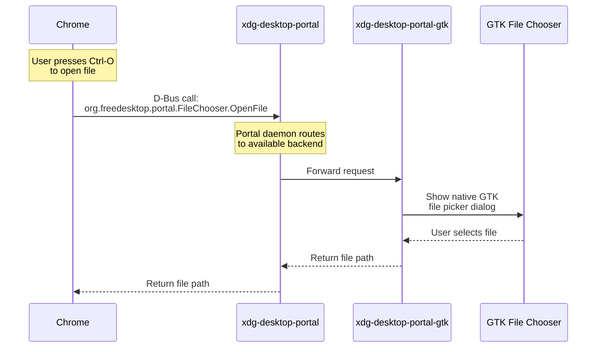
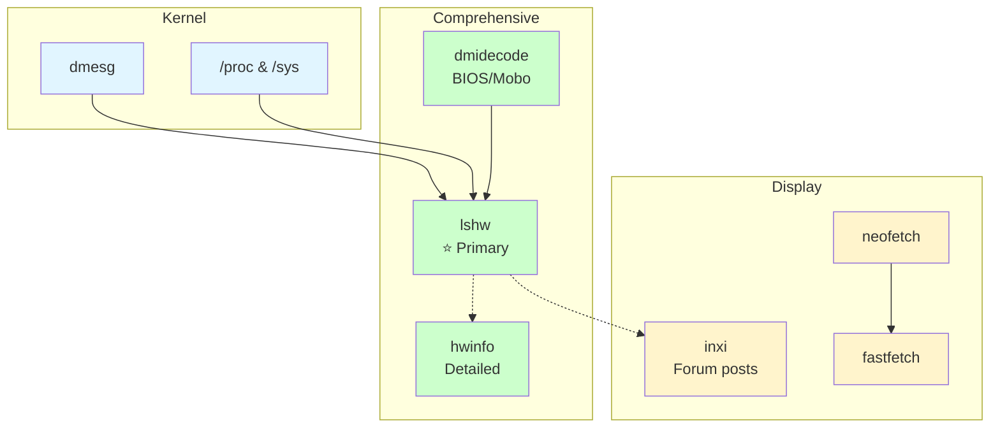
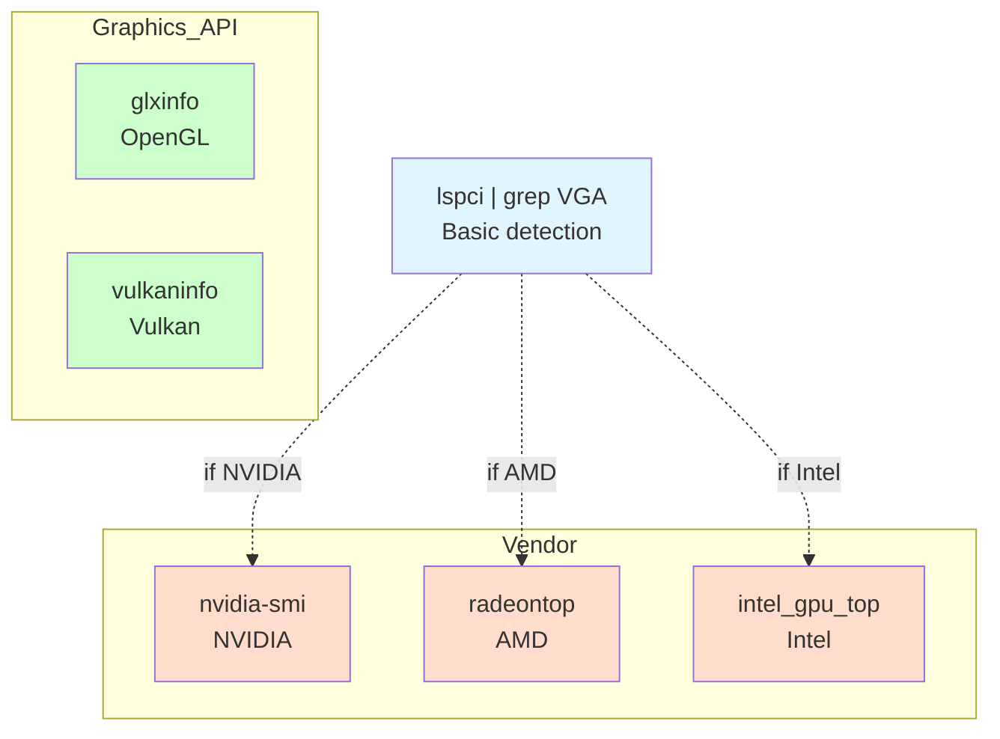
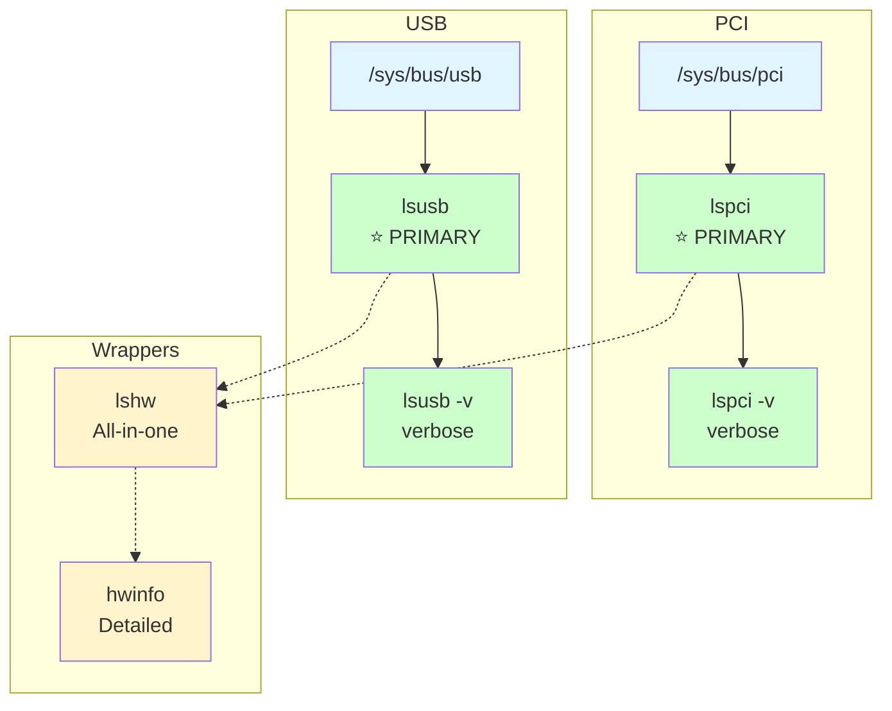
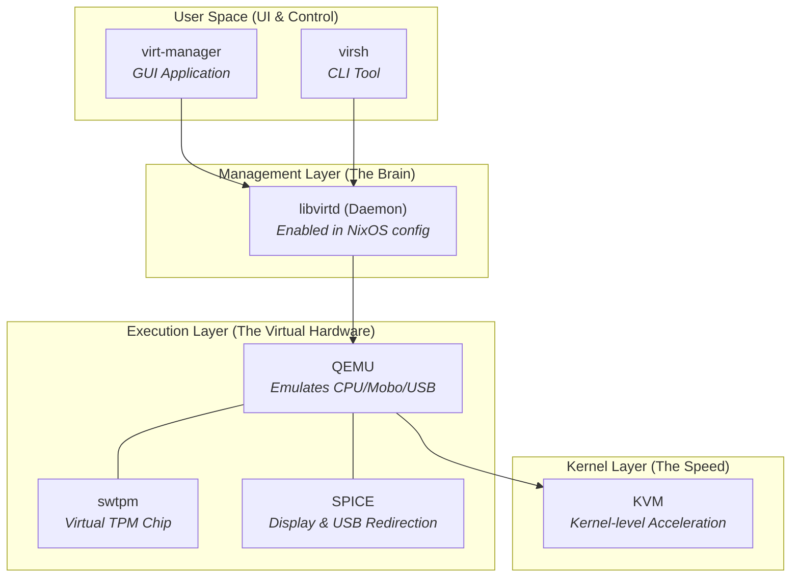

### DBus (Interacting with system services)

DBus is a message bus system that allows applications to talk to one another. You can interact with it using `busctl`.

**1. List available services on the user bus**
```bash
busctl --user list | head -n 5
# NAME                                PID PROCESS
# :1.0                               2111 systemd
# :1.1                               2124 .agent-wrapped
# org.freedesktop.Notifications      2345 dunst
```

**2. Introspect a service (see methods/properties)**
```bash
busctl --user introspect org.freedesktop.Notifications /org/freedesktop/Notifications
# NAME                          TYPE      SIGNATURE RESULT/VALUE
# .Notify                       method    susssasa{sv}i u
# .Dnd                          property  b         false
```

**3. Call a method (Send a notification)**
```bash
# Note: Single quotes are CRITICAL for ZSH users (signature AND strings with '!')
busctl --user call org.freedesktop.Notifications /org/freedesktop/Notifications \
  org.freedesktop.Notifications Notify 'susssasa{sv}i' \
  "Gemini-CLI" 0 "dialog-information" "Hello" 'Sent via DBus!' 0 0 5000
# u 1 (returns the notification ID)
```

**4. Get a property**
```bash
busctl --user get-property org.freedesktop.Notifications /org/freedesktop/Notifications \
  org.freedesktop.Notifications Dnd
# b false
```

---

### DBus Concepts & Troubleshooting

**1. ZSH Issue: Quotes & Expansion**
- **The Signature**: `{sv}` is interpreted as brace expansion. You **must** use single quotes: `'susssasa{sv}i'`.
- **The Message**: `!` inside double quotes triggers history expansion in interactive ZSH. Use single quotes: `'Sent via DBus!'`.

```bash
# BAD (ZSH tries to expand {sv} and !)
busctl ... Notify susssasa{sv}i ... "Hello!"

# GOOD
busctl ... Notify 'susssasa{sv}i' ... 'Hello!'
```

**2. The Hierarchy: Service vs Object vs Interface**
It helps to think of it like an Object-Oriented generic URL:
`Service` -> `Object` -> `Interface` -> `Method`

| Term | Analogy | Example |
| :--- | :--- | :--- |
| **Service** | The **Domain Name** (DNS) | `org.freedesktop.Notifications` |
| **Object Path** | The **File Path** (URL path) | `/org/freedesktop/Notifications` |
| **Interface** | The **Class Type** (Java/C#) | `org.freedesktop.Notifications` |
| **Method** | The **Function** | `Notify(...)` |

**3. "Are you guessing the path?"**
No. While they often match the service name (replacing `.` with `/`), they don't have to. You find them using `tree`:
```bash
busctl --user tree org.freedesktop.Notifications
# └─ /org
#   └─ /org/freedesktop
#     └─ /org/freedesktop/Notifications  <-- The Object Path
```

**4. "Is that a socket path?"**
No. It looks like a file path, but it is a **logical name** used purely within DBus to organize objects inside a service. It does not exist on your hard drive.

Pretty cool i can see the notify method in dbus directly here!
```
➜ jollof dev-setup (main) ✗ busctl --user introspect org.freedesktop.Notifications /org/freedesktop/Notifications | grep -i notify
.Notify                             method    susssasa{sv}i u            -
➜ jollof dev-setup (main) ✗
```

---

### Systemd Learning
#### 1. Visibility of units
When running `systemctl --user status`, it defaults to showing the **active service tree** (specifically `default.target`).
- **Sockets** often sit quietly in the background waiting for a connection. Unless they are actively processing something or triggered an error, they might not show up in the main status tree.
- To see sockets specifically: `systemctl --user list-sockets` (this shows what ports/files systemd is listening on).
- To see *everything* systemd knows about (loaded units): `systemctl --user list-units`

#### 2. The `@` symbol (Template Units)
The `@` symbol denotes a **Template Unit**.
- **Normal Unit:** `my-service.service` -> One config, one instance.
- **Template Unit:** `my-socket@.service` -> One config, **many** possible instances.

When you have `Accept=yes` in a socket file (`my-socket.socket`), systemd does this magic:
1. It listens on port 8888.
2. Connection comes in from IP `1.2.3.4`.
3. Systemd looks for a service named `my-socket@.service`.
4. It instantiates it as `my-socket@0-127.0.0.1:8888-1.2.3.4:5678.service` (or similar unique ID).
5. It runs that specific instance for that specific connection.

This is how SSH works (`sshd@.service`) handling multiple users at once!

#### 3. What is a "Unit"?
A **Unit** is just the generic object name for "thing systemd manages".
Everything in systemd is a unit. The suffix tells you what *type* of unit it is:
- `.service`: A process/script (The Worker)
- `.socket`: A network port/file (The Phone Line)
- `.timer`: A schedule (The Alarm Clock)
- `.target`: A group of other units (like "Multi-User Mode" or "Graphical Mode")
- `.mount`: A filesystem mount point

They link together via dependencies:
- **Timer** `Wants` -> **Service** (starts it when time is up)
- **Socket** `Activates` -> **Service** (starts it when call comes in)
- **Target** `Wants` -> **Services** (starts bunch of them at boot)

#### Jollof notes
Ok (above is gemini)

So if i enabled the `my-socket.socket` and then I've opened 2 zshs with this
```zsh
➜ jollof dev-setup (main) ✗ nc localhost 8888
Hello from Systemd Socket! Type something and press Enter:
asdf
asdf
```

then I can see below
```
➜ jollof dev-setup (main) ✗ systemctl --user list-sockets
LISTEN                                        UNIT                     ACTIVATES
[::]:8888                                     my-socket.socket         my-socket@2-12289-::1:8888-::1:36326.service
                                                                       my-socket@1-8193-::1:8888-::1:60746.service
/run/user/1000/bus                            dbus.socket              dbus.service
/run/user/1000/gnupg/S.gpg-agent              gpg-agent.socket         gpg-agent.service
/run/user/1000/pipewire-0                     pipewire.socket          pipewire.service
/run/user/1000/pipewire-0-manager             pipewire.socket          pipewire.service
/run/user/1000/pulse/native                   pipewire-pulse.socket    pipewire-pulse.service
/run/user/1000/speech-dispatcher/speechd.sock speech-dispatcher.socket speech-dispatcher.service

7 sockets listed.
Pass --all to see loaded but inactive sockets, too.
➜ jollof dev-setup (main) ✗
```
My socket has 2 connections! It's activated the template and I can see `my-socket@1....` and `my-socket@2`

---

### Systemd Naming & Implicit Links
- **Implicit by Name (Magic Naming)**: By default, `my-name.socket` activates `my-name.service` (or `my-name@.service` if `Accept=yes`).
- **Explicit Override**: Use `Service=other-service.service` in the `[Socket]` section to break the naming convention and trigger a different unit.

#### Accept=yes vs Accept=no
- **Accept=yes**: Systemd accepts the connection itself and spawns a **new instance** of the template service (`@.service`) for *each* incoming connection. This is how SSH handles multiple simultaneous users.
- **Accept=no (Default)**: Systemd passes the *listening* socket to a single service instance. The service is responsible for calling `accept()` (like a web server or database).

---

### Systemd Hierarchy: Slices, Scopes, and Services

**The Concept:**
Think of it like a file system for processes.
*   **Cgroups (Control Groups):** The actual directories in the kernel that track processes.
*   **Slices (`.slice`):** The "folders". They organize things hierarchically and control resources (e.g., "System gets 80% CPU, User gets 20%").
*   **Services (`.service`) & Scopes (`.scope`):** The "files". These contain the actual running processes.

**The Tree:**
1. **Root (`-.slice`)**: The top of the tree.
2. **`user.slice`**: Holds all user sessions.
3. **`user-1000.slice`**: Your specific user (UID 1000).
4. **`user@1000.service`**: The systemd manager instance for *you*.
    *   **`app.slice`**: Applications started by the GUI or systemd (like `firefox`, `my-socket`).
    *   **`session.slice`**: Core session stuff (like `dbus`, `pipewire`).

**Interactive Commands:**

1. **Visualize the Tree:**
    `systemd-cgls`
    *Shows the entire hierarchy recursively.*

2. **Monitor Resources (The "Top" for Cgroups):**
    `systemd-cgtop`
    *Shows CPU/Memory usage per Slice/Service.*

3. **Inspect Your User Tree:**
    `systemctl --user status`
    *Shows what your specific systemd instance is managing right now.*

4. **Creating a Temporary Scope (Fun Test):**
    Run a command in a specific slice to limit its resources.
    `systemd-run --user --scope -p MemoryMax=10M --unit=my-test bash`
    *(This starts a bash shell that systemd kills if it uses >10MB RAM).*

---

### Revisiting `lsof`
So gemini came up with this, using `lsof` to listen to open files to find processes that are listening and finding ports. Context is i wanted to find the port that `sabnzbd` was listening on!
```bash
➜ jollof dev-setup (main) ✗ sudo lsof -i -P -n -c sabnzbd | grep -i listen
lsof: WARNING: can't stat() fuse.gvfsd-fuse file system /run/user/1002/gvfs
      Output information may be incomplete.
lsof: WARNING: can't stat() fuse.portal file system /run/user/1002/doc
      Output information may be incomplete.
systemd        1            root 729u  IPv4  17381      0t0  TCP 127.0.0.1:631 (LISTEN)
sshd      138238            root   6u  IPv4 246743      0t0  TCP *:22 (LISTEN)
sshd      138238            root   7u  IPv6 246745      0t0  TCP *:22 (LISTEN)
systemd-r 138246 systemd-resolve  12u  IPv4 264651      0t0  TCP *:5355 (LISTEN)
systemd-r 138246 systemd-resolve  14u  IPv6 264659      0t0  TCP *:5355 (LISTEN)
systemd-r 138246 systemd-resolve  23u  IPv4 264667      0t0  TCP 127.0.0.53:53 (LISTEN)
systemd-r 138246 systemd-resolve  25u  IPv4 264669      0t0  TCP 127.0.0.54:53 (LISTEN)
.postgres 138341        postgres   6u  IPv6 270343      0t0  TCP [::1]:5432 (LISTEN)
.postgres 138341        postgres   7u  IPv4 270344      0t0  TCP 127.0.0.1:5432 (LISTEN)
syncthing 138406          jollof  13u  IPv6 270360      0t0  TCP *:22000 (LISTEN)
syncthing 138406          jollof  29u  IPv4 267453      0t0  TCP 127.0.0.1:8384 (LISTEN)
Prowlarr  180815        prowlarr 340u  IPv6 407811      0t0  TCP *:9696 (LISTEN)
Radarr    180819          radarr 359u  IPv6 396267      0t0  TCP *:7878 (LISTEN)
Sonarr    180822          sonarr 366u  IPv6 405579      0t0  TCP *:8989 (LISTEN)
nzbget    180836          nzbget   3u  IPv4 389849      0t0  TCP *:6789 (LISTEN)
python3.1 180925         sabnzbd   7u  IPv4 403487      0t0  TCP 127.0.0.1:8080 (LISTEN)
markdown- 192067          jollof  25u  IPv4 448020      0t0  TCP *:8336 (LISTEN)
➜ jollof dev-setup (main) ✗
```

Can see above its 8080

---

### Bash piping args
Well I'm finally getting round to trying to get my head round `-s` and `--` in bash!

So.... `-s` is to take commands from stdinput. so with piping, can see without this it expects a file
```bash
➜ joelyboy ~ bash echo hi /run/current-system/sw/bin/echo: /run/current-system/sw/bin/echo: cannot execute binary file
➜ joelyboy ~
```
ahhhh, not this didn't work as `-s` expects from STDIN but i passed them as arguments! so it just opens a shell
```bash
➜ joelyboy ~ bash -s echo hi

[joelyboy@desktop-work:~]$ ^C
```

here is a proper working example:
```bash
➜ joelyboy ~ echo 'echo hi' | bash -s
hi
➜ joelyboy ~
```

Now, as we know in bash double quotations "" expand args, so below will try to expand `$1`, and find nothing!
```bash
➜ joelyboy ~ echo "echo Argument is: $1" | bash -s 'apples'
Argument is:
➜ joelyboy ~
```

Whereas this works! as `$1` is NOT expanded before piping
```bash
➜ joelyboy ~ echo 'echo Argument is $1' | bash -s 'apples'
Argument is apples
➜ joelyboy ~
```

So, interestingly then, by default `bash` takes first param as script path to run and then `$2`, `$3` etc as positional args to pass to the script.
I.e. `bash testie.sh 'hiya'` runs `testie.sh` with `$1` as 'hiya'

BUT, if `-s` is passed the first one from stdin is the script and then all args following are positionals to the script taken from stdin

Finally, when we see `--` it just means to not treat `-some_opt` stuff as options. Like this where `-apples` I guess bash thinks is an option (although interesting it didn't complain or throw an error)
```bash
➜ joelyboy ~ echo 'echo Argument is $1' | bash -s -apples
Argument is
➜ joelyboy ~ echo 'echo Argument is $1' | bash -s -- -apples
Argument is -apples
➜ joelyboy ~
```

---

### lsof & ss deep dive (socket files)

**lsof columns** ([man page](https://man7.org/linux/man-pages/man8/lsof.8.html)):

| Column | Meaning | Example |
|--------|---------|---------|
| COMMAND | Process name (truncated to 9 chars) | `dockerd`, `systemd` |
| PID | Process ID | `1879` |
| USER | Owner | `root` |
| FD | File Descriptor + mode suffix | `594u`, `3u` |
| TYPE | File type | `unix` (socket), `REG` (file), `DIR` |
| DEVICE | Device identifier (kernel address for sockets) | `0xffff8a6a933e3000` |
| SIZE/OFF | Size or offset | `0t0` (0 offset) |
| NODE | Inode number | `13739` |
| NAME | File path + socket info | `/run/docker.sock type=STREAM` |

**FD suffixes** ([docs](https://man7.org/linux/man-pages/man8/lsof.8.html#OUTPUT)):
- `u` = read+write
- `r` = read only
- `w` = write only
- `cwd` = current working dir
- `txt` = program text (code)
- `mem` = memory-mapped file

**COMMAND column**: Yes, `systemd` means the process named "systemd" (PID 1, the init system). It holds the socket FD because systemd created it via socket activation.

---

**ss columns** ([man page](https://man7.org/linux/man-pages/man8/ss.8.html)):

```
u_str LISTEN 0 4096 /run/docker.sock 13739 * 0 users:(("dockerd",pid=1879,fd=3))
```

| Field | Meaning |
|-------|---------|
| `u_str` | Unix stream socket (`u_dgr` = datagram, `u_seq` = seqpacket) |
| `LISTEN` | Socket state |
| `0` | Recv-Q (queued bytes) |
| `4096` | Send-Q (backlog for LISTEN) |
| `/run/docker.sock` | Local address (path) |
| `13739` | Inode |
| `*` | Peer address (none for LISTEN) |
| `0` | Peer port/inode |

**users field**: `users:(("dockerd",pid=1879,fd=3),("systemd",pid=1,fd=595))`
- List of processes with this socket open
- Format: `("command",pid=PID,fd=FD_NUMBER)`
- Multiple entries = multiple processes sharing the socket (socket activation)

**Why 2 entries for docker.sock?**
Systemd creates the socket (socket activation), then passes FDs to dockerd. Both hold references.

Docs:
- lsof: https://man7.org/linux/man-pages/man8/lsof.8.html
- ss: https://man7.org/linux/man-pages/man8/ss.8.html

---

### xdg-open over SSH (socat forwarding)

**The complete flow (step by step)**

1. **Local machine**: systemd starts `open-forward.service` on login
   - Runs: `socat UNIX-LISTEN:/tmp/open-forward.sock,fork EXEC:"xargs xdg-open"`
   - Creates socket at `/tmp/open-forward.sock`, waiting for connections

2. **You SSH to remote**: `ssh user@remote`
   - SSH reads `~/.ssh/config`, sees `RemoteForward /tmp/open-forward-%r.sock /tmp/open-forward.sock`
   - `%r` expands to remote username (e.g., `joel`)
   - SSH creates `/tmp/open-forward-joel.sock` on remote, tunneled back to local socket

3. **On remote**: something calls `xdg-open https://example.com`
   - Shell finds `~/.local/bin/xdg-open` first (due to PATH ordering)
   - Our wrapper script runs instead of system xdg-open

4. **Wrapper script checks**: `[ -S "/tmp/open-forward-$USER.sock" ]`
   - Socket exists? → forward the URL through it
   - No socket? → fallback to system `/run/current-system/sw/bin/xdg-open`

5. **URL flows through tunnel**:
   - `printf '%s' "https://example.com" | socat - UNIX-CONNECT:/tmp/open-forward-joel.sock`
   - Data goes: remote socket → SSH tunnel → local socket

6. **Local socat receives URL**:
   - Pipes it to `xargs xdg-open`
   - Your local browser opens the URL

**SSH config tokens**

When you run `ssh joel@remote-server`:
- `%r` = `joel` (remote username - who you're logging in AS)
- `%u` = your local username (on machine running ssh)
- `%h` = `remote-server` (remote hostname)

Since RemoteForward creates the socket on the REMOTE machine, `%r` matches `$USER` there.

**Concrete example: which socket name is used where?**

Setup:
- Machine A (local laptop): logged in as `joelyboy`
- Machine B (remote server): will SSH in as `test-user`

```
MACHINE A (local)                        MACHINE B (remote)
logged in as: joelyboy                   logging in as: test-user

~/.ssh/config says:
RemoteForward /tmp/open-forward-%r.sock /tmp/open-forward.sock
                      │                         │
                      │                         └── local socket (on A)
                      └── remote socket (on B), %r = test-user

So when you run: ssh test-user@machineB

MACHINE A                                MACHINE B
─────────                                ─────────
systemd runs socat listening on:         SSH creates socket at:
/tmp/open-forward.sock                   /tmp/open-forward-test-user.sock
        ▲                                        │
        │         SSH TUNNEL                     │
        └────────────────────────────────────────┘

On Machine B, xdg-open wrapper checks:
SOCK="/tmp/open-forward-${USER}.sock"
     = /tmp/open-forward-test-user.sock  ← matches!
```

**Why the username matters (multi-user scenario)**

```
Machine B has two users SSHing in simultaneously:

User 1: alice@machineA  →  ssh test-user@machineB
User 2: bob@machineA    →  ssh admin@machineB

Without username suffix (both use /tmp/open-forward.sock):
  - alice connects first, creates socket
  - bob connects, StreamLocalBindUnlink DELETES alice's socket
  - alice's forwarding breaks!

With username suffix:
  - alice → /tmp/open-forward-test-user.sock
  - bob   → /tmp/open-forward-admin.sock
  - both work independently
```

**socat basics**

`socat` creates a bidirectional channel between two "addresses". Syntax: `socat ADDRESS1 ADDRESS2`

Common address types:
- `UNIX-LISTEN:/path` - Create a listening Unix socket at path
- `UNIX-CONNECT:/path` - Connect to existing Unix socket
- `-` - stdin/stdout
- `EXEC:"command"` - Execute command, pipe data to it

**Testing locally (no SSH needed)**

Terminal 1 - start listener:
```sh
socat UNIX-LISTEN:/tmp/test-open.sock,fork EXEC:"xargs xdg-open"
```

Terminal 2 - send URL:
```sh
echo "https://example.com" | socat - UNIX-CONNECT:/tmp/test-open.sock
# Browser should open!
```

**Inspecting sockets**

```sh
ss -xl | grep open-forward  # -x for unix, -l for listening
ls -la /tmp/open-forward.sock  # it's just a file (type 's' for socket)
```

**Architecture diagram**

```
[LOCAL MACHINE]                              [REMOTE MACHINE]

1. systemd starts socat                      3. something calls xdg-open URL
        │                                            │
        ▼                                            ▼
   socat listening on                        4. ~/.local/bin/xdg-open (wrapper)
   /tmp/open-forward.sock                           │
        ▲                                           ▼
        │                                    5. socket exists? yes
        │                                           │
        │         SSH TUNNEL                        ▼
        │    ◄─────────────────────────     6. socat sends URL to socket
        │    RemoteForward                   /tmp/open-forward-$USER.sock
        │
        ▼
7. socat receives URL
        │
        ▼
   EXEC:"xargs xdg-open"
        │
        ▼
8. LOCAL browser opens!
```

---

### Disk space cheat sheet

| Command | What it shows | Notes |
| :--- | :--- | :--- |
| `df -H` | All mounted filesystems with size/used/avail | Overview of disk usage per mount |
| `lsblk -f` | Tree of disks, partitions, fstype, label, mountpoint | Good quick overview of block devices |
| `du -sh <folder>` | Total size of a specific folder | e.g. `du -sh /home` or `du -sh /nix/store` |
| `sudo parted -l` | All disks and partitions | Does NOT show free space |
| `sudo parted /dev/xxx print free` | Partitions + free gaps on a specific disk | Only way to see unallocated space in parted |
| `sudo cfdisk /dev/xxx` | TUI partition viewer with visual blocks + free space | Nice for a quick visual, quit without saving to just view |
| `gdu` / `ncdu` | Interactive TUI drill-down into disk usage | Like a fancy `du` |
| `duf` | Pretty colorized `df` replacement with bars |  |

To list all block devices (the `/dev/xxx` names for cfdisk/parted):
```bash
lsblk
```

**Why `nix-tree` shows 30GB but `/nix/store` is 122GB:**
`nix-tree` only shows the **closure** of the current system profile — the set of packages reachable from this generation. `/nix/store` also contains old generations, cached build deps, devenv shells, and anything not yet garbage collected. Run `sudo nix-collect-garbage -d` to prune old generations (careful: removes rollback ability).

**Does the math add up? (March 2026)**
```
/home          =  94 GB
/nix/store     = 122 GB
swap file      =  32 GB  (configured in nixos-base.nix)
/var + other   = ~49 GB  (postgres data, logs, docker leftovers, tmp, etc.)
               --------
total          ≈ 297 GB  ✓ (matches df -H)
```

---

## Partition Management
GUI tools seem to do a much better job of combining these together, in either `GParted` or `Gnome disks`

Here is a summary of how all the different various disk management tools I have seen online relate to each other

```
PARTITION MANAGEMENT:
┌─────────────────────────────────────────────────────────┐
│                                                         │
│  fdisk (1991) ──same tool──> cfdisk (1994)              │
│      │              │            │                      │
│      │              │            │ (menu interface)     │
│      │              │            │                      │
│      └──────────────┴────────────┘                      │
│                     │                                   │
│                     ↓ replaced by                       │
│                                                         │
│                parted (1999)                            │
│                (modern standard)                        │
│                                                         │
└─────────────────────────────────────────────────────────┘

FILESYSTEM LABEL TOOLS:
┌─────────────────────────────────────────────────────────┐
│                                                         │
│  e2label (ext2/3/4)           fatlabel (FAT16/32)       │
│  ntfslabel (NTFS)             exfatlabel (exFAT)        │
│  xfs_admin (XFS)              btrfs (btrfs)             │
│                                                         │
│                     ↓ unified by                        │
│                                                         │
│                udisksctl (2012)                         │
│             (modern unified tool)                       │
│                                                         │
└─────────────────────────────────────────────────────────┘

INFORMATION TOOLS (read-only):
┌─────────────────────────────────────────────────────────┐
│                                                         │
│  lsblk (2010)                 findmnt (2010)            │
│  (block devices)              (mount points)            │
│                                                         │
└─────────────────────────────────────────────────────────┘
```

Thus, for most operations a combination of
- `parted`
- `lsblk`

*should* be sufficient

---

## Filesystem labels vs Parition Names
I have noticed that the "name" quoted by `sudo parted -l` does NOT match what is mounted, or the "label" in `lsblk -f`.

This is because parted names are `partition names`, stored in the GPT partition table apparently, outside of the filesystem.

Filesystem labels are stored in the filesystem metadata apparently (i guess in a header somewhere in the partition), and is used by automounters.

An example below shows where `Ventoy` was automounted and picked up the correct label name. And the both name and label from `lsblk` vs just the name in `parted`.
```
❯sudo parted -l
Model: SanDisk Cruzer Blade (scsi)
Disk /dev/sda: 30.8GB
Sector size (logical/physical): 512B/512B
Partition Table: msdos
Disk Flags:

Number  Start   End     Size    Type     File system  Flags
 1      1049kB  30.8GB  30.7GB  primary               boot
 2      30.8GB  30.8GB  33.6MB  primary  fat16        esp


Model: ADATA SX8200PNP (nvme)
Disk /dev/nvme0n1: 256GB
Sector size (logical/physical): 512B/512B
Partition Table: gpt
Disk Flags:

Number  Start   End    Size   File system  Name  Flags
 1      17.4kB  256GB  256GB  ext4


Model: CT1000P3SSD8 (nvme)
Disk /dev/nvme1n1: 1000GB
Sector size (logical/physical): 512B/512B
Partition Table: gpt
Disk Flags:

Number  Start   End     Size    File system  Name                          Flags
 1      17.4kB  16.8MB  16.8MB               Microsoft reserved partition  msftres
 2      16.8MB  499GB   499GB   ntfs         Basic data partition          msftdata
 3      499GB   499GB   538MB   fat32        EFI System Partition          boot, esp
 4      499GB   894GB   395GB   ext4         LINUX-MINT
 6      894GB   999GB   105GB   ext4         root
 5      999GB   1000GB  524MB   fat32        JOL-WIN-BOOT                  boot, esp


❯lsblk -o NAME,PARTLABEL,LABEL,SIZE,TYPE,MOUNTPOINT
NAME        PARTLABEL                    LABEL        SIZE TYPE MOUNTPOINT
sda                                                  28.7G disk
├─sda1                                   Ventoy      28.6G part /media/joelyboy/Ventoy
└─sda2                                   VTOYEFI       32M part
nvme0n1                                             238.5G disk
└─nvme0n1p1                              SPARE-DISK 238.5G part
nvme1n1                                             931.5G disk
├─nvme1n1p1 Microsoft reserved partition               16M part
├─nvme1n1p2 Basic data partition         Windows    464.3G part /mnt/jollof-windows
├─nvme1n1p3 EFI System Partition                      513M part /boot/efi
├─nvme1n1p4 LINUX-MINT                                368G part /
├─nvme1n1p5 JOL-WIN-BOOT                              500M part
└─nvme1n1p6 root                                     97.7G part

joelyboy@MINTY-RDP in dev-setup on   main  15
❯
```

Thus, to see what parted gives as well (partition labels) thus command is useful:
```bash
lsblk -o NAME,PARTLABEL,LABEL,SIZE,TYPE,MOUNTPOINT
```
Or, to see the list of options (why this isnt in the MAN page i'll never know 🤦)
> lsblk --list-options

To change disk label is not unified unfortunately.

Shamelessly stole these commands [from here](https://askubuntu.com/questions/1103569/how-do-i-change-the-label-reported-by-lsblk)

for ext2/ext3/ext4 filesystems (most linux stuff) can use:
```
e2label /dev/XXX <label>
```

For fat (usb drives, boot partitions) can use:
```
fatlabel /dev/XXX <label> 
```

for exfat (you might need to install exfat-utils first):
```
exfatlabel /dev/XXX <label>
```

for ntfs (windows):
```
ntfslabel /dev/XXX <label>
```

---

## Mount points

Show file systems with mount points
```
lsblk -f
```

example output:
```
NAME        FSTYPE FSVER LABEL         UUID                                 FSAVAIL FSUSE% MOUNTPOINTS
nvme1n1
├─nvme1n1p1 vfat   FAT32 SYSTEM        BE05-F38D                             119.1M    53% /boot
├─nvme1n1p2
├─nvme1n1p3 ntfs         Windows       5466065066063372
├─nvme1n1p4 ntfs         WinRE         F88E06A38E065A90
└─nvme1n1p5 ntfs         RecoveryImage 7040088F40085DEA
nvme0n1
└─nvme0n1p1 ext4   1.0   NIXROOT       c82fdf13-7c80-4864-92ce-78c06d81043c  863.5G     3% /nix/store
                                                                                           /
```


Find mounts
```
findmnt
```

example output:
```
TARGET                  SOURCE                FSTYPE   OPTIONS
/                       /dev/disk/by-uuid/c82fdf13-7c80-4864-92ce-78c06d81043c
│                                             ext4     rw,relatime
├─/dev                  devtmpfs              devtmpfs rw,nosuid,size=1625640k,nr_inodes=4060220,mode=755
│ ├─/dev/pts            devpts                devpts   rw,nosuid,noexec,relatime,gid=3,mode=620,ptmxmode=
│ ├─/dev/shm            tmpfs                 tmpfs    rw,nosuid,nodev,size=16256392k
│ ├─/dev/hugepages      hugetlbfs             hugetlbf rw,nosuid,nodev,relatime,pagesize=2M
│ └─/dev/mqueue         mqueue                mqueue   rw,nosuid,nodev,noexec,relatime
├─/proc                 proc                  proc     rw,nosuid,nodev,noexec,relatime
├─/run                  tmpfs                 tmpfs    rw,nosuid,nodev,size=8128196k,mode=755
│ ├─/run/keys           ramfs                 ramfs    rw,nosuid,nodev,relatime,mode=750
│ ├─/run/wrappers       tmpfs                 tmpfs    rw,nodev,relatime,size=16256392k,mode=755
│ ├─/run/credentials/systemd-journald.service
│ │                     tmpfs                 tmpfs    ro,nosuid,nodev,noexec,relatime,nosymfollow,size=1
│ └─/run/user/1000      tmpfs                 tmpfs    rw,nosuid,nodev,relatime,size=3251276k,nr_inodes=8
│   └─/run/user/1000/doc
│                       portal                fuse.por rw,nosuid,nodev,relatime,user_id=1000,group_id=100
├─/sys                  sysfs                 sysfs    rw,nosuid,nodev,noexec,relatime
│ ├─/sys/kernel/security
│ │                     securityfs            security rw,nosuid,nodev,noexec,relatime
│ ├─/sys/fs/cgroup      cgroup2               cgroup2  rw,nosuid,nodev,noexec,relatime,nsdelegate,memory_
│ ├─/sys/fs/pstore      pstore                pstore   rw,nosuid,nodev,noexec,relatime
│ ├─/sys/firmware/efi/efivars
│ │                     efivarfs              efivarfs rw,nosuid,nodev,noexec,relatime
│ ├─/sys/fs/bpf         bpf                   bpf      rw,nosuid,nodev,noexec,relatime,mode=700
│ ├─/sys/kernel/tracing tracefs               tracefs  rw,nosuid,nodev,noexec,relatime
│ ├─/sys/kernel/debug   debugfs               debugfs  rw,nosuid,nodev,noexec,relatime
│ ├─/sys/kernel/config  configfs              configfs rw,nosuid,nodev,noexec,relatime
│ └─/sys/fs/fuse/connections
│                       fusectl               fusectl  rw,nosuid,nodev,noexec,relatime
├─/nix/store            /dev/disk/by-uuid/c82fdf13-7c80-4864-92ce-78c06d81043c[/nix/store]
│                                             ext4     ro,nosuid,nodev,relatime
└─/boot                 /dev/nvme1n1p1        vfat     rw,relatime,fmask=0022,dmask=0022,codepage=437,ioc

```

Note that above, `/nix/store` is shown to be mounted to the subdirectory `/nix/store/` of `/dev/disk/by-uuid/c82fdf13-7c80-4864-92ce-78c06d81043c`

This is NOT shown in `lsblk`!

---

## Loop Devices
I was getting confused between
- `loop device` (i.e. what snap uses), so can have some random file appeaing as if it was a drive (not sure why TBH)
- `loop partition table`, which is basically no partition table and a free for all, just a file partition (FAT32 etc)

| Aspect | Normal Mount | Loop Mount | Normal Partitions | Loop "Partition" |
|--------|-------------|------------|-------------------|------------------|
| **Source** | Block device | File | Multiple sections | Whole device |
| **Device** | `/dev/sda1` | `/dev/loop0` → file | `/dev/sda1`, `/dev/sda2` | `/dev/sda` |
| **Partition Table** | Uses GPT/MBR | N/A | Required (GPT/MBR) | None |
| **Use Case** | Regular storage | Apps, images | Multi-boot, organization | Simple storage |
| **Flexibility** | Direct access | Portable, secure | Multiple filesystems | Single filesystem |
| **Command Example** | `mount /dev/sda1 /mnt` | `mount -o loop file.img /mnt` | `parted /dev/sda print` | `parted: "Partition Table: loop"` |
| **Real Examples** | External HDD | Snap packages | Dual-boot systems | Formatted USB stick |

---

## Linux desktop theming
```
┌─────────────────────────────────────────────────────────────────────────────────────┐
│                              Linux Desktop Theming Stack                            │
└─────────────────────────────────────────────────────────────────────────────────────┘

┌─────────────────────┐                    ┌─────────────────────┐
│   GTK Applications  │                    │   Qt Applications   │
│  (GNOME, XFCE,      │                    │  (KDE, VLC, qBit-   │
│   Thunar, Firefox)  │                    │   torrent, etc)     │
└──────────┬──────────┘                    └──────────┬──────────┘
          │                                          │
          ▼                                          ▼
┌─────────────────────┐                    ┌─────────────────────┐
│    GTK Toolkit      │                    │    Qt Toolkit       │
│  • GTK2 (legacy)    │                    │  • Qt5 (current)    │
│  • GTK3 (current)   │                    │  • Qt6 (modern)     │
│  • GTK4 (modern)    │                    │  • Can mimic GTK    │
│                     │                    │    theme via        │
│                     │                    │    platformTheme    │
└─────────┬───────────┘                    └─────────┬───────────┘
         │                                          │
         ▼                                          ▼
┌─────────────────────────────────┐      ┌─────────────────────────────────┐
│      GTK Configuration          │      │      Qt Configuration           │
├─────────────────────────────────┤      ├─────────────────────────────────┤
│  GSettings → dconf              │      │  ~/.config/qt5ct/               │
│  (GNOME/GTK standard)           │      │  ~/.config/kdeglobals (KDE)     │
│  Binary database                │      │  QT_QPA_PLATFORMTHEME env var   │
└─────────────────────────────────┘      └─────────────────────────────────┘

┌─────────────────────────────────────────────────────────────────┐
│                     Configuration Tools                         │
├─────────────────────────────┬───────────────────────────────────┤
│         GTK Tools           │           Qt Tools                │
├─────────────────────────────┼───────────────────────────────────┤
│ • lxappearance (GUI)        │ • qt5ct/qt6ct (GUI)               │
│ • nwg-look (modern GUI)     │ • kvantum (theme engine)          │
│ • gsettings (CLI)           │ • kde-gtk-config (KDE→GTK sync)   │
│ • dconf-editor (GUI)        │                                   │
└─────────────────────────────┴───────────────────────────────────┘

┌───────────────────────────────────────────────────────────────┐
│                    Desktop Environments                       │
├──────────────┬──────────────┬──────────────┬──────────────────┤
│    GNOME     │     KDE      │     XFCE     │   Minimal WM     │
│ (GTK-based)  │  (Qt-based)  │ (GTK-based)  │ (Need tools      │
│ Uses dconf   │ Own system   │ Uses dconf   │  above)          │
└──────────────┴──────────────┴──────────────┴──────────────────┘

Note: "Qt can mimic GTK" means when you set QT_QPA_PLATFORMTHEME=gtk2,
Qt apps try to read GTK theme settings and match their appearance
```

---

## XDG Desktop Portals

Desktop portals provide a standardized way for sandboxed apps (Flatpak, browsers) to access system features like file choosers, screen sharing, and notifications without breaking sandbox security.



### How it works

1. **xdg-desktop-portal** (main daemon) - Routes portal requests to appropriate backends
2. **Portal backends** - Implement actual UI/functionality:
   - `xdg-desktop-portal-gtk` - GTK file choosers (lightweight)
   - `xdg-desktop-portal-kde` - Qt/KDE file choosers (feature-rich)
   - `xdg-desktop-portal-hyprland` - Hyprland-specific (screenshots, screensharing)

### Inspecting portal services

```bash
# Check running portal services (user services, not system!)
systemctl --user status xdg-desktop-portal.service
systemctl --user status xdg-desktop-portal-gtk.service

# List all portal services
systemctl --user list-units 'xdg-desktop-portal*'

# Watch portal activity in real-time
journalctl --user -u xdg-desktop-portal-gtk.service -f

# Check which backends are available
ls -la /run/current-system/sw/share/xdg-desktop-portal/portals/

# Monitor D-Bus portal calls
dbus-monitor --session "destination=org.freedesktop.portal.Desktop"
```

### Customizing portal backends

You can configure which backend handles which portal feature via config files:

```bash
# System-wide config
/etc/xdg-desktop-portal/hyprland-portals.conf

# User config (overrides system)
~/.config/xdg-desktop-portal/portals.conf
```

**Note:** Desktop portals expect GUI applications. TUI file managers like `yazi` cannot be used as portal backends because the portal spec requires graphical dialogs. However, you could theoretically write a custom portal backend that wraps yazi in a terminal window, but this would break many assumptions apps make about file pickers.

---

## Linux file permissions
No matter how many times i read about file permissions on linux: groups,id,read,write,execute etc i seem to forget the syntaxes.

So I write (another) diagram to help me remember

### Permission Bits Reference
```
Permission Bits: Read=4, Write=2, Execute=1

Each digit in chmod represents ONE entity:
┌────────────┬────────────┬────────────┐
│ 1st digit  │ 2nd digit  │ 3rd digit  │
│   OWNER    │   GROUP    │   OTHERS   │
│ (you)      │ (your grp) │ (everyone) │
└────────────┴────────────┴────────────┘

Breaking down 755:
┌─────┬─────┬─────┐
│  7  │  5  │  5  │
└──┬──┴──┬──┴──┬──┘
   │     │     │
   │     │     └─> Others: 5 = 4+0+1 = r-x (read + execute)
   │     └─────> Group:  5 = 4+0+1 = r-x (read + execute)
   └───────────> Owner:  7 = 4+2+1 = rwx (read + write + execute)

So 755 means:
- Owner (you):     rwx (can do everything)
- Group members:   r-x (can read and execute, NOT write)
- Others:          r-x (can read and execute, NOT write)

Each digit is calculated:
7 = 4(r) + 2(w) + 1(x) = rwx
6 = 4(r) + 2(w) + 0    = rw-
5 = 4(r) + 0    + 1(x) = r-x
4 = 4(r) + 0    + 0    = r--
3 = 0    + 2(w) + 1(x) = -wx
2 = 0    + 2(w) + 0    = -w-
1 = 0    + 0    + 1(x) = --x
0 = 0    + 0    + 0    = ---
```

### Examples with 007 (DON'T DO THIS!):
```
# Create a file with normal permissions
$ touch myfile.txt
$ ls -l myfile.txt
-rw-r--r-- 1 jollof users 0 Aug  3 10:00 myfile.txt

# Apply the bizarre 007 permission
$ chmod 007 myfile.txt
$ ls -l myfile.txt
-------rwx 1 jollof users 0 Aug  3 10:00 myfile.txt
        ↑
        └── Others have FULL access!

# Now YOU (the owner) can't even read your own file!
$ cat myfile.txt
cat: myfile.txt: Permission denied

# But a random user can do anything!
$ sudo -u randomuser cat myfile.txt  # Works!
$ sudo -u randomuser rm myfile.txt   # They can even delete it!
```

### More wacky examples:
```
070 = ---rwx---  (only group members have access)
707 = rwx---rwx  (owner and others yes, group no)
000 = ---------  (nobody can do anything)
111 = --x--x--x  (everyone can execute, but not read/write)
222 = -w--w--w-  (write-only for everyone - very weird!)
444 = r--r--r--  (read-only for everyone, even owner)
```

> For `000`, the root user (or any user with ID 0) can still access given it has special capabilities. See [capabilities](https://man7.org/linux/man-pages/man7/capabilities.7.html)

### Standard permissions you actually want:
```
755 = rwxr-xr-x  # Executables/directories
644 = rw-r--r--  # Regular files
600 = rw-------  # Private files (like SSH keys)
700 = rwx------  # Private executables/directories
664 = rw-rw-r--  # Group-writable files
775 = rwxrwxr-x  # Group-writable directories
```

---

## Id and Groups
Diagram of how the `/etc/passwd` file works

`/etc/passwd` defines the user, UID and GID whilst `/etc/group` defines how said users are part of different groups


### How /etc/passwd, /etc/group, and /etc/shadow Connect

```
/etc/passwd                    /etc/group
username ─────────────┬────────► groupname (for supplementary)
         GID ─────────┴────────► GID (for primary group)
         x ───────────┐
                      │        /etc/shadow
                      └────────► password_hash
```

### File Format Breakdown

**`/etc/passwd` format:**
```
username:x:UID:GID:comment:home_directory:shell
```
- `username` - Login name
- `x` - Password placeholder (actual password in /etc/shadow)
- `UID` - User ID number
- `GID` - Primary Group ID number
- `comment` - User description/full name
- `home_directory` - User's home directory path
- `shell` - User's default shell

Example: `joelyboy:x:1000:1000:Joe L:/home/joelyboy:/bin/bash`

**`/etc/group` format:**
```
groupname:x:GID:user1,user2,user3
```
- `groupname` - Group name
- `x` - Password placeholder (rarely used)
- `GID` - Group ID number
- `user1,user2,user3` - Comma-separated list of users (SUPPLEMENTARY members only)

Examples:
- `root:x:0:` - root group with no supplementary members
- `networkmanager:x:57:joelyboy,nm-openvpn` - networkmanager group with two supplementary members

**Key concept:** Users are NOT listed in `/etc/group` for their PRIMARY group (defined in `/etc/passwd`). They only appear in `/etc/group` for SUPPLEMENTARY groups.

---

## Crypography
So just trying to get my head round this and the various components and how they fit together.

I got claude to draw me a graph

```
┌──────────────────────────────────────────────────────────────────┐
│                         User Applications                        │
│  ┌─────────────┐ ┌─────────────┐ ┌─────────────┐ ┌─────────────┐ │
│  │ Email Client│ │     gpg     │ │ File Manager│ │ Git Signing │ │
│  │             │ │  (command)  │ │             │ │             │ │
│  └─────────────┘ └─────────────┘ └─────────────┘ └─────────────┘ │
└───────────────────────────────────────────────────────────────-──┘
                                  │
                                  ▼
┌─────────────────────────────────────────────────────────────────┐
│                        GPG Agent                                │
│                   Master orchestrator daemon                    │
│    • Receives requests from GPG clients                         │
│    • Manages all cryptographic operations                       │
│    • Caches passphrases securely                                │
│    • Calls Pinentry when passwords needed                       │
│    • Interfaces with hardware tokens                            │
└─────────────────────────────────────────────────────────────────┘
                │                               │
                ▼                               ▼
┌─────────────────────┐              ┌─────────────────────┐
│      Pinentry       │              │      GnuPG Core     │
│   Password helper   │              │   Crypto library    │
│                     │              │                     │
│ • Called by Agent   │              │ • Low-level crypto  │
│ • GUI/terminal      │              │ • OpenPGP standard  │
│   password dialogs  │              │ • Algorithm impl.   │
│ • Secure input only │              │ • Used by Agent     │
└─────────────────────┘              └─────────────────────┘
                                                │
                                                ▼
                                    ┌─────────────────────┐
                                    │      Keyring        │
                                    │   Storage layer     │
                                    │                     │
                                    │ • Public keys       │
                                    │ • Private keys      │
                                    │ • Trust database    │
                                    │ • Revocation certs  │
                                    └─────────────────────┘
```

Now the `gnupg` part is enabled in nix by my `modules/nixos-base` with:
```nix
programs.gnupg.agent....
```

As an example of gpg workflow:
1. generate a key for `alice`. 
2. encrypt `util` file to new file `encrypted` using `alice` gpg key
3. decrypt `decrypted` using alice passphrase to new `decrypted` file (which matches original `util` file)

3. decrypt `decrypted` using alice passphrase to new `decrypted` file (which matches original `util` file)

3. decrypt `decrypted` using alice passphrase to new `decrypted` file (which matches original `util` file)

```bash
joelyboy@desktop-work ~/c/dev-setup (main)> gpg --quick-generate-key alice
About to create a key for:
    "alice"

Continue? (Y/n) Y
gpg: A key for "alice" already exists
Create anyway? (y/N) y
gpg: creating anyway
We need to generate a lot of random bytes. It is a good idea to perform
some other action (type on the keyboard, move the mouse, utilize the
disks) during the prime generation; this gives the random number
generator a better chance to gain enough entropy.
We need to generate a lot of random bytes. It is a good idea to perform
some other action (type on the keyboard, move the mouse, utilize the
disks) during the prime generation; this gives the random number
generator a better chance to gain enough entropy.
gpg: revocation certificate stored as '/home/joelyboy/.gnupg/openpgp-revocs.d/6E46F0FBFD10A30D4C83376CD781A6723F1F0113.rev'
public and secret key created and signed.

pub   ed25519 2025-08-19 [SC] [expires: 2028-08-18]
      6E46F0FBFD10A30D4C83376CD781A6723F1F0113
uid                      alice
sub   cv25519 2025-08-19 [E]

joelyboy@desktop-work ~/c/dev-setup (main) [2]> gpg --encrypt --recipient alice --output encrypted util
File 'encrypted' exists. Overwrite? (y/N) y
joelyboy@desktop-work ~/c/dev-setup (main)> gpg --output decrypted --decrypt encrypted
gpg: encrypted with cv25519 key, ID C84520B33A555DF4, created 2025-08-19
      "alice"
File 'decrypted' exists. Overwrite? (y/N) y
joelyboy@desktop-work ~/c/dev-setup (main)>
```

---

## Character Encodings
Right, I'm going to try and get my head round character encodings (namely UTF-8) as I see it everywhere but have never really understood what it means.

> (I copied alot from [this blog post](https://lokalise.com/blog/what-is-character-encoding-exploring-unicode-utf-8-ascii-and-more/), was an interesting read

### Encodings themselves
It's just thrown around with
- ASCII
- ANSI?
- Unicode?

So a character encoding is the way it's transformed from bytes to wahts shown on the screen firstly (then can come to all the other stuff like terminal escape codes)
UTF-8 is the most popular, ASCII being the ancient one with 7 bits (first bit always 0), and UTF-8 the modern one.

- ASCII: 7 bits, 0 to 127
> Characters 0-31 are control characters (e.g. 10 is newline)
> 128 to 256 is reserved? so we know that its going to need more bytes?

- UTF-8: Variable length (1-4 bytes per char)

Apparently ANSI was a "code page", whereby when ASCII was expanded from the original 7 bits to 8 bits
- suddently we had 128-255 available
- so the other 126 bits could be mapped to a different language based on the code page selected

| Code Page| Region             | Example Mapping |
| -------- | -------            | -------         |
| 1252     | western eurpoe     | ñ               |
| 1253     | greek              | Ψ        |

```
ASCII (0-127): Same everywhere
├── A, B, C... (English letters)
├── 1, 2, 3... (digits)  
└── !, @, #... (basic symbols)

Extended (128-255): Different per region
├── CP-1252: ñ, é, ü, £, ©... (Western Europe)
├── CP-1251: а, б, в, г, д... (Cyrillic)
├── CP-1253: α, β, γ, δ, ε... (Greek)
└── CP-932: あ, か, さ, た, な... (Japanese)
```

Anyway back to encodings.
ASCII is legacy, and UTF-16/UTF-32 is essentially unused (as far as I know!) but it useful to see as a comparison here to UTF-8.

### Character Encoding Examples

**Example: "Hello"**

| Encoding | H | e | l | l | o |
|----------|---|---|---|---|---|
| ASCII    | 48 | 65 | 6C | 6C | 6F |
| UTF-8    | 48 | 65 | 6C | 6C | 6F |
| UTF-16   | 00 48 | 00 65 | 00 6C | 00 6C | 00 6F |
| UTF-32   | 00 00 00 48 | 00 00 00 65 | 00 00 00 6C | 00 00 00 6C | 00 00 00 6F |

**Example: "Café"**

| Encoding | C | a | f | é |
|----------|---|---|---|---|
| ASCII    | 43 | 61 | 66 | ❌ |
| UTF-8    | 43 | 61 | 66 | C3 A9 |
| UTF-16   | 00 43 | 00 61 | 00 66 | 00 E9 |
| UTF-32   | 00 00 00 43 | 00 00 00 61 | 00 00 00 66 | 00 00 00 E9 |

**Example: "你好" (Chinese "Hello")**

| Encoding | 你 | 好 |
|----------|----|----|
| ASCII    | ❌ | ❌ |
| UTF-8    | E4 BD A0 | E5 A5 BD |
| UTF-16   | 4F 60 | 59 7D |
| UTF-32   | 00 00 4F 60 | 00 00 59 7D |

**Example: "Hello 🌍"**

| Encoding | H | e | l | l | o | (space) | 🌍 |
|----------|---|---|---|---|---|---------|-----|
| ASCII    | 48 | 65 | 6C | 6C | 6F | 20 | ❌ |
| UTF-8    | 48 | 65 | 6C | 6C | 6F | 20 | F0 9F 8C 8D |
| UTF-16   | 00 48 | 00 65 | 00 6C | 00 6C | 00 6F | 00 20 | D8 3C DF 0D |
| UTF-32   | 00 00 00 48 | 00 00 00 65 | 00 00 00 6C | 00 00 00 6C | 00 00 00 6F | 00 00 00 20 | 00 01 F3 0D |

**Key observations:**
- ASCII can only represent basic English characters (0-127)
- UTF-8 is backwards compatible with ASCII for basic English text
- UTF-8 uses variable-length encoding (1-4 bytes per character)
- UTF-16 uses minimum 2 bytes per character
- UTF-32 always uses 4 bytes per character (most space-inefficient)


### Unicode
Somewhat confusingly, unicode is often referred to as an encoding, wheras its more of a lookup table?

Introduced asfter ASCII, it expands the available characters.

Most importantly, it **does NOT** specify how to store numbers (thats down to UTF-8 usually), just what the numbers mean.

It is backwards compatible with ASCII, but it typically uses hex to be represented (with U+ prefix). so
- ASCII: 65 = 'A'
- Unicode: U+41 = 'A'

Which are the **same thing**, just normally expressed in a different notation

Just a bit confusing then ASCII is (typically) represented in decimal and Unicode in Hex


```
U+0041 = 'A'
U+0042 = 'B'  
U+00F1 = 'ñ'
U+1F3A8 = '🎨'
```

The typical notation for unicode is:
- `U+0042`, always 0-pad to minimum 4 digits
- `U+U+10FFFF`, unicode maximum value (21 bits, 1,114,111)

And nowwwww, this nicely ties us along to UTF-8, how we normally represnt variable byte information (from 1 to 4 bytes).

Which (not sure these were designed at the same time), conveniently ties in with Unicode, that:
- the max UTF-8 is 4 bytes but 21 bits of data, the same as unicodes max of 21 bits of data!


| Character Length | Bit Pattern | Total Bits | Bits for Data | Bits Lost to Length Info | Efficiency |
|------------------|-------------|------------|---------------|--------------------------|------------|
| **1 byte** | `0xxxxxxx` | 8 | 7 | 1 | 87.5% |
| **2 bytes** | `110xxxxx 10xxxxxx` | 16 | 11 | 5 | 68.75% |
| **3 bytes** | `1110xxxx 10xxxxxx 10xxxxxx` | 24 | 16 | 8 | 66.67% |
| **4 bytes** | `11110xxx 10xxxxxx 10xxxxxx 10xxxxxx` | 32 | 21 | 11 | 65.625% |

### Escape Sequences
To start with the basics, 
This page is REALLY useful to explain, see [here](https://gist.github.com/fnky/458719343aabd01cfb17a3a4f7296797)

To start with, apparently most of these weird "escape" sequences to do weird and wonderful things with the terminal start with the escape character

Can see from [the ASCII table](https://www.ascii-code.com/) that escape is decimal 27 (as a quick refresher as these come in many formats and i always forget what they are):
- decimal: `27`
- octal: `033` or `\033` (3 + 3*8) = 27
- HEX: `0x1B` (16 + 11) = 27

> like `0x...` is the standard prefix for hex, `\0...` is the standard prefix for octal

The example i will be running with today is an OSC (operating system command?) whith apparently starts with `ESC ]`

so...., in octal that is `\033]`

Somewhat confusingly `\0` is a special sequence with octal, but `\` in general indicates the start of a escape character in terminal.
I.e. all the following are for the bell symbol
```bash
  printf "\a"
  printf "\007"
  printf "\x07"
```
Now `\007` is just decimal 7, same as `\x07` for hex 7, but the `C-escape` code (as seen in [escape codes gist](https://gist.github.com/fnky/458719343aabd01cfb17a3a4f7296797)) is a C esacpe code? theres only a few, most of which im already familiar with:
- `\r` for carriages return
- `\n` for newline 
etc...

Now putting it together, lets use one of his simple examples. move cursor down # lines is `ESC[#B`.

So...., with the 
1. `\` to enter escape sequence
2. `\033` for escape in octal form
3. `[` to specify CSI
4. `6B` for 6 lines
```bash
➜ jollof dev-setup (main) ✗   printf "\033[6B"


➜ jollof dev-setup (main) ✗
```


Nice!

Ok well apparently that wasnt the best example. terminal needs screen available to go down? not really sure how this works but that command ^ doesnt always work unless theres text to navigate through? i.e. we've previously navigated UP and THEN we have text to navigate down....

This is perhaps a clearer example..., print 10 numbers
```bash
➜ jollof dev-setup (main) ✗ for i in {1..10}; do echo $i; done
1
2
3
4
5
6
7
8
9
10
➜ jollof dev-setup (main) ✗
```
Now after running `printf "\033[6A"`, can see its removed 6 lines "up" so to speak!
```bash
➜ jollof dev-setup (main) ✗ for i in {1..10}; do echo $i; done
1
2
3
4
5
➜ jollof dev-setup (main) ✗
```

[The wiki page](https://en.wikipedia.org/wiki/ANSI_escape_code) has perhaps a more complete table of how to format these CSI commands.

For example the cursor up/down comands do not have termination. just
```
CSI n A   => Cursor Up	
CSI n B   => Cursor Down
CSI n C   => Cursor Forward
CSI n D   => Cursor Back
```

BUT for SGR (select graphic rendition) the format is `CSI n m`, where `n` is the action? and `m` is the termination. and actions can be separated by semicolons.

Thus the example in the ithub gist becomes must more clear:
```
\x1b[1;31m  # Set style to bold, red foreground.
```
Where 1 is bold, 31 is foreground red and m is termination.

Thus, can do a little example with red foreground and magenta background!!


> Will need to run myself to see the colours...

```bash
➜ jollof dev-setup (main) ✗ printf "\033[1;32;45mHello from red FG and magenta BG\033[0m\n"
Hello from red FG and magenta BG
➜ jollof dev-setup (main) ✗
```

Theres a great imae that shows the colour codes that can be used for both foreground AND background belo


Well..... great theres ANOTHER notation of caret notation like
```
^N
^P
```
which means `CTRL-n` and `CTRL-p`. simple enough right?

Well..., in the table of ANSI escape codes ([see wiki here](https://en.wikipedia.org/wiki/ANSI_escape_code)), `^[` is for escape whic is the start of CSI and other control codes!

Thus, `\033[` as the start of CSI is equivalent to `^[[`. fml...

AND, in my zshrc this makes more sense now
```
bindkey "^[[1;5C" forward-word
```

although it doesn't. this is actually a terminal INPUT sequence, [see here](https://en.wikipedia.org/wiki/ANSI_escape_code#Terminal_input_sequences).

broken down....
1. `^[` is escape
2. `^[[` is `ESC + [` CSI identifier
3. `1` is "always adedd, rest are optional" according to wiki so i guess it has to be there?
4. `;5` this adds the `4` modifier for control so `1+4=5`? god i dont know...
5. `C` is the code for right arrow as seen from the table

---

## A deep dive into mounting
### lsmod and `/proc`
Well, to start with `lsmod` (disclaimer, i stole most notes from [here](https://linuxize.com/post/lsmod-command-in-linux/)
```bash
➜ jollof dev-setup (main) ✗ lsmod | head -n 5
Module                  Size  Used by
snd_seq_dummy          12288  0
snd_hrtimer            12288  1
snd_seq               118784  7 snd_seq_dummy
qrtr                   57344  2
➜ jollof dev-setup (main) ✗
``

- The used by means how many instances of module are in use (so `snd_seq_dummy` not in use)
- Size is in bytes

> Apparently, `lsmod` is just a nice way of formatting `/proc/modules` (where `/proc` 

whereby, `/proc` provides a way to see what the kernel is doing (all files are virtual)
e.g., see live updating cpu usage!
```bash
watch cat /proc/cpuinfo
......
➜ jollof dev-setup (main) ✗ lsmod | head -n 5
Module                  Size  Used by
snd_seq_dummy          12288  0
snd_hrtimer            12288  1
snd_seq               118784  7 snd_seq_dummy
qrtr                   57344  2
➜ jollof dev-setup (main) ✗
```

The next kernel style program is `lsof`, which again interacts with `/proc`
> busybox version of `lsof` is shite, just ignores all arguments! even help! hence have added own package in 'modules/base.nix`

Can see here really useful way to see which commands and processes are using my current dir
```bash
➜ jollof modules (main) ✗ lsof +D $(pwd)
COMMAND    PID   USER  FD   TYPE DEVICE SIZE/OFF     NODE NAME
zsh       7981 jollof cwd    DIR  259,6     4096 10093313 /home/jollof/coding/dev-setup/modules
zsh      86586 jollof cwd    DIR  259,6     4096 10093313 /home/jollof/coding/dev-setup/modules
yazi     86772 jollof cwd    DIR  259,6     4096 10093313 /home/jollof/coding/dev-setup/modules
lsof    109769 jollof cwd    DIR  259,6     4096 10093313 /home/jollof/coding/dev-setup/modules
lsof    109770 jollof cwd    DIR  259,6     4096 10093313 /home/jollof/coding/dev-setup/modules
➜ jollof modules (main) ✗
```

or even ports (SSH below)
```bash
➜ jollof modules (main) ✗ sudo lsof -i :22
COMMAND  PID USER FD   TYPE DEVICE SIZE/OFF NODE NAME
sshd    1323 root 6u  IPv4  16466      0t0  TCP *:ssh (LISTEN)
sshd    1323 root 7u  IPv6  16468      0t0  TCP *:ssh (LISTEN)
```

or, get some info about an active command!

say i run... `watch cat /proc/cpuinfo`

then, i can grab the PID and get some info!
```bash
➜ jollof dev-setup (main) ✗ ps aux | grep cpuinfo
jollof    111138  0.0  0.0   6536  3196 pts/2    S+   20:53   0:00 watch cat /proc/cpuinfo
jollof    113364  0.0  0.0   6820  2728 pts/4    S+   20:57   0:00 grep cpuinfo
➜ jollof dev-setup (main) ✗ cat /proc/111138/cmdline
watchcat/proc/cpuinfo%                                        ➜ jollof dev-setup (main) ✗ ls /proc/111138/fd
0  1  2
➜ jollof dev-setup (main) ✗ cat /proc/111138/cmdline
➜ jollof dev-setup (main) ✗ cat /proc/111138/status | head -n 5
Name:   watch
Umask:  0022
State:  S (sleeping)
Tgid:   111138
Ngid:   0
➜ jollof dev-setup (main) ✗
```

### `/dev` directory
(From claude), understanding the devices `/dev` directory and its contents:
```

/dev/
├── block/          # Block devices (disks) - symlinks to actual devices
│   ├── sda -> ../sda
│   └── nvme0n1 -> ../nvme0n1
│
├── bus/            # Bus-specific devices
│   ├── usb/        # USB devices by bus/device number
│   │   └── 002/    # Bus 002
│   │       └── 002 # Device 002 (your GoPro!)
│   └── pci/        # PCI devices
│
├── char/           # Character devices - symlinks
│
├── disk/           # Disk devices organized by type
│   ├── by-id/      # Disks by unique ID
│   ├── by-label/   # Disks by filesystem label
│   ├── by-partlabel/
│   ├── by-partuuid/
│   ├── by-path/    # Disks by physical path
│   └── by-uuid/    # Disks by filesystem UUID
│
├── input/          # Input devices (keyboard, mouse, etc)
│   ├── event0      # Keyboard events
│   └── mice        # Mouse events
│
├── mapper/         # Device mapper (LVM, encrypted volumes)
│
├── net/            # Network interfaces (usually empty, use /sys/class/net)
│
├── pts/            # Pseudo-terminals (SSH sessions, terminals)
│
├── shm/            # Shared memory
│
└── snd/            # Sound devices

 Key device files:
/dev/null           # Discards all data written to it
/dev/zero           # Provides infinite zeros
/dev/random         # Random data generator
/dev/urandom        # Non-blocking random data
/dev/tty            # Current terminal
/dev/stdin          # Standard input
/dev/stdout         # Standard output
/dev/stderr         # Standard error
/dev/fuse           # FUSE filesystem interface
/dev/loop0-7        # Loop devices for mounting images
```

### Diagram explaining mounting
Got this from claude (chat [here]())

This explains how physical hardware layer and device announemnts links to low level kernel up to the application layer
```
┌─────────────────────────────────────────────────────────────────────┐
│                         Hardware Layer                              │
├─────────────────────────────────────────────────────────────────────┤
│  [GoPro HERO10] ──USB──> [USB Port] ──> Announces: MTP/PTP + NCM    │
└─────────────────────────────────────────────────────────────────────┘
                                 │
                                 ▼
┌─────────────────────────────────────────────────────────────────────┐
│                      Linux Kernel Layer                             │
├─────────────────────────────────────────────────────────────────────┤
│  ┌──────────────┐    ┌──────────────┐    ┌──────────────┐           │
│  │ USB Subsystem│───>│    usbfs     │───>│    FUSE      │           │
│  │ 2672:0056    │    │/dev/bus/usb/*│    │ /dev/fuse    │           │
│  └──────────────┘    └──────────────┘    └──────────────┘           │
│         │                    │                    │                 │
│         │                    │                    │                 │
│    [cdc_ncm driver]     [No driver -         [Kernel module         │
│     for networking]      userspace]           for filesystems]      │
└─────────────────────────────────────────────────────────────────────┘
                                 │
                                 ▼
┌─────────────────────────────────────────────────────────────────────┐
│                    udev (Device Manager)                            │
├─────────────────────────────────────────────────────────────────────┤
│  1. Monitors kernel events (uevent)                                 │
│  2. Applies rules: SUBSYSTEM=="usb", VENDOR=="2672"                 │
│  3. Tags device: ID_MTP_DEVICE=1, ID_GPHOTO2=1                      │
│  4. Sends D-Bus events                                              │
│  5. Can trigger systemd services or scripts                         │
└─────────────────────────────────────────────────────────────────────┘
                                 │
                    ┌────────────┴────────────┐
                    ▼                          ▼
┌─────────────────────────────┐   ┌───────────────────────────────────┐
│     Libraries Layer         │   │    MTP Mounting Tools             │
├─────────────────────────────┤   ├───────────────────────────────────┤
│ • libmtp - MTP protocol     │   │ Manual FUSE:                      │
│ • libgphoto2 - PTP/cameras  │   │ • simple-mtpfs (basic)            │
│ • libfuse - FUSE operations │   │ • jmtpfs (better unmount)         │
│ • GIO - VFS abstraction     │   │ • go-mtpfs (most reliable)        │
│ • D-Bus - IPC messaging     │   │                                   │
└─────────────────────────────┘   │ Automatic (gvfs):                 │
            │                     │ • gvfs-mtp-volume-monitor         │
            │                     │ • gvfsd-mtp (backend)             │
            └────────────────────>│ • gvfsd (main daemon)             │
                                  │                                   │
                                  │ Auto-mounters:                    │
                                  │ • udiskie (monitors D-Bus)        │
                                  │ • udevil/devmon (powerful)        │
                                  │ • systemd services (custom)       │
                                  └───────────────────────────────────┘
                                                │
                                                ▼
┌─────────────────────────────────────────────────────────────────────┐
│                      Mount Points & Access                          │
├─────────────────────────────────────────────────────────────────────┤
│  FUSE Mounts: ~/gopro, ~/mtp, /media/...                            │
│  GVFS Mounts: /run/user/1000/gvfs/mtp:host=...                      │
│  Network: enp0s13f0u3 (172.x.x.x)                                   │
│  Direct USB: /dev/bus/usb/002/002                                   │
└─────────────────────────────────────────────────────────────────────┘
                                 │
                                 ▼
┌─────────────────────────────────────────────────────────────────────┐
│                       Application Layer                             │
├─────────────────────────────────────────────────────────────────────┤
│  [Dolphin] [Terminal] [Video Editors] [Photo Apps] [gphoto2]        │
└─────────────────────────────────────────────────────────────────────┘
```


### understanding `socat`
Will give a brief overview of socat, a "relay" to transfer data between channels....

Yeah i have no idea what that means in laymans terms, so will do an example

Using `nc` to listen to port `1234` and print the output
```bash
joelyboy@desktop-work ~/c/dev-setup (main)> nc -l localhost 1234
hello there
i am jollof
```

Then, in another terminal, can use socat to redirect `STDIO` > `localhost` port `1234`, where we can see (above) it echoes the output

> Thats me typing the two lines!

```bash
➜ joelyboy dev-setup (main) ✗ socat STDIO TCP:localhost:1234
hello there
i am jollof
```

### the `/run` directory
I noticed that `udiskis` mounts to `/run/media/jollof` and i had no idea what the `/run` directory is for, so thought I would ask claude.

Apparently is a temporary filesystem in RAM (hence the mount type `tmpfs`), containing "runtime" information. I.e. cleared every boot

```bash
➜ joelyboy dev-setup (main) ✗ mount -l | grep "/run "
tmpfs on /run type tmpfs (rw,nosuid,nodev,size=16437536k,mode=755)
➜ joelyboy dev-setup (main) ✗
```

Got a diagram from claude here that shows each subdir of `/run`, including the `/run/media/`
```
/run/
│
├── /run/user/                 # User-specific runtime data
│   └── 1000/                   # Per-user directories (by UID)
│       ├── gvfs/               # GNOME virtual filesystem mounts
│       ├── systemd/            # User systemd session data
│       └── dbus/               # User D-Bus session bus
│
├── /run/media/                 # Removable media mount points
│   └── <username>/             # Per-user media mounts
│       └── USB_DRIVE/          # Mounted removable devices
│
├── /run/systemd/               # Systemd runtime state
│   ├── system/                 # System service runtime data
│   ├── journal/                # Current boot journal logs
│   ├── seats/                  # Seat (login station) info
│   ├── sessions/               # Active session data
│   └── units/                  # Active unit states
│
├── /run/lock/                  # Lock files (prevent duplicate processes)
│   └── subsys/                 # Subsystem locks
│
├── /run/shm/                   # Shared memory (tmpfs)
│
├── /run/dbus/                  # D-Bus inter-process communication
│   └── system_bus_socket       # System bus socket file
│
├── /run/udev/                  # Device manager runtime data
│   ├── data/                   # Device database
│   └── tags/                   # Device tags/properties
│
├── /run/NetworkManager/        # Network manager state
│   ├── resolv.conf             # Generated DNS config
│   └── system-connections/     # Runtime connections
│
├── /run/mount/                 # Temporary mount points (boot)
│
├── /run/tmpfiles.d/            # Temp file/dir creation rules
│
├── /run/sshd/                  # SSH daemon runtime files
│
└── [service-dirs]/             # Service-specific directories
    ├── docker/                 # Docker runtime
    ├── postgresql/             # PostgreSQL PID/socket
    ├── nginx.pid               # Nginx process ID
    └── ...                     # Other services as installed

Notes:
- /run is a tmpfs (RAM-based) filesystem - cleared on reboot
- Typically limited to ~10% of system RAM
- Replaced /var/run and /var/lock in modern Linux
- Available early in boot before other filesystems mount
```

### monitoring kernel (lets try `xhci_hcd`)
> xhci_hcd is the linux kernel driver that implements eXtensible Host Controller Interface (i.e USB)

can use dmesg with `-w` to watch for new events, then un-plugging and re-plugging in my keyboard can see the events from the kernel
```bash
[343561.764190] usb 3-1: USB disconnect, device number 2
[343564.059114] usb 3-1: new full-speed USB device number 4 using xhci_hcd
[343564.208263] usb 3-1: New USB device found, idVendor=3434, idProduct=0142, bcdDevice= 1.00
[343564.208269] usb 3-1: New USB device strings: Mfr=1, Product=2, SerialNumber=3
[343564.208272] usb 3-1: Product: Keychron Q4
[343564.208274] usb 3-1: Manufacturer: Keychron
[343564.208276] usb 3-1: SerialNumber: 63002200115041593232312000000000
[343564.225505] input: Keychron Keychron Q4 as /devices/pci0000:00/0000:00:08.1/0000:0a:00.3/usb3/3-1/3-1:1.0/0003:3434:0142.0008/input/input23
[343564.306168] hid-generic 0003:3434:0142.0008: input,hidraw0: USB HID v1.11 Keyboard [Keychron Keychron Q4] on usb-0000:0a:00.3-1/input0
[343564.313513] input: Keychron Keychron Q4 Mouse as /devices/pci0000:00/0000:00:08.1/0000:0a:00.3/usb3/3-1/3-1:1.1/0003:3434:0142.0009/input/input24
[343564.313651] input: Keychron Keychron Q4 System Control as /devices/pci0000:00/0000:00:08.1/0000:0a:00.3/usb3/3-1/3-1:1.1/0003:3434:0142.0009/input/input25
[343564.364254] input: Keychron Keychron Q4 Consumer Control as /devices/pci0000:00/0000:00:08.1/0000:0a:00.3/usb3/3-1/3-1:1.1/0003:3434:0142.0009/input/input26
[343564.364334] input: Keychron Keychron Q4 Keyboard as /devices/pci0000:00/0000:00:08.1/0000:0a:00.3/usb3/3-1/3-1:1.1/0003:3434:0142.0009/input/input27
[343564.422199] hid-generic 0003:3434:0142.0009: input,hidraw2: USB HID v1.11 Mouse [Keychron Keychron Q4] on usb-0000:0a:00.3-1/input1
[343564.429463] hid-generic 0003:3434:0142.000A: hiddev97,hidraw3: USB HID v1.11 Device [Keychron Keychron Q4] on usb-0000:0a:00.3-1/input2
```

can see that kernal has used `xhci_hcd` to load the device. can get some info about the kernel driver!
```bash
➜ joelyboy dev-setup (main) ✗ modinfo xhci_hcd
filename:       /run/booted-system/kernel-modules/lib/modules/6.12.46/kernel/drivers/usb/host/xhci-hcd.ko.xz
license:        GPL
author:         Sarah Sharp
description:    'eXtensible' Host Controller (xHC) Driver
depends:
intree:         Y
name:           xhci_hcd
retpoline:      Y
vermagic:       6.12.46 SMP preempt mod_unload
parm:           link_quirk:Don't clear the chain bit on a link TRB (int)
parm:           quirks:Bit flags for quirks to be enabled as default (ullong)
➜ joelyboy dev-setup (main) ✗
```

Then, can see the events triggered (see the `/run` dir explanation above for events!) of who is using it?

I don't fully understand this, but can see hyprland is listening to dev input events i guess
```bash
➜ joelyboy dev-setup (main) ✗ sudo lsof /dev/input/event* | tail -n 20
lsof: WARNING: can't stat() fuse.portal file system /run/user/1000/doc
      Output information may be incomplete.
lsof: WARNING: can't stat() fuse.gvfsd-fuse file system /run/user/1000/gvfs
      Output information may be incomplete.
systemd-l 1147     root  39u   CHR  13,66      0t0  947 /dev/input/event2
systemd-l 1147     root  40u   CHR  13,67      0t0  948 /dev/input/event3
systemd-l 1147     root  41u   CHR  13,65      0t0  945 /dev/input/event1
systemd-l 1147     root  42u   CHR  13,69      0t0  531 /dev/input/event5
systemd-l 1147     root  43u   CHR  13,70      0t0  532 /dev/input/event6
systemd-l 1147     root  44u   CHR  13,71      0t0  533 /dev/input/event7
systemd-l 1147     root  45u   CHR  13,72      0t0  534 /dev/input/event8
systemd-l 1147     root  46u   CHR  13,75      0t0  644 /dev/input/event11
.Hyprland 1396 joelyboy  20u   CHR  13,74      0t0  536 /dev/input/event10
.Hyprland 1396 joelyboy  21u   CHR  13,73      0t0  535 /dev/input/event9
.Hyprland 1396 joelyboy  24u   CHR  13,64      0t0  943 /dev/input/event0
.Hyprland 1396 joelyboy  25u   CHR  13,68      0t0  949 /dev/input/event4
.Hyprland 1396 joelyboy  27u   CHR  13,69      0t0  531 /dev/input/event5
.Hyprland 1396 joelyboy  28u   CHR  13,70      0t0  532 /dev/input/event6
.Hyprland 1396 joelyboy  29u   CHR  13,71      0t0  533 /dev/input/event7
.Hyprland 1396 joelyboy  30u   CHR  13,72      0t0  534 /dev/input/event8
.Hyprland 1396 joelyboy  31u   CHR  13,75      0t0  644 /dev/input/event11
.Hyprland 1396 joelyboy 274u   CHR  13,66      0t0  947 /dev/input/event2
.Hyprland 1396 joelyboy 322u   CHR  13,67      0t0  948 /dev/input/event3
.Hyprland 1396 joelyboy 342u   CHR  13,65      0t0  945 /dev/input/event1
➜ joelyboy dev-setup (main) ✗
```

Then can see some more info about these events
```bash
➜ joelyboy dev-setup (main) ✗ cat /sys/class/input/event1/device/name
Keychron Keychron Q4 Mouse
➜ joelyboy dev-setup (main) ✗ cat /sys/class/input/event2/device/name
Keychron Keychron Q4 System Control
➜ joelyboy dev-setup (main) ✗ cat /sys/class/input/event3/device/name
Keychron Keychron Q4 Consumer Control
➜ joelyboy dev-setup (main) ✗
```

### udevadm
Can export db as such
```bash
➜ joelyboy dev-setup (main) ✗ udevadm info --export-db
P: /devices/LNXSYSTM:00
P: /devices/LNXSYSTM:00
M: LNXSYSTM:00
R: 00
J: +acpi:LNXSYSTM:00
U: acpi
E: DEVPATH=/devices/LNXSYSTM:00
E: SUBSYSTEM=acpi
E: MODALIAS=acpi:LNXSYSTM:
E: USEC_INITIALIZED=5077194
E: PATH=/nix/store/wj4z7vsjqv6zsapgrnm0pxslpkk49ddk-udev-path/bin:/nix/store/wj4z7vsjqv6zsap>
E: ID_VENDOR_FROM_DATABASE=The Linux Foundation

P: /devices/LNXSYSTM:00/LNXPWRBN:00
...

Or get some info about my other disk drive
```bash
➜ joelyboy dev-setup (main) ✗ PAGER="" udevadm info /dev/nvme0n1
P: /devices/pci0000:00/0000:00:01.1/0000:01:00.0/nvme/nvme0/nvme0n1
M: nvme0n1
R: 1
J: b259:0
U: block
T: disk
D: b 259:0
N: nvme0n1
L: 0
S: disk/by-id/nvme-ADATA_SX8200PNP_2L082LSBB1EF
S: disk/by-path/pci-0000:01:00.0-nvme-1
S: disk/by-diskseq/1
S: disk/by-id/nvme-nvme.1cc1-324c3038324c534242314546-414441544120535838323030504e50-00000001
S: disk/by-id/nvme-ADATA_SX8200PNP_2L082LSBB1EF_1
Q: 1
E: DEVPATH=/devices/pci0000:00/0000:00:01.1/0000:01:00.0/nvme/nvme0/nvme0n1
E: DEVNAME=/dev/nvme0n1
E: DEVTYPE=disk
E: DISKSEQ=1
E: MAJOR=259
E: MINOR=0
E: SUBSYSTEM=block
E: USEC_INITIALIZED=1075704
E: PATH=/nix/store/wj4z7vsjqv6zsapgrnm0pxslpkk49ddk-udev-path/bin:/nix/store/wj4z7vsjqv6zsapgrnm0pxslpkk49ddk-udev-path/sbin
E: ID_SERIAL_SHORT=2L082LSBB1EF
E: ID_WWN=nvme.1cc1-324c3038324c534242314546-414441544120535838323030504e50-00000001
E: ID_MODEL=ADATA SX8200PNP
E: ID_REVISION=42G1TBKA
E: ID_NSID=1
E: ID_SERIAL=ADATA_SX8200PNP_2L082LSBB1EF_1
E: ID_PATH=pci-0000:01:00.0-nvme-1
E: ID_PATH_TAG=pci-0000_01_00_0-nvme-1
E: ID_PART_TABLE_UUID=9cd5ed3f-b4ac-4c2f-85cc-669ea1a1ae76
E: ID_PART_TABLE_TYPE=gpt
E: DEVLINKS=/dev/disk/by-id/nvme-ADATA_SX8200PNP_2L082LSBB1EF /dev/disk/by-path/pci-0000:01:00.0-nvme-1 /dev/disk/by-diskseq/1 /dev/disk/by-id/nvme-nvme.1cc1-324c3038324c534242314546-414441544120535838323030504e50-00000001 /dev/disk/by-id/nvme-ADATA_SX8200PNP_2L082LSBB1EF_1
E: TAGS=:systemd:
E: CURRENT_TAGS=:systemd:

➜ joelyboy dev-setup (main) ✗
```

---

## Hardware inspection
So there are a multitude (fancy word) of tools to analyse hardware on a linux machine, which I will try to summarise here


### General hardare tools



### GPUs


### PCI and USB

### Memory (and swap)
Can use `free` to see memory usage (AND swap), or `swapon` to manage swap
```bash
➜ jollof dev-setup (main) ✗ free -h
               total        used        free      shared  buff/cache   available
Mem:            30Gi       4.0Gi        24Gi       329Mi       2.4Gi        26Gi
Swap:          8.0Gi          0B       8.0Gi
➜ jollof dev-setup (main) ✗ swapon --show
NAME              TYPE SIZE USED PRIO
/var/lib/swapfile file   8G   0B   -2
➜ jollof dev-setup (main) ✗
```

---

## Power
So I'm just spamming what claude tells me here, I have no idea what I'm doing
```bash
➜ jollof dev-setup (main) ✗ cat /sys/power/state
freeze mem disk
➜ jollof dev-setup (main) ✗ cat /sys/power/mem_sleep
[s2idle]
➜ jollof dev-setup (main) ✗ cat /etc/systemd/logind.conf
[Login]
KillUserProcesses=no
HandlePowerKey=poweroff
HandlePowerKeyLongPress=ignore
HandleRebootKey=reboot
HandleRebootKeyLongPress=poweroff
HandleSuspendKey=suspend
HandleSuspendKeyLongPress=hibernate
HandleHibernateKey=hibernate
HandleHibernateKeyLongPress=ignore
HandleLidSwitch=suspend
HandleLidSwitchExternalPower=suspend
HandleLidSwitchDocked=ignore
```

Apparently `systemd-logind` manages login sessions from users, and sleep etc, so is responsible for managing the `logind.conf` as seen above.

Can see when i logged in here!
```bash
➜ jollof ~ sudo systemctl status systemd-logind.service
[sudo] password for jollof:
● systemd-logind.service - User Login Management
     Loaded: loaded (/etc/systemd/system/systemd-logind.service; enabled; preset: ignored)
    Drop-In: /nix/store/5va37sr6fil452syg2hg1a2185mah7ns-system-units/systemd-logind.service.d
             └─overrides.conf
     Active: active (running) since Thu 2025-10-23 11:51:09 CEST; 1h 34min ago
 Invocation: 928c9a619ad246a2a506588591d5a6f5
       Docs: man:sd-login(3)
             man:systemd-logind.service(8)
             man:logind.conf(5)
             man:org.freedesktop.login1(5)
   Main PID: 1240 (systemd-logind)
     Status: "Processing requests..."
         IP: 0B in, 0B out
         IO: 396K read, 0B written
      Tasks: 1 (limit: 37236)
   FD Store: 19 (limit: 768)
     Memory: 2.1M (peak: 4.3M)
        CPU: 307ms
     CGroup: /system.slice/systemd-logind.service
             └─1240 /nix/store/iq67az90s1wh3962rnja9cpvnzfh8kpg-systemd-257.8/lib/systemd/systemd-logind

Oct 23 11:51:09 degen-home systemd[1]: Started User Login Management.
Oct 23 11:51:09 degen-home systemd-logind[1240]: Watching system buttons on /dev/input/event17 (keyd virtual keyboard)
Oct 23 11:51:12 degen-home systemd-logind[1240]: New session 1 of user greeter.
Oct 23 11:51:12 degen-home systemd-logind[1240]: New session 2 of user greeter.
Oct 23 11:51:19 degen-home systemd-logind[1240]: Session 1 logged out. Waiting for processes to exit.
Oct 23 11:51:19 degen-home systemd-logind[1240]: Removed session 1.
Oct 23 11:51:19 degen-home systemd-logind[1240]: New session 3 of user jollof.
Oct 23 11:51:19 degen-home systemd-logind[1240]: New session 4 of user jollof.
Oct 23 11:51:30 degen-home systemd-logind[1240]: Removed session 2.
Oct 23 12:17:11 degen-home systemd-logind[1240]: Watching system buttons on /dev/input/event21 (WH-1000XM4 (AVRCP))
➜ jollof ~
```


Apparently these are the args passed to the linux kernel at boot? (See [here](https://man7.org/linux/man-pages/man5/proc_cmdline.5.html#:~:text=DESCRIPTION%20top,CONFIG_BOOT_CONFIG%20will%20also%20be%20displayed.))

```bash
➜ jollof ~ cat /proc/cmdline
BOOT_IMAGE=(hd0,gpt1)//kernels/47gxa8zq9zxry85dphqjxlvyrqrx3k3b-linux-6.12.47-bzImage init=/nix/store/wpxcxz7l9dapqg5d6z743z9c61zn6bjs-nixos-system-degen-home-25.05.20250914.9a09444/init loglevel=4 lsm=landlock,yama,bpf
```

---

## Virtualisation
A graph, curtesy of gemini


---

## Yazi
Remember if having problems to use (documented [here](https://yazi-rs.github.io/docs/plugins/overview/#logging))
```bash
YAZI_LOG=debug yazi
```

- Well turns out yazi uses `J` and `K` (caps) to scroll preview, meaning i can't use `K` for preview (same as nvim) unless i rebind those also

- Also, can use `;` and `:` to run shell commands for custom application picker
