# Observability & monitoring

How to monitor a script that runs forever (a daemon) or on a schedule (cron), at homelab / small-startup scale — what the tools actually are, what real setups use, and a base template to start from. Grounded in real writeups (see [Further reading](#further-reading)), not vendor decks.

> **Alert delivery is a swappable leaf, not the hub.** Every quality writeup routes alerts to a *receiver you can change* (ntfy, Slack, Discord, email, Gotify, Telegram, PagerDuty) behind Alertmanager / Shoutrrr / a tool's own integrations. Pick the *collector and store* deliberately; the channel is a one-line config. Diagrams below say "notify" — substitute whatever you like.

??? abstract "Acronyms & jargon (click to expand)"
    - **IOPS** — disk I/O operations per second (throughput in ops, not bytes).
    - **TSDB** — time-series database (stores metrics over time).
    - **SaaS** — software-as-a-service (a vendor hosts it; your data leaves the box).
    - **PromQL / APL** — the query languages of Prometheus / Axiom.
    - **OpenTelemetry (OTel) / OTLP** — vendor-neutral standard + wire protocol for logs, metrics and traces.
    - **APM** — application performance monitoring (latency / error rate / throughput of your app's own code).
    - **ML anomaly** — machine-learning detection of "this looks abnormal vs the usual pattern".
    - **WAL** — write-ahead log (an append-only durability log; it's why Loki's alert ruler can miss evaluations).
    - **node_exporter / cAdvisor** — the standard agents that expose a Linux host's / containers' metrics for Prometheus to scrape.
    - **Alertmanager** — Prometheus's separate alert router (groups, silences, dedupes, routes to receivers).
    - **journald** — systemd's built-in log store, queried with `journalctl`.
    - **Shoutrrr** — a library giving one URL syntax for many notify backends (Beszel uses it).
    - **PocketBase / ClickHouse / SQLite** — the embedded / columnar datastores these tools keep their data in; you rarely touch them directly.

## Contents

- [The reframe — three problems, not one](#the-reframe)
- [What real homelab setups actually run](#what-real-setups-run)
- [The two core architectures](#two-architectures)
- [The base template (tiers)](#base-template)
- [The tools, with pictures](#the-tools)
- [What the metrics look like (CPU over time)](#metrics-detail)
- [Dashboards — look vs be told](#dashboards)
- [NixOS recipe](#recipe)
- [Avoid](#avoid)
- [TL;DR — what should I actually do?](#tldr)
- [Further reading](#further-reading)

<a id="the-reframe"></a>
## The reframe — three problems, not one

A "monitoring" need is really three failure questions, each needing a different tool:

| Question | Detected by | Tool class |
|---|---|---|
| Did it even run / is it alive? | **absence** of a signal | dead-man's-switch (heartbeat) |
| Is the box healthy (CPU/RAM/IOPS)? | threshold on a level | metrics / time-series DB |
| Did it error or go quiet? | a log pattern / log silence | logs (or just journald) |

The first is the highest-value and most-skipped: a CPU graph looks identical whether your cron ran or never fired. Only a heartbeat turns "nothing happened" into an alert.

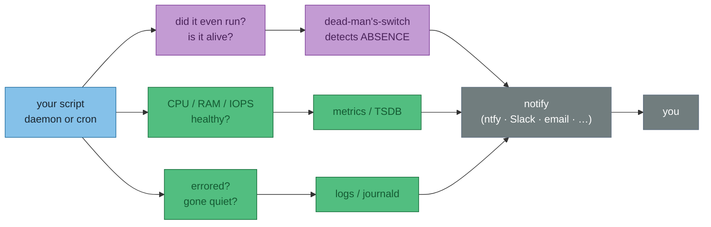
```mermaid
flowchart LR
    classDef src  fill:#85c1e9,color:#1a252f,stroke:#2471a3
    classDef tool fill:#52be80,color:#145a32,stroke:#196f3d
    classDef key  fill:#c39bd3,color:#4a235a,stroke:#7d3c98
    classDef leaf fill:#717d7e,color:#fff,stroke:#5d6d7e

    JOB["your script<br/>daemon or cron"]:::src
    JOB --> Q1["did it even run?<br/>is it alive?"]:::key
    JOB --> Q2["CPU / RAM / IOPS<br/>healthy?"]:::tool
    JOB --> Q3["errored?<br/>gone quiet?"]:::tool
    Q1 --> H["dead-man's-switch<br/>detects ABSENCE"]:::key
    Q2 --> M["metrics / TSDB"]:::tool
    Q3 --> L["logs / journald"]:::tool
    H --> N["notify<br/>(ntfy · Slack · email · …)"]:::leaf
    M --> N
    L --> N
    N --> YOU["you"]:::leaf
```

*Purple = the liveness path metrics can't see. Grey = the notify channel — swappable; same colours mean the same thing in every diagram below.*

<a id="what-real-setups-run"></a>
## What real homelab setups actually run

Five real writeups (2023–2026) solving close to this problem:[^natsuki][^nxsi][^xda][^bdr][^pecos]

| Writeup (date) | What it recommends |
|---|---|
| Natsuki — *End-to-end homelab monitoring* (2026-01) | node_exporter + cAdvisor → **Prometheus** → **Grafana** → **Alertmanager** → channel; + Loki/Promtail for logs |
| nxsi — *Complete stack via Docker Compose* (2026-02) | 9-service Prometheus + Loki + Grafana + Alertmanager; **Uptime Kuma** alongside; receiver left blank on purpose |
| XDA — *Beszel changed how I monitor my homelab* (2025-05) | **Beszel** hub + agents as the lightweight middle ground between Uptime Kuma and a Grafana/Prometheus build |
| BigData Republic — *Effective cron job monitoring* (2023-06) | logs + notifications + a **heartbeat** tool (Healthchecks.io / Cronitor) — the dead-man's-switch model |
| Daniel Pecos — *Homelab monitoring w/ Grafana + Prometheus* (2024-08) | node_exporter + cAdvisor → Prometheus → Grafana (metrics-only) |

Two patterns dominate, chosen by *what* you're watching: a **pull-based metrics stack** (Prometheus + Grafana family) for host/container resources, and a **push-based heartbeat** (Healthchecks-style) for "did my job run". For a cron job or long-running script, the heartbeat is the *direct* fit; the metrics stack is what people layer on once they have several hosts/containers. Lighter single-purpose tools — **Beszel**, **Uptime Kuma**, **Netdata** — show up repeatedly for people who find the full stack too heavy, often run *alongside* it rather than instead.

**So what:** Don't copy the 9-service Grafana stack for a single cron job — that's the common over-build. Start with a heartbeat; add a metrics tool when host resources become a real question; treat the alert channel as a leaf you swap freely.

<a id="two-architectures"></a>
## The two core architectures

**Pull-based metrics stack** — the box exposes numbers, a scraper pulls them on a schedule:

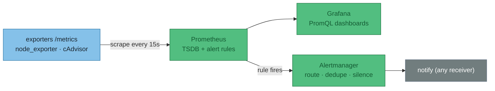
```mermaid
flowchart LR
    classDef src  fill:#85c1e9,color:#1a252f,stroke:#2471a3
    classDef tool fill:#52be80,color:#145a32,stroke:#196f3d
    classDef leaf fill:#717d7e,color:#fff,stroke:#5d6d7e

    E["exporters /metrics<br/>node_exporter · cAdvisor"]:::src -->|"scrape every 15s"| P["Prometheus<br/>TSDB + alert rules"]:::tool
    P --> G["Grafana<br/>PromQL dashboards"]:::tool
    P -->|"rule fires"| AM["Alertmanager<br/>route · dedupe · silence"]:::tool --> N["notify (any receiver)"]:::leaf
```

**Push-based heartbeat** — the job announces itself; *absence* is the alarm:

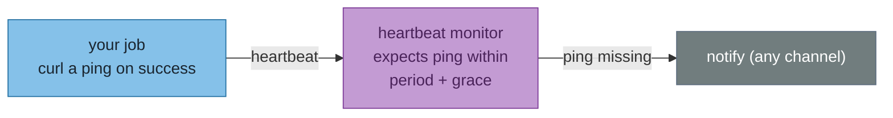
```mermaid
flowchart LR
    classDef src  fill:#85c1e9,color:#1a252f,stroke:#2471a3
    classDef key  fill:#c39bd3,color:#4a235a,stroke:#7d3c98
    classDef leaf fill:#717d7e,color:#fff,stroke:#5d6d7e

    J["your job<br/>curl a ping on success"]:::src -->|"heartbeat"| H["heartbeat monitor<br/>expects ping within<br/>period + grace"]:::key
    H -->|"ping missing"| N["notify (any channel)"]:::leaf
```

**So what:** Pull suits always-on hosts on a known network; push suits scheduled/ephemeral work — and a cron job is *inherently* push (it announces "I ran"), which is why a scrape-based stack structurally can't tell you it never started.

<a id="base-template"></a>
## The base template (tiers)

Match the tier to the question you actually have. "notify" = your channel of choice.

| Tier | Know that… | Add | Pick |
|---|---|---|---|
| **0** always | it errored / daemon stuck | systemd `OnFailure=` + journal-grep timer + `WatchdogSec=` | native, zero new services |
| **1** almost always | it ran at all / box is up | dead-man's-switch | **Healthchecks.io** (hosted free → self-host) or **Uptime Kuma** |
| **2** capacity matters | CPU/RAM/IOPS trend | metrics | **Beszel** → Prometheus+Grafana if outgrown |
| **3** want search/UI/multi-box | what it logged / went quiet | logs | **Vector → Axiom**, or self-host **SigNoz**/OpenObserve |

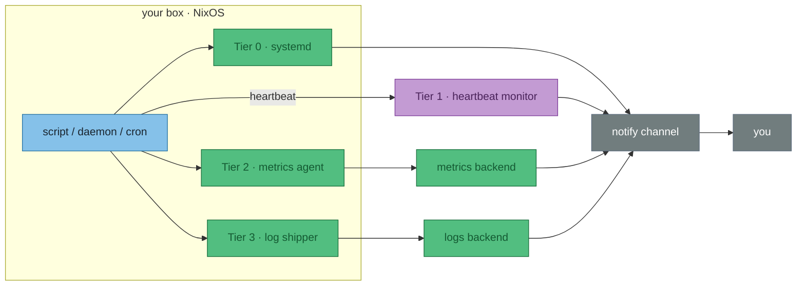
```mermaid
flowchart LR
    classDef src  fill:#85c1e9,color:#1a252f,stroke:#2471a3
    classDef tool fill:#52be80,color:#145a32,stroke:#196f3d
    classDef key  fill:#c39bd3,color:#4a235a,stroke:#7d3c98
    classDef leaf fill:#717d7e,color:#fff,stroke:#5d6d7e

    subgraph BOX["your box · NixOS"]
      JOB["script / daemon / cron"]:::src
      T0["Tier 0 · systemd"]:::tool
      AG["Tier 2 · metrics agent"]:::tool
      VE["Tier 3 · log shipper"]:::tool
      JOB --> T0
      JOB --> AG
      JOB --> VE
    end
    JOB -->|"heartbeat"| HC["Tier 1 · heartbeat monitor"]:::key
    AG --> MB["metrics backend"]:::tool
    VE --> LB["logs backend"]:::tool
    T0 --> N["notify channel"]:::leaf
    HC --> N
    MB --> N
    LB --> N
    N --> YOU["you"]:::leaf
```

**So what:** Ship Tier 0 + Tier 1 on every box (an afternoon); add 2 and 3 per-box only when a real question appears. systemd can't detect its *own* absence (it dies with the box) — that's why Tier 1 is a separate external witness.

<a id="the-tools"></a>
## The tools, with pictures

What each option actually is, how its data flows, and what its UI looks like. Screenshots are from each project's own site/docs (see [Further reading](#further-reading) for sources).

### Uptime Kuma — liveness + status pages (self-host)

Define monitors (HTTP/TCP/ping/DNS, or a **push** type for cron jobs); Kuma probes on a schedule or receives heartbeats, stores results in SQLite, shows a live dashboard + public status page, and fires 90+ notification integrations on state change.

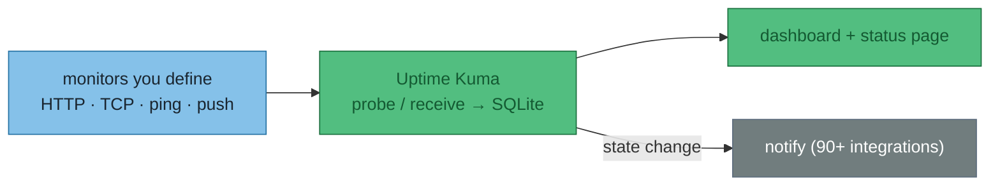
```mermaid
flowchart LR
    classDef src fill:#85c1e9,color:#1a252f,stroke:#2471a3
    classDef tool fill:#52be80,color:#145a32,stroke:#196f3d
    classDef leaf fill:#717d7e,color:#fff,stroke:#5d6d7e
    M["monitors you define<br/>HTTP · TCP · ping · push"]:::src --> K["Uptime Kuma<br/>probe / receive → SQLite"]:::tool
    K --> D["dashboard + status page"]:::tool
    K -->|"state change"| N["notify (90+ integrations)"]:::leaf
```

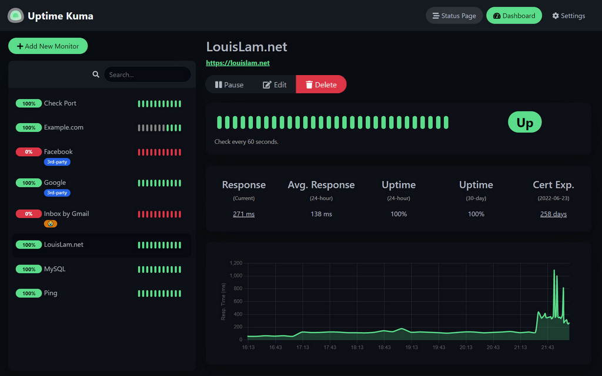
*Dashboard: each monitor's uptime and response time at a glance.*

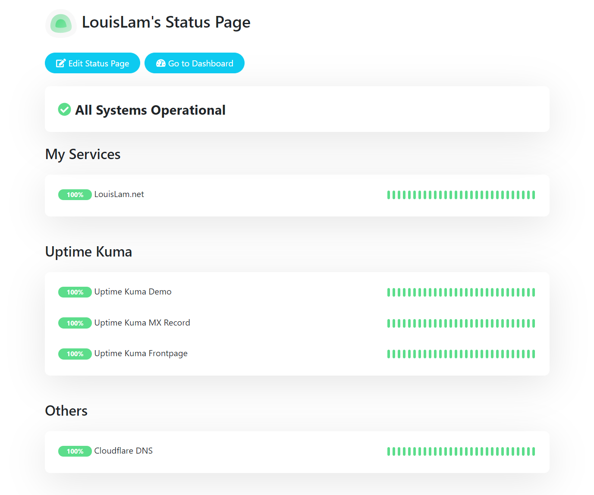
*A published status page — services and their up/down state.*

### Healthchecks.io — the cron dead-man's-switch (self-host or free SaaS)

Purpose-built heartbeat monitor: each check has a ping URL; your job `curl`s it on success. If a ping doesn't arrive within *period + grace*, the check goes down and notifies. This is the one tool that catches "the cron never ran".

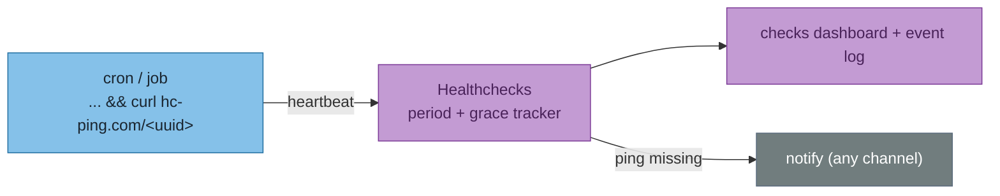
```mermaid
flowchart LR
    classDef src fill:#85c1e9,color:#1a252f,stroke:#2471a3
    classDef key fill:#c39bd3,color:#4a235a,stroke:#7d3c98
    classDef leaf fill:#717d7e,color:#fff,stroke:#5d6d7e
    J["cron / job<br/>... && curl hc-ping.com/&lt;uuid&gt;"]:::src -->|"heartbeat"| H["Healthchecks<br/>period + grace tracker"]:::key
    H --> D["checks dashboard + event log"]:::key
    H -->|"ping missing"| N["notify (any channel)"]:::leaf
```


*The checks list — each background job's status, period and last ping.*


*A single check's detail + live event log.*

### Beszel — lightweight metrics (self-host)

The "new lightweight" pick: a ~10 MB agent per host reads CPU/mem/disk-I/O/net/containers and reports to a small hub (PocketBase + SQLite) that draws the dashboard and evaluates threshold alerts (CPU/mem/disk/temp/status). The middle ground between Uptime Kuma and a Grafana/Prometheus build.

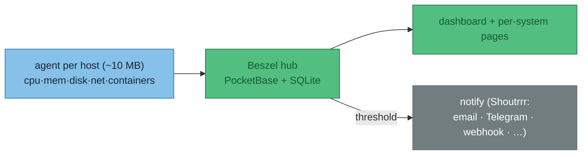
```mermaid
flowchart LR
    classDef src fill:#85c1e9,color:#1a252f,stroke:#2471a3
    classDef tool fill:#52be80,color:#145a32,stroke:#196f3d
    classDef leaf fill:#717d7e,color:#fff,stroke:#5d6d7e
    A["agent per host (~10 MB)<br/>cpu·mem·disk·net·containers"]:::src --> HUB["Beszel hub<br/>PocketBase + SQLite"]:::tool
    HUB --> D["dashboard + per-system pages"]:::tool
    HUB -->|"threshold"| N["notify (Shoutrrr:<br/>email · Telegram · webhook · …)"]:::leaf
```


*Multi-system overview.*

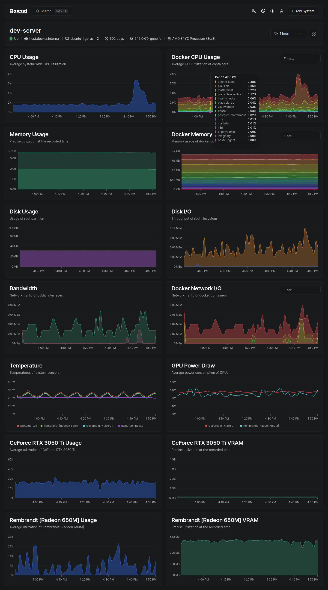
*Per-system detail, including disk I/O and containers.*

### Prometheus + Grafana — the standard metrics stack (self-host)

The de-facto homelab stack. Exporters expose `/metrics`; **Prometheus** scrapes and stores them as time-series + evaluates alert rules; **Grafana** queries Prometheus with PromQL and draws dashboards; **Alertmanager** routes/dedupes firing alerts to a receiver. Powerful and flexible — and the heaviest to learn and run.

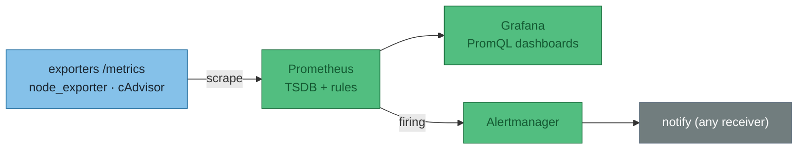
```mermaid
flowchart LR
    classDef src fill:#85c1e9,color:#1a252f,stroke:#2471a3
    classDef tool fill:#52be80,color:#145a32,stroke:#196f3d
    classDef leaf fill:#717d7e,color:#fff,stroke:#5d6d7e
    E["exporters /metrics<br/>node_exporter · cAdvisor"]:::src -->|"scrape"| P["Prometheus<br/>TSDB + rules"]:::tool
    P --> G["Grafana<br/>PromQL dashboards"]:::tool
    P -->|"firing"| AM["Alertmanager"]:::tool --> N["notify (any receiver)"]:::leaf
```

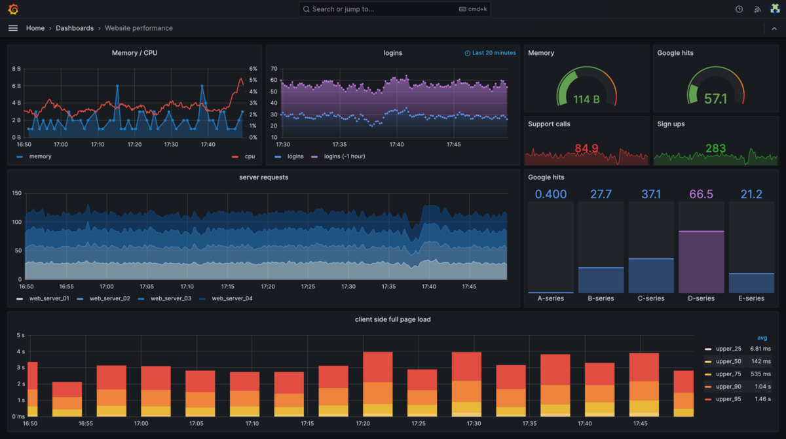
*Grafana: dashboards built from PromQL queries against Prometheus.*

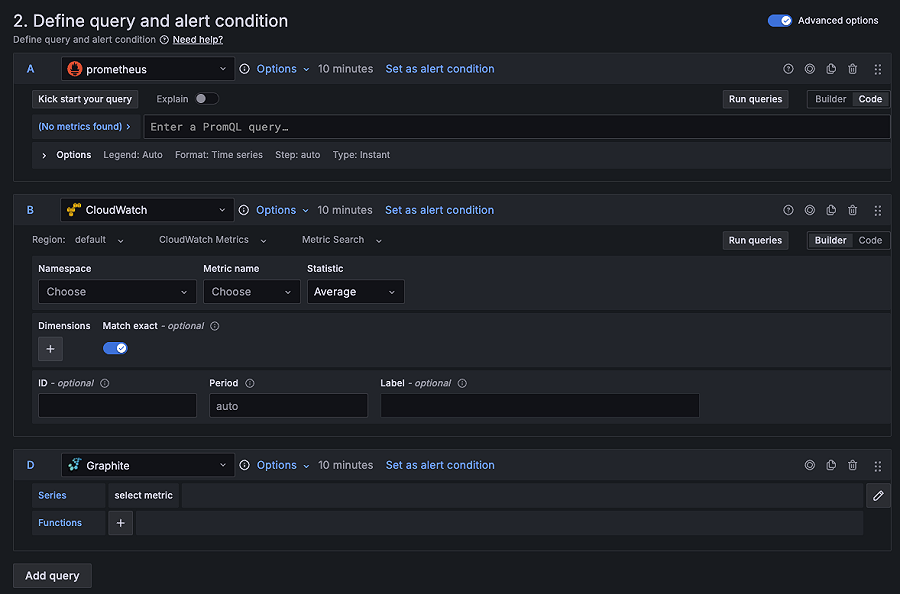
*Grafana's alert-rule editor (the flexibility that's also the complexity).*

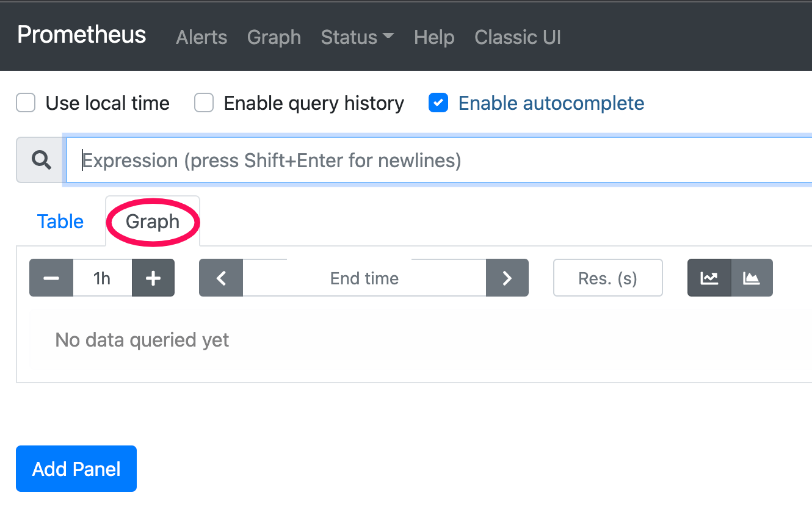
*Prometheus' own expression browser — raw PromQL + graph.*

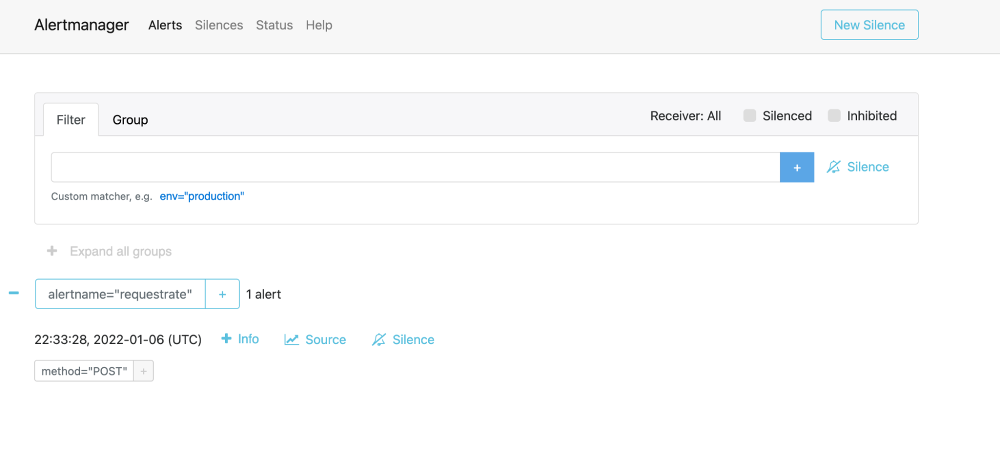
*Alertmanager — where firing alerts are grouped, silenced and routed.*

### Netdata — instant per-node deep metrics (self-host)

An agent per node auto-discovers thousands of metrics at **1-second** granularity into a local TSDB, with a zero-config dashboard on `:19999` and built-in health + ML-anomaly alerts. Gorgeous out of the box — but heavy on a constrained box (see [Avoid](#avoid)).

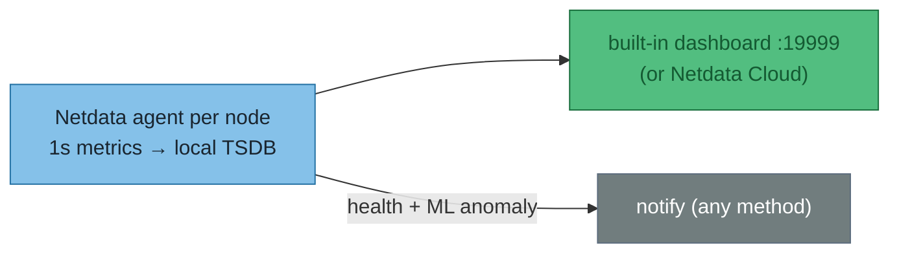
```mermaid
flowchart LR
    classDef src fill:#85c1e9,color:#1a252f,stroke:#2471a3
    classDef tool fill:#52be80,color:#145a32,stroke:#196f3d
    classDef leaf fill:#717d7e,color:#fff,stroke:#5d6d7e
    AG["Netdata agent per node<br/>1s metrics → local TSDB"]:::src --> D["built-in dashboard :19999<br/>(or Netdata Cloud)"]:::tool
    AG -->|"health + ML anomaly"| N["notify (any method)"]:::leaf
```

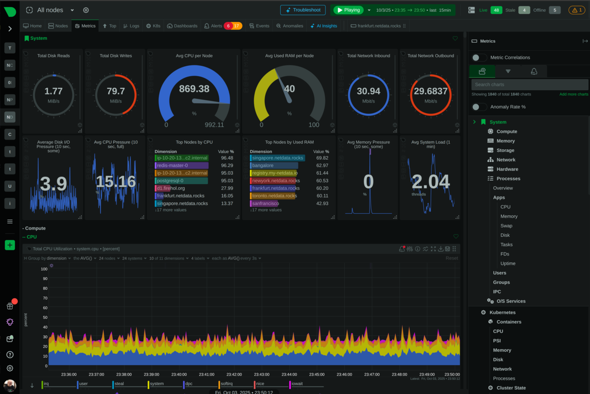
*Per-second auto-generated charts — nothing to configure.*

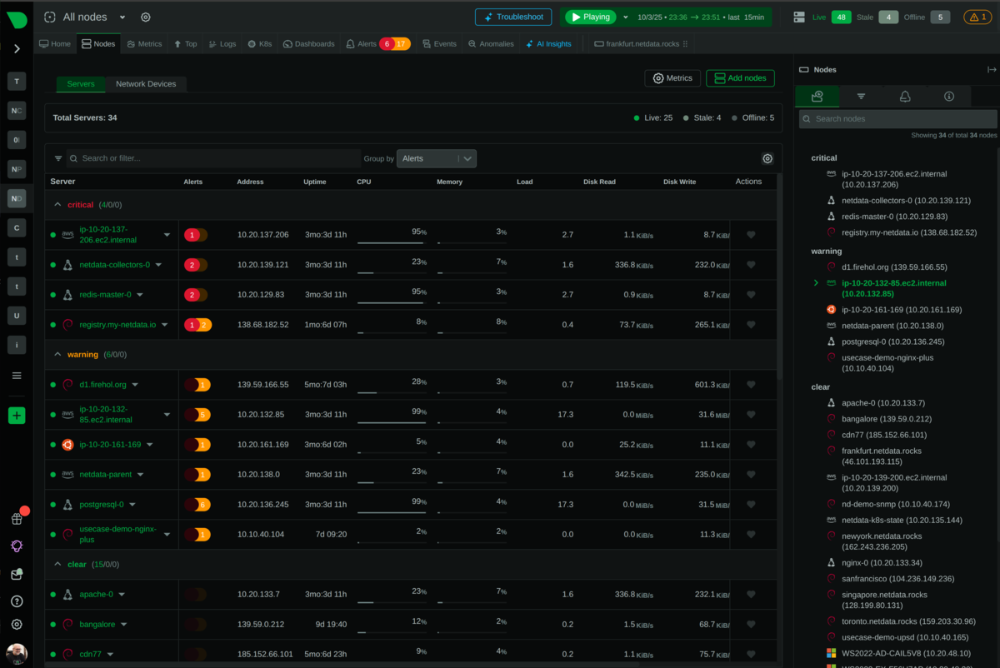
*Nodes grouped by alert status (warning/critical).*

### Axiom — logs + metrics + traces (SaaS)

A managed platform: apps / OpenTelemetry / Vector ship events in, Axiom stores them cheaply in object storage and runs query compute on demand. You explore with APL across logs/metrics/traces together; monitors evaluate on a schedule and notify. Lowest-maintenance (no infra), generous free tier.

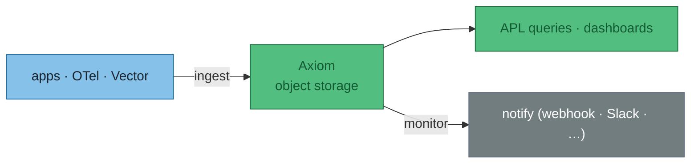
```mermaid
flowchart LR
    classDef src fill:#85c1e9,color:#1a252f,stroke:#2471a3
    classDef tool fill:#52be80,color:#145a32,stroke:#196f3d
    classDef leaf fill:#717d7e,color:#fff,stroke:#5d6d7e
    I["apps · OTel · Vector"]:::src -->|"ingest"| AX["Axiom<br/>object storage"]:::tool
    AX --> Q["APL queries · dashboards"]:::tool
    AX -->|"monitor"| N["notify (webhook · Slack · …)"]:::leaf
```

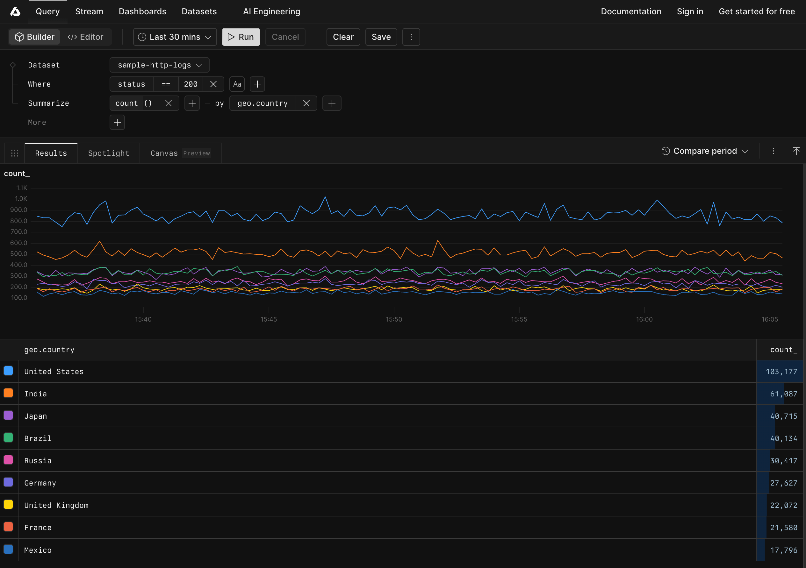
*Querying logs in the Axiom console (APL).*

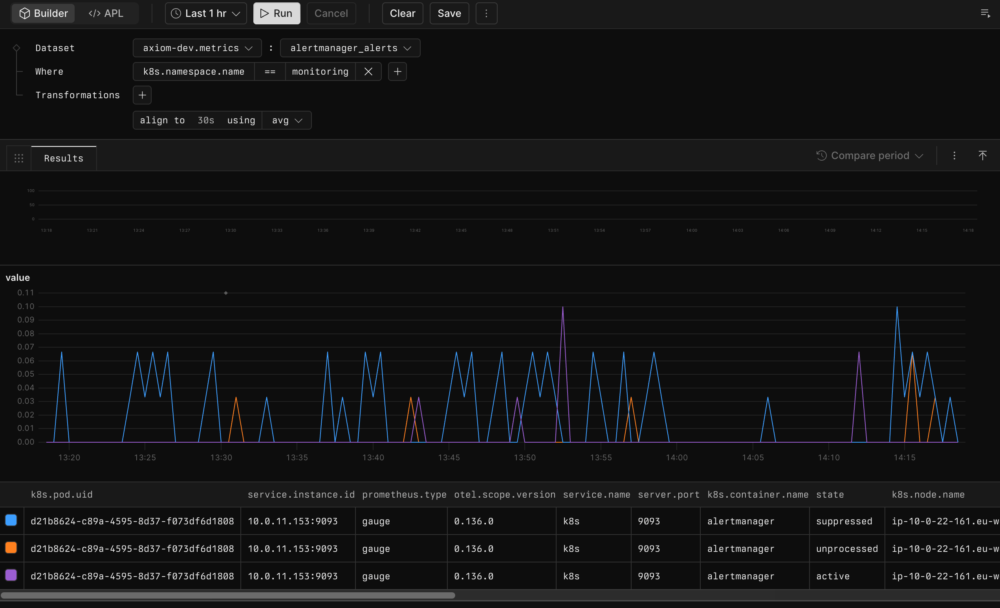
*The same console over a metrics dataset.*

### SigNoz — self-host all-in-one (the Datadog-shaped option)

OpenTelemetry-native: apps emit OTLP → an OTel Collector → SigNoz, which stores everything in ClickHouse and serves APM/traces/logs/dashboards/alerts in one UI. The self-hostable "single tool for all three signals" — at the cost of a ClickHouse-sized footprint.

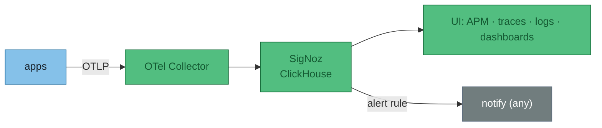
```mermaid
flowchart LR
    classDef src fill:#85c1e9,color:#1a252f,stroke:#2471a3
    classDef tool fill:#52be80,color:#145a32,stroke:#196f3d
    classDef leaf fill:#717d7e,color:#fff,stroke:#5d6d7e
    AP["apps"]:::src -->|"OTLP"| OC["OTel Collector"]:::tool --> SG["SigNoz<br/>ClickHouse"]:::tool
    SG --> U["UI: APM · traces · logs · dashboards"]:::tool
    SG -->|"alert rule"| N["notify (any)"]:::leaf
```

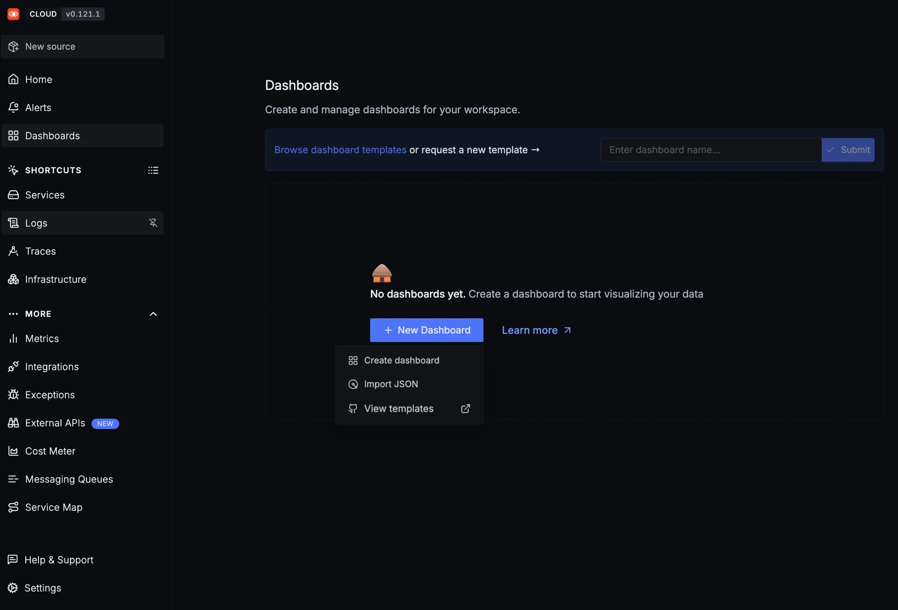
*SigNoz dashboards — logs, metrics and traces in one place.*

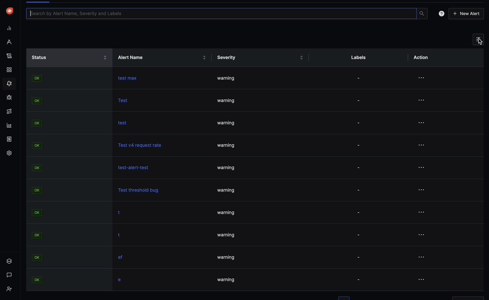
*Defining alert rules in SigNoz.*

<a id="metrics-detail"></a>
## What the metrics look like (CPU over time)

Metrics are *levels sampled over time* — CPU%, RAM, disk IOPS, load. An agent reads the host, a TSDB stores the samples, a dashboard plots them, and a rule notifies you when a level crosses a threshold *for long enough* (so a blip doesn't page you, a sustained breach does):

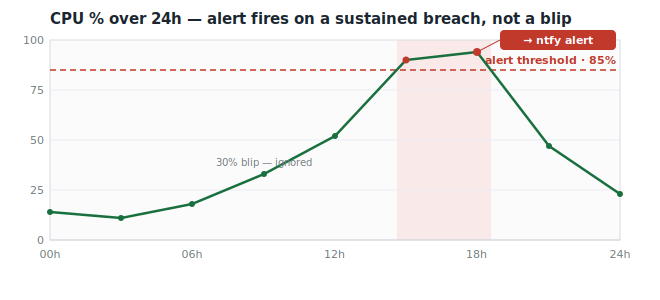

`disk IOPS`, RAM and load look the same — one series per metric, each with its own threshold. Beszel draws these out of the box; with node_exporter you get them via `node_disk_*`, `node_memory_*`, etc.

<a id="dashboards"></a>
## Dashboards — look vs be told (parallel to alerts)

Alerting is *reactive* — it tells you once something has already crossed a line. A **dashboard is *proactive*** — you go *look* and catch the disk slowly filling, memory creeping up, or IOPS climbing every night, and fix it *before* it ever trips a threshold. They're two parallel branches off the same store, and the important part: **a dashboard is useful with zero alert rules set.** You don't have to configure a single monitor to benefit from "let me just see CPU/RAM/IOPS over the last week".

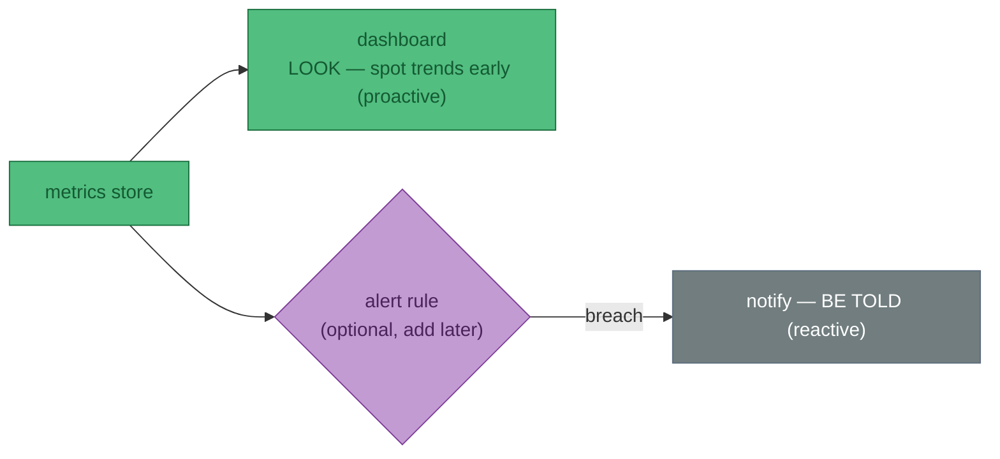
```mermaid
flowchart LR
    classDef tool fill:#52be80,color:#145a32,stroke:#196f3d
    classDef key  fill:#c39bd3,color:#4a235a,stroke:#7d3c98
    classDef leaf fill:#717d7e,color:#fff,stroke:#5d6d7e
    M["metrics store"]:::tool --> D["dashboard<br/>LOOK — spot trends early (proactive)"]:::tool
    M --> R{"alert rule<br/>(optional, add later)"}:::key
    R -->|breach| N["notify — BE TOLD (reactive)"]:::leaf
```

Which tool gives you a "just go look" dashboard:

| Want | Use | What you get |
|---|---|---|
| Instant, zero-config, deepest | **Netdata** | every metric at 1-second resolution the moment it's installed (but heavy — see [Avoid](#avoid)) |
| Lightweight, built-in | **Beszel** | CPU / RAM / disk-I/O / net + SMART per host, with history, in a small hub UI |
| Build / customise anything | **Grafana** (over Prometheus or VictoriaMetrics) | the most flexible dashboards — assemble panels from PromQL, or import community ones |
| Up/down + response time | **Uptime Kuma** | service status and latency graphs, not deep host resources |
| Logs + metrics + traces together | **Axiom / SigNoz** | query-driven views rather than always-on resource gauges |

**Just want to eyeball this box right now, with nothing to run?** `btop` / `htop` give a live terminal view (no history); `glances` adds a quick web/REST view. No storage, so no trends — but they answer "what's happening *now*" in one command.

So if your actual itch is "I want to glance at CPU/RAM/IOPS trends", that's a **dashboard need, not an alerting need** — reach for **Beszel** (light) or **Netdata** (deep, on a roomy box), or **Grafana** if you want to build your own. Alert rules can come later, or never; the dashboard stands on its own.

<a id="recipe"></a>
## NixOS recipe (shape)

```nix
# Tier 0 — errors + daemon restart -> your notify channel (ntfy shown; swap freely)
systemd.services."notify@" = {
  scriptArgs = "%i";
  script = ''curl -fsS -d "$1 failed @ $(hostname)" https://ntfy.sh/your-topic'';  # or Slack/Discord/email
};
systemd.services.myjob = {
  serviceConfig = { WatchdogSec = "120"; Restart = "on-watchdog"; };  # daemon: restart on heartbeat loss
  onFailure = [ "notify@%n.service" ];                                # non-zero exit -> notify
};

# Tier 1 — dead-man's-switch: in the job append   && curl -fsS https://hc-ping.com/<uuid>
#   (self-host later: services.healthchecks.enable = true;  or  services.uptime-kuma.enable = true;)

# Tier 2 — lightweight metrics
services.beszel-agent.enable = true;   # ~10 MB; hub elsewhere; alerts via Shoutrrr

# Tier 3 — ship logs/metrics, swappable backend
services.vector = {
  enable = true;                                          # config validated at build time
  settings.sources.journal.type = "journald";
  settings.sinks.axiom = { type = "axiom"; inputs = [ "journal" ]; /* dataset + token */ };
};
```

<a id="avoid"></a>
## Avoid (for this scale + constraints)

- **Netdata on a constrained box** — its RAM growth is a *known, open* bug (#16412, recurred on v2.8.2 in Dec 2025); the UI is now proprietary and it was dropped from Debian. Beautiful, but it ate a mini-PC. Use Beszel instead unless you have a roomy box and want the per-second depth.
- **Self-hosted Loki alerting** — its Ruler leans on WAL replay (no rules evaluate during replay → alerts silently delayed/missed); the documented "fix" adds complexity. This is the "alerting is ungodly complex" trap.
- **A 9-service Grafana/Prometheus stack for one cron job** — the common over-build. Tier 0 + Tier 1 covers it.

<a id="tldr"></a>
## TL;DR — what should I actually do?

Pick the lowest row that covers what you need; everything alerts to whatever channel you like.

| Approach | Effort + upkeep | Moving parts | Dashboard / QoL | Pros | Cons |
|---|---|---|---|---|---|
| **systemd + Healthchecks** (Tier 0+1) | tiny | ~1 (a hosted check, or one service) | none — alert-only | catches "didn't run / box down"; near-zero maintenance; native to NixOS | no trends, nothing to *look* at |
| **Beszel** | low | 2 (hub + agent) | good, lightweight built-in | ~10 MB agent; CPU/RAM/IOPS+SMART dashboard **and** alerts in one; won't eat the box | younger project; fixed metric set; no PromQL |
| **Netdata** | low | 1 per node | best instant dashboard (1 s, zero-config) | gorgeous and deep the moment it's installed | RAM growth on small boxes ([Avoid](#avoid)); UI now proprietary |
| **Uptime Kuma** | low | 1 | status + response graphs | dead-simple, pretty status pages, push monitors for cron | up/down only — not deep host resources |
| **Prometheus + Grafana + Alertmanager** | high | 4+ (exporters · Prometheus · Grafana · Alertmanager) | best + most flexible | the standard; powerful PromQL; huge dashboard + exporter ecosystem | steepest curve; most parts to run and break |
| **Vector → Axiom** (SaaS) | low | 1 agent + a SaaS account | good — logs+metrics+traces UI | no infra to run; the UX you already like; 500 GB/mo free | data leaves the box; vendor dependency |
| **SigNoz / OpenObserve** (self-host all-in-one) | medium–high | OpenObserve ≈ 1 binary · SigNoz = a ClickHouse stack | good — all signals in one UI | own your data; logs+metrics+traces together | SigNoz heavy (ClickHouse); OpenObserve younger |

**The honest default for you:** ship **Tier 0 + Tier 1** (systemd + Healthchecks) on every box first — an afternoon, and it catches the failures that matter. Add **Beszel** the moment you want to *look* at CPU/RAM/IOPS trends (lightweight, dashboard + alerts in one). Reach for **Prometheus + Grafana** only once you've outgrown that and genuinely want PromQL and the ecosystem — not before.

<a id="further-reading"></a>
## Further reading

Real writeups this page is grounded in (fetched 2026-06-18):

[^natsuki]: Natsuki — *End-to-End Monitoring Explained for Homelabs: Prometheus, Grafana & Alertmanager* (2026-01-09) — https://blog.natsuki-cloud.dev/posts/homelab-monitoring-prometheus-grafana/
[^nxsi]: Dyllan — *Deploy a Complete Homelab Monitoring Stack with Docker Compose* (2026-02-21) — https://www.nxsi.io/blog/homelab-monitoring-stack-tutorial
[^xda]: Ayush Pande (XDA) — *This free, open-source lightweight server monitor changed how I keep an eye on my homelab (Beszel)* (2025-05-20) — https://www.xda-developers.com/beszel-feature/
[^bdr]: Bassim Lazem (BigData Republic) — *Effective Cron Job Monitoring* (2023-06-14) — https://bigdatarepublic.nl/articles/effective-cron-job-monitoring/
[^pecos]: Daniel Pecos Martínez — *Homelab monitoring using Grafana and Prometheus* (2024-08-29) — https://danielpecos.com/2024/08/29/homelab-monitoring-using-grafana-and-prometheus/

Screenshot sources: Uptime Kuma & Healthchecks GitHub READMEs; beszel.dev; netdata.cloud; grafana.com; the Grafana Labs *intro-to-prometheus* repo (Prometheus/Alertmanager UI); axiom.co/docs; signoz.io/docs. Tool-specific footprint/licensing claims (Netdata, VictoriaMetrics, Axiom limits) are detailed with sources in `scratchpads/research-observability-stack.md`.
