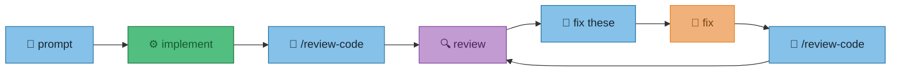
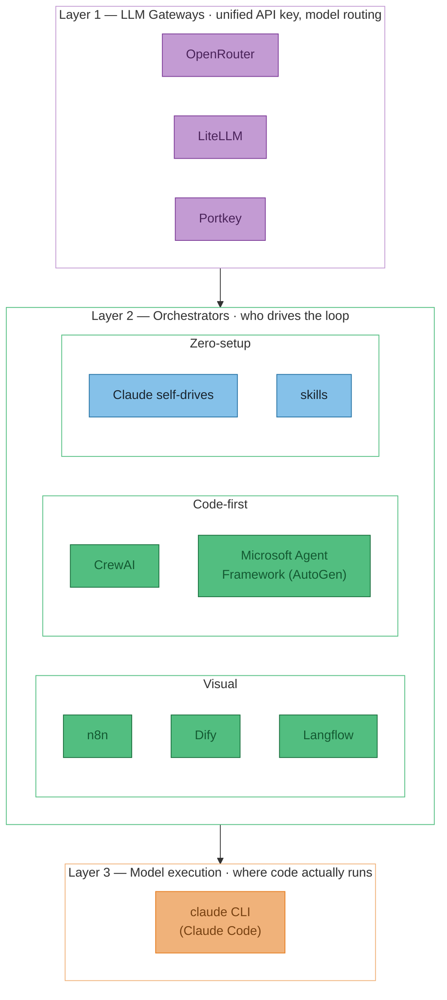
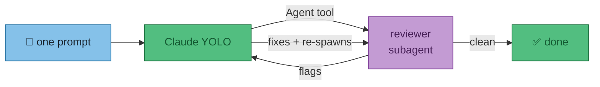
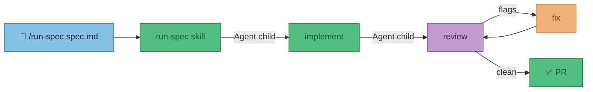
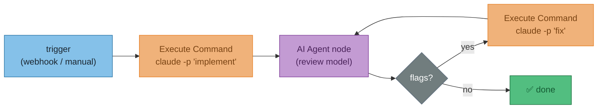
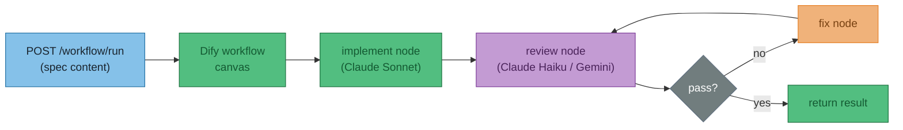
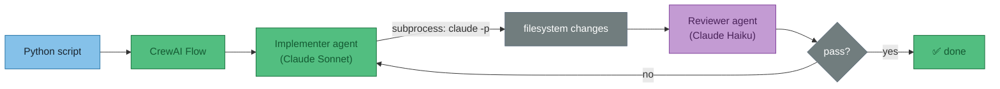
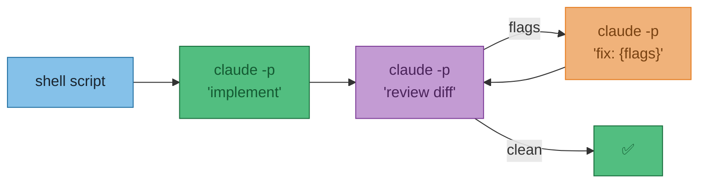
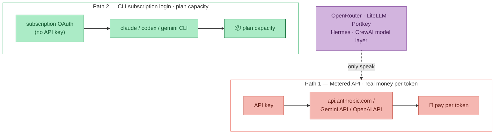

# ADR-001 — Reducing user prompts: autonomous spec-to-PR loop

**Status**: Proposed  
**Date**: 2026-05-31  
**Context**: The current workflow requires a human to prompt each step: implement, then manually invoke `/review-code`, read the output, prompt Claude to fix, re-review. The goal is to reduce that to one trigger — "implement spec.md" — and have Claude handle the rest without further prompting.  
**Decision**: Not yet made — this document captures the options.

:::warning Does NOT cover
CI automation (GitHub Actions, webhooks), evaluation frameworks, or RAG (Retrieval-Augmented Generation) pipelines.

:::

---

## The problem

Today's flow requires a human at each arrow:



The goal: one prompt in, Claude drives all the arrows.

---

## Tool landscape

The tools fall into three layers. You need to understand all three to pick the right combination.



:::tip Key insight
None of these tools have native Claude Code integration. Every option eventually shells out to `claude -p` or calls the Anthropic API directly. The loop is always yours to wire — the tools just differ in how much wiring they do for you.

:::

---

## Layer 1 — LLM Gateways

Gateways do one thing: give you a **single API key and endpoint** that routes to any model (GPT-4, Claude, Gemini, Llama, etc.). They are not orchestrators — they don't drive the loop.

| Tool | Self-host | Cost | Best for |
|------|-----------|------|----------|
| **OpenRouter** | No | 5.5% fee, ~27 free models | Zero-infra access to 300+ models |
| **LiteLLM** | Yes (MIT) | Free; enterprise ~$250/mo | Self-hosted routing, spend tracking |
| **Portkey** | No | Free 10K logs/mo; $49/mo Pro | Production observability, cost tracing |

All three solve the same surface problem — one key/endpoint instead of juggling separate Anthropic, OpenAI and Google credentials. They differ on **who hosts it, who you pay, and what value sits on top**:

- **OpenRouter** — a hosted model *marketplace*. Sign up, add credits, point any tool at `openrouter.ai/api/v1` with one key, and you reach 300+ models with automatic fallback. You pay OpenRouter (they pay the providers and take a cut); your traffic flows through their servers. Simplest option, zero ops. Useful when you want to swap models — e.g. Gemini Flash for the cheap review pass, Claude Sonnet for implementation — without managing separate credentials.

- **LiteLLM** — "OpenRouter, but you run it." An open-source (MIT) translation layer that normalises ~100 provider APIs into the OpenAI format. Use it as a Python library *or* stand it up as a self-hosted proxy. You bring your own provider keys (no markup — you pay providers directly), own the routing config, and — crucially for an unattended loop — set **hard per-model spend caps** so a runaway loop can't quietly burn money overnight.

- **Portkey** — a hosted (with an OSS gateway) *production* gateway whose reason for existing is the **observability dashboard**: per-request logging and tracing, cost attribution, automatic retries/fallbacks, and guardrails. Like LiteLLM you bring your own keys. Aimed at production apps rather than personal dev — but its tracing directly answers the "debugging is painful" pain flagged under [Option E — CrewAI](#option-e--crewai): when an overnight run fails on turn 4, you can see exactly why.

**For this loop specifically:** OpenRouter gets you the cheap-review-model swap with one key; LiteLLM adds the spend cap that makes overnight runs safe; Portkey adds the trace when one of those runs goes wrong.

---

## Layer 2 — Orchestrators

### Option A — Claude self-drives (zero tooling)

Tell YOLO-mode Claude to run the full loop in one prompt. Claude uses the built-in `Agent` tool to spawn reviewer subagents.



```
implement everything in spec.md, then run /review-code,
fix all flags, and repeat until /review-code comes back clean
```

**Works today. Zero setup.** Weak point: context window is the loop budget; Claude decides when "clean".

---

### Option B — `/run-spec` skill

A SKILL.md that encodes the loop explicitly. User types one slash command.



Write `configs/claude/skills/run-spec/SKILL.md` with explicit step-by-step instructions. The skill defines the exit condition — no ambiguity about when to stop.

**~1 hour to build. Uses skills already built. Best next step.**

---

### Option C — n8n (visual orchestrator)

n8n is a self-hostable workflow automation tool (183K GitHub stars) with first-class AI Agent nodes. The key node for this use case: **Execute Command** — lets you shell out to `claude -p` from within a visual flow.



Pair with OpenRouter/LiteLLM so all model credentials live in one place — n8n just passes through the unified key.

**Best if you want visual debugging of each loop step. ~2 hours to set up. Self-hostable.**

---

### Option D — Dify

Dify (138K GitHub stars) is a visual platform for building and **deploying** LLM-powered apps. More app-builder than dev-automation tool — but its workflow canvas can model the loop, and the output can be exposed as an API endpoint.



Limitation: Dify operates on text — it can call the Anthropic API to generate code, but it cannot run `claude` CLI (i.e. Claude Code with filesystem access). Use this when the loop is pure model-to-model, not when Claude Code needs to actually edit files.

**Best if you want a deployable app with a REST API. Overkill for personal dev workflow.**

---

### Option E — CrewAI

Python library for role-based multi-agent workflows. Lowest boilerplate of the code-first options (~35 lines for a working crew). Uses LiteLLM under the hood, so any model per agent.



Caveat: the open-source version lacks built-in tracing. When the loop runs unattended and fails on turn 4, debugging is painful without the paid AMP (Agent Management Platform) tier.

**Best code-first option if you want explicit loop control in Python with low ceremony.**

---

### Option F — `claude --print` headless pipeline

Claude Code's `-p` flag runs non-interactively. Shell-script the loop yourself — review output becomes fix input.



Each `claude -p` call starts cold — no memory of previous turns. The diff grows with each loop iteration. Works well for overnight unattended runs where you don't need a persistent session.

---

## Tools to skip

| Tool | Why |
|------|-----|
| **Langflow / Flowise** | Squeezed between n8n (better automation) and Dify (better app-building). No compelling advantage for this use case. |
| **Wordware** | Company pivoted in April 2025 to a consumer product ("Sauna"). Workflow product has uncertain future. |
| **Coze (ByteDance)** | Generous free model access but ByteDance data provenance is a concern; better for chatbots than dev automation. |
| **Microsoft Agent Framework** | Powerful but .NET/Azure-oriented and heavy ceremony for a personal dev loop. |

---

## Full comparison

| Option | User effort per run | Drives Claude Code CLI | Multi-model | Setup cost | Self-host |
|--------|---------------------|------------------------|-------------|------------|-----------|
| **A — Self-drive** | One prose prompt | Yes (native) | No | None | — |
| **B — /run-spec skill** | `/run-spec spec.md` | Yes (native) | No | ~1 hour | — |
| **C — n8n** | Trigger button / webhook | Via Execute Command node | Via OpenRouter/LiteLLM | ~2–3 hours | Yes |
| **D — Dify** | API call | No (API only, no filesystem) | Yes (built-in) | ~2–3 hours | Yes |
| **E — CrewAI** | `python run_spec.py` | Via subprocess | Via LiteLLM | ~2 hours | Yes (lib) |
| **F — Headless pipeline** | `./run-spec.sh` | Via `claude -p` | Via OpenRouter/LiteLLM | ~2 hours | Yes |

---

## Recommendation

:::info Short answer
**B now. C or E when you need unattended runs or multi-model routing.**

:::

**Start with B** — a `/run-spec` skill is one SKILL.md file, reuses the review skills already built, stays inside Claude Code's context (so it can actually edit files), and the loop is explicit. An afternoon's work.

**Upgrade to C (n8n) or E (CrewAI)** when you need:

- The loop to run without a terminal session open (overnight jobs)
- A cheaper model for the review pass (use OpenRouter to swap Gemini Flash in without changing the loop logic)
- Visual per-step debugging (n8n) or Python control flow (CrewAI)

**D (Dify)** is only interesting if you want to expose the loop as a REST API that something else calls into — not a personal dev tool.

---

## Addendum — API billing vs CLI subscription (the part that actually decides cost)

Everything in Layer 1 assumes you reach models over a **metered API key** — pay-per-token, real money. But if you hold consumer subscriptions (Claude Max, ChatGPT Plus/Pro, Google AI Pro), there's a second path that bills against your **plan capacity** instead. They are not interchangeable, and the gateways (OpenRouter/LiteLLM/Portkey) only know the first one.



:::warning Consumer subscriptions ≠ API access
A **ChatGPT Plus** or **Google AI Pro** subscription grants you nothing through an API key — gateways, Hermes, and CrewAI's model layer all want an API key, so those subscriptions can't feed them. The *only* way a subscription becomes programmatic capacity is the vendor's **official CLI with subscription login**. (Google's docs are blunt about it: plug a Gemini API key into the CLI and it bills on the key's free/pay-as-you-go status, **ignoring** your Pro/Ultra subscription.)

:::

### Which subscription reaches which CLI

| Your subscription | CLI that runs on-plan | Non-interactive flag | Status (Jun 2026) |
|---|---|---|---|
| **Claude Max** | `claude` (Claude Code) | `claude -p` | ✅ draws on subscription limits (see note below) |
| **ChatGPT Plus/Pro** | `codex` (Sign in with ChatGPT) | `codex exec` | ✅ included in plan |
| **Google AI Pro/Ultra** | `gemini` CLI | `gemini -p` | ⚠️ migrating to Antigravity CLI (18 Jun 2026); free tier now Flash-only |

:::note Claude billing: headless `claude -p` is still subscription-subsidised (as of Jun 2026)
Anthropic *announced* a change to move programmatic usage (`claude -p`, Agent SDK, GitHub Actions, third-party SDK apps) onto a separate metered pool at full API rates — then **[paused it on 15 June 2026 before it took effect](https://support.claude.com/en/articles/15036540-use-the-claude-agent-sdk-with-your-claude-plan)**. Today, `claude -p` and the Agent SDK **still draw from your normal subscription usage limits** (the 5-hour window + weekly caps, [shared across Claude and Claude Code](https://support.claude.com/en/articles/11145838-use-claude-code-with-your-pro-or-max-plan)). Exhaust those and you can *optionally* spill to API rates; otherwise requests stop. So headless is not metered today — but Anthropic has signalled it wants to change this. **Treat the subsidised headless path as "true now, watch for a policy update."**

:::

**What this does to the recommendation:** billing is currently *neutral* across A/B/F — all draw on the same subscription limits, so pick between them on loop control and session persistence, not cost. The one real cost lever: running the review pass on a *different* subscription (`codex exec` on your ChatGPT plan) spreads load across two independent limit pools, so you're less likely to hit either cap on a long run.

### Are others solving this? Yes — the pattern is an *agent harness*

Search term: **"CLI coding agent harness"**. Shared idea across all of them — a thin driver shells out to the official CLIs as subprocesses; each agent brings its own subscription, the harness owns only the loop, git isolation, and exit condition.

| Category | Examples | Gives you |
|---|---|---|
| Directories | [awesome-cli-coding-agents](https://github.com/bradAGI/awesome-cli-coding-agents), [awesome-agent-orchestrators](https://github.com/andyrewlee/awesome-agent-orchestrators) | The canonical lists to browse |
| Autonomous loops | `ralph-claude-code`, `sage`, MartinLoop | Run-until-done loops, worktree isolation, budget/verifier gates |
| Built-in (vendor) | Claude Code **Agent Teams**, Codex **app-server mode** + **Symphony** | Orchestration shipped by Anthropic / OpenAI |
| Control planes | CC Switch, OpenSquirrel, [LiteLLM Agent Control Plane](https://github.com/LiteLLM-Labs/litellm-agent-control-plane) | One UI over many CLIs |

Also watch **ACP (Agent Client Protocol)** — the emerging standard for driving these agents uniformly.

### Verified deep dive — which ones actually run on subscription

The decisive test for each tool: does it spawn the **official CLI as a subprocess** (good — inherits your subscription login) or call a **provider API** (bad — needs a key, pay-per-token)? READMEs blur this, so the verdicts below come from reading the actual repos/source, with each key claim independently fact-checked.

:::tip Headline
**Yes — maintained, off-the-shelf tools already orchestrate `claude` + `codex` + `gemini` as subprocesses in tmux sessions, on subscription capacity.** The hand-rolled tmux wrapper is redundant. Caveat that matters: a subprocess inherits *whatever the CLI is logged into* — so log each CLI into your **subscription** (not an API key) and the orchestrator follows automatically. "No API key" in a README does not by itself guarantee subscription billing.

:::

**Top two (only ones with org-backed, low-abandonment-risk maintenance):**

| Tool | Backing | Why it's the pick |
|---|---|---|
| **[agent-of-empires (AoE)](https://github.com/njbrake/agent-of-empires)** | ~2.7k★, Mozilla.ai, Homebrew | Most adopted. Auto-detects installed CLIs; `aoe add --cmd claude`. Each agent in its own persistent tmux session (survives SSH drop). Adds no auth layer — pure passthrough. Lowest effort to try. |
| **[cli-agent-orchestrator (CAO)](https://github.com/awslabs/cli-agent-orchestrator)** | ~754★, **AWS** (not solo) | Most comprehensive: all 3 + 8 others incl. **Antigravity**. PTY subprocess per agent in an attachable tmux session, coordinated over MCP. README: *"preserves … auth that a raw API wrapper cannot."* |

**Full bucket:**

| Tool | Verdict | Subprocess? | Maintenance | Note |
|---|---|---|---|---|
| [agent-of-empires](https://github.com/njbrake/agent-of-empires) | 🟢 Reliable | ✅ | ~2.7k★, org-backed | Best all-rounder |
| [cli-agent-orchestrator](https://github.com/awslabs/cli-agent-orchestrator) | 🟢 Reliable | ✅ | ~754★, AWS | Most CLIs; supports Antigravity |
| [oh-my-claudecode (OMC)](https://github.com/yeachan-heo/oh-my-claudecode) | 🟢 Reliable | ✅ | active, smaller | `omc team N:codex/gemini/claude`; workers die on task end |
| [ntm](https://github.com/Dicklesworthstone/ntm) | 🟢 Reliable* | ✅ | 372★, solo | Great broadcast/diff TUI, but **Gemini = "legacy"**, pushes Antigravity |
| [AI-Agents-Orchestrator](https://github.com/hoangsonww/AI-Agents-Orchestrator) | 🟢 Reliable | ✅ (hybrid) | 65★, solo | YAML pipelines (`Codex→Gemini→Claude`); has an HTTP fallback path too |
| [vnx-orchestration](https://github.com/Vinix24/vnx-orchestration) | 🟢 Reliable | ✅ | 40★, solo | CI-enforced "no SDK"; scrubs `ANTHROPIC_API_KEY` from env. Premise that `claude -p` bills API is now stale |
| [oh-my-symphony](https://github.com/cskwork/oh-my-symphony) | 🟢 Reliable | ✅ | 7★, ~7 wks | Clean fit but **high abandonment risk** — skip unless desperate |
| [CLIProxyAPI](https://github.com/router-for-me/CLIProxyAPI) | 🔴 Avoid | ❌ extracts tokens | — | **Re-exposes your OAuth tokens as a local API** — outside the official client. Most ToS-risky, first to be killed |
| Web-session / browser-MCP scrapers | 🔴 Avoid | ❌ scrapes web UI | — | Precedent: Anthropic [banned OpenClaw's creator](https://techcrunch.com/2026/04/10/anthropic-temporarily-banned-openclaws-creator-from-accessing-claude/) and [cut subscription use with OpenClaw](https://venturebeat.com/technology/anthropic-cuts-off-the-ability-to-use-claude-subscriptions-with-openclaw-and) (Apr 2026). Will be shut down |

**Three honest caveats:**

1. **ToS is a gray area — but subprocess is the *safest* version of it.** Driving the official CLI is just scripting the vendor's own sanctioned client, categorically lower-risk than token-extraction (CLIProxyAPI) or alternative clients (OpenClaw, which got banned). *Unverified:* whether OpenAI/Google forbid *automated* subscription use, and whether heavy 24/7 parallelism trips abuse detection even via the official client. Fine for personal scale; don't run a farm.
2. **Gemini is the shakiest leg.** Google is migrating `gemini` CLI → **Antigravity CLI** (AI Pro/Ultra dropped off the old CLI ~18 Jun 2026). If the Gemini seat matters, prefer a tool that also drives Antigravity (CAO, OMC).
3. **Maintenance health is the real differentiator.** Only AoE and CAO are org-backed; everything else is a solo maintainer (abandonment risk) — acceptable to *use*, not to *depend on*.

**Recommendation:** try **AoE** first (~20 min: Homebrew install, it auto-detects your already-logged-in CLIs); fall back to **CAO** if you want Antigravity support or AWS-grade maintenance. Avoid the 🔴 bucket entirely.

<sub>*Verified via the deep-research harness: 22 sources fetched, 25 claims adversarially fact-checked (3 refuted, incl. the stale "`claude -p` bills API" premise).*</sub>

### Hermes (Nous Research) — cool, but off-target here

[`hermes-agent`](https://github.com/nousresearch/hermes-agent) is a **self-improving** terminal agent (Feb 2026, ~175K stars). Its hook — and why the project is so large — is that self-improvement *is* the architecture: a learning loop that **auto-writes reusable `SKILL.md` files from completed tasks** (`/learn` turns a doc, workflow, or past chat into a skill), plus persistent memory of you and a 21-platform messaging gateway (incl. **Matrix**). That self-growing-skills design is the most novel idea in this list.

But for *this* loop it's the wrong tool: its model brain talks **API** (OpenRouter/LiteLLM) and it delegates coding to the metered **OpenHands CLI** — so it drags the pay-per-token problem back in. File under "personal assistant to try," not "cheap review loop."

:::tip One-line takeaway
The cost question is decided at the **auth layer (CLI subscription login), not the gateway layer.** Pick a maintained harness (start with **AoE** or **CAO**) for loop control and git isolation; let each official CLI bring its own subscription. Avoid token-proxy and web-session tools — those are the ones vendors shut down.

:::
