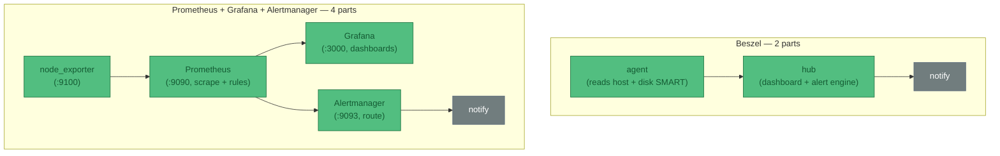

# ADR-005 — Homelab observability: trial Beszel vs Prometheus/Grafana/Alertmanager

**Status**: Superseded in part — see [Amendment (2026-09-07)](#amendment-2026-09-07-what-happened-when-i-tried-them) at the end. The trial ran; two of this ADR's premises turned out to be wrong.
**Date**: 2026-06-20 · **Amended**: 2026-09-07  
**Context**: The landscape is mapped in [reference/observability](../../reference/observability). For host metrics + dashboards + alerts on the homelab boxes, two approaches are worth trialling on real hardware. The rest are ruled out: **Netdata** (its RAM-growth bug is open and recurred on v2.8.2 in Dec 2025, the UI went proprietary, and it was dropped from Debian — enshittification), and **SigNoz** (OpenTelemetry/ClickHouse all-in-one — too enterprise-shaped and heavy for this scale).

**Decision**: Trial **Beszel** (lightweight, dashboard + alerts in one) and **Prometheus + Grafana + Alertmanager** (the standard, for when PromQL and the ecosystem are wanted). Minimal NixOS configs below. Beszel is the default-light; reach for the Prometheus stack only once Beszel's fixed metric set isn't enough.

:::info Dashboards are a parallel concern to alerts
Both stacks give you a **dashboard to *look* at CPU/RAM/IOPS trends** (proactive) *and* an **alert path to be *told*** (reactive). The dashboard is useful with zero alert rules set — see the reference page.

:::

## Moving parts — the deciding axis



Grafana *has* got easier — **Grafana Alloy** (one collector replacing node_exporter-scraping + promtail + OTel agents) and Grafana's **built-in unified alerting** (which can absorb standalone Alertmanager) both cut parts. But even slimmed, the Prometheus stack is 3–4 services to the Beszel stack's 2 (hub + agent, one binary each).

## Option A — Beszel (minimal, single box: hub + agent)

```nix
# Hub: web UI + alert engine. Agent: per-host metrics incl. disk I/O via SMART (your IOPS).
services.beszel.hub = {
  enable = true;
  host = "0.0.0.0";          # reach the UI from your LAN / tailnet
  port = 8090;
};

services.beszel.agent = {
  enable = true;
  smartmon.enable = true;     # disk I/O + SMART health (adds the agent to the disk group)
  openFirewall = true;        # hub -> agent on :45876
  # KEY = the hub's public key, shown in the hub UI's "Add System" dialog after first launch.
  # Use environmentFile (agenix) for real secrecy; inline shown for clarity:
  environment.KEY = "ssh-ed25519 AAAA...replace-me...";
};

networking.firewall.allowedTCPPorts = [ 8090 ];   # expose the dashboard
```

First-run: open `http://<host>:8090`, create the admin user, **Add System** (localhost, port 45876) → it shows the `KEY` to paste above → rebuild. Alerts (CPU/mem/disk/temp/status) are configured *in the hub UI*, delivered via Shoutrrr (ntfy, email, Telegram, webhook…). Two services, one box, done.

## Option B — Prometheus + Grafana + Alertmanager (minimal)

```nix
# node_exporter — exposes this host's CPU / RAM / disk-IOPS / net on :9100
services.prometheus.exporters.node.enable = true;

# Prometheus — scrape the exporter, evaluate alert rules, hand firing alerts to Alertmanager
services.prometheus = {
  enable = true;                                   # :9090
  scrapeConfigs = [{
    job_name = "node";
    static_configs = [{ targets = [ "localhost:9100" ]; }];
  }];
  rules = [''
    groups:
      - name: host
        rules:
          - alert: HighCPU
            expr: 100 - (avg by (instance) (rate(node_cpu_seconds_total{mode="idle"}[5m])) * 100) > 85
            for: 5m
            annotations: { summary: "CPU > 85% for 5m on {{ $labels.instance }}" }
  ''];
  alertmanagers = [{ static_configs = [{ targets = [ "localhost:9093" ]; }]; }];
};

# Alertmanager — route/dedupe firing alerts to a receiver
services.prometheus.alertmanager = {
  enable = true;                                   # :9093
  configuration = {
    route.receiver = "default";
    receivers = [{
      name = "default";
      # webhook shown; swap for email_configs / slack_configs / etc.
      webhook_configs = [{ url = "https://ntfy.sh/your-topic"; }];
    }];
  };
};

# Grafana — dashboards over Prometheus (datasource auto-provisioned)
services.grafana = {
  enable = true;                                   # :3000
  settings.server = { http_addr = "0.0.0.0"; http_port = 3000; };
  provision.datasources.settings.datasources = [{
    name = "Prometheus"; type = "prometheus"; url = "http://localhost:9090"; isDefault = true;
  }];
};

networking.firewall.allowedTCPPorts = [ 3000 ];    # expose Grafana
```

First-run: open Grafana on `:3000` (default admin/admin), the Prometheus datasource is already wired, import a node-exporter dashboard (e.g. Grafana dashboard ID 1860). Four services to Beszel's two.

:::warning ntfy receiver caveat
Alertmanager's `webhook_configs` POSTs *its own JSON* — ntfy will show that blob as the message body. For clean ntfy notifications use a small relay, an `email_configs` receiver, or **Grafana's built-in unified alerting** (richer contact points, and it lets you drop the standalone Alertmanager → one fewer part).

:::

## Consequences

- ✓ Both are pure NixOS modules — declared in `configuration.nix`, no Docker, reproducible.
- ✓ Beszel: 2 services, ~10 MB agent, disk-IOPS + SMART, dashboard + alerts in one — the low-maintenance default.
- ✓ Prometheus stack: PromQL, huge dashboard/exporter ecosystem, long retention — when you outgrow Beszel.
- ✗ Prometheus stack is 3–4 services + a query language to learn; clean ntfy needs a relay or Grafana alerting.
- ✗ Beszel is younger (v0.18.x) with a fixed metric set and no PromQL.
- **Trial plan:** run Beszel first (cheap to stand up); add the Prometheus stack on the same box to compare dashboards/alerting hands-on, then keep whichever earns its moving parts.

---

## Amendment (2026-09-07): what happened when I tried them

I installed eleven monitoring tools side by side on worker207. The machine has a Ryzen 7 7435HS, 31 GB of RAM, an RX 6600 and a 915 GB NVMe drive, so this was a useful comparison on real hardware rather than a reading exercise. The setup lives in `hosts/worker207/observability.nix`; the packages missing from nixpkgs are in `pkgs/monitorix.nix` and `pkgs/signoz.nix`.

The trial showed that the original ADR got two important things wrong.

First, Beszel can show systemd units and their status, CPU use, memory use and restart count, but it cannot alert when a unit fails. That is still an [open feature request](https://github.com/henrygd/beszel/issues/1813). This matters because failed service alerts were one of the reasons for considering Beszel in the first place.

Second, ruling out Netdata entirely was a mistake. The RAM concern has not gone away, but Netdata also works as a very capable Prometheus collector. On worker207 it exposed 6,202 metric lines with no configuration. I can use that output with another storage or alerting system, so the useful part of Netdata does not lock me into the rest of it.

One smaller correction: Alertmanager does not need a relay to send readable ntfy messages. The pinned nixpkgs has `services.prometheus.alertmanager-ntfy`.

### The tools do different jobs

A monitoring setup has four basic jobs: collect data, store it, let me inspect it, and tell me when something is wrong. The useful distinction between these tools is how many of those jobs they take over.


| Kind | What it does | Examples | If I replace it |
|---|---|---|---|
| Appliance | Handles all four jobs as one system | Beszel, Zabbix, Munin, Monitorix | I replace the whole system |
| Appliance with an open output | Handles all four but also exports standard metrics | Netdata | I can keep its collector and replace the rest |
| Platform | Stores, displays and alerts on data from another collector | OpenObserve, SigNoz, Grafana with Loki | I point the collector at a new platform |
| Composable tool | Does one job | node_exporter, VictoriaMetrics, Alertmanager | I replace that part only |
| Separate check | Answers a narrower question | Gatus, Uptime Kuma, Monit, systemd `OnFailure=` | Little or no effect on the metrics setup |

Open source on its own does not prevent lock-in. The interface between tools is what matters. OpenMetrics, Prometheus text and OTLP are widely supported. RRD files from Munin and Monitorix belong to me, but few other tools can do anything useful with their layout. Beszel and Zabbix agents speak to their own servers.

### What systemd should handle

systemd already knows when a service fails, so it should send that alert directly. A drop-in under `/etc/systemd/system/service.d/` adds `OnFailure=` to every service, including services installed later. A sweep timer catches failures that happened before boot or otherwise missed the transition. I tested this all the way through to ntfy on worker207.

It is also the right place for scheduling and service supervision through timers, `Restart=` and `WatchdogSec=`. It is not a metrics database. A timer can check `df` and send an alert, but it cannot show whether disk use has been climbing for six months or compare several hosts. Historical metrics still need a store.

### Revised decision

The original choice between Beszel and the full Prometheus and Grafana stack was too narrow. The setup I want is:

1. A systemd `OnFailure=` drop-in and sweep timer on every host. This is already deployed and catches failed units without maintaining a list of them.
2. Gatus for liveness checks. Its checks are YAML generated by Nix, with no account or web setup to preserve. It fills the role I would otherwise use Uptime Kuma for.
3. Netdata or node_exporter for collection, feeding VictoriaMetrics. Netdata gives broad coverage with almost no setup; node_exporter is the smaller option. Both use an open format. VictoriaMetrics is a single Go binary, understands PromQL and can replace Prometheus without bringing in Grafana.
4. Alert rules kept as YAML, with Alertmanager sending them to ntfy.
5. Grafana only if I later want its dashboards. VictoriaMetrics has `vmui` for ordinary queries, so Grafana is not a prerequisite.
6. Monit for inode thresholds, since the other tools tested here do not cover them cleanly.

The host side only depends on the metrics format. Replacing VictoriaMetrics with Prometheus, Mimir or OpenObserve should not require changing the collectors on every machine.

### What the OpenObserve trial now looks like

I took the OpenObserve branch far enough to judge it rather than stopping at an empty UI. worker207 now runs the OpenTelemetry contrib Collector alongside OpenObserve. One Collector process reads the usual host metrics and the system journal, tags them with `host.name = worker207`, and sends both over OTLP/HTTP.

This part is pleasantly ordinary. The Collector and its configuration come from nixpkgs. Its built-in `host_metrics` receiver covers CPU, memory, load, disks, filesystems, inodes, networking, paging and process counts. The journald receiver keeps its cursor on disk, so restarting the Collector does not replay the whole journal or lose its place. OpenObserve accepted both pipelines without an adapter or Prometheus in the middle.

The dashboard is not hand-built. OpenObserve maintains an official Host Metrics dashboard with thirteen panels for CPU, memory, load, disk and network activity. Nix fetches that JSON with a pinned hash, then a oneshot service imports it through the OpenObserve API. I checked the dashboard's actual PromQL against the stored worker207 data rather than only checking that the page loaded.

The import service is the hackiest part. OpenObserve stores dashboards in its own database, so Nix cannot declare one directly. The service waits for the API, looks for a dashboard titled `Host Metrics`, and either creates it or updates it in place. Updates need both the folder name and OpenObserve's current conflict hash. The list API also returns `dashboard_id`, while the dashboard JSON calls the same field `dashboardId`. None of this is difficult, but it is application-specific glue that we now own.

My honest rating is:

| Part | How hacky? | Why |
|---|---|---|
| Metrics and journal collection | Low | Standard NixOS module, standard Collector receivers and standard OTLP |
| Dashboard definition | Low | Upstream JSON, pinned by hash and editable if we decide to fork it |
| Dashboard provisioning | Medium | A small shell reconciler around OpenObserve's API |
| Authentication | Temporary | The trial still reuses the root password already present in the Nix file |

It currently works: OpenObserve has exactly one Host Metrics dashboard, its CPU and memory panels return data, the inode stream contains real ext4 values, journal messages are searchable, and all related units are healthy.

It is not fleet-ready yet. Before pointing other machines at it, the Collector settings should become a reusable NixOS module and authentication should move to a dedicated ingestion token held by agenix. The supplied dashboard does not include inode or AMD GPU panels. Inodes are already collected, so that is only a JSON dashboard change. GPU collection still needs a source, most likely Netdata's existing AMD metrics or a small dedicated collector. OpenObserve alert definitions also remain UI state until they are exported as JSON or managed with its OpenTofu provider.

So this is less of a Lego set than the earlier plan, but it is not an appliance. The working unit is now OpenTelemetry Collector, OpenObserve, and one versioned monitoring pack. Most of the remaining work is extending that pack, not adding more infrastructure services.

The VictoriaMetrics design above remains a paper recommendation; it has not been trialled on worker207. OpenObserve is now the measured next step, although this experiment does not yet make it the final fleet-wide choice.

### Finishing the SigNoz trial

I went back and finished SigNoz. The empty UI was not a dashboard problem. The earlier setup ran the SigNoz server and ClickHouse, but it had never created the telemetry schemas and nothing was listening for incoming OTLP data. SigNoz could authenticate me and had nowhere useful to look.

The fix was more involved than OpenObserve, although most of the work belongs to SigNoz rather than to my monitoring setup:

1. `pkgs/signoz-otel-collector.nix` packages SigNoz's collector release. This is not interchangeable with the ordinary contrib Collector. It contains SigNoz's ClickHouse exporters and its schema migration commands.
2. A oneshot unit runs the bootstrap, synchronous and asynchronous migrations before either the SigNoz collector or server starts.
3. The migration tool insists on issuing DDL against a named ClickHouse cluster, even with replication disabled. worker207 therefore has a one-node cluster backed by ClickHouse's embedded Keeper. There is still one database and one copy of the data.
4. The existing host Collector now sends each metric and journal batch to OpenObserve and SigNoz. It does not scrape the machine twice.
5. Nix fetches SigNoz's official Host Metrics VM dashboard and a oneshot service imports it through the V2 dashboard API. I initially misread SigNoz's internal "system dashboard reconciliation" log as proof that a visible dashboard existed. It did not. The dashboards list was empty until I added this importer. Create and update use slightly different documents: `generateName` is accepted on creation, while updates require the generated `name`. The service now makes that conversion so rebuilds remain idempotent.

This works. ClickHouse now has the `signoz_metrics`, `signoz_logs` and `signoz_traces` databases. I checked live series for CPU time, memory, disk I/O, filesystem capacity and inodes, network traffic, paging, load and process counts. Journal rows are arriving too. The visible Host Metrics dashboard has 18 panels and comes from SigNoz's maintained dashboard repository. The SigNoz UI is at `http://worker207:8080`; the existing account is `claude@worker207.local` with the trial password already used for it.

The awkward part is the database bootstrap. The official deployment assumes Kubernetes, a named ClickHouse cluster and ZooKeeper. ClickHouse Keeper is a sensible dependency for a real SigNoz installation, but it feels silly on this one-box trial. Skipping the `migrate ready` command is also deliberate: that command probes `system.zookeeper_connection` even when replication is off. The actual migrations are idempotent and run cleanly once ClickHouse is available.

My hackiness rating for SigNoz is medium. The runtime path is all standard OTLP and upstream SigNoz code. Packaging a release tarball in Nix is boring. Recreating the cluster assumptions of its Helm chart by hand is the part I would rather not own. It is considerably more machinery than OpenObserve for the same host dashboard.

### HyperDX and ClickStack

HyperDX now runs at `http://worker207:8085`. The login is `claude@worker207.local` with `Observability1!`.

I did not try to split HyperDX into native Nix services. The supported ready-to-run product is ClickStack, whose all-in-one image contains HyperDX, MongoDB, ClickHouse and its custom OpenTelemetry Collector. The Nix config declares that OCI container, pins it to version 2.8.0, maps the UI to port 8085 and keeps its OTLP/HTTP receiver on localhost port 4319. A named Docker volume preserves the account, sources and dashboards. Anonymous usage reporting is disabled.

The first account creates four usable sources automatically: logs, traces, metrics and browser sessions. It also creates the ingestion key. I added that key as a third exporter on the host Collector, so OpenObserve, SigNoz and HyperDX now receive the same host sample. HyperDX's ClickHouse tables contain CPU, RAM, network, disk, filesystem and inode metrics, plus journal messages.

HyperDX did not ship a ready-made host dashboard in this version. It does, however, store dashboards as portable JSON and has a normal HTTP API. I made a four-panel `Host Metrics` dashboard for CPU state, memory state, filesystem use and network direction. A oneshot Nix service logs in, discovers the automatically created metric source, then creates or updates that dashboard through the API. The first version passed HyperDX's JSON validation but used `Attributes.state` as a ClickHouse expression. The correct map lookup is `Attributes['state']`; the bad expression only failed when the browser tried to render a chart. The reconciler now writes the proper expressions.

HyperDX is low effort to try and high effort to own piecemeal. The container started with working schemas, sources and collector wiring, which is exactly the ready-to-go experience I was looking for. The cost is obvious when looking at the process list: one convenient container is still four systems. It also leaves some state outside Nix. The first user and ingestion key live in MongoDB, and the trial key currently appears in the Nix file so the host Collector can authenticate. That must move to agenix before another machine sends data here.

The dashboard reconciler is medium hackiness. The bundled platform itself is not hacky at all; it is the upstream installation method. I would keep ClickStack whole if HyperDX wins the trial. Replacing its internal ClickHouse or Collector just to make the process list look purer would bring the Lego problem straight back.

### Where this leaves the comparison

OpenObserve is still the simplest platform tested here. It needs one server binary, the ordinary Collector and a small dashboard importer. SigNoz gives a more opinionated infrastructure view but brings its custom collector, several ClickHouse schemas and Keeper. HyperDX has the quickest complete setup, the nicest path for logs and cross-signal work, and the heaviest black box.

All three now receive the same OTLP data. That is the part worth keeping regardless of which UI survives the trial. The systemd failure and failed-login alerts still go directly to ntfy, while Monit handles inode thresholds. I do not want a dashboard query engine in the critical path for those alerts.
