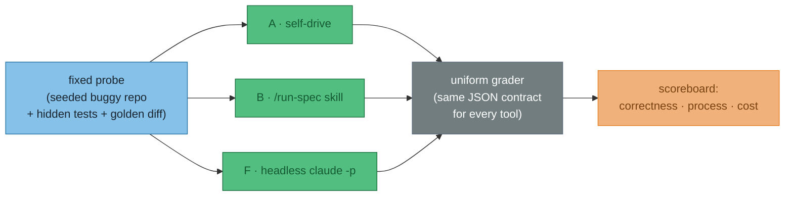
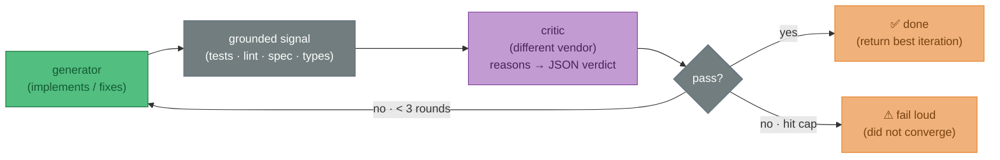
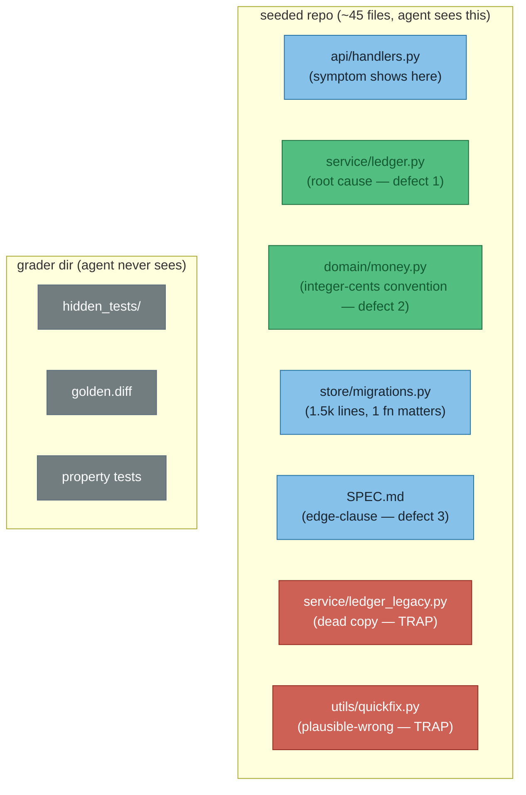
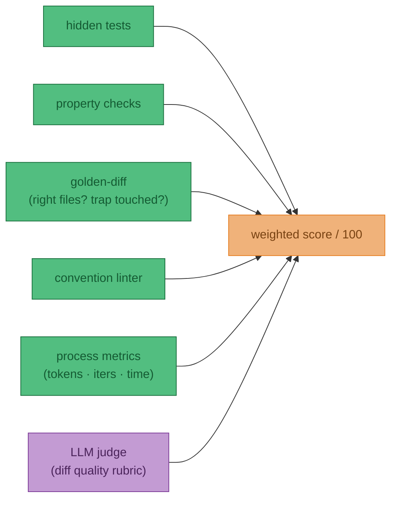

# ADR-007 — Meta-eval harness: scoring the orchestration options from ADR-001

**Status**: Proposed  
**Date**: 2026-06-24  
**Context**: [ADR-001](001-claude-code-orchestration) lists six ways to run an autonomous spec→implement→review→fix loop (options A–F) and ranks them on *predicted* effort and capability. Before committing to one, I want to **measure** them instead of guessing — run a hard, fixed coding task through each tool and score the *tool's behaviour*, not the LLM's answer. This ADR captures the goal, requirements, the probe-task design, and the grading criteria. It is the spec for a harness, not the harness.  
**Decision**: Not yet made — this records the approach and the open decisions (D1–D5 below).

:::warning Does NOT cover
Building the harness, picking the winning orchestrator, CI/scheduled runs, or a model-quality benchmark. This is **not** "which LLM writes better code" — the model is held roughly constant; the **orchestration tool** is what's under test.

:::

---

## The goal

ADR-001's comparison table is a set of *predictions* — "n8n: ~2–3 hours setup, visual debugging". The goal here is to replace prediction with **measurement**: one fixed probe task, run through each option, scored by **one grader that every tool feeds into**. The output is a scoreboard that answers "is the answer correct?" *and* "how good was the process to get there?".

The trap to avoid is judging tools **by vibes** — "option B *felt* smoother". A vibe is not a decision input. So the harness is built around objective, machine-computed signals (hidden tests, golden-diff, token counts), with an LLM-judge only as a secondary layer on the parts that genuinely need taste.

:::info The one idea that drives the design: test the tool, not the model
Same task, same underlying model, same grader — only the **orchestrator** changes between runs. So any difference in the scoreboard is attributable to the *tool's* loop control, file-reading strategy, and branching — which is exactly what ADR-001 needs to choose between A–F.

:::

---

## What we're actually testing: the loop

Every ADR-001 option is some wiring of the same shape — a **generator→critic→fix** loop with a stop condition. The harness exercises that shape and measures how each tool runs it.

Four findings from the research shape this loop — and the probe is designed so a tool that ignores them visibly loses:

- **Ground the critic.** Self-correction without an external signal degrades as often as it helps ("LLMs Cannot Self-Correct Reasoning Yet", DeepMind; Kamoi et al. survey). The bottleneck is *feedback generation, not refinement* — models fix things well *given* a reliable signal. So the critic is anchored on tests/lint/spec, not taste.
- **Different-vendor critic.** A model judging its own work rates it too highly (self-preference bias) because its errors and its judgment share priors. A critic from a different model family breaks that correlation.
- **Critic reasons in prose, then emits a JSON verdict last** (`findings[]` before the `pass` boolean). Forcing JSON too early hurts judgment.
- **Stop on: critic-pass (early exit) → no-change → max 3.** Gains land in rounds 1–2. Return the **best-scoring** iteration, not the last (loops can regress); **fail loud** if it never converges.

---

## Requirements

### Functional

| # | Requirement |
|---|-------------|
| R1 | A **fixed probe**: a seeded buggy repo committed at a known starting state, with hidden tests + a golden diff + graders kept in a sibling dir the agent never sees. |
| R2 | A **uniform grader** emitting one JSON contract — `{passed, files_read, tokens_in, tokens_out, iterations, touched_trap, wall_clock_s, score}` — so every option is scored identically. |
| R3 | **Per-tool adapters** that drive each option (A/B/E natively; C/F via a thin wrapper) and capture the transcript the grader parses. |
| R4 | **Repeatable runs** — each tool run 3–5× (agent variance is high; single runs mislead) with results aggregated. |
| R5 | **Reproducible probe** — `git reset` back to the seed state between runs; graders are deterministic. |

### The four capability axes (the user's questions, made measurable)

These are the things ADR-001 can't answer by prediction. The probe is engineered so each becomes a number.

| Axis | The question | How the probe forces it | Metric |
|------|--------------|-------------------------|--------|
| **Process efficiency** | "How efficient is this process?" | Same correctness bar for all tools; measure cost to converge. | tokens, wall-clock, iterations to pass |
| **Bounded loop** | "Can I have a stop loop (max 3)?" | Probe is **not 1-shot solvable** — needs ~2–3 critic rounds (see below). | did it stop cleanly at ≤3? returned best iteration? |
| **Smart file reading** | "Can it read files efficiently like Claude Code?" | ~45-file repo, scattered signal, one 1.5k-line file where 30 lines matter, plus a **trap file**. | files read, tokens spent reading, trap touched? |
| **Conditional branching** | "Can I configure trees to act on conditions?" | Distinct failure classes each demand a *different* response. | did it route the right fix to the right failure? |

---

## The probe task: "Ledger service"

A small HTTP service maintaining account balances, shipped in a **deliberately buggy** state. The naive fix turns the *visible* tests green but fails the *hidden* ones — that's the engine that forces multiple rounds.

### The three seeded defects (engineered to need ~3 rounds)

| # | Defect | Visible test | Why it forces a round |
|---|--------|--------------|-----------------------|
| 1 | **Concurrency — lost update**: `apply_transaction` does read-modify-write with no lock. | Passes (single-threaded). | Hidden **property test** runs N concurrent transfers, asserts total money is conserved. The trap `quickfix.py` suggests retry-on-conflict — plausible, still races. |
| 2 | **Off-by-one + convention**: a statement endpoint has an inclusive/exclusive boundary bug; balances are **integer cents** (convention in `money.py`, enforced nowhere obvious). | Passes (happy path). | Naive fix is tempting to write in float dollars → fails the convention linter and golden-diff. |
| 3 | **Spec edge-clause**: `SPEC.md` §6 — "reject transfers to a closed account, **except** reversals, which are always allowed." | Passes (never closes an account). | Hidden test closes an account and posts a reversal. |

:::tip Why this can't be one-shotted
Round 1 typically fixes the obvious off-by-one → visible tests green → critic runs hidden + property suite → concurrency and edge-clause fail → round 2 fixes one, often misses the race → round 3 converges. One shot is *structurally* blocked because the visible tests don't cover defects 1 and 3. Tune the round count by how many independent defects you seed.

:::

A lighter alternative if seeding a concurrency store is too much: a **sliding-window rate-limiter from spec** (naive fixed-window allows 2× burst at the boundary; property test catches it; same scoring shape). Weaker on the concurrency axis — pick the Ledger task if you want that axis, which is the strongest single discriminator.

---

## Scoring & grading criteria

Grade **process + quality**, mostly machine-computed. The objective spine carries ~85% of the score; the LLM-judge only adjudicates what taste is actually needed for.

| Criterion | Pts | How it's computed | Vibes-free? |
|-----------|----:|-------------------|:-----------:|
| Hidden test suite (incl. closed-account reversal) | 30 | run hidden tests, count pass | ✓ |
| Property test — money conservation under concurrency | 15 | Hypothesis-style invariant under N threads | ✓ |
| Golden-diff file-targeting + **no trap touched** | 20 | diff touches `ledger.py`/`money.py`, not `ledger_legacy.py`/`quickfix.py` | ✓ |
| Convention linter (integer-cents, no float in money paths) | 10 | regex/AST check | ✓ |
| Security (no unsafe construct introduced by the "fix") | 5 | static check | ✓ |
| **Process** — tokens / iterations / wall-clock, ranked across tools | 20 | parse transcript, rank | ✓ |
| *(tie-break)* LLM-judge diff-quality rubric | — | only when objective scores tie | judge |

The **process** block (20 pts) is where tools differ even when the answer is identical — "right answer in 40k tokens / 2 rounds" beats "right answer in 300k / 3 rounds". That delta is the whole reason the harness exists.

### Branching, made necessary

The probe's distinct failure classes each demand a *different* action, so a tool's routing logic is exercised rather than assumed:

| Signal | Correct route |
|--------|---------------|
| unit tests fail | fix-logic (re-implement the diff) |
| lint / convention fails | conform-to-convention (narrow, don't touch logic) |
| property fails but units pass | concurrency-hardening |
| security/review flag | security action |

A self-driving Claude (A) does this branching in prose; n8n (C) as explicit `IF` nodes; CrewAI (E) as a Flow `@router`. A tool that can't branch cleanly will misroute and lose points objectively.

---

## Existing tooling (don't reinvent)

| Tool | Role | Why |
|------|------|-----|
| **Inspect** (`inspect_ai`, UK AISI) | Eval runner for options it can drive (A/B/E) | Built for tool-calling multi-step agents; transcript of every step; **automatic token/cost tracking**; `model_graded_qa` for the critic-as-judge. Pure OSS Python, no SaaS. |
| **Arize Phoenix** | Live tracing | Local, OpenTelemetry; per-step token/cost/tool-call/latency for free. |
| **Uniform JSON grader** (ours) | The fair-comparison layer | Inspect only scores agents *it* drives; n8n (C) and headless `claude -p` (F) run outside it. One JSON contract every adapter emits into is what makes A–F comparable. |

Skip LangSmith/Braintrust (SaaS lock-in for a personal setup) and the public benchmarks (SWE-bench, terminal-bench — run *against* later, not the engine here).

---

## Open decisions

| # | Decision | Options | Lean |
|---|----------|---------|------|
| **D1** | Which options to wire first | All six / a contrasting pair | **B (skill) vs F (headless)** — prove the harness discriminates before scaling |
| **D2** | Critic model | same vendor / different vendor | **Different vendor** (self-preference bias) — pending gateway choice in ADR-001 Layer 1 |
| **D3** | Probe language | Python / TypeScript | **Python** (Hypothesis for property tests, fastest to seed) |
| **D4** | Probe task | Ledger / rate-limiter | **Ledger** (concurrency axis is the strongest discriminator) |
| **D5** | Run count for significance | 1 / 3 / 5 | **3–5** (agent variance) — start at 3 |

---

## Consequences

- ✓ Turns ADR-001's predicted comparison into a measured one — A–F scored on the same probe by the same grader.
- ✓ Kills "by vibes" tool selection: ~85% of the score is machine-computed.
- ✓ Reuses existing OSS (Inspect, Phoenix); the only bespoke piece is the uniform grader + probe repo.
- ✓ The probe doubles as a regression test for whichever loop we eventually adopt.
- ✗ Seeding a genuinely-hard-but-objectively-gradable probe is real work — the three defects must be tuned so it needs ~3 rounds without being unsolvable.
- ✗ Cross-tool fairness is fiddly: the JSON grader has to normalise transcripts from very different tools (native Inspect vs n8n node logs vs a shell wrapper).
- ✗ Multi-vendor critic (D2) depends on a gateway decision still open in ADR-001.
