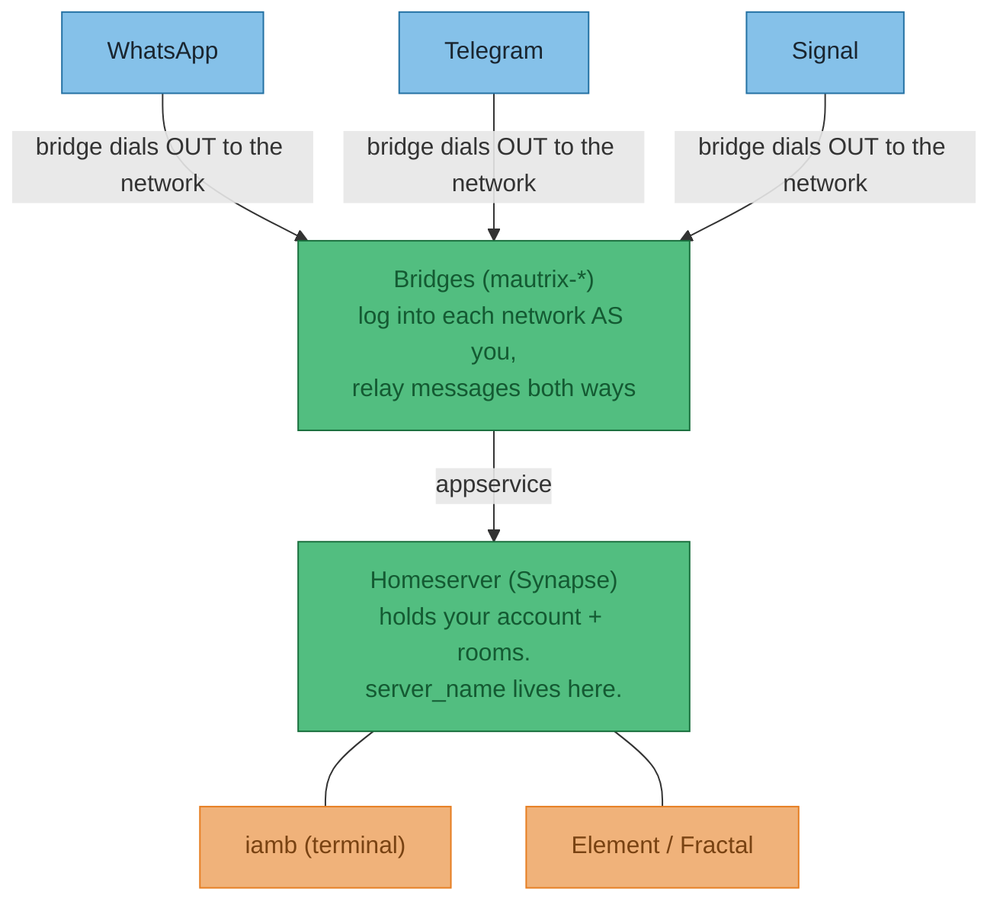
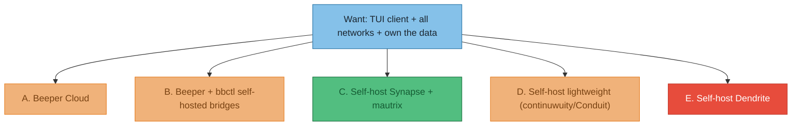
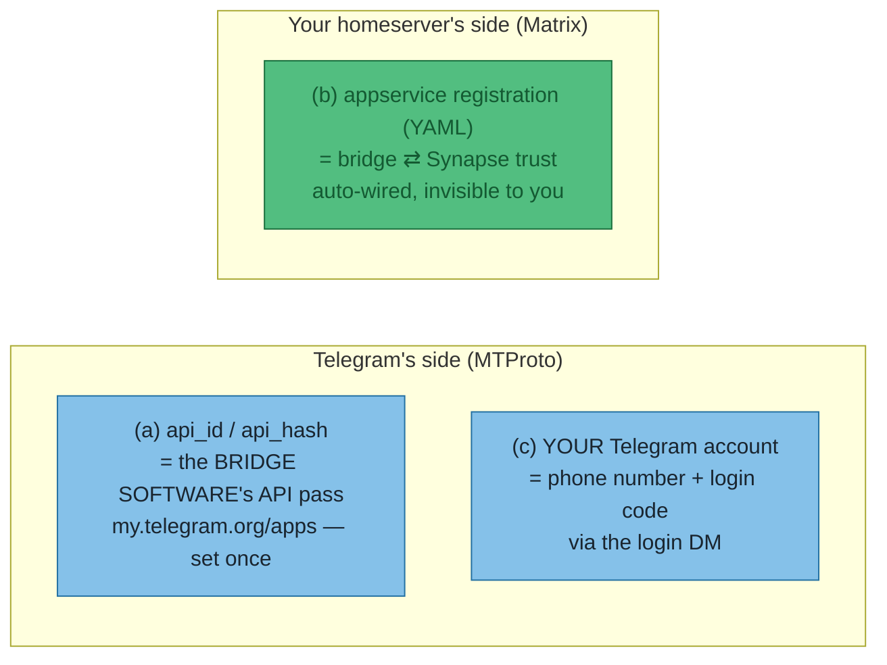
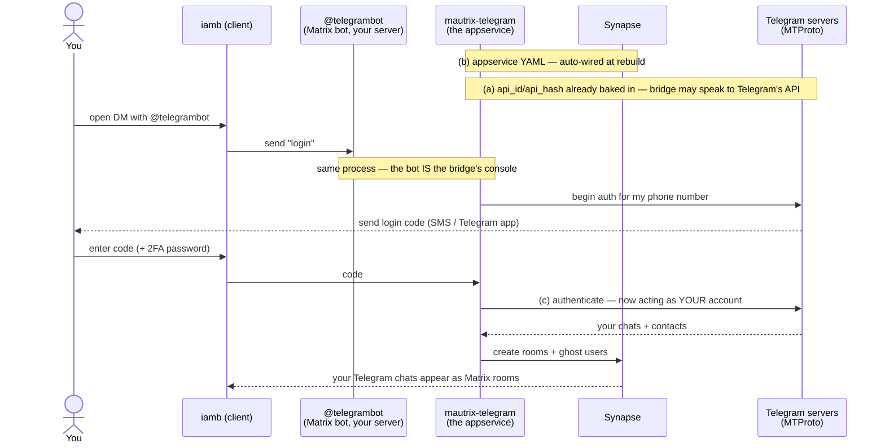
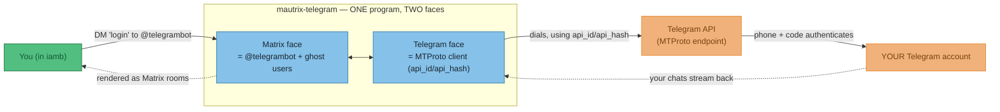
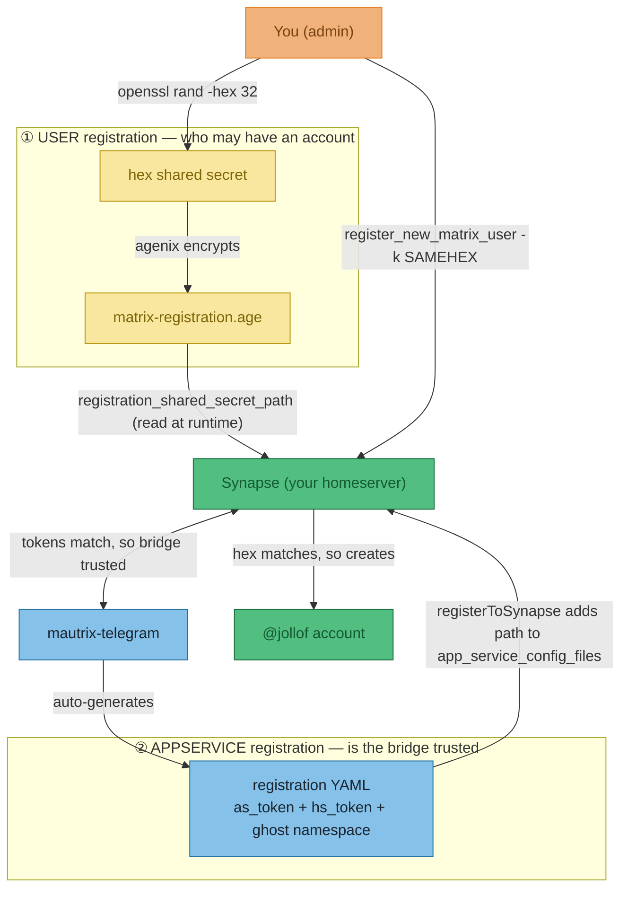
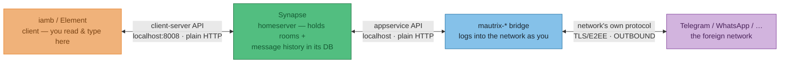

# ADR-009 — Unifying personal chats (WhatsApp/Telegram/Signal/…) via Matrix: self-host vs Beeper

**Status:** **Proposed** — direction chosen (self-host a Matrix homeserver + bridges, terminal client `iamb`). Test cut scaffolded on `desktop-work`; not yet rebuilt/validated. **Beeper** retained as the zero-maintenance fallback.

**Date:** 2026-06-25

**Goal:** one **terminal (TUI) client** showing all my chat networks (WhatsApp, Telegram, Signal, Slack, Messenger), with **my message content staying on hardware I control**. Starting account `@joelyboy:matrix.org` is a free, brand-new, **disposable** account on the public matrix.org homeserver — it has no bridges and never will (matrix.org runs none).

## Primer: how the pieces actually fit (this took the longest to get straight)

It is **not** a chain `Matrix → Element → client → WhatsApp`. It's a **hub**:



- **Matrix** = the open *protocol* (like SMTP/IMAP for chat). Nobody "uses Matrix" directly.
- **Homeserver** (e.g. **Synapse**) = the *server* that holds your account, rooms and history. Your account lives on exactly one. `server_name` is its identity.
- **Client** (iamb, Element, Fractal) = an interchangeable *front-end*. Swapping clients changes nothing about what you can see.
- **Bridge** (`mautrix-whatsapp`, `mautrix-telegram`, …) = a *server-side connector* that logs into the foreign network as you and turns each conversation into a normal Matrix room. **This is the only thing that knows how to talk to WhatsApp/Telegram.** Every client then shows those rooms automatically.

:::tip Why any client shows your WhatsApp/Telegram
Because the bridge turns those chats into ordinary Matrix rooms on the **server**. Clients just render whatever rooms the server has — so the network lives on the server, not in the app.
:::

## Options considered



| Option | TUI (iamb) | Content private to you | Metadata | Maintenance | Verdict |
|---|---|---|---|---|---|
| **A. Beeper Cloud** (free, Automattic-owned) | ⚠️ community-only; account is **passwordless** by default and third-party-client access appears to be **degrading**; needs E2EE key-import faff | ❌ cloud bridges decrypt on their servers | Beeper | ✅ none | Easiest; fails "own the data". **Kept as fallback.** |
| **B. Beeper + `bbctl`** (self-hosted official bridges) | ⚠️ same passwordless/client caveats | ✅ official bridges decrypt **locally**, zero-access E2EE at rest | ❌ still Beeper's homeserver | 🟡 medium | Fixes content privacy, **not** the TUI auth story; identity + metadata stay with Beeper. |
| **C. Self-host Synapse + mautrix** | ✅ native Matrix → iamb just works | ✅ everything on your box | ✅ yours | ❌ yours | ✅ **Chosen** — only option that cleanly meets both goals. |
| **D. continuwuity / Conduit** (Rust, ~20 MB RAM) | ✅ native | ✅ yours | ✅ yours | ❌ yours + more manual | Great for a tiny box, but bridge setup is hands-on (manual `!admin appservices register`; Python bridges like Telegram have an extra quirk) and docs are thin. **Reserve for if Synapse strains the Pi.** |
| **E. Dendrite** | ✅ native | ✅ yours | ✅ yours | ❌ yours | ❌ **Rejected** — mautrix states Dendrite "is not a supported environment… often has serious bugs"; the Signal bridge dropped it. |

**Client sub-decision:** **iamb** (terminal Matrix client) is the daily driver — it's the whole reason for self-hosting over Beeper. Element/Fractal usable too; they all hit the same homeserver.

### Client landscape — why `iamb`, and what else is out there

The whole point of self-hosting over Beeper is a **fast, terminal, vim-keybinding** client. Survey of the field (mid-2026), graded against that:

| Client | Type | Vim / modal | E2EE | Maturity | Verdict |
|---|---|---|---|---|---|
| **iamb** | Terminal TUI (Rust) | ✅ native (built on `modalkit`) | ✅ | Mature, active | ✅ **Chosen** — most complete terminal-native vim client; handles rooms, threads, spaces. Room sorting is config-only (`[settings.sort]`); message **formatting is limited** (TUI), the one real gripe. |
| **matui** | Terminal TUI (Rust) | ✅ modal; composes in `$EDITOR` (your real vim) | ✅ | Active (v0.6.x, Jun 2026) but author calls it "very early" | 🟡 Worth A/B-ing vs iamb purely for editing feel — its `$EDITOR` composition directly targets iamb's weak text-entry. **No room-join / moderation / threads yet** → secondary client only. |
| **mtrx** | Terminal TUI | ✅ modal (kakoune/vim-inspired) | ? | Experimental (sr.ht) | 🟡 Niche, unverified — note only. |
| **gomuks** (new) | Web/desktop + *partial* terminal | ❌ (Esc deletes the message; [issue #129](https://github.com/gomuks/gomuks/issues/129)) | ✅ | Active | ❌ The rewrite is **web-first**; the polished UI you'd see is the web app, not a TUI. Terminal frontend is half-baked (no in-terminal login yet, separate binary + backend). |
| **weechat-matrix** + `vimode` | weechat plugin | ✅ via the `vimode` plugin | ✅ | Mature protocol; plugin in maintenance | 🟡 Strong escape hatch **if** already living in weechat. |
| **ement.el** + `evil-mode` | Emacs | ✅ full vim via evil | ✅ | Mature, featureful | 🟡 Most *powerful* vim option — but only if Emacs is on the table. |
| **Element / Fractal** | GUI (Electron / GTK) | ❌ (shortcuts only, not remappable) | ✅ | Mature | Usable on the same homeserver, but no bindings → not the daily driver. |
| **mactrix** | **macOS** GUI (SwiftUI) | ❌ | ✅ | Early (v0.3, Jun 2026, active) | ❌ **macOS-only → N/A** on this NixOS/Linux fleet. Noted so it isn't re-discovered later. |

**Conclusion holds:** **iamb** is the only *mature, terminal-native, vim* client. **matui** is the one to watch (its external-`$EDITOR` composition is exactly what iamb's TUI editing lacks); everything else is non-vim (gomuks/Element), a heavier host-app route (weechat/Emacs), experimental (mtrx), or the wrong platform (mactrix).

## Decision

**Self-host Synapse + mautrix bridges; iamb as the client.**

- **Homeserver = Synapse** (not the lighter Rust servers). The only argument against it was RAM, and `free -h` on **pi-box (Raspberry Pi 4, 8 GB)** showed **~4.9 GB available** alongside SparkyFitness — a single-user Synapse + a couple of bridges runs in well under 1 GB, so it fits comfortably. Synapse wins on everything else: best bridge support, **auto-wiring** of the bridge into the homeserver, abundant docs.
- **`server_name = jollof.chat`**, user `@jollof:jollof.chat`. Permanent (baked into every user/room id); host-independent on purpose so moving boxes later doesn't make the id a lie. Only needs to be a real owned domain *if federation is ever enabled* — it won't be for a private bridge-only server.
- **Rollout:** prove the mechanic with **Telegram on `desktop-work`** (test cut, already scaffolded), then relocate to **pi-box** (its designated always-on "run-only" role) behind **Tailscale Serve**, and add WhatsApp/Signal.
- **SQLite**, not Postgres — fine for a single user, one fewer component.

:::note The friction was never RAM, modules, or wiring — it was docs
NixOS modules exist for *all* the homeservers, and `services.mautrix-telegram.registerToSynapse` auto-handles the scary appservice-registration wiring. The genuine cost of self-hosting here is **being the ops team** for the bridges (below), not the initial setup.
:::

## Key facts / gotchas worth keeping

:::info NAT — only inbound is the problem
A bridge dials **out** to WhatsApp/Telegram → works through any NAT/CGNAT. The only thing needing **inbound** reachability is *another machine reaching your homeserver* (remote clients **and** federation). **Tailscale** solves it cleanly: both ends dial out to the tailnet and get stitched together — nothing exposed publicly. All nix devices are already on the tailnet.
:::

:::warning Privacy is about *where the bridge decrypts*
WhatsApp/Signal are E2E-encrypted; a bridge **must** decrypt to translate to Matrix. Whoever runs the bridge sees plaintext at that point. Cloud bridge = their servers; self-host = only your hardware. **Signal via any bridge is a security downgrade** (decrypted off-device) — reconsider whether it belongs in the set.
:::

:::note Login mechanics differ per network
**Telegram needs no app and no QR** — you DM `@telegrambot:…`, send `login`, give your **phone number**, enter the **code Telegram sends you** (+ 2FA password if set). **WhatsApp** is the one that needs the phone app: you scan a **QR** via WhatsApp → Linked Devices, and that linked-device session can be dropped by WhatsApp, forcing a periodic re-scan (the main ongoing chore).
:::

:::tip Beeper, for the record
Free, Automattic-owned, freemium (future paid tier), **no ads / no data sale**. It *is* Matrix underneath (`matrix.beeper.com`), so a third-party client can connect — but new accounts are passwordless and that path is community-supported and looks to be tightening, with an E2EE key-export/verify dance. Good "just works" fallback; not a reliable TUI base.
:::

## Setup steps (the test cut on `desktop-work`)

Files added: `hosts/desktop-work/matrix.nix`, its import in `configuration.nix`, and two agenix entries in `secrets/secrets.nix`. Mirrors the `hosts/pi-box/sparkyfitness.nix` pattern.

1. **Telegram API creds** — at <https://my.telegram.org> (web login, no app): *API development tools* → create app → note `api_id` + `api_hash`.
2. **Create the two agenix secrets** (from `secrets/`):
   ```sh
   openssl rand -hex 32                 # the registration secret
   agenix -e matrix-registration.age    # paste ONLY the raw hex (no YAML)
   agenix -e mautrix-telegram-env.age   # MAUTRIX_TELEGRAM_TELEGRAM_API_ID=… / _API_HASH=…
   ```
3. **Rebuild:** `sudo nixos-rebuild switch --flake .#desktop-work`
4. **Create your account** (reuse the hex from step 2):
   ```sh
   nix shell nixpkgs#matrix-synapse -c \
     register_new_matrix_user -u jollof -a -k '<hex>' http://localhost:8008
   ```
5. **Connect + log in the bridge:** point **iamb** at `http://localhost:8008` (user `@jollof:jollof.chat`), DM `@telegrambot:jollof.chat`, send `login`, phone number → code → 2FA.

:::note Implementation notes that bit us
- Synapse reads the shared secret via **`registration_shared_secret_path`** (raw file, runtime, agenix) — mutually exclusive with `registration_shared_secret`, so don't set both. It's a valid Synapse key; it just won't appear in `search.nixos.org` because `services.matrix-synapse.settings` is freeform.
- `localhost:8008` over plain HTTP is fine *because localhost is a secure context*. Cross-machine access (from pi-box) will need **Tailscale Serve** for valid HTTPS — the `sparkyfitness.nix` systemd pattern.
- agenix secret `owner` must match each service user (`matrix-synapse`, `mautrix-telegram`).
:::

## Telegram auth has three layers (this is the bit that confused us)

Three different things all sound like "logging in." They happen at **different layers**, at **different times**, and only the **third** is what the [mau.fi authentication page](https://docs.mau.fi/bridges/python/telegram) documents. Untangling them is the whole game:

| # | Name | What it really is | Where it comes from | When |
|---|---|---|---|---|
| **(a)** | `api_id` / `api_hash` | The **bridge *software*'s** pass to use Telegram's API *at all*. Identifies the program, **not** you. | <https://my.telegram.org/apps> → env file | once, at setup |
| **(b)** | appservice registration (the YAML) | A **Matrix** trust handshake: lets the bridge puppet a namespace of "ghost" users + rooms on Synapse. | bridge generates it; `registerToSynapse=true` auto-wires it | at rebuild — **you never touch it** |
| **(c)** | the `login` DM | Authenticates **your real Telegram account** through the bridge. | DM `@telegrambot:jollof.chat` in iamb | after rebuild, interactively |



The end-to-end login flow, showing **who talks to whom** and where each layer kicks in:



### How `@telegrambot`, the Telegram API, your account and mautrix link up

The four names that kept tripping us up are **not four separate services** — three of them are *parts of the one bridge program*. `mautrix-telegram` sits between two worlds with **a face pointing at each**:

- **Matrix face** — to your homeserver it shows up as the control bot **`@telegrambot`** (where you type `login`) plus all the **ghost users** (one per Telegram contact). This face talks to Synapse using the appservice tokens.
- **Telegram face** — to Telegram it's an ordinary **MTProto client**, presenting your **`api_id`/`api_hash`** as its "allowed to use the API" pass. Once you log in, it holds a live session for **your real Telegram account**.

| Name | What it actually is |
|---|---|
| **mautrix** | the whole program — the hub |
| **`@telegrambot`** | its **Matrix-side** control bot — *a face of mautrix*, not a separate thing |
| **Telegram API** | the **door** mautrix dials to reach Telegram (needs `api_id`/`api_hash`) |
| **your Telegram account** | what mautrix logs into, *as you*, through that door |



:::info What is MTProto?
**MTProto** (*Mobile Transport Protocol*) is Telegram's bespoke encryption + transport protocol 
:::

## Two things called "registration" (don't conflate them)

The word **"registration"** gets reused for two unrelated jobs — the same trap as "telegram" appearing twice in the env var. One is about **who may have a user account**; the other is about **whether the bridge is trusted**. Different files, different purposes:

| | `registration_shared_secret_path` | the appservice "registration file" |
|---|---|---|
| **What it is** | a file holding your raw **hex secret** (`openssl rand -hex 32`) | a **YAML** with `as_token` / `hs_token` + a ghost-user namespace |
| **It's a…** | plain secret string — **NOT YAML** | YAML file |
| **"Registration" of what?** | registering **user accounts** | registering the **bridge** as an application service |
| **Used by** | `register_new_matrix_user -k '<hex>'` to mint your `@jollof` account | Synapse, to trust the bridge (the `as_token` from earlier) |
| **Who creates it** | **you** (`openssl` → agenix) | **auto-generated** by `registerToSynapse = true` |
| **Do you ever see it?** | yes — you paste the hex | no |

Here's how both slot into the whole picture — two independent "registrations" that both happen to point at Synapse:



:::tip Why you never specify the appservice YAML — even though the wiki does
A hand-rolled NixOS config lists the bridge's registration file by hand:

```nix
services.matrix-synapse.settings.app_service_config_files = [ "/path/to/registration.yaml" ];
```

`services.mautrix-telegram.registerToSynapse = true` (defaults true when Synapse is on the same host) **auto-appends that path for you**. So you provide *neither* the YAML *nor* the `app_service_config_files` line — that's the "auto-wiring" this ADR keeps praising. The **shared secret**, by contrast, you *do* provide, because it originates **outside** the system (your own `openssl`) — nothing can generate it for you.
:::

## Encryption & threat model

### How the pieces talk (current setup)

Three components, all on one box, talking over **plain HTTP on `127.0.0.1`**:



- **Client** (iamb/Element) and **bridge** never talk directly — they both talk to **Synapse**, which is the shared hub. A room is the meeting point: the client reads/writes events, the bridge reads/writes the same events and translates them to/from the network.
- The **only encrypted leg today** is bridge ⇄ network (the network's own transport). Everything *inside the box* — client⇄Synapse, Synapse⇄bridge, and the data at rest in every DB — is **plaintext**.

### (a) Optional layer: Matrix E2EE

Encrypts the *room events stored in Synapse* so Synapse holds only ciphertext. The "ends" are your **client** and the **bridge** (the bridge must hold keys to do its job). We **left it off** (and explicitly disabled it on mautrix-meta, which defaults it on): the bridge still keeps **plaintext in its own DB** and the **keys on the same box**, so it buys almost nothing here — while costing real friction (cross-signing, device verification, key backup, "unable to decrypt" errors in a TUI).

### (b) At-rest = LUKS (full-disk encryption), not E2EE

If the goal is "encrypted on the machine", the tool is **full-disk encryption (LUKS)** — it covers *everything* (Synapse DB, every bridge DB, logs) when the disk is at rest. Matrix E2EE can't deliver this (bridge DBs stay plaintext).

:::warning LUKS kills unattended reboot on a headless box
A LUKS volume needs a passphrase/key at boot. A headless **pi** can't type one — so true FDE means **no auto-boot**: after a power cut it stays locked until you **remote-unlock** (SSH-in-initrd, or a Tailscale-based unlock). That's the tradeoff to plan for before enabling it on the always-on box.
:::

(Note: **secrets** are already encrypted at rest via **agenix** — `.age` files are ciphertext, decrypted only into `/run/agenix` (RAM) at runtime. It's the **message databases** that need LUKS.)

### (c) Current threat model

Your instinct ("behind NAT, if someone's in my network I'm cooked") is *half* right — here's the precise picture:

| Threat | Covered now? | By what / what's needed |
|---|---|---|
| Random internet attacker | ✅ | Nothing is publicly exposed (localhost now; Tailscale-only on pi) |
| Other device on your LAN | ✅ | Synapse binds `127.0.0.1` — not even LAN-reachable, only processes *on the box* |
| Device on your tailnet (pi, later) | ⚠️ partial | still needs your **account login/token** to read messages; tighten with Tailscale ACLs |
| Stolen disk / SD card / cold backup | ❌ | needs **LUKS** — network position is irrelevant here |
| Box compromised (attacker gets root) | ❌ | **nothing at-rest helps** — keys are loaded in RAM |

So the corrections to "in my network = cooked":
- **Network access ≠ message access.** Reaching Synapse still requires your account auth; it's not an open door. And right now it's localhost-only, so your *own LAN* can't even reach it.
- **The real game-over is root on the box** (live keys in RAM) — no encryption scheme helps there.
- **Disk theft is a separate axis** entirely — NAT/Tailscale do nothing for it; only **LUKS** does. That's the one worth acting on for the physically-stealable pi.

## Consequences

- ✓ Any Matrix client (iamb) works natively; message content only ever decrypts on your hardware.
- ✓ Fits existing NixOS + Tailscale + agenix patterns; the test module relocates to pi-box almost verbatim.
- ✗ **You are the ops team** — Synapse/bridge updates, and especially the WhatsApp linked-device re-scan churn.
- ✗ Signal-via-bridge is a real security downgrade.
- ✗ More setup and upkeep than Beeper, which would do all of this for free (at the cost of cloud plaintext + a degrading TUI story).

:::note When to revisit
- WhatsApp re-link churn becomes annoying → fall back to **Beeper** (accept the cloud tradeoff).
- Synapse strains pi-box → switch that host to **continuwuity** (Rust, ~20 MB) or move to **streaming-server** (Beelink N100).
- Want to message other Matrix users (federation) → `server_name` must become a real owned domain + a public ingress.
:::
