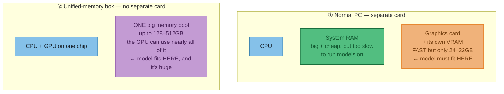
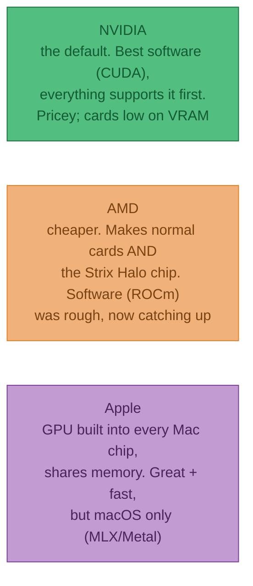
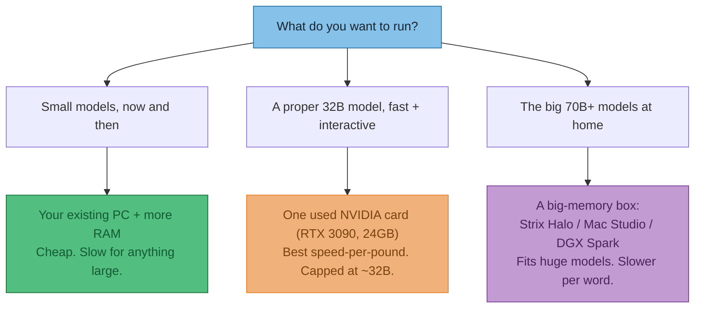
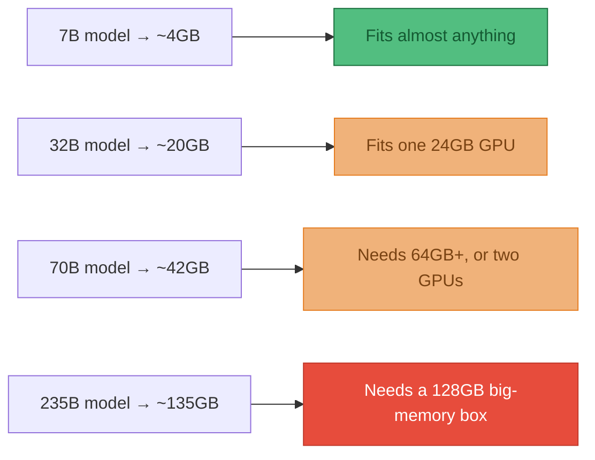
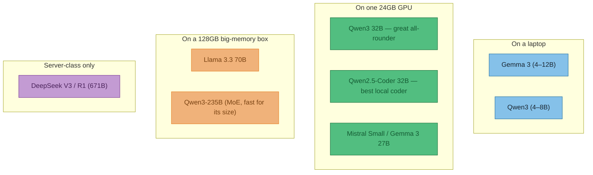
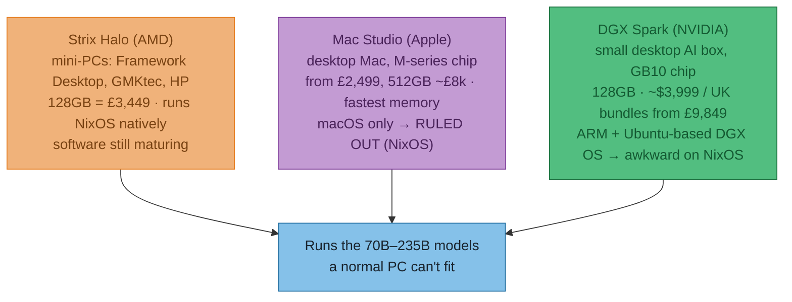
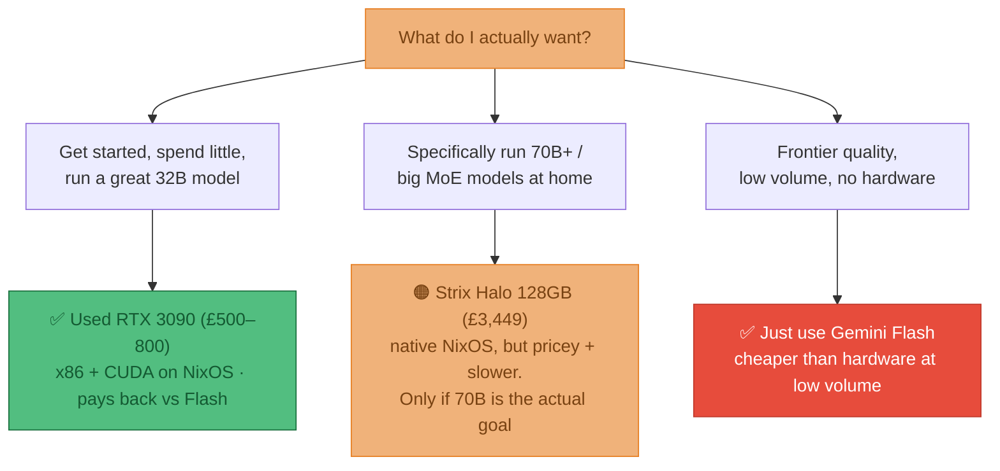

# ADR-010 — Running LLMs at home: what to run, and what to run it on

**Status:** **Proposed** — pricing researched 2026-07-15 (see [Pricing & verdict](#pricing--verdict-researched-2026-07-15)). Nothing bought yet; leaning toward a used NVIDIA GPU.
**Date:** 2026-07-15

**Goal:** start running open models locally. I know two things going in — RAM is expensive right now, and NVIDIA cards are pricey. I keep hearing "Strix Halo" but have no idea what it actually is. I want the trade-offs laid out honestly against a cheap cloud model (**Gemini Flash**), not a sales pitch for buying a GPU. My workflow is **NixOS**, which quietly rules some options in and out.

:::info What's confirmed vs still a guess
**Prices are real** — pulled from live UK listings on 2026-07-15 with screenshots + links in the [Pricing & verdict](#pricing--verdict-researched-2026-07-15) section. **Still from memory (Jan-2026 cutoff):** which open models are best, and Strix Halo's real-world tokens/sec — I priced the hardware, I didn't benchmark it. Those are flagged 💷 and listed as open questions at the end.
:::

## The one thing to understand first

:::tip It's a memory problem, not a speed problem
People assume you need a monster GPU for the *compute*. You don't. For running a model (not training one), you're limited by **memory**: first *"does the model even fit?"*, then *"how fast can the chip read the weights out of memory?"*. That second one — **memory bandwidth** — is what sets your words-per-second. Raw processing power barely gets a look-in.
:::

That single fact explains every hardware choice below. A cheap chip with *lots of fast memory* beats an expensive chip with *too little*.

## Your mental model, with one fix

You had it almost right: **CPU** (does the general work — barely matters here), **RAM** (where the model lives — matters a lot), **GPU** (does the heavy maths fast). The fix is this:

:::tip A graphics card has its *own* memory, and that's the real limit
When people say "big GPU" they really mean **big VRAM** — the fast memory *on the card itself*, separate from your system RAM. For a model to run fast it has to fit in **that** memory, not your normal RAM (which is too slow to feed the chip). And here's the wall: **consumer graphics cards only come with 24–32GB of it**, no matter how much system RAM you bolt on. That's why you can't just put 128GB of cheap RAM in a PC and run a giant model on the GPU.
:::

So there are really **two shapes of machine**, and this is the whole story:

:::warning The catch with unified memory
That shared pool is big, but it's usually **slower to read than a real graphics card's VRAM**. Remember: reading speed = words-per-second. So a unified box *fits* models a normal PC can't dream of, but churns through them more slowly. Big-but-slower vs small-but-fast — that's the whole trade.
:::

### "Only NVIDIA?" — no, three vendors matter

:::tip Why this matters for the big boxes
The three machines you asked about are each a **unified-memory box from one of these vendors**: Strix Halo = AMD, Mac Studio = Apple, DGX Spark = NVIDIA. They all dodge the 24GB VRAM wall the same way — one big shared pool instead of a separate card.
:::

## So which box? Three honest options

The tension in one line: **NVIDIA gives you speed but not much memory; the big-memory boxes give you room for huge models but read them more slowly.** Which pain you'd rather have depends on what you want to run.

## Does it fit? The only maths you need

Every model has a size on disk, and it needs to fit in memory with room to spare. You shrink it with **quantisation** — storing each weight in fewer bits. The rule of thumb:

> **memory needed ≈ (billions of parameters) × (bytes per weight)**, plus a bit of headroom.
> Full precision = 2 bytes. "Q8" ≈ 1 byte. "Q4" ≈ ½ byte and is the sensible default.

:::tip The trick that makes big models runnable at home: "MoE"
A **Mixture-of-Experts** model has a huge number of weights but only wakes up a *small slice* of them per word. DeepSeek's big model is 671B weights but only uses ~37B at a time. So it needs the *memory* of a giant model but runs at the *speed* of a small one. That's exactly what a big-memory-but-slower box (like Strix Halo) is good at.
:::

## What's worth running (early-2026 view 💷)

Grouped by the box you'd need. Names change fast; the *tiers* don't.

If I had to name one starting point: **Qwen3 32B on a 24GB card** is the "feels like a real assistant, runs on one affordable GPU" sweet spot.

## The three big-memory boxes, side by side

All three do the *same job* — fit a huge model by using one big unified memory pool instead of a graphics card. They differ on price, speed, and how painless the software is. Here's the shape of it:

:::tip Strix Halo — the one you'd never heard of
It's AMD's **Ryzen AI Max+ 395** chip: CPU + graphics + AI accelerator on one piece of silicon, wired to up to **128GB of shared memory the graphics can use directly** (💷 ~256 GB/s, unbenchmarked here). I *assumed* this was the cheap way in — but the RAM shortage has pushed the 128GB Framework Desktop to **£3,449** (see pricing below). Catch beyond price: it reads memory ~4× slower than a real GPU, so a dense 70B is *usable, not snappy* — but feed it an MoE model and it flies. **It's x86, so NixOS runs on it natively** — the big tick for my workflow.
:::

:::tip Mac Studio — fast, but off the table for me
Apple's desktop has the **fastest unified memory of the three** and scales to **512GB**. But it's **macOS only** — and my workflow is NixOS. `nix-darwin` manages a Mac but it isn't NixOS, and the whole point is to stay in my setup. **Ruled out.** Kept here only as a speed/price reference (from £2,499; a 512GB Ultra is ~£8k).
:::

:::tip DGX Spark — NVIDIA's software, but an awkward shape
A little desktop AI box from NVIDIA. Same 128GB-unified idea, and its draw is **CUDA**. But two problems for me: it's **~$3,999** and in the UK sells mostly as **multi-unit bundles (from £9,849)**, and the chip is **ARM** running NVIDIA's **Ubuntu-based DGX OS** — so NixOS would be an uphill fight against the vendor stack. Great engineering, wrong fit.
:::

:::warning How they rank (prices now confirmed, speed still assumed)
**Cheapest → dearest:** used GPU ≪ Strix Halo 128GB (£3,449) ≈ RTX 5090 (£3,400) < DGX Spark (£4k+/bundles) < Mac Studio 512GB (~£8k).
**Fits the biggest models:** Mac Studio (512GB) > Strix Halo / DGX Spark (128GB) > any single consumer GPU (24–32GB).
**Runs on NixOS:** ✅ Strix Halo & NVIDIA GPUs (x86) · ⚠️ DGX Spark (ARM + DGX OS) · ❌ Mac (macOS).
:::

## The honest bit: is any of this cheaper than Gemini Flash?

I assumed "no, not even close." The research softened that. **Flash got more expensive** — the current cheap-cloud tier isn't the £0.30/million I remembered:

| Google model (per 1M tokens, 2026-07-15) | Input | Output |
|---|---|---|
| **Gemini 3.5 Flash** — the smart-fast tier | $1.50 | **$9.00** |
| **Gemini 3.1 Flash-Lite** — the rock-bottom tier | $0.25 | **$1.50** |

:::tip So when does hardware pay for itself? (output tokens)
A **used RTX 3090 (~£650 ≈ $820)** breaks even against **Flash 3.5 output ($9/1M)** at roughly **90 million output tokens** — genuinely reachable if you use a model daily. Against the cheaper **Flash-Lite ($1.50/1M)** you'd need **~550 million**. A **£3,449 Strix Halo** needs ~**490M** (vs Flash) to ~**2.9 billion** (vs Flash-Lite). So: a cheap GPU *can* out-economise full Flash for a heavy user; a big-memory box almost never beats Flash-Lite on money alone.
:::

:::warning But cost is the wrong reason to buy
Even where the maths works, you're comparing a local **32B** model to Google's frontier-ish Flash — not the same quality. And this ignores electricity and your time. **Buy local for what Flash can't give you, not to save pennies:**
:::

| Go local for… | Just use Flash for… |
|---|---|
| Privacy — nothing leaves your machine | Highest quality with zero setup |
| No rate limits, no per-call billing | Lowest total cost at low/medium volume |
| Working offline | Not owning or maintaining hardware |
| Tinkering, fine-tuning, learning | One-off or occasional use |

The real question isn't "which GPU" — it's *"do I actually want what local gives me?"*

## Pricing & verdict (researched 2026-07-15)

All prices are live UK listings pulled on 2026-07-15, each with a screenshot and a working link. Currency: £ inc. VAT unless noted.

:::warning Headline: the RAM shortage wrecked my cheap-box assumption
I expected a 128GB Strix Halo at ~£1,500–2,000. It's **£3,449**. And 128GB of plain DDR5 is **£1,575**. High-capacity memory is the single most inflated thing in this whole comparison right now — which quietly kills both the "cheap unified box" and the "just stuff a PC with RAM" routes.
:::

### At a glance

| Option | Price (2026-07-15) | Usable memory | Runs on NixOS? | Best for |
|---|---|---|---|---|
| **Used RTX 3090** | **£500–800** | 24 GB VRAM | ✅ x86 + CUDA, proven | Fast 32B — the sensible start |
| **New RTX 5090** | £3,399–3,560 | 32 GB VRAM | ✅ x86 + CUDA | Fast 32B with headroom + gaming |
| **Strix Halo 128GB** (Framework) | £3,449 | ~96 GB of 128 | ✅ x86 native | 70B & big MoE at home |
| **DGX Spark** | ~$3,999 / UK bundles £9,849 | 128 GB | ⚠️ ARM + DGX OS | CUDA devs on Ubuntu |
| **Mac Studio** | £2,499 → ~£8k (512GB) | up to 512 GB | ❌ macOS only | *Ruled out for me* |
| **128GB DDR5 (CPU route)** | £1,575 (kit) | system RAM, slow | ✅ | Big models, slowly, on the cheap-ish |
| **Gemini Flash (cloud)** | $1.50–9 / 1M (3.5) | n/a | ✅ (it's an API) | The baseline to beat |

### 🟢 Used RTX 3090 (24 GB) — the sensible entry

**TL;DR:** £500–800 for 24 GB of fast VRAM. Runs Qwen3 32B — the "feels like a real assistant" sweet spot — quickly, on NixOS with the well-trodden NVIDIA+CUDA path.
**Pros:** cheapest way to *fast* local inference · best speed-per-pound · CUDA means everything just works · can genuinely pay for itself vs Flash 3.5 (~90M tokens).
**Cons:** 24 GB caps you around 32B (dense) · used-market lottery on condition · 350W and toasty.
🔗 [eBay UK — used RTX 3090 24GB](https://www.ebay.co.uk/sch/i.html?_nkw=rtx+3090+24gb&_sop=15&LH_ItemCondition=3000)

### 🟠 New RTX 5090 (32 GB)

**TL;DR:** £3,400+ for 32 GB and top speed. Same 24–32B ceiling as the 3090, just faster — and it doubles as a gaming card.
**Pros:** fastest consumer inference · newest, warrantied · 32 GB is a real step up for headroom.
**Cons:** ~£3,400 buys the *same memory class* as a £650 3090 · overkill unless you also game · still can't fit 70B comfortably.
🔗 [Scan UK — RTX 5090 cards](https://www.scan.co.uk/shop/computer-hardware/gpu-nvidia-gaming/nvidia-geforce-rtx-5090-graphics-cards)

### 🟣 Strix Halo 128GB — Framework Desktop

**TL;DR:** £3,449 buys 128 GB of unified memory — enough to run 70B dense and big MoE models a GPU can't hold. x86, so **NixOS runs natively** (Framework even has a Linux support tab). Slower per word than a real GPU.
**Pros:** by far the most memory-per-pound for *big* models · sips power vs a dGPU rig · native NixOS · one tidy mini-PC.
**Cons:** £3,449 is 5× a used 3090 for *slower* inference · AMD ROCm still rougher than CUDA · memory soldered (non-upgradeable) · dense-70B speed unverified (💷).
🔗 [Framework Desktop configurator](https://frame.work/gb/en/products/desktop-diy-amd-aimax300/configuration/new)

### ⚠️ NVIDIA DGX Spark — right idea, wrong shape for NixOS

**TL;DR:** NVIDIA's 128GB unified desktop box with CUDA. But it's an **ARM chip running Ubuntu-based DGX OS**, and in the UK it's sold mostly as pricey multi-unit bundles.

**Pros:** CUDA on a unified-memory box · NVIDIA's inference stack · 128 GB.
**Cons:** ARM + vendor DGX OS = fighting the stack on NixOS · ~$3,999 and UK bundles start at **£9,849** · scarce as a single unit.
🔗 [NVIDIA DGX Spark](https://www.nvidia.com/en-gb/products/workstations/dgx-spark/) · [Scan UK pricing](https://www.scan.co.uk/search?q=dgx+spark)

### ❌ Mac Studio — ruled out by NixOS (reference only)

**TL;DR:** Fastest unified memory, scales to 512 GB, but **macOS only** — it can't be part of a NixOS setup. Here purely as the speed/price yardstick.
🔗 [Apple UK — Mac Studio](https://www.apple.com/uk/shop/buy-mac/mac-studio)

### 🔵 The "just add RAM" route — killed by the shortage

**TL;DR:** Running big models on the CPU means lots of system RAM. But 128 GB of DDR5 is **£1,575** right now (a single 8 GB stick is £117 — roughly 4× normal). So the "cheap" route isn't cheap, and it's still the slowest option. Only sensible if you already own the RAM.
🔗 [Scan UK — 128GB DDR5 kits](https://www.scan.co.uk/search?q=corsair+vengeance+128gb+ddr5)

### Verdict for a NixOS workflow

:::tip My lean
**Start with a used RTX 3090.** It's the cheapest path to genuinely useful local inference, the NVIDIA+CUDA route on NixOS is boringly well-documented, and at £500–800 it can actually out-economise Flash 3.5 if I use it daily. **Strix Halo** is the *only* big-memory box that fits a NixOS life, but at £3,449 for slower-per-word inference it's a "I specifically need 70B at home" purchase, not a starter. **DGX Spark** (ARM/DGX OS) and **Mac Studio** (macOS) both fight my workflow — out. And for anything low-volume, **Flash is still cheaper than buying anything.**
:::

## Jargon, if you want it

:::details Every term used above, in plain English
| Term | What it means |
|---|---|
| **Parameter (7B, 70B…)** | The learned numbers inside the model. More usually means smarter but bigger. "B" = billion. |
| **Quantisation (Q4, Q8)** | Storing each number in fewer bits to shrink the model. Q4 (½ byte each) is the normal choice — much smaller, barely worse. |
| **GGUF** | The file format you download for tools like Ollama and LM Studio. |
| **VRAM** | Memory *on a graphics card*. If the model doesn't fit here, it spills to normal RAM and grinds. |
| **Unified memory** | One shared pool of memory the CPU and graphics both use (Apple, Strix Halo). Lets built-in graphics reach far more than a normal card. |
| **Memory bandwidth** | How fast the chip reads weights out of memory. This sets your words-per-second. Proper GPU ≫ unified memory ≫ plain system RAM. |
| **MoE / dense** | MoE wakes only a slice of its weights per word (big but fast). Dense uses all of them every time. |
| **Context window** | How much text the model can "see" at once. Longer context also eats more memory. |
| **tokens/sec** | Output speed. ~7 = reading pace, 30+ feels snappy, Flash-class cloud is 100+. |
| **Ollama / LM Studio / vLLM** | The apps that actually run the model. First two are easy desktop tools; vLLM is for servers. |
:::

## Decision

**Proposed — leaning used RTX 3090.** Pricing is done and points clearly: for a NixOS workflow, the sensible start is a **used RTX 3090 (£500–800)** running Qwen3 32B. **Strix Halo** stays on the shelf as the upgrade *if and when* I actually need 70B+ at home. **DGX Spark** and **Mac Studio** are out on workflow grounds (ARM/DGX OS and macOS). Not committing to buy until the two open questions below are closed.

**Consequences**
- ✓ Cheapest route to useful local inference; proven NVIDIA+CUDA path on NixOS.
- ✓ Can out-economise Flash 3.5 with daily use (~90M output tokens to break even).
- ✗ 24 GB caps me near 32B — no 70B dense without a second card or a big-memory box later.
- ✗ Used-market condition risk; high power draw.

## Still open (priced the hardware, didn't benchmark it)

1. 💷 **Which open models are actually best right now** — I confirmed the *cloud* side moved (Gemini 3.5 / 3.1 Flash are current), but didn't re-verify open-weight leaders beyond my Jan-2026 memory (Qwen3 / Llama 3.3 / DeepSeek). Worth a check before downloading.
2. 💷 **Strix Halo real tokens/sec** on a dense 70B and a big MoE — the whole "usable but slow" claim rests on community benchmarks I haven't pulled.
3. **AMD ROCm maturity on Strix Halo** vs CUDA — how much friction on NixOS specifically.
4. Whether a **second used 3090** (48 GB, ~£1,300) beats a Strix Halo for my needs — cheaper *and* faster for 70B, if noisier and more DIY.
