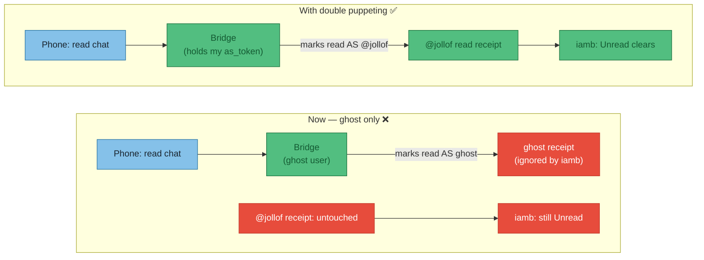
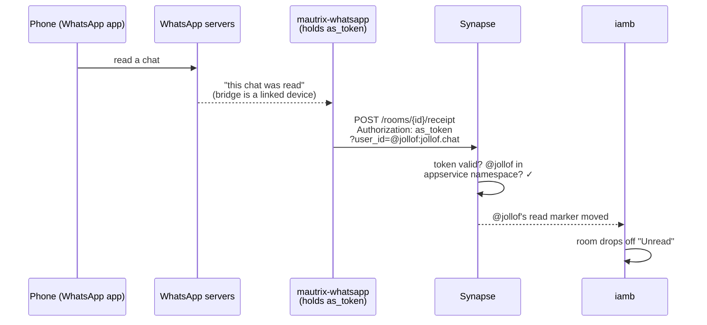

# ADR-011 — Bridge read state doesn't sync back: enable double puppeting

**Status:** **Proposed** — root cause identified; not yet applied to `hosts/pi-box/matrix.nix`.

**Date:** 2026-07-19

**Problem:** Chats read in the *native* apps (WhatsApp, Telegram, Signal, Messenger) stay **Unread** in `iamb`. Having to re-mark every chat read inside the TUI is poor QoL. See [ADR-009](009-personal-chat-matrix) for the underlying Matrix setup.

## Why it happens

`iamb` shows "Unread" purely from the Matrix **read receipt for my own user** (`@jollof:jollof.chat`) in each room. Nothing about the native app's read state matters unless something writes *my* read receipt into Matrix.

Today the bridges only operate as **ghost** users (the `(WA)` fake accounts). When I read on my phone, the bridge *does* receive that read event — but it can only mark the room read **as a ghost**, which does nothing to my unread count. The read-back path needs the bridge to act **as me**, and that is exactly what **double puppeting** provides.



## The mechanism: how an appservice lets a bridge "become me"

This is the bit that makes the rest make sense. Skip it and the Nix looks like magic.

An **application service** (appservice) is a privileged program the homeserver trusts. It's the same mechanism the bridges *already* use to create their ghost users — we're just registering one more, whose only job is to impersonate **me**. An appservice is defined entirely by a small registration file, and it carries two tokens that point in **opposite directions**:

- **`as_token`** (appservice → homeserver): the appservice puts this in the `Authorization` header on every request it makes *to* Synapse. The key privilege: it can add `?user_id=@someone` to a request and Synapse will treat the request **as if that user made it** — *provided* `@someone` matches the appservice's `namespaces.users` regex. This masquerading is the entire trick.
- **`hs_token`** (homeserver → appservice): Synapse puts this in requests it pushes *to* the appservice (new events, via `url`). Our puppet appservice sets `url:` empty — it never wants to *receive* anything, only to *act* — so this token exists to satisfy the schema but is effectively unused.

So the chain that clears an unread, end to end:



Without the appservice, the bridge has no `as_token` for my account, so step 3 can only be sent as a ghost — Synapse won't let a ghost move *my* read marker, so the receipt lands on the wrong user and iamb never sees it.

## Decision

Register a single **double-puppet appservice** with Synapse and hand its `as_token` to each bridge under `double_puppet`. One registration covers all four bridges (the namespace matches my user, and every bridge puppets the *same* `@jollof`). Token lives in **agenix** — never inlined into the Nix store (bridge settings render to a world-readable file there).

## How it looks in Nix

Sketch for `hosts/pi-box/matrix.nix` (appservice method — I have homeserver admin, so no `login-matrix` dance needed):

```nix
{ pkgs, config, ... }:
let
  serverName = "jollof.chat";
  # doublepuppet.yaml is stored as an agenix secret (contains the as_token),
  # so the token never hits the Nix store. Decrypts to a path Synapse reads.
  doublePuppetRegistration = config.age.secrets.matrix-doublepuppet.path;
in {
  # 1. Synapse loads the extra appservice registration
  services.matrix-synapse.settings.app_service_config_files = [
    doublePuppetRegistration
  ];

  # 2. Each bridge trusts that appservice to puppet my user.
  #    The as_token is injected via environmentFile (agenix), referenced as
  #    an env var so it isn't written into the store.
  services.mautrix-whatsapp.settings.double_puppet.secrets.${serverName} =
    "as_token:$DOUBLEPUPPET_AS_TOKEN";
  services.mautrix-signal.settings.double_puppet.secrets.${serverName} =
    "as_token:$DOUBLEPUPPET_AS_TOKEN";
  services.mautrix-telegram.settings.double_puppet.secrets.${serverName} =
    "as_token:$DOUBLEPUPPET_AS_TOKEN";
  services.mautrix-meta.instances.facebook.settings.double_puppet.secrets.${serverName} =
    "as_token:$DOUBLEPUPPET_AS_TOKEN";

  age.secrets.matrix-doublepuppet = {
    file = ../../secrets/matrix-doublepuppet.age;   # the doublepuppet.yaml
    owner = "matrix-synapse";
  };
}
```

### Walking through the Nix

How the four pieces above actually connect:

1. **`app_service_config_files`** is Synapse's list of appservices to trust. Adding the decrypted `doublepuppet.yaml` path here is what makes Synapse *accept* the `as_token` and honour the `?user_id=@jollof` masquerade. Without this line the token is just a random string Synapse has never heard of. The existing bridges add themselves to this list automatically (that's what `registerToSynapse` / `enable` does under the hood); our puppet appservice isn't a NixOS service, so we register it by hand.
2. **`double_puppet.secrets.<serverName>`** tells each bridge: "to puppet users on `jollof.chat`, authenticate with *this* secret." The `"as_token:..."` prefix is mautrix's syntax for "the string after the colon is a raw appservice token" (the alternative prefix is `"login:"` for the shared-secret method — not what we're using). The key `${serverName}` matters because the bridge picks the secret by the *homeserver of the user it's puppeting* — all my accounts live on `jollof.chat`, so one entry covers everything.
3. **`$DOUBLEPUPPET_AS_TOKEN`** is not a Nix value — it's a literal string that lands in the generated YAML and gets substituted at service start. The nixpkgs mautrix modules run their rendered config through `envsubst` when an `environmentFile` is set (this is the *same* trick already used for Telegram's `api_id`/`api_hash` — "real values via environmentFile" in the current file). So the actual token never appears in the Nix store; it's read from the agenix-decrypted env file at runtime. You'd add `environmentFile = config.age.secrets.matrix-doublepuppet-env.path;` to each bridge and put `DOUBLEPUPPET_AS_TOKEN=<token>` in that file.
4. **`age.secrets.matrix-doublepuppet`** decrypts the full registration YAML to a path Synapse (its `owner`) can read. This is the copy Synapse validates against; the bridges get the *same* token via the env file in step 3. **Both copies must carry the identical token** — that's the one value to keep in sync between the two secrets.

:::warning Two secrets, one token
The token appears in two places by necessity: the **registration file** (so Synapse recognises it) and the **bridge env** (so the bridges present it). They must match exactly. Generate the token once (`openssl rand -hex 32`), then paste it into both agenix files.
:::

The `doublepuppet.yaml` that gets encrypted into `matrix-doublepuppet.age`:

```yaml
id: doublepuppet
url:                          # empty: this appservice receives nothing, only puppets
as_token: "<generated-random-token>"
hs_token: "<generated-random-token>"
sender_localpart: doublepuppet   # a sender that no real user will ever be
rate_limited: false
namespaces:
  users:
    - regex: '@jollof:jollof\.chat'
      exclusive: false         # non-exclusive: I still own my own account
```

### The registration file, field by field

- **`id`** — a unique name for this appservice on the homeserver. Must not collide with the bridges' own IDs (`whatsapp`, `signal`, …).
- **`url`** — where Synapse would *push* events to. **Empty on purpose**: this appservice only ever pushes *out* (masquerading as me); it never needs to receive. Empty `url` = "don't try to deliver anything to me," which is why `hs_token` goes unused.
- **`as_token` / `hs_token`** — the two directional tokens from the mechanism section. Generate both as long random strings. The `as_token` is the one the bridges must also hold.
- **`sender_localpart`** — every appservice gets one implicit bot user, `@<sender_localpart>:jollof.chat`. We never use it, but it must be a name no real person will register (`doublepuppet`), or you'd hand control of a real account to the appservice.
- **`namespaces.users.regex`** — the guest list for masquerading. Synapse only honours `?user_id=X` if `X` matches this. It's scoped tightly to *just* `@jollof` — not `@.*` — so even if the token leaked, it could only impersonate me, not every user on the server.
- **`exclusive: false`** — the load-bearing flag. `exclusive: true` would mean "*only* this appservice may own `@jollof`," which locks me out of logging in from iamb or my phone. `false` = "the appservice may *act as* me, but I still own the account normally." Getting this wrong is the classic way to brick your own login.

## Consequences / caveats

- **Telegram & Signal** should sync read state reliably once puppeted.
- **WhatsApp** stays the flakiest — known gaps with "LID DMs" ([mautrix/whatsapp#891](https://github.com/mautrix/whatsapp/issues/891)); expect some chats to still need a manual read.
- **Meta/Facebook** bridge has E2EE disabled here (ADR-009), so no extra key handling needed for the puppet.
- Historical unreads won't retroactively clear — only reads made *after* this is live sync back.

## Sources

- [Double puppeting — mautrix docs](https://docs.mau.fi/bridges/general/double-puppeting.html)
- [Troubleshooting & FAQ — mautrix docs](https://docs.mau.fi/bridges/general/troubleshooting.html)
- [mautrix-whatsapp CHANGELOG](https://github.com/mautrix/whatsapp/blob/main/CHANGELOG.md)
- [iamb configuration](https://iamb.chat/configure.html)
</content>
</invoke>
