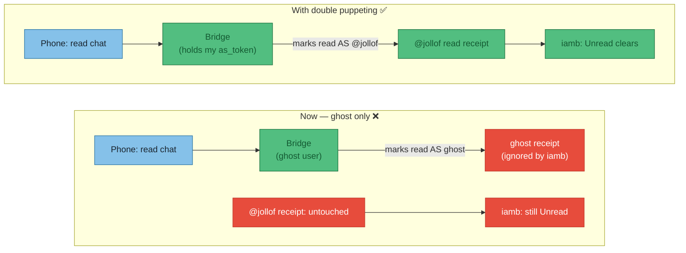
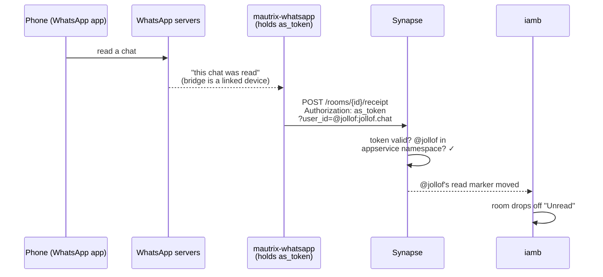
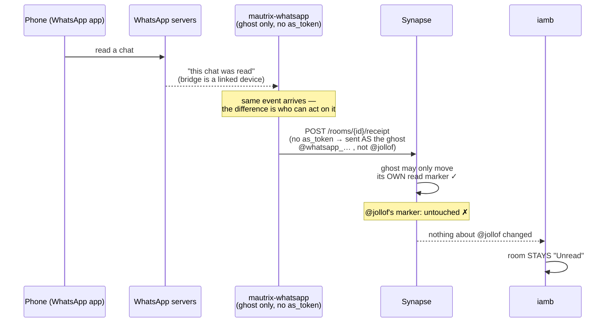
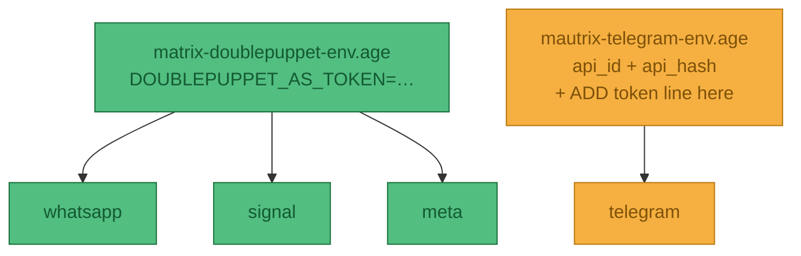

# ADR-011 — Bridge read state doesn't sync back: enable double puppeting

**Status:** **Proposed** — root cause identified; not yet applied to `hosts/pi-box/matrix.nix`. Nix sketch below corrected after checking the modules actually pinned in `flake.lock` — see [Reality check](#reality-check-verified-against-this-boxs-nixpkgs).

**Date:** 2026-07-19

**Problem:** Chats read in the *native* apps (WhatsApp, Telegram, Signal, Messenger) stay **Unread** in `iamb`. Having to re-mark every chat read inside the TUI is poor QoL. See [ADR-009](009-personal-chat-matrix) for the underlying Matrix setup.

## Why it happens

`iamb` shows "Unread" purely from the Matrix **read receipt for my own user** (`@jollof:jollof.chat`) in each room. Nothing about the native app's read state matters unless something writes *my* read receipt into Matrix.

Today the bridges only operate as **ghost** users (the `(WA)` fake accounts). When I read on my phone, the bridge *does* receive that read event — but it can only mark the room read **as a ghost**, which does nothing to my unread count. The read-back path needs the bridge to act **as me**, and that is exactly what **double puppeting** provides.



## The mechanism: how an appservice lets a bridge "become me"

This is the bit that makes the rest make sense. Skip it and the Nix looks like magic.

An **application service** (appservice) is a privileged program the homeserver trusts. It's the same mechanism the bridges *already* use to create their ghost users — we're just registering one more, whose only job is to impersonate **me**. An appservice is defined entirely by a small registration file, and it carries two tokens that point in **opposite directions**:

- **`as_token`** (appservice → homeserver): the appservice puts this in the `Authorization` header on every request it makes *to* Synapse. The key privilege: it can add `?user_id=@someone` to a request and Synapse will treat the request **as if that user made it** — *provided* `@someone` matches the appservice's `namespaces.users` regex. This masquerading is the entire trick.
- **`hs_token`** (homeserver → appservice): Synapse puts this in requests it pushes *to* the appservice (new events, via `url`). Our puppet appservice sets `url:` empty — it never wants to *receive* anything, only to *act* — so this token exists to satisfy the schema but is effectively unused.

So the chain that clears an unread, end to end:



Without the appservice, the bridge has no `as_token` for my account, so step 3 can only be sent as a ghost — Synapse won't let a ghost move *my* read marker, so the receipt lands on the wrong user and iamb never sees it. Here's that same chain **as it runs today**, breaking at the same step:



The bridge, WhatsApp, and Synapse are all working correctly — the read event even arrives. It fails only because the receipt is stamped on the ghost instead of on me, and iamb only ever watches `@jollof`.

## Decision

Register a single **double-puppet appservice** with Synapse and hand its `as_token` to each bridge under `double_puppet`. One registration covers all four bridges (the namespace matches my user, and every bridge puppets the *same* `@jollof`). Token lives in **agenix** — never inlined into the Nix store (bridge settings render to a world-readable file there).

## Reality check (verified against this box's nixpkgs)

Checked the modules actually pinned in `flake.lock`. Two facts reshape the config.

**1. Three Go bridges, one Python bridge.** WhatsApp/Signal/Meta are Go; Telegram is still the old Python bridge (v0.15.3 — nixpkgs hasn't picked up the [Go rewrite](https://mau.fi/blog/2026-04-mautrix-release/) yet). Different codebase → different config key.

| Bridge | Lang | Double-puppet config key |
|---|---|---|
| whatsapp / signal / meta | Go | `double_puppet.secrets.<domain>` |
| telegram | Python | `bridge.login_shared_secret_map.<domain>` |

**2. `environmentFile` is one file, not a list** (`types.nullOr types.path`). Telegram *already* uses its env file for `api_id`/`api_hash`, so its token goes *into that same file* — you can't attach a second. The three Go bridges have no env file today, so they share one new one.



## How it looks in Nix

Appservice method — I have homeserver admin, so no `login-matrix` dance.

```nix
{ config, ... }:
let
  serverName = "jollof.chat";
  # doublepuppet.yaml (holds the as_token) is an agenix secret, so the token never
  # hits the world-readable Nix store. Decrypts to a path Synapse reads.
  reg = config.age.secrets.matrix-doublepuppet.path;
in {
  # 1. Synapse trusts the extra appservice. Merges with the entries each bridge
  #    adds via registerToSynapse (app_service_config_files is a list).
  services.matrix-synapse.settings.app_service_config_files = [ reg ];
  systemd.services.matrix-synapse.restartTriggers = [ reg ];  # reload if token changes

  # 2. Go bridges (wa/signal/meta): SAME key. "as_token:$VAR" lands literally in the
  #    rendered config, then the module's envsubst substitutes $VAR from environmentFile
  #    at start -> real token stays out of the store (same trick Telegram uses today).
  #    Option docs:   https://search.nixos.org/options?channel=unstable&query=mautrix-whatsapp
  #    Module source: https://github.com/NixOS/nixpkgs/blob/nixos-unstable/nixos/modules/services/matrix/mautrix-whatsapp.nix
  services.mautrix-whatsapp.environmentFile = config.age.secrets.matrix-doublepuppet-env.path;
  services.mautrix-whatsapp.settings.double_puppet.secrets.${serverName} = "as_token:$DOUBLEPUPPET_AS_TOKEN";
  services.mautrix-signal.environmentFile = config.age.secrets.matrix-doublepuppet-env.path;
  services.mautrix-signal.settings.double_puppet.secrets.${serverName} = "as_token:$DOUBLEPUPPET_AS_TOKEN";
  services.mautrix-meta.instances.facebook.environmentFile = config.age.secrets.matrix-doublepuppet-env.path;
  services.mautrix-meta.instances.facebook.settings.double_puppet.secrets.${serverName} = "as_token:$DOUBLEPUPPET_AS_TOKEN";

  # 3. Telegram (Python): DIFFERENT key, and it ALREADY has an environmentFile.
  #    Do NOT set environmentFile here (it would clobber api_id/api_hash). Instead add the
  #    token to the EXISTING mautrix-telegram-env.age as the JSON-map env var (see below):
  #      MAUTRIX_TELEGRAM_BRIDGE_LOGIN_SHARED_SECRET_MAP=json::{"jollof.chat":"as_token:<token>"}
  #    Telegram module: https://github.com/NixOS/nixpkgs/blob/nixos-unstable/nixos/modules/services/matrix/mautrix-telegram.nix

  age.secrets.matrix-doublepuppet = {
    file = ../../secrets/matrix-doublepuppet.age;   # the doublepuppet.yaml registration
    owner = "matrix-synapse";
  };
  age.secrets.matrix-doublepuppet-env.file = ../../secrets/matrix-doublepuppet-env.age;
}
```

### Walking through the Nix

1. **`app_service_config_files`** is Synapse's trust list. Adding the decrypted `doublepuppet.yaml` is what makes Synapse honour the `?user_id=@jollof` masquerade. Bridges add themselves via `registerToSynapse`; ours is manual (it isn't a NixOS service). `restartTriggers` makes Synapse reload when the token rotates.
2. **`double_puppet.secrets.<serverName>`** = "to puppet users on `jollof.chat`, use this secret." `as_token:` = "raw appservice token" (vs `login:` = shared-secret method). Keyed by the *puppeted user's* homeserver — all my accounts are on `jollof.chat`, so one entry covers all.
3. **`$DOUBLEPUPPET_AS_TOKEN`** is a literal string in the rendered YAML, swapped in at start by the module's `envsubst` (same mechanism Telegram uses for `api_id`/`api_hash`). Token comes from the agenix env file, never the store.
4. **`age.secrets.matrix-doublepuppet`** decrypts the registration YAML for Synapse; the bridges get the *same* token via the env file. **Both copies must carry the identical token.**

:::warning One token, two files
The token lives in the **registration file** (so Synapse recognises it) *and* the **bridge env** (so bridges present it). Generate once (`openssl rand -hex 32`), paste into both agenix files.
:::

### The Telegram `..._MAP` env var, decoded

Telegram's env var isn't a plain token — it's a **map** (homeserver → secret), so the value must be JSON. mautrix only parses it as JSON when you prefix with `json::`; without the prefix it's treated as a plain string and ignored.

```text
MAUTRIX_TELEGRAM_BRIDGE_LOGIN_SHARED_SECRET_MAP = json::{"jollof.chat":"as_token:<token>"}
└──────── sets bridge.login_shared_secret_map ────────┘  └ "parse rest as JSON" ┘
```

Why a map: one bridge could puppet users across several homeservers, one secret each. We only have `jollof.chat`, so it's a one-entry map. **Caveat:** confirm the Python bridge (v0.15.3) accepts the `as_token:` prefix; if not, fall back to the shared-secret login method.

The `doublepuppet.yaml` that gets encrypted into `matrix-doublepuppet.age`:

```yaml
id: doublepuppet
url:                          # empty: this appservice receives nothing, only puppets
as_token: "<generated-random-token>"
hs_token: "<generated-random-token>"
sender_localpart: doublepuppet   # a sender that no real user will ever be
rate_limited: false
namespaces:
  users:
    - regex: '@jollof:jollof\.chat'
      exclusive: false         # non-exclusive: I still own my own account
```

### The registration file, field by field

- **`id`** — a unique name for this appservice on the homeserver. Must not collide with the bridges' own IDs (`whatsapp`, `signal`, …).
- **`url`** — where Synapse would *push* events to. **Empty on purpose**: this appservice only ever pushes *out* (masquerading as me); it never needs to receive. Empty `url` = "don't try to deliver anything to me," which is why `hs_token` goes unused.
- **`as_token` / `hs_token`** — the two directional tokens from the mechanism section. Generate both as long random strings. The `as_token` is the one the bridges must also hold.
- **`sender_localpart`** — every appservice gets one implicit bot user, `@<sender_localpart>:jollof.chat`. We never use it, but it must be a name no real person will register (`doublepuppet`), or you'd hand control of a real account to the appservice.
- **`namespaces.users.regex`** — the guest list for masquerading. Synapse only honours `?user_id=X` if `X` matches this. It's scoped tightly to *just* `@jollof` — not `@.*` — so even if the token leaked, it could only impersonate me, not every user on the server.
- **`exclusive: false`** — the load-bearing flag. `exclusive: true` would mean "*only* this appservice may own `@jollof`," which locks me out of logging in from iamb or my phone. `false` = "the appservice may *act as* me, but I still own the account normally." Getting this wrong is the classic way to brick your own login.

## Consequences / caveats

- **Telegram & Signal** should sync read state reliably once puppeted.
- **WhatsApp** stays the flakiest — known gaps with "LID DMs" ([mautrix/whatsapp#891](https://github.com/mautrix/whatsapp/issues/891)); expect some chats to still need a manual read.
- **Meta/Facebook** bridge has E2EE disabled here (ADR-009), so no extra key handling needed for the puppet.
- Historical unreads won't retroactively clear — only reads made *after* this is live sync back.

### Telegram: Python now, Go later

- The [Go rewrite](https://mau.fi/blog/2026-04-mautrix-release/) shipped upstream as **v26.04** (Apr 2026) and migrates in-place from Python.
- **nixpkgs-unstable isn't far enough yet** — even `master` still packages **0.15.3 Python** (checked 2026-07). Overriding `services.mautrix-telegram.package` alone won't help: the NixOS *module* is Python-shaped (runs `alembic`, expects `login_shared_secret_map`), so it'd render config the Go binary can't read. The module has to be updated too.
- Practical call: keep the Python special-case now. When nixpkgs bumps **package + module**, Telegram collapses into the same `double_puppet.secrets` shape as the others. Track the nixpkgs PR before touching it.

## Sources

- [Double puppeting — mautrix docs](https://docs.mau.fi/bridges/general/double-puppeting.html) ✓
- [Go Telegram release (v26.04) — mau.fi blog](https://mau.fi/blog/2026-04-mautrix-release/) ✓
- [NixOS option search — mautrix bridges](https://search.nixos.org/options?channel=unstable&query=mautrix-whatsapp) ✓
- [mautrix-whatsapp module source (nixos-unstable)](https://github.com/NixOS/nixpkgs/blob/nixos-unstable/nixos/modules/services/matrix/mautrix-whatsapp.nix) ✓
- [mautrix-telegram module source (nixos-unstable)](https://github.com/NixOS/nixpkgs/blob/nixos-unstable/nixos/modules/services/matrix/mautrix-telegram.nix) ✓
- [iamb configuration](https://iamb.chat/configure.html)
</content>
</invoke>
