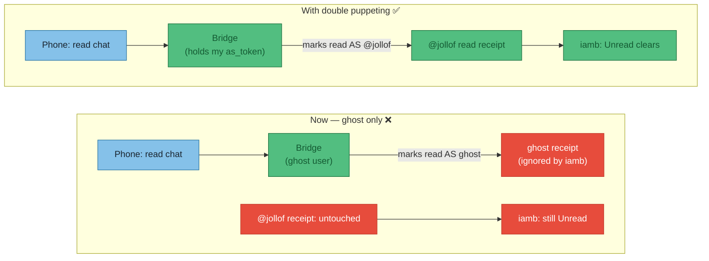
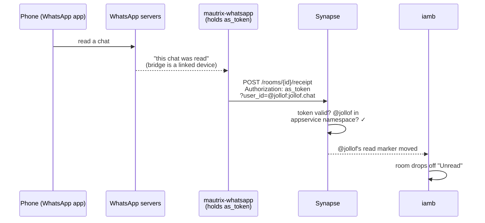
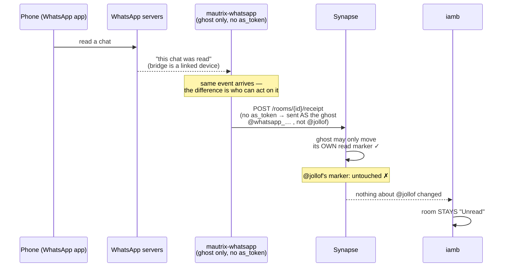
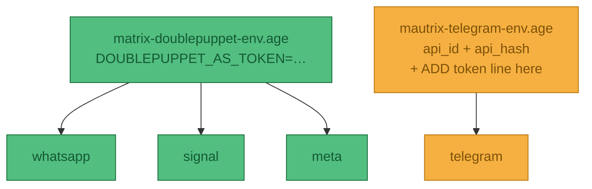
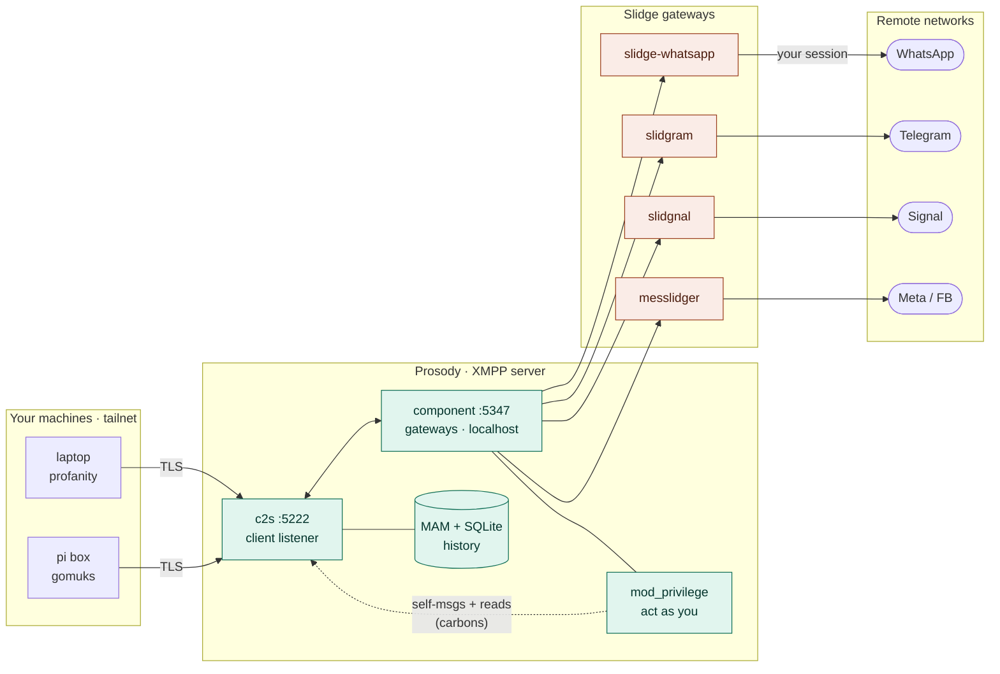
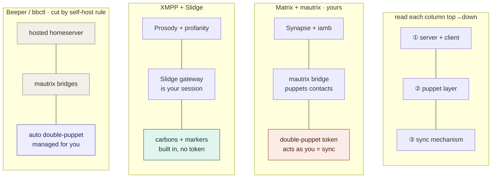

# ADR-011 — Double Puppetting and XMPP considerations

**Status:** **Proposed** — root cause identified; not yet applied to `hosts/pi-box/matrix.nix`. Nix sketch below corrected after checking the modules actually pinned in `flake.lock` — see [Reality check](#reality-check-verified-against-this-boxs-nixpkgs).

**Date:** 2026-07-19

**Problem:** Chats read in the *native* apps (WhatsApp, Telegram, Signal, Messenger) stay **Unread** in `iamb`. Having to re-mark every chat read inside the TUI is poor QoL. See [ADR-009](009-personal-chat-matrix) for the underlying Matrix setup.

## Why it happens

`iamb` shows "Unread" purely from the Matrix **read receipt for my own user** (`@jollof:jollof.chat`) in each room. Nothing about the native app's read state matters unless something writes *my* read receipt into Matrix.

Today the bridges only operate as **ghost** users (the `(WA)` fake accounts). When I read on my phone, the bridge *does* receive that read event — but it can only mark the room read **as a ghost**, which does nothing to my unread count. The read-back path needs the bridge to act **as me**, and that is exactly what **double puppeting** provides.



## The mechanism: how an appservice lets a bridge "become me"

This is the bit that makes the rest make sense. Skip it and the Nix looks like magic.

An **application service** (appservice) is a privileged program the homeserver trusts. It's the same mechanism the bridges *already* use to create their ghost users — we're just registering one more, whose only job is to impersonate **me**. An appservice is defined entirely by a small registration file, and it carries two tokens that point in **opposite directions**:

- **`as_token`** (appservice → homeserver): the appservice puts this in the `Authorization` header on every request it makes *to* Synapse. The key privilege: it can add `?user_id=@someone` to a request and Synapse will treat the request **as if that user made it** — *provided* `@someone` matches the appservice's `namespaces.users` regex. This masquerading is the entire trick.
- **`hs_token`** (homeserver → appservice): Synapse puts this in requests it pushes *to* the appservice (new events, via `url`). Our puppet appservice sets `url:` empty — it never wants to *receive* anything, only to *act* — so this token exists to satisfy the schema but is effectively unused.

So the chain that clears an unread, end to end:



Without the appservice, the bridge has no `as_token` for my account, so step 3 can only be sent as a ghost — Synapse won't let a ghost move *my* read marker, so the receipt lands on the wrong user and iamb never sees it. Here's that same chain **as it runs today**, breaking at the same step:



The bridge, WhatsApp, and Synapse are all working correctly — the read event even arrives. It fails only because the receipt is stamped on the ghost instead of on me, and iamb only ever watches `@jollof`.

## Decision

Register a single **double-puppet appservice** with Synapse and hand its `as_token` to each bridge under `double_puppet`. One registration covers all four bridges (the namespace matches my user, and every bridge puppets the *same* `@jollof`). Token lives in **agenix** — never inlined into the Nix store (bridge settings render to a world-readable file there).

## Reality check (verified against this box's nixpkgs)

Checked the modules actually pinned in `flake.lock`. Two facts reshape the config.

**1. Three Go bridges, one Python bridge.** WhatsApp/Signal/Meta are Go; Telegram is still the old Python bridge (v0.15.3 — nixpkgs hasn't picked up the [Go rewrite](https://mau.fi/blog/2026-04-mautrix-release/) yet). Different codebase → different config key.

| Bridge | Lang | Double-puppet config key |
|---|---|---|
| whatsapp / signal / meta | Go | `double_puppet.secrets.<domain>` |
| telegram | Python | `bridge.login_shared_secret_map.<domain>` |

**2. `environmentFile` is one file, not a list** (`types.nullOr types.path`). Telegram *already* uses its env file for `api_id`/`api_hash`, so its token goes *into that same file* — you can't attach a second. The three Go bridges have no env file today, so they share one new one.



## How it looks in Nix

Appservice method — I have homeserver admin, so no `login-matrix` dance.

```nix
{ config, ... }:
let
  serverName = "jollof.chat";
  # doublepuppet.yaml (holds the as_token) is an agenix secret, so the token never
  # hits the world-readable Nix store. Decrypts to a path Synapse reads.
  reg = config.age.secrets.matrix-doublepuppet.path;
in {
  # 1. Synapse trusts the extra appservice. Merges with the entries each bridge
  #    adds via registerToSynapse (app_service_config_files is a list).
  services.matrix-synapse.settings.app_service_config_files = [ reg ];
  systemd.services.matrix-synapse.restartTriggers = [ reg ];  # reload if token changes

  # 2. Go bridges (wa/signal/meta): SAME key. "as_token:$VAR" lands literally in the
  #    rendered config, then the module's envsubst substitutes $VAR from environmentFile
  #    at start -> real token stays out of the store (same trick Telegram uses today).
  #    Option docs:   https://search.nixos.org/options?channel=unstable&query=mautrix-whatsapp
  #    Module source: https://github.com/NixOS/nixpkgs/blob/nixos-unstable/nixos/modules/services/matrix/mautrix-whatsapp.nix
  services.mautrix-whatsapp.environmentFile = config.age.secrets.matrix-doublepuppet-env.path;
  services.mautrix-whatsapp.settings.double_puppet.secrets.${serverName} = "as_token:$DOUBLEPUPPET_AS_TOKEN";
  services.mautrix-signal.environmentFile = config.age.secrets.matrix-doublepuppet-env.path;
  services.mautrix-signal.settings.double_puppet.secrets.${serverName} = "as_token:$DOUBLEPUPPET_AS_TOKEN";
  services.mautrix-meta.instances.facebook.environmentFile = config.age.secrets.matrix-doublepuppet-env.path;
  services.mautrix-meta.instances.facebook.settings.double_puppet.secrets.${serverName} = "as_token:$DOUBLEPUPPET_AS_TOKEN";

  # 3. Telegram (Python): DIFFERENT key, and it ALREADY has an environmentFile.
  #    Do NOT set environmentFile here (it would clobber api_id/api_hash). Instead add the
  #    token to the EXISTING mautrix-telegram-env.age as the JSON-map env var (see below):
  #      MAUTRIX_TELEGRAM_BRIDGE_LOGIN_SHARED_SECRET_MAP=json::{"jollof.chat":"as_token:<token>"}
  #    Telegram module: https://github.com/NixOS/nixpkgs/blob/nixos-unstable/nixos/modules/services/matrix/mautrix-telegram.nix

  age.secrets.matrix-doublepuppet = {
    file = ../../secrets/matrix-doublepuppet.age;   # the doublepuppet.yaml registration
    owner = "matrix-synapse";
  };
  age.secrets.matrix-doublepuppet-env.file = ../../secrets/matrix-doublepuppet-env.age;
}
```

### Walking through the Nix

1. **`app_service_config_files`** is Synapse's trust list. Adding the decrypted `doublepuppet.yaml` is what makes Synapse honour the `?user_id=@jollof` masquerade. Bridges add themselves via `registerToSynapse`; ours is manual (it isn't a NixOS service). `restartTriggers` makes Synapse reload when the token rotates.
2. **`double_puppet.secrets.<serverName>`** = "to puppet users on `jollof.chat`, use this secret." `as_token:` = "raw appservice token" (vs `login:` = shared-secret method). Keyed by the *puppeted user's* homeserver — all my accounts are on `jollof.chat`, so one entry covers all.
3. **`$DOUBLEPUPPET_AS_TOKEN`** is a literal string in the rendered YAML, swapped in at start by the module's `envsubst` (same mechanism Telegram uses for `api_id`/`api_hash`). Token comes from the agenix env file, never the store.
4. **`age.secrets.matrix-doublepuppet`** decrypts the registration YAML for Synapse; the bridges get the *same* token via the env file. **Both copies must carry the identical token.**

:::warning One token, two files
The token lives in the **registration file** (so Synapse recognises it) *and* the **bridge env** (so bridges present it). Generate once (`openssl rand -hex 32`), paste into both agenix files.
:::

### The Telegram `..._MAP` env var, decoded

Telegram's env var isn't a plain token — it's a **map** (homeserver → secret), so the value must be JSON. mautrix only parses it as JSON when you prefix with `json::`; without the prefix it's treated as a plain string and ignored.

```text
MAUTRIX_TELEGRAM_BRIDGE_LOGIN_SHARED_SECRET_MAP = json::{"jollof.chat":"as_token:<token>"}
└──────── sets bridge.login_shared_secret_map ────────┘  └ "parse rest as JSON" ┘
```

Why a map: one bridge could puppet users across several homeservers, one secret each. We only have `jollof.chat`, so it's a one-entry map. **Caveat:** confirm the Python bridge (v0.15.3) accepts the `as_token:` prefix; if not, fall back to the shared-secret login method.

The `doublepuppet.yaml` that gets encrypted into `matrix-doublepuppet.age`:

```yaml
id: doublepuppet
url:                          # empty: this appservice receives nothing, only puppets
as_token: "<generated-random-token>"
hs_token: "<generated-random-token>"
sender_localpart: doublepuppet   # a sender that no real user will ever be
rate_limited: false
namespaces:
  users:
    - regex: '@jollof:jollof\.chat'
      exclusive: false         # non-exclusive: I still own my own account
```

### The registration file, field by field

- **`id`** — a unique name for this appservice on the homeserver. Must not collide with the bridges' own IDs (`whatsapp`, `signal`, …).
- **`url`** — where Synapse would *push* events to. **Empty on purpose**: this appservice only ever pushes *out* (masquerading as me); it never needs to receive. Empty `url` = "don't try to deliver anything to me," which is why `hs_token` goes unused.
- **`as_token` / `hs_token`** — the two directional tokens from the mechanism section. Generate both as long random strings. The `as_token` is the one the bridges must also hold.
- **`sender_localpart`** — every appservice gets one implicit bot user, `@<sender_localpart>:jollof.chat`. We never use it, but it must be a name no real person will register (`doublepuppet`), or you'd hand control of a real account to the appservice.
- **`namespaces.users.regex`** — the guest list for masquerading. Synapse only honours `?user_id=X` if `X` matches this. It's scoped tightly to *just* `@jollof` — not `@.*` — so even if the token leaked, it could only impersonate me, not every user on the server.
- **`exclusive: false`** — the load-bearing flag. `exclusive: true` would mean "*only* this appservice may own `@jollof`," which locks me out of logging in from iamb or my phone. `false` = "the appservice may *act as* me, but I still own the account normally." Getting this wrong is the classic way to brick your own login.

## Consequences / caveats

- **Telegram & Signal** should sync read state reliably once puppeted.
- **WhatsApp** stays the flakiest — known gaps with "LID DMs" ([mautrix/whatsapp#891](https://github.com/mautrix/whatsapp/issues/891)); expect some chats to still need a manual read.
- **Meta/Facebook** bridge has E2EE disabled here (ADR-009), so no extra key handling needed for the puppet.
- Historical unreads won't retroactively clear — only reads made *after* this is live sync back.

### Telegram: Python now, Go later

- The [Go rewrite](https://mau.fi/blog/2026-04-mautrix-release/) shipped upstream as **v26.04** (Apr 2026) and migrates in-place from Python.
- **nixpkgs-unstable isn't far enough yet** — even `master` still packages **0.15.3 Python** (checked 2026-07). Overriding `services.mautrix-telegram.package` alone won't help: the NixOS *module* is Python-shaped (runs `alembic`, expects `login_shared_secret_map`), so it'd render config the Go binary can't read. The module has to be updated too.
- Practical call: keep the Python special-case now. When nixpkgs bumps **package + module**, Telegram collapses into the same `double_puppet.secrets` shape as the others. Track the nixpkgs PR before touching it.

<<<<<<< HEAD

### Reviewing Matrix Clients
To be fair to matrix, most of my gripes appear to be with `iamb` and not matrix itself. The separation of connections (whatsapp/facebook), read receipts, viewing invites are all iamb problems and not matrix.

However, the double puppeting is a bit clunky. Having reviewed matrix clients again ive made a quick summary of my thoughts 

## Matrix client comparison (keyboard-driven focus)

_Stars as of 23 Jul 2026; approximate. Releases move fast._

| Client | ⭐ Stars | Latest release | Hotkey nav | Read receipts | Accept-all invites | TLDR |
|---|---|---|---|---|---|---|
| **iamb** | ~1,250 | v0.0.11 | Best — true modal vim | Buggy — my dealbreaker | No | Best bindings in the game, but broken read receipts kill it for me |
| **gomuks web** | ~1,700 | v0.2607.0 (Jul 2026) | Good — Ctrl+K + list nav | Works | No (per-room `/accept`) | Very minimal; headless backend + web UI, native to the mautrix stack |
| **SchildiChat Revenge** | ~120 | v26.07.13 (Jul 2026) | Most nvim-like — command mode + rebindable `.toml` | Rust-SDK (should work, untested) | No bulk (has command mode) | Alpha and rough, but the only one built around fully rebindable keys — one to watch |
| **Cinny** | ~3,800 | v4.12.3 (Jun 2026) | Good — Ctrl+K spotlight, no space-cycling | Works | No (nicest manual UI) | Good workhorse |
| **nheko** | ~2,460 | v0.12.1 (Aug 2025) | Decent — keyboard-friendly, not modal | Works | No | Weird colours, everything dark, and couldn't connect |
| **Element (Web/Desktop)** | ~13,300 | v1.12.18 (May 2026) | Decent — Ctrl+K switcher + most shortcuts, but not modal | Works | No | Feature-complete reference client; heavy Electron, not keyboard-first |

||||||| parent of 1a2732f (upgrade sparkyfitness and add xmpp to pi)
=======

## Reviewing alternatives
So matrix is a bit.... shite - terminal clients are lacking, server is quite heavy - looking into the XMPP protocol as an alternative

### Requirements

What any replacement has to satisfy, in priority order:

- **Self-hosting is a must-have** — I own my data. No hosted-homeserver options (rules out Beeper / `bbctl`).
- **Terminal-based client** — a TUI (Text User Interface) is non-negotiable; no web/GUI-only clients.
- **Client → server architecture preferred** — ideally I can read/write from any machine and the *server* holds history + read-state. A single terminal client (one device) is acceptable as a fallback, but multi-client sync is the gold standard.

### Solution comparison

Whole-stack options measured against the requirements above:

| Solution | Client from any machine | Multi-client sync (gold standard) | Complexity | TL;DR |
|---|---|---|---|---|
| **Matrix + mautrix (Synapse)** | ✅ any Matrix client + token | ✅ server holds receipts + history (MAM) | High | What you have; sync works, `iamb` just exposes it badly |
| **Matrix + mautrix (continuwuity)** | ✅ identical — it's still Matrix | ✅ identical | Lower | Same clients + sync, lighter server. Best keep-everything cut |
| **XMPP + Slidge** | ✅ any XMPP client (multiple "resources") | ✅ MAM + carbons + chat markers | Med (containers) | Comparable sync story, rougher on nix |
| **nchat** | ⚠️ per machine = separate linked device | ❌ no cross-machine read-state sync | Very low | Breaks your "any machine + sync" goal — each install is its own device |

> **MAM** = Message Archive Management (server-side history, [XEP-0313](https://xmpp.org/extensions/xep-0313.html)). **Carbons** = message carbons ([XEP-0280](https://xmpp.org/extensions/xep-0280.html)), which fan a message out to all your logged-in devices. A **resource** in XMPP is one connected device/client of the same account.




### Client comparison

Terminal clients across both protocols. "(your take)" marks my subjective judgement rather than a documented fact:

| Client | Protocol | UI / formatting | Sync quality | Maturity | Main pain | Verdict |
|---|---|---|---|---|---|---|
| **iamb** | Matrix | Functional, not pretty (your take) | Protocol syncs, but `iamb`'s unread handling is janky (your take) | Stable, actively developed | Unread sync bad; no invite support (your take) | Reliable workhorse, rough UX |
| **gomuks (TUI)** | Matrix | Nicest formatting; inline images in Kitty-class terms | Server-backed, decent | Beta | Escape leaks as `[27u`, audio renders as `127.0.0.1` (your take) — immature key/media handling | Prettiest, not ready. Note: gomuks web exists if you'd tolerate a browser |
| **weechat-matrix** | Matrix | Excellent (weechat itself); scriptable; run on server + attach | Server-backed | Plugin is in maintenance mode; a Rust port exists but is early | E2EE needs a [pantalaimon](https://github.com/matrix-org/pantalaimon) proxy; device verification is painful | Great if you already live in weechat and stomach the E2EE detour; otherwise fading |
| **profanity** | XMPP | Clean ncurses, tidy 1:1 | MAM + carbons across resources | Mature, maintained | Requires the XMPP+Slidge switch; OMEMO/carbons config | The most polished + mature terminal option here — but XMPP-only |
| **poezio** | XMPP | Console UI, MUC-first | MAM + carbons | Mature, slower dev | Ergonomics lean toward rooms over DMs | Solid profanity alternative |
| **nchat** | WA/TG/Signal direct | Decent TUI | Local only — no cross-machine sync | Active | ❌❌❌ NO FACEBOOK MESSENGER | Lowest effort, but fails the multi-machine goal |

> **E2EE** = end-to-end encryption. **OMEMO** = the XMPP E2EE scheme ([XEP-0384](https://xmpp.org/extensions/xep-0384.html)). **MUC** = Multi-User Chat (group rooms, [XEP-0045](https://xmpp.org/extensions/xep-0045.html)).

as a comparison to matrix, and how tht layers fit together



### manual setps for prosodyctl and profanity
Firstly the server side adding the user
1. sudo prosodyctl register jollof jollof.chat <PASSWORD_HERE>

Then in profanity for the client (testing)
1. add the acc

```
  /account add jollof
  /account set jollof jid jollof@jollof.chat
  /account set jollof server 127.0.0.1
  /account set jollof port 5222
```
2. disable tls as its local
```
  /account set jollof tls disable
  /connect jollof
```


### Upstream nixpkgs status & long-term plan (checked 2026-07-22)

The connecting packages, and how to eventually stop hand-maintaining them:

| Package | In nixpkgs? | Tracking | Long-term step |
|---|---|---|---|
| `slidge` (core) | ⏳ in review | [PR #541886](https://github.com/NixOS/nixpkgs/pull/541886) — `init at 0.4.0` | on merge, drop the inline derivation → use `pkgs.slidge` |
| `slidge-whatsapp` | ❌ | help-wanted [Discourse thread](https://discourse.nixos.org/t/need-help-to-package-slidge-whatsapp/78883) (Go+py build is the blocker) | package locally now; contribute upstream once the Go build settles |
| `slidgram` (Telegram) | ❌ none | — | inline derivation now; upstream once core lands |
| `slidgnal` (Signal) | ❌ none | — | inline derivation now; needs `signal-cli` sidecar (already in nixpkgs) |
| `messlidger` (Meta) | ❌ none | — | inline derivation now (pure Python — the easiest to upstream first) |

Reference for *how* a plugin gets packaged: [matridge PR #527267](https://github.com/NixOS/nixpkgs/pull/527267) (an XMPP↔Matrix slidge plugin — not one we need, but the same derivation shape).

Draft stack module: [`hosts/pi-box/xmpp.nix`](https://github.com/joeledwardson/dev-setup/blob/main/hosts/pi-box/xmpp.nix) — runs parallel to `matrix.nix`, nothing removed.

### Next steps (immediate)

Prove one gateway end-to-end before investing in the rest. **Signal is the cheapest slice** (only 1 missing dep, no Go build):

1. Get `slidgnal` (Signal) building + a minimal Prosody config running on `pi-box`.
2. Create the `jollof@jollof.chat` XMPP account; pair `signal-cli` to my Signal.
3. Connect with `profanity` from another machine — confirm history + read-state sync actually work.
4. **Decision gate:** only if this beats the Matrix/`iamb` experience, add Telegram + WhatsApp. Likely drop Facebook (`messlidger` is stale, 2 slidge majors behind).
5. Runs parallel to Matrix throughout — nothing removed until XMPP proves out.

>>>>>>> 1a2732f (upgrade sparkyfitness and add xmpp to pi)
## Sources

- [Double puppeting — mautrix docs](https://docs.mau.fi/bridges/general/double-puppeting.html) ✓
- [slidge core — nixpkgs PR #541886](https://github.com/NixOS/nixpkgs/pull/541886)
- [Packaging slidge-whatsapp — NixOS Discourse](https://discourse.nixos.org/t/need-help-to-package-slidge-whatsapp/78883)
- [Slidge admin docs — gateways & components](https://slidge.im/docs/slidge/main/)
- [Prosody: transports and gateways](https://prosody.im/doc/transports_and_gateways)
- [Go Telegram release (v26.04) — mau.fi blog](https://mau.fi/blog/2026-04-mautrix-release/) ✓
- [NixOS option search — mautrix bridges](https://search.nixos.org/options?channel=unstable&query=mautrix-whatsapp) ✓
- [mautrix-whatsapp module source (nixos-unstable)](https://github.com/NixOS/nixpkgs/blob/nixos-unstable/nixos/modules/services/matrix/mautrix-whatsapp.nix) ✓
- [mautrix-telegram module source (nixos-unstable)](https://github.com/NixOS/nixpkgs/blob/nixos-unstable/nixos/modules/services/matrix/mautrix-telegram.nix) ✓
- [iamb configuration](https://iamb.chat/configure.html)
</content>
</invoke>
