# January 2026
Wow new year!
Should review all these notes at some ponit for a bit of reflection on the year.

Feels like problem after problem I'm solving in pursuit of the "perfect system" but it will never be perfect lol

Anyway....

### Revisiting `lsof`
So gemini came up with this, using `lsof` to listen to open files to find processes that are listening and finding ports. Context is i wanted to find the port that `sabnzbd` was listening on!
```bash
➜ jollof dev-setup (main) ✗ sudo lsof -i -P -n -c sabnzbd | grep -i listen
lsof: WARNING: can't stat() fuse.gvfsd-fuse file system /run/user/1002/gvfs
      Output information may be incomplete.
lsof: WARNING: can't stat() fuse.portal file system /run/user/1002/doc
      Output information may be incomplete.
systemd        1            root 729u  IPv4  17381      0t0  TCP 127.0.0.1:631 (LISTEN)
sshd      138238            root   6u  IPv4 246743      0t0  TCP *:22 (LISTEN)
sshd      138238            root   7u  IPv6 246745      0t0  TCP *:22 (LISTEN)
systemd-r 138246 systemd-resolve  12u  IPv4 264651      0t0  TCP *:5355 (LISTEN)
systemd-r 138246 systemd-resolve  14u  IPv6 264659      0t0  TCP *:5355 (LISTEN)
systemd-r 138246 systemd-resolve  23u  IPv4 264667      0t0  TCP 127.0.0.53:53 (LISTEN)
systemd-r 138246 systemd-resolve  25u  IPv4 264669      0t0  TCP 127.0.0.54:53 (LISTEN)
.postgres 138341        postgres   6u  IPv6 270343      0t0  TCP [::1]:5432 (LISTEN)
.postgres 138341        postgres   7u  IPv4 270344      0t0  TCP 127.0.0.1:5432 (LISTEN)
syncthing 138406          jollof  13u  IPv6 270360      0t0  TCP *:22000 (LISTEN)
syncthing 138406          jollof  29u  IPv4 267453      0t0  TCP 127.0.0.1:8384 (LISTEN)
Prowlarr  180815        prowlarr 340u  IPv6 407811      0t0  TCP *:9696 (LISTEN)
Radarr    180819          radarr 359u  IPv6 396267      0t0  TCP *:7878 (LISTEN)
Sonarr    180822          sonarr 366u  IPv6 405579      0t0  TCP *:8989 (LISTEN)
nzbget    180836          nzbget   3u  IPv4 389849      0t0  TCP *:6789 (LISTEN)
python3.1 180925         sabnzbd   7u  IPv4 403487      0t0  TCP 127.0.0.1:8080 (LISTEN)
markdown- 192067          jollof  25u  IPv4 448020      0t0  TCP *:8336 (LISTEN)
➜ jollof dev-setup (main) ✗
```

Can see above its 8080

### NixOS Module System - Auto-injected Args
In `flake.nix` I explicitly create `pkgs-unstable`:
```nix
pkgs-unstable = import nixpkgs-unstable { ... };
commonSpecialArgs = { inherit inputs commonGroups pkgs-unstable; };
```

But in modules like `nixos-base.nix`, I use `{ pkgs, pkgs-unstable, ... }` - where does `pkgs` come from?

`pkgs` is **automatically provided** by `nixpkgs.lib.nixosSystem`. When you call it, NixOS evaluates nixpkgs for your system and injects `pkgs` into all modules.

`specialArgs` is only for **extra** args NixOS doesn't know about (like `pkgs-unstable`).

Other auto-injected module args: `config`, `lib`, `options`, `modulesPath`

Docs: https://nixos.org/manual/nixos/stable/#sec-writing-modules

### Inherit in nixos
Brief refresher on inherit (i always forget)
```nix

nix-repl> let a=10; in {b=a+20;a=a;}
{
  a = 10;
  b = 30;
}

nix-repl> let a=10; in {b=a+20; inherit a;}
{
  a = 10;
  b = 30;
}

nix-repl>
```

### Bash piping args
Well I'm finally getting round to trying to get my head round `-s` and `--` in bash!

So.... `-s` is to take commands from stdinput. so with piping, can see without this it expects a file
```bash
➜ joelyboy ~ bash echo hi /run/current-system/sw/bin/echo: /run/current-system/sw/bin/echo: cannot execute binary file
➜ joelyboy ~
```
ahhhh, not this didn't work as `-s` expects from STDIN but i passed them as arguments! so it just opens a shell
```bash
➜ joelyboy ~ bash -s echo hi

[joelyboy@desktop-work:~]$ ^C
```

here is a proper working example:
```bash
➜ joelyboy ~ echo 'echo hi' | bash -s
hi
➜ joelyboy ~
```

Now, as we know in bash double quotations "" expand args, so below will try to expand `$1`, and find nothing!
```bash
➜ joelyboy ~ echo "echo Argument is: $1" | bash -s 'apples'
Argument is:
➜ joelyboy ~
```

Whereas this works! as `$1` is NOT expanded before piping
```bash
➜ joelyboy ~ echo 'echo Argument is $1' | bash -s 'apples'
Argument is apples
➜ joelyboy ~
```

So, interestingly then, by default `bash` takes first param as script path to run and then `$2`, `$3` etc as positional args to pass to the script.
I.e. `bash testie.sh 'hiya'` runs `testie.sh` with `$1` as 'hiya'

BUT, if `-s` is passed the first one from stdin is the script and then all args following are positionals to the script taken from stdin

Finally, when we see `--` it just means to not treat `-some_opt` stuff as options. Like this where `-apples` I guess bash thinks is an option (although interesting it didn't complain or throw an error)
```bash
➜ joelyboy ~ echo 'echo Argument is $1' | bash -s -apples
Argument is
➜ joelyboy ~ echo 'echo Argument is $1' | bash -s -- -apples
Argument is -apples
➜ joelyboy ~
```

### lsof & ss deep dive (socket files)

**lsof columns** ([man page](https://man7.org/linux/man-pages/man8/lsof.8.html)):

| Column | Meaning | Example |
|--------|---------|---------|
| COMMAND | Process name (truncated to 9 chars) | `dockerd`, `systemd` |
| PID | Process ID | `1879` |
| USER | Owner | `root` |
| FD | File Descriptor + mode suffix | `594u`, `3u` |
| TYPE | File type | `unix` (socket), `REG` (file), `DIR` |
| DEVICE | Device identifier (kernel address for sockets) | `0xffff8a6a933e3000` |
| SIZE/OFF | Size or offset | `0t0` (0 offset) |
| NODE | Inode number | `13739` |
| NAME | File path + socket info | `/run/docker.sock type=STREAM` |

**FD suffixes** ([docs](https://man7.org/linux/man-pages/man8/lsof.8.html#OUTPUT)):
- `u` = read+write
- `r` = read only
- `w` = write only
- `cwd` = current working dir
- `txt` = program text (code)
- `mem` = memory-mapped file

**COMMAND column**: Yes, `systemd` means the process named "systemd" (PID 1, the init system). It holds the socket FD because systemd created it via socket activation.

---

**ss columns** ([man page](https://man7.org/linux/man-pages/man8/ss.8.html)):

```
u_str LISTEN 0 4096 /run/docker.sock 13739 * 0 users:(("dockerd",pid=1879,fd=3))
```

| Field | Meaning |
|-------|---------|
| `u_str` | Unix stream socket (`u_dgr` = datagram, `u_seq` = seqpacket) |
| `LISTEN` | Socket state |
| `0` | Recv-Q (queued bytes) |
| `4096` | Send-Q (backlog for LISTEN) |
| `/run/docker.sock` | Local address (path) |
| `13739` | Inode |
| `*` | Peer address (none for LISTEN) |
| `0` | Peer port/inode |

**users field**: `users:(("dockerd",pid=1879,fd=3),("systemd",pid=1,fd=595))`
- List of processes with this socket open
- Format: `("command",pid=PID,fd=FD_NUMBER)`
- Multiple entries = multiple processes sharing the socket (socket activation)

**Why 2 entries for docker.sock?**
Systemd creates the socket (socket activation), then passes FDs to dockerd. Both hold references.

Docs:
- lsof: https://man7.org/linux/man-pages/man8/lsof.8.html
- ss: https://man7.org/linux/man-pages/man8/ss.8.html


### API/HTTP requests client
So having used postman in the past and wanting to move to a vim based giga-chad 💪 TUI will review the options:

- atac: crashed on importing cloudflare openAPI schema (it is large but not great....)
- posting: more promising but cloudflare uses openapi spec `3.0.3` and posting based off `openapi-pydantic` package which likes `3.1.x`
- resto: 281 stars... last release 2022 
- resterm: lets go: still struggling with errors trying to import metabase openAPI json (which IS a valid openapi `3.1` so I assume same problem as the others, not updated for latest)
- openapi-tui: 
- atac (UPDATE): trying v0.22.1 from unstable nix packages: same issue with metabase API....
- resterm (UPDATE): trying v0.21.3 from unstable nix packages: same problem
- openapi-tui: DOES work for `v.3.1` openapi BUT i try the `:send` command and nothing happens....

Ok, this seems to be a common theme... found a [link here](https://www.openapis.org/blog/2021/02/16/migrating-from-openapi-3-0-to-3-1-0) that explains `exclusiveMinimum` which seems to be plaguing these TUIs

So... lets try a down-converter for openapi?

### Nixarr setup
Decided to go with nixarr (lets give it a try).

At some point i would like to review using configarr or whatever its called to sync config files...

Because i keep forgetting (and they changed the ports)... its:
- radarr: 7878
- prowlarr: 9696
- sabnzbd: 6336 (changed from 8080)

* Step 1 *
so go to sabnzbd:6336 to setup.

Newshosting is the ... download server?

Then just add host `new.newhosting.com` - (then get username and pass - saved in bitwarden, can login to dashboard here: https://controlpanel.newshosting.com/customer/)

important to note that on the newhosting dash [here](https://controlpanel.newshosting.com/customer/index.php) it states 30 max connections so in the [server config](http://localhost:6336/config/server/) i set the connections to 30

* Step 2 *
Using nzbgeek as the ... indexer?>

Just have to go to prowlarr and add indexer...

Can get API key from [here](https://nzbgeek.info/dashboard.php?myaccount) on nzbgeek but i think its the same as the password?


* Step 3 *
Have added in prowlarr apps [here](http://localhost:9696/settings/applications) radarr so that radarr can pull the indexer from prowlarr (i.e. just nzbgeek at the moment)

* Step 4 *
Go to [radarr download client](http://localhost:7878/settings/downloadclients) and add sabnzbd

### Recyclarr
So this is not in true NixOS style but its nice to have a tool to configure trash guides that is NOT through the UI.

Configarr worth looking at after for a more "complete" declarative option

### Radarr/Sonarr Quality System (Claude)

The quality system can be confusing. Here's how it all fits together:

**1. Quality Profile Structure:**

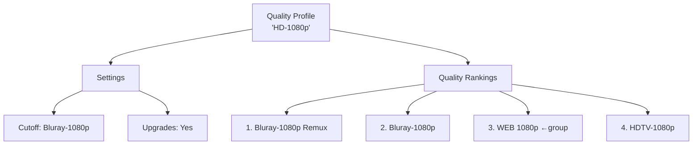

**2. Quality Groups (expand a ranking):**

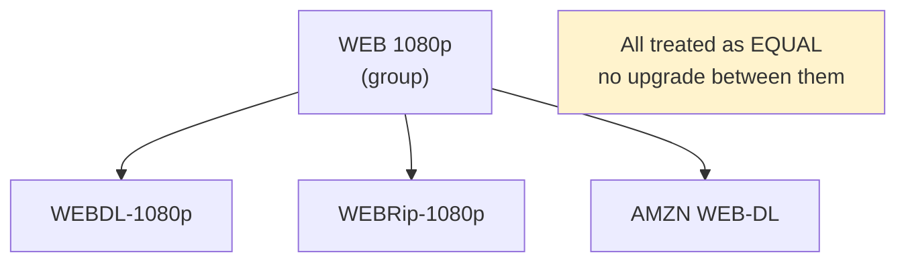

**3. Custom Formats:**

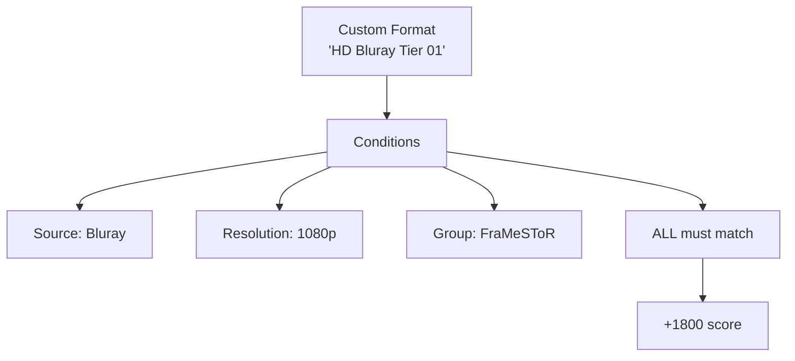

**4. How matching works:**

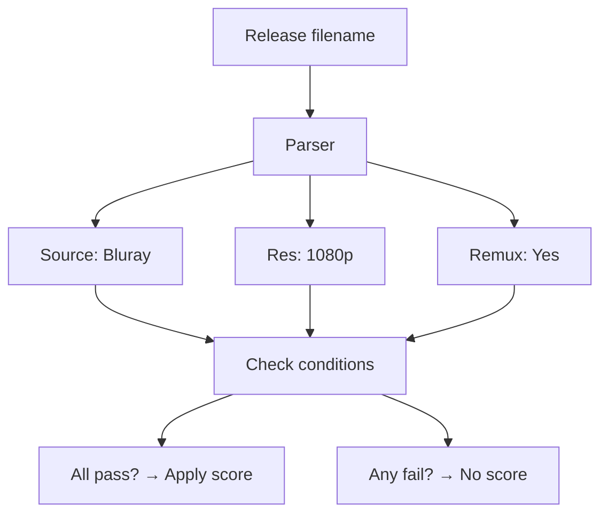

**The Hierarchy:**

| Level | What it is | Example |
|-------|-----------|---------|
| **Quality Profile** | Assigned to movie/show | "HD-1080p" |
| **Quality** | Format+resolution | Bluray-1080p |
| **Quality Group** | Equals within ranking | WEB 1080p |
| **Custom Format** | Bonus/penalty scoring | "Tier 01" +1800 |
| **Condition** | Rule in custom format | Source=Bluray |

**The Big Picture - How It All Fits Together:**

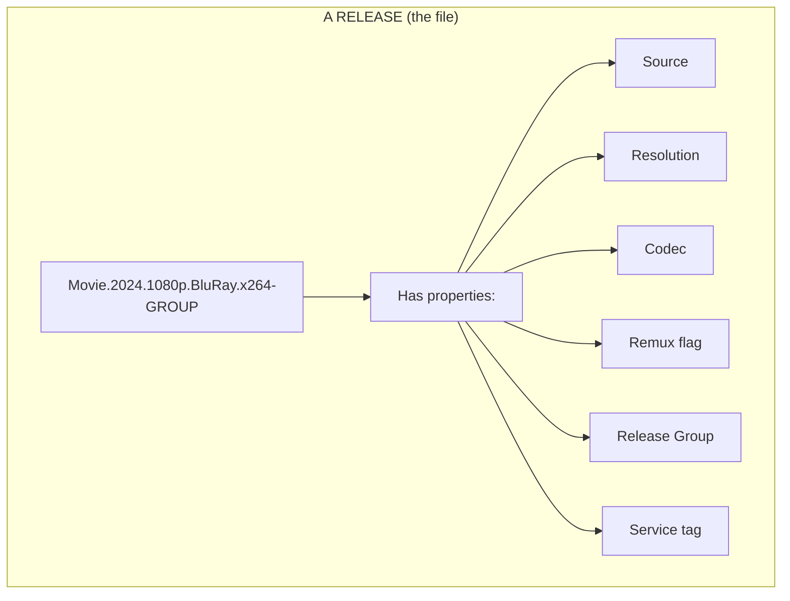

**1. Source** = WHERE did the video come from?

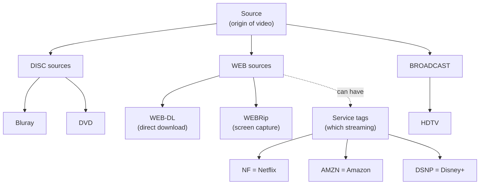

> **Bluray IS a source** - it means "ripped from a Bluray disc"
>
> **NF/AMZN are service tags** - they tell you WHICH streaming service, but the source is still "WEB"

**2. Remux** = a FLAG, not a source

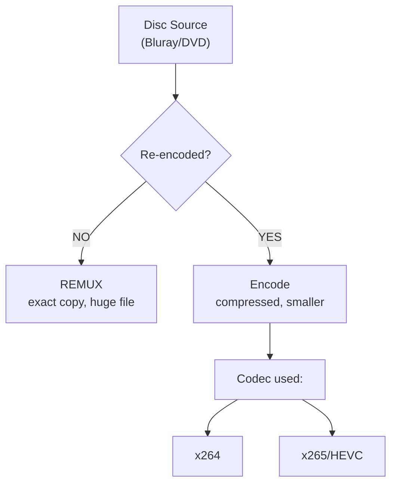

> Remux only applies to disc sources. WEB-DL is already "not re-encoded" but we don't call it remux.

**3. How Radarr builds a "Quality":**

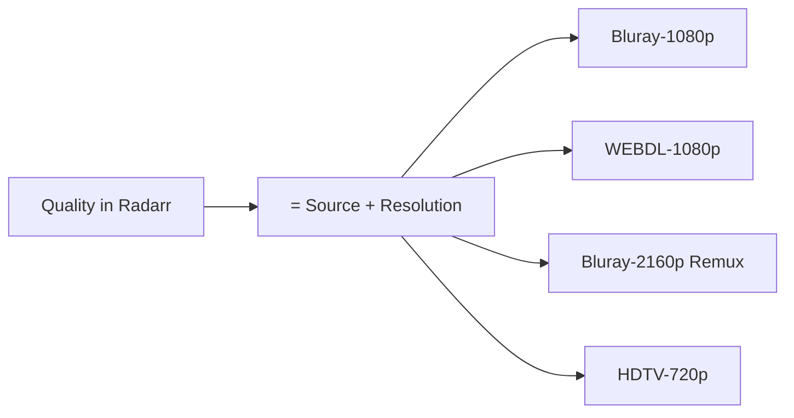

> A "Quality" is just Source + Resolution combined. Radarr has ~30 built-in qualities.

**4. The Full Tree:**

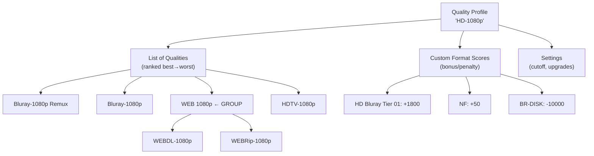

**Quality Groups explained:**

A group bundles multiple qualities as EQUAL rank. Inside a group, no upgrades happen between members.

```
Quality Group: "WEB 1080p"
├── WEBDL-1080p   ─┐
├── WEBRip-1080p  ─┼── all scored the SAME
└── (any WEB src) ─┘

Won't upgrade WEBRip → WEBDL
But custom formats CAN still prefer one via scoring
```

**5. Where do Custom Formats come from?**

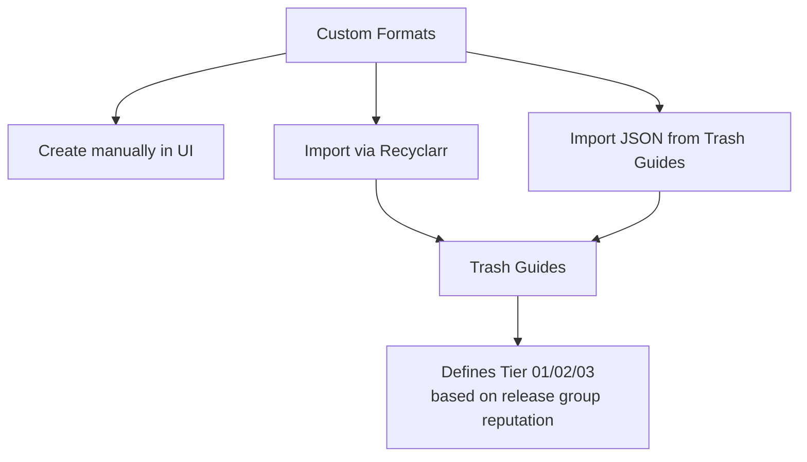

> Custom Formats are just pattern matchers YOU define (or import). They scan release names and add/subtract scores.

**6. NF: Source vs Custom Format - what's the difference?**

```
RELEASE: "Movie.2024.1080p.NF.WEB-DL.x264-GROUP"
                          │
         Parser extracts: │
                          ▼
┌─────────────────────────────────────────────┐
│ Source: WEB-DL        ← Radarr built-in     │
│ Resolution: 1080p     ← Radarr built-in     │
│ Quality: WEBDL-1080p  ← Source + Resolution │
└─────────────────────────────────────────────┘
                          │
                          ▼
┌─────────────────────────────────────────────┐
│ Custom Format "NF" checks:                  │
│   Condition: title contains "NF"? YES       │
│   → Apply score: +50                        │
└─────────────────────────────────────────────┘

Final score = Quality rank + Custom Format scores
```

> "NF" in the filename is just text. The Custom Format "NF" is a rule that DETECTS that text and adds score.

**Jargon Summary Table:**

| Term | Category | Meaning |
|------|----------|---------|
| Bluray | Source | From physical disc |
| WEB-DL | Source | Direct stream download |
| WEBRip | Source | Screen captured stream |
| HDTV | Source | TV broadcast capture |
| Remux | Flag | No re-encoding (disc only) |
| x264/x265 | Codec | Compression method |
| 1080p/2160p | Resolution | Pixel dimensions |
| NF/AMZN/DSNP | Service tag | Which streaming platform |
| FraMeSToR | Release group | Team that made the release |
| Tier 01/02/03 | Trash Guide rank | Quality ranking of groups |

**Filename example decoded:**

```
Movie.2024.1080p.BluRay.REMUX.AVC.TrueHD.7.1-FraMeSToR
       │    │      │     │    │    │   │      │
       │    │      │     │    │    │   │      └── Release group
       │    │      │     │    │    │   └── Audio channels
       │    │      │     │    │    └── Audio codec
       │    │      │     │    └── Video codec
       │    │      │     └── Remux flag (not re-encoded)
       │    │      └── Source: disc
       │    └── Resolution
       └── Year
```

**Scoring Example:**

In your quality profile, custom formats get scores:

| Custom Format | Score | Description |
|--------------|-------|-------------|
| HD Bluray Tier 01 | +1800 | Best encode groups (FraMeSToR, etc) |
| HD Bluray Tier 02 | +1050 | Good encode groups |
| HD Bluray Tier 03 | -1000 | Lower quality encodes |
| BR-DISK | -10000 | Avoid raw disc rips |

When a release matches multiple formats, scores ADD UP. Higher total = preferred.

**Cutoff vs Upgrade:**

```
Current: WEB-1080p (score: 500)
Cutoff:  Bluray-1080p (score: 1000)

→ Will upgrade to Bluray because current < cutoff

New release: Bluray-1080p + "Tier 01" format (+1800)
Total score: 1000 + 1800 = 2800

→ Upgrades because new score > current score
```

**Why Groups?**

Quality groups treat multiple sources as equivalent. E.g., "WEB 1080p" group:
- WEBDL-1080p (Netflix direct)
- WEBRip-1080p (screen capture)
- AMZN WEB-DL

All ranked the SAME. Won't upgrade WEBRip→WEBDL, but custom format scores can still prefer one.

Docs: https://wiki.servarr.com/radarr/settings#quality-profiles

### Quality profiles (my notes)
Well.... what claude wrote is... verbose....

Will try to simplify my best i can do

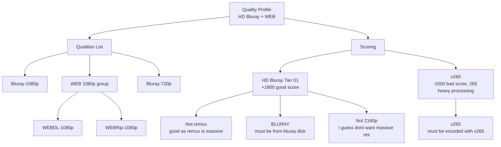


### Git diffs
So have played around with diffs in neovim but nevery really understood how it worked....

Got ChatGPT to outline a super simple repo to play around with the `DiffView` extension.

I think I understand now that 
```
BASE   = common ancestor
OURS   = your current branch (HEAD)
THEIRS = incoming change
```

Where theirs e.g. is when we pop a stash (i.e. what the stash "wants")

`BASE` is a bit misleading... it's in most cases (I can see) the starting point of a stash (i.e. what it was before the stash was done). But that is NOT the same as the prior commit to OURS! I guess its more the last time that `OURS` and `THEIRS` was the same? (makes more sense below)

This is the example

```bash
git init
echo "line 1" > file.txt
echo "line 2" >> file.txt
git add file.txt
git commit -m "base"

# create stash
echo "line 2 - stash change" > file.txt
echo "line 3 from stash" >> file.txt
git stash push -m "stash version"

# create branch change
echo "line 2 - branch change" > file.txt
echo "line 3 from branch" >> file.txt
git commit -am "branch change"

# apply stash (conflict)
git stash apply
```

(I have added a prefix for the git stuff so it doesnt think theres a conflict here)
```
XXXX <<<<<<< Updated upstream        ← OURS (branch / HEAD)
line 2 - branch change
line 3 from branch
XXXX ||||||| Stash base              ← BASE (common ancestor)
line 1
line 2
XXXX =======
line 2 - stash change           ← THEIRS (stash)
line 3 from stash
XXXX >>>>>>> Stashed changes
```

And as ChatGPT puts it...
```
BASE = where both started
OURS = what I have
THEIRS = what’s coming in
CENTER = what I commit
```

### Wincmd?
So apparently `:tabdo` executes for each tab?

Nice! so like
```lua
:tabdo :echo bufname()
```

Goes and prints bufname for each tab (active buffer)

Ahhhh
`:wincmd =` is the same as `C-W =` a window command...

Interestingly, the reason the the `outline` escapes from this when its called (and graciously so, wouldn't want the outline taking up half the page horizontally...)

It is the `winfixwidth` property that forces the win to stay constant (when `C-w =` is called)
