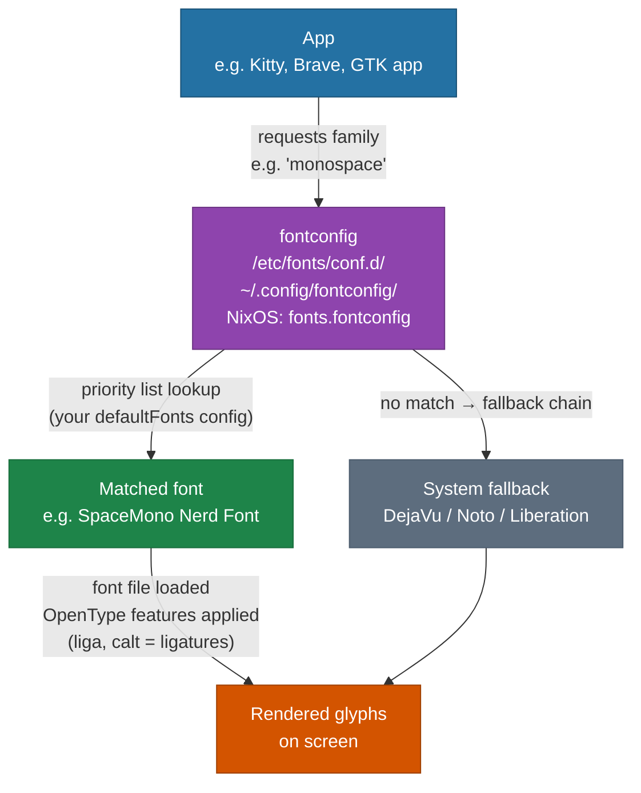
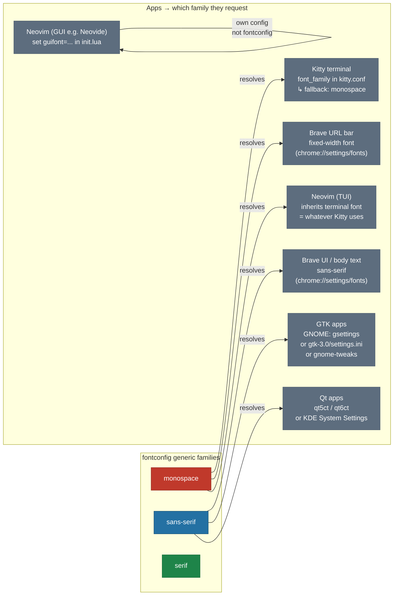
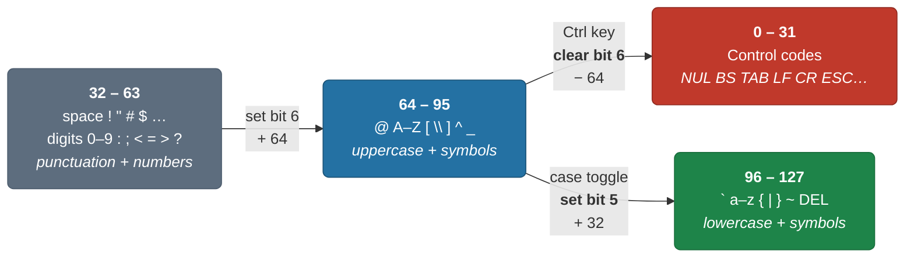
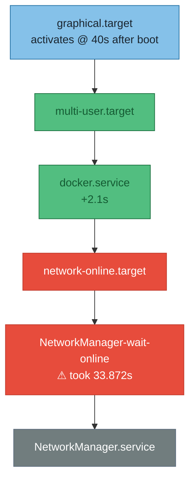
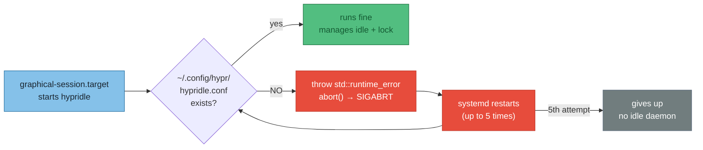
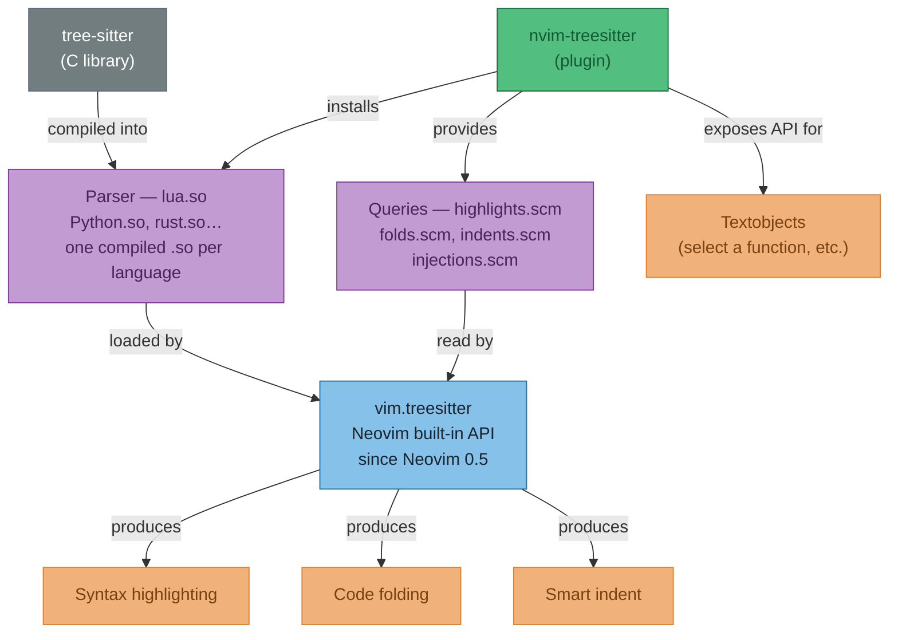
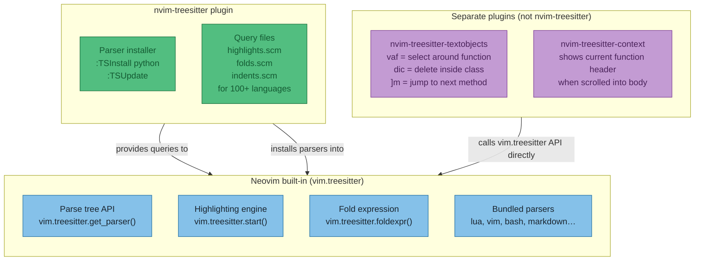
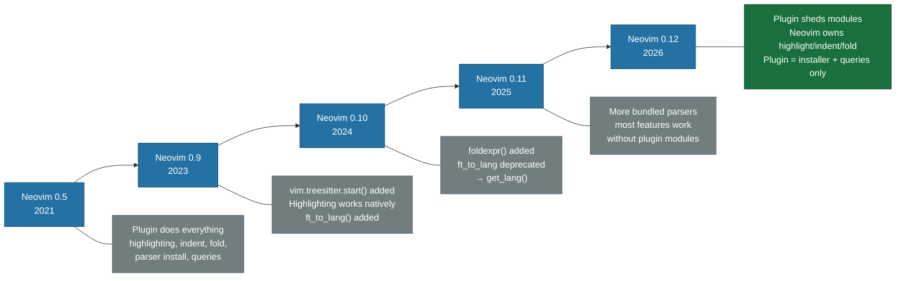
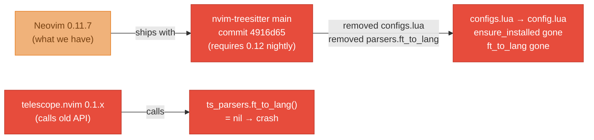

# May 2026

### Middle-ground tools between Grafana Loki and a custom React dash

Context: my dash has a custom event/log browser (AG Grid + tRPC + React) that does correlation tagging, integer IDs from UUIDs, colour-coded cells, freeze-filters etc. Loki is too plain for this; the React dash works but is heavy to maintain. Survey of what sits *between* those two extremes.

#### TLDR per tool

| Tool | One-line | Fit for log/event browser | Effort |
|---|---|---|---|
| **Grafana Table panel + transformations** | Built-in `Organize fields` / `Convert field type` / `Value mappings` / cell colour mapping over a Loki or SQL datasource | Good first stop — covers integer-from-UUID + per-value colours without writing code | None |
| **Grafana custom panel plugin** | Write a React component (AG Grid is fine) packaged as a Grafana panel; inherits datasource + auth + dashboarding | Strong if already centralised on Grafana; weekend POC | Medium |
| **[Datasette](https://datasette.io)** | Point at SQLite (or Postgres via plugin) → instant browsable web UI + JSON API + SQL playground. Read-only, plugin hooks for custom cell HTML | Wrong shape for *live* events — it's batch/exploration. Fine for "browse a frozen window" | Low |
| **[Evidence.dev](https://evidence.dev)** | Markdown + SQL blocks → static dashboard site. BI flavour | Wrong shape — "publish a report", not "browse a stream". Skip for this problem | Low |
| **Metabase** | Point-and-click BI, killer for non-technical exploration | iOS-philosophy: simple but customisability hits a wall. Not its strength | Low |
| **[Retool](https://retool.com) / Appsmith / ToolJet** | Low-code internal tool builder; drag table component, connect to DB/tRPC, write JS for custom cell renderers (Retool uses AG Grid) | **Sweet spot for this exact problem shape.** Few hours to working tool. Retool = paid + lock-in, Appsmith/ToolJet = FOSS self-host | Low |
| **[ClickHouse](https://clickhouse.com)** | Column-store database; stupid fast at "scan billions of rows + aggregate", useless for CRUD. Pair with Grafana table panel | Only relevant when Postgres event volume hurts. Not a UI solution | Medium (infra) |
| **[Quickwit](https://quickwit.io) / [OpenObserve](https://openobserve.ai)** | Newer Loki-alternatives with richer querying | Worth knowing exist if Loki itself becomes the bottleneck | Medium |
| Streamlit / Gradio / Panel | Python web apps in ~30 lines | Fight you on dense interactive grids — wrong tool here | Low |
| Kibana | Elasticsearch's UI | ES tax for not much over Loki + Grafana transformations | High |

#### Quick concept refreshers

**Datasette**: take a SQLite file, run `datasette serve events.db`, get a queryable read-only web UI. Plugin hook `render_cell` lets you return custom HTML per cell (so colour-coded integer tags = ~30 lines of Python). Single Python process, zero ceremony. Made by Simon Willison. Bad fit for live streams (you'd replicate Postgres → SQLite first), great for "here's a frozen dataset, explore it".

**Evidence.dev**: write `pages/foo.md` with SQL blocks fenced as ```` ```sql ```` and components like `<DataTable data={events} />` → builds a static HTML site. Sources: Postgres, BigQuery, Snowflake, DuckDB. Page-level filters yes; complex live filtering/correlation no.

**ClickHouse**: column-store = stores all values of one column contiguously instead of all fields of one row. Means `SELECT avg(latency)` reads only the latency column, not the other 50 fields. Same-column values compress like crazy too. Result: count/group over 100s of millions of rows in seconds on one box. Trade-off: weak transactions, painful updates/deletes — append, query, expire only. Used by Uber logging, Cloudflare analytics, Sentry, PostHog. Run via `docker run clickhouse/clickhouse-server`, single binary, no JVM.

**Grafana custom panel**: yes you can use AG Grid + React inside one (`@grafana/create-plugin` scaffold + `npm i ag-grid-react`). Pain isn't React — it's Grafana's plugin build tooling, signing for prod, mapping data frame format → AG Grid rows, panel options editor. Trade *your* infra pain for *Grafana's* plugin ergonomics.

#### Text mind map

```
                         "log/event browser tools"
                                    │
       ┌────────────────┬───────────┴───────────┬─────────────────────┐
       │                │                       │                     │
   STAY IN          LOW-CODE              CODE-LIGHT             SCALE-UP
   GRAFANA          TOOL BUILDER          PUBLISHING             (volume)
       │                │                       │                     │
   ┌───┴───┐       ┌────┴────┐            ┌────┴────┐           ┌────┴────┐
   │       │       │         │            │         │           │         │
 Table   Custom  Retool   Appsmith     Datasette  Evidence   ClickHouse  Quickwit
 panel + panel   ($$,     /ToolJet     (SQLite,   (SQL+md →  (column-    OpenObserve
 trans-  plugin  fast)    (FOSS)       plugins,   static     store,
 forms   (React+                       read-only) site)      OLAP)
 (free)  AG Grid)
   │       │       │                                            │
   │       │       │                                            └─ pair with
   │       │       │                                               Grafana/
   │       │       │                                               Superset/
   │       │       │                                               Metabase
   │       │       │
   │       │       └──── ★ best fit for THIS problem shape
   │       │              (table + custom cells + buttons + DB resource)
   │       │
   │       └──── good if already Grafana-centric
   │              (weekend POC, AG Grid still works)
   │
   └──── try first — zero new infra
          (value mappings, cell colours, field convert)


   NOT A FIT for log/event browsing:
     Metabase ───── too opinionated for custom cells
     Streamlit ──── fights you on dense grids
     Kibana ─────── ES tax not justified
     Evidence ───── publishes reports, doesn't browse streams
```

#### Decision heuristic for future-me

1. **Try Grafana transformations first** — zero new infra, often gets further than expected
2. **Retool / Appsmith** if I want to *stop maintaining a frontend* — best fit for the exact problem shape (table + custom cells + buttons)
3. **Grafana custom panel plugin** if committed to Grafana and need AG Grid back
4. **ClickHouse** only when Postgres event queries start timing out — orthogonal concern (storage, not UI)
5. Skip Datasette/Evidence/Metabase/Streamlit/Kibana for *this* problem shape

### Bulk-wrap words with substitute, and reclaiming `s` for mini.surround

Two related nvim things — wrapping every word in a list with `round(...)`, and dropping flash.nvim so mini.surround can keep its default `s` prefix.

#### 1. Substitute inside a visual selection (very-magic mode)

Goal: turn `SELECT bet_id, amount, payout, amount_usd` → `SELECT bet_id, round(amount), round(payout), round(amount_usd)`.

Visually select the words after `bet_id,` (charwise `v`, then move to end), then:

```vim
:s/\v%V\w+/round(&)/g
```

Breaking it down:

- `:s/.../.../g` — substitute, `g` = all matches on the line (not just the first)
- `\v` — **very magic** mode. Means most regex metachars (`+`, `(`, `|`, `%V`) work *without* backslashes. Without `\v` you'd write `\%V\w\+`.
- `%V` — "only inside the current visual selection". Needed because `:s` from visual mode auto-fills `'<,'>` which is a **line range**, not a character range — so without `%V` it would also try to wrap `bet_id`.
- `\w+` — one or more "word" characters (letters, digits, underscore). Why still `\w` under `\v`? Because `\v` only changes which chars need escaping; `\w` is the *name* of the character class itself (same as `\d`, `\s`). Very-magic doesn't replace `\w` with `w` — bare `w` would just match the literal letter "w".
- `round(&)` — `&` in the replacement = the whole match. So each matched word gets wrapped.

#### 2. Dropping flash.nvim, keeping mini.surround's default `s` mappings

flash.nvim claimed `s`/`S` in normal/visual/operator mode, which collided with mini.surround's `sa`/`sd`/`sr`. Removed flash entirely (`f`/`t`/`/` cover most jumps fine). mini.surround now works with its defaults.

ELI5 mini.surround:

- `sa` = surround **add**, `sd` = **delete**, `sr` = **replace**
- After `sa` you give it: (a) *what* to wrap — a textobject like `iw` (inner word) or a visual selection — then (b) *what* to wrap with — a single char: `(` `[` `{` `"` `'`, or `f` for a function call (prompts for a name).
- It does **one wrap per invocation**. No auto-iteration over commas/words.

Examples:

- `saiw)` on `amount` → `(amount)` — add, inner word, with `)`
- `saiwf` on `amount`, type `round<CR>` → `round(amount)`
- visual-select `a, b, c` then `safround<CR>` → `round(a, b, c)` — wraps the **whole selection as one unit**
- `sd"` inside `"hello"` → `hello` — delete surrounding quotes
- `sr({` on `(x)` → `{x}` — replace `(` with `{`

So: for the SQL line, substitute (option 1) wins because it's bulk. mini.surround shines for one-off wraps where typing `round()` and arrowing back in feels clunky.

### Markdown viewer comparison

Looking for a good way to preview `.md` files in a browser. Two categories: **terminal renderers** (render in-terminal) and **browser-based** (serve to localhost).

#### Browser-based

| Name | Type | Pros | Cons |
|------|------|------|------|
| [markdown-preview.nvim](https://github.com/iamcco/markdown-preview.nvim) | nvim extension | UX clean | only from nvim, building is a pain |
| [md-viewer-py](https://pypi.org/project/md-viewer-py/) | python package (`uv tool install`) | UX good | scrolling not great, titles use headings not filenames, new package (low maintenance) |
| [mkdocs](https://www.mkdocs.org/) | docs gen/serve | looks great (especially with Material theme) | needs `mkdocs.yml` + `docs/` dir structure, not single-file friendly |
| [grip](https://github.com/joeyespo/grip) | python, GitHub-style | `grip file.md` — dead simple, single command | missing styles/CSS, looks unstyled. Uses GitHub API (rate-limited without token) |
| gh markdown-preview (GH CLI extension) | GitHub CLI extension | renders with GH styling | narrow width, must be logged into GitHub |

#### Terminal-based

| Name | Type | Notes |
|------|------|-------|
| [render-markdown.nvim](https://github.com/MeanderingProgrammer/render-markdown.nvim) | nvim plugin | already using — renders inline in neovim buffer. Tables with wide content wrap/misalign. [Open issue #616](https://github.com/MeanderingProgrammer/render-markdown.nvim/issues/616) |
| [glow](https://github.com/charmbracelet/glow) | standalone terminal renderer | superseded by render-markdown for nvim users |
| [mdcat](https://github.com/swsnr/mdcat) | standalone terminal renderer | lighter than glow, same category |


### LSP issues
pasting this here while i remember - having some nvim LSP issues getting errors spewed out into messages
```

E486: Pattern not found: m-a
E486: Pattern not found: m-d
"configs/tmux.conf" 250L, 8729B written
E486: Pattern not found: resize
1 change; before #12  1 second ago
1 change; before #22  2 seconds ago
1 change; before #23  1 second ago
1 change; before #28  1 second ago
"configs/tmux.conf" 256L, 8863B written
"configs/tmux.conf" 252L, 8697B written
252 changes; before #37  18 seconds ago
252 changes; after #37  21 seconds ago
"configs/tmux.conf" 252L, 8908B written
"configs/tmux.conf" 252L, 8878B written
E486: Pattern not found: md-viewier
(outline) No response from provider when requesting symbols!
(outline) No response from provider when requesting symbols!
1 change; before #1  1 second ago
(outline) No response from provider when requesting symbols!
Already at oldest change
E490: No fold found
E486: Pattern not found: open 
clipboard: error: Nothing is copied
Error executing vim.schedule lua callback: ...cal/share/nvim/lazy/outline.nvim/lua/outline/sidebar.lua:348: attempt to index field 'view' (a nil value)
```

### attempting nixos on raspberry pi


trying to follow this guys guide...
so i made 0 notes last time...
https://mtlynch.io/nixos-pi4/

so going to hydra and latest builds
actually fuck it just used nixos minimal ISO (64 bit arm) from their downloads page... https://nixos.org/download/#nix-install-linux

back to hydra again (sigh) - think it needs a full image with booting capabilities or soetmhing

so

1. download image (go to hydra click job => latest builds)
2. just use the link claude gave me...  https://hydra.nixos.org/job/nixos/release-25.05/nixos.sd_image.aarch64-linux/latest
3. download the zst
4. run the zst unpack zstd -d ~/Downloads/nixos-image-sd-card-25.05.813814.ac62194c3917-aarch64-linux\ \(2\).img.zst
5. burn with caligula to SD (`sudo caligula burn <path>.img`)
6. **important** — disconnect pikvm's virtual USB-MSD before booting. Pi boot order tried USB-MSD first and got stuck on pikvm's emulated drive, never falling back to SD. In pikvm UI: Drive → eject/disconnect.

#### Why the minimal ISO didn't work, but the SD image did

Was burning `nixos-minimal-*-aarch64-linux.iso` first. That ISO is built for **generic aarch64 UEFI servers** — expects something to provide UEFI so it can chainload GRUB. Pi 4's boot ROM has no UEFI; it only knows to find `start4.elf` + `config.txt` on a FAT partition. So the minimal ISO is unbootable on a Pi alone.

The SD image (`nixos-image-sd-card-*.img.zst`) bundles everything Pi-native: `start4.elf`, U-Boot, kernel, rootfs. The Pi firmware boots it directly with no shim.

(Alternative: keep the minimal ISO and put **pftf UEFI firmware** on a separate SD — that gives the Pi UEFI capability and the ISO boots normally. Two-stage; the mtlynch guide uses this route. SD image is simpler.)

#### Boot chain comparison — Pi vs x86 vs Pi+pftf

Every boot has 4 stages: **ROM → FIRMWARE → BOOTLOADER → KERNEL**. What differs is where each stage lives.

```
── A) x86 PC with UEFI ───────────────────────────────────────────

   ┌─────────────────┐    ┌─────────────────────────┐
   │ MOTHERBOARD     │    │ DISK                    │
   │                 │    │                         │
   │ ROM ─▶ UEFI ────┼───▶│ ESP partition:          │
   │        firmware │    │   EFI/BOOT/BOOTX64.EFI  │
   │ "I speak UEFI,  │    │   ▲ this is GRUB        │
   │  I look for ESP"│    │      │                  │
   └─────────────────┘    │      ▼                  │
                          │   /boot/vmlinuz (Linux) │
                          └─────────────────────────┘

   ROM and FIRMWARE both live in the motherboard chip.
   BOOTLOADER + KERNEL on disk.


── B) Pi 4 native (NixOS SD image) ───────────────────────────────

   ┌─────────────────┐    ┌──────────────────────────────────┐
   │ SoC chip        │    │ SD CARD                          │
   │                 │    │                                  │
   │ ROM ────────────┼───▶│ FAT partition:                   │
   │ "I'm tiny, I    │    │   start4.elf  ◀── THE FIRMWARE   │
   │  only know how  │    │   config.txt  ◀── firmware cfg   │
   │  to load        │    │   u-boot.bin  ◀── THE BOOTLOADER │
   │  start4.elf"    │    │                                  │
   └─────────────────┘    │ ext4 partition:                  │
                          │   /boot/extlinux/extlinux.conf   │
                          │   /boot/Image (Linux)            │
                          └──────────────────────────────────┘

   ONLY the ROM is in the chip. FIRMWARE itself lives on the SD.
   No UEFI involved. No "EFI file". Just Pi's own files.


── C) Pi 4 + pftf UEFI shim (the minimal-ISO route) ──────────────

   ┌─────────────────┐    ┌──────────────────────────────────┐
   │ Same Pi SoC ROM │    │ FAT partition (your pftf SD):    │
   │                 │    │   start4.elf                     │
   │ ROM ────────────┼───▶│   config.txt ─▶ "load RPI_EFI.fd │
   │                 │    │                  as kernel"      │
   └─────────────────┘    │   RPI_EFI.fd  ◀── A UEFI         │
                          │                   implementation │
                          │                   in a file      │
                          └─────────────────┬────────────────┘
                                            │ now Pi acts like
                                            │ a UEFI machine
                                            ▼
                          ┌──────────────────────────────────┐
                          │ USB drive with minimal ISO:      │
                          │   ESP: EFI/BOOT/BOOTAA64.EFI ──▶ │
                          │        ▲ this is GRUB            │
                          │   /boot/Image (Linux)            │
                          └──────────────────────────────────┘

   pftf is a translator: tricks the Pi into being UEFI-capable.
```

**Key takeaways:**
- On x86 UEFI, firmware lives in the **motherboard chip** and natively understands the EFI System Partition convention (`EFI/BOOT/BOOTxxx.EFI`).
- On Pi 4, the chip-ROM is **deliberately tiny** — only knows to find `start4.elf` on a FAT partition and run it. The real firmware (`start4.elf`) lives on the SD card.
- `config.txt` = Pi firmware config file (analogous to UEFI variables).
- `u-boot` = the Pi-side equivalent of GRUB (reads `extlinux.conf`, picks a kernel).
- pftf packages a full UEFI implementation as a "kernel" that `start4.elf` loads — once running, anything downstream sees a UEFI machine.
- The same conceptual chain (ROM → firmware → bootloader → kernel) exists everywhere; only filenames and conventions differ.

A "Pi-bootable image" = one containing `start4.elf` + `config.txt` + `u-boot.bin`. NixOS SD image, Ubuntu Pi image, Raspberry Pi OS — all siblings. NixOS minimal ISO, Ubuntu server ISO, Debian aarch64 netinst — all siblings on the **other** side, designed for UEFI machines.

 


### Messages log and notification history
Because i forgot AGAIN - im writing another note because i keep forgetting 😓 LMAO.
```lua
:Telescope fidget
```

---

### Linux font system — refresher

Came up investigating why `->` was rendering as an arrow in both Kitty and Brave's URL bar.

#### The font family abstractions

`serif`, `sans-serif`, `monospace` etc. are **generic family names** — not real fonts. They're abstract labels. When an app asks for "monospace", fontconfig resolves that label to a concrete font file based on your config. The app never picks a file directly.

| Family | What it means | Typical use |
|--------|--------------|-------------|
| `serif` | Has decorative strokes ("feet") on letter ends — Times-style | Print, long-form reading, some body text |
| `sans-serif` | No strokes — Helvetica/Arial-style, clean | UI elements, body text in modern apps, browser default |
| `monospace` | Fixed-width — every character same column width | Terminals, code editors, URL bars (Chromium), `<code>` tags |
| `fantasy` | Decorative/display | Rarely configured on Linux |
| `cursive` | Handwriting-style | Rarely configured on Linux |

`standardised` in Brave's font settings = the browser's default proportional font (what you read body text in). Brave maps it to `sans-serif` under the hood.

#### The resolution chain



#### Where each app actually gets its font



:::info Brave's 'fixed-width' font = your URL bar font
Chromium renders the URL bar text in the fixed-width (monospace) font from `chrome://settings/fonts`, not the sans-serif. If your monospace font has ligatures, `->` in a URL becomes `→`.

:::

#### fc-* tools cheatsheet

```bash
fc-match monospace              # what font resolves for the monospace family
fc-match sans-serif             # same for sans-serif
fc-match "SpaceMono Nerd Font"  # exact font → which file it maps to

fc-query $(fc-match monospace --format="%{file}") | grep -i "liga\|calt"
# ↑ does the resolved font have ligature OpenType features?

fc-list                         # all installed fonts
fc-list : family | sort         # just family names, sorted
fc-list : family spacing=100    # monospace fonts only (spacing=100 = fixed-width)
```

#### Ligatures

Ligatures are an **OpenType feature** — the font file contains substitution rules that replace a sequence of characters (`->`) with a single combined glyph (`→`). Two feature flags control this:

| Feature | Name | What it does |
|---------|------|-------------|
| `liga` | Standard ligatures | Classic combos: `fi`, `fl`, `ff` — mostly typography |
| `calt` | Contextual alternates | Context-aware substitutions — where programming ligatures (`->` `=>` `!=` `<=`) live |

Programming ligature fonts: Fira Code, JetBrains Mono, Cascadia Code, Hasklig, Iosevka.
Space Mono (including the Nerd Font variant) does **not** have ligatures — if `->` still renders as an arrow, check what font is *actually* being loaded (use `fc-query` above).

**Disabling per app:**

```bash
# Kitty — add to kitty.conf
font_features SpaceMonoNerdFont-Regular -liga -calt
font_features SpaceMonoNerdFont-Bold    -liga -calt

# WezTerm
harfbuzz_features = {"calt=0", "liga=0"}

# Alacritty — no ligature support at all (disabled by design)
```

#### NixOS font config map

```nix
fonts = {
  packages = with pkgs; [
    nerd-fonts.space-mono   # installs the font file
  ];
  fontconfig = {
    defaultFonts = {
      monospace = [ "SpaceMono Nerd Font" ];  # fc-match monospace → this
      sansSerif = [ "DejaVu Sans" ];          # not set = system picks (usually DejaVu anyway)
      serif     = [ "DejaVu Serif" ];         # same
    };
  };
};
```

GTK and Qt pick up `fontconfig` defaults **only if** no app-specific or DE-specific override exists. GNOME overrides via `gsettings` (set by gnome-tweaks or `dconf`). KDE overrides via Plasma System Settings. Without a DE, they fall straight through to fontconfig — making your NixOS config the single source of truth.

---

### Terminal Control Characters — why `C-[` = Escape and `C-/` = `C-_`

Came up debugging why a Telescope mapping `#!lua ['<C-/>'] = 'to_fuzzy_refine'` registered fine but silently did nothing when pressed.

**Root cause:** the terminal converts your keypress into a raw byte *before* Neovim sees anything. The byte for `Ctrl+/` is the same byte as `Ctrl+_`. Neovim names that byte `#!lua '<C-_>'`. The mapping was registered under `#!lua '<C-/>'` — wrong name, no match.

#### ASCII ranges and what bit operations do

The 128 ASCII characters split into four ranges. Bit operations move between them:



Key points from the diagram:

- **Ctrl key** = "I am in the blue box, clear bit 6" → lands in red (control codes)
- **Case toggle** = "I am in the blue box, set bit 5" → lands in green (lowercase)
- `A`–`Z` map cleanly: `A`(65) ↔ `a`(97), `Z`(90) ↔ `z`(122)
- Edge case: `_`(95) + 32 = **127 = DEL** — the "lowercase" of `_` is the Delete character

#### What actually happens when you hold Ctrl

The terminal (kitty, xterm, etc.) doesn't send `Ctrl+A` as a chord — it sends a **single byte**. The byte is computed by taking the character's ASCII value and stripping bit 6 (subtracting 64). This is a hardware-era convention from 1960s teletypes, documented in [ANSI X3.4 / ASCII standard](https://en.wikipedia.org/wiki/ASCII#Control_characters).

Columnar bit view — exactly which bit changes:

```
         bit: 6  5  4  3  2  1  0
              64 32 16  8  4  2  1
         ─────────────────────────
A      =  65: 1  0  0  0  0  0  1
a      =  97: 1  1  0  0  0  0  1  ← bit 5 ON  (+32)  case toggle
Ctrl+A =   1: 0  0  0  0  0  0  1  ← bit 6 OFF (−64)  Ctrl key
         ─────────────────────────
[      =  91: 1  0  1  1  0  1  1
{      = 123: 1  1  1  1  0  1  1  ← bit 5 ON  (+32)  '[' lowercase is '{'
Ctrl+[ =  27: 0  0  1  1  0  1  1  ← bit 6 OFF (−64)  ESC !!
         ─────────────────────────
_      =  95: 1  0  1  1  1  1  1
DEL    = 127: 1  1  1  1  1  1  1  ← bit 5 ON  (+32)  '_' lowercase = DEL (!)
Ctrl+_ =  31: 0  0  1  1  1  1  1  ← bit 6 OFF (−64)  0x1F
```

**`Ctrl+A` → `0x01`**


```
key:     A  =  65  =  0b 0100 0001
                              ↓
             strip bit 6  (AND 0b0001 1111)
                              ↓
result:         1  =  0b 0000 0001  =  0x01
```
Vim name: **`<C-a>`** — "increment number" in normal mode

**`Ctrl+[` → `0x1B` (Escape!)**


```
key:     [  =  91  =  0b 0101 1011
                              ↓
             strip bit 6  (AND 0b0001 1111)
                              ↓
result:        27  =  0b 0001 1011  =  0x1B  ← ESC
```
Vim name: **`<C-[>`** — identical to **`<Esc>`**, always, no exceptions

**`Ctrl+_` → `0x1F`**


```
key:     _  =  95  =  0b 0101 1111
                              ↓
             strip bit 6  (AND 0b0001 1111)
                              ↓
result:        31  =  0b 0001 1111  =  0x1F
```
Vim name: **`<C-_>`** — also what `Ctrl+/` sends (see below)

This works cleanly for the `@A–Z[\]^_` range (ASCII 64–95). Outside that range (like `/` = 47), behaviour is terminal-specific.

#### The `Ctrl+/` wrinkle

`/` is ASCII 47 — below the clean range. `47 & 31 = 15`, not useful. But on a US keyboard, `/` and `?` share the same physical key. Most terminals use the **shifted character** (`?`) when applying Ctrl to keys outside the range:

**`Ctrl+/` → `0x1F` (via `?`)**


```
key:     ?  =  63  =  0b 0011 1111   ← shifted '/' on US keyboard
                              ↓
             strip bit 6  (AND 0b0001 1111)
                              ↓
result:        31  =  0b 0001 1111  =  0x1F  ← same as Ctrl+_
```
Vim receives byte `0x1F` and names it **`<C-_>`** — NOT `<C-/>`

:::danger Why `#!lua ['<C-/>'] = 'to_fuzzy_refine'` silently failed
The mapping registered under the name `#!lua '<C-/>'`, but the terminal sent `0x1F` which Neovim labels `#!lua '<C-_>'`. Different names → no match → fell through to Telescope's default `<C-/>` handler (which_key).

```lua linenums="1" hl_lines="2"
['<C-/>'] = 'to_fuzzy_refine',  -- (1)! registered but never fired
['<C-_>'] = 'to_fuzzy_refine',  -- (2)! add this: actual byte the terminal sends
```

1. Neovim registers this name, but the terminal never produces this exact byte sequence
2. `0x1F` — this is what the terminal actually sends for `Ctrl+/`

:::

#### Surprising aliases (all terminal-level — byte set before Neovim sees it)

| You press | Byte | Neovim name | Same as |
|-----------|------|-------------|---------|
| `Ctrl+H`  | `0x08` | `#!lua '<C-h>'` | `<BS>` Backspace |
| `Ctrl+I`  | `0x09` | `#!lua '<C-i>'` | `<Tab>` |
| `Ctrl+M`  | `0x0D` | `#!lua '<C-m>'` | `<CR>` Enter |
| **`Ctrl+[`** | **`0x1B`** | **`#!lua '<C-[>'`** | **`<Esc>` — always, no exceptions** |
| `Ctrl+/`  | `0x1F` | `#!lua '<C-_>'` | `Ctrl+_` — same byte |

:::warning `#!lua '<C-[>'` and `#!lua '<Esc>'` are the same byte — you cannot remap one without the other
Both produce `0x1B`. Kitty's [extended keyboard protocol](https://sw.kovidgoyal.net/kitty/keyboard-protocol/) can distinguish them, but only if the *application* (Neovim, Telescope) opts in. Telescope does not.

:::

#### Verify what your terminal actually sends

```bash
cat -v        # -v renders control chars visibly as ^X notation
              # Ctrl+[  →  ^[   (caret-bracket = ESC = 0x1B)
              # Ctrl+/  →  ^_   (caret-underscore = 0x1F = same as Ctrl+_)
              # Ctrl+C  to quit
```

```bash
# raw hex — type key, Enter, Ctrl+D
xxd | head -1
# Ctrl+[ + Enter:  0000000: 1b0a ..
#                            ^^
#                            1b = ESC
```

---

### NixOS boot hangs

**Date:** 2026-06-04 — after rebuilding the machine with UWSM + Hyprland.

Three separate issues, all showing up on every boot. Investigated with a diagnostic script (`scratchpads/investigate-uwsm-hang.sh`).

#### TL;DR

- **Frozen in tuigreet** — `NetworkManager-wait-online` takes 34s and blocks `graphical.target`; UWSM has a 60s timeout that races it
- **15 coredumps every boot** — `hypridle` hard-crashes because `~/.config/hypr/hypridle.conf` doesn't exist
- **pixman BUG log spam** — NVIDIA + Hyprland upstream rendering bug, non-fatal

---

#### Issue 1 — "graphical.target is queued for start, waiting for 60s…"

**What you see:** After logging in via tuigreet, a countdown appears. On a good network day it completes. On a bad network day (offline, DHCP slow, cold boot) it hits zero, Hyprland never launches, and you're left in a non-responsive tuigreet.

**The dependency chain causing the race:**



The boot timeline shows the race clearly — tuigreet is ready at ~4s, the user can log in at ~15s, but UWSM needs `graphical.target` which isn't active until 40s:

```mermaid
gantt
    title Boot timeline (seconds after boot start)
    dateFormat X
    axisFormat %ss

    section System services
    NetworkManager-wait-online (34s!) :crit, nmw, 4, 38
    docker.service                    :crit, dk,  38, 40
    graphical.target ACTIVE           :milestone, gt, 40, 40

    section Greeter
    greetd starts                     :done, gd, 4, 5
    User logs in                      :milestone, login, 18, 18
    UWSM waiting for graphical.target :active, uwsm, 18, 40

    section Risk window
    Timeout if NM takes >42s extra    :crit, risk, 18, 78
```



**Evidence — the smoking gun:**

```bash
systemd-analyze critical-chain graphical.target
```
```
graphical.target @40.203s
└─multi-user.target @40.203s
  └─docker.service @38.080s +2.123s      ← docker waits for network-online
    └─network-online.target @38.079s
      └─NetworkManager-wait-online.service @4.206s +33.872s   ← 34 seconds
```

```bash
journalctl -b 0 -t uwsm --no-pager
```
```
10:18:18  uwsm: graphical.target is queued for start, waiting for 60s...
10:18:28  uwsm: 50        ← counting down every 10s
10:18:38  uwsm: 40
10:18:45  uwsm: Starting hyprland-uwsm.desktop...  ← squeaked through (22s wait)
```

This boot worked. If NM-wait-online had taken 45s instead of 34s, Hyprland would never have started.

:::warning When this causes the visible freeze
The unresponsive tuigreet happens when UWSM's 60s timeout expires. It exits, greetd gets the session back, but the VT (Virtual Terminal) state is mangled — the screen shows the last countdown digit and won't accept input.

:::

**Fix:**

```nix
# nixos-extended-desktop.nix or host config
systemd.services.NetworkManager-wait-online.enable = false;
```

Docker's daemon doesn't need the network to be fully online before starting. This removes the 34s block entirely.

---

#### Issue 2 — hypridle crashes every single boot (all 15 coredumps)

**What you see:** After leaving the machine the screen may go dark (DPMS) but the session is never locked. On return: blank screen, no lock prompt, machine feels dead.

**Why:** `hypridle` 0.1.7 throws an unhandled C++ `std::runtime_error` if its config file doesn't exist. It doesn't print a warning and exit — it calls `abort()`. systemd restarts it 5 times in 72ms then gives up.



**Evidence:**

```bash
systemctl --user --failed --no-pager
```
```
● hypridle.service   loaded   failed   failed   Hyprland's idle daemon
```

```bash
journalctl --user -u hypridle.service --no-pager -n 4
```
```
hypridle[2499]: terminate called after throwing an instance of 'std::runtime_error'
hypridle[2499]:   what():  Could not find config in HOME, XDG_CONFIG_HOME, XDG_CONFIG_DIRS or /etc/hypr.
systemd[1552]: hypridle.service: Main process exited, code=dumped, status=6/ABRT
systemd[1552]: hypridle.service: Start request repeated too quickly.
```

```bash
coredumpctl list --since "7 days ago" --no-pager
```
```
# 15 entries — all SIGABRT — all hypridle-0.1.7/bin/hypridle
# Nothing else. Every single coredump on this machine = missing config file.
```

**Fix:** create `~/.config/hypr/hypridle.conf`. Minimal working example:

```ini
general {
    lock_cmd = hyprlock
    before_sleep_cmd = hyprlock
}

listener {
    timeout = 300        # 5 min → lock screen
    on-timeout = hyprlock
}

listener {
    timeout = 600        # 10 min → suspend
    on-timeout = systemctl suspend
}
```

:::tip Adjust `lock_cmd` to your locker
`hyprlock` is the standard Hyprland locker. `swaylock` works too. The file just needs to exist and parse — hypridle won't crash even if the lock command fails at runtime.

:::

---

#### Issue 3 — pixman "Invalid rectangle" spam (NVIDIA)

Non-fatal. Hyprland keeps running. Just log noise and occasional minor rendering glitches.

**What's happening:** Hyprland's damage-tracking code (via aquamarine/wlroots) computes zero-size or negative rectangles under certain NVIDIA GPU states, then passes them to pixman's region API. Pixman logs the bug and recovers.

```bash
journalctl --user -b 0 --no-pager | grep -A1 "BUG"
```
```
uwsm_hyprland-uwsm.desktop[2206]: *** BUG ***
uwsm_hyprland-uwsm.desktop[2206]: In pixman_region32_init_rect: Invalid rectangle passed
```

Driver version confirmed:
```bash
journalctl -b 0 -k --no-pager | grep NVRM
```
```
kernel: NVRM: loading NVIDIA UNIX x86_64 Kernel Module  580.142
```

**Workaround** — add to `~/.config/hypr/hyprland.conf`:

```ini
env = WLR_NO_HARDWARE_CURSORS,1       # reduces one class of invalid-rect path
env = HYPRLAND_NO_DIRECT_SCANOUT,1    # disables direct scanout (another trigger)
```

:::info This is an upstream Hyprland/aquamarine bug
Not fixable in config alone. The env vars reduce frequency. Track [github.com/hyprwm/Hyprland](https://github.com/hyprwm/Hyprland/issues) for a proper fix.

:::

---

#### Fix summary

| Problem | Root cause | Fix |
|---------|-----------|-----|
| Frozen in tuigreet | `NetworkManager-wait-online` (35s) blocks `graphical.target`; UWSM 60s timeout races it | `systemd.services.NetworkManager-wait-online.enable = false` |
| No screen lock, 20 coredumps/boot | `hypridle` aborts on missing config — not a graceful exit | Create `~/.config/hypr/hypridle.conf` |
| pixman BUG log spam | NVIDIA + Hyprland damage-tracking bug, non-fatal | `WLR_NO_HARDWARE_CURSORS=1` + `HYPRLAND_NO_DIRECT_SCANOUT=1` in hyprland.conf |
| waybar focus module error loop | `waybar-focus.sh` shebang uses `/bin/bash` — doesn't exist on NixOS | Change shebang to `#!/usr/bin/env bash` |
| waybar notification module broken | `swaync-client` not in PATH for the shell waybar spawns | Use full nix store path or wrap in `exec` with correct env |

---

#### Domain knowledge: how does this all fit together?

##### systemd-analyze critical-chain

`critical-chain TARGET` walks the `After=` ordering graph **backwards** from your target, picks the slowest predecessor at each step, and prints the resulting chain. The numbers mean:

- `@40s` = this unit became active 40 seconds after boot start
- `+10s` = this unit itself took 10 seconds to start

It's a critical path algorithm (same idea as in project management Gantt charts). Every unit in the chain is a bottleneck — removing any one of them wouldn't speed things up because the others are still there.

The actual unit files that created the dependencies:

```ini
# graphical.target → multi-user.target (BAKED INTO SYSTEMD — not configurable)
# /nix/store/.../systemd-258.5/example/systemd/system/graphical.target
[Unit]
Requires=multi-user.target   # ← this line
After=multi-user.target      # ← and this
```

```ini
# docker → network-online.target (DOCKER'S UPSTREAM DEFAULT — not NixOS's fault)
# moby-28.5.2 unit file
After=network-online.target
Wants=network-online.target  # ← this pulls in NM-wait-online as a side effect
```

```ini
# NetworkManager-wait-online → activates network-online.target
[Install]
WantedBy=network-online.target  # ← causes it to start whenever network-online is wanted
```

Docker added `Wants=network-online.target` for server use cases (pulling images at boot, restarting containers). On a desktop where you start docker manually, it's dead weight and costs 35 seconds.

##### hypridle: where does it come from if it's not in the config?

`programs.hyprlock.enable = true` in `nixos-core-desktop.nix` installs hyprlock **and** hypridle as a pair — they're companion tools (hypridle = idle detection daemon that decides when to trigger the lock; hyprlock = the actual lock screen). The NixOS `programs.hyprlock` module pulls in both.

The mechanism for auto-starting: the `hypridle` package ships its own systemd unit file with:
```ini
[Install]
WantedBy=graphical-session.target
```
NixOS sees this and creates a symlink `/etc/systemd/user/graphical-session.target.wants/hypridle.service` → pointing back to the unit in the nix store. When `graphical-session.target` activates (i.e. after you log in and Hyprland starts), hypridle starts automatically. You never wrote `hypridle` anywhere — it arrived as a silent side-effect of enabling hyprlock.

##### SYSLOG_IDENTIFIER — what it is

Every journal entry is stored as structured key=value fields. `SYSLOG_IDENTIFIER` is the field that identifies who wrote a message. For systemd-started processes, it defaults to the binary name. Programs can override it in code or via `SyslogIdentifier=` in their unit file.

The hex hashes in `journalctl -F SYSLOG_IDENTIFIER` are **kernel/firmware messages** (GRUB, EFI, initrd) — `printk()` doesn't set a name so they get a hash. Ignore them. The human-readable names are what you'd filter by.

UWSM sets four identifiers, one per startup phase:

| `-t <identifier>` | What it covers |
|---|---|
| `uwsm` | The main `uwsm start` process (the countdown lives here) |
| `uwsm_env-preloader` | Pre-loads env vars before Hyprland starts |
| `uwsm_waitenv` | Waits for Wayland env vars to appear |
| `uwsm_hyprland-uwsm.desktop` | Hyprland process itself (all stdout/stderr) |

Canonical reference: `man systemd.journal-fields` or https://systemd.io/JOURNAL_NATIVE_PROTOCOL/

Useful commands:
```bash
journalctl -F SYSLOG_IDENTIFIER   # list every unique identifier in the whole journal
journalctl -t hypridle             # filter journal to just hypridle messages
journalctl -t uwsm -t uwsm_waitenv # combine multiple identifiers
```

---

### nvim-treesitter ELI5 — how tree-sitter, parsers, queries, and nvim all fit together

**Date:** 2026-06-05 — after NixOS 26.05 upgrade broke treesitter config and telescope.

#### TL;DR

- **Tree-sitter** = a C library that parses source code into a syntax tree
- **Parsers** = compiled grammar files (`.so`) — one per language
- **Queries** = pattern-matching rules (`.scm` files) that say "highlight this node red"
- **vim.treesitter** = Neovim's built-in integration of tree-sitter (since Neovim 0.5)
- **nvim-treesitter (plugin)** = used to do everything; now (v1.0 rewrite) just installs parsers + provides queries
- **nvim-treesitter v1.0** requires Neovim 0.12 nightly — we're on 0.11.7, which is why things broke

---

#### The full picture



#### Step 1 — Tree-sitter gives you a syntax tree

You give tree-sitter source code text, it gives back a **tree**. That's it. That's all it does.

```
-- Lua code:  function foo(x) return x + 1 end

-- Tree-sitter output (simplified):
function_declaration
  name: identifier "foo"
  parameters: (x)
  body:
    return_statement
      binary_expression
        identifier "x"
        number "1"
```

Without this tree, highlighting is done with regex (dumb string matching). With the tree, Neovim knows `foo` is a *function name*, not just a word that happens to follow `function`. That's why treesitter highlighting is more accurate and doesn't break across multiple lines.

---

#### Step 2 — Parsers are the compiled grammar for one language

A **parser** is a `.so` (compiled C library) file — one per language. It contains the grammar rules that let tree-sitter understand that language's syntax.

```
~/.local/share/nvim/site/parser/
  lua.so          ← knows Lua grammar
  python.so       ← knows Python grammar
  typescript.so   ← knows TypeScript grammar
```

Without `lua.so`, tree-sitter cannot parse Lua. Neovim 0.11 bundles several parsers baked into its own binary (lua, vim, vimdoc, bash, markdown). Everything else you install via `:TSInstall`.

---

#### Step 3 — Queries tell Neovim what to DO with the tree

A parser gives you the tree. A **query** (`.scm` file) tells Neovim what to do with specific tree nodes.

```scheme
; highlights.scm — "colour function names blue"
(function_declaration name: (identifier) @function)

; folds.scm — "fold from function start to end"
(function_declaration) @fold

; indents.scm — "indent the body of a function"
(function_declaration body: (_) @indent)
```

Queries are the link between "I have a parsed tree" and "I want highlighting / folds / indents". Without queries, the parser is useless.

---

#### Step 4 — What Neovim provides built-in vs what needs a plugin



**Key point:** Neovim knows HOW to fold (the mechanism). But it needs a query file to know WHAT to fold. nvim-treesitter provides those query files for 100+ languages. That's its main job now.

---

#### Folds specifically — where does Neovim end and the plugin begin?

Neovim has always had folding. The fold *mechanisms* (`manual`, `indent`, `marker`, `expr`) are built-in. Tree-sitter folding uses `expr` mode:

```lua
-- You set this in your config:
vim.opt.foldmethod = 'expr'
vim.opt.foldexpr = 'v:lua.vim.treesitter.foldexpr()'
--                  ↑ this function IS built into Neovim 0.10+

-- But for it to know where functions/classes start and end,
-- it reads folds.scm query files — provided by nvim-treesitter plugin
```

So: the fold engine = Neovim. The fold map for each language = nvim-treesitter's query files.

---

#### Text objects — what are they and where do they come from?

`vaf` (visual around function), `dic` (delete inside class), `]m` (jump to next method) — these are **not** built into Neovim, and **not** part of nvim-treesitter core. They come from the **separate** plugin `nvim-treesitter-textobjects`.

How it works:

```
User presses: vaf
     ↓
nvim-treesitter-textobjects plugin reads:
  textobjects/select.scm: "(function_declaration) @function.outer"
     ↓
Calls vim.treesitter.get_parser() to get the current buffer's tree
     ↓
Finds the function_declaration node containing the cursor
     ↓
Visually selects that range
```

Without `nvim-treesitter-textobjects` installed, `vaf` does nothing. It's a separate plugin that uses the tree-sitter API.

---

#### What changed across Neovim versions



The short version: **Neovim has been slowly absorbing the plugin's functionality.** Every release, something that needed the plugin now works natively. By 0.12, enough moved in that the plugin shed its feature modules entirely.

---

#### So what does nvim-treesitter actually do today?

After v1.0:

1. **Installs parsers** — `python.so`, `typescript.so`, etc. via `:TSInstall`. Neovim only bundles ~10 parsers. There are 100+.
2. **Provides query files** — the `.scm` files for highlighting, folding, indenting across all those languages. Without these, Neovim has the parser but no rules for what to do with it.

That's it. It's a data package + an installer. All the actual *doing* moved into Neovim.

:::info Why is it still a separate plugin at all?
The query files are developed fast (new languages, bug fixes) and need to be versioned separately from Neovim itself. Bundling 100+ languages' query files into Neovim's binary would bloat it and slow down the release cycle.

:::

---

#### What broke on the 26.05 upgrade



Three specific breakages:

| What broke | Old call | New call | Fix applied |
|---|---|---|---|
| treesitter setup | `require('nvim-treesitter.configs').setup{}` | `require('nvim-treesitter.config').setup{}` | Changed `configs` → `config` |
| parser install | `ensure_installed = {...}` | `:TSInstall lua` or `require('nvim-treesitter').install{...}` | Removed old block |
| telescope preview | `ts_parsers.ft_to_lang(ft)` | `vim.treesitter.language.get_lang(ft)` | Shim added in init.lua |

#### The version mismatch issue

:::warning nvim-treesitter v1.0 requires Neovim 0.12 — we're on 0.11.7
The new plugin explicitly says "Neovim 0.12.0 or later (nightly)". The `master` branch is locked and supports 0.11. If more things break, pin nvim-treesitter back to `master` branch in lazy-lock.json or the lazy spec:
```lua
{ 'nvim-treesitter/nvim-treesitter', branch = 'master', build = ':TSUpdate' }
```

:::

#### How to work with parsers now

```bash
# Inside nvim:
:TSInstall lua python rust typescript   # install specific parsers
:TSUpdate                               # update all installed parsers
:TSInstall <tab>                        # tab-complete to see all available

# See what's actually installed (includes Neovim's bundled ones):
:lua print(vim.inspect(vim.api.nvim_get_runtime_file('parser/*.so', true)))

# Neovim's bundled parsers live in the nix store — managed by Neovim package, not the plugin:
# /nix/store/.../nvim-.../lib/nvim/parser/
```
