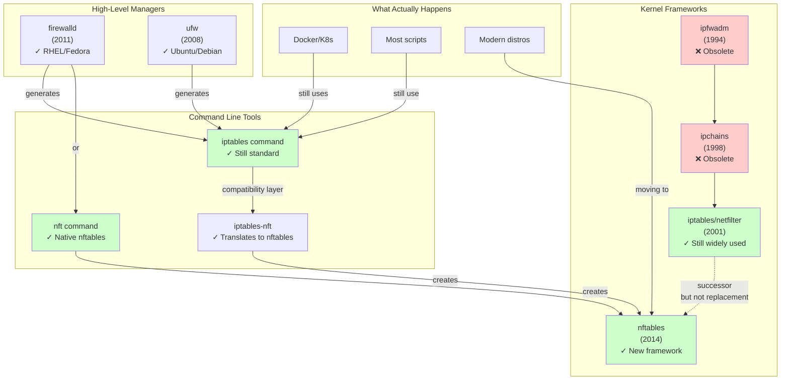
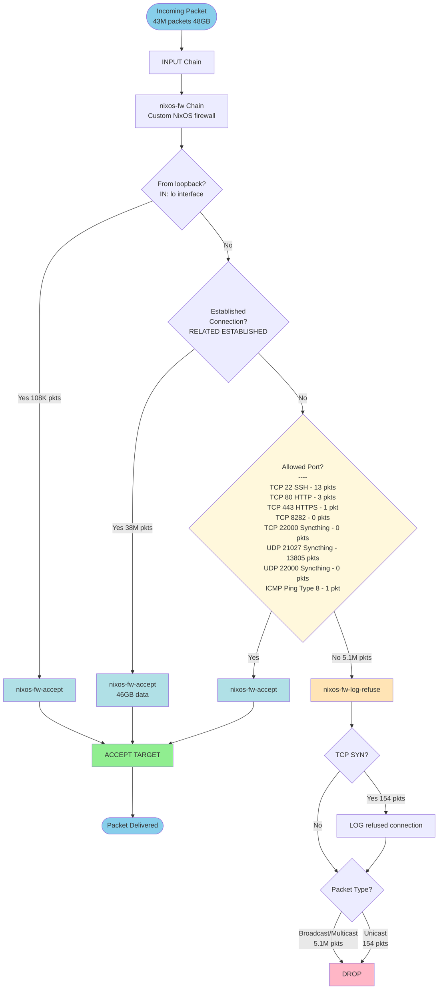

## Networking
### Resolv

Ok, so to start i have a vague idea of what this is about... telling which namesevers to use

```bash
➜ jollof ~ cat /etc/resolv.conf
# Generated by resolvconf
nameserver 192.168.1.1
nameserver fe80::b219:21ff:fe17:61ef%enp45s0f3u2u2
options edns0
```

Ahhhh so apparently a [link local address](https://en.wikipedia.org/wiki/Link-local_address) is typically a 1-to-1 address, which kind of makes sense when networking is broken and I always end up seeing the `169.xxx` style addresses

Accoridng to wiki, the link local addresses are
- ipv4 `169.254.0.0/16`
- ipv6 `fe80::/10`

So...
- the ipv6 nameserver above is a link local address ^
- Can also see the `enp45s0f3u2u2` in the address is the network interface

And the `options edns0` is extremely boring but RFC2671 is... some DNS message extension from the original schema in 1980? honestly no idea not relevant

so apparently `systemd-resolved` adds DNSSEC validation amongst caching and other things
> I CBA to understand DNSSEC properly, the only valid info I think i need is [here on cloudflare](https://www.cloudflare.com/en-gb/learning/dns/dnssec/how-dnssec-works/). adds some more DNS record types like `RRSIG, DNSKEY, DS, NSEC, CDNSKEY`?

So without customising network manager, it will use its own internal DNS resolution, like the one above printed ^

If using network manager and not sure how it was configured (should always be obvious with nixos but anyway). Nmcli does provide some ways to query
```bash
➜ jollof dev-setup (main) ✗ nmcli connection show --active
NAME                UUID                                  TYPE      DEVICE
Wired connection 1  bc3e9c81-f092-3c97-986b-7e9576a0a9f7  ethernet  enp45s0f3u2u2
lo                  0043af43-f1e7-4beb-994a-1b219eb3c8f9  loopback  lo
➜ jollof dev-setup (main) ✗ nmcli device show | grep --ignore-case dns
IP4.DNS[1]:                             192.168.1.1
IP6.DNS[1]:                             fe80::b219:21ff:fe17:61ef
➜ jollof dev-setup (main) ✗
```

Ok i'm spamming claude here, but still trying to get my head round various networking tools here
#### Dig
Dig helps grab DNS info. 

See example to trace all info to `google.com`. can see
- it went via the router (`192.168.1.1`) via port 53
- apparently went via UDP (so not using EDNS0?)

```bash
➜ jollof dev-setup (main) ✗ dig google.com

; <<>> DiG 9.20.12 <<>> google.com
;; global options: +cmd
;; Got answer:
;; ->>HEADER<<- opcode: QUERY, status: NOERROR, id: 64671
;; flags: qr rd ra; QUERY: 1, ANSWER: 6, AUTHORITY: 0, ADDITIONAL: 1

;; OPT PSEUDOSECTION:
; EDNS: version: 0, flags:; udp: 512
;; QUESTION SECTION:
;google.com.                    IN      A

;; ANSWER SECTION:
google.com.             62      IN      A       142.250.140.139
google.com.             62      IN      A       142.250.140.113
google.com.             62      IN      A       142.250.140.100
google.com.             62      IN      A       142.250.140.102
google.com.             62      IN      A       142.250.140.138
google.com.             62      IN      A       142.250.140.101

;; Query time: 10 msec
;; SERVER: 192.168.1.1#53(192.168.1.1) (UDP)
;; WHEN: Sun Oct 12 13:40:18 BST 2025
;; MSG SIZE  rcvd: 135

➜ jollof dev-setup (main) ✗
```

There is a deliberalty configured domain `dnssec-failed.org` that it SHOULD fail dnssec testing on for user testing. Can see here that my route is like all good mate! and returns the IP `96.99.227.255` but cloudflare is like na DNSSEC failed!
```bash
➜ jollof dev-setup (main) ✗ dig @192.168.1.1 dnssec-failed.org

; <<>> DiG 9.20.12 <<>> @192.168.1.1 dnssec-failed.org
; (1 server found)
;; global options: +cmd
;; Got answer:
;; ->>HEADER<<- opcode: QUERY, status: NOERROR, id: 619
;; flags: qr rd ra; QUERY: 1, ANSWER: 1, AUTHORITY: 0, ADDITIONAL: 1

;; OPT PSEUDOSECTION:
; EDNS: version: 0, flags:; udp: 512
;; QUESTION SECTION:
;dnssec-failed.org.             IN      A

;; ANSWER SECTION:
dnssec-failed.org.      229     IN      A       96.99.227.255

;; Query time: 7 msec
;; SERVER: 192.168.1.1#53(192.168.1.1) (UDP)
;; WHEN: Sun Oct 12 13:43:04 BST 2025
;; MSG SIZE  rcvd: 62

➜ jollof dev-setup (main) ✗ dig @1.1.1.1 dnssec-failed.org

; <<>> DiG 9.20.12 <<>> @1.1.1.1 dnssec-failed.org
; (1 server found)
;; global options: +cmd
;; Got answer:
;; ->>HEADER<<- opcode: QUERY, status: SERVFAIL, id: 47524
;; flags: qr rd ra; QUERY: 1, ANSWER: 0, AUTHORITY: 0, ADDITIONAL: 1

;; OPT PSEUDOSECTION:
; EDNS: version: 0, flags:; udp: 1232
; EDE: 9 (DNSKEY Missing): (no SEP matching the DS found for dnssec-failed.org.)
;; QUESTION SECTION:
;dnssec-failed.org.             IN      A

;; Query time: 10 msec
;; SERVER: 1.1.1.1#53(1.1.1.1) (UDP)
;; WHEN: Sun Oct 12 13:43:13 BST 2025
;; MSG SIZE  rcvd: 103

➜ jollof dev-setup (main) ✗
```

#### Getent
I really don't get the point of this command? its a mixture of nslookup combined with a fancy cat? as everything in linux is a file? has it been replaced by something newer?

Apparently it provides a way to use `NSS` (name service switch?)

Can view them here
```bash
➜ jollof dev-setup (main) ✗ cat /etc/nsswitch.conf
passwd:    files systemd
group:     files [success=merge] systemd
shadow:    files
sudoers:   files

hosts:     mymachines files myhostname dns
networks:  files

ethers:    files
services:  files
protocols: files
rpc:       files
➜ jollof dev-setup (main) ✗
```

But I (THINK), from claude obviously, that because linux stores runtime stuffs in a database (somewhere I guess) that there are cases where the runtime state has changed, using `cat` wouldn't show the most up to date state.

Like these are equivalent:
```bash
➜ jollof dev-setup (main) ✗ getent passwd jollof
jollof:x:1002:100:jollof:/home/jollof:/run/current-system/sw/bin/zsh
➜ jollof dev-setup (main) ✗ cat /etc/passwd | grep jollof
jollof:x:1002:100:jollof:/home/jollof:/run/current-system/sw/bin/zsh
➜ jollof dev-setup (main) ✗
```

Yeah i still don't get the point. need to do another map of linux tools and modern ones like i did for cfdisk, parted etc

#### ss
So this (not to be confused with 🇩🇪 ss) is for socket listening.

The classique is `ss -tlnp # -t = TCP, -l = listening, -n = numbers not names, -p = process`


#### diagrams

```mermaid
graph TB
    subgraph "Packet Capture & Analysis"
        tcpdump["tcpdump<br/>(1988)<br/>✓ CLI standard"]
        wireshark["Wireshark<br/>(1998)<br/>✓ GUI standard"]
        tshark["tshark<br/>(Wireshark CLI)<br/>✓ Scripting"]
        
        tcpdump -->|"GUI version"| wireshark
        wireshark -->|"CLI version"| tshark
    end
    
    subgraph "Path & Connectivity"
        ping["ping<br/>(1983)<br/>✓ Universal"]
        traceroute["traceroute<br/>(1988)<br/>✓ Path discovery"]
        tracepath["tracepath<br/>(2000)<br/>✓ No root needed"]
        mtr["mtr<br/>(1997)<br/>✓ Continuous trace"]
        
        ping --> mtr
        traceroute --> mtr
        traceroute -->|"alternative"| tracepath
    end
    
    subgraph "Performance Testing"
        iperf["iperf<br/>(2003)<br/>⚠️ Legacy"]
        iperf3["iperf3<br/>(2014)<br/>✓ Current"]
        netperf["netperf<br/>(1993)<br/>✓ Detailed"]
        
        iperf -->|"rewrite"| iperf3
    end
    
    subgraph "Swiss Army Knives"
        nc["netcat (nc)<br/>(1995)<br/>✓ Basic"]
        socat["socat<br/>(2000)<br/>✓ Advanced"]
        nmap["nmap<br/>(1997)<br/>✓ Port scanning"]
        
        nc -->|"more features"| socat
    end
    
    subgraph "File Transfer"
        wget["wget<br/>(1996)<br/>✓ Simple"]
        curl["curl<br/>(1998)<br/>✓ Full featured"]
        scp["scp<br/>(1999)<br/>⚠️ Security issues"]
        sftp["sftp<br/>(1999)<br/>✓ Secure"]
        rsync["rsync<br/>(1996)<br/>✓ Sync"]
        
        scp -->|"use instead"| sftp
        wget -->|"more features"| curl
    end
    
    style iperf fill:#ffffcc
    style scp fill:#ffffcc
    style tcpdump fill:#ccffcc
    style ping fill:#ccffcc
    style curl fill:#ccffcc
    style iperf3 fill:#ccffcc
```





### Iptables
Ahhh, the beast. So from a high level...

Theres ALOT going on here, from mangling to prerouting and all sorts of other lovely logic.

IPtables by default uses table `filter`, (equivalent to `iptables -t filter`), so represents the three green boxes shown in this diagram


For my work desktop i'll paste the output below
```bash
➜ joelyboy dev-setup (main) ✗ sudo iptables  -L -n -v
Chain INPUT (policy ACCEPT 0 packets, 0 bytes)
 pkts bytes target     prot opt in     out     source               destination
  43M   48G nixos-fw   all  --  *      *       0.0.0.0/0            0.0.0.0/0

Chain FORWARD (policy ACCEPT 0 packets, 0 bytes)
 pkts bytes target     prot opt in     out     source               destination
    0     0 DOCKER-USER  all  --  *      *       0.0.0.0/0            0.0.0.0/0
    0     0 DOCKER-ISOLATION-STAGE-1  all  --  *      *       0.0.0.0/0            0.0.0.0/0
    0     0 ACCEPT     all  --  *      docker0  0.0.0.0/0            0.0.0.0/0            ctstate RELATED,ESTABLISHED
    0     0 DOCKER     all  --  *      docker0  0.0.0.0/0            0.0.0.0/0
    0     0 ACCEPT     all  --  docker0 !docker0  0.0.0.0/0            0.0.0.0/0
    0     0 ACCEPT     all  --  docker0 docker0  0.0.0.0/0            0.0.0.0/0

Chain OUTPUT (policy ACCEPT 0 packets, 0 bytes)
 pkts bytes target     prot opt in     out     source               destination

Chain DOCKER (1 references)
 pkts bytes target     prot opt in     out     source               destination

Chain DOCKER-ISOLATION-STAGE-1 (1 references)
 pkts bytes target     prot opt in     out     source               destination
    0     0 DOCKER-ISOLATION-STAGE-2  all  --  docker0 !docker0  0.0.0.0/0            0.0.0.0/0
    0     0 RETURN     all  --  *      *       0.0.0.0/0            0.0.0.0/0

Chain DOCKER-ISOLATION-STAGE-2 (1 references)
 pkts bytes target     prot opt in     out     source               destination
    0     0 DROP       all  --  *      docker0  0.0.0.0/0            0.0.0.0/0
    0     0 RETURN     all  --  *      *       0.0.0.0/0            0.0.0.0/0

Chain DOCKER-USER (1 references)
 pkts bytes target     prot opt in     out     source               destination
    0     0 RETURN     all  --  *      *       0.0.0.0/0            0.0.0.0/0

Chain nixos-fw (1 references)
 pkts bytes target     prot opt in     out     source               destination
 109K   44M nixos-fw-accept  all  --  lo     *       0.0.0.0/0            0.0.0.0/0
  38M   47G nixos-fw-accept  all  --  *      *       0.0.0.0/0            0.0.0.0/0            ctstate RELATED,ESTABLISHED
   13   780 nixos-fw-accept  tcp  --  *      *       0.0.0.0/0            0.0.0.0/0            tcp dpt:22
    3   180 nixos-fw-accept  tcp  --  *      *       0.0.0.0/0            0.0.0.0/0            tcp dpt:80
    1    60 nixos-fw-accept  tcp  --  *      *       0.0.0.0/0            0.0.0.0/0            tcp dpt:443
    0     0 nixos-fw-accept  tcp  --  *      *       0.0.0.0/0            0.0.0.0/0            tcp dpt:8282
    0     0 nixos-fw-accept  tcp  --  *      *       0.0.0.0/0            0.0.0.0/0            tcp dpt:22000
13880 3692K nixos-fw-accept  udp  --  *      *       0.0.0.0/0            0.0.0.0/0            udp dpt:21027
    0     0 nixos-fw-accept  udp  --  *      *       0.0.0.0/0            0.0.0.0/0            udp dpt:22000
    1    84 nixos-fw-accept  icmp --  *      *       0.0.0.0/0            0.0.0.0/0            icmptype 8
5141K 1483M nixos-fw-log-refuse  all  --  *      *       0.0.0.0/0            0.0.0.0/0

Chain nixos-fw-accept (10 references)
 pkts bytes target     prot opt in     out     source               destination
  38M   47G ACCEPT     all  --  *      *       0.0.0.0/0            0.0.0.0/0

Chain nixos-fw-log-refuse (1 references)
 pkts bytes target     prot opt in     out     source               destination
  154  9240 LOG        tcp  --  *      *       0.0.0.0/0            0.0.0.0/0            tcp flags:0x17/0x02 LOG flags 0 level 6 prefix "refused connection: "
5141K 1483M nixos-fw-refuse  all  --  *      *       0.0.0.0/0            0.0.0.0/0            PKTTYPE != unicast
  154  9240 nixos-fw-refuse  all  --  *      *       0.0.0.0/0            0.0.0.0/0

Chain nixos-fw-refuse (2 references)
 pkts bytes target     prot opt in     out     source               destination
5141K 1483M DROP       all  --  *      *       0.0.0.0/0            0.0.0.0/0
➜ joelyboy dev-setup (main) ✗
```

And, claude has helpfully created a diagram to show how these link together

> TODO still not sure how those docker tables work? they aren't even connected?



